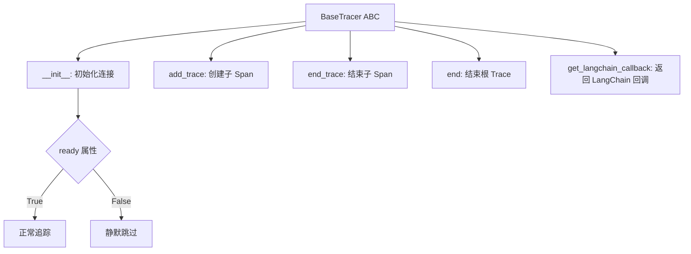
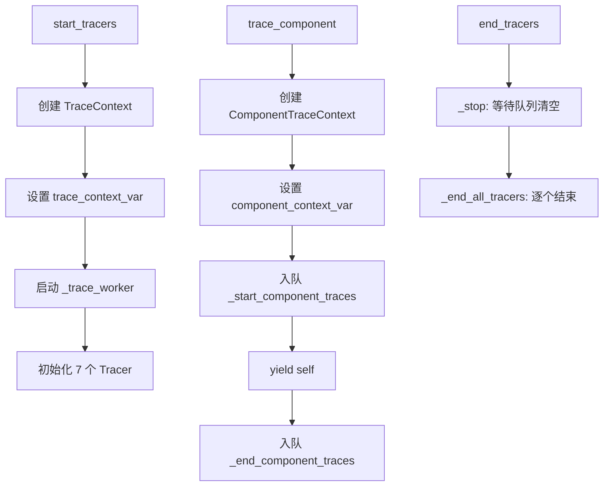
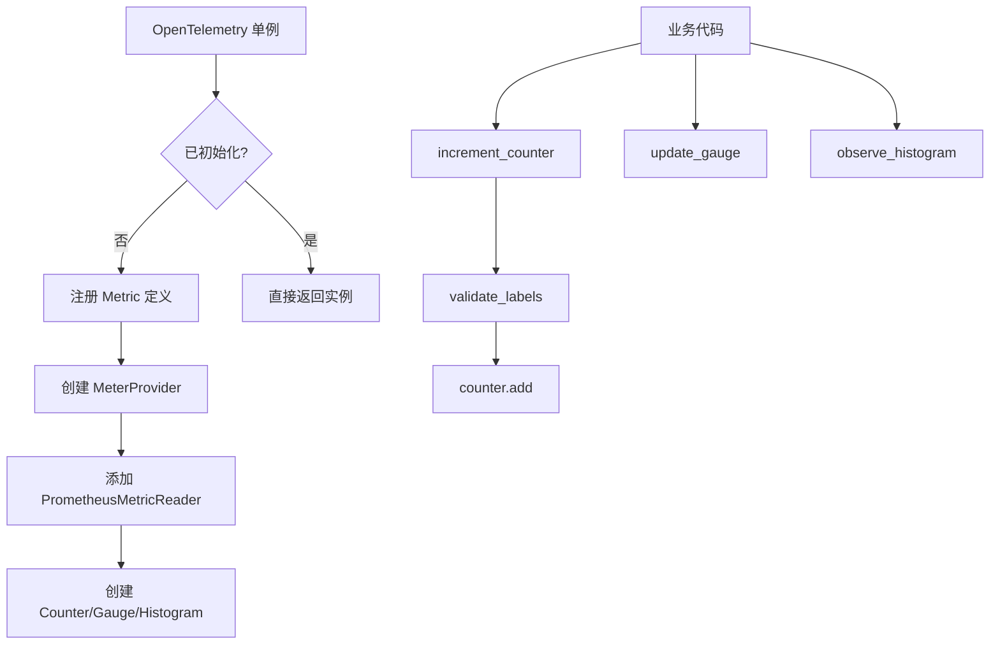

# PD-11.20 Langflow — 7 Tracer 适配器 + OTel/Prometheus 双轨可观测

> 文档编号：PD-11.20
> 来源：Langflow `src/backend/base/langflow/services/tracing/service.py`
> GitHub：https://github.com/langflow-ai/langflow.git
> 问题域：PD-11 可观测性 Observability & Cost Tracking
> 状态：可复用方案

---

## 第 1 章 问题与动机

### 1.1 核心问题

低代码/可视化 Agent 编排平台面临的可观测性挑战与纯代码项目截然不同：

1. **用户群体多样**：从无代码用户到专业开发者，对可观测性后端的偏好差异极大——有人用 LangSmith，有人用 LangFuse，有人用自建 Phoenix
2. **组件粒度追踪**：每个可视化节点（Vertex）都是独立的追踪单元，需要在 DAG 执行过程中为每个组件创建子 Span
3. **异步队列化写入**：追踪数据的写入不能阻塞 DAG 执行主路径，否则会拖慢用户感知的响应时间
4. **敏感数据脱敏**：组件输入中可能包含 API Key、密码等敏感信息，追踪前必须自动脱敏
5. **Prometheus 指标导出**：除了分布式追踪，还需要聚合指标（Counter/Gauge/Histogram）供 Grafana 等监控系统消费

### 1.2 Langflow 的解法概述

Langflow 采用 **BaseTracer 抽象 + 7 适配器 + 异步队列 + OTel Prometheus** 的四层架构：

1. **BaseTracer ABC**（`base.py:16`）：定义 `add_trace / end_trace / end / get_langchain_callback` 四个抽象方法，所有 Tracer 适配器必须实现
2. **7 个具体适配器**：LangSmith / LangFuse / LangWatch / ArizePhoenix / Opik / Traceloop / Openlayer，每个适配器通过环境变量自动检测是否启用
3. **TracingService 异步队列**（`service.py:90`）：使用 `asyncio.Queue` + worker task 将追踪操作异步化，避免阻塞 DAG 执行
4. **ContextVar 双层上下文**（`service.py:68-69`）：`trace_context_var`（图级）和 `component_context_var`（组件级）两个 ContextVar 管理追踪上下文
5. **OpenTelemetry 单例**（`opentelemetry.py:108`）：线程安全单例管理 Prometheus 指标注册和导出

### 1.3 设计思想

| 设计原则 | 具体实现 | 理由 | 替代方案 |
|----------|----------|------|----------|
| 环境变量驱动激活 | 每个 Tracer 的 `_get_config()` 检查对应环境变量 | 零配置：设了环境变量就启用，不设就跳过 | 配置文件集中管理（更复杂） |
| 懒加载 import | `_get_langsmith_tracer()` 等函数延迟 import | 避免未安装的 SDK 导致启动失败 | 全局 import + try/except（污染命名空间） |
| 异步队列解耦 | `traces_queue: asyncio.Queue` + worker task | 追踪写入不阻塞 DAG 执行 | 同步写入（阻塞）或线程池（GIL 竞争） |
| 双层 ContextVar | `trace_context_var` + `component_context_var` | 图级和组件级追踪上下文独立管理 | 单一全局变量（并发不安全） |
| 敏感数据递归脱敏 | `_cleanup_inputs()` 递归遍历 dict 脱敏 | 防止 API Key 等泄露到追踪后端 | 依赖各 Tracer 自行脱敏（不可靠） |
| 线程安全单例 | `ThreadSafeSingletonMetaUsingWeakref` 元类 | OTel MeterProvider 全局唯一 | 模块级全局变量（无法控制生命周期） |

---

## 第 2 章 源码实现分析

### 2.1 架构概览

```
┌─────────────────────────────────────────────────────────────────┐
│                        TracingService                           │
│  ┌──────────────┐  ┌──────────────┐  ┌───────────────────────┐  │
│  │trace_context  │  │component_ctx │  │ asyncio.Queue         │  │
│  │  _var (图级)  │  │  _var (组件) │  │  + worker task        │  │
│  └──────┬───────┘  └──────┬───────┘  └───────────┬───────────┘  │
│         │                 │                      │              │
│         ▼                 ▼                      ▼              │
│  ┌─────────────────────────────────────────────────────────┐    │
│  │              TraceContext.tracers: dict                  │    │
│  │  ┌──────────┬──────────┬──────────┬──────────────────┐  │    │
│  │  │LangSmith │LangFuse  │LangWatch │ArizePhoenix      │  │    │
│  │  │Tracer    │Tracer    │Tracer    │Tracer            │  │    │
│  │  ├──────────┼──────────┼──────────┼──────────────────┤  │    │
│  │  │Opik      │Traceloop │Openlayer │ (all BaseTracer) │  │    │
│  │  │Tracer    │Tracer    │Tracer    │                  │  │    │
│  │  └──────────┴──────────┴──────────┴──────────────────┘  │    │
│  └─────────────────────────────────────────────────────────┘    │
└─────────────────────────────────────────────────────────────────┘

┌─────────────────────────────────────────────────────────────────┐
│                    TelemetryService                             │
│  ┌──────────────┐  ┌──────────────┐  ┌───────────────────────┐  │
│  │ httpx client │  │ asyncio.Queue│  │ OpenTelemetry         │  │
│  │ (Scarf pixel)│  │ + worker     │  │ (Prometheus export)   │  │
│  └──────────────┘  └──────────────┘  └───────────────────────┘  │
└─────────────────────────────────────────────────────────────────┘
```

Langflow 的可观测性分为两个独立的 Service：
- **TracingService**：管理 7 个 Tracer 适配器，负责分布式追踪（Span 级别）
- **TelemetryService**：管理产品遥测（版本、运行时长、异常）+ OTel Prometheus 指标

### 2.2 核心实现

#### 2.2.1 BaseTracer 抽象与 7 适配器



对应源码 `src/backend/base/langflow/services/tracing/base.py:16-71`：

```python
class BaseTracer(ABC):
    trace_id: UUID

    @abstractmethod
    def __init__(
        self,
        trace_name: str,
        trace_type: str,
        project_name: str,
        trace_id: UUID,
        user_id: str | None = None,
        session_id: str | None = None,
    ) -> None:
        raise NotImplementedError

    @property
    @abstractmethod
    def ready(self) -> bool:
        raise NotImplementedError

    @abstractmethod
    def add_trace(
        self,
        trace_id: str,
        trace_name: str,
        trace_type: str,
        inputs: dict[str, Any],
        metadata: dict[str, Any] | None = None,
        vertex: Vertex | None = None,
    ) -> None:
        raise NotImplementedError

    @abstractmethod
    def end_trace(self, trace_id: str, trace_name: str,
                  outputs: dict[str, Any] | None = None,
                  error: Exception | None = None,
                  logs: Sequence[Log | dict] = ()) -> None:
        raise NotImplementedError

    @abstractmethod
    def end(self, inputs: dict[str, Any], outputs: dict[str, Any],
            error: Exception | None = None,
            metadata: dict[str, Any] | None = None) -> None:
        raise NotImplementedError

    @abstractmethod
    def get_langchain_callback(self) -> BaseCallbackHandler | None:
        raise NotImplementedError
```

关键设计：`ready` 属性是核心门控——每个适配器在 `__init__` 中检测环境变量和 SDK 可用性，不满足条件时 `ready=False`，所有后续调用静默跳过。

#### 2.2.2 TracingService 异步队列与 ContextVar



对应源码 `src/backend/base/langflow/services/tracing/service.py:136-144`：

```python
async def _trace_worker(self, trace_context: TraceContext) -> None:
    while trace_context.running or not trace_context.traces_queue.empty():
        trace_func, args = await trace_context.traces_queue.get()
        try:
            trace_func(*args)
        except Exception:  # noqa: BLE001
            await logger.aexception("Error processing trace_func")
        finally:
            trace_context.traces_queue.task_done()
```

Worker 从 `asyncio.Queue` 中取出 `(func, args)` 元组并执行。注意 `trace_func(*args)` 是同步调用——各 Tracer 的 `add_trace/end_trace` 都是同步方法，在 worker 的事件循环中串行执行，避免了并发写入同一 Tracer 的竞态问题。

#### 2.2.3 敏感数据脱敏

对应源码 `src/backend/base/langflow/services/tracing/service.py:314-329`：

```python
@staticmethod
def _cleanup_inputs(inputs: dict[str, Any]):
    inputs = inputs.copy()
    sensitive_keywords = {"api_key", "password", "server_url"}

    def _mask(obj: Any):
        if isinstance(obj, dict):
            return {
                k: "*****" if any(word in k.lower() for word in sensitive_keywords)
                else _mask(v)
                for k, v in obj.items()
            }
        if isinstance(obj, list):
            return [_mask(i) for i in obj]
        return obj

    return _mask(inputs)
```

递归遍历所有嵌套 dict/list，对包含 `api_key`、`password`、`server_url` 的键值替换为 `*****`。

#### 2.2.4 OpenTelemetry Prometheus 指标



对应源码 `src/backend/base/langflow/services/telemetry/opentelemetry.py:108-178`：

```python
class OpenTelemetry(metaclass=ThreadSafeSingletonMetaUsingWeakref):
    _metrics_registry: dict[str, Metric] = {}
    _metrics: dict[str, Counter | ObservableGaugeWrapper | Histogram | UpDownCounter] = {}
    _meter_provider: MeterProvider | None = None
    _initialized: bool = False

    def __init__(self, *, prometheus_enabled: bool = True):
        self.prometheus_enabled = prometheus_enabled
        if OpenTelemetry._initialized:
            return
        if not self._metrics_registry:
            self._register_metric()
        if self._meter_provider is None:
            existing_provider = metrics.get_meter_provider()
            if hasattr(existing_provider, "get_meter") and existing_provider.get_meter("http.server"):
                self._meter_provider = existing_provider
            else:
                resource = Resource.create({"service.name": "langflow"})
                metric_readers = []
                if self.prometheus_enabled:
                    metric_readers.append(PrometheusMetricReader())
                self._meter_provider = MeterProvider(resource=resource, metric_readers=metric_readers)
                metrics.set_meter_provider(self._meter_provider)
        self.meter = self._meter_provider.get_meter(langflow_meter_name)
        # ... create metrics from registry
        OpenTelemetry._initialized = True
```

关键点：使用 `WeakValueDictionary` 的线程安全单例元类，确保 OTel MeterProvider 全局唯一。同时检测是否已有 FastAPI instrumentation 设置的 provider，避免覆盖。

### 2.3 实现细节

**7 个适配器的差异化实现：**

| 适配器 | 环境变量 | Span 协议 | LangChain 回调 | 特殊处理 |
|--------|----------|-----------|----------------|----------|
| LangSmith | `LANGCHAIN_API_KEY` | LangSmith RunTree | 无（返回 None） | 自动检测父 RunTree 避免重复 |
| LangFuse | `LANGFUSE_SECRET_KEY` + `PUBLIC_KEY` + `HOST` | Langfuse Span | `get_langchain_handler()` | 健康检查 1s 超时 |
| LangWatch | `LANGWATCH_API_KEY` | OTel OTLP Span | `get_langchain_callback()` | 共享 TracerProvider 避免覆盖全局 |
| ArizePhoenix | `ARIZE_API_KEY` 或 `PHOENIX_API_KEY` | OTel Span + OpenInference | 无 | 支持 Arize Cloud + Phoenix 双端点 |
| Opik | `OPIK_API_KEY` 或 `OPIK_URL_OVERRIDE` | Opik SpanData | `OpikTracer` LangChain 集成 | 分布式追踪 header 传播 |
| Traceloop | `TRACELOOP_API_KEY` | OTel Span | 无 | URL 校验 + `disable_batch=True` |
| Openlayer | `OPENLAYER_API_KEY` + pipeline ID | Openlayer Step | `AsyncOpenlayerHandler` | 支持 flow 级别 pipeline 映射 |

**LangWatch 的全局 TracerProvider 隔离**（`langwatch.py:64-96`）：LangWatch 创建独立的 `TracerProvider` 并设为类变量共享，调用 `langwatch.setup(skip_open_telemetry_setup=True)` 避免覆盖 FastAPI 的全局 OTel provider。这是多 OTel 后端共存的关键技巧。

**Openlayer 的 Token 聚合**（`openlayer.py:331-389`）：`_aggregate_llm_data()` 递归遍历嵌套 Step 树，从所有 `chat_completion` 类型的 Step 中聚合 `promptTokens`、`completionTokens`、`cost`，解决了 SDK 只读取根 Step token 数据的限制。


---

## 第 3 章 迁移指南

### 3.1 迁移清单

**阶段 1：BaseTracer 抽象层（1 个文件）**
- [ ] 定义 `BaseTracer` ABC，包含 `__init__` / `ready` / `add_trace` / `end_trace` / `end` / `get_langchain_callback`
- [ ] 每个方法的签名保持与 Langflow 一致，便于直接复用适配器代码

**阶段 2：TracingService 核心（1 个文件）**
- [ ] 实现 `TracingService`，包含 `asyncio.Queue` + worker task
- [ ] 实现双层 `ContextVar`：图级 `trace_context_var` + 组件级 `component_context_var`
- [ ] 实现 `_cleanup_inputs()` 敏感数据脱敏
- [ ] 实现 `trace_component` 异步上下文管理器

**阶段 3：选择性实现适配器（按需）**
- [ ] 根据团队使用的追踪后端，实现对应的 Tracer 适配器
- [ ] 每个适配器遵循：环境变量检测 → 懒加载 import → 健康检查 → `ready` 门控

**阶段 4：OTel Prometheus 指标（可选）**
- [ ] 实现 `OpenTelemetry` 单例，注册自定义 Metric
- [ ] 添加 `PrometheusMetricReader` 导出

### 3.2 适配代码模板

以下是一个最小化的 BaseTracer + TracingService 实现模板：

```python
"""minimal_tracing.py — 可直接运行的最小化追踪框架"""
from __future__ import annotations

import asyncio
from abc import ABC, abstractmethod
from collections import defaultdict
from contextlib import asynccontextmanager
from contextvars import ContextVar
from typing import Any
from uuid import UUID


class BaseTracer(ABC):
    """追踪适配器基类，所有后端必须实现。"""
    
    @abstractmethod
    def __init__(self, trace_name: str, trace_type: str,
                 project_name: str, trace_id: UUID) -> None: ...

    @property
    @abstractmethod
    def ready(self) -> bool: ...

    @abstractmethod
    def add_trace(self, trace_id: str, trace_name: str,
                  trace_type: str, inputs: dict) -> None: ...

    @abstractmethod
    def end_trace(self, trace_id: str, trace_name: str,
                  outputs: dict | None = None,
                  error: Exception | None = None) -> None: ...

    @abstractmethod
    def end(self, inputs: dict, outputs: dict,
            error: Exception | None = None) -> None: ...


class TraceContext:
    """图级追踪上下文，持有所有活跃的 Tracer 实例。"""
    
    def __init__(self, run_id: UUID, run_name: str, project_name: str):
        self.run_id = run_id
        self.run_name = run_name
        self.project_name = project_name
        self.tracers: dict[str, BaseTracer] = {}
        self.all_inputs: dict[str, dict] = defaultdict(dict)
        self.all_outputs: dict[str, dict] = defaultdict(dict)
        self.traces_queue: asyncio.Queue = asyncio.Queue()
        self.running = False
        self.worker_task: asyncio.Task | None = None


# 双层 ContextVar
trace_ctx_var: ContextVar[TraceContext | None] = ContextVar("trace_ctx", default=None)
component_ctx_var: ContextVar[dict | None] = ContextVar("component_ctx", default=None)

SENSITIVE_KEYWORDS = {"api_key", "password", "secret", "token"}


def cleanup_inputs(inputs: dict[str, Any]) -> dict[str, Any]:
    """递归脱敏敏感字段。"""
    def _mask(obj):
        if isinstance(obj, dict):
            return {k: "*****" if any(w in k.lower() for w in SENSITIVE_KEYWORDS)
                    else _mask(v) for k, v in obj.items()}
        if isinstance(obj, list):
            return [_mask(i) for i in obj]
        return obj
    return _mask(inputs.copy())


class TracingService:
    """异步追踪服务，队列化写入避免阻塞主路径。"""
    
    def __init__(self, tracer_factories: dict[str, type[BaseTracer]] | None = None):
        self.tracer_factories = tracer_factories or {}
        self.deactivated = False

    async def _trace_worker(self, ctx: TraceContext) -> None:
        while ctx.running or not ctx.traces_queue.empty():
            func, args = await ctx.traces_queue.get()
            try:
                func(*args)
            except Exception as e:
                print(f"Trace error: {e}")
            finally:
                ctx.traces_queue.task_done()

    async def start_tracers(self, run_id: UUID, run_name: str,
                            project_name: str = "default") -> None:
        if self.deactivated:
            return
        ctx = TraceContext(run_id, run_name, project_name)
        trace_ctx_var.set(ctx)
        ctx.running = True
        ctx.worker_task = asyncio.create_task(self._trace_worker(ctx))
        # 初始化所有注册的 Tracer
        for name, factory in self.tracer_factories.items():
            try:
                tracer = factory(
                    trace_name=run_name, trace_type="chain",
                    project_name=project_name, trace_id=run_id,
                )
                if tracer.ready:
                    ctx.tracers[name] = tracer
            except Exception:
                pass  # 静默跳过不可用的 Tracer

    @asynccontextmanager
    async def trace_component(self, trace_name: str, inputs: dict):
        if self.deactivated:
            yield self
            return
        ctx = trace_ctx_var.get()
        if ctx is None:
            yield self
            return
        cleaned = cleanup_inputs(inputs)
        ctx.all_inputs[trace_name] |= cleaned
        # 入队 start
        for tracer in ctx.tracers.values():
            if tracer.ready:
                await ctx.traces_queue.put(
                    (tracer.add_trace, (trace_name, trace_name, "chain", cleaned))
                )
        try:
            yield self
        except Exception as e:
            for tracer in ctx.tracers.values():
                if tracer.ready:
                    await ctx.traces_queue.put(
                        (tracer.end_trace, (trace_name, trace_name, None, e))
                    )
            raise
        else:
            for tracer in ctx.tracers.values():
                if tracer.ready:
                    outputs = ctx.all_outputs.get(trace_name, {})
                    await ctx.traces_queue.put(
                        (tracer.end_trace, (trace_name, trace_name, outputs, None))
                    )

    async def end_tracers(self, outputs: dict,
                          error: Exception | None = None) -> None:
        if self.deactivated:
            return
        ctx = trace_ctx_var.get()
        if ctx is None:
            return
        ctx.running = False
        if not ctx.traces_queue.empty():
            await ctx.traces_queue.join()
        if ctx.worker_task:
            ctx.worker_task.cancel()
        for tracer in ctx.tracers.values():
            if tracer.ready:
                tracer.end(ctx.all_inputs, ctx.all_outputs, error)
```

### 3.3 适用场景

| 场景 | 适用度 | 说明 |
|------|--------|------|
| 多追踪后端共存 | ⭐⭐⭐ | 核心优势：7 个适配器同时激活互不干扰 |
| 低代码/可视化编排平台 | ⭐⭐⭐ | 组件粒度追踪 + DAG 执行路径天然匹配 |
| 需要 Prometheus 指标的 Agent 系统 | ⭐⭐⭐ | OTel 单例 + PrometheusMetricReader 开箱即用 |
| 单一追踪后端的简单 Agent | ⭐⭐ | 架构偏重，单后端场景可简化 |
| 高吞吐实时推理服务 | ⭐ | asyncio.Queue 单 worker 可能成为瓶颈 |

---

## 第 4 章 测试用例

```python
"""test_langflow_tracing.py — 基于 Langflow 真实接口的测试"""
import asyncio
import uuid
from collections import defaultdict
from unittest.mock import MagicMock, patch

import pytest


# ---- 模拟 BaseTracer 实现 ----
class MockTracer:
    """模拟 Tracer，记录所有调用。"""
    def __init__(self, trace_name, trace_type, project_name, trace_id, **kwargs):
        self.trace_name = trace_name
        self.trace_id = trace_id
        self._ready = True
        self.calls = []

    @property
    def ready(self):
        return self._ready

    def add_trace(self, trace_id, trace_name, trace_type, inputs, metadata=None, vertex=None):
        self.calls.append(("add_trace", trace_id, trace_name, inputs))

    def end_trace(self, trace_id, trace_name, outputs=None, error=None, logs=()):
        self.calls.append(("end_trace", trace_id, trace_name, outputs))

    def end(self, inputs, outputs, error=None, metadata=None):
        self.calls.append(("end", inputs, outputs))

    def get_langchain_callback(self):
        return None


class TestCleanupInputs:
    """测试敏感数据脱敏。"""

    def test_masks_api_key(self):
        from langflow.services.tracing.service import TracingService
        result = TracingService._cleanup_inputs({"api_key": "sk-123", "name": "test"})
        assert result["api_key"] == "*****"
        assert result["name"] == "test"

    def test_masks_nested_password(self):
        from langflow.services.tracing.service import TracingService
        result = TracingService._cleanup_inputs({
            "config": {"password": "secret", "host": "localhost"}
        })
        assert result["config"]["password"] == "*****"
        assert result["config"]["host"] == "localhost"

    def test_masks_in_list(self):
        from langflow.services.tracing.service import TracingService
        result = TracingService._cleanup_inputs({
            "items": [{"api_key": "key1"}, {"name": "safe"}]
        })
        assert result["items"][0]["api_key"] == "*****"
        assert result["items"][1]["name"] == "safe"

    def test_preserves_non_sensitive(self):
        from langflow.services.tracing.service import TracingService
        original = {"model": "gpt-4", "temperature": 0.7}
        result = TracingService._cleanup_inputs(original)
        assert result == original


class TestTracingServiceLifecycle:
    """测试 TracingService 生命周期。"""

    @pytest.mark.asyncio
    async def test_deactivated_skips_all(self):
        """deactivated=True 时所有操作静默跳过。"""
        from langflow.services.tracing.service import TracingService
        settings = MagicMock()
        settings.settings.deactivate_tracing = True
        svc = TracingService(settings)
        # 不应抛异常
        await svc.start_tracers(uuid.uuid4(), "test", None, None)
        await svc.end_tracers({})

    @pytest.mark.asyncio
    async def test_trace_context_var_set(self):
        """start_tracers 应设置 trace_context_var。"""
        from langflow.services.tracing.service import TracingService, trace_context_var
        settings = MagicMock()
        settings.settings.deactivate_tracing = False
        svc = TracingService(settings)
        run_id = uuid.uuid4()
        with patch.dict("os.environ", {"LANGCHAIN_PROJECT": "test"}):
            await svc.start_tracers(run_id, "test-run", None, None)
        ctx = trace_context_var.get()
        assert ctx is not None
        assert ctx.run_id == run_id
        await svc.end_tracers({})


class TestOpenTelemetrySingleton:
    """测试 OTel 单例行为。"""

    def test_singleton_returns_same_instance(self):
        from langflow.services.telemetry.opentelemetry import OpenTelemetry
        # 重置状态
        OpenTelemetry._initialized = False
        OpenTelemetry._meter_provider = None
        a = OpenTelemetry(prometheus_enabled=False)
        b = OpenTelemetry(prometheus_enabled=False)
        assert a is b
        a.shutdown()

    def test_label_validation(self):
        from langflow.services.telemetry.opentelemetry import OpenTelemetry
        OpenTelemetry._initialized = False
        OpenTelemetry._meter_provider = None
        ot = OpenTelemetry(prometheus_enabled=False)
        with pytest.raises(ValueError, match="Missing required labels"):
            ot.increment_counter("num_files_uploaded", {})
        ot.shutdown()


class TestTracerReadyGating:
    """测试 ready=False 时的静默跳过。"""

    def test_langfuse_not_ready_without_env(self):
        """无环境变量时 LangFuseTracer.ready 应为 False。"""
        with patch.dict("os.environ", {}, clear=True):
            from langflow.services.tracing.langfuse import LangFuseTracer
            tracer = LangFuseTracer(
                trace_name="test", trace_type="chain",
                project_name="test", trace_id=uuid.uuid4(),
            )
            assert tracer.ready is False
```


---

## 第 5 章 跨域关联

| 关联域 | 关系类型 | 说明 |
|--------|----------|------|
| PD-01 上下文管理 | 协同 | TracingService 的 `_cleanup_inputs` 在追踪前脱敏，与上下文压缩互补——压缩减少 token，脱敏保护隐私 |
| PD-02 多 Agent 编排 | 依赖 | TracingService 的双层 ContextVar 设计直接服务于 DAG 编排——图级 TraceContext 对应一次完整的 Flow 执行，组件级 ComponentTraceContext 对应 DAG 中每个节点 |
| PD-03 容错与重试 | 协同 | 每个 Tracer 的 `ready` 门控和 `try/except` 包裹确保单个追踪后端故障不影响 DAG 执行，与容错设计理念一致 |
| PD-04 工具系统 | 协同 | `get_langchain_callback()` 方法让 Tracer 能注入 LangChain 工具调用链，实现工具级别的追踪粒度 |
| PD-10 中间件管道 | 协同 | TracingService 本身可视为一个中间件——在组件执行前后注入追踪逻辑，`trace_component` 的 asynccontextmanager 模式与中间件管道天然兼容 |

---

## 第 6 章 来源文件索引

| 文件 | 行范围 | 关键实现 |
|------|--------|----------|
| `src/backend/base/langflow/services/tracing/base.py` | L16-L71 | BaseTracer ABC 定义，4 个抽象方法 + ready 属性 |
| `src/backend/base/langflow/services/tracing/service.py` | L68-L69 | 双层 ContextVar 定义（trace_context_var + component_context_var） |
| `src/backend/base/langflow/services/tracing/service.py` | L116-L486 | TracingService 完整实现：异步队列、7 Tracer 初始化、trace_component 上下文管理器 |
| `src/backend/base/langflow/services/tracing/service.py` | L136-L144 | _trace_worker 异步队列消费者 |
| `src/backend/base/langflow/services/tracing/service.py` | L314-L329 | _cleanup_inputs 敏感数据递归脱敏 |
| `src/backend/base/langflow/services/tracing/langsmith.py` | L27-L209 | LangSmith 适配器：RunTree 管理、父子 Span 链接 |
| `src/backend/base/langflow/services/tracing/langfuse.py` | L24-L171 | LangFuse 适配器：健康检查 + OrderedDict Span 管理 |
| `src/backend/base/langflow/services/tracing/langwatch.py` | L27-L211 | LangWatch 适配器：独立 TracerProvider + nanoid Span ID |
| `src/backend/base/langflow/services/tracing/arize_phoenix.py` | L67-L427 | ArizePhoenix 适配器：OTel Span + OpenInference 语义 + 双端点支持 |
| `src/backend/base/langflow/services/tracing/opik.py` | L31-L236 | Opik 适配器：分布式追踪 header + auth check |
| `src/backend/base/langflow/services/tracing/traceloop.py` | L33-L245 | Traceloop 适配器：URL 校验 + OTel Span |
| `src/backend/base/langflow/services/tracing/openlayer.py` | L43-L798 | Openlayer 适配器：Step 层级构建 + Token 聚合 + LangChain 回调集成 |
| `src/backend/base/langflow/services/telemetry/opentelemetry.py` | L108-L266 | OpenTelemetry 单例：线程安全元类 + Prometheus 指标注册/导出 |
| `src/backend/base/langflow/services/telemetry/service.py` | L35-L269 | TelemetryService：产品遥测 + httpx 异步发送 + DO_NOT_TRACK 尊重 |
| `src/backend/base/langflow/services/telemetry/schema.py` | L1-L265 | 遥测 Payload 定义：Run/Version/Component/Exception + URL 分块 |
| `src/backend/base/langflow/services/tracing/schema.py` | L1-L21 | Log 模型：Pydantic 序列化 + 降级 fallback |
| `src/backend/base/langflow/services/tracing/factory.py` | L1-L21 | TracingServiceFactory：ServiceFactory 模式创建 TracingService |

---

## 第 7 章 横向对比维度

```json comparison_data
{
  "project": "Langflow",
  "dimensions": {
    "追踪方式": "BaseTracer ABC + 7 适配器并行广播，asyncio.Queue 异步写入",
    "数据粒度": "双层 ContextVar：图级 TraceContext + 组件级 ComponentTraceContext",
    "持久化": "各适配器自行持久化到对应后端，无本地文件存储",
    "多提供商": "7 个适配器同时激活：LangSmith/LangFuse/LangWatch/ArizePhoenix/Opik/Traceloop/Openlayer",
    "日志格式": "Pydantic Log 模型 + serialize() 序列化 + 降级 str() fallback",
    "指标采集": "OTel MeterProvider 单例 + PrometheusMetricReader + 4 种 Metric 类型",
    "成本追踪": "Openlayer 适配器递归聚合嵌套 Step 的 promptTokens/completionTokens/cost",
    "业务元数据注入": "每个适配器独立转换 LangFlow 类型到后端兼容格式",
    "Worker日志隔离": "ContextVar 隔离不同 Flow 执行的追踪上下文",
    "健康端点": "LangFuse 1s 超时健康检查，Opik auth_check，Traceloop URL 校验",
    "Span 传播": "ArizePhoenix/Traceloop 用 W3C TraceContext 传播，Opik 用自定义 header",
    "零开销路径": "deactivated 标志 + ready 门控双重检查，未启用时零开销",
    "元数据清洗": "_cleanup_inputs 递归脱敏 api_key/password/server_url",
    "优雅关闭": "TelemetryService.stop() flush 队列 → cancel worker → aclose httpx client",
    "Decorator 插桩": "trace_component asynccontextmanager 包裹组件执行，非侵入式"
  }
}
```

### 域元数据补充

```json domain_metadata
{
  "solution_summary": "Langflow 通过 BaseTracer ABC 统一 7 个追踪后端适配器（LangSmith/LangFuse/LangWatch/ArizePhoenix/Opik/Traceloop/Openlayer），用 asyncio.Queue worker 异步广播 + 双层 ContextVar 管理图级/组件级追踪上下文，结合 OTel Prometheus 单例导出聚合指标",
  "description": "多追踪后端并行广播与环境变量驱动的零配置激活机制",
  "sub_problems": [
    "多 OTel TracerProvider 共存：LangWatch 独立 provider 避免覆盖 FastAPI 全局 provider",
    "嵌套 Step Token 聚合：SDK 只读根 Step 数据，需递归遍历子 Step 汇总 token/cost",
    "LangChain 回调桥接：不同追踪后端对 get_langchain_callback 的支持差异（4 个返回 None）",
    "遥测 URL 分块：GET 请求 URL 超 2KB 时自动分块发送，二分搜索截断过长字段",
    "并发组件 Span 父子关系：DAG 并行执行时 Span 嵌套关系退化为扁平结构"
  ],
  "best_practices": [
    "环境变量驱动零配置激活：设了对应环境变量就启用 Tracer，不设就静默跳过，无需配置文件",
    "懒加载 import 防止启动失败：每个 Tracer 的 SDK import 放在工厂函数内，未安装不影响其他 Tracer",
    "asyncio.Queue 单 worker 串行化：避免多 Tracer 并发写入的竞态，同时不阻塞 DAG 主路径",
    "ready 属性双重门控：__init__ 中检测可用性设 ready，所有方法入口检查 ready 后静默返回",
    "独立 TracerProvider 避免全局污染：多 OTel 后端共存时各自创建 provider，不覆盖全局"
  ]
}
```

