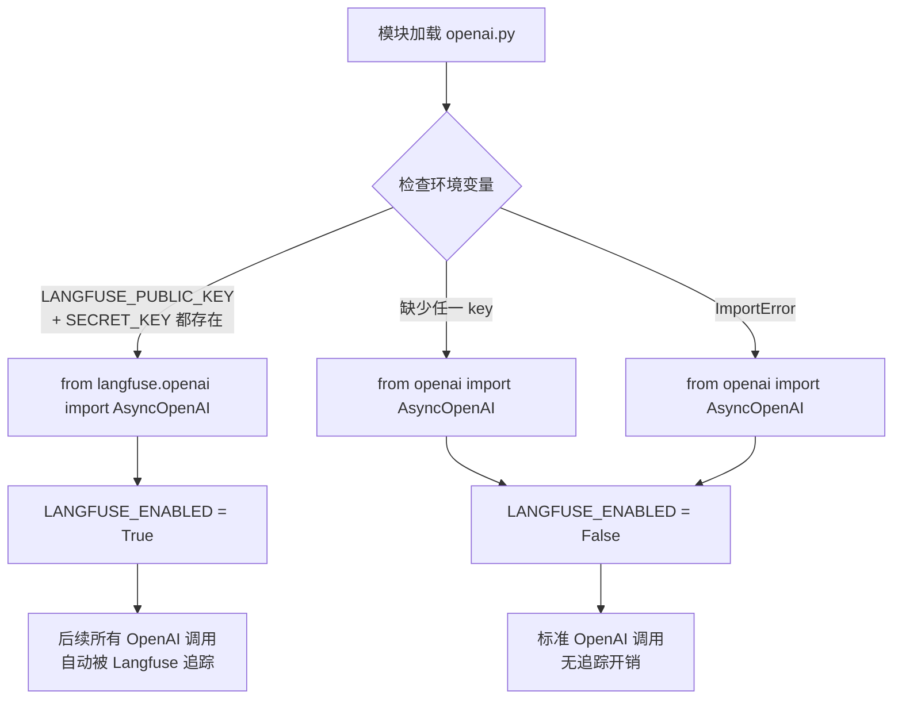
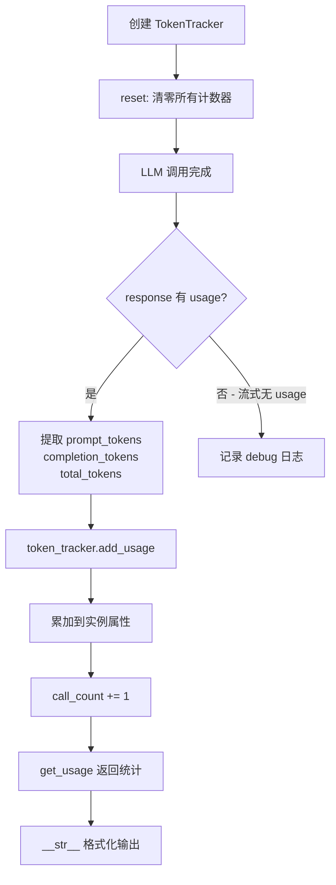

# PD-11.03 LightRAG — Langfuse 零侵入追踪 + 双层统计体系

> 文档编号：PD-11.03
> 来源：LightRAG `lightrag/llm/openai.py`, `lightrag/utils.py`, `lightrag/api/gunicorn_config.py`
> GitHub：https://github.com/HKUDS/LightRAG.git
> 问题域：PD-11 可观测性 Observability & Cost Tracking
> 状态：可复用方案

---

## 第 1 章 问题与动机

### 1.1 核心问题

RAG 系统在生产环境中面临三层可观测性挑战：

1. **LLM 调用不透明**：每次 LLM 调用的输入 prompt、输出内容、token 消耗、延迟等信息散落在日志中，无法结构化查询和可视化分析
2. **缓存命中率不可见**：RAG 系统大量使用 LLM 缓存来降低成本，但缓存命中率、实际调用次数等关键指标缺乏统一追踪
3. **多提供商统计碎片化**：系统同时使用 OpenAI、Gemini、Ollama 等多个 LLM 提供商，每个提供商的 usage 返回格式不同，需要统一的 token 统计接口

LightRAG 的可观测性方案分为两层：外部追踪（Langfuse）和内部统计（TokenTracker + statistic_data），两者互补而非替代。

### 1.2 LightRAG 的解法概述

1. **Langfuse 零侵入集成**：在 `lightrag/llm/openai.py:40-64` 通过环境变量检测自动切换 AsyncOpenAI 客户端为 Langfuse 包装版本，无需修改任何业务代码
2. **TokenTracker 上下文管理器**：在 `lightrag/utils.py:2561-2615` 实现轻量级 token 累加器，支持 `with` 语法自动 reset/print，跨提供商统一 prompt/completion/total 三维统计
3. **statistic_data 全局计数器**：在 `lightrag/utils.py:273` 定义模块级字典追踪 `llm_call`/`llm_cache`/`embed_call` 三个核心指标
4. **结构化日志体系**：在 `lightrag/api/gunicorn_config.py:43-92` 配置 RotatingFileHandler + LightragPathFilter，实现日志轮转和噪声过滤
5. **多提供商 token 适配**：OpenAI 用 `response.usage.prompt_tokens`（`openai.py:601-609`），Gemini 用 `usage_metadata.prompt_token_count`（`gemini.py:376-389`），统一转换为 `{prompt_tokens, completion_tokens, total_tokens}` 字典

### 1.3 设计思想

| 设计原则 | 具体实现 | 理由 | 替代方案 |
|----------|----------|------|----------|
| 零侵入追踪 | 环境变量控制 Langfuse 开关，import 层面替换 AsyncOpenAI | 不修改业务代码，部署时决定是否启用 | 手动在每个调用点注入 tracer（侵入性强） |
| 双层统计互补 | TokenTracker（精确 token）+ statistic_data（调用计数） | token 统计需要 API 返回值，调用计数在缓存层即可统计 | 单一统计层（要么丢失缓存信息，要么丢失 token 精度） |
| 提供商无关的统计接口 | 所有提供商转换为统一的 `{prompt_tokens, completion_tokens, total_tokens}` | 上层代码不关心底层是 OpenAI 还是 Gemini | 每个提供商独立统计（聚合困难） |
| 日志噪声过滤 | LightragPathFilter 过滤高频健康检查路径 | /health、/webui/ 等路径每秒多次请求，淹没有效日志 | 不过滤（日志文件膨胀，有效信息被淹没） |

---

## 第 2 章 源码实现分析

### 2.1 架构概览

LightRAG 的可观测性体系由三个独立但协作的子系统组成：

```
┌─────────────────────────────────────────────────────────────────┐
│                    LightRAG 可观测性架构                          │
├─────────────────────────────────────────────────────────────────┤
│                                                                 │
│  ┌──────────────┐   ┌──────────────────┐   ┌────────────────┐  │
│  │   Langfuse    │   │  TokenTracker    │   │ statistic_data │  │
│  │  (外部追踪)   │   │  (token 精确统计) │   │ (调用计数器)    │  │
│  ├──────────────┤   ├──────────────────┤   ├────────────────┤  │
│  │ 环境变量开关  │   │ add_usage()      │   │ llm_call: int  │  │
│  │ 替换 import  │   │ get_usage()      │   │ llm_cache: int │  │
│  │ 自动 tracing │   │ context manager  │   │ embed_call: int│  │
│  └──────┬───────┘   └────────┬─────────┘   └───────┬────────┘  │
│         │                    │                      │           │
│         ▼                    ▼                      ▼           │
│  ┌──────────────────────────────────────────────────────────┐  │
│  │              LLM Provider Layer (openai/gemini/ollama)    │  │
│  │  openai_complete_if_cache() / gemini_complete_if_cache()  │  │
│  └──────────────────────────────────────────────────────────┘  │
│                              │                                  │
│                              ▼                                  │
│  ┌──────────────────────────────────────────────────────────┐  │
│  │           Structured Logging (Gunicorn + RotatingFile)    │  │
│  │  LightragPathFilter → RotatingFileHandler (10MB × 5)     │  │
│  └──────────────────────────────────────────────────────────┘  │
└─────────────────────────────────────────────────────────────────┘
```

### 2.2 核心实现

#### 2.2.1 Langfuse 零侵入集成



对应源码 `lightrag/llm/openai.py:40-64`：

```python
# Try to import Langfuse for LLM observability (optional)
# Falls back to standard OpenAI client if not available
LANGFUSE_ENABLED = False
try:
    # Check if required Langfuse environment variables are set
    langfuse_public_key = os.environ.get("LANGFUSE_PUBLIC_KEY")
    langfuse_secret_key = os.environ.get("LANGFUSE_SECRET_KEY")

    # Only enable Langfuse if both keys are configured
    if langfuse_public_key and langfuse_secret_key:
        from langfuse.openai import AsyncOpenAI  # type: ignore[import-untyped]

        LANGFUSE_ENABLED = True
        logger.info("Langfuse observability enabled for OpenAI client")
    else:
        from openai import AsyncOpenAI

        logger.debug(
            "Langfuse environment variables not configured, using standard OpenAI client"
        )
except ImportError:
    from openai import AsyncOpenAI

    logger.debug("Langfuse not available, using standard OpenAI client")
```

关键设计：`langfuse.openai.AsyncOpenAI` 是 OpenAI 官方 `AsyncOpenAI` 的 drop-in 替换，API 完全兼容。Langfuse SDK 通过猴子补丁（monkey-patch）在 `chat.completions.create()` 前后自动注入 span，记录 prompt、response、latency、token usage。

#### 2.2.2 TokenTracker 精确统计



对应源码 `lightrag/utils.py:2561-2615`：

```python
class TokenTracker:
    """Track token usage for LLM calls."""

    def __init__(self):
        self.reset()

    def __enter__(self):
        self.reset()
        return self

    def __exit__(self, exc_type, exc_val, exc_tb):
        print(self)

    def reset(self):
        self.prompt_tokens = 0
        self.completion_tokens = 0
        self.total_tokens = 0
        self.call_count = 0

    def add_usage(self, token_counts):
        self.prompt_tokens += token_counts.get("prompt_tokens", 0)
        self.completion_tokens += token_counts.get("completion_tokens", 0)
        if "total_tokens" in token_counts:
            self.total_tokens += token_counts["total_tokens"]
        else:
            self.total_tokens += token_counts.get("prompt_tokens", 0) + \
                                 token_counts.get("completion_tokens", 0)
        self.call_count += 1

    def get_usage(self):
        return {
            "prompt_tokens": self.prompt_tokens,
            "completion_tokens": self.completion_tokens,
            "total_tokens": self.total_tokens,
            "call_count": self.call_count,
        }
```

TokenTracker 在 LLM 调用函数中通过参数注入使用。非流式响应从 `response.usage` 直接提取（`openai.py:601-609`），流式响应从最后一个 chunk 的 `usage` 字段提取（`openai.py:449-459`）。

### 2.3 实现细节

#### statistic_data 全局计数器

`lightrag/utils.py:273` 定义了模块级全局字典：

```python
statistic_data = {"llm_call": 0, "llm_cache": 0, "embed_call": 0}
```

在 `lightrag/utils.py:2013` 缓存命中时递增 `llm_cache`，在 `lightrag/utils.py:2020` 实际调用 LLM 时递增 `llm_call`。这个计数器与 TokenTracker 互补：statistic_data 在缓存层统计（包含缓存命中），TokenTracker 在 API 层统计（只统计实际调用的 token）。

#### 多提供商 token 适配

OpenAI 返回格式（`openai.py:601-609`）：
```python
token_counts = {
    "prompt_tokens": getattr(response.usage, "prompt_tokens", 0),
    "completion_tokens": getattr(response.usage, "completion_tokens", 0),
    "total_tokens": getattr(response.usage, "total_tokens", 0),
}
```

Gemini 返回格式（`gemini.py:376-389`）：
```python
token_tracker.add_usage({
    "prompt_tokens": getattr(usage_metadata, "prompt_token_count", 0),
    "completion_tokens": getattr(usage_metadata, "candidates_token_count", 0),
    "total_tokens": getattr(usage_metadata, "total_token_count", 0),
})
```

两者字段名不同（`prompt_tokens` vs `prompt_token_count`），但都转换为统一的 `{prompt_tokens, completion_tokens, total_tokens}` 字典后传入 `TokenTracker.add_usage()`。

#### 结构化日志与噪声过滤

`lightrag/api/gunicorn_config.py:43-92` 配置了完整的日志体系：
- **RotatingFileHandler**：10MB 单文件上限，保留 5 个备份（`constants.py:104-106`）
- **LightragPathFilter**（`utils.py:276-315`）：过滤 `/health`、`/webui/`、`/documents` 等高频路径的 200/304 响应日志
- **双输出**：console（简洁格式）+ file（含时间戳的详细格式）
- **Worker 级日志隔离**：`post_fork()` 钩子为每个 Gunicorn worker 独立配置 logger（`gunicorn_config.py:140-162`）

#### 进程级内存监控

`gunicorn_config.py:95-121` 在 Gunicorn master 启动时通过 `psutil` 报告内存使用：

```python
def on_starting(server):
    try:
        import psutil
        process = psutil.Process(os.getpid())
        memory_info = process.memory_info()
        msg = f"Memory usage after initialization: {memory_info.rss / 1024 / 1024:.2f} MB"
        print(msg)
    except ImportError:
        print("psutil not installed, skipping memory usage reporting")
```


---

## 第 3 章 迁移指南

### 3.1 迁移清单

#### 阶段 1：Langfuse 零侵入集成（1 个文件）

- [ ] 安装 `langfuse` 包：`pip install langfuse`
- [ ] 在 LLM 客户端创建模块中添加环境变量检测逻辑
- [ ] 配置环境变量：`LANGFUSE_PUBLIC_KEY`、`LANGFUSE_SECRET_KEY`、`LANGFUSE_HOST`（可选，默认 cloud）
- [ ] 验证：启用后在 Langfuse Dashboard 查看 trace

#### 阶段 2：TokenTracker 统一统计（2 个文件）

- [ ] 复制 `TokenTracker` 类到项目 utils 中
- [ ] 在每个 LLM 调用函数中添加 `token_tracker` 参数
- [ ] 在 API 响应处理后调用 `token_tracker.add_usage()`
- [ ] 为每个 LLM 提供商编写 usage → 统一字典的转换逻辑

#### 阶段 3：全局调用计数器（1 个文件）

- [ ] 定义 `statistic_data` 全局字典
- [ ] 在缓存命中/未命中分支分别递增计数器
- [ ] 暴露 API 端点供监控系统拉取

#### 阶段 4：结构化日志（2 个文件）

- [ ] 配置 `RotatingFileHandler`（大小 + 备份数可配置）
- [ ] 实现路径过滤器（过滤高频健康检查日志）
- [ ] 为多 worker 场景配置 `post_fork` 日志隔离

### 3.2 适配代码模板

#### Langfuse 零侵入集成模板

```python
"""llm_client.py — 可直接复用的 Langfuse 零侵入集成模板"""
import os
import logging

logger = logging.getLogger(__name__)

LANGFUSE_ENABLED = False

try:
    langfuse_public_key = os.environ.get("LANGFUSE_PUBLIC_KEY")
    langfuse_secret_key = os.environ.get("LANGFUSE_SECRET_KEY")

    if langfuse_public_key and langfuse_secret_key:
        from langfuse.openai import AsyncOpenAI
        LANGFUSE_ENABLED = True
        logger.info("Langfuse observability enabled")
    else:
        from openai import AsyncOpenAI
        logger.debug("Langfuse not configured, using standard client")
except ImportError:
    from openai import AsyncOpenAI
    logger.debug("Langfuse not installed, using standard client")


def create_client(api_key: str, base_url: str | None = None) -> AsyncOpenAI:
    """创建 OpenAI 客户端，Langfuse 启用时自动追踪所有调用"""
    return AsyncOpenAI(api_key=api_key, base_url=base_url)
```

#### TokenTracker 统一统计模板

```python
"""token_tracker.py — 可直接复用的多提供商 token 统计模板"""
from dataclasses import dataclass, field


@dataclass
class TokenTracker:
    prompt_tokens: int = 0
    completion_tokens: int = 0
    total_tokens: int = 0
    call_count: int = 0

    def __enter__(self):
        self.reset()
        return self

    def __exit__(self, *args):
        print(self)

    def reset(self):
        self.prompt_tokens = 0
        self.completion_tokens = 0
        self.total_tokens = 0
        self.call_count = 0

    def add_usage(self, token_counts: dict):
        """统一接口：所有提供商转换为 {prompt_tokens, completion_tokens, total_tokens} 后调用"""
        self.prompt_tokens += token_counts.get("prompt_tokens", 0)
        self.completion_tokens += token_counts.get("completion_tokens", 0)
        if "total_tokens" in token_counts:
            self.total_tokens += token_counts["total_tokens"]
        else:
            self.total_tokens += (
                token_counts.get("prompt_tokens", 0)
                + token_counts.get("completion_tokens", 0)
            )
        self.call_count += 1

    def get_usage(self) -> dict:
        return {
            "prompt_tokens": self.prompt_tokens,
            "completion_tokens": self.completion_tokens,
            "total_tokens": self.total_tokens,
            "call_count": self.call_count,
        }

    def __str__(self):
        u = self.get_usage()
        return (
            f"LLM calls: {u['call_count']}, "
            f"Prompt: {u['prompt_tokens']}, "
            f"Completion: {u['completion_tokens']}, "
            f"Total: {u['total_tokens']}"
        )


# 提供商适配函数
def openai_usage_to_dict(usage) -> dict:
    """OpenAI response.usage → 统一字典"""
    return {
        "prompt_tokens": getattr(usage, "prompt_tokens", 0),
        "completion_tokens": getattr(usage, "completion_tokens", 0),
        "total_tokens": getattr(usage, "total_tokens", 0),
    }


def gemini_usage_to_dict(usage_metadata) -> dict:
    """Gemini usage_metadata → 统一字典"""
    return {
        "prompt_tokens": getattr(usage_metadata, "prompt_token_count", 0),
        "completion_tokens": getattr(usage_metadata, "candidates_token_count", 0),
        "total_tokens": getattr(usage_metadata, "total_token_count", 0),
    }
```

### 3.3 适用场景

| 场景 | 适用度 | 说明 |
|------|--------|------|
| 单 LLM 提供商的 RAG 系统 | ⭐⭐⭐ | Langfuse 零侵入 + TokenTracker 即可覆盖 |
| 多提供商混合调用 | ⭐⭐⭐ | TokenTracker 的统一接口设计正是为此场景 |
| 需要精确成本核算 | ⭐⭐ | TokenTracker 统计 token 数但不计算费用，需自行添加价格映射 |
| 高并发多 worker 部署 | ⭐⭐⭐ | Gunicorn post_fork 日志隔离 + RotatingFileHandler 已验证 |
| 需要实时告警 | ⭐ | 当前方案无告警机制，需额外集成 Prometheus/Grafana |
| 需要分布式追踪 | ⭐⭐ | Langfuse 支持，但 statistic_data 是进程内全局变量，不支持跨进程聚合 |

---

## 第 4 章 测试用例

```python
"""test_observability.py — 基于 LightRAG 真实接口的测试用例"""
import pytest
from unittest.mock import MagicMock, patch, AsyncMock
import os


class TestTokenTracker:
    """测试 TokenTracker 的 token 累加和统计功能"""

    def setup_method(self):
        # 模拟 LightRAG 的 TokenTracker
        from lightrag.utils import TokenTracker
        self.tracker = TokenTracker()

    def test_add_usage_normal(self):
        """正常路径：累加 prompt/completion/total tokens"""
        self.tracker.add_usage({
            "prompt_tokens": 100,
            "completion_tokens": 50,
            "total_tokens": 150,
        })
        usage = self.tracker.get_usage()
        assert usage["prompt_tokens"] == 100
        assert usage["completion_tokens"] == 50
        assert usage["total_tokens"] == 150
        assert usage["call_count"] == 1

    def test_add_usage_multiple_calls(self):
        """多次调用累加"""
        self.tracker.add_usage({"prompt_tokens": 100, "completion_tokens": 50, "total_tokens": 150})
        self.tracker.add_usage({"prompt_tokens": 200, "completion_tokens": 80, "total_tokens": 280})
        usage = self.tracker.get_usage()
        assert usage["prompt_tokens"] == 300
        assert usage["completion_tokens"] == 130
        assert usage["total_tokens"] == 430
        assert usage["call_count"] == 2

    def test_add_usage_without_total(self):
        """边界情况：API 未返回 total_tokens 时自动计算"""
        self.tracker.add_usage({"prompt_tokens": 100, "completion_tokens": 50})
        usage = self.tracker.get_usage()
        assert usage["total_tokens"] == 150

    def test_context_manager_reset(self):
        """上下文管理器自动 reset"""
        self.tracker.add_usage({"prompt_tokens": 100, "total_tokens": 100})
        with self.tracker:
            assert self.tracker.prompt_tokens == 0
            self.tracker.add_usage({"prompt_tokens": 200, "total_tokens": 200})
        assert self.tracker.prompt_tokens == 200

    def test_add_usage_empty_dict(self):
        """降级行为：空字典不报错"""
        self.tracker.add_usage({})
        usage = self.tracker.get_usage()
        assert usage["prompt_tokens"] == 0
        assert usage["call_count"] == 1


class TestLangfuseIntegration:
    """测试 Langfuse 环境变量检测逻辑"""

    def test_langfuse_enabled_with_both_keys(self):
        """两个 key 都设置时启用 Langfuse"""
        with patch.dict(os.environ, {
            "LANGFUSE_PUBLIC_KEY": "pk-test",
            "LANGFUSE_SECRET_KEY": "sk-test",
        }):
            # 重新加载模块以触发 import 逻辑
            import importlib
            import lightrag.llm.openai as openai_mod
            importlib.reload(openai_mod)
            # 注意：实际测试中 Langfuse 可能未安装，会 fallback

    def test_langfuse_disabled_without_keys(self):
        """缺少 key 时禁用 Langfuse"""
        with patch.dict(os.environ, {}, clear=True):
            import importlib
            import lightrag.llm.openai as openai_mod
            importlib.reload(openai_mod)
            assert openai_mod.LANGFUSE_ENABLED is False


class TestStatisticData:
    """测试全局调用计数器"""

    def test_llm_call_increment(self):
        """LLM 实际调用时递增 llm_call"""
        from lightrag.utils import statistic_data
        initial = statistic_data["llm_call"]
        statistic_data["llm_call"] += 1
        assert statistic_data["llm_call"] == initial + 1

    def test_cache_hit_increment(self):
        """缓存命中时递增 llm_cache"""
        from lightrag.utils import statistic_data
        initial = statistic_data["llm_cache"]
        statistic_data["llm_cache"] += 1
        assert statistic_data["llm_cache"] == initial + 1


class TestLightragPathFilter:
    """测试日志路径过滤器"""

    def setup_method(self):
        from lightrag.utils import LightragPathFilter
        self.filter = LightragPathFilter()

    def test_filter_health_check(self):
        """过滤 /health 的 200 GET 请求"""
        record = MagicMock()
        record.args = ("127.0.0.1", "GET", "/health", "HTTP/1.1", 200)
        assert self.filter.filter(record) is False

    def test_pass_through_error(self):
        """放行非 200 状态码"""
        record = MagicMock()
        record.args = ("127.0.0.1", "GET", "/health", "HTTP/1.1", 500)
        assert self.filter.filter(record) is True

    def test_pass_through_api_call(self):
        """放行正常 API 调用"""
        record = MagicMock()
        record.args = ("127.0.0.1", "POST", "/query", "HTTP/1.1", 200)
        assert self.filter.filter(record) is True
```


---

## 第 5 章 跨域关联

| 关联域 | 关系类型 | 说明 |
|--------|----------|------|
| PD-01 上下文管理 | 协同 | TokenTracker 统计的 prompt_tokens 是上下文窗口消耗的直接度量，可用于触发上下文压缩 |
| PD-03 容错与重试 | 协同 | openai.py 的 `@retry` 装饰器（`openai.py:187-196`）在重试时会重复计入 statistic_data 的 llm_call，需注意区分重试调用和首次调用 |
| PD-04 工具系统 | 依赖 | Langfuse 追踪依赖 OpenAI 客户端的工具层注入，如果使用非 OpenAI 兼容的提供商（如 Gemini 原生 SDK），Langfuse 无法自动追踪 |
| PD-08 搜索与检索 | 协同 | embed_call 计数器追踪 embedding 调用次数，与检索系统的查询频率直接相关 |
| PD-12 推理增强 | 协同 | CoT（Chain of Thought）推理的 reasoning_content 也被 TokenTracker 统计在 completion_tokens 中，推理增强会显著增加 token 消耗 |

---

## 第 6 章 来源文件索引

| 文件 | 行范围 | 关键实现 |
|------|--------|----------|
| `lightrag/llm/openai.py` | L40-L64 | Langfuse 环境变量检测与零侵入 import 替换 |
| `lightrag/llm/openai.py` | L102-L184 | create_openai_async_client 客户端工厂（Langfuse 包装的 AsyncOpenAI 在此生效） |
| `lightrag/llm/openai.py` | L197-L618 | openai_complete_if_cache 核心函数，含流式/非流式 token_tracker 统计 |
| `lightrag/llm/openai.py` | L449-L461 | 流式响应的 token usage 提取（从最后一个 chunk） |
| `lightrag/llm/openai.py` | L601-L609 | 非流式响应的 token usage 提取 |
| `lightrag/llm/openai.py` | L717-L847 | openai_embed 函数，含 embedding 的 token_tracker 统计 |
| `lightrag/llm/gemini.py` | L376-L389 | Gemini 流式响应的 token usage 适配 |
| `lightrag/llm/gemini.py` | L591-L597 | Gemini embedding 的 token usage 适配 |
| `lightrag/utils.py` | L237-L270 | VERBOSE_DEBUG 环境变量控制 + verbose_debug 日志截断函数 |
| `lightrag/utils.py` | L273 | statistic_data 全局调用计数器定义 |
| `lightrag/utils.py` | L276-L315 | LightragPathFilter 日志路径过滤器 |
| `lightrag/utils.py` | L318-L385 | setup_logger 函数（RotatingFileHandler + 路径过滤） |
| `lightrag/utils.py` | L2013-L2020 | statistic_data 的 llm_cache/llm_call 递增点 |
| `lightrag/utils.py` | L2561-L2615 | TokenTracker 类完整实现 |
| `lightrag/api/gunicorn_config.py` | L43-L92 | Gunicorn 结构化日志配置（logconfig_dict） |
| `lightrag/api/gunicorn_config.py` | L95-L121 | on_starting 钩子：psutil 内存监控 |
| `lightrag/api/gunicorn_config.py` | L140-L162 | post_fork 钩子：worker 级日志隔离 |
| `lightrag/constants.py` | L104-L106 | 日志默认常量：10MB/5 备份/lightrag.log |

---

## 第 7 章 横向对比维度

> **重要：** 本章用于自动填充 Butcher Wiki 的横向对比表。

```json comparison_data
{
  "project": "LightRAG",
  "dimensions": {
    "追踪方式": "Langfuse drop-in 替换 AsyncOpenAI，环境变量开关零侵入",
    "数据粒度": "请求级 tracing（Langfuse）+ 调用级 token 累加（TokenTracker）",
    "持久化": "Langfuse Cloud/自托管持久化；本地 RotatingFileHandler 10MB×5",
    "多提供商": "OpenAI/Gemini 各自适配为统一 {prompt_tokens, completion_tokens, total_tokens}",
    "日志格式": "结构化 Python logging，console 简洁 + file 详细双格式",
    "指标采集": "statistic_data 全局字典追踪 llm_call/llm_cache/embed_call 三指标",
    "可视化": "依赖 Langfuse Dashboard，无内置可视化",
    "成本追踪": "仅统计 token 数，不计算费用（无价格映射）",
    "日志级别": "VERBOSE_DEBUG 环境变量控制详细日志截断（150字）",
    "崩溃安全": "getattr 安全提取 usage 字段，缺失时返回 0 不抛异常",
    "延迟统计": "Langfuse 自动记录请求延迟，TokenTracker 不追踪延迟",
    "卡死检测": "无内置卡死检测，依赖 Gunicorn worker timeout",
    "缓存统计": "statistic_data 区分 llm_call 和 llm_cache，可计算缓存命中率",
    "Worker日志隔离": "Gunicorn post_fork 钩子为每个 worker 独立配置 logger"
  }
}
```

### 域元数据补充

```json domain_metadata
{
  "solution_summary": "LightRAG 通过 Langfuse drop-in 替换 AsyncOpenAI 实现零侵入 LLM 追踪，配合 TokenTracker 累加器和 statistic_data 全局计数器构成双层统计体系",
  "description": "RAG 系统中缓存命中率与实际 LLM 调用的区分统计同样重要",
  "sub_problems": [
    "缓存命中率统计：区分缓存命中和实际 LLM 调用，计算命中率指导缓存策略优化",
    "多 Worker 日志隔离：Gunicorn/Uvicorn 多进程部署时每个 worker 需独立日志配置",
    "日志噪声过滤：高频健康检查和静态资源请求淹没有效日志，需路径级过滤",
    "进程级内存监控：master 进程启动时报告内存基线，辅助判断内存泄漏"
  ],
  "best_practices": [
    "Langfuse 零侵入集成：通过 import 层面替换 AsyncOpenAI 而非手动注入 tracer，业务代码零修改",
    "双层统计互补：TokenTracker 统计精确 token（API 层），statistic_data 统计调用计数（缓存层），两者覆盖不同维度",
    "流式响应从最后一个 chunk 提取 usage：OpenAI 流式 API 在最终 chunk 携带 usage 信息，需累积到流结束后统计",
    "日志路径过滤器：用 logging.Filter 子类过滤 /health 等高频路径的 200 响应，保持日志信噪比"
  ]
}
```

