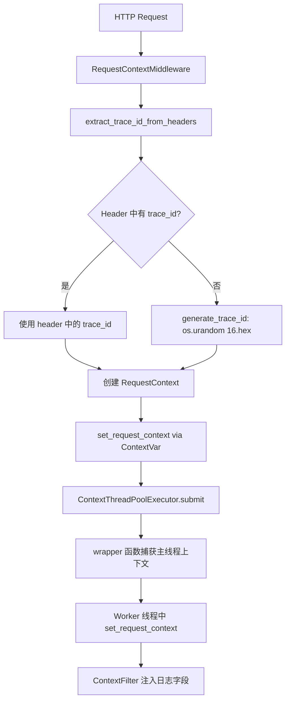

# PD-11.NN MemOS — Prometheus 调度器指标与三层可观测体系

> 文档编号：PD-11.NN
> 来源：MemOS `src/memos/mem_scheduler/utils/metrics.py`
> GitHub：https://github.com/MemTensor/MemOS.git
> 问题域：PD-11 可观测性 Observability & Cost Tracking
> 状态：可复用方案

---

## 第 1 章 问题与动机（≥ 30 行）

### 1.1 核心问题

MemOS 是一个记忆操作系统，其核心是 `mem_scheduler` —— 一个多用户、多 MemCube 的异步任务调度器。调度器接收来自 API 层的消息，经过队列缓冲后分发到不同 handler 执行。在这样的架构下，可观测性面临三个层次的挑战：

1. **调度器运行时健康**：线程池是否卡死？队列是否积压？任务是否超时？
2. **任务级指标采集**：每个任务的入队/出队/处理/等待耗时，按 user_id 和 task_type 多维切分
3. **请求级追踪**：trace_id 从 HTTP 请求穿透到子线程、线程池 worker，确保日志可关联

这三个层次分别对应运维（Prometheus 指标）、业务分析（结构化事件日志）、调试排障（trace_id 传播）三种消费场景。

### 1.2 MemOS 的解法概述

MemOS 构建了一个三层可观测体系：

1. **Prometheus 指标层** (`metrics.py:1-126`)：定义 Counter/Summary/Histogram/Gauge 四类指标，覆盖任务全生命周期，支持 `user_id`/`task_type` 多维标签
2. **结构化事件日志层** (`monitor_event_utils.py:35-67`)：`emit_monitor_event` 函数在任务 enqueue/dequeue/start/finish 四个关键节点输出 JSON 结构化日志，包含完整的时间戳链和耗时计算
3. **请求上下文传播层** (`context.py:1-356`)：基于 `ContextVar` 的 `RequestContext` + `ContextThread` + `ContextThreadPoolExecutor`，确保 trace_id 从 HTTP 中间件穿透到所有子线程
4. **线程池健康监控** (`dispatcher_monitor.py:23-367`)：`SchedulerDispatcherMonitor` 周期性检查线程池健康状态，检测卡死任务，自动重启失败的线程池
5. **Redis 任务状态追踪** (`status_tracker.py:14-230`)：`TaskStatusTracker` 用 Redis Hash 持久化每个任务的 waiting/in_progress/completed/failed 状态，支持按 business_task_id 聚合查询

### 1.3 设计思想

| 设计原则 | 具体实现 | 理由 | 替代方案 |
|----------|----------|------|----------|
| 指标与业务解耦 | metrics.py 纯函数式 API，不依赖任何业务类 | 任何模块都可以直接调用 `task_enqueued()` 而无需了解调度器内部 | 在 Dispatcher 类内部定义指标方法（耦合度高） |
| 双模式埋点 | TimingSpan 同时支持 `@decorator` 和 `with` 语句 | 装饰器适合整个函数，with 适合函数内部片段 | 仅支持装饰器（无法测量代码片段） |
| 上下文自动传播 | ContextThreadPoolExecutor 在 submit 时捕获并注入上下文 | 业务代码无需手动传递 trace_id | 手动在每个 handler 中设置 trace_id（易遗漏） |
| 事件日志 fire-and-forget | emit_monitor_event 外层 try-except 吞掉所有异常 | 可观测性不能影响主流程 | 让异常冒泡（可能导致任务失败） |
| 线程池自愈 | DispatcherMonitor 检测卡死后自动创建新 executor | 避免人工干预，提高系统可用性 | 仅告警不自动恢复（需要人工重启） |

---

## 第 2 章 源码实现分析（≥ 60 行，核心章节）

### 2.1 架构概览

MemOS 的可观测性架构分为三个独立但协作的子系统：

```
┌─────────────────────────────────────────────────────────────────┐
│                        HTTP Request                              │
│  RequestContextMiddleware (trace_id 注入)                        │
│  middleware/request_context.py:29-101                            │
└──────────────────────┬──────────────────────────────────────────┘
                       │ ContextVar 传播
                       ▼
┌─────────────────────────────────────────────────────────────────┐
│                   BaseSchedulerQueueMixin                         │
│  submit_messages → metrics.task_enqueued()                       │
│  _message_consumer → metrics.task_dequeued()                     │
│  _monitor_loop → metrics.update_queue_length()                   │
│  queue_ops.py:32-426                                            │
└──────────────────────┬──────────────────────────────────────────┘
                       │ dispatch
                       ▼
┌─────────────────────────────────────────────────────────────────┐
│                   SchedulerDispatcher                             │
│  _create_task_wrapper:                                           │
│    → metrics.observe_task_wait_duration()  (入队→开始处理)        │
│    → metrics.observe_task_duration()       (处理耗时)             │
│    → metrics.task_completed/task_failed()  (结果计数)             │
│    → emit_monitor_event("start"/"finish")  (结构化日志)          │
│    → status_tracker.task_started/completed/failed() (Redis)      │
│  dispatcher.py:35-779                                           │
└──────────────────────┬──────────────────────────────────────────┘
                       │ 监控
                       ▼
┌─────────────────────────────────────────────────────────────────┐
│              SchedulerDispatcherMonitor                           │
│  _check_pools_health → 卡死检测 + 自动重启                       │
│  dispatcher_monitor.py:23-367                                    │
└─────────────────────────────────────────────────────────────────┘
```

### 2.2 核心实现

#### 2.2.1 Prometheus 指标定义与 TimingSpan

```mermaid
graph TD
    A[任务入队 submit_messages] --> B[Counter: tasks_enqueued_total]
    A --> C[StatusTracker: task_submitted]
    D[消费者出队 _message_consumer] --> E[Counter: tasks_dequeued_total]
    D --> F[emit_monitor_event dequeue]
    G[Handler 开始执行] --> H[Summary: task_wait_duration]
    G --> I[emit_monitor_event start]
    J[Handler 执行完成] --> K[Summary: task_duration]
    J --> L[Counter: tasks_completed_total]
    J --> M[emit_monitor_event finish]
    N[Handler 执行失败] --> O[Counter: tasks_failed_total]
    N --> P[emit_monitor_event finish+error]
    Q[监控循环 _monitor_loop] --> R[Gauge: queue_length]
    S[内部操作] --> T[Histogram: internal_span_duration]
```



对应源码 `src/memos/mem_scheduler/utils/metrics.py:1-126`：

```python
# 四类 Prometheus 指标覆盖任务全生命周期
TASKS_ENQUEUED_TOTAL = Counter(
    "memos_scheduler_tasks_enqueued_total",
    "Total number of tasks enqueued",
    ["user_id", "task_type"],
)

TASK_DURATION_SECONDS = Summary(
    "memos_scheduler_task_duration_seconds",
    "Task processing duration in seconds",
    ["user_id", "task_type"],
)

INTERNAL_SPAN_DURATION = Histogram(
    "memos_scheduler_internal_span_duration_seconds",
    "Duration of internal operations",
    ["span_name", "user_id", "task_id"],
)

QUEUE_LENGTH = Gauge(
    "memos_scheduler_queue_length",
    "Current length of the task queue",
    ["user_id"],
)

class TimingSpan(ContextDecorator):
    """双模式埋点：装饰器 + with 语句"""
    def __init__(self, span_name: str, user_id: str = "unknown", task_id: str = "unknown"):
        self.span_name = span_name
        self.user_id = user_id
        self.task_id = task_id
        self.start_time = 0

    def __enter__(self):
        self.start_time = time.perf_counter()
        return self

    def __exit__(self, exc_type, exc_val, exc_tb):
        duration = time.perf_counter() - self.start_time
        observe_internal_span(duration, self.span_name, self.user_id, self.task_id)
```

#### 2.2.2 请求上下文传播与 ContextThreadPoolExecutor



对应源码 `src/memos/context/context.py:244-277`：

```python
class ContextThreadPoolExecutor(ThreadPoolExecutor):
    """自动传播请求上下文到 worker 线程"""

    def submit(self, fn: Callable[..., T], *args: Any, **kwargs: Any) -> Any:
        # 在主线程中捕获当前上下文
        main_trace_id = get_current_trace_id()
        main_api_path = get_current_api_path()
        main_env = get_current_env()
        main_user_type = get_current_user_type()
        main_user_name = get_current_user_name()
        main_context = get_current_context()

        @functools.wraps(fn)
        def wrapper(*args: Any, **kwargs: Any) -> Any:
            if main_context:
                child_context = RequestContext(
                    trace_id=main_trace_id,
                    api_path=main_api_path,
                    env=main_env,
                    user_type=main_user_type,
                    user_name=main_user_name,
                )
                child_context._data = main_context._data.copy()
                set_request_context(child_context)
            return fn(*args, **kwargs)

        return super().submit(wrapper, *args, **kwargs)
```

### 2.3 实现细节

#### 结构化事件日志 (MONITOR_EVENT)

`emit_monitor_event` (`monitor_event_utils.py:35-67`) 在任务生命周期的四个关键节点（enqueue/dequeue/start/finish）输出 JSON 结构化日志。每条日志包含：

- `event`: 事件类型
- `ts`: UTC 时间戳
- `label/user_id/mem_cube_id/item_id/task_id/trace_id`: 业务维度
- `host/env`: 运行环境
- `event_duration_ms/total_duration_ms`: 耗时链

关键设计：外层 `try-except` 吞掉所有异常（`monitor_event_utils.py:66-67`），确保可观测性代码永远不会影响主流程。

#### 日志系统三层 Handler

`log.py:172-224` 定义了三个日志 Handler：

1. **console**: StreamHandler，开发调试用，格式含 trace_id/api_path/env/user_type/user_name
2. **file**: ConcurrentTimedRotatingFileHandler，按天轮转保留 3 天，线程安全
3. **custom_logger**: 单例 HTTP Handler，异步发送日志到外部日志服务，ThreadPoolExecutor 非阻塞

`ContextFilter` (`log.py:44-61`) 从 ContextVar 中提取 trace_id 等字段注入每条日志记录。

#### 线程池卡死检测与自愈

`SchedulerDispatcherMonitor._check_pool_health` (`dispatcher_monitor.py:160-240`) 实现两级检测：

1. **任务级**：遍历 `dispatcher.get_running_tasks()`，找出运行时间超过 `check_interval * stuck_max_interval` 的任务
2. **线程池级**：检查 `last_active` 时间戳，判断线程池是否长时间无活动

当卡死任务数超过 `stuck_thread_tolerance` 阈值时，`_restart_pool` (`dispatcher_monitor.py:242-296`) 自动创建新的 `ContextThreadPoolExecutor` 替换旧的，并重置健康状态。

#### Redis 任务状态追踪

`TaskStatusTracker` (`status_tracker.py:14-230`) 用 Redis Hash 存储每个任务的状态：

- Key: `memos:task_meta:{user_id}`
- Field: `task_id` (item_id)
- Value: JSON `{status, task_type, mem_cube_id, submitted_at, started_at, completed_at, error}`
- TTL: 7 天自动过期

支持 `business_task_id` 聚合：一个业务任务可包含多个 item，通过 Redis Set (`memos:task_items:{user_id}:{task_id}`) 关联，`get_task_status_by_business_id` 聚合所有 item 状态。

---

## 第 3 章 迁移指南（≥ 40 行）

### 3.1 迁移清单

**阶段 1：Prometheus 指标层（1-2 天）**

- [ ] 安装 `prometheus_client` 依赖
- [ ] 创建 `metrics.py`，定义 Counter/Summary/Histogram/Gauge 指标
- [ ] 实现 `TimingSpan` 上下文管理器/装饰器
- [ ] 在任务入队/出队/完成/失败处调用指标函数
- [ ] 启动 Prometheus HTTP server 或集成到 FastAPI `/metrics` 端点

**阶段 2：请求上下文传播（1 天）**

- [ ] 实现 `RequestContext` 数据类 + `ContextVar` 存储
- [ ] 实现 `ContextThreadPoolExecutor`，在 submit/map 时自动传播上下文
- [ ] 添加 HTTP 中间件，从请求头提取或生成 trace_id
- [ ] 实现 `ContextFilter`，将 trace_id 注入日志格式

**阶段 3：结构化事件日志（0.5 天）**

- [ ] 实现 `emit_monitor_event` 函数，输出 JSON 结构化日志
- [ ] 在任务生命周期四个节点（enqueue/dequeue/start/finish）埋点
- [ ] 确保 fire-and-forget 模式，异常不影响主流程

**阶段 4：健康监控（可选，1 天）**

- [ ] 实现线程池健康检查循环
- [ ] 实现卡死任务检测逻辑
- [ ] 实现线程池自动重启机制

### 3.2 适配代码模板

以下是一个可直接复用的 Prometheus 指标 + TimingSpan 模板：

```python
"""metrics.py — 可直接复用的调度器指标模块"""
import time
from contextlib import ContextDecorator
from prometheus_client import Counter, Summary, Histogram, Gauge

# 定义指标（按需调整 label 维度）
TASKS_TOTAL = Counter(
    "app_tasks_total",
    "Total tasks by lifecycle stage",
    ["user_id", "task_type", "stage"],  # stage: enqueued/dequeued/completed/failed
)

TASK_DURATION = Summary(
    "app_task_duration_seconds",
    "Task processing duration",
    ["user_id", "task_type"],
)

TASK_WAIT = Summary(
    "app_task_wait_seconds",
    "Time spent waiting in queue",
    ["user_id", "task_type"],
)

QUEUE_DEPTH = Gauge(
    "app_queue_depth",
    "Current queue depth",
    ["queue_name"],
)

SPAN_DURATION = Histogram(
    "app_span_duration_seconds",
    "Internal operation span duration",
    ["span_name"],
    buckets=[0.01, 0.05, 0.1, 0.25, 0.5, 1.0, 2.5, 5.0, 10.0, 30.0],
)


class TimingSpan(ContextDecorator):
    """双模式埋点：装饰器 @TimingSpan("op") 或 with TimingSpan("op")"""

    def __init__(self, span_name: str, **labels):
        self.span_name = span_name
        self.labels = labels
        self._start = 0.0

    def __enter__(self):
        self._start = time.perf_counter()
        return self

    def __exit__(self, *exc):
        elapsed = time.perf_counter() - self._start
        SPAN_DURATION.labels(span_name=self.span_name).observe(elapsed)
        return False
```

以下是 ContextThreadPoolExecutor 的可复用模板：

```python
"""context_propagation.py — 请求上下文自动传播"""
import functools
from contextvars import ContextVar
from concurrent.futures import ThreadPoolExecutor
from dataclasses import dataclass, field
from typing import Any, Callable, TypeVar

T = TypeVar("T")

@dataclass
class RequestContext:
    trace_id: str = ""
    user_id: str = ""
    extra: dict[str, Any] = field(default_factory=dict)

_ctx: ContextVar[RequestContext | None] = ContextVar("req_ctx", default=None)

def get_context() -> RequestContext | None:
    return _ctx.get()

def set_context(ctx: RequestContext | None) -> None:
    _ctx.set(ctx)

class PropagatingThreadPoolExecutor(ThreadPoolExecutor):
    """submit 时自动捕获并传播 ContextVar 到 worker 线程"""

    def submit(self, fn: Callable[..., T], *args, **kwargs) -> Any:
        captured = get_context()

        @functools.wraps(fn)
        def wrapper(*a, **kw):
            if captured:
                set_context(RequestContext(
                    trace_id=captured.trace_id,
                    user_id=captured.user_id,
                    extra=captured.extra.copy(),
                ))
            try:
                return fn(*a, **kw)
            finally:
                set_context(None)

        return super().submit(wrapper, *args, **kwargs)
```

### 3.3 适用场景

| 场景 | 适用度 | 说明 |
|------|--------|------|
| 多用户异步任务调度器 | ⭐⭐⭐ | 完美匹配：user_id/task_type 多维标签 + 队列深度监控 |
| 单用户 LLM Agent | ⭐⭐ | 指标层可简化，去掉 user_id 维度；TimingSpan 仍然有用 |
| 微服务 API 网关 | ⭐⭐⭐ | RequestContext 传播 + 结构化日志非常适合 |
| 批处理 ETL 管道 | ⭐⭐ | 指标层适用，但线程池监控可能不需要 |
| CLI 工具 | ⭐ | 过重；TimingSpan 单独使用即可 |

---

## 第 4 章 测试用例（≥ 20 行）

```python
import time
import pytest
from unittest.mock import patch, MagicMock
from prometheus_client import CollectorRegistry, Counter, Summary, Histogram, Gauge


class TestMetrics:
    """基于 metrics.py 真实函数签名的测试"""

    def setup_method(self):
        """每个测试使用独立的 Registry 避免指标冲突"""
        self.registry = CollectorRegistry()
        self.counter = Counter(
            "test_tasks_enqueued", "test", ["user_id", "task_type"],
            registry=self.registry,
        )
        self.summary = Summary(
            "test_task_duration", "test", ["user_id", "task_type"],
            registry=self.registry,
        )
        self.histogram = Histogram(
            "test_span_duration", "test", ["span_name", "user_id", "task_id"],
            registry=self.registry,
        )
        self.gauge = Gauge(
            "test_queue_length", "test", ["user_id"],
            registry=self.registry,
        )

    def test_counter_increment(self):
        """验证 Counter 按 user_id + task_type 正确递增"""
        self.counter.labels(user_id="u1", task_type="read").inc()
        self.counter.labels(user_id="u1", task_type="read").inc()
        self.counter.labels(user_id="u2", task_type="write").inc()
        assert self.counter.labels(user_id="u1", task_type="read")._value.get() == 2.0
        assert self.counter.labels(user_id="u2", task_type="write")._value.get() == 1.0

    def test_summary_observe(self):
        """验证 Summary 记录任务处理耗时"""
        self.summary.labels(user_id="u1", task_type="read").observe(1.5)
        self.summary.labels(user_id="u1", task_type="read").observe(2.5)
        # Summary 的 _count 应为 2
        assert self.summary.labels(user_id="u1", task_type="read")._count.get() == 2

    def test_gauge_set(self):
        """验证 Gauge 设置队列长度"""
        self.gauge.labels(user_id="u1").set(42)
        assert self.gauge.labels(user_id="u1")._value.get() == 42
        self.gauge.labels(user_id="u1").set(0)
        assert self.gauge.labels(user_id="u1")._value.get() == 0

    def test_histogram_buckets(self):
        """验证 Histogram 记录 span 耗时"""
        self.histogram.labels(span_name="llm_call", user_id="u1", task_id="t1").observe(0.5)
        self.histogram.labels(span_name="llm_call", user_id="u1", task_id="t1").observe(2.0)
        sample_count = self.histogram.labels(
            span_name="llm_call", user_id="u1", task_id="t1"
        )._sum.get()
        assert sample_count == pytest.approx(2.5, abs=0.01)


class TestTimingSpan:
    """基于 TimingSpan 的双模式埋点测试"""

    def test_context_manager_mode(self):
        """验证 with 语句模式记录耗时"""
        from memos.mem_scheduler.utils.metrics import TimingSpan, INTERNAL_SPAN_DURATION

        with patch.object(INTERNAL_SPAN_DURATION, 'labels') as mock_labels:
            mock_observe = MagicMock()
            mock_labels.return_value.observe = mock_observe

            with TimingSpan("test_op", user_id="u1", task_id="t1"):
                time.sleep(0.1)

            mock_labels.assert_called_once_with(span_name="test_op", user_id="u1", task_id="t1")
            args = mock_observe.call_args[0]
            assert args[0] >= 0.1  # 至少 100ms

    def test_decorator_mode(self):
        """验证 @decorator 模式记录耗时"""
        from memos.mem_scheduler.utils.metrics import TimingSpan, INTERNAL_SPAN_DURATION

        with patch.object(INTERNAL_SPAN_DURATION, 'labels') as mock_labels:
            mock_observe = MagicMock()
            mock_labels.return_value.observe = mock_observe

            @TimingSpan("decorated_op", user_id="u1")
            def slow_function():
                time.sleep(0.05)
                return "done"

            result = slow_function()
            assert result == "done"
            mock_observe.assert_called_once()


class TestContextPropagation:
    """基于 context.py 的上下文传播测试"""

    def test_context_thread_pool_propagation(self):
        """验证 ContextThreadPoolExecutor 传播 trace_id 到 worker"""
        from memos.context.context import (
            ContextThreadPoolExecutor, RequestContext,
            set_request_context, get_current_trace_id,
        )
        import concurrent.futures

        # 在主线程设置上下文
        ctx = RequestContext(trace_id="test-trace-123")
        set_request_context(ctx)

        captured_trace_ids = []

        def worker():
            tid = get_current_trace_id()
            captured_trace_ids.append(tid)
            return tid

        with ContextThreadPoolExecutor(max_workers=2) as executor:
            futures = [executor.submit(worker) for _ in range(3)]
            concurrent.futures.wait(futures)

        # 所有 worker 应该拿到主线程的 trace_id
        assert all(tid == "test-trace-123" for tid in captured_trace_ids)

    def test_context_not_set_returns_none(self):
        """验证无上下文时返回 None"""
        from memos.context.context import get_current_trace_id, set_request_context
        set_request_context(None)
        assert get_current_trace_id() is None
```

---

## 第 5 章 跨域关联

| 关联域 | 关系类型 | 说明 |
|--------|----------|------|
| PD-02 多 Agent 编排 | 协同 | SchedulerDispatcher 的线程池监控直接服务于多任务并行编排的健康保障；ContextThreadPoolExecutor 确保编排中的 trace_id 不丢失 |
| PD-03 容错与重试 | 协同 | DispatcherMonitor 的线程池自愈机制是容错体系的一部分；task_failed Counter 为重试决策提供数据支撑 |
| PD-06 记忆持久化 | 依赖 | TaskStatusTracker 用 Redis 持久化任务状态，与记忆系统共享 Redis 基础设施 |
| PD-09 Human-in-the-Loop | 协同 | emit_monitor_event 的结构化日志可用于向用户展示任务进度；status_tracker 的聚合查询支持前端轮询任务状态 |
| PD-10 中间件管道 | 依赖 | RequestContextMiddleware 是中间件管道的一环，为整个可观测性体系提供 trace_id 注入 |

---

## 第 6 章 来源文件索引

| 文件 | 行范围 | 关键实现 |
|------|--------|----------|
| `src/memos/mem_scheduler/utils/metrics.py` | L1-L126 | Prometheus 四类指标定义 + TimingSpan 上下文管理器 |
| `src/memos/context/context.py` | L25-L89 | RequestContext 数据类 + ContextVar 存储 |
| `src/memos/context/context.py` | L206-L277 | ContextThread + ContextThreadPoolExecutor 上下文传播 |
| `src/memos/context/context.py` | L316-L356 | TraceIdGetter 全局注册 + generate_trace_id |
| `src/memos/mem_scheduler/utils/monitor_event_utils.py` | L35-L67 | emit_monitor_event 结构化事件日志 |
| `src/memos/mem_scheduler/task_schedule_modules/dispatcher.py` | L119-L287 | _create_task_wrapper 指标埋点核心 |
| `src/memos/mem_scheduler/base_mixins/queue_ops.py` | L33-L118 | submit_messages 入队指标 + 状态追踪 |
| `src/memos/mem_scheduler/base_mixins/queue_ops.py` | L144-L211 | _message_consumer 出队指标 + 事件日志 |
| `src/memos/mem_scheduler/base_mixins/queue_ops.py` | L213-L236 | _monitor_loop 队列深度 Gauge 更新 |
| `src/memos/mem_scheduler/monitors/dispatcher_monitor.py` | L118-L240 | 线程池健康检查 + 卡死任务检测 |
| `src/memos/mem_scheduler/monitors/dispatcher_monitor.py` | L242-L296 | 线程池自动重启 _restart_pool |
| `src/memos/mem_scheduler/utils/status_tracker.py` | L14-L230 | Redis Hash 任务状态追踪 + business_task_id 聚合 |
| `src/memos/log.py` | L44-L61 | ContextFilter 日志字段注入 |
| `src/memos/log.py` | L64-L167 | CustomLoggerRequestHandler 单例 HTTP 日志发送 |
| `src/memos/log.py` | L172-L238 | LOGGING_CONFIG 三层 Handler 配置 |
| `src/memos/api/middleware/request_context.py` | L29-L101 | RequestContextMiddleware HTTP 中间件 |

---

## 第 7 章 横向对比维度

> **重要：** 本章用于自动填充 Butcher Wiki 的横向对比表。

```json comparison_data
{
  "project": "MemOS",
  "dimensions": {
    "追踪方式": "Prometheus Counter/Summary/Histogram/Gauge 四类指标 + JSON 结构化事件日志双轨",
    "数据粒度": "user_id × task_type 多维标签，支持按用户按任务类型切分",
    "持久化": "Prometheus 内存指标 + Redis Hash 任务状态 7 天 TTL + 文件轮转日志",
    "多提供商": "单一 Prometheus 后端，CustomLoggerRequestHandler 支持外部日志服务",
    "指标采集": "模块级纯函数 API，TimingSpan 双模式埋点（装饰器+with）",
    "Span 传播": "ContextVar + ContextThreadPoolExecutor 自动传播 trace_id 到 worker 线程",
    "卡死检测": "DispatcherMonitor 周期检查 running_tasks 耗时，超阈值自动重启线程池",
    "Agent 状态追踪": "Redis Hash 四态（waiting/in_progress/completed/failed）+ business_task_id 聚合",
    "日志格式": "三层 Handler：console(no_datetime) + file(ConcurrentTimedRotating) + HTTP(custom_logger)",
    "Worker日志隔离": "ContextFilter 从 ContextVar 注入 trace_id/env/user_type/user_name 到每条日志",
    "延迟统计": "Summary 记录 task_duration 和 task_wait_duration，emit_monitor_event 计算 total_duration_ms",
    "健康端点": "dispatcher.stats() 返回 running/inflight/handlers 三项运行时统计",
    "优雅关闭": "DispatcherMonitor.stop 逐个 shutdown 注册的线程池 + atexit 清理 HTTP logger",
    "Decorator 插桩": "TimingSpan 继承 ContextDecorator，perf_counter 高精度计时写入 Histogram",
    "业务元数据注入": "emit_monitor_event 自动提取 label/user_id/mem_cube_id/trace_id/host/env 等 12 个字段"
  }
}
```

### 域元数据补充

```json domain_metadata
{
  "solution_summary": "MemOS 用 Prometheus 四类指标（Counter/Summary/Histogram/Gauge）+ TimingSpan 双模式埋点 + ContextVar 线程池上下文传播 + Redis Hash 任务状态追踪构建三层可观测体系",
  "description": "调度器级可观测性：从任务入队到完成的全生命周期指标采集与线程池健康自愈",
  "sub_problems": [
    "线程池卡死自动重启：检测卡死任务数超阈值后创建新 executor 替换旧的，需处理旧 executor 的 graceful shutdown",
    "ContextVar 跨线程传播：ThreadPoolExecutor 的 worker 线程不继承主线程 ContextVar，需在 submit 时手动捕获并注入",
    "Redis Hash 单字段无 TTL：Redis Hash 不支持为单个 field 设置过期时间，已完成任务需依赖整个 key 的 TTL 或后台清理",
    "business_task_id 聚合状态判定：一个业务任务包含多个 item，需定义 any-failed/all-completed/else-in_progress 的聚合规则",
    "HTTP 日志发送单例 + atexit：CustomLoggerRequestHandler 用双重检查锁单例 + atexit 注册清理，避免多实例和泄漏"
  ],
  "best_practices": [
    "指标函数纯函数化：metrics.py 只暴露 task_enqueued/task_dequeued 等纯函数，不依赖任何业务类实例",
    "事件日志 fire-and-forget：emit_monitor_event 外层 try-except 吞掉所有异常，可观测性永远不影响主流程",
    "TimingSpan 继承 ContextDecorator：同时支持 @decorator 和 with 语句两种埋点方式，覆盖函数级和代码片段级",
    "线程池健康检查双级检测：先检查单个任务是否超时，再检查线程池整体活跃度，避免误判"
  ]
}
```
