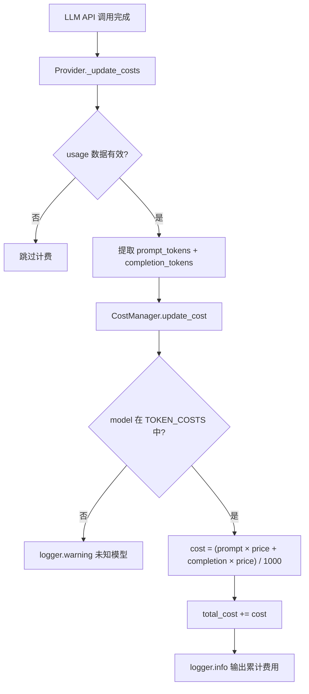
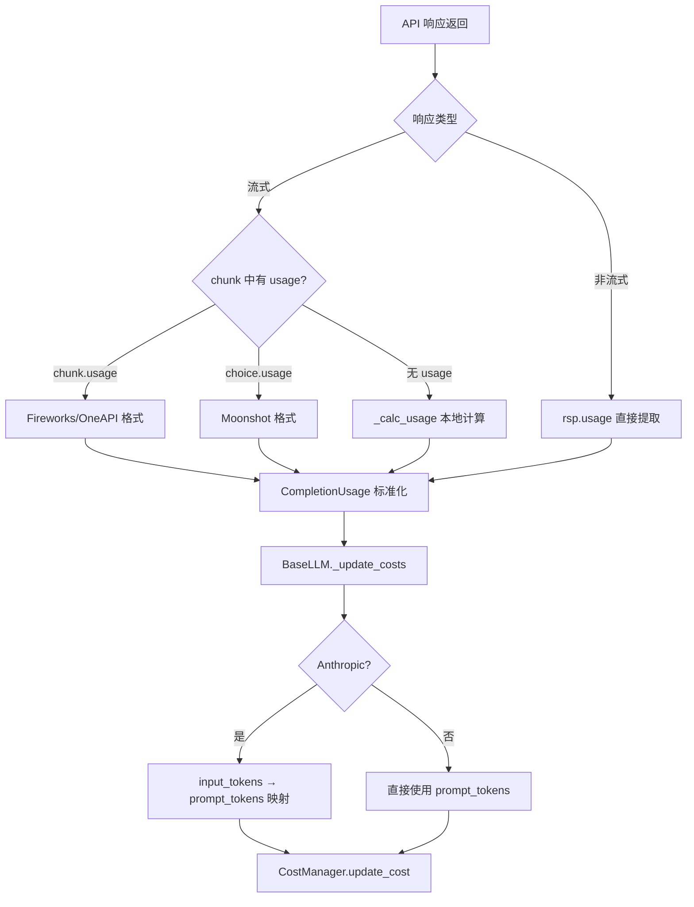

# PD-11.06 MetaGPT — CostManager 多提供商成本追踪与预算守卫

> 文档编号：PD-11.06
> 来源：MetaGPT `metagpt/utils/cost_manager.py`, `metagpt/utils/token_counter.py`, `metagpt/logs.py`
> GitHub：https://github.com/FoundationAgents/MetaGPT.git
> 问题域：PD-11 可观测性 Observability & Cost Tracking
> 状态：可复用方案

---

## 第 1 章 问题与动机

### 1.1 核心问题

多 Agent 协作系统中，一次完整的软件开发任务可能涉及 ProductManager、Architect、Engineer、QA 等多个角色，每个角色多轮调用 LLM。如果不追踪每次调用的 token 消耗和费用，用户无法预估成本，也无法在预算耗尽前及时止损。更复杂的是，MetaGPT 支持 15+ 种 LLM 提供商（OpenAI、Anthropic、Gemini、DashScope、QianFan、Fireworks、Bedrock 等），每家的定价模型、token 计量方式、API 返回格式都不同，需要一套统一的成本追踪抽象层。

### 1.2 MetaGPT 的解法概述

1. **静态定价表 TOKEN_COSTS** — 在 `metagpt/utils/token_counter.py:18-120` 维护 100+ 模型的 prompt/completion 单价字典，按 $/1K tokens 计价，覆盖 OpenAI、Anthropic、Gemini、Mistral、DeepSeek、Qwen、Doubao 等（`token_counter.py:18`）
2. **CostManager 基类 + 多态子类** — `CostManager`（通用）、`TokenCostManager`（自托管免费模型）、`FireworksCostManager`（按模型尺寸分级定价），通过 `Context._select_costmanager()` 根据 LLMType 自动选择（`context.py:77-84`）
3. **Team.invest / _check_balance 预算守卫** — 用户通过 `team.invest(amount)` 设置预算上限，每轮 `team.run()` 循环中调用 `_check_balance()` 检查累计成本是否超限，超限抛出 `NoMoneyException` 终止执行（`team.py:92-100`）
4. **Provider 层统一 _update_costs 钩子** — 每个 LLM Provider 在 API 调用完成后统一调用 `BaseLLM._update_costs(usage)`，从 API 响应中提取 prompt_tokens/completion_tokens 并委托给 CostManager 计算费用（`base_llm.py:124-140`）
5. **loguru 结构化日志 + LLM Stream Queue** — 使用 loguru 替代标准 logging，支持按日期分文件、可配置日志级别；LLM_STREAM_QUEUE 基于 ContextVar 实现异步流式输出隔离（`logs.py:24-54`）

### 1.3 设计思想

| 设计原则 | 具体实现 | 理由 | 替代方案 |
|----------|----------|------|----------|
| 静态定价表 vs 动态查询 | 硬编码 TOKEN_COSTS 字典 | 避免运行时 API 调用查价格，零延迟 | 调用 provider pricing API（增加网络依赖） |
| 多态 CostManager | 基类 + TokenCostManager + FireworksCostManager | 不同提供商计费逻辑差异大，继承比 if-else 更清晰 | 策略模式（效果类似但更重） |
| 预算守卫在 Team 层 | `_check_balance()` 在 run 循环中逐轮检查 | 粒度适中，不会每次 LLM 调用都中断 | 在 BaseLLM._update_costs 中检查（粒度太细） |
| ContextVar 流式队列 | LLM_STREAM_QUEUE 用 ContextVar 隔离 | 多 Agent 并发时每个协程有独立队列 | 全局队列（并发时消息混乱） |
| Pydantic BaseModel 序列化 | CostManager 继承 BaseModel | 天然支持 JSON 序列化/反序列化，便于持久化 | dataclass（缺少验证和序列化） |

---

## 第 2 章 源码实现分析

### 2.1 架构概览

MetaGPT 的可观测性系统由三层组成：定价数据层、成本计算层、预算控制层。

```
┌─────────────────────────────────────────────────────────────┐
│                      Team.run() 循环                         │
│  ┌─────────────┐    ┌──────────────┐    ┌───────────────┐   │
│  │ team.invest()│───→│ CostManager  │←───│ _check_balance│   │
│  │ 设置 max_budget│  │ .max_budget  │    │ total >= max? │   │
│  └─────────────┘    └──────┬───────┘    └───────────────┘   │
│                            │ .update_cost()                  │
│  ┌─────────────────────────┼─────────────────────────┐      │
│  │              Provider 层 (BaseLLM)                 │      │
│  │  ┌──────────┐  ┌──────────┐  ┌──────────────────┐│      │
│  │  │ OpenAI   │  │Anthropic │  │ Fireworks/QianFan││      │
│  │  │_update_  │  │_update_  │  │  _update_costs() ││      │
│  │  │ costs()  │  │ costs()  │  │                  ││      │
│  │  └────┬─────┘  └────┬─────┘  └────────┬─────────┘│      │
│  │       │              │                 │          │      │
│  │       └──────────────┼─────────────────┘          │      │
│  │                      ↓                            │      │
│  │            TOKEN_COSTS 定价表                      │      │
│  │     (100+ 模型 prompt/completion 单价)             │      │
│  └───────────────────────────────────────────────────┘      │
│                                                              │
│  ┌───────────────────────────────────────────────────┐      │
│  │              日志层 (loguru)                        │      │
│  │  logger.info("Total running cost: $X.XXX")        │      │
│  │  LLM_STREAM_QUEUE (ContextVar 异步流式输出)        │      │
│  └───────────────────────────────────────────────────┘      │
└─────────────────────────────────────────────────────────────┘
```

### 2.2 核心实现

#### 2.2.1 CostManager 成本累加器



对应源码 `metagpt/utils/cost_manager.py:25-60`：

```python
class CostManager(BaseModel):
    """Calculate the overhead of using the interface."""

    total_prompt_tokens: int = 0
    total_completion_tokens: int = 0
    total_budget: float = 0
    max_budget: float = 10.0
    total_cost: float = 0
    token_costs: dict[str, dict[str, float]] = TOKEN_COSTS

    def update_cost(self, prompt_tokens, completion_tokens, model):
        if prompt_tokens + completion_tokens == 0 or not model:
            return
        self.total_prompt_tokens += prompt_tokens
        self.total_completion_tokens += completion_tokens
        if model not in self.token_costs:
            logger.warning(f"Model {model} not found in TOKEN_COSTS.")
            return

        cost = (
            prompt_tokens * self.token_costs[model]["prompt"]
            + completion_tokens * self.token_costs[model]["completion"]
        ) / 1000
        self.total_cost += cost
        logger.info(
            f"Total running cost: ${self.total_cost:.3f} | Max budget: ${self.max_budget:.3f} | "
            f"Current cost: ${cost:.3f}, prompt_tokens: {prompt_tokens}, completion_tokens: {completion_tokens}"
        )
```

#### 2.2.2 Provider 层 token 提取与多源适配



对应源码 `metagpt/provider/openai_api.py:92-136`（流式 token 提取）：

```python
async def _achat_completion_stream(self, messages: list[dict], timeout=USE_CONFIG_TIMEOUT) -> str:
    response: AsyncStream[ChatCompletionChunk] = await self.aclient.chat.completions.create(
        **self._cons_kwargs(messages, timeout=self.get_timeout(timeout)), stream=True
    )
    usage = None
    collected_messages = []
    has_finished = False
    async for chunk in response:
        if not chunk.choices:
            continue
        choice0 = chunk.choices[0]
        chunk_message = choice0.delta.content or ""
        log_llm_stream(chunk_message)
        collected_messages.append(chunk_message)
        chunk_has_usage = hasattr(chunk, "usage") and chunk.usage
        if has_finished:
            if chunk_has_usage:
                usage = CompletionUsage(**chunk.usage) if isinstance(chunk.usage, dict) else chunk.usage
        if choice0.finish_reason:
            if chunk_has_usage:
                usage = CompletionUsage(**chunk.usage) if isinstance(chunk.usage, dict) else chunk.usage
            elif hasattr(choice0, "usage"):
                usage = CompletionUsage(**choice0.usage)
            has_finished = True
    if not usage:
        usage = self._calc_usage(messages, full_reply_content)
    self._update_costs(usage)
    return full_reply_content
```

Anthropic 的 `_update_costs` 覆写（`metagpt/provider/anthropic_api.py:40-42`）将 Anthropic 的 `input_tokens/output_tokens` 映射为统一的 `prompt_tokens/completion_tokens`：

```python
def _update_costs(self, usage: Usage, model: str = None, local_calc_usage: bool = True):
    usage = {"prompt_tokens": usage.input_tokens, "completion_tokens": usage.output_tokens}
    super()._update_costs(usage, model)
```

### 2.3 实现细节

#### Context 层 CostManager 自动选择

`metagpt/context.py:77-84` 根据 LLMType 自动选择合适的 CostManager 子类：

- `LLMType.FIREWORKS` → `FireworksCostManager()`（按模型尺寸分级定价，`cost_manager.py:111-149`）
- `LLMType.OPEN_LLM` → `TokenCostManager()`（自托管模型免费，只记 token 不算钱，`cost_manager.py:94-108`）
- 其他 → 共享全局 `self.cost_manager`（所有角色共用一个计费器）

#### FireworksCostManager 分级定价

`metagpt/utils/cost_manager.py:111-149` 实现了 Fireworks 独特的按模型尺寸分级定价：

```python
class FireworksCostManager(CostManager):
    def model_grade_token_costs(self, model: str) -> dict[str, float]:
        def _get_model_size(model: str) -> float:
            size = re.findall(".*-([0-9.]+)b", model)
            size = float(size[0]) if len(size) > 0 else -1
            return size

        if "mixtral-8x7b" in model:
            token_costs = FIREWORKS_GRADE_TOKEN_COSTS["mixtral-8x7b"]
        else:
            model_size = _get_model_size(model)
            if 0 < model_size <= 16:
                token_costs = FIREWORKS_GRADE_TOKEN_COSTS["16"]
            elif 16 < model_size <= 80:
                token_costs = FIREWORKS_GRADE_TOKEN_COSTS["80"]
            else:
                token_costs = FIREWORKS_GRADE_TOKEN_COSTS["-1"]
        return token_costs
```

注意 Fireworks 的计费单位是 $/1M tokens（`cost_manager.py:144`），而通用 CostManager 是 $/1K tokens（`cost_manager.py:55`），这个差异在各自的 `update_cost` 中处理。

#### 本地 Token 计数回退

当流式响应不提供 usage 数据时（如 OpenAI 标准流式），`openai_api.py:269-280` 使用 tiktoken 本地计算：

```python
def _calc_usage(self, messages: list[dict], rsp: str) -> CompletionUsage:
    usage = CompletionUsage(prompt_tokens=0, completion_tokens=0, total_tokens=0)
    if not self.config.calc_usage:
        return usage
    try:
        usage.prompt_tokens = count_message_tokens(messages, self.pricing_plan)
        usage.completion_tokens = count_output_tokens(rsp, self.pricing_plan)
    except Exception as e:
        logger.warning(f"usage calculation failed: {e}")
    return usage
```

`token_counter.py:430-507` 中的 `count_message_tokens` 对 OpenAI 模型使用 tiktoken 精确计数，对 Claude 模型调用 Anthropic SDK 的 `count_tokens` API。

#### 日志系统与流式输出

`metagpt/logs.py:24` 定义了 `LLM_STREAM_QUEUE: ContextVar[asyncio.Queue]`，基于 Python ContextVar 实现协程级隔离。每个 Agent 协程可以通过 `create_llm_stream_queue()` 创建独立队列，LLM 流式输出通过 `log_llm_stream()` 同时写入队列和控制台。

`logs.py:40-52` 的 `define_log_level` 配置 loguru 双输出：stderr（按 print_level）+ 文件（按 logfile_level），日志文件按日期命名存储在 `METAGPT_ROOT/logs/` 下。

---

## 第 3 章 迁移指南

### 3.1 迁移清单

**阶段 1：定价表 + CostManager 基础**
- [ ] 创建 `TOKEN_COSTS` 定价字典，覆盖你使用的模型（从 MetaGPT 的表中摘取）
- [ ] 实现 `CostManager` 基类（Pydantic BaseModel），包含 `update_cost(prompt_tokens, completion_tokens, model)` 方法
- [ ] 为特殊提供商创建子类（如 Fireworks 分级定价、自托管免费模型）

**阶段 2：Provider 层集成**
- [ ] 在每个 LLM Provider 的 API 调用完成后调用 `_update_costs(usage)`
- [ ] 处理流式响应的 usage 提取（chunk.usage / choice.usage / 本地计算三种来源）
- [ ] 为 Anthropic 等非 OpenAI 格式的 Provider 做字段映射（input_tokens → prompt_tokens）

**阶段 3：预算控制**
- [ ] 在 Team/Orchestrator 层实现 `invest(amount)` 和 `_check_balance()` 机制
- [ ] 定义 `NoMoneyException` 异常，在预算耗尽时优雅终止

**阶段 4：日志与持久化**
- [ ] 集成 loguru 替代标准 logging，配置双输出（控制台 + 文件）
- [ ] 利用 CostManager 的 Pydantic 序列化实现成本数据持久化

### 3.2 适配代码模板

```python
"""可直接复用的 CostManager 迁移模板"""
from typing import NamedTuple
from pydantic import BaseModel

# 1. 定价表（按需裁剪）
TOKEN_COSTS: dict[str, dict[str, float]] = {
    "gpt-4o": {"prompt": 0.005, "completion": 0.015},
    "gpt-4o-mini": {"prompt": 0.00015, "completion": 0.0006},
    "claude-3-5-sonnet-20240620": {"prompt": 0.003, "completion": 0.015},
    "deepseek-chat": {"prompt": 0.00027, "completion": 0.0011},
    # 添加你使用的模型...
}


class Costs(NamedTuple):
    total_prompt_tokens: int
    total_completion_tokens: int
    total_cost: float
    total_budget: float


class CostManager(BaseModel):
    total_prompt_tokens: int = 0
    total_completion_tokens: int = 0
    total_cost: float = 0
    max_budget: float = 10.0
    token_costs: dict[str, dict[str, float]] = TOKEN_COSTS

    def update_cost(self, prompt_tokens: int, completion_tokens: int, model: str):
        if prompt_tokens + completion_tokens == 0 or not model:
            return
        self.total_prompt_tokens += prompt_tokens
        self.total_completion_tokens += completion_tokens
        if model not in self.token_costs:
            print(f"[WARN] Model {model} not in TOKEN_COSTS, skipping cost calc")
            return
        cost = (
            prompt_tokens * self.token_costs[model]["prompt"]
            + completion_tokens * self.token_costs[model]["completion"]
        ) / 1000
        self.total_cost += cost

    def check_budget(self) -> bool:
        """返回 True 表示预算已耗尽"""
        return self.total_cost >= self.max_budget

    def get_costs(self) -> Costs:
        return Costs(self.total_prompt_tokens, self.total_completion_tokens,
                     self.total_cost, self.max_budget)


class NoMoneyException(Exception):
    def __init__(self, total_cost: float, msg: str = ""):
        self.total_cost = total_cost
        super().__init__(msg)


# 2. 在 LLM 调用后集成
def extract_and_track_cost(
    cost_manager: CostManager,
    usage: dict,
    model: str,
):
    """从 API 响应的 usage 字段提取 token 数并更新成本"""
    prompt_tokens = usage.get("prompt_tokens", 0) or usage.get("input_tokens", 0)
    completion_tokens = usage.get("completion_tokens", 0) or usage.get("output_tokens", 0)
    cost_manager.update_cost(prompt_tokens, completion_tokens, model)
    if cost_manager.check_budget():
        raise NoMoneyException(cost_manager.total_cost,
                               f"Budget exceeded: ${cost_manager.total_cost:.3f} >= ${cost_manager.max_budget:.3f}")
```

### 3.3 适用场景

| 场景 | 适用度 | 说明 |
|------|--------|------|
| 多 Agent 协作系统 | ⭐⭐⭐ | 多角色共享一个 CostManager，天然支持全局成本汇总 |
| 多提供商混合调用 | ⭐⭐⭐ | TOKEN_COSTS 覆盖 100+ 模型，多态子类处理特殊计费 |
| 单 Agent 简单应用 | ⭐⭐ | 可用但略重，单 Agent 可简化为直接累加 |
| 需要精确到 Agent 级别的成本分析 | ⭐⭐ | MetaGPT 所有角色共享一个 CostManager，无法区分单个角色的成本 |
| 需要持久化历史成本 | ⭐⭐ | Pydantic 序列化支持 JSON 持久化，但无内置数据库方案 |

---

## 第 4 章 测试用例

```python
import pytest
from unittest.mock import patch


class TestCostManager:
    """基于 MetaGPT CostManager 真实接口的测试"""

    def setup_method(self):
        """每个测试前重置 CostManager"""
        from pydantic import BaseModel
        # 模拟 MetaGPT 的 CostManager
        self.token_costs = {
            "gpt-4o": {"prompt": 0.005, "completion": 0.015},
            "gpt-4o-mini": {"prompt": 0.00015, "completion": 0.0006},
        }

        class CostManager(BaseModel):
            total_prompt_tokens: int = 0
            total_completion_tokens: int = 0
            total_cost: float = 0
            max_budget: float = 10.0
            token_costs: dict = {}

            def update_cost(self, prompt_tokens, completion_tokens, model):
                if prompt_tokens + completion_tokens == 0 or not model:
                    return
                self.total_prompt_tokens += prompt_tokens
                self.total_completion_tokens += completion_tokens
                if model not in self.token_costs:
                    return
                cost = (prompt_tokens * self.token_costs[model]["prompt"]
                        + completion_tokens * self.token_costs[model]["completion"]) / 1000
                self.total_cost += cost

        self.cm = CostManager(token_costs=self.token_costs)

    def test_normal_cost_tracking(self):
        """正常路径：GPT-4o 调用 1000 prompt + 500 completion tokens"""
        self.cm.update_cost(1000, 500, "gpt-4o")
        assert self.cm.total_prompt_tokens == 1000
        assert self.cm.total_completion_tokens == 500
        # cost = (1000 * 0.005 + 500 * 0.015) / 1000 = 0.0125
        assert abs(self.cm.total_cost - 0.0125) < 1e-6

    def test_unknown_model_no_crash(self):
        """未知模型不崩溃，只记 token 不算钱"""
        self.cm.update_cost(100, 50, "unknown-model-v1")
        assert self.cm.total_prompt_tokens == 100
        assert self.cm.total_completion_tokens == 50
        assert self.cm.total_cost == 0.0  # 未知模型不计费

    def test_zero_tokens_skip(self):
        """零 token 调用直接跳过"""
        self.cm.update_cost(0, 0, "gpt-4o")
        assert self.cm.total_cost == 0.0
        assert self.cm.total_prompt_tokens == 0

    def test_cumulative_cost(self):
        """多次调用累计成本"""
        self.cm.update_cost(1000, 500, "gpt-4o")
        self.cm.update_cost(2000, 1000, "gpt-4o-mini")
        assert self.cm.total_prompt_tokens == 3000
        assert self.cm.total_completion_tokens == 1500
        # gpt-4o: (1000*0.005 + 500*0.015)/1000 = 0.0125
        # gpt-4o-mini: (2000*0.00015 + 1000*0.0006)/1000 = 0.0009
        expected = 0.0125 + 0.0009
        assert abs(self.cm.total_cost - expected) < 1e-6

    def test_budget_check(self):
        """预算守卫：超限检测"""
        self.cm.max_budget = 0.01
        self.cm.update_cost(1000, 500, "gpt-4o")  # cost = 0.0125 > 0.01
        assert self.cm.total_cost >= self.cm.max_budget

    def test_serialization_roundtrip(self):
        """Pydantic 序列化/反序列化保持状态"""
        self.cm.update_cost(1000, 500, "gpt-4o")
        json_str = self.cm.model_dump_json()
        restored = self.cm.model_validate_json(json_str)
        assert restored.total_cost == self.cm.total_cost
        assert restored.total_prompt_tokens == self.cm.total_prompt_tokens
```

---

## 第 5 章 跨域关联

| 关联域 | 关系类型 | 说明 |
|--------|----------|------|
| PD-01 上下文管理 | 协同 | `BaseLLM.compress_messages()` 在 token 超限时裁剪消息，裁剪后的 token 数影响成本计算；`TOKEN_MAX` 字典同时服务于上下文管理和 `get_max_completion_tokens()` |
| PD-02 多 Agent 编排 | 依赖 | Team 层的 `_check_balance()` 在多 Agent 运行循环中执行，所有角色共享同一个 CostManager 实例，编排层决定了成本检查的粒度 |
| PD-03 容错与重试 | 协同 | `BaseLLM.acompletion_text` 使用 tenacity 重试（最多 3 次），每次重试都会触发 `_update_costs`，重试成本会被正确累加 |
| PD-04 工具系统 | 协同 | `ToolLogItem` 和 `log_tool_output` 提供工具执行的结构化日志，与 LLM 调用日志互补 |
| PD-12 推理增强 | 协同 | Anthropic 的 extended thinking（`reasoning` 模式）产生额外 token，`anthropic_api.py:64-79` 在流式中分别收集 thinking_delta 和 text_delta，但 usage 统一计费 |

---

## 第 6 章 来源文件索引

| 文件 | 行范围 | 关键实现 |
|------|--------|----------|
| `metagpt/utils/cost_manager.py` | L18-23 | Costs NamedTuple 定义 |
| `metagpt/utils/cost_manager.py` | L25-91 | CostManager 基类：update_cost、get_costs |
| `metagpt/utils/cost_manager.py` | L94-108 | TokenCostManager：自托管免费模型 |
| `metagpt/utils/cost_manager.py` | L111-149 | FireworksCostManager：分级定价 |
| `metagpt/utils/token_counter.py` | L18-120 | TOKEN_COSTS 主定价表（100+ 模型） |
| `metagpt/utils/token_counter.py` | L127-173 | QIANFAN 定价表 + endpoint 映射 |
| `metagpt/utils/token_counter.py` | L181-227 | DASHSCOPE 定价表 |
| `metagpt/utils/token_counter.py` | L230-244 | FIREWORKS/DOUBAO 分级定价表 |
| `metagpt/utils/token_counter.py` | L247-353 | TOKEN_MAX 上下文窗口限制表 |
| `metagpt/utils/token_counter.py` | L416-427 | count_claude_message_tokens（Anthropic SDK 计数） |
| `metagpt/utils/token_counter.py` | L430-507 | count_message_tokens（tiktoken 精确计数） |
| `metagpt/provider/base_llm.py` | L44 | cost_manager 属性声明 |
| `metagpt/provider/base_llm.py` | L124-140 | _update_costs 统一钩子 |
| `metagpt/provider/openai_api.py` | L92-136 | 流式 token 提取（三种来源适配） |
| `metagpt/provider/openai_api.py` | L156-160 | 非流式 usage 提取 |
| `metagpt/provider/openai_api.py` | L269-280 | _calc_usage 本地回退计算 |
| `metagpt/provider/anthropic_api.py` | L40-42 | Anthropic input_tokens → prompt_tokens 映射 |
| `metagpt/provider/anthropic_api.py` | L60-86 | Anthropic 流式 usage 累加 |
| `metagpt/context.py` | L66 | 全局 CostManager 实例 |
| `metagpt/context.py` | L77-84 | _select_costmanager 多态选择 |
| `metagpt/context.py` | L94-100 | llm_with_cost_manager_from_llm_config |
| `metagpt/team.py` | L41 | investment 默认值 10.0 |
| `metagpt/team.py` | L88-90 | cost_manager 属性代理 |
| `metagpt/team.py` | L92-96 | invest() 设置预算上限 |
| `metagpt/team.py` | L98-100 | _check_balance() 超限检查 |
| `metagpt/team.py` | L128-134 | run() 循环中逐轮检查余额 |
| `metagpt/logs.py` | L19 | loguru logger 导入 |
| `metagpt/logs.py` | L24 | LLM_STREAM_QUEUE ContextVar 定义 |
| `metagpt/logs.py` | L27-35 | ToolLogItem 结构化日志模型 |
| `metagpt/logs.py` | L40-52 | define_log_level 双输出配置 |
| `metagpt/logs.py` | L58-73 | log_llm_stream 流式日志 + 队列推送 |
| `metagpt/logs.py` | L128-136 | create/get_llm_stream_queue |
| `metagpt/configs/llm_config.py` | L65 | pricing_plan 计费方案参数 |
| `metagpt/configs/llm_config.py` | L104 | calc_usage 开关 |

---

## 第 7 章 横向对比维度

```json comparison_data
{
  "project": "MetaGPT",
  "dimensions": {
    "追踪方式": "CostManager 基类 + 多态子类，每次 API 调用后 _update_costs 钩子自动累加",
    "数据粒度": "全局累计 prompt/completion tokens + 总费用，无单角色/单任务拆分",
    "持久化": "Pydantic BaseModel JSON 序列化，Team.serialize 保存到文件",
    "多提供商": "TOKEN_COSTS 覆盖 100+ 模型，15+ 提供商，含 6 套独立定价表",
    "日志格式": "loguru 结构化日志，双输出（stderr + 按日期文件），ToolLogItem Pydantic 模型",
    "成本追踪": "静态定价表 $/1K tokens，Fireworks 按模型尺寸分级 $/1M tokens",
    "日志级别": "可配置 print_level + logfile_level 双级别，默认 INFO/DEBUG",
    "指标采集": "仅 token 数和费用，无延迟/错误率等运行时指标",
    "可视化": "无内置可视化，通过 logger.info 文本输出累计费用",
    "崩溃安全": "CostManager 状态可序列化恢复，Team.deserialize 支持断点续跑",
    "预算守卫": "Team.invest 设上限，_check_balance 逐轮检查，NoMoneyException 终止"
  }
}
```

### 域元数据补充

```json domain_metadata
{
  "solution_summary": "MetaGPT 通过 CostManager 多态体系（基类 + TokenCostManager + FireworksCostManager）配合 100+ 模型静态定价表，在 Provider 层 _update_costs 钩子自动累加成本，Team.invest/_check_balance 实现预算守卫",
  "description": "多 Agent 系统中全局共享成本管理器的设计权衡与多提供商定价适配",
  "sub_problems": [
    "定价表维护成本：100+ 模型价格需人工更新，新模型上线后存在滞后",
    "全局 vs 角色级成本归属：所有角色共享一个 CostManager，无法按角色拆分成本",
    "计费单位不统一：不同提供商用 $/1K 或 $/1M tokens，需在子类中分别处理"
  ],
  "best_practices": [
    "用 Pydantic BaseModel 作为 CostManager 基类：天然获得 JSON 序列化、字段验证、类型安全",
    "pricing_plan 与 model 分离：同一模型在不同渠道（直连 vs OpenRouter）价格不同，用 pricing_plan 覆盖",
    "流式 usage 三源适配：chunk.usage → choice.usage → 本地 tiktoken 计算，逐级降级"
  ]
}
```
