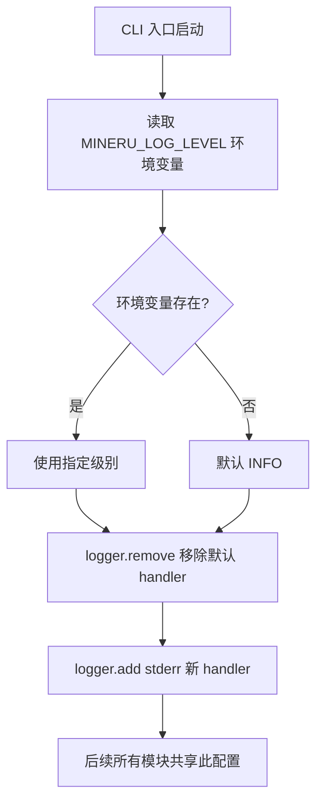
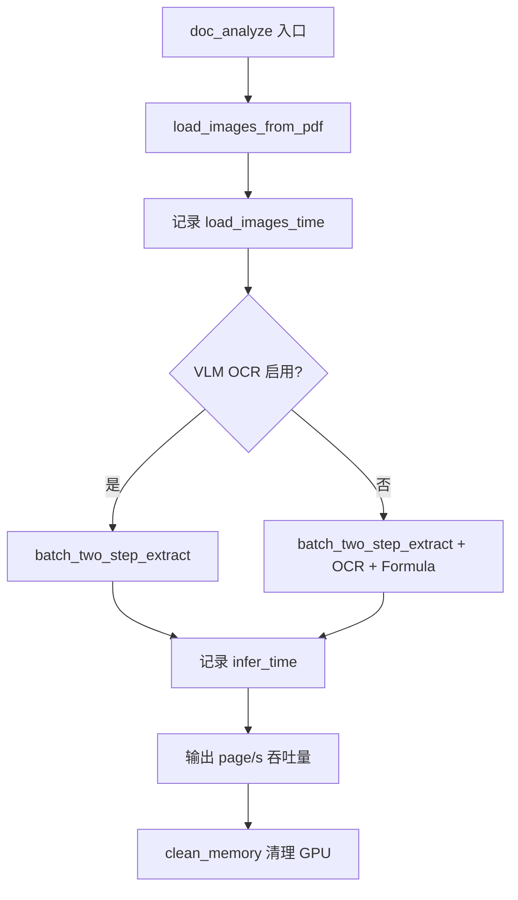
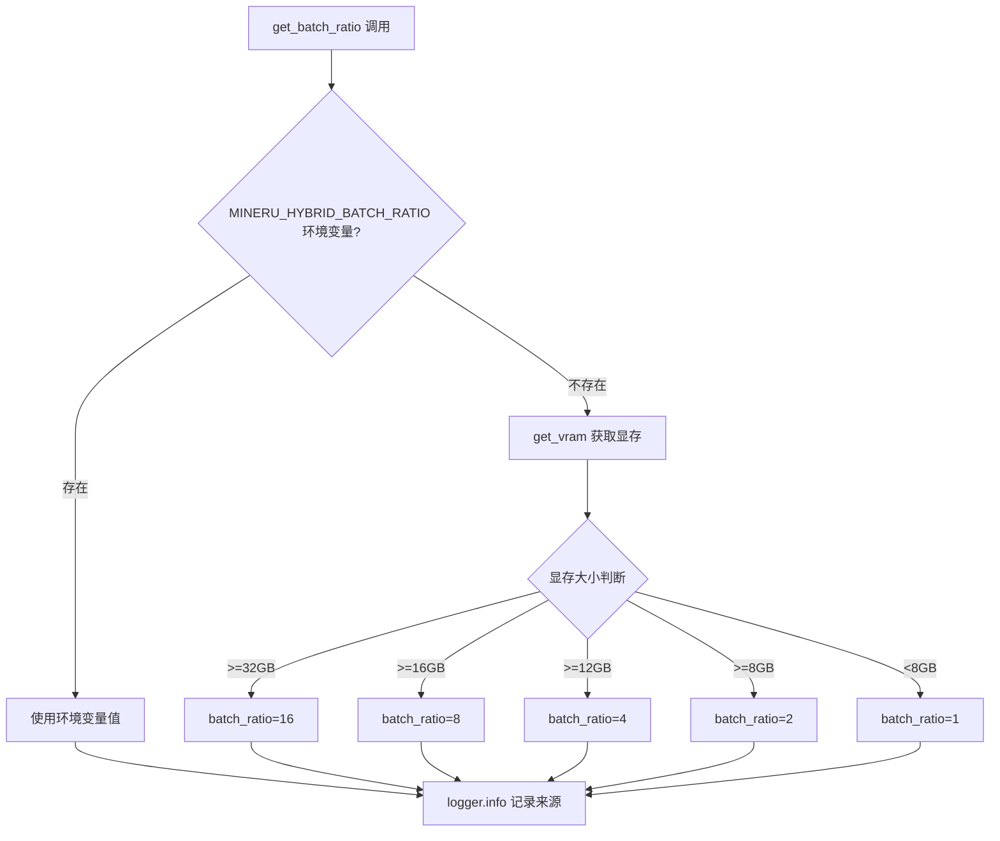

# PD-11.15 MinerU — loguru 结构化日志与推理流水线性能追踪

> 文档编号：PD-11.15
> 来源：MinerU `mineru/cli/fast_api.py`, `mineru/backend/hybrid/hybrid_analyze.py`, `projects/mineru_tianshu/`
> GitHub：https://github.com/opendatalab/MinerU.git
> 问题域：PD-11 可观测性 Observability & Cost Tracking
> 状态：可复用方案

---

## 第 1 章 问题与动机

### 1.1 核心问题

文档解析流水线（PDF → 图像加载 → VLM/OCR 推理 → 后处理）涉及多个 GPU 密集型阶段，每个阶段的耗时差异巨大（图像加载 ~0.5s vs 推理 ~30s）。在生产环境中，运维人员需要：

1. **阶段级耗时可见**：定位瓶颈在图像加载、模型初始化还是推理阶段
2. **吞吐量指标**：以 `page/s`、`images/s` 为单位衡量系统处理能力
3. **GPU 资源感知**：根据显存大小自动调整 batch ratio，并在日志中记录决策依据
4. **任务队列健康监控**：多 Worker 部署时追踪 pending/processing/completed/failed 四态分布
5. **Worker 健康检查**：检测 Worker 进程是否存活、是否卡死
6. **日志级别运行时可控**：不重启服务即可调整日志详细程度

### 1.2 MinerU 的解法概述

MinerU 采用 loguru 作为全局日志框架，配合 `time.time()` 手动计时实现轻量级可观测性：

1. **环境变量驱动日志级别** — 通过 `MINERU_LOG_LEVEL` 在所有 CLI 入口统一配置 loguru handler（`mineru/cli/fast_api.py:19-21`）
2. **阶段计时 + 吞吐量计算** — 在 `doc_analyze` 函数中对图像加载和推理两个阶段分别计时，输出 `images/s` 和 `page/s`（`mineru/backend/hybrid/hybrid_analyze.py:401-437`）
3. **GPU 显存自适应 batch ratio** — `get_batch_ratio()` 根据 VRAM 大小自动选择 batch 倍率，并在日志中记录决策路径（`mineru/backend/hybrid/hybrid_analyze.py:323-366`）
4. **SQLite 任务队列 + HTTP 健康端点** — Tianshu 子项目通过 `TaskDB.get_queue_stats()` 聚合四态统计，暴露 `/api/v1/health` 和 `/api/v1/queue/stats` 端点（`projects/mineru_tianshu/api_server.py:712-726`）
5. **Worker 心跳 + 超时任务重置** — `TaskScheduler` 定期检查 Worker 健康状态，自动重置超时的 processing 任务（`projects/mineru_tianshu/task_scheduler.py:70-92`）

### 1.3 设计思想

| 设计原则 | 具体实现 | 理由 | 替代方案 |
|----------|----------|------|----------|
| 零依赖可观测 | loguru + time.time()，无 OTel/Prometheus | 文档解析是 GPU 密集型，不需要分布式追踪开销 | OpenTelemetry（过重） |
| 环境变量驱动 | MINERU_LOG_LEVEL 控制全局日志级别 | 容器化部署时通过 env 注入，无需修改代码 | 配置文件（需挂载） |
| 吞吐量而非延迟 | 输出 page/s 而非 p99 延迟 | 批处理场景关注总吞吐，非单请求延迟 | Histogram 分位数 |
| 显存感知决策日志 | batch ratio 选择过程记录到 INFO | 帮助运维理解为什么某些机器处理更慢 | 静默自适应 |
| 四态队列统计 | pending/processing/completed/failed | 覆盖任务全生命周期，一眼看出积压情况 | 仅 pending 计数 |

---

## 第 2 章 源码实现分析

### 2.1 架构概览

MinerU 的可观测性分为两层：核心推理层（loguru 计时日志）和任务调度层（SQLite 队列统计 + HTTP 健康端点）。

```
┌─────────────────────────────────────────────────────────────┐
│                    CLI 入口层                                │
│  fast_api.py / gradio_app.py / client.py                    │
│  ┌─────────────────────────────────────────────────────┐    │
│  │ MINERU_LOG_LEVEL → logger.remove() → logger.add()   │    │
│  └─────────────────────────────────────────────────────┘    │
├─────────────────────────────────────────────────────────────┤
│                    推理流水线层                               │
│  hybrid_analyze.py / pipeline_analyze.py / vlm_analyze.py   │
│  ┌──────────┐  ┌──────────┐  ┌──────────┐  ┌──────────┐   │
│  │model_init│→ │load_image│→ │ infer    │→ │ cleanup  │   │
│  │ timing   │  │ timing   │  │ timing   │  │ timing   │   │
│  │ (INFO)   │  │ (DEBUG)  │  │ (DEBUG)  │  │ (DEBUG)  │   │
│  └──────────┘  └──────────┘  └──────────┘  └──────────┘   │
│       ↓              ↓             ↓             ↓          │
│  logger.info    logger.debug  logger.debug  logger.debug    │
│  "model init    "load images  "infer        "gc time:       │
│   cost: Xs"     cost: Xs,     finished,      Xs"            │
│                  speed: N      cost: Xs,                    │
│                  images/s"     speed: N                     │
│                                page/s"                      │
├─────────────────────────────────────────────────────────────┤
│                    任务调度层（Tianshu）                      │
│  ┌──────────┐  ┌──────────┐  ┌──────────┐                  │
│  │ TaskDB   │  │ Worker   │  │Scheduler │                  │
│  │ SQLite   │←→│ LitServe │←─│ health   │                  │
│  │ 4-state  │  │ auto-loop│  │ check    │                  │
│  └──────────┘  └──────────┘  └──────────┘                  │
│       ↓                            ↓                        │
│  /api/v1/queue/stats         /api/v1/health                 │
└─────────────────────────────────────────────────────────────┘
```

### 2.2 核心实现

#### 2.2.1 loguru 全局日志配置



对应源码 `mineru/cli/fast_api.py:17-21`：

```python
from loguru import logger

log_level = os.getenv("MINERU_LOG_LEVEL", "INFO").upper()
logger.remove()  # 移除默认handler
logger.add(sys.stderr, level=log_level)  # 添加新handler
```

这段配置在三个 CLI 入口（`fast_api.py:19-21`、`gradio_app.py:16-18`、`client.py`）中完全一致，确保无论从哪个入口启动，日志行为都相同。关键设计：先 `remove()` 再 `add()`，避免 loguru 默认 handler 与自定义 handler 产生重复输出。

#### 2.2.2 推理流水线阶段计时



对应源码 `mineru/backend/hybrid/hybrid_analyze.py:384-453`：

```python
def doc_analyze(
        pdf_bytes,
        image_writer: DataWriter | None,
        predictor: MinerUClient | None = None,
        backend="transformers",
        parse_method: str = 'auto',
        language: str = 'ch',
        inline_formula_enable: bool = True,
        model_path: str | None = None,
        server_url: str | None = None,
        **kwargs,
):
    # 阶段1: 图像加载计时
    load_images_start = time.time()
    images_list, pdf_doc = load_images_from_pdf(pdf_bytes, image_type=ImageType.PIL)
    images_pil_list = [image_dict["img_pil"] for image_dict in images_list]
    load_images_time = round(time.time() - load_images_start, 2)
    logger.debug(
        f"load images cost: {load_images_time}, "
        f"speed: {round(len(images_pil_list)/load_images_time, 3)} images/s"
    )

    # 阶段2: 推理计时
    infer_start = time.time()
    # ... VLM/OCR 推理逻辑 ...
    infer_time = round(time.time() - infer_start, 2)
    logger.debug(
        f"infer finished, cost: {infer_time}, "
        f"speed: {round(len(results)/infer_time, 3)} page/s"
    )
```

同样的计时模式在 `pipeline_analyze.py:89-136` 和 `vlm_analyze.py` 中也有出现，三个后端保持一致的日志格式。

#### 2.2.3 GPU 显存自适应 batch ratio



对应源码 `mineru/backend/hybrid/hybrid_analyze.py:323-366`：

```python
def get_batch_ratio(device):
    # 1. 优先从环境变量获取
    env_val = os.getenv("MINERU_HYBRID_BATCH_RATIO")
    if env_val:
        try:
            batch_ratio = int(env_val)
            logger.info(f"hybrid batch ratio (from env): {batch_ratio}")
            return batch_ratio
        except ValueError as e:
            logger.warning(
                f"Invalid MINERU_HYBRID_BATCH_RATIO value: {env_val}, "
                f"switching to auto mode. Error: {e}"
            )

    # 2. 根据显存自动推断
    gpu_memory = get_vram(device)
    if gpu_memory >= 32:
        batch_ratio = 16
    elif gpu_memory >= 16:
        batch_ratio = 8
    # ... 更多分级 ...
    
    logger.info(f"hybrid batch ratio (auto, vram={gpu_memory}GB): {batch_ratio}")
    return batch_ratio
```

日志中明确标注 `(from env)` 或 `(auto, vram=XGB)`，运维人员一眼就能看出 batch ratio 的决策来源。

### 2.3 实现细节

#### 任务队列四态统计

`TaskDB.get_queue_stats()` (`projects/mineru_tianshu/task_db.py:278-292`) 通过 SQL GROUP BY 聚合任务状态：

```python
def get_queue_stats(self) -> Dict[str, int]:
    with self.get_cursor() as cursor:
        cursor.execute('''
            SELECT status, COUNT(*) as count 
            FROM tasks 
            GROUP BY status
        ''')
        stats = {row['status']: row['count'] for row in cursor.fetchall()}
        return stats
```

调度器每 5 分钟轮询一次，仅在有活跃任务时输出日志（`task_scheduler.py:127-131`）：

```python
if pending_count > 0 or processing_count > 0:
    logger.info(
        f"📊 Queue: {pending_count} pending, {processing_count} processing, "
        f"{completed_count} completed, {failed_count} failed"
    )
```

#### Worker 健康检查与超时重置

健康检查通过 HTTP POST 到 Worker 的 `/predict` 端点（`task_scheduler.py:70-92`），10 秒超时。超时任务通过 SQL 原子操作重置（`task_db.py:391-408`）：

```python
def reset_stale_tasks(self, timeout_minutes: int = 60):
    with self.get_cursor() as cursor:
        cursor.execute('''
            UPDATE tasks 
            SET status = 'pending',
                worker_id = NULL,
                retry_count = retry_count + 1
            WHERE status = 'processing' 
            AND started_at < datetime('now', '-' || ? || ' minutes')
        ''', (timeout_minutes,))
        return cursor.rowcount
```

#### 多加速器 VRAM 探测

`get_vram()` (`mineru/utils/model_utils.py:450-486`) 支持 7 种加速器（CUDA/NPU/GCU/MUSA/MLU/SDAA/MPS），并允许通过 `MINERU_VIRTUAL_VRAM_SIZE` 环境变量覆盖自动检测值，适配容器化部署中显存限制不准确的场景。


---

## 第 3 章 迁移指南

### 3.1 迁移清单

**阶段 1：loguru 全局日志配置（1 个文件）**

- [ ] 安装 loguru：`pip install loguru`
- [ ] 在每个 CLI 入口文件顶部添加日志配置三行代码
- [ ] 定义环境变量名（如 `YOUR_APP_LOG_LEVEL`）

**阶段 2：流水线阶段计时（每个处理函数）**

- [ ] 在每个耗时阶段前后添加 `time.time()` 计时
- [ ] 计算吞吐量指标（items/s）
- [ ] 使用 `logger.debug` 输出详细计时，`logger.info` 输出关键里程碑

**阶段 3：资源感知决策日志（可选）**

- [ ] 实现资源探测函数（GPU 显存 / CPU 核数 / 内存）
- [ ] 在自适应参数选择时记录决策依据和来源（env vs auto）

**阶段 4：任务队列监控（如需多 Worker 部署）**

- [ ] 实现 TaskDB 或等效的任务状态存储
- [ ] 暴露 `/health` 和 `/queue/stats` HTTP 端点
- [ ] 实现超时任务重置机制

### 3.2 适配代码模板

#### 模板 1：loguru 全局配置（可直接复用）

```python
import os
import sys
from loguru import logger

def setup_logging(env_var: str = "APP_LOG_LEVEL", default: str = "INFO"):
    """
    统一日志配置，在每个 CLI 入口调用一次。
    
    用法：
        setup_logging("MY_APP_LOG_LEVEL")
    
    环境变量控制：
        export MY_APP_LOG_LEVEL=DEBUG  # 开启详细日志
        export MY_APP_LOG_LEVEL=WARNING  # 仅告警
    """
    log_level = os.getenv(env_var, default).upper()
    logger.remove()  # 移除 loguru 默认 handler（避免重复输出）
    logger.add(
        sys.stderr,
        level=log_level,
        format="<green>{time:YYYY-MM-DD HH:mm:ss}</green> | "
               "<level>{level: <8}</level> | "
               "<cyan>{name}</cyan>:<cyan>{function}</cyan>:<cyan>{line}</cyan> | "
               "<level>{message}</level>",
    )
    logger.info(f"Logging initialized at {log_level} level")
```

#### 模板 2：流水线阶段计时装饰器

```python
import time
import functools
from loguru import logger

def timed_stage(stage_name: str, unit: str = "items"):
    """
    流水线阶段计时装饰器。
    
    用法：
        @timed_stage("inference", unit="pages")
        def run_inference(images: list) -> list:
            ...
            return results
    """
    def decorator(func):
        @functools.wraps(func)
        def wrapper(*args, **kwargs):
            # 尝试从第一个参数推断 item 数量
            item_count = len(args[0]) if args and hasattr(args[0], '__len__') else None
            
            start = time.time()
            result = func(*args, **kwargs)
            elapsed = round(time.time() - start, 2)
            
            if item_count and elapsed > 0:
                speed = round(item_count / elapsed, 3)
                logger.debug(f"{stage_name} cost: {elapsed}s, speed: {speed} {unit}/s")
            else:
                logger.debug(f"{stage_name} cost: {elapsed}s")
            
            return result
        return wrapper
    return decorator
```

#### 模板 3：资源感知 batch ratio

```python
import os
from loguru import logger

def get_adaptive_batch_size(
    env_var: str = "BATCH_SIZE",
    resource_getter=None,
    thresholds: dict = None,
) -> int:
    """
    资源感知的自适应 batch size 选择。
    
    Args:
        env_var: 环境变量名，优先使用
        resource_getter: 资源探测函数，返回数值（如 GPU 显存 GB）
        thresholds: {资源值下限: batch_size} 的映射，降序排列
    """
    # 1. 优先环境变量
    env_val = os.getenv(env_var)
    if env_val:
        try:
            batch_size = int(env_val)
            logger.info(f"batch size (from env {env_var}): {batch_size}")
            return batch_size
        except ValueError:
            logger.warning(f"Invalid {env_var}={env_val}, falling back to auto")
    
    # 2. 资源自适应
    if resource_getter and thresholds:
        resource_val = resource_getter()
        for threshold, batch_size in sorted(thresholds.items(), reverse=True):
            if resource_val >= threshold:
                logger.info(
                    f"batch size (auto, resource={resource_val}): {batch_size}"
                )
                return batch_size
    
    # 3. 兜底
    logger.info("batch size (default): 1")
    return 1
```

### 3.3 适用场景

| 场景 | 适用度 | 说明 |
|------|--------|------|
| GPU 推理流水线（文档解析/图像处理） | ⭐⭐⭐ | 完美匹配：阶段计时 + 吞吐量 + 显存感知 |
| 多 Worker GPU 服务集群 | ⭐⭐⭐ | Tianshu 的 TaskDB + 健康检查可直接复用 |
| 单机 CLI 工具 | ⭐⭐ | loguru 配置 + 阶段计时足够，不需要队列监控 |
| 微服务 API（非 GPU） | ⭐ | 缺少分布式追踪，建议用 OTel 替代 |
| LLM Agent 系统 | ⭐ | 缺少 token 计量和成本追踪，需额外补充 |

---

## 第 4 章 测试用例

```python
import os
import time
import pytest
from unittest.mock import patch, MagicMock
from loguru import logger


class TestLoguruConfiguration:
    """测试 loguru 全局日志配置"""
    
    def test_default_log_level_is_info(self):
        """默认日志级别应为 INFO"""
        with patch.dict(os.environ, {}, clear=False):
            os.environ.pop("MINERU_LOG_LEVEL", None)
            log_level = os.getenv("MINERU_LOG_LEVEL", "INFO").upper()
            assert log_level == "INFO"
    
    def test_env_overrides_log_level(self):
        """环境变量应覆盖默认日志级别"""
        with patch.dict(os.environ, {"MINERU_LOG_LEVEL": "debug"}):
            log_level = os.getenv("MINERU_LOG_LEVEL", "INFO").upper()
            assert log_level == "DEBUG"
    
    def test_logger_remove_and_add(self, capsys):
        """logger.remove + add 不应产生重复输出"""
        logger.remove()
        logger.add(lambda msg: None, level="DEBUG")  # sink to nowhere
        # 验证不会抛异常
        logger.info("test message")


class TestPipelineTiming:
    """测试流水线阶段计时"""
    
    def test_timing_calculates_throughput(self):
        """计时应正确计算吞吐量"""
        items = list(range(100))
        start = time.time()
        time.sleep(0.1)  # 模拟处理
        elapsed = round(time.time() - start, 2)
        speed = round(len(items) / elapsed, 3)
        
        assert elapsed >= 0.1
        assert speed > 0
        assert speed < 2000  # 合理范围
    
    def test_zero_elapsed_protection(self):
        """零耗时不应导致除零错误"""
        elapsed = 0.0
        items_count = 10
        if elapsed > 0:
            speed = items_count / elapsed
        else:
            speed = float('inf')
        # 不应抛异常


class TestBatchRatioSelection:
    """测试 GPU 显存自适应 batch ratio"""
    
    @pytest.mark.parametrize("vram,expected_ratio", [
        (32, 16),
        (16, 8),
        (12, 4),
        (8, 2),
        (4, 1),
    ])
    def test_auto_batch_ratio(self, vram, expected_ratio):
        """不同显存应返回对应的 batch ratio"""
        if vram >= 32:
            ratio = 16
        elif vram >= 16:
            ratio = 8
        elif vram >= 12:
            ratio = 4
        elif vram >= 8:
            ratio = 2
        else:
            ratio = 1
        assert ratio == expected_ratio
    
    def test_env_override_batch_ratio(self):
        """环境变量应优先于自动检测"""
        with patch.dict(os.environ, {"MINERU_HYBRID_BATCH_RATIO": "4"}):
            env_val = os.getenv("MINERU_HYBRID_BATCH_RATIO")
            assert env_val == "4"
            assert int(env_val) == 4
    
    def test_invalid_env_falls_back(self):
        """无效环境变量应回退到自动模式"""
        with patch.dict(os.environ, {"MINERU_HYBRID_BATCH_RATIO": "abc"}):
            env_val = os.getenv("MINERU_HYBRID_BATCH_RATIO")
            try:
                int(env_val)
                fell_back = False
            except ValueError:
                fell_back = True
            assert fell_back


class TestQueueStats:
    """测试任务队列统计"""
    
    def test_stats_aggregation(self):
        """队列统计应正确聚合各状态计数"""
        # 模拟 SQL GROUP BY 结果
        raw_rows = [
            {"status": "pending", "count": 5},
            {"status": "processing", "count": 2},
            {"status": "completed", "count": 100},
            {"status": "failed", "count": 3},
        ]
        stats = {row["status"]: row["count"] for row in raw_rows}
        
        assert stats["pending"] == 5
        assert stats["processing"] == 2
        assert sum(stats.values()) == 110
    
    def test_conditional_logging(self):
        """仅在有活跃任务时输出日志"""
        pending = 0
        processing = 0
        should_log = pending > 0 or processing > 0
        assert not should_log
        
        pending = 3
        should_log = pending > 0 or processing > 0
        assert should_log


class TestHealthCheck:
    """测试健康检查"""
    
    def test_healthy_response_structure(self):
        """健康响应应包含必要字段"""
        response = {
            "status": "healthy",
            "database": "connected",
            "queue_stats": {"pending": 0, "completed": 10},
        }
        assert response["status"] == "healthy"
        assert "queue_stats" in response
    
    def test_unhealthy_on_db_error(self):
        """数据库异常应返回 unhealthy"""
        try:
            raise ConnectionError("DB connection failed")
        except Exception:
            status = "unhealthy"
        assert status == "unhealthy"
```


---

## 第 5 章 跨域关联

| 关联域 | 关系类型 | 说明 |
|--------|----------|------|
| PD-01 上下文管理 | 协同 | 推理阶段计时数据可用于评估上下文压缩的 ROI（压缩耗时 vs 推理节省） |
| PD-02 多 Agent 编排 | 协同 | Tianshu 的 TaskScheduler + Worker 健康检查是多 Worker 编排的可观测基础 |
| PD-03 容错与重试 | 依赖 | `reset_stale_tasks` 超时重置依赖可观测层的 `started_at` 时间戳来判断超时 |
| PD-04 工具系统 | 协同 | tqdm 进度条为 OCR-det、Table-ocr 等工具调用提供批处理进度可见性 |
| PD-05 沙箱隔离 | 协同 | Worker 的 `CUDA_VISIBLE_DEVICES` 隔离在日志中记录物理→逻辑 GPU 映射 |
| PD-08 搜索与检索 | 无关 | MinerU 不涉及搜索检索，可观测性聚焦在推理流水线 |

---

## 第 6 章 来源文件索引

| 文件 | 行范围 | 关键实现 |
|------|--------|----------|
| `mineru/cli/fast_api.py` | L17-21 | loguru 全局配置：MINERU_LOG_LEVEL + remove/add |
| `mineru/cli/fast_api.py` | L74 | 并发限制日志 |
| `mineru/cli/fast_api.py` | L292, L377, L417 | 异常日志：unknown backend warning + exception |
| `mineru/cli/gradio_app.py` | L14-18 | loguru 全局配置（与 fast_api 一致） |
| `mineru/backend/hybrid/hybrid_analyze.py` | L323-366 | get_batch_ratio：显存自适应 + 决策日志 |
| `mineru/backend/hybrid/hybrid_analyze.py` | L401-405 | 图像加载计时 + images/s 吞吐量 |
| `mineru/backend/hybrid/hybrid_analyze.py` | L414, L436-437 | 推理计时 + page/s 吞吐量 |
| `mineru/backend/pipeline/pipeline_analyze.py` | L48-65 | 模型初始化计时（model init cost） |
| `mineru/backend/pipeline/pipeline_analyze.py` | L89-113 | 图像加载计时 + images/s |
| `mineru/backend/pipeline/pipeline_analyze.py` | L126-136 | 批处理推理计时 + 进度日志 |
| `mineru/backend/vlm/vlm_analyze.py` | L41-42 | 模型加载计时 |
| `mineru/utils/model_utils.py` | L416-438 | clean_memory：7 种加速器内存清理 |
| `mineru/utils/model_utils.py` | L441-447 | clean_vram：阈值触发 + GC 计时 |
| `mineru/utils/model_utils.py` | L450-486 | get_vram：多加速器显存探测 + 环境变量覆盖 |
| `projects/mineru_tianshu/task_db.py` | L278-292 | get_queue_stats：SQL GROUP BY 四态聚合 |
| `projects/mineru_tianshu/task_db.py` | L391-408 | reset_stale_tasks：超时任务原子重置 |
| `projects/mineru_tianshu/task_db.py` | L254-259 | 状态更新失败时的调试日志 |
| `projects/mineru_tianshu/api_server.py` | L638-650 | /api/v1/queue/stats 端点 |
| `projects/mineru_tianshu/api_server.py` | L712-726 | /api/v1/health 端点 |
| `projects/mineru_tianshu/api_server.py` | L696-709 | /api/v1/admin/reset-stale 管理端点 |
| `projects/mineru_tianshu/task_scheduler.py` | L70-92 | Worker 健康检查（HTTP + 10s 超时） |
| `projects/mineru_tianshu/task_scheduler.py` | L94-182 | 主监控循环：队列统计 + 健康检查 + 超时重置 |
| `projects/mineru_tianshu/litserve_worker.py` | L67-129 | Worker setup：设备日志 + VRAM 日志 |
| `projects/mineru_tianshu/litserve_worker.py` | L131-149 | teardown：优雅关闭日志 |
| `projects/mineru_tianshu/litserve_worker.py` | L151-200 | Worker 循环：空闲去重日志 + 任务拾取日志 |
| `projects/mineru_tianshu/litserve_worker.py` | L360-420 | predict：健康检查响应 + Worker 状态 |

---

## 第 7 章 横向对比维度

```json comparison_data
{
  "project": "MinerU",
  "dimensions": {
    "追踪方式": "loguru + time.time() 手动计时，无分布式追踪",
    "数据粒度": "流水线阶段级（load_image/infer/gc），非单请求级",
    "持久化": "stderr 输出 + SQLite 任务状态，无独立日志文件",
    "多提供商": "不涉及 LLM 多提供商，聚焦 GPU 推理后端",
    "日志格式": "loguru 默认格式，含时间戳/级别/模块/行号",
    "指标采集": "time.time() 手动计时，输出 page/s 和 images/s 吞吐量",
    "健康端点": "/api/v1/health 含 DB 连通性 + 队列统计",
    "日志级别": "MINERU_LOG_LEVEL 环境变量，INFO/DEBUG 两级分流",
    "进程级监控": "get_vram 多加速器显存探测 + MINERU_VIRTUAL_VRAM_SIZE 覆盖",
    "Worker日志隔离": "worker_id 前缀（hostname-device-pid）标识每条日志来源",
    "卡死检测": "TaskScheduler 定期 reset_stale_tasks 重置超时 processing 任务",
    "优雅关闭": "SIGINT/SIGTERM 信号处理 + atexit + worker thread join",
    "日志噪声过滤": "空闲状态仅首次记录 debug 日志，避免轮询刷屏",
    "延迟统计": "阶段耗时 round(2) + 吞吐量 round(3)，无百分位数"
  }
}
```

### 域元数据补充

```json domain_metadata
{
  "solution_summary": "MinerU 用 loguru + time.time() 实现推理流水线四阶段计时（model_init/load_image/infer/gc），通过 MINERU_LOG_LEVEL 环境变量统一日志级别，Tianshu 子项目提供 SQLite 四态队列统计和 HTTP 健康端点",
  "description": "GPU 推理流水线的轻量级阶段计时与吞吐量追踪，无需分布式追踪框架",
  "sub_problems": [
    "多加速器 VRAM 探测统一：CUDA/NPU/GCU/MUSA/MLU/SDAA/MPS 七种后端需逐一适配",
    "batch ratio 决策可解释性：日志需标注 (from env) 或 (auto, vram=XGB) 帮助运维定位性能差异",
    "Worker 空闲日志去重：轮询模式下空闲状态仅首次记录避免日志洪泛",
    "SQLite 并发任务拉取：BEGIN IMMEDIATE + rowcount 检查防止多 Worker 重复拉取同一任务"
  ],
  "best_practices": [
    "loguru 配置三步法：remove() 清除默认 → add(stderr, level) 统一入口 → 环境变量控制级别",
    "吞吐量优于延迟：批处理场景用 items/s 而非 p99 延迟衡量性能",
    "决策日志标注来源：自适应参数选择时明确标注 (from env) 或 (auto, resource=X) 便于排查",
    "健康端点含业务指标：/health 不仅返回存活状态，还包含队列统计等业务健康信息"
  ]
}
```

