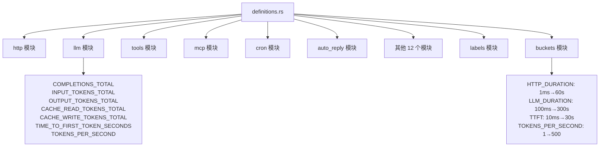
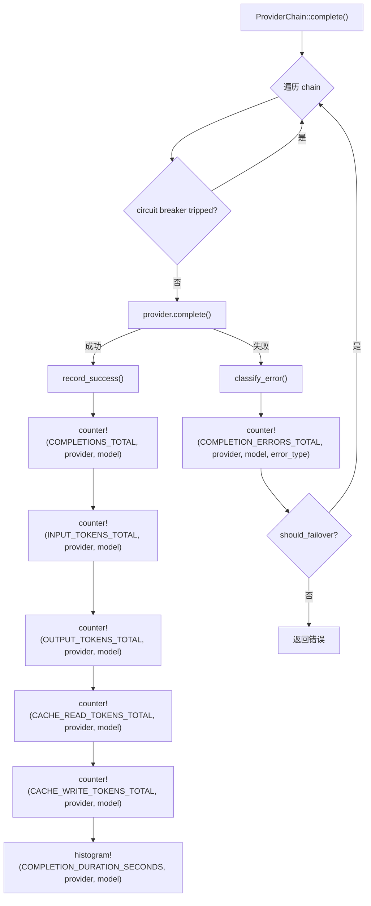

# PD-11.01 Moltis — Prometheus 指标体系与 Feature-Flag 门控可观测性

> 文档编号：PD-11.01
> 来源：Moltis `crates/metrics/src/definitions.rs`, `crates/agents/src/provider_chain.rs`, `crates/gateway/src/metrics_routes.rs`
> GitHub：https://github.com/moltis-org/moltis.git
> 问题域：PD-11 可观测性 Observability & Cost Tracking
> 状态：可复用方案

---

## 第 1 章 问题与动机

### 1.1 核心问题

Agent 系统涉及 HTTP 网关、WebSocket 长连接、LLM 调用、工具执行、MCP 服务器、定时任务、多渠道消息等十余个子系统。每个子系统都有独立的延迟特征和故障模式：LLM 调用可能耗时 5 分钟，工具执行可能卡死，MCP 服务器可能断连。如果没有统一的指标体系，运维只能靠日志 grep 排查问题，无法做到实时感知和趋势分析。

更关键的是，LLM 调用的 token 消耗直接关联成本。不同提供商（Anthropic/OpenAI/Google）的 token 计费规则不同，cache_read 和 cache_write 的价格差异巨大。如果不按 provider × model 维度精确记录 token 用量，成本分析就是一笔糊涂账。

同时，可观测性本身不能成为负担。大多数自部署用户不需要 Prometheus，不能因为引入 metrics 依赖就拖慢编译速度或增加二进制体积。

### 1.2 Moltis 的解法概述

1. **独立 `moltis-metrics` crate**：将所有指标定义、Prometheus 导出、tracing 集成、SQLite 持久化封装为独立 crate，通过 feature flag（`prometheus`/`tracing`/`sqlite`）门控编译（`crates/metrics/Cargo.toml:21-25`）
2. **20+ 模块 100+ 指标常量集中定义**：在 `definitions.rs` 中按子系统分模块定义所有指标名和标签键，确保命名一致性（`crates/metrics/src/definitions.rs:1-590`）
3. **`#[cfg(feature = "metrics")]` 零开销门控**：所有 crate 的指标记录代码都用 `cfg` 属性包裹，未启用时编译器直接剔除，零运行时开销（`crates/agents/src/provider_chain.rs:19-20`）
4. **provider × model 双维度 token 计量**：在 `ProviderChain::complete()` 中按 provider 和 model 标签分别记录 input/output/cache_read/cache_write 四种 token（`crates/agents/src/provider_chain.rs:253-298`）
5. **三层 API 暴露**：`/metrics`（Prometheus 文本）、`/api/metrics`（结构化 JSON）、`/api/metrics/history`（时序数据），满足 scraper、Dashboard、图表三种消费场景（`crates/gateway/src/metrics_routes.rs:29-142`）

### 1.3 设计思想

| 设计原则 | 具体实现 | 理由 | 替代方案 |
|----------|----------|------|----------|
| 编译期零开销 | `#[cfg(feature = "metrics")]` 门控所有指标代码 | 未启用 metrics 的构建不引入任何依赖和运行时开销 | 运行时 if 判断（有分支预测开销） |
| 集中定义分散使用 | `definitions.rs` 定义常量，各 crate 通过 `use moltis_metrics::llm` 引用 | 避免指标名拼写错误，IDE 可跳转 | 各处硬编码字符串（易出错） |
| Facade 模式 | 使用 `metrics` crate 的 `counter!/gauge!/histogram!` 宏 | 底层 recorder 可替换（Prometheus/StatsD/NoOp） | 直接调用 Prometheus client（耦合） |
| 双轨持久化 | 内存环形缓冲 + SQLite 异步写入 | 内存保证实时性，SQLite 保证重启后恢复 | 纯内存（重启丢失）或纯 DB（延迟高） |
| 按子系统分桶 | HTTP/LLM/Tool/TTFT 各有独立直方图桶边界 | LLM 调用 P99 可达 300s，HTTP 通常 <1s，共享桶会丢失精度 | 统一桶边界（精度损失） |

---

## 第 2 章 源码实现分析

### 2.1 架构概览

Moltis 的可观测性架构分为四层：定义层、记录层、采集层、暴露层。

```
┌─────────────────────────────────────────────────────────────────┐
│                        暴露层 (Gateway)                          │
│  /metrics (Prometheus)  /api/metrics (JSON)  /api/metrics/history│
│  WebSocket broadcast("metrics.update")                          │
└──────────────────────────┬──────────────────────────────────────┘
                           │ render() → parse → snapshot
┌──────────────────────────┴──────────────────────────────────────┐
│                     采集层 (10s interval loop)                    │
│  MetricsHandle.render() → MetricsSnapshot::from_prometheus_text()│
│  → MetricsHistory (ring buffer) + SqliteMetricsStore (async)     │
└──────────────────────────┬──────────────────────────────────────┘
                           │ counter!/gauge!/histogram!
┌──────────────────────────┴──────────────────────────────────────┐
│                     记录层 (各 crate 分散调用)                     │
│  agents/provider_chain.rs  cron/service.rs  auto-reply/reply.rs  │
│  gateway/server.rs         所有调用点用 #[cfg(feature="metrics")] │
└──────────────────────────┬──────────────────────────────────────┘
                           │ 引用常量
┌──────────────────────────┴──────────────────────────────────────┐
│                     定义层 (moltis-metrics crate)                 │
│  definitions.rs: 20 模块 100+ 指标常量 + labels + buckets        │
│  recorder.rs: PrometheusBuilder 初始化                           │
│  snapshot.rs: Prometheus 文本 → 结构化 JSON 解析                  │
│  store.rs: SQLite WAL 持久化 + MetricsStore trait                │
│  tracing_integration.rs: MetricsLayer span→label 传播            │
└─────────────────────────────────────────────────────────────────┘
```

### 2.2 核心实现

#### 2.2.1 指标定义体系



对应源码 `crates/metrics/src/definitions.rs:36-55`：

```rust
/// LLM/Agent metrics
pub mod llm {
    pub const COMPLETIONS_TOTAL: &str = "moltis_llm_completions_total";
    pub const COMPLETION_DURATION_SECONDS: &str = "moltis_llm_completion_duration_seconds";
    pub const INPUT_TOKENS_TOTAL: &str = "moltis_llm_input_tokens_total";
    pub const OUTPUT_TOKENS_TOTAL: &str = "moltis_llm_output_tokens_total";
    pub const CACHE_READ_TOKENS_TOTAL: &str = "moltis_llm_cache_read_tokens_total";
    pub const CACHE_WRITE_TOKENS_TOTAL: &str = "moltis_llm_cache_write_tokens_total";
    pub const COMPLETION_ERRORS_TOTAL: &str = "moltis_llm_completion_errors_total";
    pub const TIME_TO_FIRST_TOKEN_SECONDS: &str = "moltis_llm_time_to_first_token_seconds";
    pub const TOKENS_PER_SECOND: &str = "moltis_llm_tokens_per_second";
}
```

直方图桶按子系统特征定制，`crates/metrics/src/definitions.rs:520-527`：

```rust
/// LLM completion duration buckets (in seconds)
/// Covers 100ms to 5 minutes (LLM calls can be slow)
pub static LLM_DURATION: Lazy<Vec<f64>> = Lazy::new(|| {
    vec![0.1, 0.25, 0.5, 1.0, 2.5, 5.0, 10.0, 15.0, 30.0, 60.0, 120.0, 180.0, 300.0]
});
```

#### 2.2.2 ProviderChain 中的 Token 计量



对应源码 `crates/agents/src/provider_chain.rs:231-298`：

```rust
async fn complete(
    &self,
    messages: &[ChatMessage],
    tools: &[serde_json::Value],
) -> anyhow::Result<CompletionResponse> {
    let mut errors = Vec::new();
    #[cfg(feature = "metrics")]
    let start = Instant::now();

    for entry in &self.chain {
        if entry.state.is_tripped() { continue; }
        let provider_name = entry.provider.name().to_string();
        let model_id = entry.provider.id().to_string();

        match entry.provider.complete(messages, tools).await {
            Ok(resp) => {
                entry.state.record_success();
                #[cfg(feature = "metrics")]
                {
                    let duration = start.elapsed().as_secs_f64();
                    counter!(llm_metrics::COMPLETIONS_TOTAL,
                        labels::PROVIDER => provider_name.clone(),
                        labels::MODEL => model_id.clone()
                    ).increment(1);
                    counter!(llm_metrics::INPUT_TOKENS_TOTAL,
                        labels::PROVIDER => provider_name.clone(),
                        labels::MODEL => model_id.clone()
                    ).increment(u64::from(resp.usage.input_tokens));
                    // ... output_tokens, cache_read, cache_write 同理
                    histogram!(llm_metrics::COMPLETION_DURATION_SECONDS,
                        labels::PROVIDER => provider_name,
                        labels::MODEL => model_id
                    ).record(duration);
                }
                return Ok(resp);
            },
            Err(e) => {
                let kind = classify_error(&e);
                entry.state.record_failure();
                #[cfg(feature = "metrics")]
                counter!(llm_metrics::COMPLETION_ERRORS_TOTAL,
                    labels::PROVIDER => provider_name.clone(),
                    labels::MODEL => model_id.clone(),
                    labels::ERROR_TYPE => format!("{kind:?}")
                ).increment(1);
                // failover logic...
            },
        }
    }
    // ...
}
```

### 2.3 实现细节

#### 采集循环与双轨持久化

Gateway 启动时 spawn 一个 10 秒间隔的采集任务（`crates/gateway/src/server.rs:3584-3737`），该任务：

1. 从 `MetricsHandle.render()` 获取 Prometheus 文本
2. 用 `MetricsSnapshot::from_prometheus_text()` 解析为结构化数据
3. 构造 `MetricsHistoryPoint`（含 per-provider token 分解）
4. 推入内存环形缓冲（默认 360 点 = 1 小时）
5. 通过 `mpsc::unbounded_channel` 异步发送给 SQLite 写入任务（不阻塞采集）
6. 通过 WebSocket `broadcast("metrics.update")` 推送给所有连接的 Dashboard
7. 每 360 个 tick（1 小时）触发一次 cleanup，保留 7 天历史

SQLite 持久化使用 WAL 模式 + 单连接池（`crates/metrics/src/store.rs:93-96`），避免低吞吐场景下的锁竞争：

```rust
const METRICS_POOL_MAX_CONNECTIONS: u32 = 1;
const METRICS_BUSY_TIMEOUT: Duration = Duration::from_secs(30);
```

#### Prometheus 初始化与桶配置

`recorder.rs:79-122` 中，`PrometheusBuilder` 按指标名前缀/后缀/全名匹配不同的直方图桶：

- `*_duration_seconds` → HTTP 桶（1ms-60s）
- `moltis_llm_completion*` → LLM 桶（100ms-300s）
- `moltis_llm_time_to_first_token_seconds` → TTFT 桶（10ms-30s）
- `moltis_llm_tokens_per_second` → 吞吐桶（1-500 tok/s）

#### Snapshot 解析与分类聚合

`snapshot.rs:188-208` 实现了 Prometheus 文本 → JSON 的转换，`update_categories()` 函数（`snapshot.rs:276-377`）将扁平指标聚合到 HTTP/WebSocket/LLM/Session/Tools/MCP/Memory/System 八个分类，LLM 分类额外按 provider 和 model 两个维度拆分。


---

## 第 3 章 迁移指南

### 3.1 迁移清单

**阶段 1：指标定义 crate（1 个文件）**
- [ ] 创建独立的 `metrics` crate，依赖 `metrics` facade crate
- [ ] 在 `definitions.rs` 中按子系统模块定义所有指标常量
- [ ] 定义 `labels` 模块统一标签键名
- [ ] 定义 `buckets` 模块按子系统定制直方图桶边界
- [ ] 在 `Cargo.toml` 中设置 `prometheus`/`tracing`/`sqlite` 为可选 feature

**阶段 2：记录层接入（各 crate 改动）**
- [ ] 各 crate 添加 `metrics = ["dep:your-metrics-crate"]` feature
- [ ] 在 LLM 调用点添加 `counter!/histogram!`，标签含 provider + model
- [ ] 在工具执行点添加 `counter!/histogram!`，标签含 tool name
- [ ] 所有指标代码用 `#[cfg(feature = "metrics")]` 包裹

**阶段 3：采集与暴露（Gateway 改动）**
- [ ] 启动时调用 `init_metrics()` 初始化 Prometheus recorder
- [ ] 添加 `/metrics` 端点（Prometheus 文本格式）
- [ ] 添加 `/api/metrics` 端点（结构化 JSON）
- [ ] spawn 10 秒间隔采集任务，推入环形缓冲

**阶段 4：持久化（可选）**
- [ ] 实现 `MetricsStore` trait 的 SQLite 后端
- [ ] 采集任务通过 mpsc channel 异步写入
- [ ] 启动时从 SQLite 恢复历史数据
- [ ] 定期 cleanup 过期数据

### 3.2 适配代码模板

#### 指标定义模板（Rust）

```rust
// my_metrics/src/definitions.rs
pub mod llm {
    pub const COMPLETIONS_TOTAL: &str = "myapp_llm_completions_total";
    pub const COMPLETION_DURATION_SECONDS: &str = "myapp_llm_completion_duration_seconds";
    pub const INPUT_TOKENS_TOTAL: &str = "myapp_llm_input_tokens_total";
    pub const OUTPUT_TOKENS_TOTAL: &str = "myapp_llm_output_tokens_total";
    pub const CACHE_READ_TOKENS_TOTAL: &str = "myapp_llm_cache_read_tokens_total";
    pub const CACHE_WRITE_TOKENS_TOTAL: &str = "myapp_llm_cache_write_tokens_total";
    pub const ERRORS_TOTAL: &str = "myapp_llm_errors_total";
}

pub mod labels {
    pub const PROVIDER: &str = "provider";
    pub const MODEL: &str = "model";
    pub const ERROR_TYPE: &str = "error_type";
}

pub mod buckets {
    use once_cell::sync::Lazy;
    pub static LLM_DURATION: Lazy<Vec<f64>> = Lazy::new(|| {
        vec![0.1, 0.5, 1.0, 2.5, 5.0, 10.0, 30.0, 60.0, 120.0, 300.0]
    });
}
```

#### Feature-Flag 门控记录模板

```rust
// 在 LLM 调用点
#[cfg(feature = "metrics")]
use my_metrics::{counter, histogram, labels, llm as llm_metrics};

async fn call_llm(&self, messages: &[Message]) -> Result<Response> {
    #[cfg(feature = "metrics")]
    let start = std::time::Instant::now();

    let resp = self.provider.complete(messages).await?;

    #[cfg(feature = "metrics")]
    {
        counter!(llm_metrics::COMPLETIONS_TOTAL,
            labels::PROVIDER => self.provider.name(),
            labels::MODEL => self.provider.model()
        ).increment(1);
        counter!(llm_metrics::INPUT_TOKENS_TOTAL,
            labels::PROVIDER => self.provider.name(),
            labels::MODEL => self.provider.model()
        ).increment(resp.usage.input_tokens as u64);
        histogram!(llm_metrics::COMPLETION_DURATION_SECONDS,
            labels::PROVIDER => self.provider.name(),
            labels::MODEL => self.provider.model()
        ).record(start.elapsed().as_secs_f64());
    }

    Ok(resp)
}
```

#### 采集循环模板

```rust
// Gateway 启动时 spawn
tokio::spawn(async move {
    let mut interval = tokio::time::interval(Duration::from_secs(10));
    loop {
        interval.tick().await;
        if let Some(handle) = &metrics_handle {
            let text = handle.render();
            let snapshot = MetricsSnapshot::from_prometheus_text(&text);
            let point = MetricsHistoryPoint::from_snapshot(&snapshot);
            // 推入环形缓冲
            history.push(point.clone());
            // 异步持久化（不阻塞）
            let _ = persist_tx.send(PersistJob::Save(point));
        }
    }
});
```

### 3.3 适用场景

| 场景 | 适用度 | 说明 |
|------|--------|------|
| Rust Agent 系统需要 Prometheus 监控 | ⭐⭐⭐ | 直接复用 definitions + recorder + feature flag 模式 |
| 多 LLM 提供商的 token 成本追踪 | ⭐⭐⭐ | provider × model 双维度 + 4 种 token 类型完整覆盖 |
| 需要 Dashboard 实时展示指标 | ⭐⭐⭐ | 三层 API + WebSocket broadcast 模式可直接复用 |
| Python/TypeScript Agent 系统 | ⭐⭐ | 设计思想可迁移，但代码需重写（feature flag → 运行时开关） |
| 只需要日志不需要指标 | ⭐ | 过度设计，直接用 tracing + structured logging 更轻量 |

---

## 第 4 章 测试用例

```rust
#[cfg(test)]
mod tests {
    use super::*;
    use std::collections::HashMap;

    // ── 指标定义一致性测试 ──

    #[test]
    fn test_all_llm_metrics_have_moltis_prefix() {
        let metrics = [
            llm::COMPLETIONS_TOTAL,
            llm::COMPLETION_DURATION_SECONDS,
            llm::INPUT_TOKENS_TOTAL,
            llm::OUTPUT_TOKENS_TOTAL,
            llm::CACHE_READ_TOKENS_TOTAL,
            llm::CACHE_WRITE_TOKENS_TOTAL,
            llm::COMPLETION_ERRORS_TOTAL,
            llm::TIME_TO_FIRST_TOKEN_SECONDS,
            llm::TOKENS_PER_SECOND,
        ];
        for m in metrics {
            assert!(m.starts_with("moltis_llm_"), "metric {m} missing prefix");
        }
    }

    // ── Prometheus 文本解析测试 ──

    #[test]
    fn test_snapshot_aggregates_by_provider() {
        let text = r#"
moltis_llm_completions_total{provider="anthropic",model="claude-3"} 100
moltis_llm_completions_total{provider="openai",model="gpt-4"} 50
moltis_llm_input_tokens_total{provider="anthropic",model="claude-3"} 50000
moltis_llm_input_tokens_total{provider="openai",model="gpt-4"} 20000
"#;
        let snapshot = MetricsSnapshot::from_prometheus_text(text);
        assert_eq!(snapshot.categories.llm.completions_total, 150);
        assert_eq!(snapshot.categories.llm.input_tokens, 70000);
        assert_eq!(snapshot.categories.llm.by_provider["anthropic"].completions, 100);
        assert_eq!(snapshot.categories.llm.by_provider["openai"].input_tokens, 20000);
    }

    // ── SQLite 持久化测试 ──

    #[tokio::test]
    async fn test_metrics_store_save_and_load_with_provider_breakdown() {
        let store = SqliteMetricsStore::in_memory().await.unwrap();
        let mut point = MetricsHistoryPoint {
            timestamp: 1000,
            llm_completions: 10,
            llm_input_tokens: 500,
            llm_output_tokens: 200,
            llm_errors: 0,
            by_provider: HashMap::new(),
            http_requests: 100,
            http_active: 5,
            ws_connections: 10,
            ws_active: 2,
            tool_executions: 15,
            tool_errors: 1,
            mcp_calls: 8,
            active_sessions: 3,
        };
        point.by_provider.insert("anthropic".into(), ProviderTokens {
            input_tokens: 300, output_tokens: 150, completions: 6, errors: 0,
        });
        point.by_provider.insert("openai".into(), ProviderTokens {
            input_tokens: 200, output_tokens: 50, completions: 4, errors: 0,
        });

        store.save_point(&point).await.unwrap();
        let history = store.load_history(0, 100).await.unwrap();
        assert_eq!(history.len(), 1);
        assert_eq!(history[0].by_provider.len(), 2);
        assert_eq!(history[0].by_provider["anthropic"].input_tokens, 300);
    }

    // ── 错误分类测试 ──

    #[test]
    fn test_classify_error_for_metrics_labels() {
        use crate::provider_chain::{classify_error, ProviderErrorKind};
        let rate_limit = anyhow::anyhow!("429 rate limit exceeded");
        assert_eq!(classify_error(&rate_limit), ProviderErrorKind::RateLimit);

        let context = anyhow::anyhow!("context_length_exceeded");
        assert_eq!(classify_error(&context), ProviderErrorKind::ContextWindow);

        let billing = anyhow::anyhow!("insufficient_quota: billing limit");
        assert_eq!(classify_error(&billing), ProviderErrorKind::BillingExhausted);
    }

    // ── Feature flag 降级测试 ──

    #[test]
    fn test_init_metrics_disabled_returns_empty() {
        let config = MetricsRecorderConfig {
            enabled: false,
            ..Default::default()
        };
        let handle = init_metrics(config).unwrap();
        let output = handle.render();
        assert!(output.is_empty() || output.contains('#'));
    }
}
```


---

## 第 5 章 跨域关联

| 关联域 | 关系类型 | 说明 |
|--------|----------|------|
| PD-03 容错与重试 | 协同 | `ProviderChain` 的 circuit breaker 状态（`is_tripped`/`record_failure`）与 `COMPLETION_ERRORS_TOTAL` 指标联动，错误分类（`classify_error`）同时驱动 failover 决策和 error_type 标签 |
| PD-04 工具系统 | 协同 | `tools` 模块定义了 `EXECUTIONS_TOTAL`/`EXECUTION_DURATION_SECONDS`/`EXECUTIONS_IN_FLIGHT` 指标，MCP 工具调用有独立的 `mcp` 模块指标 |
| PD-06 记忆持久化 | 协同 | `memory` 模块追踪 `SEARCHES_TOTAL`/`SEARCH_DURATION_SECONDS`/`EMBEDDINGS_GENERATED_TOTAL`，embedding 生成计数可用于评估记忆系统的 token 消耗 |
| PD-01 上下文管理 | 依赖 | `ContextWindow` 错误类型不触发 failover 而是返回给调用方做上下文压缩，这个决策通过 `COMPLETION_ERRORS_TOTAL{error_type="ContextWindow"}` 指标可追踪 |
| PD-02 多 Agent 编排 | 协同 | `session` 模块追踪 `ACTIVE` sessions，`cron` 模块追踪定时 Agent 任务的 token 消耗，编排层可通过这些指标做资源调度 |

---

## 第 6 章 来源文件索引

| 文件 | 行范围 | 关键实现 |
|------|--------|----------|
| `crates/metrics/src/definitions.rs` | L1-L590 | 20 模块 100+ 指标常量定义 + labels + buckets |
| `crates/metrics/src/recorder.rs` | L53-L129 | Prometheus 初始化 + 桶配置 + MetricsHandle |
| `crates/metrics/src/snapshot.rs` | L1-L418 | Prometheus 文本解析 + 分类聚合 + LLM by_provider/by_model |
| `crates/metrics/src/store.rs` | L1-L451 | SQLite WAL 持久化 + MetricsStore trait + ProviderTokens |
| `crates/metrics/src/tracing_integration.rs` | L1-L47 | MetricsLayer span→label 传播 |
| `crates/metrics/src/lib.rs` | L1-L43 | crate 入口 + feature flag 门控 re-export |
| `crates/metrics/Cargo.toml` | L21-L25 | prometheus/tracing/sqlite 三个可选 feature |
| `crates/agents/src/provider_chain.rs` | L19-L298 | ProviderChain 中的 token 计量 + 错误分类 + circuit breaker |
| `crates/agents/src/model.rs` | L390-L396 | Usage 结构体（input/output/cache_read/cache_write） |
| `crates/cron/src/service.rs` | L449-L695 | Cron 任务的 jobs_scheduled/executions/tokens/errors/stuck_jobs 指标 |
| `crates/auto-reply/src/reply.rs` | L6-L53 | Auto-reply 的 messages_received/processing_duration 指标 |
| `crates/gateway/src/metrics_routes.rs` | L1-L142 | 三层 API 端点（Prometheus/JSON/History） |
| `crates/gateway/src/server.rs` | L2835-L2914 | 启动时 metrics 初始化 + SQLite store 创建 |
| `crates/gateway/src/server.rs` | L3584-L3737 | 10s 采集循环 + 环形缓冲 + 异步持久化 + WebSocket broadcast |

---

## 第 7 章 横向对比维度

```json comparison_data
{
  "project": "Moltis",
  "dimensions": {
    "追踪方式": "metrics crate facade + #[cfg(feature)] 编译期门控",
    "数据粒度": "provider × model 双维度，4 种 token 类型分别计数",
    "持久化": "SQLite WAL 单连接 + mpsc 异步写入，7 天保留",
    "多提供商": "ProviderChain failover 链，每个 provider 独立 circuit breaker + 指标",
    "指标采集": "Prometheus 文本导出 + 10s 间隔采集循环解析为结构化 JSON",
    "日志格式": "tracing crate 结构化日志 + MetricsLayer span→label 传播",
    "可视化": "三层 API（/metrics + /api/metrics + /api/metrics/history）+ WebSocket 实时推送",
    "成本追踪": "input/output/cache_read/cache_write 四种 token 按 provider×model 计数",
    "健康端点": "/metrics 端点 + uptime_seconds gauge + connected_clients gauge",
    "零开销路径": "Cargo feature flag 编译期剔除，未启用时零依赖零开销",
    "延迟统计": "HTTP/LLM/TTFT/Tool 四套独立直方图桶，LLM 桶覆盖 100ms-300s",
    "卡死检测": "cron stuck_jobs_cleared_total 指标，2h 阈值自动清理卡死任务",
    "Span 传播": "metrics-tracing-context MetricsLayer 自动将 span 字段注入指标标签",
    "预算守卫": "无内置预算守卫，但 per-provider token 计数可外部实现阈值告警",
    "安全审计": "auth 模块追踪 login_attempts/success/failures/api_key_auth",
    "渠道分层": "Telegram/Discord/MCP 各有独立指标模块，channel 标签区分",
    "业务元数据注入": "20 个标签键集中定义在 labels 模块，含 provider/model/tool/channel/role"
  }
}
```

### 域元数据补充

```json domain_metadata
{
  "solution_summary": "Moltis 用独立 moltis-metrics crate 集中定义 20 模块 100+ Prometheus 指标常量，通过 Cargo feature flag 编译期门控实现零开销，ProviderChain 按 provider×model 双维度记录 4 种 token 计量，10s 采集循环 + SQLite WAL 持久化 + WebSocket 实时推送",
  "description": "Rust 编译期 feature flag 门控的零开销可观测性方案",
  "sub_problems": [
    "Prometheus 文本→结构化 JSON 的实时解析与分类聚合",
    "直方图桶按子系统特征定制：LLM 100ms-300s vs HTTP 1ms-60s",
    "采集循环与持久化解耦：mpsc channel 异步写入避免阻塞采集",
    "环形缓冲 + SQLite 双轨存储：内存保实时性，DB 保重启恢复",
    "WebSocket broadcast 实时推送指标更新到 Dashboard"
  ],
  "best_practices": [
    "用 Cargo feature flag 而非运行时 if 门控指标代码：编译期零开销",
    "指标常量集中定义在独立 crate 的 definitions.rs：IDE 可跳转，避免拼写错误",
    "直方图桶按子系统定制：LLM 调用和 HTTP 请求的延迟分布差异巨大",
    "SQLite 持久化用单连接池 + WAL 模式：低吞吐场景避免锁竞争",
    "采集循环通过 mpsc channel 异步写入 DB：不阻塞 10s 采集节奏"
  ]
}
```

