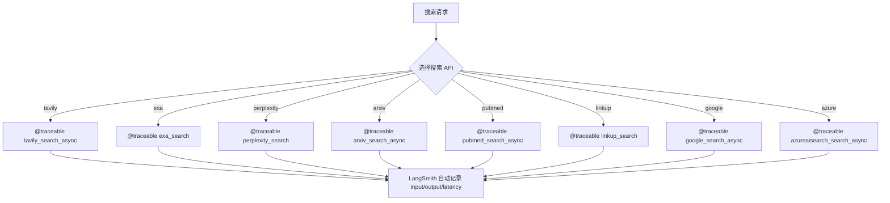
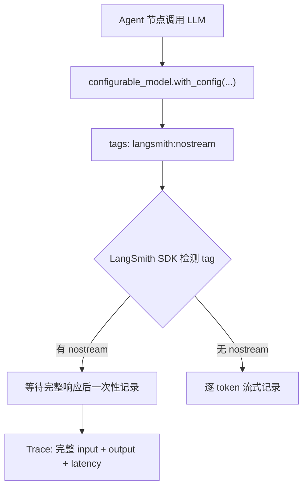

# PD-11.07 Open Deep Research — LangSmith 深度集成可观测性

> 文档编号：PD-11.07
> 来源：Open Deep Research `src/legacy/utils.py` `src/open_deep_research/deep_researcher.py` `tests/run_evaluate.py`
> GitHub：https://github.com/langchain-ai/open_deep_research.git
> 问题域：PD-11 可观测性 Observability & Cost Tracking
> 状态：可复用方案

---

## 第 1 章 问题与动机

### 1.1 核心问题

深度研究 Agent 系统面临三层可观测性挑战：

1. **调用链不透明**：多层 Agent（Supervisor → Researcher × N → Compress → Final Report）的 LLM 调用嵌套深度达 4 层，单次研究可能触发 50+ 次 LLM 调用，无法追踪哪个子研究员消耗了最多资源。
2. **评估实验缺乏可比性**：不同模型组合（GPT-4.1 vs Claude Sonnet 4）、不同搜索 API（Tavily vs Exa vs Perplexity）的实验结果需要在统一平台上对比，手动记录参数容易遗漏。
3. **搜索函数黑盒化**：8 种搜索 API（Tavily、Exa、Perplexity、ArXiv、PubMed、Linkup、Google、Azure AI Search）各有不同的延迟和失败模式，需要逐函数追踪。

### 1.2 Open Deep Research 的解法概述

该项目采用 **LangSmith 原生集成** 的三层可观测性策略：

1. **`@traceable` 装饰器覆盖所有搜索函数**（`src/legacy/utils.py:172-927`）：8 个搜索函数全部标注 `@traceable`，自动记录输入参数、返回值、耗时到 LangSmith。
2. **`langsmith:nostream` tag 标记所有 LLM 调用**（`src/open_deep_research/deep_researcher.py:85-631`）：6 处模型调用均通过 `tags=["langsmith:nostream"]` 禁止流式追踪，确保 LangSmith 记录完整的请求/响应对。
3. **`Client.aevaluate` 驱动评估实验**（`tests/run_evaluate.py:64-86`）：通过 LangSmith SDK 的异步评估 API 运行实验，自动记录完整元数据（模型选择、token 限制、并发数等 14 个参数）。
4. **`evaluate_comparative` 支持跨实验对比**（`tests/pairwise_evaluation.py:124-128`）：使用 LangSmith 的 pairwise 评估功能，对比不同架构（单 Agent vs 多 Agent Supervisor）的输出质量。
5. **`langsmith.testing` 集成 pytest**（`src/legacy/tests/test_report_quality.py:9,159-291`）：通过 `t.log_inputs()` 和 `t.log_outputs()` 将测试输入输出记录到 LangSmith，`@pytest.mark.langsmith` 标记测试用例。

### 1.3 设计思想

| 设计原则 | 具体实现 | 理由 | 替代方案 |
|----------|----------|------|----------|
| 零侵入追踪 | `@traceable` 装饰器 + LangChain 自动追踪 | 业务代码无需修改即可获得完整调用链 | 手动 span 创建（OpenTelemetry） |
| 流式控制 | `langsmith:nostream` tag | 避免流式 token 碎片化追踪，保证完整请求/响应对 | 客户端聚合流式 token |
| 实验可复现 | metadata 字典记录 14 个配置参数 | 任何实验都可通过 metadata 精确复现 | 配置文件版本控制 |
| 评估标准化 | 6 维评分体系 + pairwise 对比 | 多维度量化 + 相对排名消除评分偏差 | 单一综合分数 |
| 环境变量驱动 | `LANGCHAIN_TRACING_V2=true` 全局开关 | 生产环境可一键关闭追踪零开销 | 代码级开关 |

---

## 第 2 章 源码实现分析

### 2.1 架构概览

Open Deep Research 的可观测性架构分为三层：运行时追踪层、评估实验层、对比分析层。

```
┌─────────────────────────────────────────────────────────────────┐
│                    LangSmith Cloud Platform                      │
│  ┌──────────────┐  ┌──────────────┐  ┌────────────────────┐    │
│  │  Trace View   │  │  Experiments │  │ Pairwise Compare   │    │
│  │  (调用链)     │  │  (评估结果)  │  │ (A/B 对比)         │    │
│  └──────┬───────┘  └──────┬───────┘  └────────┬───────────┘    │
│         │                 │                    │                 │
└─────────┼─────────────────┼────────────────────┼─────────────────┘
          │                 │                    │
    ┌─────┴─────┐    ┌─────┴──────┐    ┌───────┴────────┐
    │ @traceable │    │ aevaluate  │    │ evaluate_      │
    │ + nostream │    │ + metadata │    │ comparative    │
    │ (运行时)   │    │ (评估时)   │    │ (对比时)       │
    └─────┬─────┘    └─────┬──────┘    └───────┬────────┘
          │                │                    │
    ┌─────┴────────────────┴────────────────────┴──────────┐
    │              Deep Research Agent Runtime               │
    │  Supervisor → Researcher×N → Compress → Final Report  │
    │  8 Search APIs (all @traceable)                        │
    │  6 LLM calls (all langsmith:nostream)                  │
    └──────────────────────────────────────────────────────────┘
```

### 2.2 核心实现

#### 2.2.1 @traceable 装饰器覆盖搜索函数



对应源码 `src/legacy/utils.py:172-218`：

```python
@traceable
async def tavily_search_async(search_queries, max_results: int = 5,
                               topic: Literal["general", "news", "finance"] = "general",
                               include_raw_content: bool = True):
    """Performs concurrent web searches with the Tavily API"""
    tavily_async_client = AsyncTavilyClient()
    search_tasks = []
    for query in search_queries:
        search_tasks.append(
            tavily_async_client.search(
                query, max_results=max_results,
                include_raw_content=include_raw_content, topic=topic
            )
        )
    search_docs = await asyncio.gather(*search_tasks)
    return search_docs

@traceable
async def azureaisearch_search_async(search_queries: list[str],
                                      max_results: int = 5,
                                      topic: str = "general",
                                      include_raw_content: bool = True) -> list[dict]:
    """Performs concurrent web searches using the Azure AI Search API."""
    # ... Azure Search 实现 ...
```

Legacy 模块中共有 8 个搜索函数使用 `@traceable`：`tavily_search_async`（L172）、`azureaisearch_search_async`（L218）、`perplexity_search`（L278）、`exa_search`（L373）、`arxiv_search_async`（L576）、`pubmed_search_async`（L733）、`linkup_search`（L881）、`google_search_async`（L927）。

#### 2.2.2 langsmith:nostream tag 控制 LLM 追踪



对应源码 `src/open_deep_research/deep_researcher.py:81-86`（clarify_with_user 节点）：

```python
# Step 2: Prepare the model for structured clarification analysis
messages = state["messages"]
model_config = {
    "model": configurable.research_model,
    "max_tokens": configurable.research_model_max_tokens,
    "api_key": get_api_key_for_model(configurable.research_model, config),
    "tags": ["langsmith:nostream"]
}

# Configure model with structured output and retry logic
clarification_model = (
    configurable_model
    .with_structured_output(ClarifyWithUser)
    .with_retry(stop_after_attempt=configurable.max_structured_output_retries)
    .with_config(model_config)
)
```

该 tag 在 6 个 Agent 节点中统一使用：`clarify_with_user`（L85）、`write_research_brief`（L138）、`supervisor`（L198）、`researcher`（L396）、`compress_research`（L531）、`final_report_generation`（L631）。新版 `utils.py` 中的 `init_chat_model` 调用也使用了该 tag（L90）。

### 2.3 实现细节

#### 评估实验元数据注入

`tests/run_evaluate.py:64-86` 展示了如何通过 `client.aevaluate` 的 `metadata` 参数记录完整实验配置：

```python
async def main():
    return await client.aevaluate(
        target,
        data=dataset_name,
        evaluators=evaluators,
        experiment_prefix=f"ODR GPT-5, Tavily Search",
        max_concurrency=10,
        metadata={
            "max_structured_output_retries": max_structured_output_retries,
            "allow_clarification": allow_clarification,
            "max_concurrent_research_units": max_concurrent_research_units,
            "search_api": search_api,
            "max_researcher_iterations": max_researcher_iterations,
            "max_react_tool_calls": max_react_tool_calls,
            "summarization_model": summarization_model,
            "summarization_model_max_tokens": summarization_model_max_tokens,
            "research_model": research_model,
            "research_model_max_tokens": research_model_max_tokens,
            "compression_model": compression_model,
            "compression_model_max_tokens": compression_model_max_tokens,
            "final_report_model": final_report_model,
            "final_report_model_max_tokens": final_report_model_max_tokens,
        }
    )
```

14 个参数覆盖了模型选择（4 个模型 × 2 参数）+ 行为配置（6 个参数），确保任何实验都可精确复现。

#### 6 维评估指标体系

`tests/evaluators.py:25-55` 定义了 6 个独立评估维度：

```python
class OverallQualityScore(BaseModel):
    research_depth: int = Field(description="Integer score 1-5")
    source_quality: int = Field(description="Integer score 1-5")
    analytical_rigor: int = Field(description="Integer score 1-5")
    practical_value: int = Field(description="Integer score 1-5")
    balance_and_objectivity: int = Field(description="Integer score 1-5")
    writing_quality: int = Field(description="Integer score 1-5")
```

加上 `relevance`、`structure`、`correctness`、`groundedness`、`completeness` 共 11 个评估函数，每个返回归一化到 0-1 的分数。

#### pytest + LangSmith 集成

`src/legacy/tests/test_report_quality.py:139-291` 展示了 pytest 与 LangSmith 的深度集成：

- `@pytest.mark.langsmith` 标记测试用例（L139）
- `t.log_inputs()` 记录测试输入（L159-166）
- `t.log_outputs()` 记录测试输出（L284-291）
- `run_test.py:82-91` 通过环境变量配置 LangSmith 项目和实验名

#### Pairwise 对比评估

`tests/pairwise_evaluation.py:124-128` 使用 `evaluate_comparative` 进行跨架构对比：

```python
evaluate_comparative(
    (single_agent, multi_agent_supervisor_v2),
    evaluators=[head_to_head_evaluator],
    randomize_order=True,  # 随机化顺序消除位置偏差
)
```

评估器使用 Claude Opus 4 + extended thinking（16K budget tokens）作为裁判模型（L36-39）。


---

## 第 3 章 迁移指南

### 3.1 迁移清单

**阶段 1：基础追踪（1 天）**
- [ ] 安装 `langsmith` SDK：`pip install langsmith`
- [ ] 设置环境变量：`LANGCHAIN_TRACING_V2=true`、`LANGCHAIN_API_KEY=<key>`
- [ ] 为所有外部 API 调用函数添加 `@traceable` 装饰器
- [ ] 为所有 LLM 调用添加 `tags=["langsmith:nostream"]`

**阶段 2：评估实验（2 天）**
- [ ] 在 LangSmith 创建评估数据集（Dataset）
- [ ] 编写评估函数（返回 `{"key": str, "score": float}` 格式）
- [ ] 使用 `client.aevaluate()` 运行实验，metadata 记录所有配置参数
- [ ] 设置 `experiment_prefix` 便于在 LangSmith UI 中筛选

**阶段 3：对比分析（1 天）**
- [ ] 使用 `evaluate_comparative()` 进行 pairwise 对比
- [ ] 集成 pytest + `langsmith.testing` 实现 CI 中的自动评估

### 3.2 适配代码模板

#### 模板 1：为搜索函数添加 @traceable

```python
from langsmith import traceable

@traceable
async def my_search_function(queries: list[str], max_results: int = 5) -> list[dict]:
    """任何外部 API 调用都可以用 @traceable 包装。
    LangSmith 自动记录：函数名、输入参数、返回值、耗时、异常。
    """
    results = []
    for query in queries:
        resp = await external_api.search(query, limit=max_results)
        results.append(resp)
    return results
```

#### 模板 2：LLM 调用 nostream tag

```python
from langchain.chat_models import init_chat_model

configurable_model = init_chat_model(
    configurable_fields=("model", "max_tokens", "api_key"),
)

async def my_agent_node(state, config):
    model_config = {
        "model": "openai:gpt-4.1",
        "max_tokens": 10000,
        "api_key": os.getenv("OPENAI_API_KEY"),
        "tags": ["langsmith:nostream"]  # 关键：禁止流式追踪
    }
    model = configurable_model.with_config(model_config)
    response = await model.ainvoke(messages)
    return {"output": response.content}
```

#### 模板 3：评估实验运行

```python
from langsmith import Client

client = Client()

async def run_evaluation():
    results = await client.aevaluate(
        target=my_agent_function,
        data="my-dataset-name",
        evaluators=[eval_quality, eval_relevance, eval_groundedness],
        experiment_prefix="v2.1 GPT-4.1",
        max_concurrency=5,
        metadata={
            "model": "openai:gpt-4.1",
            "search_api": "tavily",
            "max_iterations": 6,
            # 记录所有影响结果的配置参数
        }
    )
    return results
```

#### 模板 4：Pairwise 对比评估

```python
from langsmith.evaluation import evaluate_comparative
from pydantic import BaseModel, Field

class HeadToHeadRanking(BaseModel):
    reasoning: str = Field(description="评估理由")
    preferred_answer: int = Field(description="1 或 2")

def head_to_head_evaluator(inputs: dict, outputs: list[dict]) -> list:
    grader = ChatAnthropic(model="claude-opus-4-20250514")
    response = grader.with_structured_output(HeadToHeadRanking).invoke(
        COMPARISON_PROMPT.format(
            question=inputs["query"],
            answer_a=outputs[0]["report"],
            answer_b=outputs[1]["report"],
        )
    )
    return [1, 0] if response.preferred_answer == 1 else [0, 1]

evaluate_comparative(
    ("experiment-a-id", "experiment-b-id"),
    evaluators=[head_to_head_evaluator],
    randomize_order=True,
)
```

### 3.3 适用场景

| 场景 | 适用度 | 说明 |
|------|--------|------|
| LangChain/LangGraph 项目 | ⭐⭐⭐ | 原生集成，零配置即可获得完整追踪 |
| 多模型 A/B 测试 | ⭐⭐⭐ | aevaluate + metadata 完美支持实验管理 |
| 多搜索源 Agent | ⭐⭐⭐ | @traceable 逐函数追踪搜索延迟和失败率 |
| 非 LangChain 项目 | ⭐⭐ | @traceable 可独立使用，但失去 LangChain 自动追踪 |
| 离线/私有部署 | ⭐ | 依赖 LangSmith 云服务，离线需自建 LangSmith 实例 |
| 实时成本告警 | ⭐ | 无内置成本追踪，需从 LangSmith trace 数据二次计算 |

---

## 第 4 章 测试用例

```python
import pytest
from unittest.mock import AsyncMock, patch, MagicMock
from langsmith import Client


class TestTraceableDecorator:
    """测试 @traceable 装饰器是否正确应用到搜索函数"""

    def test_traceable_applied_to_tavily(self):
        """验证 tavily_search_async 被 @traceable 装饰"""
        from legacy.utils import tavily_search_async
        # @traceable 装饰后函数会有 __wrapped__ 属性
        assert hasattr(tavily_search_async, '__wrapped__') or \
               'langsmith' in str(getattr(tavily_search_async, '__module__', ''))

    def test_traceable_applied_to_all_search_functions(self):
        """验证所有 8 个搜索函数都被 @traceable 装饰"""
        from legacy import utils
        traceable_functions = [
            'tavily_search_async', 'azureaisearch_search_async',
            'perplexity_search', 'exa_search', 'arxiv_search_async',
            'pubmed_search_async', 'linkup_search', 'google_search_async',
        ]
        for func_name in traceable_functions:
            func = getattr(utils, func_name)
            assert callable(func), f"{func_name} should be callable"


class TestNoStreamTag:
    """测试 langsmith:nostream tag 是否正确配置"""

    def test_nostream_tag_in_model_config(self):
        """验证模型配置中包含 nostream tag"""
        model_config = {
            "model": "openai:gpt-4.1",
            "max_tokens": 10000,
            "tags": ["langsmith:nostream"]
        }
        assert "langsmith:nostream" in model_config["tags"]

    def test_nostream_tag_prevents_streaming(self):
        """验证 nostream tag 的语义：LangSmith 应等待完整响应"""
        tags = ["langsmith:nostream"]
        # nostream tag 告诉 LangSmith 不要逐 token 追踪
        assert any("nostream" in tag for tag in tags)


class TestEvaluationMetadata:
    """测试评估实验的元数据完整性"""

    def test_metadata_contains_all_config_params(self):
        """验证 metadata 包含所有 14 个配置参数"""
        metadata = {
            "max_structured_output_retries": 3,
            "allow_clarification": False,
            "max_concurrent_research_units": 10,
            "search_api": "tavily",
            "max_researcher_iterations": 6,
            "max_react_tool_calls": 10,
            "summarization_model": "openai:gpt-4.1-mini",
            "summarization_model_max_tokens": 8192,
            "research_model": "openai:gpt-5",
            "research_model_max_tokens": 10000,
            "compression_model": "openai:gpt-4.1",
            "compression_model_max_tokens": 10000,
            "final_report_model": "openai:gpt-4.1",
            "final_report_model_max_tokens": 10000,
        }
        assert len(metadata) == 14
        # 验证模型参数成对出现
        model_keys = [k for k in metadata if k.endswith("_model")]
        token_keys = [k for k in metadata if k.endswith("_max_tokens")]
        assert len(model_keys) == 4  # 4 个模型
        assert len(token_keys) == 4  # 4 个 token 限制

    def test_evaluator_score_normalization(self):
        """验证评估分数归一化到 0-1"""
        raw_score = 4  # 1-5 scale
        normalized = raw_score / 5
        assert 0 <= normalized <= 1


class TestPairwiseEvaluation:
    """测试 pairwise 对比评估"""

    def test_head_to_head_scores_sum(self):
        """验证 head-to-head 评分总和为 1"""
        # preferred_answer == 1
        scores_a = [1, 0]
        assert sum(scores_a) == 1
        # preferred_answer == 2
        scores_b = [0, 1]
        assert sum(scores_b) == 1

    def test_free_for_all_ranking_consistency(self):
        """验证三方对比排名的一致性"""
        scores = [0, 0, 0]
        preferred, second, worst = 1, 3, 2  # 排名
        scores[preferred - 1] = 1
        scores[second - 1] = 0.5
        scores[worst - 1] = 0
        assert scores == [1, 0, 0.5]
        assert max(scores) == 1
        assert min(scores) == 0
```


---

## 第 5 章 跨域关联

| 关联域 | 关系类型 | 说明 |
|--------|----------|------|
| PD-01 上下文管理 | 协同 | `langsmith:nostream` 确保完整记录压缩前后的上下文，`compress_research` 节点的输入/输出对比可量化压缩效果 |
| PD-02 多 Agent 编排 | 依赖 | Supervisor → Researcher×N 的并行调用链在 LangSmith 中自动形成嵌套 trace，可视化编排拓扑 |
| PD-03 容错与重试 | 协同 | `with_retry(stop_after_attempt=N)` 的重试次数在 LangSmith trace 中可见，`is_token_limit_exceeded` 的降级路径也被追踪 |
| PD-07 质量检查 | 依赖 | 6 维评估函数 + pairwise 对比是质量检查的核心实现，评估结果存储在 LangSmith Experiments 中 |
| PD-08 搜索与检索 | 协同 | 8 个 `@traceable` 搜索函数的延迟和失败率数据支撑搜索策略优化 |

---

## 第 6 章 来源文件索引

| 文件 | 行范围 | 关键实现 |
|------|--------|----------|
| `src/legacy/utils.py` | L39 | `from langsmith import traceable` 导入 |
| `src/legacy/utils.py` | L172-216 | `@traceable tavily_search_async` |
| `src/legacy/utils.py` | L218-275 | `@traceable azureaisearch_search_async` |
| `src/legacy/utils.py` | L278-371 | `@traceable perplexity_search` |
| `src/legacy/utils.py` | L373-574 | `@traceable exa_search` |
| `src/legacy/utils.py` | L576-731 | `@traceable arxiv_search_async` |
| `src/legacy/utils.py` | L733-879 | `@traceable pubmed_search_async` |
| `src/legacy/utils.py` | L881-925 | `@traceable linkup_search` |
| `src/legacy/utils.py` | L927-1187 | `@traceable google_search_async` |
| `src/open_deep_research/deep_researcher.py` | L85 | `tags=["langsmith:nostream"]` clarify_with_user |
| `src/open_deep_research/deep_researcher.py` | L138 | `tags=["langsmith:nostream"]` write_research_brief |
| `src/open_deep_research/deep_researcher.py` | L198 | `tags=["langsmith:nostream"]` supervisor |
| `src/open_deep_research/deep_researcher.py` | L396 | `tags=["langsmith:nostream"]` researcher |
| `src/open_deep_research/deep_researcher.py` | L531 | `tags=["langsmith:nostream"]` compress_research |
| `src/open_deep_research/deep_researcher.py` | L631 | `tags=["langsmith:nostream"]` final_report_generation |
| `src/open_deep_research/utils.py` | L90 | `tags=["langsmith:nostream"]` summarization_model |
| `tests/run_evaluate.py` | L1-90 | LangSmith Client.aevaluate 评估实验 |
| `tests/evaluators.py` | L1-174 | 6 维评估函数定义 |
| `tests/pairwise_evaluation.py` | L1-128 | evaluate_comparative pairwise 对比 |
| `tests/supervisor_parallel_evaluation.py` | L1-61 | 并行度评估实验 |
| `src/legacy/tests/test_report_quality.py` | L9,139-294 | pytest + langsmith.testing 集成 |
| `src/legacy/tests/run_test.py` | L82-95 | LangSmith 环境变量配置 |
| `src/open_deep_research/configuration.py` | L38-252 | 14 个可配置参数定义 |

---

## 第 7 章 横向对比维度

```json comparison_data
{
  "project": "OpenDeepResearch",
  "dimensions": {
    "追踪方式": "LangSmith 原生集成：@traceable 装饰器 + LangChain 自动追踪",
    "数据粒度": "函数级：8 个搜索函数逐个追踪，6 个 Agent 节点逐个标记",
    "持久化": "LangSmith Cloud 托管，无本地持久化",
    "多提供商": "通过 init_chat_model 统一接口支持 OpenAI/Anthropic/Google/Bedrock 等",
    "Decorator 插桩": "@traceable 装饰器覆盖所有搜索函数，零侵入",
    "评估指标设计": "11 个评估函数：6 维质量评分 + relevance/structure/correctness/groundedness/completeness",
    "评估门控": "pytest.mark.langsmith 标记 + assert eval_result.grade 门控",
    "成本追踪": "无内置成本追踪，依赖 LangSmith 平台从 trace 数据提取",
    "业务元数据注入": "aevaluate metadata 记录 14 个配置参数，实验完全可复现",
    "可视化": "LangSmith Cloud UI：调用链视图 + 实验对比 + pairwise 排名",
    "零开销路径": "LANGCHAIN_TRACING_V2 环境变量全局开关，关闭后零开销",
    "Span 传播": "LangGraph StateGraph 自动传播 trace context 到子图和并行节点"
  }
}
```

### 域元数据补充

```json domain_metadata
{
  "solution_summary": "Open Deep Research 通过 @traceable 装饰器覆盖 8 个搜索函数 + langsmith:nostream tag 标记 6 个 Agent 节点 + Client.aevaluate 驱动 11 维评估实验，实现 LangSmith 原生全链路可观测性",
  "description": "LangSmith 原生集成模式下的评估实验管理与跨架构 pairwise 对比",
  "sub_problems": [
    "nostream tag 语义：流式追踪 vs 完整响应追踪的权衡，流式追踪产生碎片化 span 影响分析",
    "评估实验元数据标准化：14 个配置参数的命名和类型需跨实验一致，否则无法筛选对比",
    "pairwise 评估的位置偏差：LLM 裁判对第一个答案有系统性偏好，需 randomize_order 消除",
    "多维评估分数聚合：11 个独立分数如何加权合并为单一质量指标，权重选择影响模型选型决策"
  ],
  "best_practices": [
    "为所有外部 API 调用统一添加 @traceable 装饰器，而非只追踪 LLM 调用",
    "使用 langsmith:nostream tag 避免流式追踪产生碎片化 span，保证完整请求/响应对",
    "aevaluate 的 metadata 应记录所有影响结果的配置参数（模型+行为+搜索），确保实验可复现",
    "pairwise 对比评估必须 randomize_order=True 消除 LLM 裁判的位置偏差"
  ]
}
```

