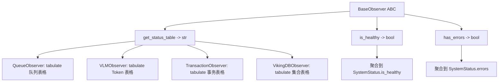
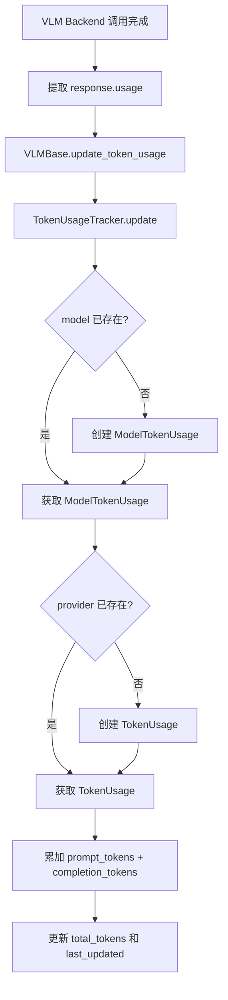
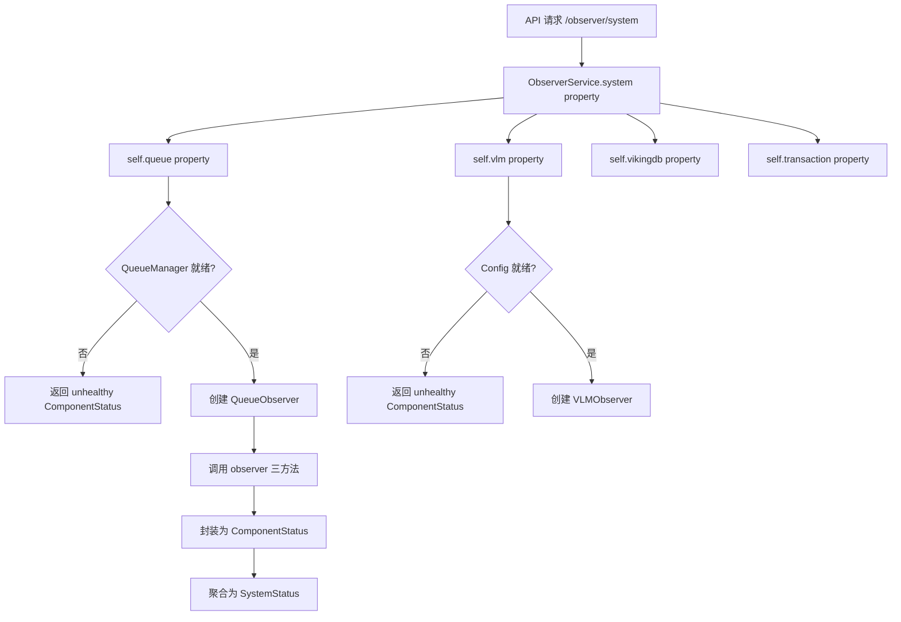

# PD-11.14 OpenViking — 四 Observer 聚合可观测与双维 Token 追踪

> 文档编号：PD-11.14
> 来源：OpenViking `openviking/storage/observers/`, `openviking/models/vlm/token_usage.py`
> GitHub：https://github.com/volcengine/OpenViking.git
> 问题域：PD-11 可观测性 Observability & Cost Tracking
> 状态：可复用方案

---

## 第 1 章 问题与动机（≥ 30 行）

### 1.1 核心问题

在一个包含 VLM 推理、向量数据库、队列处理、事务管理等多个子系统的 AI 平台中，运维人员需要：

1. **统一健康视图**：一个 API 调用即可获取所有子系统的健康状态，而非逐个检查
2. **Token 消耗追踪**：按模型×Provider 双维度精确统计 token 消耗，支持多供应商（OpenAI、火山引擎、LiteLLM）
3. **队列处理进度**：实时了解 Embedding/Semantic 等队列的 pending/in-progress/processed/errors 分布
4. **事务异常检测**：识别失败事务和长时间挂起的事务，防止资源泄漏
5. **DAG 执行统计**：语义处理 DAG 的节点级进度追踪（pending → in_progress → done）

OpenViking 的挑战在于子系统异构——队列是异步的、VLM 调用是同步/异步混合的、事务有 7 种状态、VikingDB 需要远程健康检查。需要一个统一的观测抽象来屏蔽差异。

### 1.2 OpenViking 的解法概述

1. **BaseObserver 抽象基类**：定义 `get_status_table()` / `is_healthy()` / `has_errors()` 三方法契约，所有子系统观测器必须实现（`openviking/storage/observers/base_observer.py:12-48`）
2. **四个具体 Observer**：QueueObserver、VLMObserver、TransactionObserver、VikingDBObserver，各自封装子系统的状态查询逻辑（`openviking/storage/observers/`）
3. **ObserverService 聚合层**：通过 4 个 `@property` 方法按需创建 Observer 并返回统一的 `ComponentStatus` 数据结构（`openviking/service/debug_service.py:56-176`）
4. **TokenUsageTracker 三层数据模型**：TokenUsage → ModelTokenUsage → TokenUsageTracker，按 model×provider 双维度累加统计（`openviking/models/vlm/token_usage.py:12-209`）
5. **REST API 暴露**：5 个 Observer 端点 + 1 个 Health 端点，通过 FastAPI Router 对外提供（`openviking/server/routers/observer.py:21-93`）

### 1.3 设计思想

| 设计原则 | 具体实现 | 理由 | 替代方案 |
|----------|----------|------|----------|
| 统一抽象 | BaseObserver ABC 定义三方法契约 | 异构子系统需要统一接口才能聚合 | 每个子系统独立暴露 API（碎片化） |
| 按需创建 | ObserverService 用 @property 懒创建 Observer | 避免启动时依赖未就绪的组件 | 启动时一次性创建所有 Observer（可能失败） |
| 双维追踪 | model×provider 两级 Dict 嵌套 | 同一模型可能走不同 Provider，需分别统计 | 只按模型统计（丢失 Provider 维度） |
| 表格化输出 | tabulate 库格式化为 ASCII 表格 | CLI 和日志中可读性好，无需前端 | JSON 输出（需额外解析） |
| 聚合健康 | SystemStatus.is_healthy = all(c.is_healthy) | 任一组件不健康则系统不健康 | 加权健康分数（过度复杂） |

---

## 第 2 章 源码实现分析（≥ 60 行，核心章节）

### 2.1 架构概览

```
┌─────────────────────────────────────────────────────────────────┐
│                    FastAPI Router Layer                          │
│  /observer/queue  /observer/vlm  /observer/vikingdb  /observer/ │
│                                                      system     │
└──────────────────────────┬──────────────────────────────────────┘
                           │
                    ┌──────▼──────┐
                    │DebugService │
                    │  .observer  │
                    └──────┬──────┘
                           │
                ┌──────────▼──────────┐
                │  ObserverService    │
                │  .queue (property)  │
                │  .vlm   (property)  │
                │  .vikingdb (prop)   │
                │  .transaction (prop)│
                │  .system (prop)     │
                └──────────┬──────────┘
                           │ creates on-demand
          ┌────────────────┼────────────────┐
          │                │                │
   ┌──────▼──────┐ ┌──────▼──────┐ ┌───────▼───────┐
   │QueueObserver│ │VLMObserver  │ │TransactionObs │ ...
   │  (queue_mgr)│ │ (vlm_inst)  │ │  (tx_mgr)     │
   └──────┬──────┘ └──────┬──────┘ └───────┬───────┘
          │                │                │
          │         ┌──────▼──────┐         │
          │         │TokenUsage   │         │
          │         │Tracker      │         │
          │         │ model→prov  │         │
          │         └─────────────┘         │
          │                                 │
   ┌──────▼──────┐                  ┌───────▼───────┐
   │QueueManager │                  │TransactionMgr │
   │ +DagStats   │                  │ 7-state FSM   │
   └─────────────┘                  └───────────────┘
```

所有 Observer 继承自 `BaseObserver`（`base_observer.py:12`），通过 `ObserverService`（`debug_service.py:56`）聚合为统一的 `ComponentStatus` → `SystemStatus` 数据结构。

### 2.2 核心实现

#### 2.2.1 BaseObserver 抽象契约



对应源码 `openviking/storage/observers/base_observer.py:12-48`：

```python
class BaseObserver(abc.ABC):
    @abc.abstractmethod
    def get_status_table(self) -> str:
        """Format status information as a string."""
        pass

    @abc.abstractmethod
    def is_healthy(self) -> bool:
        """Check if the observed system is healthy."""
        pass

    @abc.abstractmethod
    def has_errors(self) -> bool:
        """Check if the observed system has any errors."""
        pass
```

三方法契约的设计精妙之处：`is_healthy` 和 `has_errors` 是独立的——一个系统可以"不健康但无错误"（如未初始化），也可以"有错误但仍健康"（如非关键错误）。

#### 2.2.2 TokenUsageTracker 三层数据模型



对应源码 `openviking/models/vlm/token_usage.py:124-144`：

```python
class TokenUsageTracker:
    def __init__(self):
        self._usage_by_model: Dict[str, ModelTokenUsage] = {}

    def update(
        self, model_name: str, provider: str, prompt_tokens: int, completion_tokens: int
    ) -> None:
        if model_name not in self._usage_by_model:
            self._usage_by_model[model_name] = ModelTokenUsage(model_name)
        self._usage_by_model[model_name].update(provider, prompt_tokens, completion_tokens)
```

`ModelTokenUsage.update` 内部再按 provider 分桶（`token_usage.py:69-84`）：

```python
class ModelTokenUsage:
    def update(self, provider: str, prompt_tokens: int, completion_tokens: int) -> None:
        self.total_usage.update(prompt_tokens, completion_tokens)
        if provider not in self.usage_by_provider:
            self.usage_by_provider[provider] = TokenUsage()
        self.usage_by_provider[provider].update(prompt_tokens, completion_tokens)
```

这形成了 `Tracker → {model: ModelTokenUsage → {provider: TokenUsage}}` 的三层嵌套结构。

#### 2.2.3 ObserverService 聚合与懒创建



对应源码 `openviking/service/debug_service.py:82-99`（以 queue 为例）：

```python
@property
def queue(self) -> ComponentStatus:
    try:
        qm = get_queue_manager()
    except Exception:
        return ComponentStatus(
            name="queue", is_healthy=False, has_errors=True, status="Not initialized",
        )
    observer = QueueObserver(qm)
    return ComponentStatus(
        name="queue",
        is_healthy=observer.is_healthy(),
        has_errors=observer.has_errors(),
        status=observer.get_status_table(),
    )
```

每次调用都创建新的 Observer 实例——这是有意为之的设计：Observer 是无状态的查询代理，不缓存结果，确保每次返回最新状态。

### 2.3 实现细节

#### QueueObserver 融合 DAG 统计

QueueObserver 不仅展示队列状态，还通过反射获取 SemanticDagExecutor 的统计数据（`queue_observer.py:107-114`）：

```python
def _get_semantic_dag_stats(self) -> Optional[object]:
    semantic_queue = self._queue_manager._queues.get(self._queue_manager.SEMANTIC)
    if not semantic_queue:
        return None
    handler = getattr(semantic_queue, "_dequeue_handler", None)
    if handler and hasattr(handler, "get_dag_stats"):
        return handler.get_dag_stats()
    return None
```

这段代码通过 `getattr` 链式探测，从 QueueManager → NamedQueue → DequeueHandler → DagStats，实现了跨层级的统计数据穿透，而不需要在 QueueManager 上暴露 DAG 相关接口。

#### DagStats 四态计数

`SemanticDagExecutor` 维护了一个 `DagStats` 数据类（`semantic_dag.py:35-39`），在 DAG 执行过程中实时更新四个计数器：

```python
@dataclass
class DagStats:
    total_nodes: int = 0
    pending_nodes: int = 0
    in_progress_nodes: int = 0
    done_nodes: int = 0
```

状态转换发生在：
- `_dispatch_dir`：`total_nodes += 1`, `pending_nodes += 1`（`semantic_dag.py:96-97`）
- `_file_summary_task`：`pending → in_progress`（`semantic_dag.py:106-108`），完成后 `done_nodes += 1`（`semantic_dag.py:155`）
- `_overview_task`：完成后 `done_nodes += 1`, `in_progress_nodes -= 1`（`semantic_dag.py:273-274`）

#### TransactionObserver 的挂起检测

TransactionObserver 提供了 `get_hanging_transactions` 方法（`transaction_observer.py:175-194`），可检测超过阈值（默认 300 秒）的事务：

```python
def get_hanging_transactions(self, timeout_threshold: int = 300) -> Dict[str, Any]:
    transactions = self._transaction_manager.get_active_transactions()
    current_time = time.time()
    return {
        tx_id: tx for tx_id, tx in transactions.items()
        if current_time - tx.created_at > timeout_threshold
    }
```

#### 日志系统：配置驱动 + 文件轮转

`get_logger` 函数（`openviking_cli/utils/logger.py:76-95`）支持三种输出目标（stdout/stderr/file），文件模式下支持 `TimedRotatingFileHandler` 按时间轮转（`logger.py:61-67`）。通过 `logger.propagate = False` 防止日志向上传播导致重复输出。

---

## 第 3 章 迁移指南（≥ 40 行）

### 3.1 迁移清单

**阶段 1：Observer 抽象层（1 天）**
- [ ] 定义 `BaseObserver` ABC，包含 `get_status_table()` / `is_healthy()` / `has_errors()` 三方法
- [ ] 定义 `ComponentStatus` 和 `SystemStatus` 数据类
- [ ] 实现 `ObserverService` 聚合层，用 `@property` 懒创建各 Observer

**阶段 2：具体 Observer 实现（2 天）**
- [ ] 为每个需要观测的子系统实现具体 Observer
- [ ] 每个 Observer 的 `get_status_table()` 使用 `tabulate` 格式化输出
- [ ] 实现 `is_healthy()` 和 `has_errors()` 的具体判断逻辑

**阶段 3：Token 追踪（1 天）**
- [ ] 实现 `TokenUsage` → `ModelTokenUsage` → `TokenUsageTracker` 三层数据模型
- [ ] 在 LLM 调用基类中集成 `TokenUsageTracker`
- [ ] 在各 Provider 后端的响应处理中调用 `update_token_usage`

**阶段 4：API 暴露（0.5 天）**
- [ ] 创建 FastAPI Router，为每个 Observer 暴露 GET 端点
- [ ] 创建 `/health` 端点调用 `ObserverService.is_healthy()`

### 3.2 适配代码模板

```python
"""可直接复用的 Observer 框架模板"""
import abc
from dataclasses import dataclass
from typing import Dict, List, Optional

# --- 抽象层 ---
class BaseObserver(abc.ABC):
    @abc.abstractmethod
    def get_status_table(self) -> str: ...
    @abc.abstractmethod
    def is_healthy(self) -> bool: ...
    @abc.abstractmethod
    def has_errors(self) -> bool: ...

@dataclass
class ComponentStatus:
    name: str
    is_healthy: bool
    has_errors: bool
    status: str

@dataclass
class SystemStatus:
    is_healthy: bool
    components: Dict[str, ComponentStatus]
    errors: List[str]

# --- Token 追踪 ---
@dataclass
class TokenUsage:
    prompt_tokens: int = 0
    completion_tokens: int = 0
    total_tokens: int = 0

    def update(self, prompt: int, completion: int) -> None:
        self.prompt_tokens += prompt
        self.completion_tokens += completion
        self.total_tokens = self.prompt_tokens + self.completion_tokens

class TokenUsageTracker:
    def __init__(self):
        self._by_model: Dict[str, Dict[str, TokenUsage]] = {}

    def update(self, model: str, provider: str, prompt: int, completion: int) -> None:
        if model not in self._by_model:
            self._by_model[model] = {}
        if provider not in self._by_model[model]:
            self._by_model[model][provider] = TokenUsage()
        self._by_model[model][provider].update(prompt, completion)

    def get_total(self) -> TokenUsage:
        total = TokenUsage()
        for providers in self._by_model.values():
            for usage in providers.values():
                total.prompt_tokens += usage.prompt_tokens
                total.completion_tokens += usage.completion_tokens
                total.total_tokens += usage.total_tokens
        return total

# --- 聚合服务 ---
class ObserverService:
    def __init__(self):
        self._observers: Dict[str, BaseObserver] = {}

    def register(self, name: str, observer: BaseObserver) -> None:
        self._observers[name] = observer

    def get_component(self, name: str) -> ComponentStatus:
        obs = self._observers.get(name)
        if not obs:
            return ComponentStatus(name=name, is_healthy=False, has_errors=True, status="Not registered")
        return ComponentStatus(
            name=name, is_healthy=obs.is_healthy(),
            has_errors=obs.has_errors(), status=obs.get_status_table(),
        )

    def get_system(self) -> SystemStatus:
        components = {name: self.get_component(name) for name in self._observers}
        errors = [f"{c.name} has errors" for c in components.values() if c.has_errors]
        return SystemStatus(
            is_healthy=all(c.is_healthy for c in components.values()),
            components=components, errors=errors,
        )
```

### 3.3 适用场景

| 场景 | 适用度 | 说明 |
|------|--------|------|
| 多子系统 AI 平台 | ⭐⭐⭐ | 完美匹配：多个异构组件需要统一观测 |
| 单体 LLM 应用 | ⭐⭐ | Token 追踪部分可用，Observer 聚合层过重 |
| 微服务架构 | ⭐⭐ | 每个服务内部可用，跨服务需配合分布式追踪 |
| CLI 工具 | ⭐⭐⭐ | tabulate 表格输出非常适合终端展示 |
| 需要精确成本计费 | ⭐ | 只有 token 计数，无定价表和成本计算 |

---

## 第 4 章 测试用例（≥ 20 行）

```python
import pytest
from unittest.mock import MagicMock, AsyncMock, patch
from dataclasses import dataclass

# --- TokenUsageTracker 测试 ---
class TestTokenUsageTracker:
    def test_single_model_single_provider(self):
        """单模型单 Provider 累加"""
        from openviking.models.vlm.token_usage import TokenUsageTracker
        tracker = TokenUsageTracker()
        tracker.update("gpt-4o", "openai", prompt_tokens=100, completion_tokens=50)
        tracker.update("gpt-4o", "openai", prompt_tokens=200, completion_tokens=100)
        usage = tracker.get_model_usage("gpt-4o")
        assert usage.total_usage.prompt_tokens == 300
        assert usage.total_usage.completion_tokens == 150
        assert usage.total_usage.total_tokens == 450

    def test_same_model_different_providers(self):
        """同模型不同 Provider 分桶统计"""
        from openviking.models.vlm.token_usage import TokenUsageTracker
        tracker = TokenUsageTracker()
        tracker.update("gpt-4o", "openai", 100, 50)
        tracker.update("gpt-4o", "volcengine", 200, 100)
        usage = tracker.get_model_usage("gpt-4o")
        assert usage.get_provider_usage("openai").total_tokens == 150
        assert usage.get_provider_usage("volcengine").total_tokens == 300
        assert usage.total_usage.total_tokens == 450

    def test_total_across_models(self):
        """跨模型汇总"""
        from openviking.models.vlm.token_usage import TokenUsageTracker
        tracker = TokenUsageTracker()
        tracker.update("gpt-4o", "openai", 100, 50)
        tracker.update("claude-3", "openai", 200, 100)
        total = tracker.get_total_usage()
        assert total.total_tokens == 450

    def test_reset(self):
        """重置后清空"""
        from openviking.models.vlm.token_usage import TokenUsageTracker
        tracker = TokenUsageTracker()
        tracker.update("gpt-4o", "openai", 100, 50)
        tracker.reset()
        assert tracker.get_total_usage().total_tokens == 0
        assert tracker.get_model_usage("gpt-4o") is None

    def test_to_dict_structure(self):
        """序列化结构验证"""
        from openviking.models.vlm.token_usage import TokenUsageTracker
        tracker = TokenUsageTracker()
        tracker.update("gpt-4o", "openai", 100, 50)
        d = tracker.to_dict()
        assert "total_usage" in d
        assert "usage_by_model" in d
        assert "gpt-4o" in d["usage_by_model"]
        assert "usage_by_provider" in d["usage_by_model"]["gpt-4o"]

# --- ObserverService 测试 ---
class TestObserverService:
    def test_system_all_healthy(self):
        """所有组件健康时系统健康"""
        from openviking.service.debug_service import ObserverService, SystemStatus
        service = ObserverService()
        # 需要 mock 依赖
        status = service.system
        # 未初始化时应不健康
        assert not status.is_healthy

    def test_component_not_initialized(self):
        """未初始化组件返回 unhealthy"""
        from openviking.service.debug_service import ObserverService
        service = ObserverService()
        vlm_status = service.vlm
        assert not vlm_status.is_healthy
        assert vlm_status.has_errors
        assert vlm_status.status == "Not initialized"

# --- DagStats 测试 ---
class TestDagStats:
    def test_initial_state(self):
        """初始状态全零"""
        from openviking.storage.queuefs.semantic_dag import DagStats
        stats = DagStats()
        assert stats.total_nodes == 0
        assert stats.pending_nodes == 0
        assert stats.in_progress_nodes == 0
        assert stats.done_nodes == 0
```

---

## 第 5 章 跨域关联

| 关联域 | 关系类型 | 说明 |
|--------|----------|------|
| PD-01 上下文管理 | 协同 | TokenUsageTracker 的 token 计数可用于上下文窗口预算控制 |
| PD-02 多 Agent 编排 | 协同 | DagStats 追踪 DAG 节点执行进度，是编排层的可观测性延伸 |
| PD-03 容错与重试 | 依赖 | TransactionObserver 的 `get_hanging_transactions` 可触发超时重试 |
| PD-04 工具系统 | 协同 | Observer 本身可作为 MCP 工具暴露给 Agent 查询系统状态 |
| PD-06 记忆持久化 | 互补 | TokenUsageTracker 是内存累加器，无持久化；需配合 PD-06 方案落盘 |
| PD-08 搜索与检索 | 协同 | VikingDBObserver 监控向量数据库健康，是检索系统的运维保障 |

---

## 第 6 章 来源文件索引

| 文件 | 行范围 | 关键实现 |
|------|--------|----------|
| `openviking/storage/observers/base_observer.py` | L12-L48 | BaseObserver ABC 三方法契约 |
| `openviking/storage/observers/queue_observer.py` | L20-L121 | QueueObserver + DAG 统计穿透 |
| `openviking/storage/observers/vlm_observer.py` | L16-L117 | VLMObserver Token 表格展示 |
| `openviking/storage/observers/transaction_observer.py` | L21-L223 | TransactionObserver 7 态事务监控 |
| `openviking/storage/observers/vikingdb_observer.py` | L19-L133 | VikingDBObserver 集合健康检查 |
| `openviking/models/vlm/token_usage.py` | L12-L209 | TokenUsage 三层数据模型 |
| `openviking/models/vlm/base.py` | L14-L108 | VLMBase 集成 TokenUsageTracker |
| `openviking/service/debug_service.py` | L56-L205 | ObserverService + DebugService 聚合 |
| `openviking/server/routers/observer.py` | L21-L93 | 5 个 Observer REST 端点 |
| `openviking/server/routers/debug.py` | L16-L27 | /health 健康检查端点 |
| `openviking_cli/utils/logger.py` | L76-L122 | 配置驱动日志 + 文件轮转 |
| `openviking/storage/queuefs/semantic_dag.py` | L35-L290 | DagStats 四态计数 + DAG 执行器 |
| `openviking/storage/queuefs/named_queue.py` | L18-L44 | QueueStatus 数据结构 |

---

## 第 7 章 横向对比维度

```json comparison_data
{
  "project": "OpenViking",
  "dimensions": {
    "追踪方式": "BaseObserver ABC + 4 具体 Observer 聚合到 ObserverService",
    "数据粒度": "model×provider 双维 token 统计 + 队列四态 + 事务七态",
    "持久化": "纯内存累加，无持久化（依赖外部落盘）",
    "多提供商": "OpenAI/火山引擎/LiteLLM 三 Provider 分桶统计",
    "日志格式": "Python logging + TimedRotatingFileHandler 文件轮转",
    "指标采集": "按需查询（@property 懒创建），非定时采集",
    "可视化": "tabulate ASCII 表格，适合 CLI 和日志",
    "成本追踪": "仅 token 计数，无定价表和金额计算",
    "Agent 状态追踪": "DagStats 四态（pending/in_progress/done/total）节点级追踪",
    "健康端点": "/health + /observer/system 双端点，聚合四组件健康",
    "卡死检测": "TransactionObserver.get_hanging_transactions 300s 阈值检测",
    "DAG 统计穿透": "QueueObserver 通过 getattr 链式探测获取 DAG 执行器统计"
  }
}
```

### 域元数据补充

```json domain_metadata
{
  "solution_summary": "OpenViking 用 BaseObserver ABC 统一 4 个异构子系统（Queue/VLM/Transaction/VikingDB）的观测接口，通过 ObserverService @property 懒创建聚合为 SystemStatus，TokenUsageTracker 按 model×provider 双维累加统计",
  "description": "异构子系统的统一观测抽象与按需聚合健康检查",
  "sub_problems": [
    "Observer 无状态 vs 有状态：每次查询创建新实例保证数据新鲜但增加 GC 压力",
    "getattr 链式探测跨层统计：通过反射穿透多层封装获取内部统计数据的脆弱性",
    "事务七态优先级排序：EXEC > AQUIRE > RELEASING > INIT > COMMIT > FAIL > RELEASED 的展示排序逻辑"
  ],
  "best_practices": [
    "Observer 三方法契约分离：get_status_table/is_healthy/has_errors 各司其职，is_healthy 和 has_errors 语义独立",
    "聚合健康用 all() 短路：任一组件不健康即系统不健康，避免复杂加权",
    "tabulate 表格化输出：CLI 和日志场景下比 JSON 可读性高，且自带对齐"
  ]
}
```
