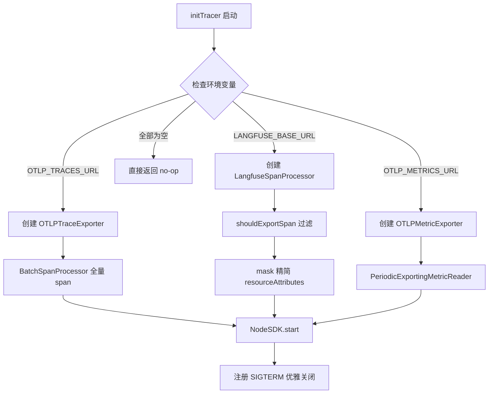
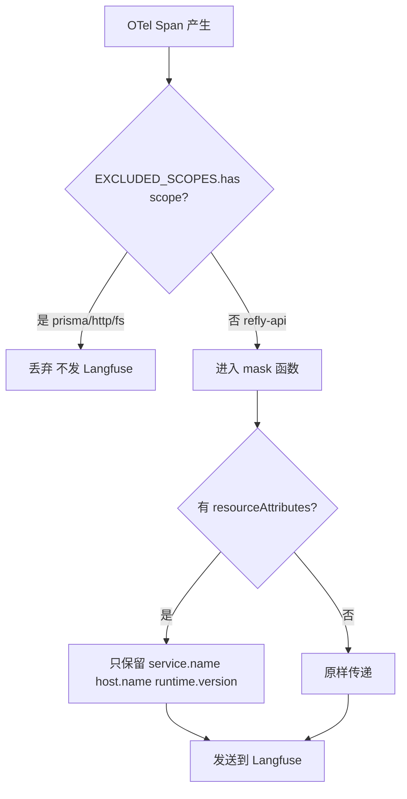
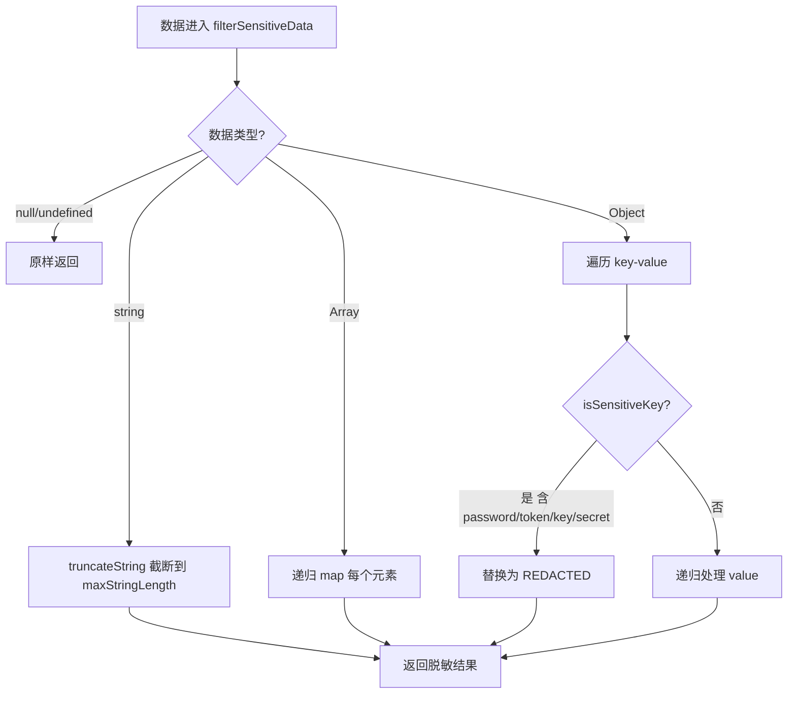

# PD-11.09 Refly — Langfuse + OpenTelemetry 双轨可观测与 SecurityFilter 脱敏体系

> 文档编号：PD-11.09
> 来源：Refly `packages/observability/src/`
> GitHub：https://github.com/refly-ai/refly.git
> 问题域：PD-11 可观测性 Observability & Cost Tracking
> 状态：可复用方案

---

## 第 1 章 问题与动机（≥ 30 行）

### 1.1 核心问题

LLM 应用的可观测性面临三重挑战：

1. **双追踪需求**：基础设施层（HTTP/DB/DNS）需要传统 APM 追踪（Tempo/Grafana），而 LLM 调用层需要专门的 AI 可观测平台（Langfuse）来记录 prompt/completion/token usage。两者的数据模型和消费者完全不同。
2. **元数据噪声**：LangChain/LangGraph SDK 自动注入大量内部状态字段（`langgraph_step`、`ls_provider` 等），这些字段在 Langfuse 中毫无分析价值，反而淹没真正有用的业务元数据。
3. **敏感数据泄露**：trace 数据中不可避免地包含 API key、token、password 等敏感信息，直接发送到外部 Langfuse 服务存在安全风险。

### 1.2 Refly 的解法概述

Refly 构建了独立的 `@refly/observability` 包（`packages/observability/package.json:1-22`），采用以下策略：

1. **双轨 SpanProcessor 架构**：在 `tracer.ts:48-107` 中，OTel NodeSDK 同时挂载 OTLP BatchSpanProcessor（全量 span → Tempo）和 LangfuseSpanProcessor（过滤后 LLM span → Langfuse），两条管道独立运行
2. **Scope 级 Span 过滤**：`tracer.ts:15-23` 定义 `EXCLUDED_SCOPES` Set，O(1) 查找排除 prisma/http/fs/dns/ioredis 等基础设施 span，只让 LLM 相关 span 进入 Langfuse
3. **FilteredLangfuseCallbackHandler 元数据清洗**：`filtered-langfuse-callback.ts:22-38` 定义 `FILTERED_METADATA_KEYS` 黑名单，在 LangChain callback 层面拦截并剥离 LangGraph 内部字段
4. **SecurityFilter 递归脱敏**：`langfuse-client.ts:22-91` 实现关键词匹配 + 字符串截断的双重防护，所有经过 TraceManager 的数据都先过 SecurityFilter
5. **@Trace/@Measure 声明式装饰器**：`trace-decorator.ts:10-67` 基于 OTel API 实现零侵入式方法级追踪，自动处理 sync/async 和 parent-child span 传播

### 1.3 设计思想

| 设计原则 | 具体实现 | 理由 | 替代方案 |
|----------|----------|------|----------|
| 双轨分离 | OTLP → Tempo 全量 + Langfuse → LLM 专用 | 基础设施和 AI 追踪的消费者不同 | 单一 Langfuse 全收（噪声大） |
| 过滤前置 | shouldExportSpan + FILTERED_METADATA_KEYS | 在发送前过滤比事后清洗成本低 | 后端 Langfuse 侧过滤（不可控） |
| 安全默认 | SecurityFilter 默认开启 enableDataMasking | 防止开发者忘记脱敏 | 手动逐字段脱敏（易遗漏） |
| 零开销关闭 | isMonitoringEnabled() 前置检查 + 环境变量驱动 | 未配置时不初始化任何 SDK | 始终初始化但不发送（浪费内存） |
| 声明式埋点 | @Trace 装饰器 + context.with 自动传播 | 业务代码无需感知追踪存在 | 手动 startSpan/endSpan（侵入性强） |

---

## 第 2 章 源码实现分析（≥ 60 行，核心章节）

### 2.1 架构概览

```
┌─────────────────────────────────────────────────────────────────┐
│                        Refly API (NestJS)                       │
│                                                                 │
│  ┌──────────────┐  ┌──────────────┐  ┌──────────────────────┐  │
│  │ DriveService │  │ SkillInvoker │  │  ScaleboxService     │  │
│  │  @Trace()    │  │  @Trace()    │  │  @Trace()            │  │
│  └──────┬───────┘  └──────┬───────┘  └──────────┬───────────┘  │
│         │                 │                      │              │
│         ▼                 ▼                      ▼              │
│  ┌─────────────────────────────────────────────────────────┐   │
│  │              @refly/observability 包                      │   │
│  │                                                          │   │
│  │  ┌──────────────┐  ┌──────────────┐  ┌───────────────┐  │   │
│  │  │ @Trace       │  │ TraceManager │  │ Filtered      │  │   │
│  │  │ @Measure     │  │ (Langfuse    │  │ Langfuse      │  │   │
│  │  │ (OTel API)   │  │  原生 API)   │  │ Callback      │  │   │
│  │  └──────┬───────┘  └──────┬───────┘  └───────┬───────┘  │   │
│  │         │                 │                   │          │   │
│  │         │          ┌──────▼───────┐           │          │   │
│  │         │          │ SecurityFilter│           │          │   │
│  │         │          │ (递归脱敏)    │           │          │   │
│  │         │          └──────┬───────┘           │          │   │
│  │         │                 │                   │          │   │
│  │         │          ┌──────▼───────┐           │          │   │
│  │         │          │ Langfuse     │           │          │   │
│  │         │          │ ClientManager│           │          │   │
│  │         │          │ (单例)       │           │          │   │
│  │         │          └──────────────┘           │          │   │
│  └─────────┼────────────────────────────────────┼──────────┘   │
│            │                                     │              │
│            ▼                                     ▼              │
│  ┌─────────────────────────────────────────────────────────┐   │
│  │              tracer.ts (OTel NodeSDK)                    │   │
│  │                                                          │   │
│  │  ┌─────────────────┐      ┌──────────────────────────┐  │   │
│  │  │ BatchSpanProc   │      │ LangfuseSpanProcessor    │  │   │
│  │  │ (OTLP Exporter) │      │ shouldExportSpan + mask   │  │   │
│  │  └────────┬────────┘      └────────────┬─────────────┘  │   │
│  └───────────┼────────────────────────────┼────────────────┘   │
└──────────────┼────────────────────────────┼────────────────────┘
               ▼                            ▼
        ┌──────────┐                 ┌──────────┐
        │  Tempo/  │                 │ Langfuse │
        │  Grafana │                 │  Cloud   │
        └──────────┘                 └──────────┘
```

### 2.2 核心实现

#### 2.2.1 双轨 SpanProcessor 初始化



对应源码 `apps/api/src/tracer.ts:48-107`：

```typescript
export function initTracer(): void {
  const otlp: OtlpConfig = {
    tracesUrl: process.env.OTLP_TRACES_URL,
    metricsUrl: process.env.OTLP_METRICS_URL,
    metricsIntervalMs: process.env.OTLP_METRICS_INTERVAL_MS
      ? Number.parseInt(process.env.OTLP_METRICS_INTERVAL_MS, 10)
      : 60000,
  };
  const langfuse: LangfuseConfig = {
    publicKey: process.env.LANGFUSE_PUBLIC_KEY,
    secretKey: process.env.LANGFUSE_SECRET_KEY,
    baseUrl: process.env.LANGFUSE_BASE_URL,
  };
  // 三个后端全部为空时直接返回，零开销
  if (!otlp.tracesUrl && !otlp.metricsUrl && !langfuse.baseUrl) {
    return;
  }
  const spanProcessors: SpanProcessor[] = [];
  // OTLP 全量 span → Tempo/Grafana
  if (otlp.tracesUrl) {
    const traceExporter = new OTLPTraceExporter({ url: otlp.tracesUrl });
    spanProcessors.push(new BatchSpanProcessor(traceExporter));
  }
  // Langfuse 过滤后 LLM span
  if (langfuse.baseUrl) {
    const processor = createLangfuseProcessor(langfuse);
    if (processor) spanProcessors.push(processor);
  }
  sdk = new NodeSDK({
    spanProcessors: spanProcessors.length > 0 ? spanProcessors : undefined,
    metricReader,
    instrumentations: [getNodeAutoInstrumentations()],
    resource: resourceFromAttributes({
      [ATTR_SERVICE_NAME]: 'reflyd',
    }),
  });
  sdk.start();
  process.on('SIGTERM', () => {
    sdk?.shutdown().finally(() => process.exit(0));
  });
}
```

#### 2.2.2 Scope 级过滤 + Metadata Mask



对应源码 `apps/api/src/tracer.ts:109-160`：

```typescript
function createLangfuseProcessor(config: LangfuseConfig): SpanProcessor | null {
  const { publicKey, secretKey, baseUrl } = config;
  if (!publicKey || !secretKey || !baseUrl) return null;
  try {
    return new LangfuseSpanProcessor({
      publicKey, secretKey, baseUrl,
      // O(1) Set 查找排除基础设施 scope
      shouldExportSpan: ({ otelSpan }) =>
        !EXCLUDED_SCOPES.has(otelSpan.instrumentationScope?.name ?? ''),
      // 精简 resourceAttributes，只保留 3 个关键字段
      mask: ({ data }) => {
        if (typeof data !== 'string') return data;
        try {
          const parsed = JSON.parse(data);
          if (parsed.resourceAttributes) {
            const KEPT_RESOURCE_ATTRS = new Set([
              'service.name', 'host.name', 'process.runtime.version',
            ]);
            return JSON.stringify({
              ...parsed,
              resourceAttributes: Object.fromEntries(
                Object.entries(parsed.resourceAttributes).filter(([k]) =>
                  KEPT_RESOURCE_ATTRS.has(k)),
              ),
            });
          }
          return data;
        } catch { return data; }
      },
    });
  } catch (_error) { return null; }
}
```

#### 2.2.3 SecurityFilter 递归脱敏



对应源码 `packages/observability/src/langfuse-client.ts:22-91`：

```typescript
export class SecurityFilter {
  private sensitiveKeys: Set<string>;
  private maxStringLength: number;
  private enableDataMasking: boolean;

  constructor(config: SecurityFilterConfig = {}) {
    this.sensitiveKeys = new Set([
      'password', 'token', 'key', 'secret', 'auth',
      'credential', 'api_key', 'apikey', 'authorization', 'bearer',
      ...(config.sensitiveKeys || []),
    ]);
    this.maxStringLength = config.maxStringLength || 10000;
    this.enableDataMasking = config.enableDataMasking ?? true;
  }

  filterSensitiveData(data: any): any {
    if (!this.enableDataMasking) return data;
    if (data === null || data === undefined) return data;
    if (typeof data === 'string') return this.truncateString(data);
    if (Array.isArray(data)) return data.map((item) => this.filterSensitiveData(item));
    if (typeof data === 'object') {
      const filtered: any = {};
      for (const [key, value] of Object.entries(data)) {
        if (this.isSensitiveKey(key)) {
          filtered[key] = '[REDACTED]';
        } else {
          filtered[key] = this.filterSensitiveData(value);
        }
      }
      return filtered;
    }
    return data;
  }

  private isSensitiveKey(key: string): boolean {
    const lowerKey = key.toLowerCase();
    return Array.from(this.sensitiveKeys).some((sk) => lowerKey.includes(sk));
  }
}
```

### 2.3 实现细节

#### @Trace 装饰器的 Context 传播

`trace-decorator.ts:10-67` 中的 `@Trace` 装饰器有两个关键设计：

1. **运行时 Promise 检测**（L55）：不区分 sync/async 方法签名，而是在运行时检查返回值是否为 Promise，统一处理两种情况
2. **context.with 自动传播**（L52）：通过 `trace.setSpan(context.active(), span)` 将新 span 设为当前 context，嵌套的 `@Trace` 调用自动形成 parent-child 关系

#### FilteredLangfuseCallbackHandler 的元数据清洗

`filtered-langfuse-callback.ts:318-456` 继承官方 `@langfuse/langchain` 的 `CallbackHandler`，在 6 个 handle 方法中拦截 metadata：

- `handleChainStart`：过滤 + 注入 runId/query/originalQuery
- `handleToolStart`：过滤 + 注入 30+ 业务字段（toolName/skillName/modelName/providerKey 等）
- `handleLLMStart/handleChatModelStart/handleGenerationStart/handleRetrieverStart`：纯过滤

#### TraceManager 的三层生命周期管理

`trace-manager.ts:48-369` 用三个 Map 管理活跃对象：

- `activeTraces: Map<string, LangfuseTraceClient>` — 顶层 trace
- `activeSpans: Map<string, LangfuseSpanClient>` — 中间 span（支持嵌套）
- `activeGenerations: Map<string, LangfuseGenerationClient>` — LLM 调用

每个 create 方法都先调用 `this.clientManager.filterData()` 进行脱敏，每个 end 方法都从 Map 中删除引用防止内存泄漏。

#### Token 双轨计数

`skill-invoker.service.ts:2250-2317` 实现了精确 + 回退的双轨 token 计数：
- 主路径：`chatModel.getNumTokens()` 使用 LangChain 模型专属 tokenizer
- 回退路径：`countToken()` 基础估算（当 tokenizer 不可用时）
- 分四维度统计：inputTokens / contextTokens / historyTokens / toolsTokens

---

## 第 3 章 迁移指南（≥ 40 行）

### 3.1 迁移清单

**阶段 1：基础设施（OTel + Langfuse 双轨）**

- [ ] 安装依赖：`@opentelemetry/sdk-node`、`@opentelemetry/auto-instrumentations-node`、`@langfuse/otel`、`langfuse`
- [ ] 创建 `tracer.ts`，配置 NodeSDK + 双 SpanProcessor
- [ ] 定义 `EXCLUDED_SCOPES` Set，排除基础设施 scope
- [ ] 在应用入口（`main.ts`）最早位置调用 `initTracer()`
- [ ] 配置环境变量：`OTLP_TRACES_URL`、`LANGFUSE_PUBLIC_KEY/SECRET_KEY/BASE_URL`

**阶段 2：安全层（SecurityFilter）**

- [ ] 实现 `SecurityFilter` 类，配置敏感关键词列表
- [ ] 实现 `LangfuseClientManager` 单例，所有 trace 数据经过 `filterData()`
- [ ] 配置 `maxStringLength` 防止超长字符串（默认 10000）

**阶段 3：声明式埋点（@Trace 装饰器）**

- [ ] 实现 `@Trace` 装饰器，基于 `@opentelemetry/api`
- [ ] 在关键业务方法上添加 `@Trace('operation.name')`
- [ ] 可选：实现 `@Measure` 装饰器记录方法耗时

**阶段 4：LangChain 集成（FilteredCallback）**

- [ ] 继承 `@langfuse/langchain` 的 `CallbackHandler`
- [ ] 定义 `FILTERED_METADATA_KEYS` 黑名单
- [ ] 在 skill/agent 调用时注入 FilteredLangfuseCallbackHandler

### 3.2 适配代码模板

#### 最小可用的双轨 tracer 初始化

```typescript
// tracer.ts — 可直接复用
import { NodeSDK } from '@opentelemetry/sdk-node';
import { BatchSpanProcessor } from '@opentelemetry/sdk-trace-base';
import { OTLPTraceExporter } from '@opentelemetry/exporter-trace-otlp-http';
import { LangfuseSpanProcessor } from '@langfuse/otel';
import { getNodeAutoInstrumentations } from '@opentelemetry/auto-instrumentations-node';
import { resourceFromAttributes } from '@opentelemetry/resources';

const EXCLUDED_SCOPES = new Set([
  'prisma', '@opentelemetry/instrumentation-fs',
  '@opentelemetry/instrumentation-http', '@opentelemetry/instrumentation-dns',
]);

export function initTracer(serviceName: string): void {
  const processors = [];

  if (process.env.OTLP_TRACES_URL) {
    processors.push(new BatchSpanProcessor(
      new OTLPTraceExporter({ url: process.env.OTLP_TRACES_URL })
    ));
  }

  if (process.env.LANGFUSE_PUBLIC_KEY && process.env.LANGFUSE_SECRET_KEY) {
    processors.push(new LangfuseSpanProcessor({
      publicKey: process.env.LANGFUSE_PUBLIC_KEY,
      secretKey: process.env.LANGFUSE_SECRET_KEY,
      baseUrl: process.env.LANGFUSE_BASE_URL,
      shouldExportSpan: ({ otelSpan }) =>
        !EXCLUDED_SCOPES.has(otelSpan.instrumentationScope?.name ?? ''),
    }));
  }

  if (processors.length === 0) return;

  const sdk = new NodeSDK({
    spanProcessors: processors,
    instrumentations: [getNodeAutoInstrumentations()],
    resource: resourceFromAttributes({ 'service.name': serviceName }),
  });
  sdk.start();
  process.on('SIGTERM', () => sdk.shutdown().finally(() => process.exit(0)));
}
```

#### SecurityFilter 可复用模板

```typescript
// security-filter.ts
export class SecurityFilter {
  private sensitiveKeys: Set<string>;
  private maxLen: number;

  constructor(extraKeys: string[] = [], maxLen = 10000) {
    this.sensitiveKeys = new Set([
      'password', 'token', 'key', 'secret', 'auth',
      'credential', 'api_key', 'authorization', 'bearer',
      ...extraKeys,
    ]);
    this.maxLen = maxLen;
  }

  filter(data: unknown): unknown {
    if (data == null) return data;
    if (typeof data === 'string') {
      return data.length > this.maxLen
        ? `${data.slice(0, this.maxLen)}... [TRUNCATED]` : data;
    }
    if (Array.isArray(data)) return data.map((d) => this.filter(d));
    if (typeof data === 'object') {
      const out: Record<string, unknown> = {};
      for (const [k, v] of Object.entries(data)) {
        out[k] = this.isSensitive(k) ? '[REDACTED]' : this.filter(v);
      }
      return out;
    }
    return data;
  }

  private isSensitive(key: string): boolean {
    const lower = key.toLowerCase();
    for (const sk of this.sensitiveKeys) {
      if (lower.includes(sk)) return true;
    }
    return false;
  }
}
```

### 3.3 适用场景

| 场景 | 适用度 | 说明 |
|------|--------|------|
| NestJS + LangChain 全栈 AI 应用 | ⭐⭐⭐ | 完美匹配，直接复用全部组件 |
| 纯 OTel 已有基础设施 | ⭐⭐⭐ | 只需加 LangfuseSpanProcessor 即可 |
| Python LangGraph 应用 | ⭐⭐ | 设计思想可迁移，但需用 Python OTel SDK |
| 无 LangChain 的纯 LLM 调用 | ⭐⭐ | TraceManager + SecurityFilter 可独立使用 |
| 前端/客户端追踪 | ⭐ | 本方案面向服务端，前端需另行设计 |

---

## 第 4 章 测试用例（≥ 20 行）

```typescript
import { SecurityFilter } from './security-filter';

describe('SecurityFilter', () => {
  const filter = new SecurityFilter([], 100);

  test('should redact sensitive keys', () => {
    const input = { username: 'alice', password: '123456', apiKey: 'sk-xxx' };
    const result = filter.filter(input) as Record<string, unknown>;
    expect(result.username).toBe('alice');
    expect(result.password).toBe('[REDACTED]');
    expect(result.apiKey).toBe('[REDACTED]');
  });

  test('should truncate long strings', () => {
    const longStr = 'a'.repeat(200);
    const result = filter.filter(longStr) as string;
    expect(result).toContain('[TRUNCATED]');
    expect(result.length).toBeLessThan(200);
  });

  test('should handle nested objects recursively', () => {
    const input = { config: { db: { password: 'secret' }, name: 'test' } };
    const result = filter.filter(input) as any;
    expect(result.config.db.password).toBe('[REDACTED]');
    expect(result.config.name).toBe('test');
  });

  test('should handle null and undefined', () => {
    expect(filter.filter(null)).toBeNull();
    expect(filter.filter(undefined)).toBeUndefined();
  });

  test('should handle arrays with mixed types', () => {
    const input = [{ token: 'abc' }, 'normal', 42];
    const result = filter.filter(input) as any[];
    expect(result[0].token).toBe('[REDACTED]');
    expect(result[1]).toBe('normal');
    expect(result[2]).toBe(42);
  });
});

describe('EXCLUDED_SCOPES filtering', () => {
  const EXCLUDED_SCOPES = new Set([
    'prisma', '@opentelemetry/instrumentation-http',
  ]);

  test('should exclude infrastructure scopes', () => {
    expect(EXCLUDED_SCOPES.has('prisma')).toBe(true);
    expect(EXCLUDED_SCOPES.has('refly-api')).toBe(false);
  });
});

describe('FILTERED_METADATA_KEYS', () => {
  const FILTERED_KEYS = new Set([
    'langgraph_step', 'langgraph_node', 'ls_provider', 'ls_model_name',
  ]);

  function filterMetadata(metadata: Record<string, unknown>) {
    const filtered: Record<string, unknown> = {};
    for (const [key, value] of Object.entries(metadata)) {
      if (!FILTERED_KEYS.has(key)) filtered[key] = value;
    }
    return filtered;
  }

  test('should remove LangGraph internal fields', () => {
    const meta = { langgraph_step: 3, query: 'test', ls_provider: 'openai' };
    const result = filterMetadata(meta);
    expect(result).toEqual({ query: 'test' });
  });
});
```

---

## 第 5 章 跨域关联

| 关联域 | 关系类型 | 说明 |
|--------|----------|------|
| PD-01 上下文管理 | 协同 | Token 双轨计数（`skill-invoker.service.ts:2250`）为上下文窗口管理提供精确的 token 消耗数据 |
| PD-03 容错与重试 | 协同 | SecurityFilter 的 `enableDataMasking` 开关 + TraceManager 的 try-catch 容错确保追踪失败不影响业务 |
| PD-04 工具系统 | 依赖 | FilteredLangfuseCallbackHandler 的 `handleToolStart` 记录工具调用的完整元数据（toolName/toolsetKey/skillName） |
| PD-05 沙箱隔离 | 协同 | ScaleboxService/ScaleboxPool 的 `@Trace` 装饰器追踪沙箱创建、重连、代码执行全生命周期 |
| PD-06 记忆持久化 | 协同 | LangfuseClientManager 的 `flushAsync()` 和 `shutdown()` 确保 trace 数据在进程退出前持久化 |
| PD-10 中间件管道 | 协同 | @Trace 装饰器本质是方法级中间件，通过 OTel context.with 实现 span 传播管道 |

---

## 第 6 章 来源文件索引

| 文件 | 行范围 | 关键实现 |
|------|--------|----------|
| `packages/observability/src/langfuse-client.ts` | L1-L195 | LangfuseClientManager 单例 + SecurityFilter 递归脱敏 |
| `packages/observability/src/trace-manager.ts` | L1-L370 | TraceManager 三层生命周期管理（trace/span/generation） |
| `packages/observability/src/trace-decorator.ts` | L1-L116 | @Trace/@Measure 装饰器 + OTel context 传播 |
| `packages/observability/src/filtered-langfuse-callback.ts` | L1-L457 | FilteredLangfuseCallbackHandler 元数据清洗 + 业务字段注入 |
| `packages/observability/src/langchain-callback.ts` | L1-L290 | LangfuseCallbackHandler 自定义实现 + token usage 提取 |
| `packages/observability/src/langfuse-listener.ts` | L1-L193 | LangfuseListener OTel 桥接 + URL/SQL 脱敏 |
| `packages/observability/src/langfuse.service.ts` | L1-L40 | NestJS Injectable 服务封装 |
| `packages/observability/src/types.ts` | L1-L9 | OpenTelemetryListener 接口定义 |
| `packages/observability/src/index.ts` | L1-L61 | 统一导出 + initializeObservability/shutdownObservability 便捷函数 |
| `apps/api/src/tracer.ts` | L1-L161 | OTel NodeSDK 初始化 + 双轨 SpanProcessor + SIGTERM 优雅关闭 |
| `apps/api/src/modules/skill/skill-invoker.service.ts` | L262, L2226-L2317 | @Trace 使用示例 + FilteredLangfuseCallbackHandler 创建 + Token 双轨计数 |
| `apps/api/src/modules/drive/drive.service.ts` | L578-L852 | @Trace + getCurrentSpan 手动属性注入 |
| `apps/api/src/modules/tool/sandbox/scalebox.service.ts` | L204 | @Trace 沙箱执行追踪 |
| `apps/api/src/modules/tool/sandbox/scalebox.pool.ts` | L51 | @Trace 连接池获取追踪 |
| `apps/api/src/modules/tool/sandbox/wrapper/interpreter.ts` | L69-L141 | @Trace 沙箱创建/重连/执行三阶段追踪 |

---

## 第 7 章 横向对比维度

```json comparison_data
{
  "project": "Refly",
  "dimensions": {
    "追踪方式": "OTel NodeSDK 双轨：BatchSpanProcessor→Tempo + LangfuseSpanProcessor→Langfuse",
    "数据粒度": "trace/span/generation 三层，generation 含 model/usage/prompt 完整数据",
    "持久化": "Langfuse Cloud + OTLP→Tempo，进程内 Map 管理活跃对象",
    "多提供商": "OTLP + Langfuse 双后端独立启用，环境变量驱动",
    "日志格式": "console.log/warn/error 结构化前缀 [Langfuse]/[TraceManager]",
    "指标采集": "OTLPMetricExporter→Prometheus，60s 周期导出",
    "成本追踪": "LangChain tokenizer 精确计数 + countToken 回退，四维度分拆",
    "安全审计": "SecurityFilter 10 关键词递归脱敏 + 10000 字符截断 + URL/SQL 脱敏",
    "Span 传播": "OTel context.with 自动 parent-child + parentSpanId 手动嵌套",
    "日志噪声过滤": "EXCLUDED_SCOPES Set O(1) 排除 6 类基础设施 scope",
    "零开销路径": "三环境变量全空时 initTracer 直接返回，isMonitoringEnabled 前置检查",
    "Decorator 插桩": "@Trace/@Measure 装饰器，运行时 Promise 检测兼容 sync/async",
    "优雅关闭": "SIGTERM→sdk.shutdown()→process.exit(0)",
    "日志级别": "span 四级 DEBUG/DEFAULT/WARNING/ERROR",
    "元数据清洗": "FILTERED_METADATA_KEYS 黑名单剥离 LangGraph/LangChain 内部字段",
    "业务元数据注入": "buildToolMetadata 注入 30+ 业务字段（skill/toolset/model/query）"
  }
}
```

### 域元数据补充

```json domain_metadata
{
  "solution_summary": "Refly 用 OTel NodeSDK 双轨 SpanProcessor（OTLP→Tempo + Langfuse 过滤 LLM span）+ SecurityFilter 递归脱敏 + @Trace 装饰器声明式埋点实现全栈可观测",
  "description": "LangChain/LangGraph 元数据噪声清洗与 OTel-Langfuse 双轨 span 路由",
  "sub_problems": [
    "LangGraph 内部元数据污染：langgraph_step/node/triggers 等字段淹没业务元数据需黑名单过滤",
    "OTel resourceAttributes 膨胀：auto-instrumentation 注入大量属性需白名单精简",
    "Scope 级 span 路由：同一 OTel SDK 产生的 span 需按 instrumentationScope 分流到不同后端",
    "业务元数据标准化：tool/skill/model/query 等 30+ 字段需从多种命名风格中统一提取"
  ],
  "best_practices": [
    "用 LangfuseSpanProcessor.shouldExportSpan 在 SDK 层过滤，比 Langfuse 后端过滤更高效",
    "SecurityFilter 默认开启 enableDataMasking，opt-out 比 opt-in 更安全",
    "EXCLUDED_SCOPES 用 Set 而非 Array，O(1) 查找避免高频 span 的性能损耗",
    "FilteredLangfuseCallbackHandler 继承官方 Handler 只 override 需要过滤的方法，最小化维护成本"
  ]
}
```
