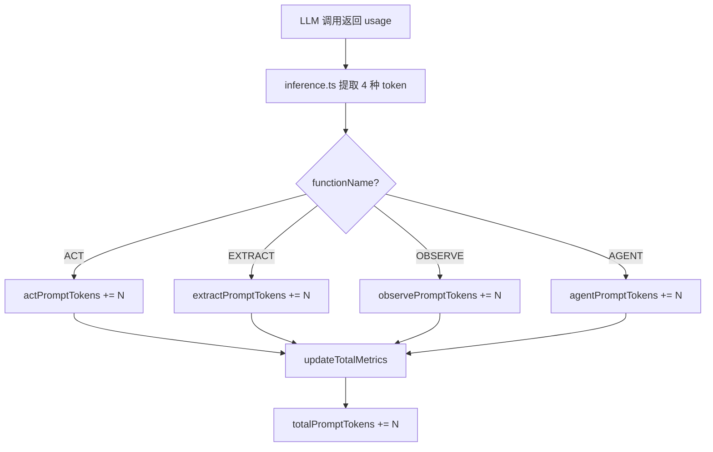
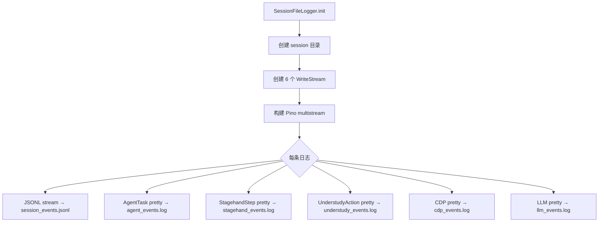

# PD-11.XX Stagehand — 四维 Token 追踪与 Pino 多流结构化日志

> 文档编号：PD-11.XX
> 来源：Stagehand `packages/core/lib/v3/v3.ts` `packages/core/lib/v3/flowLogger.ts` `packages/core/lib/logger.ts`
> GitHub：https://github.com/browserbase/stagehand.git
> 问题域：PD-11 可观测性 Observability & Cost Tracking
> 状态：可复用方案

---

## 第 1 章 问题与动机（≥ 30 行）

### 1.1 核心问题

浏览器自动化 Agent 的可观测性面临独特挑战：一次 Agent 任务涉及多层操作——LLM 推理、CDP（Chrome DevTools Protocol）命令、DOM 交互、页面导航——每层都产生不同类型的遥测数据。传统的单一日志流无法区分这些层级，导致调试时需要在海量日志中人工筛选。

同时，Token 消耗需要按功能维度（act/extract/observe/agent）精细归因，而非仅统计全局总量。不同功能的 Token 消耗模式差异巨大：extract 操作通常 prompt 重（大量 DOM 内容），act 操作 completion 重（需要推理出操作步骤），agent 模式则两者兼有。只有按维度拆分，才能针对性优化。

### 1.2 Stagehand 的解法概述

1. **四维 Token 追踪**：`StagehandMetrics` 按 act/extract/observe/agent 四个功能维度独立追踪 prompt/completion/reasoning/cached 四种 token 类型，共 20 个计数器 + 5 个推理耗时字段（`packages/core/lib/v3/types/public/metrics.ts:1-27`）
2. **Pino 多流分发**：`SessionFileLogger` 基于 Pino multistream 将同一事件同时写入 JSONL 原始流和 5 个按类别分离的 pretty 日志文件（`packages/core/lib/v3/flowLogger.ts:640-668`）
3. **AsyncLocalStorage Span 上下文**：通过 `AsyncLocalStorage` 维护 task→step→action 三层 span 嵌套，Pino mixin 自动注入上下文到每条日志（`packages/core/lib/v3/flowLogger.ts:117, 655-665`）
4. **Decorator 非侵入式插桩**：`@logAction` 和 `@logStagehandStep` 装饰器自动包装方法，零修改业务代码即可获得 span 级日志（`packages/core/lib/v3/flowLogger.ts:1136-1191`）
5. **CDP 噪声过滤**：硬编码 `NOISY_CDP_EVENTS` 集合过滤 10 种高频 CDP 事件，避免日志洪泛（`packages/core/lib/v3/flowLogger.ts:19-31`）

### 1.3 设计思想

| 设计原则 | 具体实现 | 理由 | 替代方案 |
|----------|----------|------|----------|
| 按功能维度归因 | 4 功能 × 5 指标 = 20 计数器 | 不同功能的 token 消耗模式不同，全局统计无法指导优化 | 全局单一计数器（丢失归因信息） |
| 多流分离 | Pino multistream → JSONL + 5 pretty 文件 | 机器分析用 JSONL，人工调试用分类 pretty 日志 | 单一日志文件 + grep 过滤 |
| 零开销默认关闭 | `CONFIG_DIR` 为空时装饰器返回原方法 | SDK 用户默认不需要文件日志，不应有性能损耗 | 始终初始化日志系统 |
| Span 自动传播 | AsyncLocalStorage mixin 注入 | 避免手动传递 context 参数穿透多层调用 | 显式参数传递（侵入性强） |
| 共享 Pino 实例 | `StagehandLogger.sharedPinoLogger` 静态单例 | 避免每个 V3 实例创建新 worker thread 导致内存膨胀 | 每实例独立 Pino（内存泄漏） |

---

## 第 2 章 源码实现分析（≥ 60 行，核心章节）

### 2.1 架构概览

Stagehand 的可观测性分为两个独立子系统：**StagehandMetrics**（Token 计量）和 **SessionFileLogger**（结构化日志），两者通过 V3 主类协调但互不依赖。

```
┌─────────────────────────────────────────────────────────────────┐
│                         V3 (主类)                                │
│  ┌──────────────────────┐    ┌────────────────────────────────┐ │
│  │  StagehandMetrics     │    │  SessionFileLogger             │ │
│  │  (Token 计量)         │    │  (结构化日志)                   │ │
│  │                      │    │                                │ │
│  │  act  ─┐             │    │  AsyncLocalStorage             │ │
│  │  extract─┤ 4维×5指标  │    │    ├─ taskId                   │ │
│  │  observe─┤            │    │    ├─ stepId                   │ │
│  │  agent ─┘             │    │    └─ actionId                 │ │
│  │         ↓             │    │         ↓                      │ │
│  │  updateMetrics()      │    │  Pino multistream              │ │
│  │  updateTotalMetrics() │    │    ├─ session_events.jsonl     │ │
│  └──────────────────────┘    │    ├─ agent_events.log         │ │
│                              │    ├─ stagehand_events.log     │ │
│                              │    ├─ understudy_events.log    │ │
│                              │    ├─ cdp_events.log           │ │
│                              │    └─ llm_events.log           │ │
│                              └────────────────────────────────┘ │
│                                                                 │
│  ┌──────────────────────┐    ┌────────────────────────────────┐ │
│  │  StagehandLogger      │    │  v3Logger (AsyncLocalStorage)  │ │
│  │  (Pino 包装)          │    │  (实例级路由)                   │ │
│  │  sharedPinoLogger     │    │  bindInstanceLogger()          │ │
│  │  + externalLogger     │    │  withInstanceLogContext()       │ │
│  └──────────────────────┘    └────────────────────────────────┘ │
└─────────────────────────────────────────────────────────────────┘
```

### 2.2 核心实现

#### 2.2.1 四维 Token 追踪



对应源码 `packages/core/lib/v3/v3.ts:508-570`：

```typescript
public updateMetrics(
  functionName: V3FunctionName,
  promptTokens: number,
  completionTokens: number,
  reasoningTokens: number,
  cachedInputTokens: number,
  inferenceTimeMs: number,
): void {
  switch (functionName) {
    case V3FunctionName.ACT:
      this.stagehandMetrics.actPromptTokens += promptTokens;
      this.stagehandMetrics.actCompletionTokens += completionTokens;
      this.stagehandMetrics.actReasoningTokens += reasoningTokens;
      this.stagehandMetrics.actCachedInputTokens += cachedInputTokens;
      this.stagehandMetrics.actInferenceTimeMs += inferenceTimeMs;
      break;
    // ... EXTRACT, OBSERVE, AGENT 同理
  }
  this.updateTotalMetrics(
    promptTokens, completionTokens, reasoningTokens,
    cachedInputTokens, inferenceTimeMs,
  );
}
```

Token 从 LLM 响应中精确提取（`packages/core/lib/inference.ts:335-339`）：

```typescript
const { data: observeData, usage: observeUsage } = rawResponse;
const promptTokens = observeUsage?.prompt_tokens ?? 0;
const completionTokens = observeUsage?.completion_tokens ?? 0;
const reasoningTokens = observeUsage?.reasoning_tokens ?? 0;
const cachedInputTokens = observeUsage?.cached_input_tokens ?? 0;
```

#### 2.2.2 Pino 多流结构化日志



对应源码 `packages/core/lib/v3/flowLogger.ts:640-668`：

```typescript
// Create pino multistream: JSONL + pretty streams per category
const streams: pino.StreamEntry[] = [
  { stream: createJsonlStream(ctx) },
  { stream: createPrettyStream(ctx, "AgentTask", "agent") },
  { stream: createPrettyStream(ctx, "StagehandStep", "stagehand") },
  { stream: createPrettyStream(ctx, "UnderstudyAction", "understudy") },
  { stream: createPrettyStream(ctx, "CDP", "cdp") },
  { stream: createPrettyStream(ctx, "LLM", "llm") },
];

// Mixin adds eventId and current span context to every log
ctx.logger = pino(
  {
    level: "info",
    mixin() {
      const store = loggerContext.getStore();
      return {
        eventId: uuidv7(),
        sessionId: store?.sessionId,
        taskId: store?.taskId,
        stepId: store?.stepId,
        stepLabel: store?.stepLabel,
        actionId: store?.actionId,
        actionLabel: store?.actionLabel,
      };
    },
  },
  pino.multistream(streams),
);
```

### 2.3 实现细节

**FlowEvent 类型系统**（`packages/core/lib/v3/flowLogger.ts:37-80`）：

事件分为 5 个类别（AgentTask / StagehandStep / UnderstudyAction / CDP / LLM），每个类别有不同的事件类型（started / completed / call / message / request / response）。完成事件携带聚合指标：

```typescript
interface FlowEvent {
  category: EventCategory;
  event: "started" | "completed" | "call" | "message" | "request" | "response";
  metrics?: {
    durationMs?: number;
    llmRequests?: number;
    inputTokens?: number;
    outputTokens?: number;
    cdpEvents?: number;
  };
}
```

**CDP 噪声过滤**（`packages/core/lib/v3/flowLogger.ts:19-31`）：

```typescript
const NOISY_CDP_EVENTS = new Set([
  "Target.targetInfoChanged",
  "Runtime.executionContextCreated",
  "Runtime.executionContextDestroyed",
  "Network.dataReceived",
  "Network.loadingFinished",
  // ... 共 10 种高频事件
]);
```

**敏感信息脱敏**（`packages/core/lib/v3/flowLogger.ts:181-195`）：

```typescript
const SENSITIVE_KEYS =
  /apikey|api_key|key|secret|token|password|passwd|pwd|credential|auth/i;

function sanitizeOptions(options: V3Options): Record<string, unknown> {
  const sanitize = (obj: unknown): unknown => {
    // 递归遍历，匹配 key 则替换为 "******"
    result[key] = SENSITIVE_KEYS.test(key) ? "******" : sanitize(value);
  };
  return sanitize({ ...options }) as Record<string, unknown>;
}
```

**共享 Pino 实例优化**（`packages/core/lib/logger.ts:93-132`）：

StagehandLogger 使用静态 `sharedPinoLogger` 避免每个 V3 实例创建新的 Pino worker thread。当使用 `pino-pretty` transport 时，每个实例都会 spawn 一个 worker thread，在高并发场景（如 request-per-instance API）下导致内存持续增长。共享实例解决了这个问题。

**LLM 中间件日志**（`packages/core/lib/v3/flowLogger.ts:1009-1129`）：

`createLlmLoggingMiddleware` 返回 AI SDK 的 `LanguageModelMiddleware`，在 `wrapGenerate` 中自动记录 LLM 请求/响应，包括 prompt 预览、token 用量和输出摘要。当 `CONFIG_DIR` 为空时返回 no-op 中间件，零开销。

---

## 第 3 章 迁移指南（≥ 40 行）

### 3.1 迁移清单

**阶段 1：Token 计量（1-2 天）**
- [ ] 定义功能维度枚举（对应你的 Agent 操作类型）
- [ ] 创建 `Metrics` 接口，每个维度 × 每种 token 类型一个计数器
- [ ] 在 LLM 调用返回处提取 `usage` 字段，调用 `updateMetrics()`
- [ ] 暴露 `metrics` getter 供外部消费

**阶段 2：结构化日志（2-3 天）**
- [ ] 安装 Pino：`npm install pino`
- [ ] 定义事件类别枚举和 `FlowEvent` 接口
- [ ] 实现 `SessionFileLogger`，使用 Pino multistream 分流
- [ ] 用 `AsyncLocalStorage` 维护 span 上下文
- [ ] 实现 `@logAction` / `@logStep` 装饰器

**阶段 3：噪声过滤与安全（1 天）**
- [ ] 定义高频事件黑名单（类似 `NOISY_CDP_EVENTS`）
- [ ] 实现敏感字段脱敏（正则匹配 key 名）
- [ ] 添加 `CONFIG_DIR` 开关，默认关闭文件日志

### 3.2 适配代码模板

#### Token 计量模板（TypeScript）

```typescript
// metrics.ts — 可直接复用的 Token 计量系统
export enum FunctionName {
  SEARCH = "SEARCH",
  GENERATE = "GENERATE",
  SUMMARIZE = "SUMMARIZE",
}

export interface AgentMetrics {
  [key: string]: number;
}

export function createMetrics(functions: string[]): AgentMetrics {
  const metrics: AgentMetrics = {};
  const tokenTypes = ["PromptTokens", "CompletionTokens", "ReasoningTokens", "CachedInputTokens", "InferenceTimeMs"];
  for (const fn of functions) {
    for (const type of tokenTypes) {
      metrics[`${fn.toLowerCase()}${type}`] = 0;
    }
  }
  for (const type of tokenTypes) {
    metrics[`total${type}`] = 0;
  }
  return metrics;
}

export function updateMetrics(
  metrics: AgentMetrics,
  functionName: string,
  usage: { prompt_tokens: number; completion_tokens: number; reasoning_tokens?: number; cached_input_tokens?: number },
  inferenceTimeMs: number,
): void {
  const prefix = functionName.toLowerCase();
  metrics[`${prefix}PromptTokens`] += usage.prompt_tokens;
  metrics[`${prefix}CompletionTokens`] += usage.completion_tokens;
  metrics[`${prefix}ReasoningTokens`] += usage.reasoning_tokens ?? 0;
  metrics[`${prefix}CachedInputTokens`] += usage.cached_input_tokens ?? 0;
  metrics[`${prefix}InferenceTimeMs`] += inferenceTimeMs;
  // 同步更新 total
  metrics.totalPromptTokens += usage.prompt_tokens;
  metrics.totalCompletionTokens += usage.completion_tokens;
  metrics.totalReasoningTokens += usage.reasoning_tokens ?? 0;
  metrics.totalCachedInputTokens += usage.cached_input_tokens ?? 0;
  metrics.totalInferenceTimeMs += inferenceTimeMs;
}
```

#### Pino 多流日志模板

```typescript
// flow-logger.ts — 基于 Pino multistream 的分类日志
import pino from "pino";
import { AsyncLocalStorage } from "node:async_hooks";
import fs from "node:fs";
import { Writable } from "node:stream";

interface SpanContext {
  sessionId: string;
  taskId: string | null;
  stepId: string | null;
}

const spanStore = new AsyncLocalStorage<SpanContext>();

export function createFlowLogger(sessionDir: string, sessionId: string) {
  fs.mkdirSync(sessionDir, { recursive: true });

  const jsonlStream = fs.createWriteStream(`${sessionDir}/events.jsonl`, { flags: "a" });
  const categories = ["agent", "llm", "tool"] as const;
  const prettyStreams = Object.fromEntries(
    categories.map(cat => [cat, fs.createWriteStream(`${sessionDir}/${cat}.log`, { flags: "a" })])
  );

  const streams: pino.StreamEntry[] = [
    { stream: new Writable({
      objectMode: true,
      write(chunk, _, cb) { jsonlStream.write(chunk, cb); },
    })},
    ...categories.map(cat => ({
      stream: new Writable({
        objectMode: true,
        write(chunk: string, _, cb) {
          try {
            const event = JSON.parse(chunk);
            if (event.category === cat) prettyStreams[cat].write(`${event.msg}\n`, cb);
            else cb();
          } catch { cb(); }
        },
      }),
    })),
  ];

  return pino(
    {
      level: "info",
      mixin() {
        const ctx = spanStore.getStore();
        return { sessionId: ctx?.sessionId, taskId: ctx?.taskId, stepId: ctx?.stepId };
      },
    },
    pino.multistream(streams),
  );
}
```

### 3.3 适用场景

| 场景 | 适用度 | 说明 |
|------|--------|------|
| 浏览器自动化 Agent | ⭐⭐⭐ | 完美匹配：多层操作（LLM + CDP + DOM）需要分类日志 |
| 多功能 LLM SDK | ⭐⭐⭐ | 按功能维度追踪 token 是核心需求 |
| 单一 LLM 调用服务 | ⭐⭐ | 四维追踪过度设计，全局计数器即可 |
| 高并发 API 服务 | ⭐⭐⭐ | 共享 Pino 实例 + AsyncLocalStorage 路由解决并发隔离 |
| 嵌入式/边缘部署 | ⭐ | 文件日志不适合无持久存储环境 |

---

## 第 4 章 测试用例（≥ 20 行）

```typescript
import { describe, it, expect, beforeEach } from "vitest";

// 测试 Token 计量
describe("StagehandMetrics", () => {
  let metrics: Record<string, number>;

  beforeEach(() => {
    metrics = {
      actPromptTokens: 0, actCompletionTokens: 0, actReasoningTokens: 0,
      actCachedInputTokens: 0, actInferenceTimeMs: 0,
      totalPromptTokens: 0, totalCompletionTokens: 0, totalReasoningTokens: 0,
      totalCachedInputTokens: 0, totalInferenceTimeMs: 0,
    };
  });

  it("should accumulate tokens by function dimension", () => {
    // 模拟 ACT 操作的 token 消耗
    metrics.actPromptTokens += 100;
    metrics.actCompletionTokens += 50;
    metrics.actReasoningTokens += 20;
    metrics.actCachedInputTokens += 30;
    metrics.totalPromptTokens += 100;
    metrics.totalCompletionTokens += 50;

    expect(metrics.actPromptTokens).toBe(100);
    expect(metrics.totalPromptTokens).toBe(100);
  });

  it("should track reasoning tokens separately from completion", () => {
    metrics.actReasoningTokens += 200;
    metrics.actCompletionTokens += 50;
    expect(metrics.actReasoningTokens).not.toBe(metrics.actCompletionTokens);
  });

  it("should accumulate across multiple calls", () => {
    metrics.actPromptTokens += 100;
    metrics.actPromptTokens += 200;
    metrics.totalPromptTokens += 300;
    expect(metrics.actPromptTokens).toBe(300);
    expect(metrics.totalPromptTokens).toBe(300);
  });
});

// 测试 CDP 噪声过滤
describe("CDP Noise Filtering", () => {
  const NOISY_EVENTS = new Set([
    "Target.targetInfoChanged",
    "Runtime.executionContextCreated",
    "Network.dataReceived",
  ]);

  it("should filter noisy CDP events", () => {
    expect(NOISY_EVENTS.has("Target.targetInfoChanged")).toBe(true);
    expect(NOISY_EVENTS.has("Page.navigate")).toBe(false);
  });

  it("should filter .enable methods", () => {
    const method = "Network.enable";
    expect(method.endsWith(".enable")).toBe(true);
  });
});

// 测试敏感信息脱敏
describe("Sensitive Key Sanitization", () => {
  const SENSITIVE_KEYS = /apikey|api_key|key|secret|token|password|credential|auth/i;

  it("should detect sensitive keys", () => {
    expect(SENSITIVE_KEYS.test("apiKey")).toBe(true);
    expect(SENSITIVE_KEYS.test("OPENAI_API_KEY")).toBe(true);
    expect(SENSITIVE_KEYS.test("modelName")).toBe(false);
  });

  it("should sanitize nested objects", () => {
    const sanitize = (obj: Record<string, unknown>): Record<string, unknown> => {
      const result: Record<string, unknown> = {};
      for (const [k, v] of Object.entries(obj)) {
        result[k] = SENSITIVE_KEYS.test(k) ? "******" : v;
      }
      return result;
    };
    const sanitized = sanitize({ apiKey: "sk-123", model: "gpt-4" });
    expect(sanitized.apiKey).toBe("******");
    expect(sanitized.model).toBe("gpt-4");
  });
});

// 测试零开销关闭
describe("Zero-overhead Disable", () => {
  it("should return original method when CONFIG_DIR is empty", () => {
    const original = async () => "result";
    const CONFIG_DIR = "";
    // 模拟 logAction 装饰器的零开销路径
    const wrapped = CONFIG_DIR ? /* wrapped version */ original : original;
    expect(wrapped).toBe(original);
  });
});
```

---

## 第 5 章 跨域关联

| 关联域 | 关系类型 | 说明 |
|--------|----------|------|
| PD-01 上下文管理 | 协同 | Token 计量数据可用于判断上下文窗口使用率，触发压缩策略 |
| PD-03 容错与重试 | 协同 | LLM 请求/响应日志为重试决策提供依据，`logLlmRequest`/`logLlmResponse` 记录每次调用 |
| PD-04 工具系统 | 依赖 | CDP 事件日志依赖工具调用的 span 上下文（actionId），工具执行通过 `@logAction` 装饰器自动插桩 |
| PD-06 记忆持久化 | 协同 | `session_events.jsonl` 可作为会话记忆的持久化载体，支持回放和审计 |
| PD-09 Human-in-the-Loop | 协同 | Agent 任务的 `started`/`completed` 事件可用于向用户展示进度和 token 消耗 |

---

## 第 6 章 来源文件索引

| 文件 | 行范围 | 关键实现 |
|------|--------|----------|
| `packages/core/lib/v3/types/public/metrics.ts` | L1-L27 | StagehandMetrics 接口定义，4 维度 × 5 指标 |
| `packages/core/lib/v3/v3.ts` | L241-L267 | stagehandMetrics 初始化，20 个计数器归零 |
| `packages/core/lib/v3/v3.ts` | L508-L570 | updateMetrics() 按功能维度累加 + updateTotalMetrics() |
| `packages/core/lib/v3/v3.ts` | L387-L401 | metrics getter，支持 API 模式远程获取 |
| `packages/core/lib/v3/flowLogger.ts` | L37-L80 | FlowEvent 类型定义，5 类别 × 6 事件类型 |
| `packages/core/lib/v3/flowLogger.ts` | L117 | AsyncLocalStorage 实例，span 上下文存储 |
| `packages/core/lib/v3/flowLogger.ts` | L534-L578 | SessionFileLogger.init()，创建 session 目录和文件流 |
| `packages/core/lib/v3/flowLogger.ts` | L640-L668 | Pino multistream 构建，JSONL + 5 pretty 流 |
| `packages/core/lib/v3/flowLogger.ts` | L709-L741 | logAgentTaskStarted()，重置指标并记录任务开始 |
| `packages/core/lib/v3/flowLogger.ts` | L746-L778 | logAgentTaskCompleted()，聚合 durationMs/llmRequests/tokens/cdpEvents |
| `packages/core/lib/v3/flowLogger.ts` | L936-L963 | logLlmRequest()，累加 llmRequests 计数 |
| `packages/core/lib/v3/flowLogger.ts` | L965-L999 | logLlmResponse()，累加 inputTokens/outputTokens |
| `packages/core/lib/v3/flowLogger.ts` | L1009-L1129 | createLlmLoggingMiddleware()，AI SDK 中间件自动记录 LLM 调用 |
| `packages/core/lib/v3/flowLogger.ts` | L1136-L1158 | @logAction 装饰器，自动包装 understudy 操作 |
| `packages/core/lib/v3/flowLogger.ts` | L1165-L1191 | @logStagehandStep 装饰器，自动包装 act/extract/observe |
| `packages/core/lib/v3/flowLogger.ts` | L19-L31 | NOISY_CDP_EVENTS 集合，10 种高频事件过滤 |
| `packages/core/lib/v3/flowLogger.ts` | L181-L195 | sanitizeOptions()，正则匹配敏感 key 脱敏 |
| `packages/core/lib/v3/flowLogger.ts` | L296-L301 | shouldFilterCdpEvent()，CDP 噪声过滤逻辑 |
| `packages/core/lib/logger.ts` | L93-L132 | StagehandLogger 类，共享 Pino 实例 + 外部 logger 双通道 |
| `packages/core/lib/v3/logger.ts` | L32-L48 | AsyncLocalStorage 实例级路由，bindInstanceLogger/withInstanceLogContext |
| `packages/core/lib/v3/llm/LLMClient.ts` | L100-L107 | LLMUsage 接口，5 种 token 类型定义 |
| `packages/core/lib/inference.ts` | L335-L384 | observe 操作的 token 提取和文件持久化 |

---

## 第 7 章 横向对比维度

> **重要：** 本章用于自动填充 Butcher Wiki 的横向对比表。
> 必须严格按以下 JSON 格式输出，放在 `comparison_data` 代码块中。

```json comparison_data
{
  "project": "Stagehand",
  "dimensions": {
    "追踪方式": "Pino multistream + AsyncLocalStorage span 上下文自动注入",
    "数据粒度": "4 功能维度 × 5 指标（prompt/completion/reasoning/cached/time）",
    "持久化": "6 文件分流：1 JSONL + 5 分类 pretty log",
    "多提供商": "LLMClient 抽象层统一 usage 接口，支持 OpenAI/Anthropic/Google/Groq/Cerebras",
    "日志格式": "Pino JSON + 自定义 prettifyEvent 人类可读格式",
    "指标采集": "FlowLoggerMetrics 累加器，task 完成时聚合 durationMs/llmRequests/tokens/cdpEvents",
    "日志噪声过滤": "NOISY_CDP_EVENTS 硬编码 Set 过滤 10 种高频 CDP 事件",
    "成本追踪": "无内置成本计算，仅提供 token 计数供外部计费",
    "Span 传播": "AsyncLocalStorage mixin 自动注入 taskId/stepId/actionId 三层嵌套",
    "日志级别": "三级 verbose（0=error/1=info/2=debug）映射到 Pino 标准级别",
    "零开销路径": "CONFIG_DIR 为空时装饰器返回原方法，中间件返回 no-op",
    "Decorator 插桩": "@logAction + @logStagehandStep 两个装饰器自动包装方法",
    "安全审计": "SENSITIVE_KEYS 正则匹配 apikey/secret/token/password 等字段自动脱敏",
    "元数据清洗": "sanitizeOptions 递归遍历配置对象，敏感值替换为 ******",
    "业务元数据注入": "Pino mixin 自动注入 eventId(UUIDv7)/sessionId/taskId/stepId/actionId",
    "缓存统计": "task 完成事件支持 cacheHit 标记，跳过 LLM 调用时记录 CACHE HIT"
  }
}
```

### 域元数据补充

```json domain_metadata
{
  "solution_summary": "Stagehand 通过 StagehandMetrics 按 act/extract/observe/agent 四维度追踪 prompt/completion/reasoning/cached 四种 token，SessionFileLogger 基于 Pino multistream 将事件分流到 JSONL + 5 个分类 pretty 日志文件",
  "description": "浏览器自动化场景下 LLM + CDP + DOM 多层操作的分类日志与按功能维度的 token 归因",
  "sub_problems": [
    "多实例 Pino worker thread 内存膨胀：pino-pretty transport 每实例 spawn worker，需共享单例",
    "AsyncLocalStorage 上下文丢失：setTimeout/EventEmitter/fire-and-forget promise 中 span 上下文断裂",
    "LLM 中间件日志与业务日志统一：AI SDK LanguageModelMiddleware 需要桥接到自有日志系统",
    "session 目录 symlink 跨平台兼容：latest 符号链接在 Windows 上可能失败需静默降级"
  ],
  "best_practices": [
    "按功能维度拆分 token 计数器：不同操作的 token 消耗模式不同，全局统计无法指导优化",
    "Pino multistream 一写多读：同一事件同时写入 JSONL（机器分析）和 pretty log（人工调试）",
    "装饰器零开销关闭：CONFIG_DIR 为空时直接返回原方法引用，无任何运行时包装",
    "共享 Pino 实例避免 worker thread 泄漏：静态 sharedPinoLogger 防止高并发场景内存膨胀",
    "Pino mixin 自动注入 span 上下文：避免手动传递 context 参数穿透多层调用栈"
  ]
}
```
