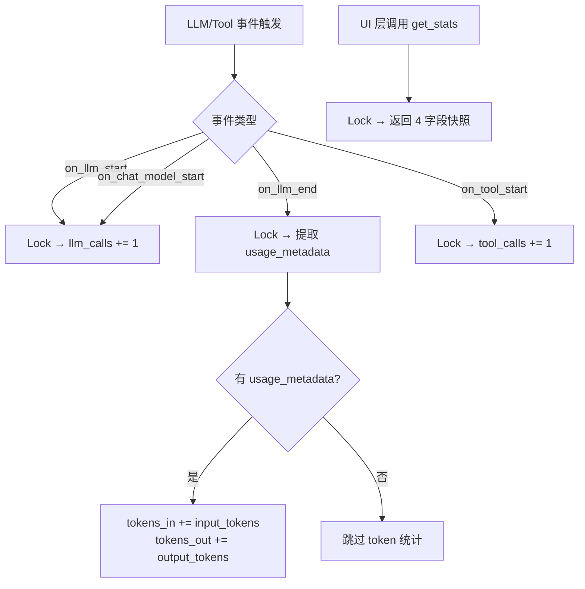
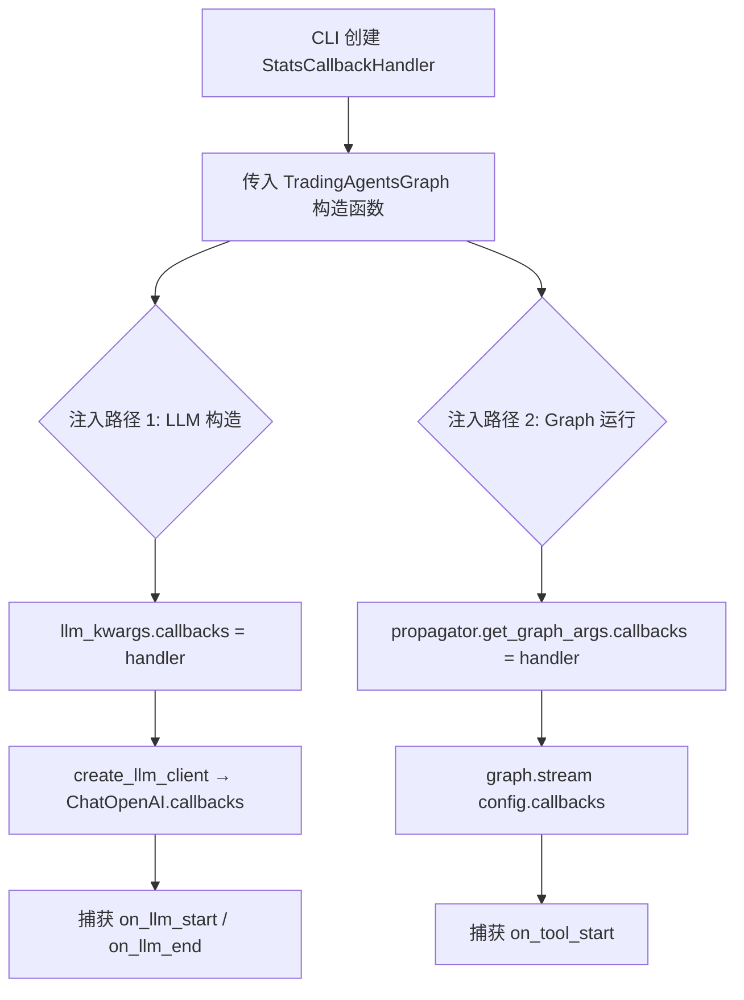
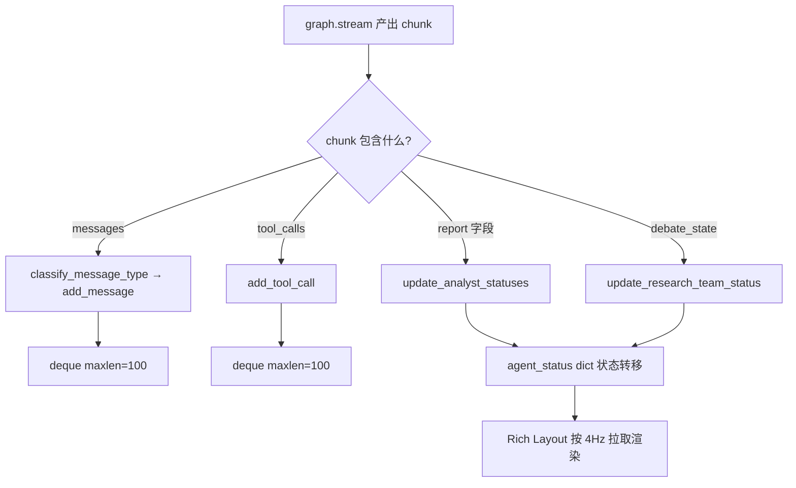

# PD-11.07 TradingAgents — StatsCallback 线程安全统计与 Rich Live 实时仪表盘

> 文档编号：PD-11.07
> 来源：TradingAgents `cli/stats_handler.py` `cli/main.py`
> GitHub：https://github.com/TauricResearch/TradingAgents.git
> 问题域：PD-11 可观测性 Observability & Cost Tracking
> 状态：可复用方案

---

## 第 1 章 问题与动机

### 1.1 核心问题

多 Agent 金融交易系统中，一次分析流程涉及 10+ 个 Agent（Analyst × 4、Bull/Bear Researcher、Research Manager、Trader、Aggressive/Conservative/Neutral Analyst、Portfolio Manager），每个 Agent 独立调用 LLM 和工具。运营者需要实时了解：

1. **LLM 调用次数**：当前已发起多少次 LLM 请求，用于估算成本
2. **工具调用次数**：数据获取工具（股票数据、新闻、基本面）被调用了多少次
3. **Token 用量**：输入/输出 token 的累积消耗，直接关联 API 费用
4. **Agent 进度**：哪些 Agent 已完成、哪些正在运行、哪些还在等待
5. **消息流**：Agent 之间的消息传递和工具调用的实时日志
6. **报告进度**：7 个报告段落中已完成几个

这些信息需要在 CLI 终端中实时展示，而非等到全部完成后才能看到。

### 1.2 TradingAgents 的解法概述

TradingAgents 采用 **LangChain Callback + Rich Live Layout** 双层架构：

1. **StatsCallbackHandler**（`cli/stats_handler.py:9`）：继承 `BaseCallbackHandler`，用 `threading.Lock` 保证线程安全，在 `on_llm_start`/`on_llm_end`/`on_tool_start` 三个钩子中累加计数器
2. **双路注入回调**（`tradingagents/graph/trading_graph.py:78-79`）：callbacks 同时注入 LLM 构造函数（追踪 LLM 调用）和 graph.stream config（追踪工具调用）
3. **MessageBuffer**（`cli/main.py:43`）：维护 Agent 状态机、消息队列、报告段落的内存数据结构
4. **Rich Live Layout**（`cli/main.py:232-245`）：4 区域布局（Header + Progress + Messages + Analysis + Footer），4Hz 刷新率实时渲染
5. **Footer 统计栏**（`cli/main.py:432-459`）：聚合 StatsCallbackHandler 的数据，展示 `Agents: 5/12 | LLM: 23 | Tools: 8 | Tokens: 12.3k↑ 5.6k↓ | Reports: 3/7 | ⏱ 02:34`

### 1.3 设计思想

| 设计原则 | 具体实现 | 理由 | 替代方案 |
|----------|----------|------|----------|
| 关注点分离 | StatsCallbackHandler 只管计数，MessageBuffer 只管 UI 状态 | 统计逻辑与展示逻辑解耦，可独立测试 | 单一 God Object 管理所有状态 |
| 线程安全 | `threading.Lock` 保护所有计数器读写 | LangGraph 的 Agent 节点可能并发执行 | 无锁累加（存在竞态） |
| 双路回调注入 | LLM 构造函数 + graph config 各注入一次 | LLM 回调只在 LLM 层触发，工具回调只在 graph 层触发 | 只注入一处（漏掉另一类事件） |
| 被动拉取统计 | `get_stats()` 返回快照，UI 层按需调用 | 避免高频推送，UI 按自己的刷新率拉取 | 事件推送模式（增加复杂度） |
| 优雅降级 | token 为 0 时显示 `--` 而非 `0↑ 0↓` | 部分 LLM 提供商不返回 usage_metadata | 始终显示数字（误导用户） |

---

## 第 2 章 源码实现分析

### 2.1 架构概览

```
┌─────────────────────────────────────────────────────────────────┐
│                        CLI Layer (cli/)                         │
│  ┌──────────────┐  ┌──────────────┐  ┌───────────────────────┐ │
│  │ MessageBuffer │  │ Rich Layout  │  │   Footer Stats Bar    │ │
│  │ (agent_status │  │ (4-zone      │  │ Agents|LLM|Tools|     │ │
│  │  messages     │  │  Live panel) │  │ Tokens|Reports|Time   │ │
│  │  reports)     │  │              │  │                       │ │
│  └──────┬───────┘  └──────┬───────┘  └───────────┬───────────┘ │
│         │                 │                       │             │
│         │          refresh @4Hz              get_stats()        │
│         │                 │                       │             │
├─────────┼─────────────────┼───────────────────────┼─────────────┤
│         │          Core Layer (tradingagents/)     │             │
│  ┌──────┴───────┐  ┌──────┴───────┐  ┌───────────┴───────────┐ │
│  │ graph.stream │  │ LLM Clients  │  │ StatsCallbackHandler  │ │
│  │ (chunks →    │  │ (ChatOpenAI  │  │ (threading.Lock       │ │
│  │  state       │  │  callbacks)  │  │  llm_calls/tool_calls │ │
│  │  updates)    │  │              │  │  tokens_in/out)       │ │
│  └──────────────┘  └──────────────┘  └───────────────────────┘ │
└─────────────────────────────────────────────────────────────────┘
```

### 2.2 核心实现

#### 2.2.1 StatsCallbackHandler — 线程安全的统计收集器



对应源码 `cli/stats_handler.py:9-76`：

```python
class StatsCallbackHandler(BaseCallbackHandler):
    """Callback handler that tracks LLM calls, tool calls, and token usage."""

    def __init__(self) -> None:
        super().__init__()
        self._lock = threading.Lock()
        self.llm_calls = 0
        self.tool_calls = 0
        self.tokens_in = 0
        self.tokens_out = 0

    def on_llm_start(self, serialized, prompts, **kwargs) -> None:
        with self._lock:
            self.llm_calls += 1

    def on_chat_model_start(self, serialized, messages, **kwargs) -> None:
        with self._lock:
            self.llm_calls += 1

    def on_llm_end(self, response: LLMResult, **kwargs) -> None:
        try:
            generation = response.generations[0][0]
        except (IndexError, TypeError):
            return
        usage_metadata = None
        if hasattr(generation, "message"):
            message = generation.message
            if isinstance(message, AIMessage) and hasattr(message, "usage_metadata"):
                usage_metadata = message.usage_metadata
        if usage_metadata:
            with self._lock:
                self.tokens_in += usage_metadata.get("input_tokens", 0)
                self.tokens_out += usage_metadata.get("output_tokens", 0)

    def on_tool_start(self, serialized, input_str, **kwargs) -> None:
        with self._lock:
            self.tool_calls += 1

    def get_stats(self) -> Dict[str, Any]:
        with self._lock:
            return {
                "llm_calls": self.llm_calls,
                "tool_calls": self.tool_calls,
                "tokens_in": self.tokens_in,
                "tokens_out": self.tokens_out,
            }
```

#### 2.2.2 双路回调注入 — LLM 层 + Graph 层



对应源码 `tradingagents/graph/trading_graph.py:74-92`：

```python
# 路径 1: 注入 LLM 构造函数（追踪 LLM 调用和 token）
llm_kwargs = self._get_provider_kwargs()
if self.callbacks:
    llm_kwargs["callbacks"] = self.callbacks  # L78-79

deep_client = create_llm_client(
    provider=self.config["llm_provider"],
    model=self.config["deep_think_llm"],
    base_url=self.config.get("backend_url"),
    **llm_kwargs,  # callbacks 随 kwargs 传入
)
```

对应源码 `cli/main.py:1016-1018`：

```python
# 路径 2: 注入 graph.stream config（追踪工具调用）
args = graph.propagator.get_graph_args(callbacks=[stats_handler])
```

#### 2.2.3 MessageBuffer — Agent 状态机与消息队列



对应源码 `cli/main.py:73-117`（MessageBuffer 初始化）：

```python
class MessageBuffer:
    FIXED_AGENTS = {
        "Research Team": ["Bull Researcher", "Bear Researcher", "Research Manager"],
        "Trading Team": ["Trader"],
        "Risk Management": ["Aggressive Analyst", "Neutral Analyst", "Conservative Analyst"],
        "Portfolio Management": ["Portfolio Manager"],
    }

    def __init__(self, max_length=100):
        self.messages = deque(maxlen=max_length)
        self.tool_calls = deque(maxlen=max_length)
        self.agent_status = {}
        self.report_sections = {}
```

### 2.3 实现细节

**Token 格式化**（`cli/main.py:248-252`）：

```python
def format_tokens(n):
    if n >= 1000:
        return f"{n/1000:.1f}k"
    return str(n)
```

**Decorator 模式持久化日志**（`cli/main.py:944-981`）：CLI 用装饰器包装 MessageBuffer 的 `add_message`、`add_tool_call`、`update_report_section` 方法，每次调用后自动追加写入 `message_tool.log` 文件和报告 Markdown 文件。这是一种非侵入式的日志持久化策略。

**报告完成度判定**（`cli/main.py:119-138`）：不是简单检查报告内容是否非空，而是同时要求"报告有内容 AND 负责该报告的 Agent 状态为 completed"。这避免了辩论中间轮次的临时内容被误判为已完成。

**消息去重**（`cli/main.py:1026-1029`）：通过 `_last_message_id` 跟踪最后处理的消息 ID，避免 graph.stream 重复推送同一消息时重复显示。

---

## 第 3 章 迁移指南

### 3.1 迁移清单

**阶段 1：统计收集器（1 个文件）**
- [ ] 创建 `StatsCallbackHandler`，继承 LangChain `BaseCallbackHandler`
- [ ] 实现 `on_llm_start`、`on_chat_model_start`、`on_llm_end`、`on_tool_start` 四个钩子
- [ ] 用 `threading.Lock` 保护所有计数器
- [ ] 实现 `get_stats()` 返回快照字典

**阶段 2：双路注入（2 处修改）**
- [ ] 在 LLM 客户端构造时传入 `callbacks=[handler]`
- [ ] 在 graph/chain 运行时传入 `config={"callbacks": [handler]}`
- [ ] 验证 LLM 调用和工具调用都能被捕获

**阶段 3：实时展示（可选）**
- [ ] 用 Rich Live + Layout 构建终端仪表盘
- [ ] 按固定频率（建议 4Hz）拉取 `get_stats()` 刷新显示
- [ ] 实现 token 格式化（k/M 单位）

### 3.2 适配代码模板

#### 最小可用版本：StatsCallbackHandler

```python
import threading
from typing import Any, Dict, List
from langchain_core.callbacks import BaseCallbackHandler
from langchain_core.outputs import LLMResult
from langchain_core.messages import AIMessage


class StatsCallbackHandler(BaseCallbackHandler):
    """线程安全的 LLM/工具调用统计收集器。"""

    def __init__(self) -> None:
        super().__init__()
        self._lock = threading.Lock()
        self.llm_calls = 0
        self.tool_calls = 0
        self.tokens_in = 0
        self.tokens_out = 0

    def on_llm_start(self, serialized: Dict, prompts: List[str], **kwargs) -> None:
        with self._lock:
            self.llm_calls += 1

    def on_chat_model_start(self, serialized: Dict, messages: List, **kwargs) -> None:
        with self._lock:
            self.llm_calls += 1

    def on_llm_end(self, response: LLMResult, **kwargs) -> None:
        try:
            gen = response.generations[0][0]
        except (IndexError, TypeError):
            return
        msg = getattr(gen, "message", None)
        if isinstance(msg, AIMessage):
            usage = getattr(msg, "usage_metadata", None)
            if usage:
                with self._lock:
                    self.tokens_in += usage.get("input_tokens", 0)
                    self.tokens_out += usage.get("output_tokens", 0)

    def on_tool_start(self, serialized: Dict, input_str: str, **kwargs) -> None:
        with self._lock:
            self.tool_calls += 1

    def get_stats(self) -> Dict[str, Any]:
        with self._lock:
            return {
                "llm_calls": self.llm_calls,
                "tool_calls": self.tool_calls,
                "tokens_in": self.tokens_in,
                "tokens_out": self.tokens_out,
            }


# 使用方式
handler = StatsCallbackHandler()

# 路径 1: 注入 LLM
from langchain_openai import ChatOpenAI
llm = ChatOpenAI(model="gpt-4o", callbacks=[handler])

# 路径 2: 注入 graph 运行
result = graph.stream(state, config={"callbacks": [handler]})

# 随时读取统计
stats = handler.get_stats()
print(f"LLM: {stats['llm_calls']} | Tools: {stats['tool_calls']} | "
      f"Tokens: {stats['tokens_in']}↑ {stats['tokens_out']}↓")
```

#### Rich Live 仪表盘模板

```python
from rich.live import Live
from rich.layout import Layout
from rich.panel import Panel
from rich.table import Table
import time


def create_stats_footer(handler, start_time):
    """构建统计栏。"""
    stats = handler.get_stats()
    elapsed = time.time() - start_time

    def fmt(n):
        return f"{n/1000:.1f}k" if n >= 1000 else str(n)

    parts = [
        f"LLM: {stats['llm_calls']}",
        f"Tools: {stats['tool_calls']}",
        f"Tokens: {fmt(stats['tokens_in'])}↑ {fmt(stats['tokens_out'])}↓"
        if stats['tokens_in'] > 0 else "Tokens: --",
        f"⏱ {int(elapsed//60):02d}:{int(elapsed%60):02d}",
    ]

    table = Table(show_header=False, box=None, expand=True)
    table.add_column("Stats", justify="center")
    table.add_row(" | ".join(parts))
    return Panel(table, border_style="grey50")


# 使用方式
layout = Layout()
layout.split_column(
    Layout(name="main", ratio=9),
    Layout(name="footer", size=3),
)

start = time.time()
with Live(layout, refresh_per_second=4):
    for chunk in graph.stream(state, config={"callbacks": [handler]}):
        # 处理 chunk...
        layout["footer"].update(create_stats_footer(handler, start))
```

### 3.3 适用场景

| 场景 | 适用度 | 说明 |
|------|--------|------|
| LangChain/LangGraph 多 Agent 系统 | ⭐⭐⭐ | 直接复用，无需修改 |
| 单 Agent + 工具调用 | ⭐⭐⭐ | 简化版，去掉 MessageBuffer |
| 非 LangChain 框架（AutoGen、CrewAI） | ⭐⭐ | 需适配各框架的回调接口 |
| 后端服务（非 CLI） | ⭐⭐ | 替换 Rich 为 Prometheus/Grafana 推送 |
| 高并发生产环境 | ⭐ | Lock 可能成为瓶颈，需改用 atomic 或无锁计数 |

---

## 第 4 章 测试用例

```python
import threading
import pytest
from unittest.mock import MagicMock, PropertyMock
from langchain_core.outputs import LLMResult, Generation
from langchain_core.messages import AIMessage


class TestStatsCallbackHandler:
    """测试 StatsCallbackHandler 的线程安全统计功能。"""

    def setup_method(self):
        from stats_handler import StatsCallbackHandler
        self.handler = StatsCallbackHandler()

    def test_llm_call_counting(self):
        """on_llm_start 和 on_chat_model_start 都应递增 llm_calls。"""
        self.handler.on_llm_start({}, ["prompt1"])
        self.handler.on_chat_model_start({}, [[]])
        assert self.handler.get_stats()["llm_calls"] == 2

    def test_tool_call_counting(self):
        """on_tool_start 应递增 tool_calls。"""
        self.handler.on_tool_start({}, "input")
        self.handler.on_tool_start({}, "input2")
        assert self.handler.get_stats()["tool_calls"] == 2

    def test_token_extraction_from_usage_metadata(self):
        """on_llm_end 应从 AIMessage.usage_metadata 提取 token 数。"""
        msg = AIMessage(content="test")
        msg.usage_metadata = {"input_tokens": 100, "output_tokens": 50}
        gen = MagicMock()
        gen.message = msg
        result = LLMResult(generations=[[gen]])

        self.handler.on_llm_end(result)
        stats = self.handler.get_stats()
        assert stats["tokens_in"] == 100
        assert stats["tokens_out"] == 50

    def test_token_graceful_fallback_no_metadata(self):
        """无 usage_metadata 时 token 计数应保持为 0。"""
        msg = AIMessage(content="test")
        # 不设置 usage_metadata
        gen = MagicMock()
        gen.message = msg
        result = LLMResult(generations=[[gen]])

        self.handler.on_llm_end(result)
        stats = self.handler.get_stats()
        assert stats["tokens_in"] == 0
        assert stats["tokens_out"] == 0

    def test_token_graceful_fallback_empty_generations(self):
        """空 generations 列表不应抛异常。"""
        result = LLMResult(generations=[[]])
        self.handler.on_llm_end(result)  # 不应抛异常
        assert self.handler.get_stats()["tokens_in"] == 0

    def test_thread_safety(self):
        """多线程并发调用不应丢失计数。"""
        def increment_llm(n):
            for _ in range(n):
                self.handler.on_llm_start({}, ["p"])

        def increment_tool(n):
            for _ in range(n):
                self.handler.on_tool_start({}, "i")

        threads = []
        for _ in range(10):
            threads.append(threading.Thread(target=increment_llm, args=(100,)))
            threads.append(threading.Thread(target=increment_tool, args=(100,)))

        for t in threads:
            t.start()
        for t in threads:
            t.join()

        stats = self.handler.get_stats()
        assert stats["llm_calls"] == 1000
        assert stats["tool_calls"] == 1000

    def test_get_stats_returns_snapshot(self):
        """get_stats 返回的是快照，后续修改不影响已返回的值。"""
        self.handler.on_llm_start({}, ["p"])
        snapshot = self.handler.get_stats()
        self.handler.on_llm_start({}, ["p"])
        assert snapshot["llm_calls"] == 1
        assert self.handler.get_stats()["llm_calls"] == 2


class TestMessageBuffer:
    """测试 MessageBuffer 的 Agent 状态管理和报告完成度判定。"""

    def setup_method(self):
        # 模拟 MessageBuffer 核心逻辑
        from collections import deque
        self.buffer = type('MB', (), {
            'agent_status': {},
            'report_sections': {},
            'REPORT_SECTIONS': {
                "market_report": ("market", "Market Analyst"),
                "investment_plan": (None, "Research Manager"),
            },
        })()

    def test_report_not_complete_without_agent_done(self):
        """报告有内容但 Agent 未完成时，不应计为已完成。"""
        self.buffer.agent_status = {"Market Analyst": "in_progress"}
        self.buffer.report_sections = {"market_report": "some content"}

        count = 0
        for section in self.buffer.report_sections:
            if section not in self.buffer.REPORT_SECTIONS:
                continue
            _, agent = self.buffer.REPORT_SECTIONS[section]
            has_content = self.buffer.report_sections.get(section) is not None
            agent_done = self.buffer.agent_status.get(agent) == "completed"
            if has_content and agent_done:
                count += 1
        assert count == 0

    def test_report_complete_when_agent_done(self):
        """报告有内容且 Agent 已完成时，应计为已完成。"""
        self.buffer.agent_status = {"Market Analyst": "completed"}
        self.buffer.report_sections = {"market_report": "some content"}

        count = 0
        for section in self.buffer.report_sections:
            if section not in self.buffer.REPORT_SECTIONS:
                continue
            _, agent = self.buffer.REPORT_SECTIONS[section]
            has_content = self.buffer.report_sections.get(section) is not None
            agent_done = self.buffer.agent_status.get(agent) == "completed"
            if has_content and agent_done:
                count += 1
        assert count == 1
```

---

## 第 5 章 跨域关联

| 关联域 | 关系类型 | 说明 |
|--------|----------|------|
| PD-02 多 Agent 编排 | 依赖 | StatsCallbackHandler 的线程安全设计直接服务于 LangGraph 多 Agent 并发执行场景；MessageBuffer 的 Agent 状态机与编排图的节点一一对应 |
| PD-03 容错与重试 | 协同 | `on_llm_end` 中对空 generations 的 try/except 保护是容错设计；token 为 0 时的 `--` 降级展示也是优雅降级的体现 |
| PD-04 工具系统 | 依赖 | `on_tool_start` 钩子追踪的正是工具系统的调用事件；双路注入中 graph config 的 callbacks 专门用于捕获工具层事件 |
| PD-06 记忆持久化 | 协同 | Decorator 模式将消息和工具调用持久化到 `message_tool.log`，报告段落持久化到独立 Markdown 文件，形成运行时日志的持久化层 |
| PD-09 Human-in-the-Loop | 协同 | Rich Live 仪表盘让人类实时观察 Agent 进度，虽然当前不支持中途干预，但为 HITL 提供了信息基础 |

---

## 第 6 章 来源文件索引

| 文件 | 行范围 | 关键实现 |
|------|--------|----------|
| `cli/stats_handler.py` | L1-L76 | StatsCallbackHandler 完整实现：线程安全计数器 + 4 个回调钩子 + get_stats 快照 |
| `cli/main.py` | L43-L228 | MessageBuffer 类：Agent 状态机、消息队列、报告段落管理、完成度判定 |
| `cli/main.py` | L232-L245 | create_layout()：Rich Layout 4 区域布局定义 |
| `cli/main.py` | L248-L252 | format_tokens()：token 数量格式化（k 单位） |
| `cli/main.py` | L255-L459 | update_display()：完整的仪表盘渲染逻辑，含 Progress 表格、Messages 表格、Footer 统计栏 |
| `cli/main.py` | L899-L1142 | run_analysis()：主流程，含 StatsCallbackHandler 创建、双路注入、graph.stream 循环、状态更新 |
| `cli/main.py` | L944-L981 | Decorator 模式日志持久化：包装 add_message/add_tool_call/update_report_section |
| `tradingagents/graph/trading_graph.py` | L46-L95 | TradingAgentsGraph.__init__：callbacks 注入 LLM 构造函数 |
| `tradingagents/graph/trading_graph.py` | L221-L261 | _log_state()：最终状态 JSON 持久化 |
| `tradingagents/graph/propagation.py` | L44-L57 | get_graph_args()：callbacks 注入 graph.stream config |
| `tradingagents/llm_clients/openai_client.py` | L64-L66 | OpenAIClient.get_llm()：callbacks 从 kwargs 透传到 ChatOpenAI 构造函数 |
| `tradingagents/agents/utils/agent_states.py` | L50-L77 | AgentState：LangGraph 状态定义，包含所有报告字段 |

---

## 第 7 章 横向对比维度

```json comparison_data
{
  "project": "TradingAgents",
  "dimensions": {
    "追踪方式": "LangChain BaseCallbackHandler 四钩子（llm_start/chat_model_start/llm_end/tool_start）",
    "数据粒度": "全局累加：LLM 调用次数、工具调用次数、input/output tokens 四指标",
    "持久化": "Decorator 包装追加写入 message_tool.log + 报告段落独立 MD 文件 + 最终状态 JSON",
    "多提供商": "通过 LLM Client 工厂适配 OpenAI/Anthropic/Google/xAI/Ollama/OpenRouter，统一 usage_metadata 提取",
    "日志格式": "纯文本行日志（timestamp [type] content），非结构化",
    "指标采集": "threading.Lock 保护的内存计数器，被动拉取快照",
    "可视化": "Rich Live Layout 四区域仪表盘（Progress/Messages/Analysis/Footer），4Hz 刷新",
    "成本追踪": "仅统计 token 数量，未计算美元成本",
    "延迟统计": "全局 elapsed time（start_time 到当前），无单 Agent 耗时拆分",
    "Decorator 插桩": "运行时 Decorator 包装 MessageBuffer 方法，非侵入式日志持久化",
    "零开销路径": "无——StatsCallbackHandler 始终激活，但 Lock 开销极低",
    "Agent 状态追踪": "MessageBuffer 维护 12 Agent 的 pending/in_progress/completed 三态状态机"
  }
}
```

### 域元数据补充

```json domain_metadata
{
  "solution_summary": "TradingAgents 用 LangChain BaseCallbackHandler + threading.Lock 实现线程安全的 LLM/工具/Token 四指标累加，CLI 端用 Rich Live 四区域布局 4Hz 实时渲染 Agent 进度与统计",
  "description": "CLI 终端实时仪表盘：多 Agent 进度、消息流、统计指标的终端可视化",
  "sub_problems": [
    "Agent 状态机展示：10+ Agent 的 pending/in_progress/completed 三态实时转换与分组展示",
    "报告完成度双条件判定：内容非空 AND 负责 Agent 已完成，避免中间轮次误判",
    "消息去重：graph.stream 重复推送同一消息时通过 message_id 去重",
    "Decorator 非侵入式日志：运行时包装方法实现日志持久化，不修改原始类"
  ],
  "best_practices": [
    "双路回调注入：LLM 构造函数注入追踪 LLM 事件，graph config 注入追踪工具事件，缺一不可",
    "被动拉取统计快照：UI 按自身刷新率调用 get_stats()，避免高频事件推送的复杂度",
    "Token 显示优雅降级：provider 不返回 usage_metadata 时显示 -- 而非误导性的 0"
  ]
}
```
