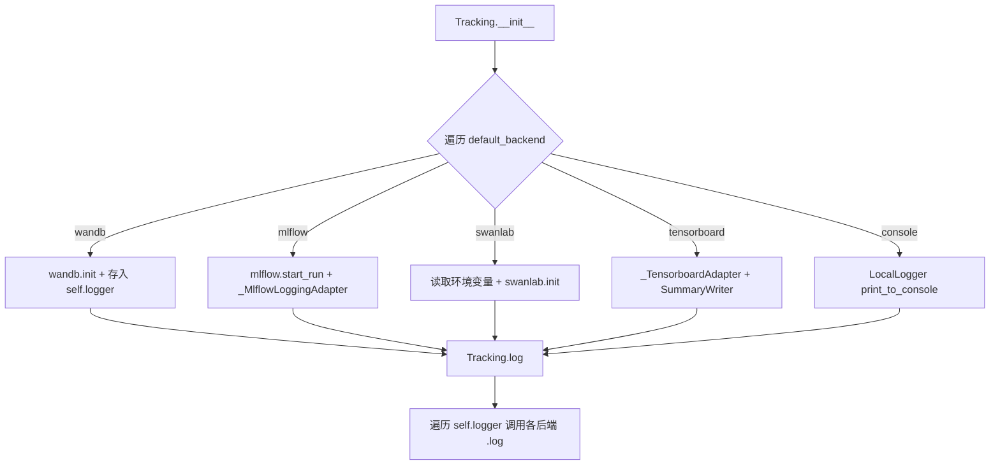
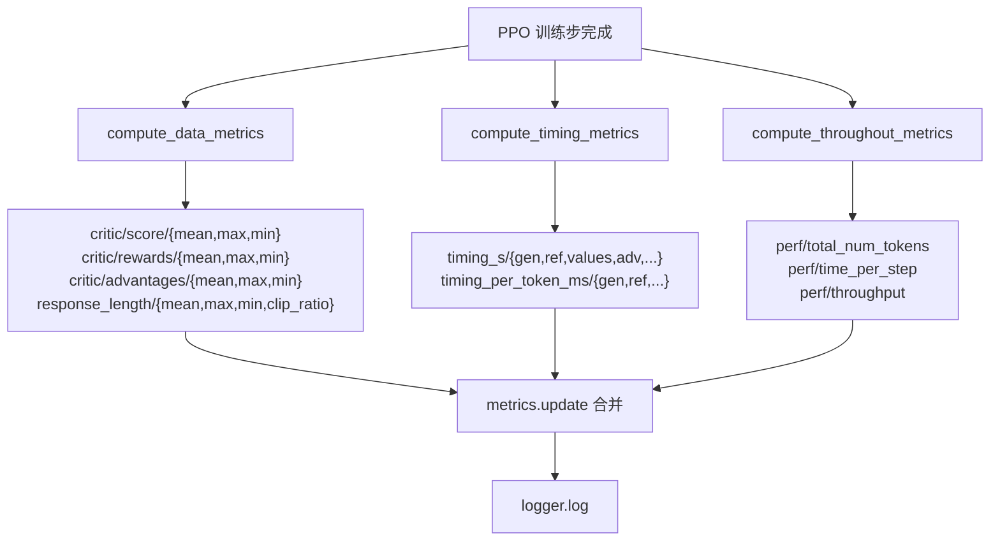

# PD-11.16 VRAG — 多后端统一追踪接口与 RL 训练指标体系

> 文档编号：PD-11.16
> 来源：VRAG `VRAG-RL/verl/utils/tracking.py`
> GitHub：https://github.com/Alibaba-NLP/VRAG.git
> 问题域：PD-11 可观测性 Observability & Cost Tracking
> 状态：可复用方案

---

## 第 1 章 问题与动机

### 1.1 核心问题

RL 训练（PPO/GRPO）涉及多个阶段（生成、参考策略、价值估计、优势计算、Actor/Critic 更新），每个阶段都需要记录指标。团队成员使用不同的实验追踪平台（wandb、mlflow、tensorboard、swanlab），如果每个阶段都硬编码某一平台的 API，会导致：

1. **平台锁定**：切换追踪后端需要修改训练循环代码
2. **指标分散**：timing、reward、critic、throughput 指标散落在不同位置，难以统一查看
3. **分布式日志混乱**：多 GPU/多节点训练时，每个 rank 都产生日志，需要聚合到 rank-0
4. **验证样本可视化困难**：训练过程中的 validation generation 需要以表格形式展示在不同平台

### 1.2 VRAG 的解法概述

VRAG 基于 verl（Bytedance 的 RL 训练框架）构建，其可观测性方案有 5 个核心设计：

1. **统一 Tracking 类**（`tracking.py:24`）：一个类封装 6 种后端（wandb/mlflow/swanlab/vemlp_wandb/tensorboard/console），通过 `log(data, step)` 统一接口广播到所有已注册后端
2. **三层指标计算分离**（`metric_utils.py:46,134,158`）：`compute_data_metrics` 计算 RL 核心指标、`compute_timing_metrics` 计算每阶段耗时、`compute_throughout_metrics` 计算吞吐量，三者独立计算后合并
3. **上下文管理器计时**（`ray_trainer.py:242`）：`_timer` 上下文管理器基于 `codetiming.Timer`，嵌套使用记录每个训练阶段的墙钟时间
4. **分布式轨迹追踪**（`trajectory_tracker.py:50`）：Ray Actor 实现的 `TrajectoryTracker`，支持多进程异步 dump 中间张量到 HDFS
5. **ValidationGenerationsLogger**（`tracking.py:168`）：将验证样本以 wandb Table / swanlab Text 形式记录，支持跨步骤累积

### 1.3 设计思想

| 设计原则 | 具体实现 | 理由 | 替代方案 |
|----------|----------|------|----------|
| 后端无关 | `Tracking` 类内部维护 `self.logger` 字典，`log()` 遍历广播 | 团队成员用不同平台，不应强制统一 | 每个后端写独立 logger 类 |
| 延迟导入 | wandb/mlflow 等在 `__init__` 中按需 import | 未使用的后端不应拖慢启动 | 顶层 import 全部依赖 |
| 指标计算与记录分离 | `metric_utils.py` 纯函数计算，`Tracking` 负责记录 | 便于单元测试指标计算逻辑 | 在 trainer 中内联计算 |
| 环境变量驱动 | swanlab 的 API_KEY/LOG_DIR/MODE 从环境变量读取 | 敏感信息不硬编码，适配 CI/CD | 配置文件传入 |
| 分层命名空间 | 指标用 `critic/score/mean`、`timing_s/gen` 等斜杠分层 | wandb/tensorboard 自动按前缀分组展示 | 扁平命名 |

---

## 第 2 章 源码实现分析

### 2.1 架构概览

```
┌─────────────────────────────────────────────────────────────┐
│                    RayPPOTrainer.fit()                       │
│  ┌─────────┐  ┌──────────┐  ┌───────────┐  ┌────────────┐  │
│  │ _timer() │  │ _timer() │  │ _timer()  │  │ _timer()   │  │
│  │  'gen'   │  │  'ref'   │  │ 'values'  │  │'update_*'  │  │
│  └────┬─────┘  └────┬─────┘  └─────┬─────┘  └─────┬──────┘  │
│       └──────────────┴──────────────┴──────────────┘         │
│                         timing_raw: Dict                     │
│       ┌─────────────────────────────────────────┐            │
│       │         metrics: Dict (合并)             │            │
│       │  compute_data_metrics()    → RL 指标     │            │
│       │  compute_timing_metrics()  → 耗时指标    │            │
│       │  compute_throughout_metrics() → 吞吐指标 │            │
│       └──────────────────┬──────────────────────┘            │
│                          ↓                                   │
│              logger.log(data=metrics, step=N)                │
└──────────────────────────┬───────────────────────────────────┘
                           ↓
              ┌────────────────────────┐
              │     Tracking 类        │
              │  self.logger = {       │
              │    'wandb': wandb,     │
              │    'mlflow': adapter,  │
              │    'swanlab': swanlab, │
              │    'tensorboard': tb,  │
              │    'console': local,   │
              │  }                     │
              │  log() → 遍历广播      │
              └────────────────────────┘
```

### 2.2 核心实现

#### Tracking 统一追踪类



对应源码 `VRAG-RL/verl/utils/tracking.py:24-95`：

```python
class Tracking(object):
    supported_backend = ["wandb", "mlflow", "swanlab", "vemlp_wandb", "tensorboard", "console"]

    def __init__(self, project_name, experiment_name, default_backend: Union[str, List[str]] = 'console', config=None):
        if isinstance(default_backend, str):
            default_backend = [default_backend]
        for backend in default_backend:
            if backend == 'tracking':
                import warnings
                warnings.warn("`tracking` logger is deprecated. use `wandb` instead.", DeprecationWarning)
            else:
                assert backend in self.supported_backend, f'{backend} is not supported'

        self.logger = {}

        if 'tracking' in default_backend or 'wandb' in default_backend:
            import wandb
            wandb.init(project=project_name, name=experiment_name, config=config)
            self.logger['wandb'] = wandb

        if 'mlflow' in default_backend:
            import mlflow
            mlflow.start_run(run_name=experiment_name)
            mlflow.log_params(_compute_mlflow_params_from_objects(config))
            self.logger['mlflow'] = _MlflowLoggingAdapter()
        # ... swanlab, vemlp_wandb, tensorboard, console 类似

    def log(self, data, step, backend=None):
        for default_backend, logger_instance in self.logger.items():
            if backend is None or default_backend in backend:
                logger_instance.log(data=data, step=step)
```

关键设计点：
- **延迟导入**：`import wandb` 在 `if` 分支内部，未启用的后端不会触发导入（`tracking.py:40`）
- **后端过滤**：`log()` 的 `backend` 参数允许选择性写入特定后端（`tracking.py:92-95`）
- **析构清理**：`__del__` 方法调用各后端的 `finish()` 确保数据刷盘（`tracking.py:97-105`）

#### 三层指标计算体系



对应源码 `VRAG-RL/verl/trainer/ppo/metric_utils.py:46-168`：

```python
def compute_data_metrics(batch: DataProto, use_critic: bool = True) -> Dict[str, Any]:
    sequence_score = batch.batch['token_level_scores'].sum(-1)
    sequence_reward = batch.batch['token_level_rewards'].sum(-1)
    advantages = batch.batch['advantages']
    returns = batch.batch['returns']
    # ... 计算 prompt/response mask
    metrics = {
        'critic/score/mean': torch.mean(sequence_score).detach().item(),
        'critic/score/max': torch.max(sequence_score).detach().item(),
        'critic/rewards/mean': torch.mean(sequence_reward).detach().item(),
        # ... 20+ 指标
        'response_length/clip_ratio':
            torch.mean(torch.eq(response_length, max_response_length).float()).detach().item(),
    }
    return metrics

def compute_timing_metrics(batch: DataProto, timing_raw: Dict[str, float]) -> Dict[str, Any]:
    # 将墙钟时间转换为 per-token 毫秒
    return {
        **{f'timing_s/{name}': value for name, value in timing_raw.items()},
        **{f'timing_per_token_ms/{name}': timing_raw[name] * 1000 / num_tokens
           for name in set(num_tokens_of_section.keys()) & set(timing_raw.keys())},
    }

def compute_throughout_metrics(batch: DataProto, timing_raw: Dict[str, float], n_gpus: int) -> Dict[str, Any]:
    total_num_tokens = sum(batch.meta_info['global_token_num'])
    return {
        'perf/total_num_tokens': total_num_tokens,
        'perf/time_per_step': timing_raw['step'],
        'perf/throughput': total_num_tokens / (timing_raw['step'] * n_gpus),
    }
```

### 2.3 实现细节

**_timer 上下文管理器**（`ray_trainer.py:241-245`）：

```python
@contextmanager
def _timer(name: str, timing_raw: Dict[str, float]):
    with Timer(name=name, logger=None) as timer:
        yield
    timing_raw[name] = timer.last
```

训练循环中嵌套使用，`step` 包含 `gen`、`ref`、`values` 等子计时器：

```python
with _timer('step', timing_raw):
    with _timer('gen', timing_raw):
        final_gen_batch_output = generation_manager.run_llm_loop(...)
    with _timer('old_log_prob', timing_raw):
        old_log_prob = self.actor_rollout_wg.compute_log_prob(batch)
    with _timer('ref', timing_raw):
        ref_log_prob = self.ref_policy_wg.compute_ref_log_prob(batch)
```

**TrajectoryTracker**（`trajectory_tracker.py:50-67`）：

- Ray Actor 实现，`get_if_exists=True` + `lifetime="detached"` 确保全局单例
- 通过 `VERL_ENABLE_TRACKER` 环境变量控制开关，默认关闭（零开销）
- 异步 dump 到 HDFS，使用 `deque` 管理 pending futures

**ValidationGenerationsLogger**（`tracking.py:168-223`）：

- wandb 端使用 `wandb.Table` 累积验证样本，每步创建新表（workaround wandb bug #2981）
- swanlab 端使用 `swanlab.Text` 记录格式化文本
- 按后端分发，仅在配置了对应后端时记录

**分布式日志隔离**（`logging_utils.py:27-31`）：

```python
def log_to_file(string):
    print(string)
    if os.path.isdir('logs'):
        with open(f'logs/log_{torch.distributed.get_rank()}', 'a+') as f:
            f.write(string + '\n')
```

每个 rank 写入独立日志文件 `logs/log_{rank}`，避免多进程写入冲突。

**GPU 内存监控**（`debug/performance.py:20-30`）：

```python
def log_gpu_memory_usage(head: str, logger=None, level=logging.DEBUG, rank: int = 0):
    if (not dist.is_initialized()) or (rank is None) or (dist.get_rank() == rank):
        memory_allocated = torch.cuda.memory_allocated() / 1024**3
        memory_reserved = torch.cuda.memory_reserved() / 1024**3
        message = f'{head}, memory allocated (GB): {memory_allocated}, memory reserved (GB): {memory_reserved}'
```

仅在指定 rank 上记录，避免日志洪泛。

---

## 第 3 章 迁移指南

### 3.1 迁移清单

**阶段 1：统一追踪接口（1 个文件）**

- [ ] 创建 `tracking.py`，实现 `Tracking` 类
- [ ] 定义 `supported_backend` 列表，按需添加后端
- [ ] 每个后端在 `__init__` 中延迟导入 + 初始化
- [ ] 实现 `log(data, step, backend=None)` 广播方法
- [ ] 实现 `__del__` 析构清理

**阶段 2：指标计算函数（1 个文件）**

- [ ] 创建 `metric_utils.py`，实现纯函数指标计算
- [ ] 按业务域分层命名：`{domain}/{metric}/{stat}`（如 `critic/score/mean`）
- [ ] 实现 `reduce_metrics()` 聚合函数
- [ ] 实现 timing 和 throughput 计算

**阶段 3：训练循环集成**

- [ ] 在训练循环中用 `_timer` 上下文管理器包裹每个阶段
- [ ] 在步骤末尾合并所有指标字典，一次性 `logger.log()`
- [ ] 配置文件中添加 `logger: ['console', 'wandb']` 字段

### 3.2 适配代码模板

```python
"""统一追踪接口 — 可直接复用的最小实现"""
from contextlib import contextmanager
from typing import Dict, List, Union, Any
import time


class UnifiedTracker:
    """多后端统一追踪，参考 VRAG/verl Tracking 类设计"""

    SUPPORTED = ["wandb", "mlflow", "tensorboard", "console"]

    def __init__(
        self,
        project: str,
        experiment: str,
        backends: Union[str, List[str]] = "console",
        config: dict = None,
    ):
        if isinstance(backends, str):
            backends = [backends]
        self._loggers: Dict[str, Any] = {}

        for b in backends:
            assert b in self.SUPPORTED, f"Unsupported backend: {b}"
            if b == "wandb":
                import wandb
                wandb.init(project=project, name=experiment, config=config)
                self._loggers["wandb"] = wandb
            elif b == "mlflow":
                import mlflow
                mlflow.start_run(run_name=experiment)
                if config:
                    mlflow.log_params(self._flatten(config))
                self._loggers["mlflow"] = mlflow
            elif b == "tensorboard":
                from torch.utils.tensorboard import SummaryWriter
                self._loggers["tensorboard"] = SummaryWriter(f"runs/{experiment}")
            elif b == "console":
                self._loggers["console"] = None  # 用 print

    def log(self, data: Dict[str, float], step: int, backend: str = None):
        for name, logger in self._loggers.items():
            if backend and name != backend:
                continue
            if name == "wandb":
                logger.log(data=data, step=step)
            elif name == "mlflow":
                logger.log_metrics(metrics=data, step=step)
            elif name == "tensorboard":
                for k, v in data.items():
                    logger.add_scalar(k, v, step)
            elif name == "console":
                parts = [f"{k}:{v:.4f}" for k, v in data.items() if isinstance(v, (int, float))]
                print(f"[step {step}] " + " | ".join(parts))

    def finish(self):
        if "wandb" in self._loggers:
            self._loggers["wandb"].finish()
        if "tensorboard" in self._loggers:
            self._loggers["tensorboard"].close()

    @staticmethod
    def _flatten(d: dict, prefix: str = "", sep: str = "/") -> dict:
        items = {}
        for k, v in d.items():
            key = f"{prefix}{sep}{k}" if prefix else k
            if isinstance(v, dict):
                items.update(UnifiedTracker._flatten(v, key, sep))
            else:
                items[key] = v
        return items


@contextmanager
def timer(name: str, timing_raw: Dict[str, float]):
    """上下文管理器计时，参考 VRAG _timer 设计"""
    start = time.perf_counter()
    yield
    timing_raw[name] = time.perf_counter() - start
```

### 3.3 适用场景

| 场景 | 适用度 | 说明 |
|------|--------|------|
| RL 训练（PPO/GRPO/DPO） | ⭐⭐⭐ | 完美匹配，多阶段计时 + 多指标聚合 |
| LLM 微调（SFT） | ⭐⭐⭐ | 指标较少但统一接口仍有价值 |
| Agent 系统运行时追踪 | ⭐⭐ | 需补充 token 计费和调用链追踪 |
| 推理服务监控 | ⭐ | 缺少 HTTP 指标、延迟分位数等 |
| 多租户 SaaS | ⭐ | 缺少租户隔离和成本归属 |

---

## 第 4 章 测试用例

```python
import pytest
from unittest.mock import MagicMock, patch
from typing import Dict, Any
import torch
import numpy as np


class TestTracking:
    """测试统一追踪接口"""

    def test_console_backend_logs_to_stdout(self, capsys):
        """console 后端应打印格式化指标"""
        from verl.utils.tracking import Tracking
        tracker = Tracking(
            project_name="test",
            experiment_name="run1",
            default_backend="console",
        )
        tracker.log(data={"loss": 0.5, "lr": 1e-4}, step=1)
        captured = capsys.readouterr()
        assert "step:1" in captured.out
        assert "loss:0.500" in captured.out

    @patch("wandb.init")
    @patch("wandb.log")
    def test_wandb_backend_calls_wandb_log(self, mock_log, mock_init):
        """wandb 后端应调用 wandb.log"""
        from verl.utils.tracking import Tracking
        tracker = Tracking(
            project_name="test",
            experiment_name="run1",
            default_backend="wandb",
        )
        tracker.log(data={"loss": 0.5}, step=1)
        mock_log.assert_called_once()

    def test_backend_filter(self):
        """指定 backend 参数时只写入对应后端"""
        from verl.utils.tracking import Tracking
        tracker = Tracking(
            project_name="test",
            experiment_name="run1",
            default_backend="console",
        )
        mock_logger = MagicMock()
        tracker.logger["mock"] = mock_logger
        tracker.log(data={"x": 1}, step=0, backend=["mock"])
        mock_logger.log.assert_called_once_with(data={"x": 1}, step=0)

    def test_unsupported_backend_raises(self):
        """不支持的后端应抛出 AssertionError"""
        from verl.utils.tracking import Tracking
        with pytest.raises(AssertionError, match="not supported"):
            Tracking(project_name="t", experiment_name="e", default_backend="unknown")


class TestMetricUtils:
    """测试指标计算函数"""

    def _make_batch(self, batch_size=4, prompt_len=10, response_len=20):
        """构造测试用 DataProto mock"""
        batch = MagicMock()
        total_len = prompt_len + response_len
        batch.batch = {
            'token_level_scores': torch.randn(batch_size, response_len),
            'token_level_rewards': torch.randn(batch_size, response_len),
            'advantages': torch.randn(batch_size, response_len),
            'returns': torch.randn(batch_size, response_len),
            'values': torch.randn(batch_size, response_len),
            'responses': torch.zeros(batch_size, response_len),
            'attention_mask': torch.ones(batch_size, total_len),
        }
        batch.meta_info = {'global_token_num': [total_len * batch_size]}
        return batch

    def test_compute_data_metrics_keys(self):
        """compute_data_metrics 应返回完整的指标键集合"""
        from verl.trainer.ppo.metric_utils import compute_data_metrics
        batch = self._make_batch()
        metrics = compute_data_metrics(batch, use_critic=True)
        assert 'critic/score/mean' in metrics
        assert 'critic/rewards/mean' in metrics
        assert 'response_length/mean' in metrics
        assert 'critic/vf_explained_var' in metrics

    def test_compute_timing_metrics_per_token(self):
        """timing 指标应包含 per-token 毫秒"""
        from verl.trainer.ppo.metric_utils import compute_timing_metrics
        batch = self._make_batch()
        timing_raw = {'gen': 2.0, 'ref': 1.0, 'step': 5.0}
        metrics = compute_timing_metrics(batch, timing_raw)
        assert 'timing_s/gen' in metrics
        assert 'timing_per_token_ms/gen' in metrics
        assert metrics['timing_per_token_ms/gen'] > 0

    def test_compute_throughout_metrics_throughput(self):
        """throughput 应为 tokens / (time * gpus)"""
        from verl.trainer.ppo.metric_utils import compute_throughout_metrics
        batch = self._make_batch()
        timing_raw = {'step': 2.0}
        metrics = compute_throughout_metrics(batch, timing_raw, n_gpus=4)
        expected = sum(batch.meta_info['global_token_num']) / (2.0 * 4)
        assert abs(metrics['perf/throughput'] - expected) < 1e-6

    def test_reduce_metrics_averages(self):
        """reduce_metrics 应对列表取均值"""
        from verl.trainer.ppo.metric_utils import reduce_metrics
        metrics = {'loss': [1.0, 2.0, 3.0], 'acc': [0.8, 0.9]}
        result = reduce_metrics(metrics)
        assert abs(result['loss'] - 2.0) < 1e-6
        assert abs(result['acc'] - 0.85) < 1e-6
```

---

## 第 5 章 跨域关联

| 关联域 | 关系类型 | 说明 |
|--------|----------|------|
| PD-01 上下文管理 | 协同 | `response_length/clip_ratio` 指标直接反映上下文窗口利用率，clip_ratio 过高说明生成被截断 |
| PD-02 多 Agent 编排 | 协同 | `n_agent` 参数控制每个 prompt 的并行 rollout 数，throughput 指标需除以 n_agent 才是单轨迹吞吐 |
| PD-03 容错与重试 | 依赖 | `TrajectoryTracker` 的 HDFS dump 使用 try/except 静默失败，不阻塞训练主循环 |
| PD-07 质量检查 | 协同 | `ValidationGenerationsLogger` 记录验证样本的 input/output/score，是质量评估的数据源 |
| PD-08 搜索与检索 | 协同 | VRAG 的 Agent 循环中 retriever 调用耗时包含在 `timing_s/gen` 中，无法单独拆分 |
| PD-12 推理增强 | 协同 | `compute_data_metrics` 中的 `critic/advantages` 和 `critic/vf_explained_var` 反映价值估计质量，指导推理策略调优 |

---

## 第 6 章 来源文件索引

| 文件 | 行范围 | 关键实现 |
|------|--------|----------|
| `VRAG-RL/verl/utils/tracking.py` | L24-L106 | `Tracking` 类：6 后端统一追踪接口 |
| `VRAG-RL/verl/utils/tracking.py` | L108-L131 | `_TensorboardAdapter` 和 `_MlflowLoggingAdapter` |
| `VRAG-RL/verl/utils/tracking.py` | L133-L165 | mlflow 参数扁平化（dataclass→dict→json_normalize） |
| `VRAG-RL/verl/utils/tracking.py` | L167-L223 | `ValidationGenerationsLogger`：wandb Table + swanlab Text |
| `VRAG-RL/verl/trainer/ppo/metric_utils.py` | L24-L27 | `reduce_metrics`：numpy 均值聚合 |
| `VRAG-RL/verl/trainer/ppo/metric_utils.py` | L46-L131 | `compute_data_metrics`：20+ RL 核心指标 |
| `VRAG-RL/verl/trainer/ppo/metric_utils.py` | L134-L155 | `compute_timing_metrics`：per-token 毫秒转换 |
| `VRAG-RL/verl/trainer/ppo/metric_utils.py` | L158-L168 | `compute_throughout_metrics`：GPU 吞吐量 |
| `VRAG-RL/verl/trainer/ppo/ray_trainer.py` | L241-L245 | `_timer` 上下文管理器（codetiming.Timer） |
| `VRAG-RL/verl/trainer/ppo/ray_trainer.py` | L681-L687 | Tracking 实例化（从 YAML config 读取后端列表） |
| `VRAG-RL/verl/trainer/ppo/ray_trainer.py` | L871-L879 | 指标合并 + logger.log 调用 |
| `VRAG-RL/verl/utils/logger/aggregate_logger.py` | L30-L41 | `LocalLogger`：console 格式化输出 |
| `VRAG-RL/verl/utils/logging_utils.py` | L20-L31 | 分布式 rank 级日志文件隔离 |
| `VRAG-RL/verl/utils/debug/performance.py` | L20-L30 | GPU 内存监控（allocated + reserved） |
| `VRAG-RL/verl/utils/debug/trajectory_tracker.py` | L50-L86 | Ray Actor 异步 HDFS 轨迹 dump |
| `VRAG-RL/verl/trainer/config/ppo_trainer.yaml` | L192 | `logger: ['console', 'wandb']` 配置 |

---

## 第 7 章 横向对比维度

```json comparison_data
{
  "project": "VRAG",
  "dimensions": {
    "追踪方式": "Tracking 类 6 后端广播，log(data,step) 统一接口",
    "数据粒度": "训练步级：20+ RL 指标 + per-token timing + GPU 吞吐",
    "持久化": "委托后端持久化（wandb cloud/mlflow/tensorboard 本地）",
    "多提供商": "wandb/mlflow/swanlab/vemlp_wandb/tensorboard/console 6 种",
    "日志格式": "斜杠分层命名空间 critic/score/mean，后端自动分组",
    "指标采集": "三层纯函数：data_metrics + timing_metrics + throughout_metrics",
    "可视化": "wandb Table 累积验证样本 + swanlab Text 格式化",
    "Worker日志隔离": "log_{rank} 文件 + rank 参数控制 GPU 内存日志",
    "延迟统计": "codetiming.Timer 嵌套上下文管理器，per-token ms 转换",
    "零开销路径": "TrajectoryTracker 环境变量开关，默认关闭",
    "Decorator 插桩": "无 Decorator，采用上下文管理器 _timer 显式包裹",
    "DAG 统计穿透": "timing_raw Dict 在训练循环中逐层填充，步骤末尾一次性提交"
  }
}
```

### 域元数据补充

```json domain_metadata
{
  "solution_summary": "VRAG 用 Tracking 类封装 6 种实验追踪后端（wandb/mlflow/swanlab/tensorboard/console/vemlp_wandb），三层纯函数分离 RL 指标计算，codetiming 嵌套计时器记录 PPO 各阶段 per-token 耗时",
  "description": "RL 训练场景下多后端实验追踪与分阶段性能剖析",
  "sub_problems": [
    "wandb Table 累积行数据的 bug workaround：每步创建新表复制旧数据避免 wandb#2981",
    "mlflow 参数扁平化：dataclass/Enum/Path/list 需递归转换为 JSON 可序列化的扁平字典",
    "分布式轨迹 dump 异步化：Ray Actor + deque 管理 pending futures 避免阻塞训练",
    "per-token timing 的 token 基数选择：gen 阶段用 response tokens，其他阶段用 overall tokens",
    "clip_ratio 指标设计：response 长度等于 max_length 的比例反映生成截断严重度"
  ],
  "best_practices": [
    "后端延迟导入：在 if 分支内 import，未启用的后端不拖慢启动",
    "指标计算与记录分离：纯函数计算指标，Tracking 类只负责广播，便于单元测试",
    "斜杠分层命名空间：critic/score/mean 格式让 wandb/tensorboard 自动按前缀分组",
    "环境变量控制调试追踪开关：VERL_ENABLE_TRACKER 默认关闭，生产环境零开销"
  ]
}
```
