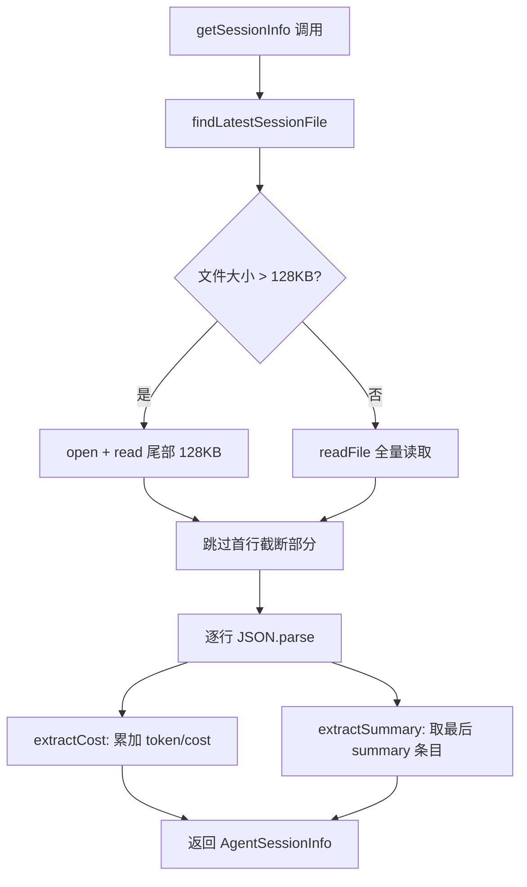
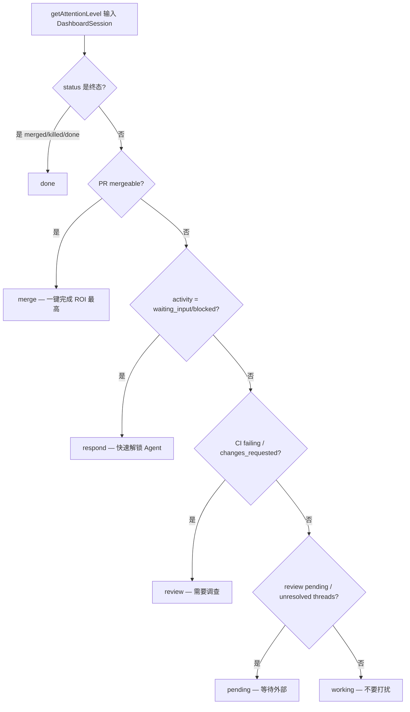

# PD-11.AO agent-orchestrator — JSONL 成本追踪与注意力路由 Dashboard

> 文档编号：PD-11.AO
> 来源：agent-orchestrator `packages/plugins/agent-claude-code/src/index.ts`
> GitHub：https://github.com/ComposioHQ/agent-orchestrator.git
> 问题域：PD-11 可观测性 Observability & Cost Tracking
> 状态：可复用方案

---

## 第 1 章 问题与动机

### 1.1 核心问题

当一个人类同时管理 10+ 个 AI Agent session 时，可观测性面临三重挑战：

1. **成本黑箱**：每个 Agent session 消耗多少 token、花了多少钱？Claude Code 的 JSONL 日志文件可达 100MB+，全量读取不现实。
2. **注意力稀缺**：10 个 session 同时运行，哪个需要人类立即介入？哪个可以放着不管？人类注意力是最稀缺的资源。
3. **活跃度盲区**：Agent 是在思考、等待输入、还是已经挂了？没有统一的活跃度检测机制，人类只能逐个 tmux attach 查看。

agent-orchestrator 的核心洞察是：**可观测性的终极目标不是展示数据，而是路由人类注意力**。

### 1.2 agent-orchestrator 的解法概述

1. **JSONL 尾部读取**：只读 session 文件末尾 128KB，从中提取 token 用量和成本估算（`packages/plugins/agent-claude-code/src/index.ts:264-307`）
2. **双轨活跃度检测**：终端输出分类（同步快速）+ JSONL 最后条目类型推断（异步精确），两者互补（`index.ts:459-484` + `index.ts:646-702`）
3. **六级注意力路由**：merge > respond > review > pending > working > done，按人类行动紧迫度排序（`packages/web/src/lib/types.ts:162-233`）
4. **SSE 实时推送**：Dashboard 通过 5 秒轮询 + SSE 推送 session 状态快照，含 attentionLevel 字段（`packages/web/src/app/api/events/route.ts:1-103`）
5. **TTLCache 防限流**：PR enrichment 数据缓存 5 分钟，API 限流时自动延长到 60 分钟（`packages/web/src/lib/cache.ts:1-115`）

### 1.3 设计思想

| 设计原则 | 具体实现 | 理由 | 替代方案 |
|----------|----------|------|----------|
| 尾部读取 | `parseJsonlFileTail()` 只读末尾 128KB | 100MB+ JSONL 全量读取耗时 > 1s，轮询场景不可接受 | 维护增量索引（复杂度高） |
| 注意力优先 | 6 级 AttentionLevel 排序 | 人类注意力是最稀缺资源，merge 一键完成 ROI 最高 | 按时间排序（忽略紧迫度） |
| 双轨检测 | 终端正则 + JSONL 类型推断 | 终端检测快但不精确，JSONL 精确但有延迟 | 仅用终端输出（误判率高） |
| 降级容错 | costUSD 优先，estimatedCostUsd 回退 | 不同 JSONL 版本字段名不同，需兼容 | 只支持最新格式（脆弱） |
| 缓存自适应 | 正常 5min TTL，限流时 60min | 避免限流时反复请求加剧问题 | 固定 TTL（限流时雪崩） |

---

## 第 2 章 源码实现分析

### 2.1 架构概览

agent-orchestrator 的可观测性分为四层：

```
┌─────────────────────────────────────────────────────────────────┐
│                    Dashboard (Next.js Web)                       │
│  AttentionZone → SessionCard → ActivityDot → PRStatus           │
│  SSE /api/events (5s poll) ← sessionToDashboard() + enrichPR() │
├─────────────────────────────────────────────────────────────────┤
│                    Serialization Layer                           │
│  serialize.ts: Session → DashboardSession (Date→string, PR扁平化)│
│  cache.ts: TTLCache<PREnrichmentData> (5min/60min adaptive)     │
├─────────────────────────────────────────────────────────────────┤
│                    Core Services                                │
│  lifecycle-manager.ts: 30s 轮询状态机 + 反应引擎                  │
│  session-manager.ts: CRUD + activity enrichment                 │
├─────────────────────────────────────────────────────────────────┤
│                    Agent Plugin (claude-code)                    │
│  parseJsonlFileTail(): 128KB 尾部读取 → extractCost/Summary     │
│  classifyTerminalOutput(): 终端正则 → ActivityState             │
│  getActivityState(): JSONL lastType → ActivityDetection         │
└─────────────────────────────────────────────────────────────────┘
```

### 2.2 核心实现

#### 2.2.1 JSONL 尾部读取与成本提取



对应源码 `packages/plugins/agent-claude-code/src/index.ts:264-383`：

```typescript
async function parseJsonlFileTail(filePath: string, maxBytes = 131_072): Promise<JsonlLine[]> {
  let content: string;
  let offset: number;
  try {
    const { size = 0 } = await stat(filePath);
    offset = Math.max(0, size - maxBytes);
    if (offset === 0) {
      content = await readFile(filePath, "utf-8");
    } else {
      // 大文件 — 只读尾部，避免全量加载到内存
      const handle = await open(filePath, "r");
      try {
        const length = size - offset;
        const buffer = Buffer.allocUnsafe(length);
        await handle.read(buffer, 0, length, offset);
        content = buffer.toString("utf-8");
      } finally {
        await handle.close();
      }
    }
  } catch {
    return [];
  }
  // 从中间开始读时跳过可能截断的首行
  const firstNewline = content.indexOf("\n");
  const safeContent =
    offset > 0 && firstNewline >= 0 ? content.slice(firstNewline + 1) : content;
  const lines: JsonlLine[] = [];
  for (const line of safeContent.split("\n")) {
    const trimmed = line.trim();
    if (!trimmed) continue;
    try {
      const parsed: unknown = JSON.parse(trimmed);
      if (typeof parsed === "object" && parsed !== null && !Array.isArray(parsed)) {
        lines.push(parsed as JsonlLine);
      }
    } catch { /* 跳过格式错误行 */ }
  }
  return lines;
}
```

成本提取逻辑 `index.ts:339-383`：

```typescript
function extractCost(lines: JsonlLine[]): CostEstimate | undefined {
  let inputTokens = 0, outputTokens = 0, totalCost = 0;
  for (const line of lines) {
    // 优先 costUSD，回退 estimatedCostUsd，避免双重计数
    if (typeof line.costUSD === "number") {
      totalCost += line.costUSD;
    } else if (typeof line.estimatedCostUsd === "number") {
      totalCost += line.estimatedCostUsd;
    }
    // 优先结构化 usage 对象，回退扁平字段
    if (line.usage) {
      inputTokens += line.usage.input_tokens ?? 0;
      inputTokens += line.usage.cache_read_input_tokens ?? 0;
      inputTokens += line.usage.cache_creation_input_tokens ?? 0;
      outputTokens += line.usage.output_tokens ?? 0;
    } else {
      if (typeof line.inputTokens === "number") inputTokens += line.inputTokens;
      if (typeof line.outputTokens === "number") outputTokens += line.outputTokens;
    }
  }
  // 无直接成本数据时用 Sonnet 4.5 定价估算
  if (totalCost === 0 && (inputTokens > 0 || outputTokens > 0)) {
    totalCost = (inputTokens / 1_000_000) * 3.0 + (outputTokens / 1_000_000) * 15.0;
  }
  return { inputTokens, outputTokens, estimatedCostUsd: totalCost };
}
```

#### 2.2.2 六级注意力路由



对应源码 `packages/web/src/lib/types.ts:162-233`：

```typescript
export function getAttentionLevel(session: DashboardSession): AttentionLevel {
  // Done: 终态
  if (session.status === "merged" || session.status === "killed" ||
      session.status === "cleanup" || session.status === "done" ||
      session.status === "terminated") {
    return "done";
  }
  // Merge: PR 可合并 — 一键清除，ROI 最高
  if (session.status === "mergeable" || session.status === "approved") return "merge";
  if (session.pr?.mergeability.mergeable) return "merge";
  // Respond: Agent 等待人类输入
  if (session.activity === ACTIVITY_STATE.WAITING_INPUT ||
      session.activity === ACTIVITY_STATE.BLOCKED) return "respond";
  if (session.activity === ACTIVITY_STATE.EXITED) return "respond";
  // Review: CI 失败或需要修改
  if (session.status === "ci_failed" || session.status === "changes_requested") return "review";
  // Pending: 等待外部（reviewer, CI）
  if (session.status === "review_pending") return "pending";
  // Working: Agent 正在工作
  return "working";
}
```

### 2.3 实现细节

**双轨活跃度检测**：agent-orchestrator 对 Claude Code 实现了两种互补的活跃度检测：

1. **终端输出分类**（`classifyTerminalOutput`, `index.ts:459-484`）：同步、快速，通过正则匹配终端最后几行判断状态。检测 `❯` 提示符 → idle，`Do you want to proceed?` → waiting_input，其余 → active。
2. **JSONL 条目类型推断**（`getActivityState`, `index.ts:646-702`）：异步、精确，读取 JSONL 文件最后一条记录的 `type` 字段 + 文件 mtime。`user/tool_use/progress` → active，`assistant/summary/result` → ready，`permission_request` → waiting_input，`error` → blocked。超过 5 分钟阈值的 active/ready 降级为 idle。

**反向读取最后一行**（`packages/core/src/utils.ts:39-81`）：`readLastLine()` 从文件末尾按 4KB 块反向读取，纯 Node.js 实现，处理多字节 UTF-8 字符边界。用于 `readLastJsonlEntry()` 快速获取最后条目类型，比 `parseJsonlFileTail()` 更轻量，适合高频轮询。

**TTLCache 自适应限流**（`packages/web/src/lib/serialize.ts:219-237`）：当 PR enrichment 的 6 个并行 API 调用中超过半数失败时，判定为 rate limited，将缓存 TTL 从 5 分钟延长到 60 分钟（GitHub rate limit 按小时重置），同时在 mergeability.blockers 中标记 `"API rate limited or unavailable"`，UI 据此显示 stale-data 警告。

**生命周期状态机**（`packages/core/src/lifecycle-manager.ts:172-607`）：30 秒轮询所有 session，检测状态转换（spawning → working → pr_open → ci_failed → ...），触发配置化反应（send-to-agent / notify / auto-merge），支持重试次数和时间阈值的升级机制。


---

## 第 3 章 迁移指南

### 3.1 迁移清单

**阶段 1：JSONL 成本提取（1 个文件）**
- [ ] 实现 `parseJsonlFileTail()` — 只读尾部 128KB
- [ ] 实现 `extractCost()` — 累加 token 和成本，支持多字段格式
- [ ] 实现 `readLastLine()` — 反向读取最后一行，用于轻量轮询

**阶段 2：活跃度检测（1 个文件）**
- [ ] 定义 `ActivityState` 类型：active / ready / idle / waiting_input / blocked / exited
- [ ] 实现终端输出分类器（正则匹配提示符和权限弹窗）
- [ ] 实现 JSONL 条目类型推断（lastType + mtime 阈值）

**阶段 3：注意力路由（2 个文件）**
- [ ] 定义 `AttentionLevel` 类型：merge / respond / review / pending / working / done
- [ ] 实现 `getAttentionLevel()` — 按紧迫度排序的决策树
- [ ] 在 Dashboard 中按 AttentionLevel 分组展示 session

**阶段 4：SSE 实时推送（1 个文件）**
- [ ] 实现 `/api/events` SSE 端点，5 秒轮询 + 15 秒心跳
- [ ] 每次推送包含 session 的 id / status / activity / attentionLevel

### 3.2 适配代码模板

**JSONL 尾部读取 + 成本提取（可直接复用）：**

```typescript
import { open, stat, readFile } from "node:fs/promises";

interface TokenUsage {
  inputTokens: number;
  outputTokens: number;
  estimatedCostUsd: number;
}

/**
 * 从 JSONL 文件尾部提取 token 用量和成本。
 * 适用于任何 JSONL 格式的 LLM 日志文件。
 *
 * @param filePath JSONL 文件路径
 * @param maxBytes 最大读取字节数（默认 128KB）
 * @param pricing 定价表 { inputPer1M, outputPer1M }
 */
export async function extractUsageFromJsonl(
  filePath: string,
  maxBytes = 131_072,
  pricing = { inputPer1M: 3.0, outputPer1M: 15.0 },
): Promise<TokenUsage> {
  const { size } = await stat(filePath);
  const offset = Math.max(0, size - maxBytes);

  let content: string;
  if (offset === 0) {
    content = await readFile(filePath, "utf-8");
  } else {
    const handle = await open(filePath, "r");
    try {
      const buf = Buffer.allocUnsafe(size - offset);
      await handle.read(buf, 0, buf.length, offset);
      content = buf.toString("utf-8");
    } finally {
      await handle.close();
    }
  }

  // 跳过可能截断的首行
  const start = offset > 0 ? content.indexOf("\n") + 1 : 0;
  const lines = content.slice(start).split("\n");

  let inputTokens = 0, outputTokens = 0, totalCost = 0;
  for (const raw of lines) {
    const trimmed = raw.trim();
    if (!trimmed) continue;
    try {
      const obj = JSON.parse(trimmed);
      // 成本字段：优先精确值，回退估算值
      if (typeof obj.costUSD === "number") totalCost += obj.costUSD;
      else if (typeof obj.estimatedCostUsd === "number") totalCost += obj.estimatedCostUsd;
      // Token 字段：优先结构化 usage，回退扁平字段
      if (obj.usage) {
        inputTokens += (obj.usage.input_tokens ?? 0)
          + (obj.usage.cache_read_input_tokens ?? 0)
          + (obj.usage.cache_creation_input_tokens ?? 0);
        outputTokens += obj.usage.output_tokens ?? 0;
      } else {
        if (typeof obj.inputTokens === "number") inputTokens += obj.inputTokens;
        if (typeof obj.outputTokens === "number") outputTokens += obj.outputTokens;
      }
    } catch { /* skip */ }
  }

  if (totalCost === 0 && (inputTokens > 0 || outputTokens > 0)) {
    totalCost = (inputTokens / 1_000_000) * pricing.inputPer1M
              + (outputTokens / 1_000_000) * pricing.outputPer1M;
  }

  return { inputTokens, outputTokens, estimatedCostUsd: totalCost };
}
```

**注意力路由（可直接复用）：**

```typescript
type AttentionLevel = "merge" | "respond" | "review" | "pending" | "working" | "done";

interface SessionSnapshot {
  status: string;
  activity: string | null;
  prMergeable: boolean;
  prState: string | null;
  ciStatus: string | null;
  reviewDecision: string | null;
}

export function getAttentionLevel(s: SessionSnapshot): AttentionLevel {
  const terminal = ["merged", "killed", "done", "terminated", "cleanup"];
  if (terminal.includes(s.status)) return "done";
  if (s.prState === "merged" || s.prState === "closed") return "done";
  if (s.prMergeable) return "merge";
  if (s.activity === "waiting_input" || s.activity === "blocked" || s.activity === "exited") return "respond";
  if (s.ciStatus === "failing" || s.reviewDecision === "changes_requested") return "review";
  if (s.reviewDecision === "pending") return "pending";
  return "working";
}
```

### 3.3 适用场景

| 场景 | 适用度 | 说明 |
|------|--------|------|
| 多 Agent 并行管理 Dashboard | ⭐⭐⭐ | 核心场景，注意力路由价值最大 |
| 单 Agent 成本监控 | ⭐⭐⭐ | JSONL 尾部读取 + 成本提取可独立使用 |
| CI/CD 流水线中的 Agent 监控 | ⭐⭐ | 需要适配非 JSONL 的日志格式 |
| 团队级 Agent 成本报表 | ⭐⭐ | 需要补充持久化存储（当前仅内存） |
| 实时告警系统 | ⭐ | 当前仅有 SSE 推送，无告警阈值机制 |

---

## 第 4 章 测试用例

```typescript
import { describe, it, expect, vi, beforeEach } from "vitest";

// ── JSONL 尾部读取测试 ──

describe("parseJsonlFileTail", () => {
  it("小文件全量读取", async () => {
    const lines = [
      '{"type":"user","message":{"content":"hello"}}',
      '{"type":"assistant","costUSD":0.003,"usage":{"input_tokens":100,"output_tokens":50}}',
    ].join("\n");
    // 模拟 readFile 返回
    const result = parseLines(lines, 0);
    expect(result).toHaveLength(2);
  });

  it("大文件跳过截断首行", () => {
    const content = 'ncated json}\n{"type":"valid","costUSD":0.01}\n';
    const result = parseLines(content, 1000); // offset > 0
    expect(result).toHaveLength(1);
    expect(result[0].type).toBe("valid");
  });
});

// ── 成本提取测试 ──

describe("extractCost", () => {
  it("累加多条 usage 记录", () => {
    const lines = [
      { usage: { input_tokens: 100, output_tokens: 50 } },
      { usage: { input_tokens: 200, output_tokens: 100, cache_read_input_tokens: 50 } },
    ];
    const cost = extractCost(lines);
    expect(cost?.inputTokens).toBe(350); // 100 + 200 + 50
    expect(cost?.outputTokens).toBe(150);
  });

  it("costUSD 优先于 estimatedCostUsd", () => {
    const lines = [
      { costUSD: 0.01, estimatedCostUsd: 0.02 },
    ];
    const cost = extractCost(lines);
    expect(cost?.estimatedCostUsd).toBe(0.01);
  });

  it("无成本数据时用定价估算", () => {
    const lines = [{ usage: { input_tokens: 1_000_000, output_tokens: 0 } }];
    const cost = extractCost(lines);
    expect(cost?.estimatedCostUsd).toBeCloseTo(3.0); // Sonnet 4.5 input pricing
  });
});

// ── 注意力路由测试 ──

describe("getAttentionLevel", () => {
  it("mergeable PR → merge", () => {
    const session = makeSession({ status: "pr_open", prMergeable: true });
    expect(getAttentionLevel(session)).toBe("merge");
  });

  it("waiting_input → respond", () => {
    const session = makeSession({ activity: "waiting_input" });
    expect(getAttentionLevel(session)).toBe("respond");
  });

  it("exited agent → respond (需要人类关注)", () => {
    const session = makeSession({ activity: "exited", status: "working" });
    expect(getAttentionLevel(session)).toBe("respond");
  });

  it("CI failing → review", () => {
    const session = makeSession({ status: "ci_failed" });
    expect(getAttentionLevel(session)).toBe("review");
  });

  it("review pending → pending", () => {
    const session = makeSession({ status: "review_pending" });
    expect(getAttentionLevel(session)).toBe("pending");
  });

  it("active agent → working", () => {
    const session = makeSession({ activity: "active", status: "working" });
    expect(getAttentionLevel(session)).toBe("working");
  });
});

// ── 终端输出分类测试 ──

describe("classifyTerminalOutput", () => {
  it("提示符 ❯ → idle", () => {
    expect(classifyTerminalOutput("some output\n❯ ")).toBe("idle");
  });

  it("权限弹窗 → waiting_input", () => {
    const output = "Reading file...\nDo you want to proceed?\n(Y)es (N)o";
    expect(classifyTerminalOutput(output)).toBe("waiting_input");
  });

  it("其他输出 → active", () => {
    expect(classifyTerminalOutput("Thinking...")).toBe("active");
  });
});

// ── TTLCache 测试 ──

describe("TTLCache", () => {
  it("过期条目返回 null", () => {
    const cache = new TTLCache<string>(100);
    cache.set("key", "value");
    vi.advanceTimersByTime(200);
    expect(cache.get("key")).toBeNull();
  });

  it("支持 per-key TTL 覆盖", () => {
    const cache = new TTLCache<string>(100);
    cache.set("short", "v1");
    cache.set("long", "v2", 60_000);
    vi.advanceTimersByTime(200);
    expect(cache.get("short")).toBeNull();
    expect(cache.get("long")).toBe("v2");
  });
});

// ── helpers ──

function parseLines(content: string, offset: number) {
  const firstNewline = content.indexOf("\n");
  const safe = offset > 0 && firstNewline >= 0 ? content.slice(firstNewline + 1) : content;
  return safe.split("\n").filter(l => l.trim()).map(l => JSON.parse(l));
}

function extractCost(lines: any[]) {
  let inputTokens = 0, outputTokens = 0, totalCost = 0;
  for (const line of lines) {
    if (typeof line.costUSD === "number") totalCost += line.costUSD;
    else if (typeof line.estimatedCostUsd === "number") totalCost += line.estimatedCostUsd;
    if (line.usage) {
      inputTokens += line.usage.input_tokens ?? 0;
      inputTokens += line.usage.cache_read_input_tokens ?? 0;
      inputTokens += line.usage.cache_creation_input_tokens ?? 0;
      outputTokens += line.usage.output_tokens ?? 0;
    } else {
      if (typeof line.inputTokens === "number") inputTokens += line.inputTokens;
      if (typeof line.outputTokens === "number") outputTokens += line.outputTokens;
    }
  }
  if (totalCost === 0 && (inputTokens > 0 || outputTokens > 0))
    totalCost = (inputTokens / 1_000_000) * 3.0 + (outputTokens / 1_000_000) * 15.0;
  if (inputTokens === 0 && outputTokens === 0 && totalCost === 0) return undefined;
  return { inputTokens, outputTokens, estimatedCostUsd: totalCost };
}

function makeSession(overrides: any) {
  return {
    status: "working", activity: null, prMergeable: false,
    prState: null, ciStatus: null, reviewDecision: null,
    ...overrides,
  };
}

function classifyTerminalOutput(output: string) {
  if (!output.trim()) return "idle";
  const lines = output.trim().split("\n");
  const lastLine = lines[lines.length - 1]?.trim() ?? "";
  if (/^[❯>$#]\s*$/.test(lastLine)) return "idle";
  const tail = lines.slice(-5).join("\n");
  if (/Do you want to proceed\?/i.test(tail)) return "waiting_input";
  if (/\(Y\)es.*\(N\)o/i.test(tail)) return "waiting_input";
  return "active";
}
```


---

## 第 5 章 跨域关联

| 关联域 | 关系类型 | 说明 |
|--------|----------|------|
| PD-01 上下文管理 | 协同 | JSONL 尾部读取策略本质上是上下文窗口管理的文件 I/O 版本 — 只读"最近的"数据 |
| PD-02 多 Agent 编排 | 依赖 | 注意力路由的前提是多 Agent 并行运行，编排层提供 session 列表 |
| PD-03 容错与重试 | 协同 | TTLCache 自适应限流是容错策略的一种；lifecycle-manager 的反应引擎支持重试+升级 |
| PD-06 记忆持久化 | 协同 | session metadata 以 key=value 扁平文件持久化，支持跨重启恢复状态 |
| PD-07 质量检查 | 协同 | CI 状态和 review decision 是质量检查的可观测性输出，驱动注意力路由 |
| PD-09 Human-in-the-Loop | 依赖 | 注意力路由的核心目标就是优化 Human-in-the-Loop 的效率 |

---

## 第 6 章 来源文件索引

| 文件 | 行范围 | 关键实现 |
|------|--------|----------|
| `packages/plugins/agent-claude-code/src/index.ts` | L233-L248 | JsonlLine 接口定义（costUSD/usage/inputTokens 等字段） |
| `packages/plugins/agent-claude-code/src/index.ts` | L264-L307 | parseJsonlFileTail() — 128KB 尾部读取 |
| `packages/plugins/agent-claude-code/src/index.ts` | L339-L383 | extractCost() — token 累加与成本估算 |
| `packages/plugins/agent-claude-code/src/index.ts` | L459-L484 | classifyTerminalOutput() — 终端正则活跃度分类 |
| `packages/plugins/agent-claude-code/src/index.ts` | L646-L702 | getActivityState() — JSONL lastType 推断 |
| `packages/core/src/utils.ts` | L39-L110 | readLastLine() + readLastJsonlEntry() — 反向读取 |
| `packages/core/src/types.ts` | L44-L68 | ActivityState / ActivityDetection 类型定义 |
| `packages/core/src/types.ts` | L355-L370 | AgentSessionInfo / CostEstimate 接口 |
| `packages/core/src/lifecycle-manager.ts` | L172-L607 | 状态机轮询 + 反应引擎 |
| `packages/web/src/lib/types.ts` | L48-L233 | AttentionLevel 类型 + getAttentionLevel() 决策树 |
| `packages/web/src/lib/serialize.ts` | L105-L253 | enrichSessionPR() — PR enrichment + 自适应缓存 |
| `packages/web/src/lib/cache.ts` | L1-L115 | TTLCache 实现 + PREnrichmentData |
| `packages/web/src/app/api/events/route.ts` | L1-L103 | SSE 端点 — 5s 轮询 + 15s 心跳 |
| `packages/web/src/components/AttentionZone.tsx` | L1-L175 | 注意力分区 UI 组件 |
| `packages/web/src/components/SessionCard.tsx` | L1-L381 | Session 卡片 — 活跃度点 + PR 状态 + 操作按钮 |
| `packages/web/src/components/ActivityDot.tsx` | L1-L67 | 6 态活跃度指示器（脉冲动画） |

---

## 第 7 章 横向对比维度

```json comparison_data
{
  "project": "agent-orchestrator",
  "dimensions": {
    "追踪方式": "JSONL 尾部读取 + 终端正则双轨检测",
    "数据粒度": "session 级 token/cost 累加，含 cache_read/cache_creation 4 种 token",
    "持久化": "JSONL 文件（Claude Code 原生）+ key=value 扁平 metadata 文件",
    "多提供商": "仅 Claude Code 插件，但 Agent 接口支持 codex/aider/opencode 扩展",
    "日志格式": "Claude Code JSONL（type/costUSD/usage/inputTokens 多字段兼容）",
    "可视化": "Next.js Dashboard + AttentionZone 分区 + ActivityDot 脉冲动画",
    "成本追踪": "costUSD 优先 → estimatedCostUsd 回退 → Sonnet 定价估算三级降级",
    "卡死检测": "JSONL mtime 超 5 分钟阈值降级为 idle，lifecycle-manager 30s 轮询",
    "缓存统计": "TTLCache 5min 默认 TTL，rate limit 时自适应延长到 60min",
    "注意力路由": "6 级 AttentionLevel：merge > respond > review > pending > working > done",
    "Agent 状态追踪": "6 态 ActivityState：active/ready/idle/waiting_input/blocked/exited",
    "健康端点": "SSE /api/events 5s 轮询 + 15s 心跳，无独立 health/readiness 端点",
    "JSONL大文件策略": "parseJsonlFileTail 只读末尾 128KB + readLastLine 反向 4KB 块读取"
  }
}
```

### 域元数据补充

```json domain_metadata
{
  "solution_summary": "agent-orchestrator 用 JSONL 128KB 尾部读取提取 session 成本，6 级 AttentionLevel 路由人类注意力到最高 ROI 的 session，SSE 实时推送 Dashboard 状态",
  "description": "多 Agent 并行场景下人类注意力路由与 session 级成本归属",
  "sub_problems": [
    "JSONL 多版本字段兼容：costUSD vs estimatedCostUsd 优先级与防双重计数",
    "PR enrichment 半数失败判定：6 个并行 API 调用中 ≥3 个失败即判定 rate limited",
    "终端输出历史污染：buffer 中残留的 Thinking 文本不应覆盖当前底部的权限弹窗",
    "反向文件读取 UTF-8 安全：4KB 块边界可能切断多字节字符需累积后统一解码"
  ],
  "best_practices": [
    "注意力路由按 ROI 排序：merge 一键完成最高，respond 快速解锁次之，working 不打扰最低",
    "JSONL 尾部读取跳过首行：从文件中间开始读时第一行必然截断，必须丢弃",
    "rate limit 时延长缓存而非重试：避免限流雪崩，同时在 UI 标记数据可能过期",
    "双轨活跃度检测互补：终端正则快但粗，JSONL 类型推断慢但准，组合使用覆盖更全"
  ]
}
```

