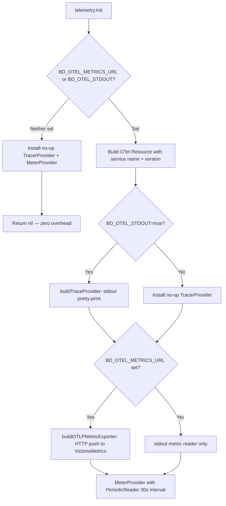
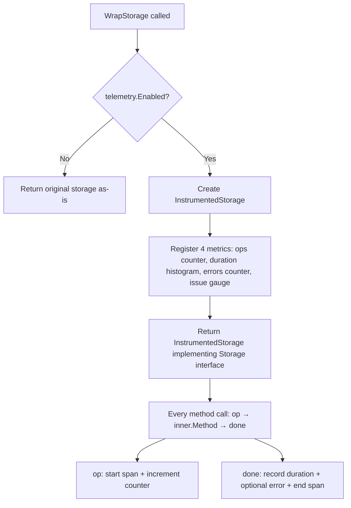

# PD-11.06 beads — OpenTelemetry 全链路可观测 + JSONL Audit Trail

> 文档编号：PD-11.06
> 来源：beads `internal/telemetry/telemetry.go`, `internal/audit/audit.go`, `internal/compact/haiku.go`
> GitHub：https://github.com/steveyegge/beads.git
> 问题域：PD-11 可观测性 Observability & Cost Tracking
> 状态：可复用方案

---

## 第 1 章 问题与动机

### 1.1 核心问题

CLI 工具的可观测性面临独特挑战：不像长驻服务有持续的 metrics 端点，CLI 进程生命周期短暂（秒级），每次执行都是独立进程。这意味着：

1. **指标必须在进程退出前推送完毕** — 没有 pull 模式的机会
2. **零开销要求** — 大多数用户不需要可观测性，不能因为 OTel SDK 初始化拖慢每次命令执行
3. **LLM 调用审计** — AI 驱动的 issue compaction 需要记录每次 LLM 调用的 prompt/response，用于调试和成本追踪
4. **存储层透明度** — 底层 Dolt（Git-for-data）数据库的操作耗时、错误率需要可观测

beads 是一个依赖感知的 issue tracker（"Issues chained together like beads"），内置 AI compaction 功能（用 Claude Haiku 压缩已关闭 issue），因此同时需要基础设施级和 AI 级的可观测性。

### 1.2 beads 的解法概述

beads 采用双轨可观测架构：

1. **OTel 标准化遥测**（`internal/telemetry/`）— 基于 OpenTelemetry Go SDK，通过环境变量 `BD_OTEL_METRICS_URL` 和 `BD_OTEL_STDOUT` 控制开关。未设置时安装 no-op provider，零内存分配开销（`telemetry.go:53-56`）
2. **JSONL Audit Trail**（`internal/audit/`）— append-only 的 `interactions.jsonl` 文件，记录 LLM 调用、工具执行等交互历史，设计为可通过 git 共享（`audit.go:75`）
3. **Decorator 模式存储插桩**（`internal/telemetry/storage.go`）— `InstrumentedStorage` 包装器，为每个存储操作自动添加 span + metrics，无需修改业务代码
4. **AI Token 精确计量**（`internal/compact/haiku.go:159-162`）— 从 Anthropic API 返回值直接提取 `InputTokens`/`OutputTokens`，不做估算
5. **命令级根 Span**（`cmd/bd/main.go:262-268`）— 每个 CLI 命令创建根 span，所有下游操作自动成为子 span

### 1.3 设计思想

| 设计原则 | 具体实现 | 理由 | 替代方案 |
|----------|----------|------|----------|
| 零开销默认关闭 | `Enabled()` 检查环境变量，未设置时安装 no-op provider | CLI 工具不能因遥测拖慢用户体验 | 编译时 flag（不够灵活） |
| Decorator 透明插桩 | `WrapStorage()` 返回 `InstrumentedStorage`，实现相同接口 | 业务代码无需感知遥测存在 | AOP/中间件（Go 不支持） |
| 双轨记录 | OTel 推送到 VictoriaMetrics + JSONL 本地持久化 | OTel 适合聚合分析，JSONL 适合逐条审计和 git 共享 | 只用 OTel（丢失审计能力） |
| 环境变量驱动 | `BD_OTEL_METRICS_URL` / `BD_OTEL_STDOUT` | 12-Factor App 风格，容器/CI 友好 | 配置文件（需要额外解析） |
| 优雅关闭 | `PersistentPostRun` 中 5s 超时 flush | CLI 进程短暂，必须在退出前推送完毕 | 后台 daemon（过重） |

---

## 第 2 章 源码实现分析

### 2.1 架构概览

beads 的可观测性分为三层：CLI 入口层、存储插桩层、AI 调用层，通过 OTel context propagation 串联。

```
┌─────────────────────────────────────────────────────────────┐
│                    cmd/bd/main.go                            │
│  PersistentPreRun:                                          │
│    telemetry.Init() → OTel Provider (no-op or real)         │
│    tracer.Start("bd.command.<name>") → rootCtx + commandSpan│
├─────────────────────────────────────────────────────────────┤
│                                                             │
│  ┌──────────────────┐  ┌──────────────────┐                │
│  │ InstrumentedStorage│  │  haikuClient     │                │
│  │ (Decorator)       │  │  (AI compaction) │                │
│  │                   │  │                   │                │
│  │ bd.storage.*      │  │ bd.ai.*           │                │
│  │ metrics + spans   │  │ metrics + spans   │                │
│  └────────┬──────────┘  └────────┬──────────┘                │
│           │                      │                           │
│           ▼                      ▼                           │
│  ┌──────────────────┐  ┌──────────────────┐                │
│  │  Dolt Storage     │  │  Anthropic API   │                │
│  │  (dolt.* spans)   │  │  + audit.Append  │                │
│  └──────────────────┘  └──────────────────┘                │
│                                                             │
├─────────────────────────────────────────────────────────────┤
│  PersistentPostRun:                                         │
│    commandSpan.End() → telemetry.Shutdown(5s timeout)       │
└─────────────────────────────────────────────────────────────┘
         │                              │
         ▼                              ▼
  BD_OTEL_METRICS_URL            BD_OTEL_STDOUT=true
  → VictoriaMetrics :8428        → stderr (dev/debug)
  → Grafana :9429
```

### 2.2 核心实现

#### 2.2.1 OTel 初始化与零开销路径



对应源码 `internal/telemetry/telemetry.go:53-104`：

```go
func Enabled() bool {
	return os.Getenv("BD_OTEL_METRICS_URL") != "" ||
		os.Getenv("BD_OTEL_STDOUT") == "true"
}

func Init(ctx context.Context, serviceName, version string) error {
	if !Enabled() {
		otel.SetTracerProvider(tracenoop.NewTracerProvider())
		otel.SetMeterProvider(metricnoop.NewMeterProvider())
		return nil
	}
	res, err := resource.New(ctx,
		resource.WithAttributes(
			semconv.ServiceNameKey.String(serviceName),
			semconv.ServiceVersionKey.String(version),
		),
		resource.WithHost(),
		resource.WithProcess(),
	)
	// ... build trace + metric providers ...
}
```

关键设计：`Enabled()` 是一个纯环境变量检查，不涉及任何 SDK 初始化。当返回 false 时，`Init()` 只安装 no-op provider，后续所有 `Tracer()`/`Meter()` 调用返回的都是 no-op 实例，编译器可以内联优化掉。

#### 2.2.2 Decorator 模式存储插桩



对应源码 `internal/telemetry/storage.go:33-82`：

```go
func WrapStorage(s storage.Storage) storage.Storage {
	if !Enabled() {
		return s  // 零开销：未启用时直接返回原始 storage
	}
	m := Meter(storageScopeName)
	ops, _ := m.Int64Counter("bd.storage.operations", ...)
	dur, _ := m.Float64Histogram("bd.storage.operation.duration", ...)
	errs, _ := m.Int64Counter("bd.storage.errors", ...)
	issueGauge, _ := m.Int64Gauge("bd.issue.count", ...)
	return &InstrumentedStorage{inner: s, tracer: Tracer(storageScopeName),
		ops: ops, dur: dur, errs: errs, issueGauge: issueGauge}
}

func (s *InstrumentedStorage) op(ctx context.Context, name string, attrs ...attribute.KeyValue) (context.Context, trace.Span, time.Time) {
	all := append([]attribute.KeyValue{attribute.String("db.operation", name)}, attrs...)
	ctx, span := s.tracer.Start(ctx, "storage."+name,
		trace.WithAttributes(all...),
		trace.WithSpanKind(trace.SpanKindClient),
	)
	s.ops.Add(ctx, 1, metric.WithAttributes(all...))
	return ctx, span, time.Now()
}

func (s *InstrumentedStorage) done(ctx context.Context, span trace.Span, start time.Time, err error, attrs ...attribute.KeyValue) {
	ms := float64(time.Since(start).Milliseconds())
	s.dur.Record(ctx, ms, metric.WithAttributes(attrs...))
	if err != nil {
		span.RecordError(err)
		span.SetStatus(codes.Error, err.Error())
		s.errs.Add(ctx, 1, metric.WithAttributes(attrs...))
	}
	span.End()
}
```

每个存储方法（CreateIssue、GetIssue、SearchIssues 等 20+ 方法）都遵循相同的 `op → inner.Method → done` 三步模式，通过 `attribute.KeyValue` 携带业务维度（actor、issue_id、label 等）。

### 2.3 实现细节

#### AI Token 精确计量

`internal/compact/haiku.go:108-122` 定义了三个 AI 指标，通过 `sync.Once` 延迟初始化：

```go
var aiMetrics struct {
	inputTokens  metric.Int64Counter
	outputTokens metric.Int64Counter
	duration     metric.Float64Histogram
}

func initAIMetrics() {
	m := telemetry.Meter("github.com/steveyegge/beads/ai")
	aiMetrics.inputTokens, _ = m.Int64Counter("bd.ai.input_tokens", ...)
	aiMetrics.outputTokens, _ = m.Int64Counter("bd.ai.output_tokens", ...)
	aiMetrics.duration, _ = m.Float64Histogram("bd.ai.request.duration", ...)
}
```

在 `callWithRetry` 中（`haiku.go:156-168`），token 数直接从 API 响应提取：

```go
if err == nil {
	modelAttr := attribute.String("bd.ai.model", string(h.model))
	aiMetrics.inputTokens.Add(ctx, message.Usage.InputTokens, metric.WithAttributes(modelAttr))
	aiMetrics.outputTokens.Add(ctx, message.Usage.OutputTokens, metric.WithAttributes(modelAttr))
	aiMetrics.duration.Record(ctx, ms, metric.WithAttributes(modelAttr))
	span.SetAttributes(
		attribute.Int64("bd.ai.input_tokens", message.Usage.InputTokens),
		attribute.Int64("bd.ai.output_tokens", message.Usage.OutputTokens),
		attribute.Int("bd.ai.attempts", attempt+1),
	)
}
```

#### JSONL Audit Trail

`internal/audit/audit.go:24-49` 定义了灵活的 `Entry` 结构，通过 `Kind` 字段区分事件类型：

- `llm_call` — LLM 调用（含 model/prompt/response/error）
- `tool_call` — 工具执行（含 tool_name/exit_code）
- 标签事件 — 通过 parent_id/label/reason 实现 append-only 标注

`Append()` 函数（`audit.go:84-126`）使用 `bufio.Writer` + `json.Encoder` 写入，`SetEscapeHTML(false)` 避免 prompt 中的 HTML 被转义。文件权限 `0644` 并注释说明是有意为之（"JSONL is intended to be shared via git across clones/tools"）。

#### 命令级根 Span 与优雅关闭

`cmd/bd/main.go:256-268`（PersistentPreRun）：

```go
if err := telemetry.Init(rootCtx, "bd", Version); err != nil {
	debug.Logf("warning: telemetry init failed: %v", err)
}
rootCtx, commandSpan = telemetry.Tracer("bd").Start(rootCtx, "bd.command."+cmd.Name(),
	oteltrace.WithAttributes(
		attribute.String("bd.command", cmd.Name()),
		attribute.String("bd.version", Version),
		attribute.String("bd.args", strings.Join(os.Args[1:], " ")),
	),
)
```

`cmd/bd/main.go:662-669`（PersistentPostRun）：

```go
if commandSpan != nil {
	commandSpan.End()
	commandSpan = nil
}
shutdownCtx, shutdownCancel := context.WithTimeout(context.Background(), 5*time.Second)
telemetry.Shutdown(shutdownCtx)
shutdownCancel()
```

5 秒超时确保即使 VictoriaMetrics 不可达也不会阻塞 CLI 退出。


---

## 第 3 章 迁移指南

### 3.1 迁移清单

**阶段 1：基础设施准备**
- [ ] 部署 VictoriaMetrics（metrics 存储）+ VictoriaLogs（logs 存储）+ Grafana（可视化）
- [ ] 配置 OTLP HTTP 端点（VictoriaMetrics 默认 `:8428/opentelemetry/api/v1/push`）
- [ ] 决定 audit trail 存储位置（建议 `.beads/interactions.jsonl` 或类似项目根目录）

**阶段 2：OTel SDK 集成**
- [ ] 添加依赖：`go.opentelemetry.io/otel`、`go.opentelemetry.io/otel/sdk/metric`、`go.opentelemetry.io/otel/exporters/otlp/otlpmetric/otlpmetrichttp`
- [ ] 实现 `telemetry.Init()` 函数，支持环境变量开关（`OTEL_METRICS_URL`、`OTEL_STDOUT`）
- [ ] 在 CLI 入口（main.go 或 root command）的 PreRun 中调用 `telemetry.Init()`
- [ ] 在 PostRun 中调用 `telemetry.Shutdown()` 并设置 5s 超时

**阶段 3：存储层插桩**
- [ ] 定义 `InstrumentedStorage` 结构体，包装现有 storage 接口
- [ ] 实现 `WrapStorage()` 函数，检查 `Enabled()` 后返回 decorator 或原始实例
- [ ] 为每个存储方法添加 `op() → inner.Method() → done()` 三步模式
- [ ] 注册 4 类指标：operations counter、duration histogram、errors counter、业务 gauge

**阶段 4：AI 调用追踪**
- [ ] 在 LLM 客户端中添加 `aiMetrics` 结构体（input_tokens、output_tokens、duration）
- [ ] 在 API 调用成功后从响应提取 `Usage.InputTokens`/`OutputTokens`
- [ ] 创建 `anthropic.messages.new` span，记录 model、operation、attempts 等属性
- [ ] 实现 `audit.Append()` 函数，写入 JSONL 文件（kind=llm_call）

**阶段 5：命令级根 Span**
- [ ] 在 CLI 框架（Cobra/urfave/cli）的全局 PreRun 中创建根 span
- [ ] 将 span 注入 context，传递给所有下游操作
- [ ] 在 PostRun 中 `span.End()` 并 flush OTel provider

### 3.2 适配代码模板

#### 模板 1：OTel 初始化（零开销路径）

```go
package telemetry

import (
	"context"
	"os"
	"time"
	"go.opentelemetry.io/otel"
	"go.opentelemetry.io/otel/metric"
	metricnoop "go.opentelemetry.io/otel/metric/noop"
	sdkmetric "go.opentelemetry.io/otel/sdk/metric"
	"go.opentelemetry.io/otel/sdk/resource"
	semconv "go.opentelemetry.io/otel/semconv/v1.26.0"
	"go.opentelemetry.io/otel/trace"
	tracenoop "go.opentelemetry.io/otel/trace/noop"
)

var shutdownFns []func(context.Context) error

func Enabled() bool {
	return os.Getenv("MYAPP_OTEL_METRICS_URL") != "" ||
		os.Getenv("MYAPP_OTEL_STDOUT") == "true"
}

func Init(ctx context.Context, serviceName, version string) error {
	if !Enabled() {
		otel.SetTracerProvider(tracenoop.NewTracerProvider())
		otel.SetMeterProvider(metricnoop.NewMeterProvider())
		return nil
	}
	res, err := resource.New(ctx,
		resource.WithAttributes(
			semconv.ServiceNameKey.String(serviceName),
			semconv.ServiceVersionKey.String(version),
		),
		resource.WithHost(),
		resource.WithProcess(),
	)
	if err != nil {
		return err
	}
	// Build metric provider with OTLP HTTP exporter
	mp, err := buildMetricProvider(ctx, res)
	if err != nil {
		return err
	}
	otel.SetMeterProvider(mp)
	shutdownFns = append(shutdownFns, mp.Shutdown)
	return nil
}

func Shutdown(ctx context.Context) {
	for _, fn := range shutdownFns {
		_ = fn(ctx)
	}
	shutdownFns = nil
}

func Tracer(name string) trace.Tracer {
	return otel.Tracer(name)
}

func Meter(name string) metric.Meter {
	return otel.Meter(name)
}
```

#### 模板 2：Decorator 存储插桩

```go
package telemetry

import (
	"context"
	"time"
	"go.opentelemetry.io/otel/attribute"
	"go.opentelemetry.io/otel/codes"
	"go.opentelemetry.io/otel/metric"
	"go.opentelemetry.io/otel/trace"
)

type InstrumentedStorage struct {
	inner  Storage  // 原始 storage 接口
	tracer trace.Tracer
	ops    metric.Int64Counter
	dur    metric.Float64Histogram
	errs   metric.Int64Counter
}

func WrapStorage(s Storage) Storage {
	if !Enabled() {
		return s
	}
	m := Meter("myapp/storage")
	ops, _ := m.Int64Counter("myapp.storage.operations")
	dur, _ := m.Float64Histogram("myapp.storage.operation.duration", metric.WithUnit("ms"))
	errs, _ := m.Int64Counter("myapp.storage.errors")
	return &InstrumentedStorage{
		inner: s, tracer: Tracer("myapp/storage"),
		ops: ops, dur: dur, errs: errs,
	}
}

func (s *InstrumentedStorage) op(ctx context.Context, name string, attrs ...attribute.KeyValue) (context.Context, trace.Span, time.Time) {
	all := append([]attribute.KeyValue{attribute.String("db.operation", name)}, attrs...)
	ctx, span := s.tracer.Start(ctx, "storage."+name,
		trace.WithAttributes(all...),
		trace.WithSpanKind(trace.SpanKindClient),
	)
	s.ops.Add(ctx, 1, metric.WithAttributes(all...))
	return ctx, span, time.Now()
}

func (s *InstrumentedStorage) done(ctx context.Context, span trace.Span, start time.Time, err error, attrs ...attribute.KeyValue) {
	ms := float64(time.Since(start).Milliseconds())
	s.dur.Record(ctx, ms, metric.WithAttributes(attrs...))
	if err != nil {
		span.RecordError(err)
		span.SetStatus(codes.Error, err.Error())
		s.errs.Add(ctx, 1, metric.WithAttributes(attrs...))
	}
	span.End()
}

// 示例：包装一个存储方法
func (s *InstrumentedStorage) GetItem(ctx context.Context, id string) (*Item, error) {
	attrs := []attribute.KeyValue{attribute.String("item.id", id)}
	ctx, span, t := s.op(ctx, "GetItem", attrs...)
	item, err := s.inner.GetItem(ctx, id)
	s.done(ctx, span, t, err, attrs...)
	return item, err
}
```

#### 模板 3：JSONL Audit Trail

```go
package audit

import (
	"bufio"
	"encoding/json"
	"os"
	"time"
)

type Entry struct {
	ID        string    `json:"id"`
	Kind      string    `json:"kind"`
	CreatedAt time.Time `json:"created_at"`
	Actor     string    `json:"actor,omitempty"`
	Model     string    `json:"model,omitempty"`
	Prompt    string    `json:"prompt,omitempty"`
	Response  string    `json:"response,omitempty"`
	Error     string    `json:"error,omitempty"`
	Extra     map[string]any `json:"extra,omitempty"`
}

func Append(e *Entry, filePath string) error {
	if e.CreatedAt.IsZero() {
		e.CreatedAt = time.Now().UTC()
	}
	f, err := os.OpenFile(filePath, os.O_CREATE|os.O_WRONLY|os.O_APPEND, 0644)
	if err != nil {
		return err
	}
	defer f.Close()
	bw := bufio.NewWriter(f)
	enc := json.NewEncoder(bw)
	enc.SetEscapeHTML(false)
	if err := enc.Encode(e); err != nil {
		return err
	}
	return bw.Flush()
}
```

### 3.3 适用场景

| 场景 | 适用度 | 说明 |
|------|--------|------|
| CLI 工具 | ⭐⭐⭐ | 短生命周期进程，需要 push 模式 + 零开销默认关闭 |
| AI Agent 系统 | ⭐⭐⭐ | LLM 调用审计 + token 精确计量是刚需 |
| 微服务 | ⭐⭐ | 长驻进程可用 pull 模式（Prometheus），但 decorator 模式仍适用 |
| 批处理任务 | ⭐⭐⭐ | 类似 CLI，需要在进程退出前 flush metrics |
| 嵌入式系统 | ⭐ | 资源受限，OTel SDK 开销可能过大 |

---

## 第 4 章 测试用例

```go
package telemetry_test

import (
	"context"
	"os"
	"testing"
	"time"
	"github.com/stretchr/testify/assert"
	"github.com/stretchr/testify/require"
	"myapp/telemetry"
)

func TestEnabledReturnsFalseWhenNoEnvVars(t *testing.T) {
	os.Unsetenv("MYAPP_OTEL_METRICS_URL")
	os.Unsetenv("MYAPP_OTEL_STDOUT")
	assert.False(t, telemetry.Enabled())
}

func TestEnabledReturnsTrueWhenMetricsURLSet(t *testing.T) {
	os.Setenv("MYAPP_OTEL_METRICS_URL", "http://localhost:8428/api/v1/push")
	defer os.Unsetenv("MYAPP_OTEL_METRICS_URL")
	assert.True(t, telemetry.Enabled())
}

func TestInitInstallsNoopProviderWhenDisabled(t *testing.T) {
	os.Unsetenv("MYAPP_OTEL_METRICS_URL")
	os.Unsetenv("MYAPP_OTEL_STDOUT")
	ctx := context.Background()
	err := telemetry.Init(ctx, "test", "1.0.0")
	require.NoError(t, err)
	// Verify no-op: tracer/meter calls should not panic
	tracer := telemetry.Tracer("test")
	_, span := tracer.Start(ctx, "test-span")
	span.End()
	meter := telemetry.Meter("test")
	counter, _ := meter.Int64Counter("test.counter")
	counter.Add(ctx, 1)
}

func TestWrapStorageReturnsOriginalWhenDisabled(t *testing.T) {
	os.Unsetenv("MYAPP_OTEL_METRICS_URL")
	original := &mockStorage{}
	wrapped := telemetry.WrapStorage(original)
	assert.Same(t, original, wrapped, "should return original storage when telemetry disabled")
}

func TestWrapStorageReturnsDecoratorWhenEnabled(t *testing.T) {
	os.Setenv("MYAPP_OTEL_STDOUT", "true")
	defer os.Unsetenv("MYAPP_OTEL_STDOUT")
	ctx := context.Background()
	require.NoError(t, telemetry.Init(ctx, "test", "1.0.0"))
	original := &mockStorage{}
	wrapped := telemetry.WrapStorage(original)
	assert.NotSame(t, original, wrapped, "should return decorator when telemetry enabled")
	assert.IsType(t, &telemetry.InstrumentedStorage{}, wrapped)
}

func TestShutdownFlushesWithinTimeout(t *testing.T) {
	os.Setenv("MYAPP_OTEL_STDOUT", "true")
	defer os.Unsetenv("MYAPP_OTEL_STDOUT")
	ctx := context.Background()
	require.NoError(t, telemetry.Init(ctx, "test", "1.0.0"))
	shutdownCtx, cancel := context.WithTimeout(context.Background(), 5*time.Second)
	defer cancel()
	start := time.Now()
	telemetry.Shutdown(shutdownCtx)
	elapsed := time.Since(start)
	assert.Less(t, elapsed, 5*time.Second, "shutdown should complete within timeout")
}

type mockStorage struct{}
func (m *mockStorage) GetItem(ctx context.Context, id string) (*Item, error) {
	return &Item{ID: id}, nil
}
```

---

## 第 5 章 跨域关联

| 关联域 | 关系类型 | 说明 |
|--------|----------|------|
| PD-03 容错与重试 | 协同 | AI 调用的 `callWithRetry` 实现了指数退避重试，重试次数记录在 span 的 `bd.ai.attempts` 属性中 |
| PD-04 工具系统 | 协同 | Audit trail 的 `tool_call` kind 可记录工具执行的 exit_code，与工具系统的错误处理配合 |
| PD-08 搜索与检索 | 协同 | `SearchIssues` 操作的 span 记录了 `bd.query` 和 `bd.result.count`，可用于搜索性能分析 |
| PD-10 中间件管道 | 依赖 | Decorator 模式本质是一种中间件，`InstrumentedStorage` 可视为存储层的中间件 |

---

## 第 6 章 来源文件索引

| 文件 | 行范围 | 关键实现 |
|------|--------|----------|
| `internal/telemetry/telemetry.go` | L53-56 | `Enabled()` 环境变量检查 |
| `internal/telemetry/telemetry.go` | L64-104 | `Init()` 零开销路径 + OTel provider 构建 |
| `internal/telemetry/storage.go` | L33-59 | `WrapStorage()` decorator 工厂函数 |
| `internal/telemetry/storage.go` | L62-82 | `op()` 和 `done()` 插桩辅助函数 |
| `internal/telemetry/storage.go` | L86-171 | 存储方法插桩示例（CreateIssue、GetIssue、SearchIssues） |
| `internal/telemetry/otlp.go` | L13-15 | `buildOTLPMetricExporter()` HTTP 推送配置 |
| `internal/audit/audit.go` | L24-49 | `Entry` 结构体定义 |
| `internal/audit/audit.go` | L84-126 | `Append()` JSONL 写入逻辑 |
| `internal/compact/haiku.go` | L108-122 | AI metrics 定义（input_tokens、output_tokens、duration） |
| `internal/compact/haiku.go` | L124-198 | `callWithRetry()` AI 调用 + token 计量 |
| `cmd/bd/main.go` | L256-268 | 命令级根 span 创建（PersistentPreRun） |
| `cmd/bd/main.go` | L662-669 | OTel shutdown + 5s 超时（PersistentPostRun） |
| `docs/OBSERVABILITY.md` | L1-156 | 完整的可观测性文档（metrics 列表、span 属性、架构图） |


---

## 第 7 章 横向对比维度

```json comparison_data
{
  "project": "beads",
  "dimensions": {
    "追踪方式": "OTel SDK + 命令级根 span，所有操作自动成为子 span",
    "数据粒度": "存储操作级（20+ 方法）+ AI 调用级 + 命令级",
    "持久化": "双轨：OTel 推送到 VictoriaMetrics + JSONL 本地审计",
    "多提供商": "仅 Anthropic，但 token 计量从 API 返回值精确提取",
    "日志格式": "JSONL append-only，通过 Kind 字段区分事件类型",
    "指标采集": "Decorator 模式透明插桩，业务代码无感知",
    "可视化": "Grafana + VictoriaMetrics，推荐本地栈（:8428/:9428/:9429）",
    "成本追踪": "AI token 精确计量（input/output 分离），记录到 metrics + audit",
    "零开销路径": "环境变量未设置时安装 no-op provider，零内存分配",
    "优雅关闭": "PersistentPostRun 中 5s 超时 flush，确保 CLI 进程退出前推送完毕",
    "Decorator 插桩": "WrapStorage 返回 InstrumentedStorage，实现相同接口",
    "Span 传播": "通过 context 自动传播，根 span 在 CLI 入口创建"
  }
}
```

### 域元数据补充

```json domain_metadata
{
  "solution_summary": "beads 用 OTel SDK + Decorator 模式实现 CLI 工具的零开销可观测性，通过环境变量控制开关，未启用时安装 no-op provider 零内存分配，启用时通过 InstrumentedStorage 包装器为 20+ 存储方法自动添加 span + metrics，AI 调用从 Anthropic API 返回值精确提取 token 数，双轨记录（OTel 推送到 VictoriaMetrics + JSONL 本地审计），PersistentPostRun 中 5s 超时 flush 确保 CLI 进程退出前推送完毕",
  "description": "",
  "sub_problems": [
    "CLI 短生命周期进程的 metrics 推送时机：必须在进程退出前完成，需要 5s 超时保护",
    "零开销默认关闭：大多数用户不需要可观测性，不能因 OTel SDK 初始化拖慢命令执行",
    "Decorator 透明插桩：业务代码无需感知遥测存在，通过接口包装自动添加 span + metrics",
    "双轨记录策略：OTel 适合聚合分析（Grafana），JSONL 适合逐条审计和 git 共享",
    "命令级根 Span 设计：在 CLI 框架的 PreRun 中创建根 span，通过 context 传播到所有下游操作"
  ],
  "best_practices": [
    "环境变量驱动开关：`Enabled()` 纯环境变量检查，未设置时 `Init()` 只安装 no-op provider",
    "Decorator 模式存储插桩：`WrapStorage()` 检查 `Enabled()` 后返回 decorator 或原始实例，零开销",
    "AI token 从 API 返回值提取：`message.Usage.InputTokens`/`OutputTokens` 直接计量，不做估算",
    "JSONL 文件权限 0644：audit trail 设计为可通过 git 共享，注释说明有意为之",
    "PersistentPostRun 优雅关闭：5s 超时 `telemetry.Shutdown()` 确保 CLI 进程退出前 flush 完毕"
  ]
}
```

---

## 附录：beads 可观测性指标清单

### 存储层指标（`bd.storage.*`）

| 指标名 | 类型 | 属性 | 说明 |
|--------|------|------|------|
| `bd.storage.operations` | Counter | `db.operation` | 存储操作总数（CreateIssue、GetIssue 等） |
| `bd.storage.operation.duration` | Histogram | `db.operation` | 操作耗时（毫秒） |
| `bd.storage.errors` | Counter | `db.operation` | 存储错误总数 |
| `bd.issue.count` | Gauge | `status` | 按状态分组的 issue 数量（open/in_progress/closed/deferred） |

### AI 层指标（`bd.ai.*`）

| 指标名 | 类型 | 属性 | 说明 |
|--------|------|------|------|
| `bd.ai.input_tokens` | Counter | `bd.ai.model` | Anthropic API 输入 token 总数 |
| `bd.ai.output_tokens` | Counter | `bd.ai.model` | Anthropic API 输出 token 总数 |
| `bd.ai.request.duration` | Histogram | `bd.ai.model` | API 调用延迟（毫秒） |

### Span 清单

| Span 名称 | 来源 | 关键属性 |
|-----------|------|----------|
| `bd.command.<name>` | CLI 入口 | `bd.command`, `bd.version`, `bd.args`, `bd.actor` |
| `storage.<operation>` | InstrumentedStorage | `db.operation`, `bd.actor`, `bd.issue.id` |
| `anthropic.messages.new` | haikuClient | `bd.ai.model`, `bd.ai.operation`, `bd.ai.input_tokens`, `bd.ai.output_tokens`, `bd.ai.attempts` |
| `dolt.exec` / `dolt.query` | Dolt 存储层 | SQL 操作 |
| `hook.exec` | Hook 执行 | `hook.event`, `hook.path`, `bd.issue_id` |

