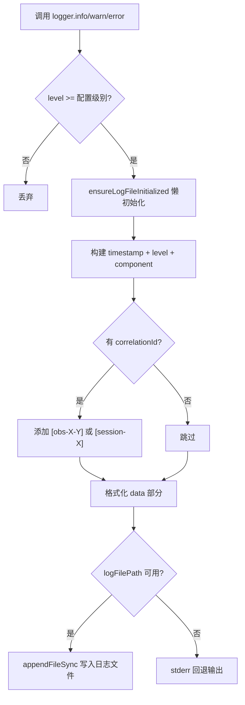
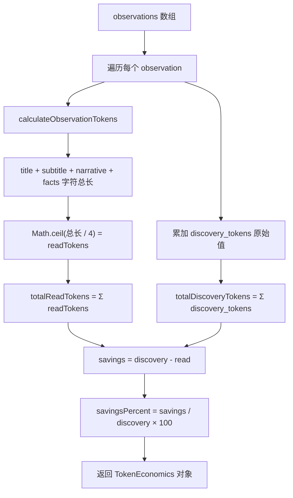
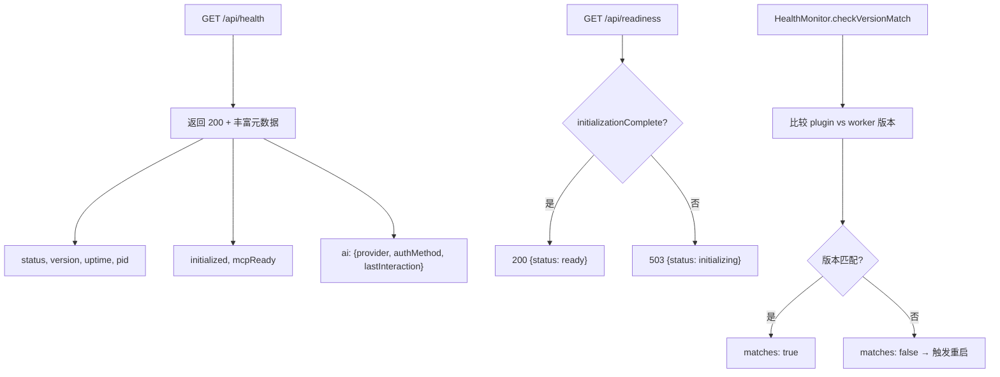

# PD-11.10 claude-mem — 结构化日志单例 + Token 经济学 + 运行时健康监控

> 文档编号：PD-11.10
> 来源：claude-mem `src/utils/logger.ts` `src/services/context/TokenCalculator.ts` `src/services/infrastructure/HealthMonitor.ts`
> GitHub：https://github.com/thedotmack/claude-mem.git
> 问题域：PD-11 可观测性 Observability & Cost Tracking
> 状态：可复用方案

---

## 第 1 章 问题与动机

### 1.1 核心问题

claude-mem 是一个 Claude Code 的记忆持久化插件，以后台 Worker 守护进程形式运行。它面临三个可观测性挑战：

1. **后台进程不可见**：Worker 以 daemon 模式运行，没有 TTY 输出，传统 console.log 完全无效。需要文件级结构化日志才能排查问题。
2. **Token 成本不透明**：每次 observation 的"发现成本"（discovery_tokens）与"读取成本"（read tokens）之间的差异是记忆系统的核心价值指标——用户花了多少 token 做研究，复用时只需多少 token 就能获取同等知识。
3. **僵尸进程与健康监控**：Worker 管理多个 Claude SDK 子进程，子进程可能不正常退出导致僵尸进程累积（用户报告 155 个进程 / 51GB RAM），需要进程级健康监控和自动清理。

### 1.2 claude-mem 的解法概述

1. **Logger 单例 + 组件分类**：全局 Logger 单例支持 14 种组件标签（HOOK/WORKER/SDK/DB/SESSION/QUEUE 等），4 级日志（DEBUG/INFO/WARN/ERROR），按日期轮转写入 `~/.claude-mem/logs/` 目录（`src/utils/logger.ts:31-301`）
2. **Correlation ID 数据流追踪**：通过 `obs-{sessionId}-{observationNum}` 和 `session-{sessionId}` 两种 correlation ID 格式追踪数据在 Hook → Worker → DB 管道中的流转（`src/utils/logger.ts:98-107`）
3. **Token 经济学计算**：TokenCalculator 计算每个 observation 的 read tokens（字符数/4 估算）和 discovery tokens（原始研究成本），计算压缩节省率，在 context 注入时展示给用户（`src/services/context/TokenCalculator.ts:14-48`）
4. **HTTP 健康端点**：Server 暴露 `/api/health`（存活检查）和 `/api/readiness`（就绪检查）两个端点，health 返回 uptime/version/AI 状态/初始化状态等丰富元数据（`src/services/server/Server.ts:162-191`）
5. **进程注册表 + 孤儿收割器**：ProcessRegistry 追踪所有 SDK 子进程 PID，5 分钟定时收割孤儿进程，支持 SIGKILL 升级（`src/services/worker/ProcessRegistry.ts:38-411`）

### 1.3 设计思想

| 设计原则 | 具体实现 | 理由 | 替代方案 |
|----------|----------|------|----------|
| 单例 + 懒初始化 | Logger 构造时不读配置，首次 log 时才初始化文件路径和日志级别 | 避免与 SettingsDefaultsManager 的循环依赖 | 依赖注入（增加复杂度） |
| 组件标签而非模块路径 | 14 种固定 Component 类型（HOOK/WORKER/SDK 等） | 日志按功能域分类比按文件路径更有意义 | 自动提取 caller 文件名（不稳定） |
| 字符估算而非精确计数 | `CHARS_PER_TOKEN_ESTIMATE = 4`，即 4 字符 ≈ 1 token | 记忆系统不需要精确 token 数，只需展示经济学趋势 | tiktoken 精确计数（增加依赖） |
| 双端点健康检查 | health（HTTP 可达即返回）vs readiness（DB+搜索初始化完成才返回） | 区分"进程活着"和"服务可用"两种状态 | 单一 health 端点（无法区分启动中） |
| 事件驱动进程追踪 | ProcessRegistry 用 Map 追踪 PID，子进程 exit 事件自动注销 | 比轮询 ps 更高效，实时感知进程退出 | 定时 ps 扫描（延迟高、CPU 开销大） |

---

## 第 2 章 源码实现分析

### 2.1 架构概览

claude-mem 的可观测性分为三层：日志层、经济学层、健康层。

```
┌─────────────────────────────────────────────────────────┐
│                    可观测性架构                           │
├─────────────────────────────────────────────────────────┤
│                                                         │
│  ┌──────────┐   ┌──────────────┐   ┌────────────────┐  │
│  │  Logger   │   │ TokenCalc    │   │ HealthMonitor  │  │
│  │ (单例)    │   │ (纯函数)     │   │ (HTTP 端点)    │  │
│  ├──────────┤   ├──────────────┤   ├────────────────┤  │
│  │ 4 级别    │   │ read tokens  │   │ /api/health    │  │
│  │ 14 组件   │   │ discovery    │   │ /api/readiness │  │
│  │ 文件轮转  │   │ savings %    │   │ /api/version   │  │
│  │ corr ID   │   │ economics    │   │ version check  │  │
│  └────┬─────┘   └──────┬───────┘   └───────┬────────┘  │
│       │                │                    │           │
│       ▼                ▼                    ▼           │
│  ~/.claude-mem/    Context 注入         端口轮询         │
│  logs/日期.log     (Markdown/Color)    (500ms 间隔)     │
│                                                         │
│  ┌──────────────────────────────────────────────────┐   │
│  │           ProcessRegistry (进程追踪)              │   │
│  │  Map<PID, {sessionDbId, spawnedAt, process}>     │   │
│  │  + 5min 孤儿收割器 + SIGKILL 升级                 │   │
│  └──────────────────────────────────────────────────┘   │
└─────────────────────────────────────────────────────────┘
```

### 2.2 核心实现

#### 2.2.1 Logger 单例：组件分类 + Correlation ID



对应源码 `src/utils/logger.ts:236-301`：

```typescript
private log(
  level: LogLevel,
  component: Component,
  message: string,
  context?: LogContext,
  data?: any
): void {
  if (level < this.getLevel()) return;

  this.ensureLogFileInitialized();

  const timestamp = this.formatTimestamp(new Date());
  const levelStr = LogLevel[level].padEnd(5);
  const componentStr = component.padEnd(6);

  let correlationStr = '';
  if (context?.correlationId) {
    correlationStr = `[${context.correlationId}] `;
  } else if (context?.sessionId) {
    correlationStr = `[session-${context.sessionId}] `;
  }

  // ... data formatting ...

  const logLine = `[${timestamp}] [${levelStr}] [${componentStr}] ${correlationStr}${message}${contextStr}${dataStr}`;

  if (this.logFilePath) {
    try {
      appendFileSync(this.logFilePath, logLine + '\n', 'utf8');
    } catch (error) {
      process.stderr.write(`[LOGGER] Failed to write to log file: ${error}\n`);
    }
  } else {
    process.stderr.write(logLine + '\n');
  }
}
```

日志输出格式示例：
```
[2025-01-15 14:23:45.123] [INFO ] [HOOK  ] [obs-42-3] → PostToolUse: Read(src/main.ts)
[2025-01-15 14:23:45.456] [DEBUG] [DB    ] [session-42] Observation stored {id=127}
[2025-01-15 14:23:46.789] [WARN ] [SYSTEM] [HAPPY-PATH] Missing narrative field {location=ObservationCompiler.ts:89}
```

#### 2.2.2 Token 经济学计算



对应源码 `src/services/context/TokenCalculator.ts:14-48`：

```typescript
export function calculateObservationTokens(obs: Observation): number {
  const obsSize = (obs.title?.length || 0) +
                  (obs.subtitle?.length || 0) +
                  (obs.narrative?.length || 0) +
                  JSON.stringify(obs.facts || []).length;
  return Math.ceil(obsSize / CHARS_PER_TOKEN_ESTIMATE);
}

export function calculateTokenEconomics(observations: Observation[]): TokenEconomics {
  const totalObservations = observations.length;
  const totalReadTokens = observations.reduce((sum, obs) => {
    return sum + calculateObservationTokens(obs);
  }, 0);
  const totalDiscoveryTokens = observations.reduce((sum, obs) => {
    return sum + (obs.discovery_tokens || 0);
  }, 0);
  const savings = totalDiscoveryTokens - totalReadTokens;
  const savingsPercent = totalDiscoveryTokens > 0
    ? Math.round((savings / totalDiscoveryTokens) * 100)
    : 0;
  return { totalObservations, totalReadTokens, totalDiscoveryTokens, savings, savingsPercent };
}
```

经济学展示在 context 注入时呈现（`src/services/context/formatters/MarkdownFormatter.ts:85-109`）：
```
**Context Economics**:
- Loading: 47 observations (2,340 tokens to read)
- Work investment: 156,000 tokens spent on research, building, and decisions
- Your savings: 153,660 tokens (98% reduction from reuse)
```

#### 2.2.3 健康端点与版本检测



对应源码 `src/services/server/Server.ts:162-176`：

```typescript
this.app.get('/api/health', (_req: Request, res: Response) => {
  res.status(200).json({
    status: 'ok',
    version: BUILT_IN_VERSION,
    workerPath: this.options.workerPath,
    uptime: Date.now() - this.startTime,
    managed: process.env.CLAUDE_MEM_MANAGED === 'true',
    hasIpc: typeof process.send === 'function',
    platform: process.platform,
    pid: process.pid,
    initialized: this.options.getInitializationComplete(),
    mcpReady: this.options.getMcpReady(),
    ai: this.options.getAiStatus(),
  });
});
```

版本不匹配检测（`src/services/infrastructure/HealthMonitor.ts:164-174`）：当插件更新但 Worker 仍运行旧版本时，`checkVersionMatch()` 返回 `matches: false`，触发 Worker 重启。对 `unknown` 版本采用优雅降级（假设匹配），避免竞态条件下的误重启。

### 2.3 实现细节

**数据流追踪语义方法**：Logger 提供 `dataIn`/`dataOut`/`success`/`failure`/`timing` 等语义化方法（`src/utils/logger.ts:323-353`），用箭头符号（→/←/✓/✗/⏱）标记数据流方向，比纯 info/warn 更易于 grep 过滤。

**Happy Path Error 模式**：`happyPathError()` 方法（`src/utils/logger.ts:377-405`）是一个独特设计——当预期的"快乐路径"失败但有回退值时使用。它自动捕获调用栈获取 caller 位置，记录为 WARN 级别并返回 fallback 值。这避免了大量 `if (!x) { logger.warn(...); return default; }` 的样板代码。

**工具名格式化**：`formatTool()` 方法（`src/utils/logger.ts:148-217`）为 20+ 种工具类型提供紧凑的日志显示格式，如 `Read(src/main.ts)`、`Bash(npm install)`、`Task(Explore)`，而非打印完整的 JSON 输入。

**进程注册表与孤儿收割**：ProcessRegistry（`src/services/worker/ProcessRegistry.ts:33-411`）用 `Map<PID, TrackedProcess>` 追踪所有 SDK 子进程。子进程 exit 事件自动注销。5 分钟定时收割器执行三层清理：(1) 注册表中 session 已死的进程，(2) ppid=1 的系统孤儿，(3) CPU 为 0 且运行超 2 分钟的空闲 daemon 子进程。

**队列空闲超时**：SessionQueueProcessor（`src/services/queue/SessionQueueProcessor.ts:32-74`）在队列空闲 3 分钟后触发 abort 回调杀死 SDK 子进程，防止子进程在无消息时永远存活。

---

## 第 3 章 迁移指南

### 3.1 迁移清单

**阶段 1：结构化日志（1 个文件）**
- [ ] 创建 Logger 单例，支持 DEBUG/INFO/WARN/ERROR 四级别
- [ ] 定义项目特有的 Component 类型枚举
- [ ] 实现按日期轮转的文件日志（`appendFileSync`）
- [ ] 添加 correlation ID 支持（session 级 + 操作级）
- [ ] 实现 `dataIn`/`dataOut`/`success`/`failure`/`timing` 语义方法

**阶段 2：Token 经济学（2 个文件）**
- [ ] 定义 TokenEconomics 接口（readTokens/discoveryTokens/savings/savingsPercent）
- [ ] 实现字符估算函数（`CHARS_PER_TOKEN_ESTIMATE = 4`）
- [ ] 在 context 注入时计算并展示经济学数据

**阶段 3：健康监控（3 个文件）**
- [ ] 实现 `/api/health` 端点（存活检查，返回丰富元数据）
- [ ] 实现 `/api/readiness` 端点（就绪检查，503 直到初始化完成）
- [ ] 实现版本不匹配检测（plugin vs worker 版本比较）
- [ ] 实现进程注册表 + 定时孤儿收割器

### 3.2 适配代码模板

#### 模板 1：结构化 Logger 单例（TypeScript）

```typescript
import { appendFileSync, existsSync, mkdirSync } from 'fs';
import { join } from 'path';

export enum LogLevel {
  DEBUG = 0, INFO = 1, WARN = 2, ERROR = 3, SILENT = 4
}

// 根据项目需要定义组件类型
export type Component = 'API' | 'WORKER' | 'DB' | 'AGENT' | 'SYSTEM';

interface LogContext {
  correlationId?: string;
  sessionId?: string;
  [key: string]: any;
}

class Logger {
  private level: LogLevel = LogLevel.INFO;
  private logDir: string;
  private logFilePath: string | null = null;

  constructor(logDir: string) {
    this.logDir = logDir;
  }

  private ensureLogFile(): string {
    if (!this.logFilePath) {
      if (!existsSync(this.logDir)) mkdirSync(this.logDir, { recursive: true });
      const date = new Date().toISOString().split('T')[0];
      this.logFilePath = join(this.logDir, `app-${date}.log`);
    }
    return this.logFilePath;
  }

  private log(level: LogLevel, component: Component, message: string, ctx?: LogContext, data?: any): void {
    if (level < this.level) return;
    const ts = new Date().toISOString();
    const corrStr = ctx?.correlationId ? `[${ctx.correlationId}] ` : '';
    const dataStr = data ? ` ${JSON.stringify(data)}` : '';
    const line = `[${ts}] [${LogLevel[level].padEnd(5)}] [${component.padEnd(6)}] ${corrStr}${message}${dataStr}\n`;
    try {
      appendFileSync(this.ensureLogFile(), line, 'utf8');
    } catch {
      process.stderr.write(line);
    }
  }

  info(c: Component, msg: string, ctx?: LogContext, data?: any) { this.log(LogLevel.INFO, c, msg, ctx, data); }
  warn(c: Component, msg: string, ctx?: LogContext, data?: any) { this.log(LogLevel.WARN, c, msg, ctx, data); }
  error(c: Component, msg: string, ctx?: LogContext, data?: any) { this.log(LogLevel.ERROR, c, msg, ctx, data); }
  debug(c: Component, msg: string, ctx?: LogContext, data?: any) { this.log(LogLevel.DEBUG, c, msg, ctx, data); }

  // 语义化数据流方法
  dataIn(c: Component, msg: string, ctx?: LogContext, data?: any) { this.info(c, `→ ${msg}`, ctx, data); }
  dataOut(c: Component, msg: string, ctx?: LogContext, data?: any) { this.info(c, `← ${msg}`, ctx, data); }
  timing(c: Component, msg: string, ms: number, ctx?: LogContext) { this.info(c, `⏱ ${msg}`, ctx, { duration: `${ms}ms` }); }

  setLevel(level: LogLevel) { this.level = level; }
}

export const logger = new Logger('/tmp/my-app/logs');
```

#### 模板 2：Token 经济学计算器

```typescript
const CHARS_PER_TOKEN = 4;

interface TokenEconomics {
  totalItems: number;
  readTokens: number;       // 读取压缩后内容的 token 成本
  discoveryTokens: number;  // 原始研究/生成的 token 成本
  savings: number;           // discoveryTokens - readTokens
  savingsPercent: number;    // savings / discoveryTokens * 100
}

function estimateTokens(text: string): number {
  return Math.ceil(text.length / CHARS_PER_TOKEN);
}

function calculateEconomics(items: Array<{ content: string; originalCost: number }>): TokenEconomics {
  const readTokens = items.reduce((sum, item) => sum + estimateTokens(item.content), 0);
  const discoveryTokens = items.reduce((sum, item) => sum + item.originalCost, 0);
  const savings = discoveryTokens - readTokens;
  return {
    totalItems: items.length,
    readTokens,
    discoveryTokens,
    savings,
    savingsPercent: discoveryTokens > 0 ? Math.round((savings / discoveryTokens) * 100) : 0,
  };
}
```

#### 模板 3：双端点健康检查

```typescript
import express from 'express';

function setupHealthRoutes(app: express.Application, opts: {
  getReady: () => boolean;
  version: string;
  startTime: number;
}) {
  // 存活检查：HTTP 可达即返回
  app.get('/api/health', (_req, res) => {
    res.json({
      status: 'ok',
      version: opts.version,
      uptime: Date.now() - opts.startTime,
      pid: process.pid,
      platform: process.platform,
    });
  });

  // 就绪检查：初始化完成才返回 200
  app.get('/api/readiness', (_req, res) => {
    if (opts.getReady()) {
      res.json({ status: 'ready' });
    } else {
      res.status(503).json({ status: 'initializing' });
    }
  });
}
```

### 3.3 适用场景

| 场景 | 适用度 | 说明 |
|------|--------|------|
| 后台 Worker/Daemon 服务 | ⭐⭐⭐ | 无 TTY 环境下文件日志是唯一选择 |
| 记忆/知识库系统 | ⭐⭐⭐ | Token 经济学直接展示记忆复用价值 |
| 多子进程 Agent 系统 | ⭐⭐⭐ | ProcessRegistry + 孤儿收割器防止资源泄漏 |
| 单进程 CLI 工具 | ⭐⭐ | 日志部分有用，健康端点和进程追踪不需要 |
| 高精度计费系统 | ⭐ | 字符估算误差约 20-30%，不适合精确计费 |

---

## 第 4 章 测试用例

```typescript
import { describe, it, expect, vi, beforeEach } from 'vitest';

// ---- TokenCalculator 测试 ----

const CHARS_PER_TOKEN_ESTIMATE = 4;

interface Observation {
  title: string | null;
  subtitle: string | null;
  narrative: string | null;
  facts: string | null;
  discovery_tokens: number | null;
  type: string;
}

function calculateObservationTokens(obs: Observation): number {
  const obsSize = (obs.title?.length || 0) +
                  (obs.subtitle?.length || 0) +
                  (obs.narrative?.length || 0) +
                  JSON.stringify(obs.facts || []).length;
  return Math.ceil(obsSize / CHARS_PER_TOKEN_ESTIMATE);
}

function calculateTokenEconomics(observations: Observation[]) {
  const totalReadTokens = observations.reduce((sum, obs) => sum + calculateObservationTokens(obs), 0);
  const totalDiscoveryTokens = observations.reduce((sum, obs) => sum + (obs.discovery_tokens || 0), 0);
  const savings = totalDiscoveryTokens - totalReadTokens;
  const savingsPercent = totalDiscoveryTokens > 0 ? Math.round((savings / totalDiscoveryTokens) * 100) : 0;
  return { totalObservations: observations.length, totalReadTokens, totalDiscoveryTokens, savings, savingsPercent };
}

describe('TokenCalculator', () => {
  it('should estimate tokens from character count', () => {
    const obs: Observation = {
      title: 'Test Title',       // 10 chars
      subtitle: 'Sub',           // 3 chars
      narrative: 'A'.repeat(100), // 100 chars
      facts: null,               // "[]" = 2 chars
      discovery_tokens: 500,
      type: 'research'
    };
    // (10 + 3 + 100 + 2) / 4 = 28.75 → ceil = 29
    expect(calculateObservationTokens(obs)).toBe(29);
  });

  it('should handle null fields gracefully', () => {
    const obs: Observation = {
      title: null, subtitle: null, narrative: null, facts: null,
      discovery_tokens: null, type: 'note'
    };
    // Only "[]" from JSON.stringify(null || []) = 2 chars → ceil(2/4) = 1
    expect(calculateObservationTokens(obs)).toBe(1);
  });

  it('should calculate savings percentage correctly', () => {
    const observations: Observation[] = [
      { title: 'A'.repeat(40), subtitle: null, narrative: 'B'.repeat(360), facts: null, discovery_tokens: 5000, type: 'research' },
      { title: 'C'.repeat(40), subtitle: null, narrative: 'D'.repeat(360), facts: null, discovery_tokens: 3000, type: 'decision' },
    ];
    const economics = calculateTokenEconomics(observations);
    expect(economics.totalObservations).toBe(2);
    expect(economics.totalDiscoveryTokens).toBe(8000);
    // Each obs: (40 + 360 + 2) / 4 = 100.5 → 101 tokens
    expect(economics.totalReadTokens).toBe(202);
    expect(economics.savings).toBe(7798);
    expect(economics.savingsPercent).toBe(97); // 7798/8000 = 97.475% → round = 97
  });

  it('should return 0% savings when no discovery tokens', () => {
    const observations: Observation[] = [
      { title: 'Test', subtitle: null, narrative: null, facts: null, discovery_tokens: 0, type: 'note' },
    ];
    const economics = calculateTokenEconomics(observations);
    expect(economics.savingsPercent).toBe(0);
  });
});

// ---- Logger correlation ID 测试 ----

describe('Logger correlation ID', () => {
  it('should generate observation correlation ID', () => {
    const corrId = `obs-${42}-${3}`;
    expect(corrId).toBe('obs-42-3');
  });

  it('should generate session correlation ID', () => {
    const sessId = `session-${42}`;
    expect(sessId).toBe('session-42');
  });
});

// ---- HealthMonitor 版本检测测试 ----

describe('HealthMonitor version check', () => {
  it('should detect version mismatch', () => {
    const pluginVersion = '10.3.0';
    const workerVersion = '10.2.0';
    const matches = pluginVersion === workerVersion;
    expect(matches).toBe(false);
  });

  it('should gracefully degrade on unknown version', () => {
    const pluginVersion = 'unknown';
    const workerVersion = '10.3.0';
    // 当任一版本未知时，假设匹配（优雅降级）
    const matches = !workerVersion || pluginVersion === 'unknown' ? true : pluginVersion === workerVersion;
    expect(matches).toBe(true);
  });
});
```

---

## 第 5 章 跨域关联

| 关联域 | 关系类型 | 说明 |
|--------|----------|------|
| PD-01 上下文管理 | 协同 | Token 经济学直接服务于上下文窗口管理——通过展示 read tokens vs discovery tokens 的压缩比，帮助用户理解记忆系统的上下文节省效果 |
| PD-03 容错与重试 | 协同 | Logger 的 `happyPathError()` 模式是一种轻量级容错机制——记录异常但返回 fallback 值继续执行，避免非关键路径的错误中断主流程 |
| PD-05 沙箱隔离 | 依赖 | ProcessRegistry 和孤儿收割器是进程级隔离的运维保障——确保 SDK 子进程不会逃逸成僵尸进程消耗系统资源 |
| PD-06 记忆持久化 | 协同 | observation 的 `discovery_tokens` 字段在记忆写入时记录，在可观测性层计算经济学——两个域共享同一数据模型 |
| PD-09 Human-in-the-Loop | 协同 | Context Economics 展示在 context 注入中，让人类用户直观看到记忆复用的价值，辅助决策是否需要重新研究 |

---

## 第 6 章 来源文件索引

| 文件 | 行范围 | 关键实现 |
|------|--------|----------|
| `src/utils/logger.ts` | L1-L409 | Logger 单例：4 级别、14 组件、correlation ID、语义方法、happyPathError |
| `src/services/context/TokenCalculator.ts` | L1-L79 | Token 经济学：字符估算、read/discovery 计算、savings 百分比 |
| `src/services/context/types.ts` | L99-L107 | TokenEconomics 接口定义 |
| `src/services/context/formatters/MarkdownFormatter.ts` | L85-L109 | 经济学 Markdown 展示格式 |
| `src/services/context/sections/FooterRenderer.ts` | L28-L42 | Footer 渲染：savings 展示门控逻辑 |
| `src/services/infrastructure/HealthMonitor.ts` | L1-L175 | 健康检查：端口探测、存活/就绪轮询、版本不匹配检测 |
| `src/services/server/Server.ts` | L160-L191 | HTTP 健康端点：/api/health、/api/readiness、/api/version |
| `src/services/worker/ProcessRegistry.ts` | L1-L411 | 进程注册表：PID 追踪、孤儿收割、SIGKILL 升级、池化等待 |
| `src/services/queue/SessionQueueProcessor.ts` | L32-L74 | 队列空闲超时：3 分钟无消息触发 abort 杀子进程 |
| `src/services/infrastructure/GracefulShutdown.ts` | L57-L105 | 7 步优雅关闭：HTTP → Session → MCP → Chroma → DB → 子进程清理 |
| `src/services/infrastructure/ProcessManager.ts` | L312-L429 | 跨 session 孤儿清理：启动时按进程年龄清理残留进程 |
| `src/cli/handlers/observation.ts` | L16-L81 | Hook 端日志：dataIn 记录工具调用、warn 记录存储失败 |

---

## 第 7 章 横向对比维度

```json comparison_data
{
  "project": "claude-mem",
  "dimensions": {
    "追踪方式": "Logger 单例 + 14 组件标签 + correlation ID 数据流追踪",
    "数据粒度": "observation 级：每个 observation 的 read/discovery tokens",
    "持久化": "按日期轮转文件日志（appendFileSync），~/.claude-mem/logs/",
    "多提供商": "不涉及（专为 Claude SDK 设计，单提供商）",
    "日志格式": "[timestamp] [LEVEL] [COMPONENT] [corrId] message {context} data",
    "指标采集": "Token 经济学（read/discovery/savings%）+ 进程池活跃数",
    "可视化": "Context 注入时 Markdown/ANSI 双格式展示经济学数据",
    "成本追踪": "字符估算（4 chars/token）计算 read 成本，discovery_tokens 记录原始成本",
    "日志级别": "DEBUG/INFO/WARN/ERROR/SILENT 五级，配置文件驱动",
    "崩溃安全": "appendFileSync 同步写入 + stderr 回退 + happyPathError 优雅降级",
    "卡死检测": "队列 3 分钟空闲超时 abort + 5 分钟孤儿收割器 + 版本不匹配重启",
    "Worker日志隔离": "单 Worker 守护进程，子进程 stderr 通过 ProcessRegistry 捕获",
    "健康端点": "双端点：/api/health（存活）+ /api/readiness（就绪，503 直到初始化完成）",
    "进程级监控": "ProcessRegistry Map 追踪 PID + 三层孤儿收割（注册表/系统/空闲）"
  }
}
```

### 域元数据补充

```json domain_metadata
{
  "solution_summary": "claude-mem 用 Logger 单例（14 组件标签 + correlation ID）+ Token 经济学（read/discovery 压缩比）+ ProcessRegistry 三层孤儿收割实现后台 Worker 全链路可观测",
  "description": "后台守护进程的文件日志与进程级健康监控，无 TTY 环境下的可观测性保障",
  "sub_problems": [
    "Happy Path Error 模式：预期路径失败时记录 WARN 并返回 fallback，减少样板代码",
    "Token 经济学展示：向用户展示记忆复用的 token 节省比例，量化知识库价值",
    "双端点健康检查：区分进程存活（health）和服务就绪（readiness）两种状态",
    "版本不匹配检测：插件更新后检测 Worker 版本滞后并触发自动重启"
  ],
  "best_practices": [
    "Logger 懒初始化避免循环依赖：构造时不读配置，首次 log 时才初始化文件路径",
    "语义化日志方法（dataIn/dataOut/success/failure/timing）比纯级别更易 grep 过滤",
    "appendFileSync 同步写入保证崩溃前日志不丢失，stderr 作为最后回退",
    "进程注册表用事件驱动（exit 回调）而非轮询，实时感知子进程退出"
  ]
}
```
