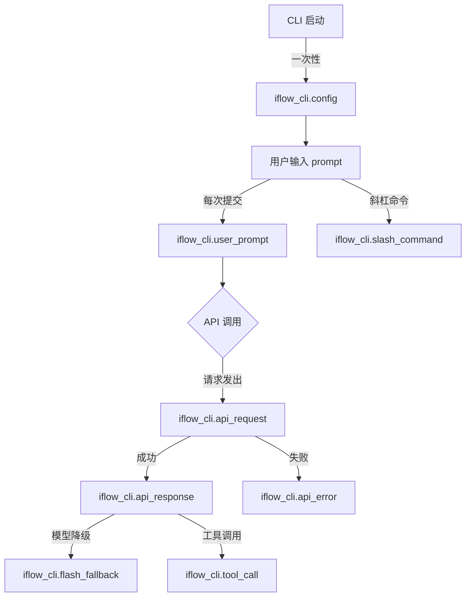
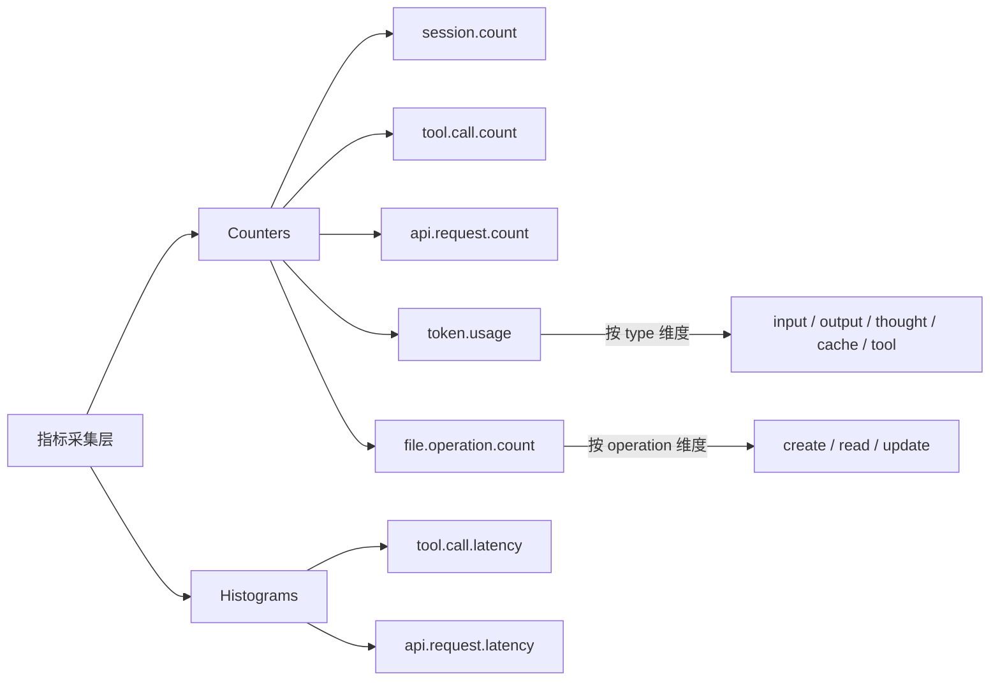
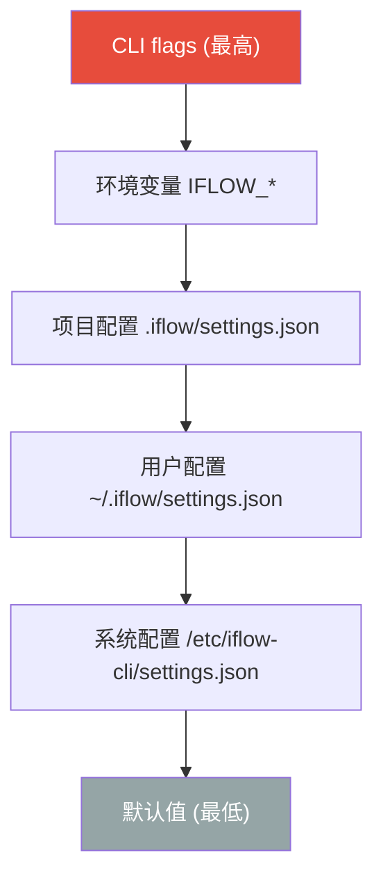

# PD-11.XX iflow-cli — OTel 三支柱 CLI 可观测性

> 文档编号：PD-11.XX
> 来源：iflow-cli `docs_en/features/telemetry.md`, `docs_en/configuration/settings.md`
> GitHub：https://github.com/iflow-ai/iflow-cli.git
> 问题域：PD-11 可观测性 Observability & Cost Tracking
> 状态：可复用方案

---

## 第 1 章 问题与动机

### 1.1 核心问题

CLI 工具的可观测性面临独特挑战：与长驻服务不同，CLI 进程生命周期短暂（秒到分钟级），必须在进程退出前完成所有遥测数据的推送。同时，大多数用户不需要可观测性，不能因 OTel SDK 初始化拖慢命令执行——这要求"零开销默认关闭"的设计。

iFlow CLI 作为一个集成多 AI 模型（Kimi K2、Qwen3 Coder、DeepSeek v3 等）的终端智能工具，需要追踪：
- LLM API 调用的延迟和 token 消耗（按 5 种类型：input/output/thought/cache/tool）
- 工具调用的频率、延迟和成功率
- 文件操作的类型和规模
- 会话级别的整体性能画像
- 模型降级事件（flash_fallback）

核心矛盾：CLI 用户期望即时响应，但运维/团队需要深度可观测性。iFlow 的解法是基于 OpenTelemetry 标准实现完整三支柱（traces/metrics/logs），同时通过异步处理和默认关闭确保零性能影响。

### 1.2 iflow-cli 的解法概述

1. **OTel 标准化协议**：基于 OpenTelemetry SDK 实现，兼容 Jaeger、GCP Cloud Trace、AWS X-Ray、Azure Application Insights 等所有主流后端（`docs_en/features/telemetry.md:20-26`）
2. **三支柱完整覆盖**：8 种结构化日志事件 + 6 种聚合指标 + 分布式追踪，覆盖从用户输入到 API 响应的完整链路（`docs_en/features/telemetry.md:156-265`）
3. **五层配置优先级**：CLI flags > 环境变量 > 项目配置 > 用户配置 > 默认值，支持从个人开发到团队协作的全场景（`docs_en/features/telemetry.md:51-59`）
4. **隐私优先设计**：prompt 内容记录可独立开关（`--telemetry-log-prompts`），路径信息自动哈希，敏感参数自动过滤（`docs_en/features/telemetry.md:456-467`）
5. **一键本地部署**：`npm run telemetry -- --target=local` 自动下载 Jaeger + OTEL Collector，配置 settings.json，退出时自动清理（`docs_en/features/telemetry.md:122-148`）

### 1.3 设计思想

| 设计原则 | 具体实现 | 理由 | 替代方案 |
|----------|----------|------|----------|
| 零开销默认关闭 | `telemetry.enabled` 默认 `false`，不初始化 OTel SDK | CLI 用户多数不需要监控，不能拖慢启动 | 始终初始化但采样率为 0（仍有 SDK 开销） |
| OTel 标准协议 | OTLP/gRPC 导出，兼容所有 OTel 后端 | 避免供应商锁定，一次集成多处可用 | 自定义协议（需为每个后端写适配器） |
| 五层配置优先级 | CLI flags > env > project > user > defaults | 团队统一配置 + 个人临时覆盖 | 单一配置文件（无法区分场景） |
| 隐私可控 | prompt 记录独立开关 `logPrompts` | 调试时需要 prompt，生产环境需要隐私 | 全记录或全不记录（不够灵活） |
| Token 五类型分计 | input/output/thought/cache/tool 独立计数 | 不同类型计费规则不同，混合统计无法做成本分析 | 只统计 total tokens（丢失成本归因能力） |
| 异步处理 | 遥测数据异步发送，不阻塞 CLI 主流程 | CLI 响应速度优先 | 同步发送（增加用户感知延迟） |

---

## 第 2 章 源码实现分析

### 2.1 架构概览

iFlow CLI 的可观测性架构基于 OpenTelemetry 三支柱模型，数据从 CLI 操作层采集，经 OTel SDK 处理后输出到多种后端：

```
┌─────────────────────────────────────────────────────────────────┐
│                        iFlow CLI 进程                           │
│                                                                 │
│  ┌──────────┐  ┌──────────┐  ┌──────────┐  ┌──────────────┐   │
│  │ 用户输入  │  │ API 调用  │  │ 工具调用  │  │  文件操作     │   │
│  └────┬─────┘  └────┬─────┘  └────┬─────┘  └──────┬───────┘   │
│       │              │              │               │           │
│       ▼              ▼              ▼               ▼           │
│  ┌─────────────────────────────────────────────────────────┐   │
│  │              OpenTelemetry SDK (异步)                     │   │
│  │  ┌─────────┐  ┌──────────┐  ┌──────────────────────┐   │   │
│  │  │ Traces  │  │ Metrics  │  │ Logs (8 event types) │   │   │
│  │  └────┬────┘  └────┬─────┘  └──────────┬───────────┘   │   │
│  └───────┼─────────────┼──────────────────┼────────────────┘   │
│          │             │                  │                     │
│          ▼             ▼                  ▼                     │
│  ┌─────────────────────────────────────────────────────────┐   │
│  │           OTLP/gRPC Exporter + File Exporter            │   │
│  └─────────────────────────┬───────────────────────────────┘   │
└────────────────────────────┼───────────────────────────────────┘
                             │
              ┌──────────────┼──────────────┐
              ▼              ▼              ▼
     ┌──────────────┐ ┌──────────┐ ┌──────────────┐
     │ OTEL Collector│ │ 本地文件  │ │  云平台       │
     │  → Jaeger UI  │ │ (.json)  │ │ GCP/AWS/Azure│
     └──────────────┘ └──────────┘ └──────────────┘
```

所有日志和指标共享 `sessionId` 作为公共标识属性（`docs_en/features/telemetry.md:154`），实现单次会话内的全链路关联。

### 2.2 核心实现

#### 2.2.1 结构化日志事件体系

iFlow 定义了 8 种结构化日志事件，覆盖 CLI 生命周期的关键节点：



对应的日志事件定义（`docs_en/features/telemetry.md:160-226`）：

```typescript
// iflow_cli.config — 启动时一次性记录 CLI 配置快照
interface ConfigLog {
  model: string;                              // 当前模型名
  embedding_model: string;                    // 嵌入模型
  sandbox_enabled: boolean;                   // 沙箱状态
  core_tools_enabled: string;                 // 启用的核心工具列表
  approval_mode: string;                      // 审批模式
  api_key_enabled: boolean;                   // API Key 是否配置
  vertex_ai_enabled: boolean;                 // Vertex AI 状态
  code_assist_enabled: boolean;               // 代码辅助状态
  log_prompts_enabled: boolean;               // prompt 记录开关
  file_filtering_respect_git_ignore: boolean; // gitignore 过滤
  debug_mode: boolean;                        // 调试模式
  mcp_servers: string;                        // MCP 服务器列表
}

// iflow_cli.api_response — API 响应，含 5 类 token 计数
interface ApiResponseLog {
  model: string;
  status_code: number;
  duration_ms: number;
  error?: string;
  input_token_count: number;           // 输入 token
  output_token_count: number;          // 输出 token
  cached_content_token_count: number;  // 缓存命中 token
  thoughts_token_count: number;        // 思考链 token
  tool_token_count: number;            // 工具调用 token
  response_text?: string;              // 响应文本（受 logPrompts 控制）
  auth_type: string;
}

// iflow_cli.tool_call — 工具调用事件
interface ToolCallLog {
  function_name: string;
  function_args: string;
  duration_ms: number;
  success: boolean;
  decision: 'accept' | 'reject' | 'modify';  // 用户审批决策
  error?: string;
  error_type?: string;
}
```

#### 2.2.2 六维聚合指标体系



对应的指标定义（`docs_en/features/telemetry.md:230-265`）：

```typescript
// 6 种 OTel 指标定义
const metrics = {
  // Counter 类型 — 累积计数
  'iflow_cli.session.count':        { type: 'counter',   attrs: [] },
  'iflow_cli.tool.call.count':      { type: 'counter',   attrs: ['function_name', 'success', 'decision'] },
  'iflow_cli.api.request.count':    { type: 'counter',   attrs: ['model', 'status_code', 'error_type'] },
  'iflow_cli.token.usage':          { type: 'counter',   attrs: ['model', 'type'] },
  // type ∈ {"input", "output", "thought", "cache", "tool"}
  'iflow_cli.file.operation.count': { type: 'counter',   attrs: ['operation', 'lines', 'mimetype', 'extension'] },
  // operation ∈ {"create", "read", "update"}

  // Histogram 类型 — 延迟分布
  'iflow_cli.tool.call.latency':    { type: 'histogram', attrs: ['function_name', 'decision'] },
  'iflow_cli.api.request.latency':  { type: 'histogram', attrs: ['model'] },
};
```

#### 2.2.3 五层配置优先级系统



配置项与 CLI flags 的映射（`docs_en/features/telemetry.md:62-69` + `docs_en/configuration/settings.md:373-389`）：

```typescript
// settings.json 中的 telemetry 配置块
interface TelemetryConfig {
  enabled: boolean;        // 默认 false — 零开销关闭
  target: 'local' | 'gcp'; // 输出目标
  otlpEndpoint: string;    // 默认 http://localhost:4317
  logPrompts: boolean;     // 默认 true — prompt 记录开关
  outputFile?: string;     // 文件导出路径
}

// CLI flags 覆盖映射
// --telemetry              → telemetry.enabled = true
// --no-telemetry           → telemetry.enabled = false
// --telemetry-target       → telemetry.target
// --telemetry-otlp-endpoint → telemetry.otlpEndpoint
// --telemetry-outfile      → telemetry.outputFile
// --telemetry-log-prompts  → telemetry.logPrompts

// 环境变量支持 4 种命名风格（按优先级）：
// 1. IFLOW_telemetry (IFLOW_ + camelCase)
// 2. IFLOW_TELEMETRY (IFLOW_ + UPPER_SNAKE)
// 3. iflow_telemetry (iflow_ + camelCase)
// 4. iflow_TELEMETRY (iflow_ + UPPER_SNAKE)
// 以及标准 OTel 变量：OTEL_EXPORTER_OTLP_ENDPOINT
```

### 2.3 实现细节

#### 一键本地部署流水线

`npm run telemetry -- --target=local` 脚本自动化了完整的本地可观测性环境搭建（`docs_en/features/telemetry.md:122-148`）：

1. 检测并下载 `otelcol-contrib`（OpenTelemetry Collector）
2. 检测并下载 `jaeger`（追踪可视化 UI）
3. 启动 Jaeger 实例（http://localhost:16686）
4. 启动 OTEL Collector，配置 OTLP/gRPC 接收端口 4317
5. 自动修改 `.iflow/settings.json` 启用遥测
6. Collector 日志输出到 `~/.iflow/tmp/<projectHash>/otel/collector.log`
7. Ctrl+C 退出时自动停止服务并恢复配置

#### Token 五类型分计设计

iFlow 将 token 使用量按 5 种类型独立统计（`docs_en/features/telemetry.md:255-259`）：

| Token 类型 | 含义 | 计费影响 |
|-----------|------|---------|
| `input` | 用户输入 + 系统 prompt | 按输入价格计费 |
| `output` | 模型生成的响应文本 | 按输出价格计费（通常更贵） |
| `thought` | 思考链/推理过程 token | 部分模型免费，部分按输出价计费 |
| `cache` | 缓存命中的 token | 通常有折扣（如 Anthropic 90% off） |
| `tool` | 工具调用相关 token | 按输入价格计费 |

这种分类设计使得成本分析可以精确到每种 token 类型，而非笼统的 total。

#### 隐私保护机制

四层隐私保护（`docs_en/features/telemetry.md:456-467`）：
1. **Prompt 保护**：`--no-telemetry-log-prompts` 关闭 prompt 内容记录
2. **参数过滤**：自动过滤工具参数中的密码、密钥
3. **路径哈希**：用户路径信息自动哈希处理
4. **传输加密**：OTLP 协议支持 TLS 加密传输

#### Hook 系统扩展可观测性

通过 Hook 机制（`docs_en/examples/hooks.md:544-593`），用户可以在会话结束时自动生成性能摘要：

```python
# session_summary.py — Hook 脚本示例
import os, datetime, subprocess
session_id = os.environ.get('IFLOW_SESSION_ID', 'unknown')
timestamp = datetime.datetime.now().strftime('%Y-%m-%d %H:%M:%S')
summary_dir = os.path.expanduser('~/.iflow/session-summaries')
os.makedirs(summary_dir, exist_ok=True)
try:
    git_log = subprocess.check_output(['git', 'log', '--oneline', '-3']).decode().strip()
except:
    git_log = 'No git repository'
summary_content = (
    f'# Session Summary\n\n'
    f'**ID:** {session_id}\n'
    f'**Time:** {timestamp}\n\n'
    f'**Git Log:**\n```\n{git_log}\n```'
)
with open(f'{summary_dir}/session-{session_id}.md', 'w') as f:
    f.write(summary_content)
```

环境变量 `IFLOW_SESSION_ID`、`IFLOW_AGENT_TYPE`、`IFLOW_SUBAGENT_START_TIME` 在 Hook 中可用，支持子代理级别的性能指标采集。

---

## 第 3 章 迁移指南

### 3.1 迁移清单

#### 阶段 1：基础遥测框架（1-2 天）

- [ ] 安装 OTel SDK 依赖（`@opentelemetry/sdk-node`, `@opentelemetry/exporter-trace-otlp-grpc` 等）
- [ ] 实现 TelemetryManager 单例，支持 `enabled` 开关和懒初始化
- [ ] 定义配置接口 `TelemetryConfig`，支持 `enabled/target/otlpEndpoint/logPrompts`
- [ ] 实现五层配置优先级合并逻辑

#### 阶段 2：日志事件体系（2-3 天）

- [ ] 定义结构化日志事件枚举（参考 iFlow 的 8 种事件类型）
- [ ] 实现 `emitLog(eventName, attributes)` 方法
- [ ] 在 CLI 启动、API 调用、工具调用等关键路径埋点
- [ ] 实现 prompt 内容的条件记录（`logPrompts` 开关）

#### 阶段 3：指标采集（1-2 天）

- [ ] 定义 Counter 和 Histogram 指标（参考 iFlow 的 6 种指标）
- [ ] 实现 token 五类型分计（input/output/thought/cache/tool）
- [ ] 在 API 响应处理中提取 token 计数并记录

#### 阶段 4：导出与可视化（1 天）

- [ ] 实现 OTLP/gRPC 导出器
- [ ] 实现本地文件导出（`--telemetry-outfile`）
- [ ] 编写本地部署脚本（Jaeger + OTEL Collector）

### 3.2 适配代码模板

#### TelemetryManager 核心实现

```typescript
import { NodeSDK } from '@opentelemetry/sdk-node';
import { OTLPTraceExporter } from '@opentelemetry/exporter-trace-otlp-grpc';
import { OTLPMetricExporter } from '@opentelemetry/exporter-metrics-otlp-grpc';
import { metrics, trace, logs } from '@opentelemetry/api';

interface TelemetryConfig {
  enabled: boolean;
  target: 'local' | 'gcp';
  otlpEndpoint: string;
  logPrompts: boolean;
  outputFile?: string;
}

const DEFAULT_CONFIG: TelemetryConfig = {
  enabled: false,
  target: 'local',
  otlpEndpoint: 'http://localhost:4317',
  logPrompts: true,
};

class TelemetryManager {
  private sdk: NodeSDK | null = null;
  private config: TelemetryConfig;
  private meter: metrics.Meter | null = null;

  // 指标实例
  private sessionCounter: metrics.Counter | null = null;
  private toolCallCounter: metrics.Counter | null = null;
  private apiRequestCounter: metrics.Counter | null = null;
  private tokenUsageCounter: metrics.Counter | null = null;
  private fileOpCounter: metrics.Counter | null = null;
  private toolCallLatency: metrics.Histogram | null = null;
  private apiRequestLatency: metrics.Histogram | null = null;

  constructor(config: Partial<TelemetryConfig> = {}) {
    this.config = { ...DEFAULT_CONFIG, ...config };
  }

  async init(): Promise<void> {
    if (!this.config.enabled) return; // 零开销关闭

    const traceExporter = new OTLPTraceExporter({
      url: this.config.otlpEndpoint,
    });
    const metricExporter = new OTLPMetricExporter({
      url: this.config.otlpEndpoint,
    });

    this.sdk = new NodeSDK({
      traceExporter,
      metricReader: metricExporter,
      serviceName: 'my-cli',
    });
    await this.sdk.start();

    this.meter = metrics.getMeter('my-cli');
    this.initMetrics();
  }

  private initMetrics(): void {
    if (!this.meter) return;
    this.sessionCounter = this.meter.createCounter('cli.session.count');
    this.toolCallCounter = this.meter.createCounter('cli.tool.call.count');
    this.apiRequestCounter = this.meter.createCounter('cli.api.request.count');
    this.tokenUsageCounter = this.meter.createCounter('cli.token.usage');
    this.fileOpCounter = this.meter.createCounter('cli.file.operation.count');
    this.toolCallLatency = this.meter.createHistogram('cli.tool.call.latency', {
      unit: 'ms',
    });
    this.apiRequestLatency = this.meter.createHistogram('cli.api.request.latency', {
      unit: 'ms',
    });
  }

  // Token 五类型分计
  recordTokenUsage(model: string, counts: {
    input: number;
    output: number;
    thought: number;
    cache: number;
    tool: number;
  }): void {
    if (!this.tokenUsageCounter) return;
    for (const [type, count] of Object.entries(counts)) {
      if (count > 0) {
        this.tokenUsageCounter.add(count, { model, type });
      }
    }
  }

  // API 请求延迟 + 计数
  recordApiRequest(model: string, statusCode: number, durationMs: number, errorType?: string): void {
    this.apiRequestCounter?.add(1, { model, status_code: statusCode, error_type: errorType ?? '' });
    this.apiRequestLatency?.record(durationMs, { model });
  }

  // 进程退出前必须调用
  async shutdown(): Promise<void> {
    if (this.sdk) {
      await Promise.race([
        this.sdk.shutdown(),
        new Promise(resolve => setTimeout(resolve, 5000)), // 5s 超时保护
      ]);
    }
  }
}
```

#### 结构化日志发射器

```typescript
import { logs } from '@opentelemetry/api';

class StructuredLogger {
  private logger: logs.Logger;
  private sessionId: string;
  private logPrompts: boolean;

  constructor(sessionId: string, logPrompts: boolean) {
    this.logger = logs.getLogger('my-cli');
    this.sessionId = sessionId;
    this.logPrompts = logPrompts;
  }

  emitApiResponse(attrs: {
    model: string;
    statusCode: number;
    durationMs: number;
    inputTokens: number;
    outputTokens: number;
    thoughtTokens: number;
    cacheTokens: number;
    toolTokens: number;
    responseText?: string;
  }): void {
    this.logger.emit({
      body: 'cli.api_response',
      attributes: {
        sessionId: this.sessionId,
        model: attrs.model,
        status_code: attrs.statusCode,
        duration_ms: attrs.durationMs,
        input_token_count: attrs.inputTokens,
        output_token_count: attrs.outputTokens,
        thoughts_token_count: attrs.thoughtTokens,
        cached_content_token_count: attrs.cacheTokens,
        tool_token_count: attrs.toolTokens,
        ...(this.logPrompts && attrs.responseText
          ? { response_text: attrs.responseText }
          : {}),
      },
    });
  }

  emitToolCall(attrs: {
    functionName: string;
    functionArgs: string;
    durationMs: number;
    success: boolean;
    decision: 'accept' | 'reject' | 'modify';
    error?: string;
  }): void {
    this.logger.emit({
      body: 'cli.tool_call',
      attributes: {
        sessionId: this.sessionId,
        function_name: attrs.functionName,
        function_args: attrs.functionArgs,
        duration_ms: attrs.durationMs,
        success: attrs.success,
        decision: attrs.decision,
        ...(attrs.error ? { error: attrs.error } : {}),
      },
    });
  }
}
```

### 3.3 适用场景

| 场景 | 适用度 | 说明 |
|------|--------|------|
| CLI 工具可观测性 | ⭐⭐⭐ | 完美匹配：短生命周期进程 + 零开销默认关闭 |
| LLM 应用 token 成本追踪 | ⭐⭐⭐ | 五类型分计设计可直接复用 |
| 团队共享监控 | ⭐⭐⭐ | 五层配置优先级支持团队统一 + 个人覆盖 |
| 长驻服务可观测性 | ⭐⭐ | 可用但缺少采样率控制和动态配置热更新 |
| 高频交易/实时系统 | ⭐ | 异步处理有延迟，不适合微秒级监控 |

---

## 第 4 章 测试用例

```python
import pytest
from unittest.mock import MagicMock, patch
from dataclasses import dataclass
from typing import Optional

# === 模拟 iFlow CLI 的遥测核心逻辑 ===

@dataclass
class TelemetryConfig:
    enabled: bool = False
    target: str = 'local'
    otlp_endpoint: str = 'http://localhost:4317'
    log_prompts: bool = True
    output_file: Optional[str] = None

class TokenUsage:
    """Token 五类型分计"""
    def __init__(self):
        self.counts: dict[str, dict[str, int]] = {}

    def record(self, model: str, token_type: str, count: int):
        key = f"{model}:{token_type}"
        self.counts[key] = self.counts.get(key, 0) + count if isinstance(self.counts.get(key), int) else count

    def get(self, model: str, token_type: str) -> int:
        return self.counts.get(f"{model}:{token_type}", 0)

    def total_by_model(self, model: str) -> int:
        return sum(v for k, v in self.counts.items() if k.startswith(f"{model}:"))

class ConfigMerger:
    """五层配置优先级合并"""
    PRIORITY = ['cli_flags', 'env_vars', 'project', 'user', 'defaults']

    @staticmethod
    def merge(*layers: dict) -> TelemetryConfig:
        merged = {}
        for layer in reversed(layers):  # 低优先级先合并
            merged.update({k: v for k, v in layer.items() if v is not None})
        return TelemetryConfig(**{k: v for k, v in merged.items()
                                  if k in TelemetryConfig.__dataclass_fields__})


class TestTokenFiveTypeAccounting:
    """测试 Token 五类型分计"""

    def test_separate_type_counting(self):
        usage = TokenUsage()
        usage.record('qwen3-coder', 'input', 1000)
        usage.record('qwen3-coder', 'output', 500)
        usage.record('qwen3-coder', 'thought', 200)
        usage.record('qwen3-coder', 'cache', 800)
        usage.record('qwen3-coder', 'tool', 150)

        assert usage.get('qwen3-coder', 'input') == 1000
        assert usage.get('qwen3-coder', 'output') == 500
        assert usage.get('qwen3-coder', 'thought') == 200
        assert usage.get('qwen3-coder', 'cache') == 800
        assert usage.get('qwen3-coder', 'tool') == 150
        assert usage.total_by_model('qwen3-coder') == 2650

    def test_multi_model_isolation(self):
        usage = TokenUsage()
        usage.record('qwen3-coder', 'input', 1000)
        usage.record('deepseek-v3', 'input', 2000)

        assert usage.get('qwen3-coder', 'input') == 1000
        assert usage.get('deepseek-v3', 'input') == 2000

    def test_zero_count_not_recorded(self):
        usage = TokenUsage()
        assert usage.get('qwen3-coder', 'thought') == 0


class TestConfigPriorityMerge:
    """测试五层配置优先级"""

    def test_cli_flags_override_all(self):
        defaults = {'enabled': False, 'target': 'local'}
        user = {'enabled': True}
        cli_flags = {'target': 'gcp'}
        config = ConfigMerger.merge(cli_flags, {}, {}, user, defaults)
        assert config.enabled == True   # user 层开启
        assert config.target == 'gcp'   # cli_flags 层覆盖

    def test_default_zero_overhead(self):
        config = ConfigMerger.merge({}, {}, {}, {}, {'enabled': False})
        assert config.enabled == False
        assert config.otlp_endpoint == 'http://localhost:4317'

    def test_env_var_overrides_file_config(self):
        user = {'enabled': True, 'otlp_endpoint': 'http://user:4317'}
        env = {'otlp_endpoint': 'http://env:4317'}
        config = ConfigMerger.merge({}, env, {}, user, {})
        assert config.otlp_endpoint == 'http://env:4317'


class TestPrivacyProtection:
    """测试隐私保护机制"""

    def test_prompt_excluded_when_disabled(self):
        attrs = build_log_attrs(
            prompt="sensitive user input",
            log_prompts=False
        )
        assert 'prompt' not in attrs

    def test_prompt_included_when_enabled(self):
        attrs = build_log_attrs(
            prompt="user input",
            log_prompts=True
        )
        assert attrs['prompt'] == 'user input'


def build_log_attrs(prompt: str, log_prompts: bool) -> dict:
    """模拟 iflow_cli.user_prompt 日志属性构建"""
    attrs = {'prompt_length': len(prompt), 'auth_type': 'iflow'}
    if log_prompts:
        attrs['prompt'] = prompt
    return attrs


class TestZeroOverheadShutdown:
    """测试零开销关闭和优雅退出"""

    def test_disabled_telemetry_no_init(self):
        config = TelemetryConfig(enabled=False)
        # 模拟：enabled=False 时不应初始化 SDK
        sdk_initialized = config.enabled
        assert sdk_initialized == False

    def test_shutdown_timeout_protection(self):
        """进程退出前 5s 超时保护"""
        import asyncio

        async def mock_shutdown():
            await asyncio.sleep(10)  # 模拟慢关闭

        async def shutdown_with_timeout():
            try:
                await asyncio.wait_for(mock_shutdown(), timeout=5.0)
                return 'completed'
            except asyncio.TimeoutError:
                return 'timeout'

        result = asyncio.run(shutdown_with_timeout())
        assert result == 'timeout'
```

---

## 第 5 章 跨域关联

| 关联域 | 关系类型 | 说明 |
|--------|----------|------|
| PD-01 上下文管理 | 协同 | token.usage 指标直接服务于上下文窗口管理：`tokensLimit`（默认 128000）和 `compressionTokenThreshold`（默认 0.8）依赖 token 计数触发自动压缩 |
| PD-03 容错与重试 | 协同 | `iflow_cli.api_error` 日志记录 `error_type` 和 `status_code`，为重试策略提供决策依据；`flash_fallback` 事件追踪模型降级链路 |
| PD-04 工具系统 | 依赖 | `iflow_cli.tool_call` 日志和 `tool.call.count/latency` 指标依赖工具系统的调用钩子；`decision` 属性（accept/reject/modify）追踪用户审批行为 |
| PD-06 记忆持久化 | 协同 | Hook 系统的 `session_summary.py` 将会话性能数据持久化到 `~/.iflow/session-summaries/`，形成可查询的历史记录 |
| PD-09 Human-in-the-Loop | 协同 | 工具调用的 `decision` 属性记录人类审批决策（accept/reject/modify），可分析人机交互模式 |
| PD-10 中间件管道 | 协同 | Hook 机制（Stop/UserPromptSubmit/Notification）作为中间件扩展点，支持自定义可观测性逻辑注入 |

---

## 第 6 章 来源文件索引

| 文件 | 行范围 | 关键实现 |
|------|--------|----------|
| `docs_en/features/telemetry.md` | L1-L30 | 可观测性功能概述与核心特性表 |
| `docs_en/features/telemetry.md` | L45-L84 | 五层配置优先级系统与默认值定义 |
| `docs_en/features/telemetry.md` | L86-L148 | 配置示例、文件导出、一键本地部署流水线 |
| `docs_en/features/telemetry.md` | L156-L226 | 8 种结构化日志事件定义（含完整属性列表） |
| `docs_en/features/telemetry.md` | L228-L265 | 6 种聚合指标定义（Counter + Histogram） |
| `docs_en/features/telemetry.md` | L267-L299 | 云平台集成（GCP/AWS/Azure）配置 |
| `docs_en/features/telemetry.md` | L386-L467 | 故障排查、隐私保护、平台兼容性 |
| `docs_en/configuration/settings.md` | L373-L389 | telemetry 配置块定义与示例 |
| `docs_en/configuration/settings.md` | L437-L443 | disableTelemetry 开关（界面计时数据） |
| `docs_en/configuration/settings.md` | L445-L459 | tokensLimit 和 compressionTokenThreshold 配置 |
| `docs_en/configuration/settings.md` | L556-L567 | CLI flags 中的遥测相关参数 |
| `docs_en/examples/hooks.md` | L544-L593 | Session 管理与性能监控 Hook 示例 |
| `docs_en/examples/hooks.md` | L648-L705 | 通知处理与告警集成 Hook 示例 |

---

## 第 7 章 横向对比维度

```json comparison_data
{
  "project": "iflow-cli",
  "dimensions": {
    "追踪方式": "OpenTelemetry SDK + OTLP/gRPC 导出，支持 Jaeger/GCP/AWS/Azure",
    "数据粒度": "8 种日志事件 + 6 种指标，token 按 5 类型分计",
    "持久化": "OTLP 远程 + 本地文件导出（--telemetry-outfile）双轨",
    "多提供商": "OTel 标准协议，兼容 Jaeger/GCP/AWS X-Ray/Azure AppInsights",
    "日志格式": "OTel 结构化日志，8 种事件类型各有独立属性 schema",
    "指标采集": "4 Counter + 2 Histogram，sessionId 全局关联",
    "可视化": "Jaeger UI（localhost:16686）+ npm run telemetry 一键部署",
    "成本追踪": "token.usage 按 input/output/thought/cache/tool 五类型分计",
    "零开销路径": "telemetry.enabled 默认 false，不初始化 OTel SDK",
    "Span 传播": "sessionId 作为公共属性贯穿所有日志和指标",
    "日志级别": "通过 logPrompts 开关控制 prompt 内容记录粒度",
    "预算守卫": "tokensLimit + compressionTokenThreshold 触发自动压缩",
    "Decorator 插桩": "Hook 系统（Stop/UserPromptSubmit）非侵入式扩展",
    "延迟统计": "tool.call.latency + api.request.latency 双 Histogram",
    "Agent 状态追踪": "flash_fallback 事件追踪模型降级，tool_call 追踪审批决策",
    "五层配置优先级": "CLI flags > env > project > user > defaults 五层合并"
  }
}
```

### 域元数据补充

```json domain_metadata
{
  "solution_summary": "iflow-cli 基于 OTel 标准实现 CLI 可观测性三支柱：8 种结构化日志 + 6 种聚合指标 + token 五类型分计，五层配置优先级，npm 一键部署 Jaeger 可视化",
  "description": "CLI 短生命周期进程的遥测数据推送时机与零开销默认关闭设计",
  "sub_problems": [
    "五层配置优先级合并：CLI flags/env/project/user/defaults 的覆盖规则与冲突解决",
    "npm 脚本自动化本地可观测性环境：下载/启动/配置/清理的全生命周期管理",
    "Hook 扩展可观测性：通过 Stop/UserPromptSubmit 等 Hook 事件注入自定义监控逻辑",
    "模型降级事件追踪：flash_fallback 事件记录自动降级链路辅助模型选择优化",
    "工具审批决策追踪：accept/reject/modify 三态决策记录分析人机交互模式"
  ],
  "best_practices": [
    "Token 按 5 种类型独立计数（input/output/thought/cache/tool），不同类型计费规则不同",
    "CLI 遥测默认关闭且不初始化 SDK，确保无遥测需求时零性能开销",
    "一键部署脚本封装 Jaeger + OTEL Collector 的下载/启动/配置/退出清理全流程",
    "sessionId 作为公共属性贯穿所有日志和指标，实现单会话全链路关联",
    "文件操作指标记录 MIME 类型和行数，支持按文件类型分析 Agent 行为模式"
  ]
}
```
