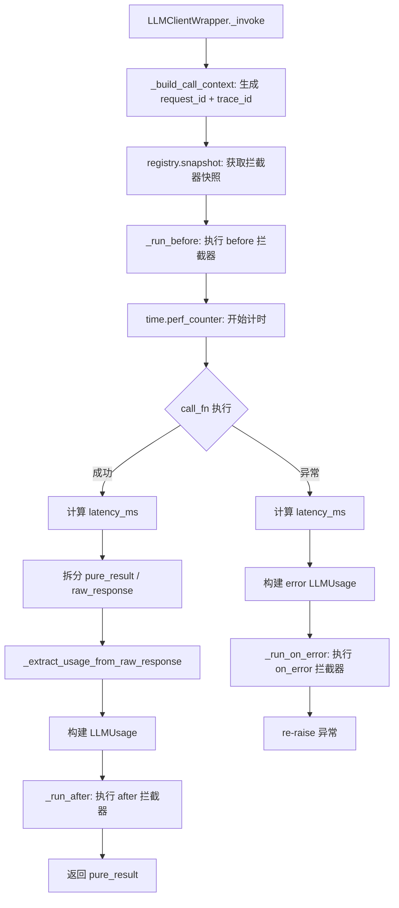
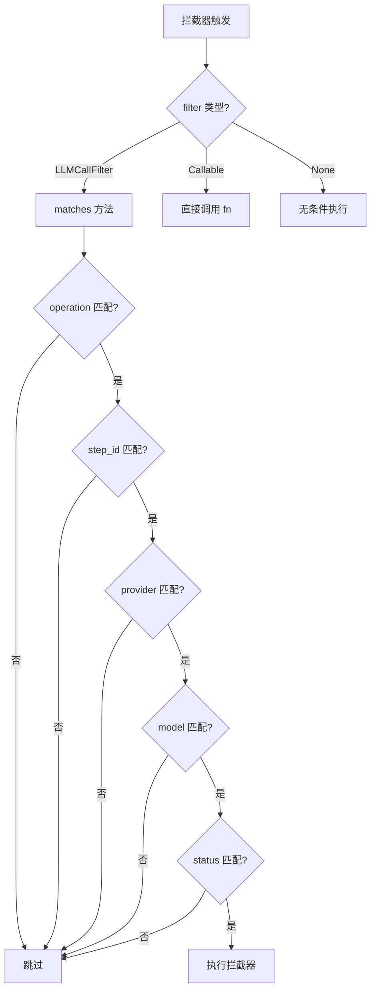

# PD-11.08 memU — LLMClientWrapper 双层拦截器全链路追踪

> 文档编号：PD-11.08
> 来源：memU `src/memu/llm/wrapper.py`, `src/memu/app/service.py`
> GitHub：https://github.com/NevaMind-AI/memU.git
> 问题域：PD-11 可观测性 Observability & Cost Tracking
> 状态：可复用方案

---

## 第 1 章 问题与动机

### 1.1 核心问题

记忆系统（Memory-as-a-Service）的每次操作都涉及多次 LLM 调用——分类、摘要、嵌入、检索排序——但调用者（上层应用）无法感知这些内部调用的 token 消耗、延迟分布和错误率。传统做法是在每个 LLM 客户端方法里硬编码日志，导致：

1. **观测逻辑与业务逻辑耦合**：每新增一种 LLM 操作（chat/vision/embed/transcribe）都要重复写日志代码
2. **无法按维度过滤**：想只看某个 workflow step 或某个 provider 的调用数据，需要手动 grep 日志
3. **拦截器不可插拔**：上层应用无法在不修改 memU 源码的情况下注入自定义追踪逻辑（如接入 LangSmith、Langfuse）
4. **多提供商 token 格式不统一**：OpenAI 返回 `prompt_tokens`/`completion_tokens`，其他提供商字段名各异

### 1.2 memU 的解法概述

memU 设计了一套**双层拦截器架构**，将可观测性从业务代码中完全解耦：

1. **LLM 层拦截器**（`LLMClientWrapper` + `LLMInterceptorRegistry`）：包裹所有 LLM 客户端调用，自动采集 `LLMUsage`（input/output tokens、latency_ms、finish_reason、content_hash），支持 `LLMCallFilter` 按 operation/step_id/provider/model 过滤（`src/memu/llm/wrapper.py:62-86`）
2. **Workflow 层拦截器**（`WorkflowInterceptorRegistry`）：在每个 workflow step 执行前后触发，提供 step 级别的可观测性（`src/memu/workflow/interceptor.py:56-165`）
3. **三阶段钩子**：before/after/on_error 三个拦截点，覆盖正常路径和异常路径（`src/memu/llm/wrapper.py:450-504`）
4. **统一 Usage 数据结构**：`LLMUsage` 冻结 dataclass 统一 input_tokens/output_tokens/cached_input_tokens/reasoning_tokens/latency_ms/finish_reason/tokens_breakdown（`src/memu/llm/wrapper.py:48-58`）
5. **Handle 模式注销**：每个注册返回 `LLMInterceptorHandle`，调用 `dispose()` 即可移除，避免内存泄漏（`src/memu/llm/wrapper.py:115-125`）

### 1.3 设计思想

| 设计原则 | 具体实现 | 理由 | 替代方案 |
|----------|----------|------|----------|
| 代理模式透明包裹 | `LLMClientWrapper.__getattr__` 代理未拦截方法 | 上层代码无需感知 wrapper 存在 | 继承每个 client 类（侵入性强） |
| 冻结数据结构 | `@dataclass(frozen=True)` 用于所有 View/Usage/Context | 拦截器收到的数据不可篡改，线程安全 | 普通 dict（易被意外修改） |
| 快照隔离 | `registry.snapshot()` 在调用开始时获取拦截器快照 | 调用过程中注册/注销拦截器不影响当前调用 | 直接遍历 registry（并发不安全） |
| 内容哈希而非原文 | `content_hash = sha256(text)` 记录在 RequestView/ResponseView | 可观测性不泄露用户数据 | 记录原文（隐私风险） |
| Best-effort 提取 | `_extract_usage_from_raw_response` 静默忽略提取失败 | 不同提供商返回格式不同，不能因为 usage 提取失败阻断业务 | 严格解析（一个字段缺失就报错） |

---

## 第 2 章 源码实现分析

### 2.1 架构概览

memU 的可观测性架构分为两层，LLM 调用层和 Workflow 步骤层，通过拦截器注册表实现解耦：

```
┌─────────────────────────────────────────────────────────┐
│                    MemoryService                         │
│  ┌──────────────────┐    ┌───────────────────────────┐  │
│  │ LLMInterceptor   │    │ WorkflowInterceptor       │  │
│  │ Registry         │    │ Registry                  │  │
│  │  before[]        │    │  before[]                 │  │
│  │  after[]         │    │  after[]                  │  │
│  │  on_error[]      │    │  on_error[]               │  │
│  └────────┬─────────┘    └────────────┬──────────────┘  │
│           │                           │                  │
│  ┌────────▼─────────┐    ┌────────────▼──────────────┐  │
│  │ LLMClientWrapper │    │ run_steps()               │  │
│  │  _invoke()       │    │  for step in steps:       │  │
│  │   → before hooks │    │   → before hooks          │  │
│  │   → actual call  │    │   → step.run()            │  │
│  │   → after hooks  │    │   → after hooks           │  │
│  └────────┬─────────┘    └───────────────────────────┘  │
│           │                                              │
│  ┌────────▼─────────────────────────────────────────┐   │
│  │ LLM Backends: OpenAI SDK / HTTP (httpx)          │   │
│  │  → returns (pure_result, raw_response)           │   │
│  └──────────────────────────────────────────────────┘   │
└─────────────────────────────────────────────────────────┘
```

### 2.2 核心实现

#### 2.2.1 LLMClientWrapper._invoke — 统一拦截入口



对应源码 `src/memu/llm/wrapper.py:387-435`：

```python
async def _invoke(
    self,
    *,
    kind: str,
    call_fn: Callable[[], Any],
    request_view: LLMRequestView,
    model: str | None,
    response_builder: Callable[[Any], LLMResponseView],
) -> Any:
    call_ctx = self._build_call_context(model)
    snapshot = self._registry.snapshot()
    await self._run_before(snapshot.before, call_ctx, request_view)
    start_time = time.perf_counter()
    try:
        result = call_fn()
        if inspect.isawaitable(result):
            result = await result
    except Exception as exc:
        latency_ms = (time.perf_counter() - start_time) * 1000
        usage = LLMUsage(latency_ms=latency_ms, status="error")
        await self._run_on_error(snapshot.on_error, call_ctx, request_view, exc, usage)
        raise
    else:
        latency_ms = (time.perf_counter() - start_time) * 1000
        pure_result = result
        raw_response = None
        if isinstance(result, tuple) and len(result) == 2:
            pure_result, raw_response = result
        response_view = response_builder(pure_result)
        extracted_usage = _extract_usage_from_raw_response(kind=kind, raw_response=raw_response)
        usage = LLMUsage(
            input_tokens=extracted_usage.get("input_tokens"),
            output_tokens=extracted_usage.get("output_tokens"),
            total_tokens=extracted_usage.get("total_tokens"),
            cached_input_tokens=extracted_usage.get("cached_input_tokens"),
            reasoning_tokens=extracted_usage.get("reasoning_tokens"),
            latency_ms=latency_ms,
            finish_reason=extracted_usage.get("finish_reason"),
            status="success",
            tokens_breakdown=extracted_usage.get("tokens_breakdown"),
        )
        await self._run_after(snapshot.after, call_ctx, request_view, response_view, usage)
        return pure_result
```

#### 2.2.2 LLMCallFilter — 多维度过滤拦截



对应源码 `src/memu/llm/wrapper.py:62-86`：

```python
@dataclass(frozen=True)
class LLMCallFilter:
    operations: set[str] | None = None
    step_ids: set[str] | None = None
    providers: set[str] | None = None
    models: set[str] | None = None
    statuses: set[str] | None = None

    def __post_init__(self) -> None:
        object.__setattr__(self, "operations", _normalize_set(self.operations))
        object.__setattr__(self, "providers", _normalize_set(self.providers))
        object.__setattr__(self, "models", _normalize_set(self.models))
        object.__setattr__(self, "statuses", _normalize_set(self.statuses))

    def matches(self, ctx: LLMCallContext, status: str | None) -> bool:
        if self.operations and (ctx.operation or "").lower() not in self.operations:
            return False
        if self.step_ids and (ctx.step_id or "") not in self.step_ids:
            return False
        if self.providers and (ctx.provider or "").lower() not in self.providers:
            return False
        if self.models and (ctx.model or "").lower() not in self.models:
            return False
        if self.statuses:
            return status is not None and status.lower() in self.statuses
        return True
```

### 2.3 实现细节

#### Token Usage 提取的多提供商适配

`_extract_usage_from_raw_response`（`src/memu/llm/wrapper.py:653-703`）采用 best-effort 策略从 raw response 中提取 token 数据：

- 通过 `_get_attr_or_key` 同时支持 SDK 对象（`hasattr`）和 dict 响应（`dict.get`）
- OpenAI 的 `prompt_tokens` 映射为统一的 `input_tokens`，`completion_tokens` 映射为 `output_tokens`
- 对 embedding 调用特殊处理：部分提供商不返回 `input_tokens`，此时用 `total_tokens` 回填（`wrapper.py:694-695`）
- `completion_tokens_details` 中提取 `reasoning_tokens`（支持 o1 等推理模型）
- `prompt_tokens_details` 中提取 `cached_tokens`（支持 prompt caching）

#### 拦截器优先级与执行顺序

LLM 拦截器支持 `priority` 参数（`src/memu/llm/wrapper.py:519`）：
- `_sorted_interceptors` 按 `(priority, order)` 排序，priority 小的先执行
- before 拦截器正序执行，after/on_error 拦截器**逆序**执行（`wrapper.py:466-504`），形成洋葱模型
- Workflow 拦截器不支持 priority，按注册顺序执行（`interceptor.py:56-63` 注释明确说明）

#### 安全调用与 strict 模式

`_safe_invoke_interceptor`（`src/memu/llm/wrapper.py:760-772`）：
- 默认模式：拦截器异常被 `logger.exception` 记录但不传播，保证业务调用不受影响
- strict 模式：异常直接 raise，用于测试环境确保拦截器正确性
- 同时支持同步和异步拦截器（`inspect.isawaitable` 检测）

#### LLMCallContext 的 trace_id 传播

`MemoryService._llm_call_metadata`（`src/memu/app/service.py:154-166`）从 `step_context` 中提取 `trace_id`：
- `trace_id` 由上层调用者注入到 `step_context` 中
- 通过 `LLMCallMetadata` → `LLMCallContext` 传播到每个拦截器
- 拦截器可以用 `trace_id` 关联同一请求链路中的多次 LLM 调用


---

## 第 3 章 迁移指南

### 3.1 迁移清单

**阶段 1：核心数据结构（0 依赖）**

- [ ] 复制 `LLMCallContext`、`LLMRequestView`、`LLMResponseView`、`LLMUsage` 四个冻结 dataclass
- [ ] 复制 `LLMCallFilter` 及其 `matches` 方法
- [ ] 复制 `_hash_text`、`_hash_texts` 工具函数

**阶段 2：拦截器注册表**

- [ ] 复制 `LLMInterceptorRegistry`（含 `_LLMInterceptor`、`_LLMInterceptorSnapshot`）
- [ ] 复制 `LLMInterceptorHandle`（dispose 模式）
- [ ] 复制 `_sorted_interceptors`、`_should_run_interceptor`、`_safe_invoke_interceptor`

**阶段 3：Wrapper 集成**

- [ ] 复制 `LLMClientWrapper`，适配你的 LLM 客户端接口
- [ ] 确保你的 LLM 客户端返回 `(pure_result, raw_response)` 元组
- [ ] 复制 `_extract_usage_from_raw_response` 及其辅助函数
- [ ] 在你的 Service 层创建 `_wrap_llm_client` 方法

**阶段 4（可选）：Workflow 层拦截器**

- [ ] 如果你有 workflow/pipeline 系统，复制 `WorkflowInterceptorRegistry`
- [ ] 在 `run_steps` 中集成 before/after/on_error 钩子

### 3.2 适配代码模板

以下是一个最小可运行的拦截器集成示例：

```python
import time
import logging
from dataclasses import dataclass, field
from typing import Any, Mapping

logger = logging.getLogger(__name__)


# --- 1. 数据结构（直接复用 memU 的定义） ---

@dataclass(frozen=True)
class LLMCallContext:
    profile: str
    request_id: str
    trace_id: str | None
    operation: str | None
    step_id: str | None
    provider: str | None
    model: str | None
    tags: Mapping[str, Any] | None


@dataclass(frozen=True)
class LLMUsage:
    input_tokens: int | None = None
    output_tokens: int | None = None
    total_tokens: int | None = None
    latency_ms: float | None = None
    finish_reason: str | None = None
    status: str | None = None


# --- 2. 注册自定义拦截器 ---

def my_cost_tracker(
    ctx: LLMCallContext,
    request_view: Any,
    response_view: Any,
    usage: LLMUsage,
) -> None:
    """示例：after 拦截器，记录每次调用的 token 和延迟"""
    logger.info(
        "LLM call [%s] model=%s input=%s output=%s latency=%.1fms",
        ctx.operation or "unknown",
        ctx.model,
        usage.input_tokens,
        usage.output_tokens,
        usage.latency_ms or 0,
    )


def my_error_alerter(
    ctx: LLMCallContext,
    request_view: Any,
    error: Exception,
    usage: LLMUsage,
) -> None:
    """示例：on_error 拦截器，发送告警"""
    logger.error(
        "LLM call FAILED [%s] model=%s error=%s latency=%.1fms",
        ctx.operation,
        ctx.model,
        type(error).__name__,
        usage.latency_ms or 0,
    )


# --- 3. 在 Service 初始化时注册 ---

# service = MemoryService(...)
# handle1 = service.intercept_after_llm_call(my_cost_tracker)
# handle2 = service.intercept_on_error_llm_call(my_error_alerter)

# --- 4. 按需过滤：只追踪特定 provider ---

# handle3 = service.intercept_after_llm_call(
#     my_cost_tracker,
#     where={"provider": "openai", "operation": "memorize"},
# )

# --- 5. 清理 ---
# handle1.dispose()
# handle2.dispose()
```

### 3.3 适用场景

| 场景 | 适用度 | 说明 |
|------|--------|------|
| 多 LLM 提供商的统一追踪 | ⭐⭐⭐ | 核心设计目标，`_extract_usage_from_raw_response` 已适配 OpenAI/Doubao/Grok/OpenRouter |
| 按 workflow step 分析成本 | ⭐⭐⭐ | `LLMCallContext.step_id` + `operation` 天然支持 |
| 接入第三方追踪系统 | ⭐⭐⭐ | 注册 after 拦截器即可桥接到 LangSmith/Langfuse/自建系统 |
| 实时成本告警 | ⭐⭐ | 需要自行在拦截器中实现累积计数和阈值判断 |
| 高并发场景 | ⭐⭐ | 快照隔离保证线程安全，但拦截器本身需要自行处理并发 |
| 流式响应追踪 | ⭐ | 当前 wrapper 不支持流式，需要扩展 `_invoke` 处理 async generator |

---

## 第 4 章 测试用例

```python
"""基于 memU 真实接口的测试用例"""
import asyncio
import hashlib
import uuid
from dataclasses import dataclass
from typing import Any
from unittest.mock import AsyncMock, MagicMock

import pytest

from memu.llm.wrapper import (
    LLMCallContext,
    LLMCallFilter,
    LLMCallMetadata,
    LLMClientWrapper,
    LLMInterceptorRegistry,
    LLMRequestView,
    LLMResponseView,
    LLMUsage,
    _extract_usage_from_raw_response,
)


class TestLLMCallFilter:
    """测试多维度过滤器"""

    def test_empty_filter_matches_all(self):
        ctx = LLMCallContext(
            profile="default", request_id="r1", trace_id=None,
            operation="memorize", step_id="s1", provider="openai",
            model="gpt-4", tags=None,
        )
        f = LLMCallFilter()
        assert f.matches(ctx, "success") is True

    def test_filter_by_provider(self):
        ctx = LLMCallContext(
            profile="default", request_id="r1", trace_id=None,
            operation="memorize", step_id="s1", provider="openai",
            model="gpt-4", tags=None,
        )
        f = LLMCallFilter(providers={"openai"})
        assert f.matches(ctx, "success") is True
        f2 = LLMCallFilter(providers={"anthropic"})
        assert f2.matches(ctx, "success") is False

    def test_filter_by_operation_case_insensitive(self):
        ctx = LLMCallContext(
            profile="default", request_id="r1", trace_id=None,
            operation="Memorize", step_id="s1", provider="openai",
            model="gpt-4", tags=None,
        )
        f = LLMCallFilter(operations={"memorize"})
        assert f.matches(ctx, None) is True

    def test_filter_by_status(self):
        ctx = LLMCallContext(
            profile="default", request_id="r1", trace_id=None,
            operation="chat", step_id=None, provider=None,
            model=None, tags=None,
        )
        f = LLMCallFilter(statuses={"error"})
        assert f.matches(ctx, "error") is True
        assert f.matches(ctx, "success") is False


class TestUsageExtraction:
    """测试多提供商 token 提取"""

    def test_openai_sdk_response(self):
        """OpenAI SDK 返回 Pydantic 对象"""
        mock_usage = MagicMock()
        mock_usage.prompt_tokens = 100
        mock_usage.completion_tokens = 50
        mock_usage.total_tokens = 150
        mock_usage.completion_tokens_details = None
        mock_usage.prompt_tokens_details = None
        mock_response = MagicMock()
        mock_response.usage = mock_usage
        mock_response.choices = [MagicMock(finish_reason="stop")]

        result = _extract_usage_from_raw_response(kind="chat", raw_response=mock_response)
        assert result["input_tokens"] == 100
        assert result["output_tokens"] == 50
        assert result["finish_reason"] == "stop"

    def test_dict_response(self):
        """HTTP 客户端返回 dict"""
        raw = {
            "usage": {"prompt_tokens": 80, "completion_tokens": 30, "total_tokens": 110},
            "choices": [{"finish_reason": "stop"}],
        }
        result = _extract_usage_from_raw_response(kind="chat", raw_response=raw)
        assert result["input_tokens"] == 80
        assert result["output_tokens"] == 30

    def test_embed_fallback_total_to_input(self):
        """Embedding 调用：total_tokens 回填 input_tokens"""
        raw = {"usage": {"total_tokens": 200}}
        result = _extract_usage_from_raw_response(kind="embed", raw_response=raw)
        assert result["input_tokens"] == 200

    def test_none_response_returns_empty(self):
        result = _extract_usage_from_raw_response(kind="chat", raw_response=None)
        assert result == {}


class TestInterceptorRegistry:
    """测试拦截器注册与执行"""

    def test_register_and_snapshot(self):
        registry = LLMInterceptorRegistry()
        called = []
        registry.register_after(lambda *args: called.append("after1"))
        registry.register_before(lambda *args: called.append("before1"))
        snap = registry.snapshot()
        assert len(snap.before) == 1
        assert len(snap.after) == 1

    def test_handle_dispose(self):
        registry = LLMInterceptorRegistry()
        handle = registry.register_after(lambda *args: None)
        assert len(registry.snapshot().after) == 1
        handle.dispose()
        assert len(registry.snapshot().after) == 0
        # 重复 dispose 返回 False
        assert handle.dispose() is False

    def test_priority_ordering(self):
        registry = LLMInterceptorRegistry()
        order = []
        registry.register_before(lambda *a: order.append("p10"), priority=10)
        registry.register_before(lambda *a: order.append("p0"), priority=0)
        registry.register_before(lambda *a: order.append("p5"), priority=5)
        snap = registry.snapshot()
        # priority 0 → 5 → 10
        assert [i.priority for i in snap.before] == [0, 5, 10]


class TestLLMClientWrapperInvoke:
    """测试 wrapper 的完整调用链"""

    @pytest.mark.asyncio
    async def test_chat_invokes_interceptors(self):
        mock_client = AsyncMock()
        mock_response = MagicMock()
        mock_response.usage = MagicMock(
            prompt_tokens=10, completion_tokens=5, total_tokens=15,
            completion_tokens_details=None, prompt_tokens_details=None,
        )
        mock_response.choices = [MagicMock(finish_reason="stop")]
        mock_client.chat.return_value = ("hello", mock_response)

        registry = LLMInterceptorRegistry(strict=True)
        captured: list[LLMUsage] = []
        registry.register_after(lambda ctx, req, resp, usage: captured.append(usage))

        wrapper = LLMClientWrapper(
            mock_client,
            registry=registry,
            metadata=LLMCallMetadata(profile="test"),
            provider="openai",
            chat_model="gpt-4",
        )
        result = await wrapper.chat("test prompt")
        assert result == "hello"
        assert len(captured) == 1
        assert captured[0].input_tokens == 10
        assert captured[0].latency_ms > 0
```


---

## 第 5 章 跨域关联

| 关联域 | 关系类型 | 说明 |
|--------|----------|------|
| PD-01 上下文管理 | 协同 | `LLMRequestView.input_chars` 和 `LLMUsage.input_tokens` 可用于监控上下文窗口使用率，触发压缩策略 |
| PD-03 容错与重试 | 协同 | `on_error` 拦截器提供错误可观测性，`LLMUsage.status="error"` + `latency_ms` 可用于重试决策 |
| PD-04 工具系统 | 依赖 | `LLMClientWrapper` 本身是一种工具包装模式，`__getattr__` 代理使其对工具系统透明 |
| PD-06 记忆持久化 | 协同 | memU 的核心场景——记忆存取的每次 LLM 调用都经过 wrapper，可按 `operation=memorize/retrieve` 分析记忆系统成本 |
| PD-10 中间件管道 | 协同 | `WorkflowInterceptorRegistry` 与 `PipelineManager` 配合，在 workflow step 级别提供可观测性，形成 LLM 调用 + workflow step 双层追踪 |

---

## 第 6 章 来源文件索引

| 文件 | 行范围 | 关键实现 |
|------|--------|----------|
| `src/memu/llm/wrapper.py` | L17-27 | `LLMCallContext` — 调用上下文（profile/request_id/trace_id/operation/step_id/provider/model/tags） |
| `src/memu/llm/wrapper.py` | L29-36 | `LLMRequestView` — 请求视图（kind/input_items/input_chars/content_hash） |
| `src/memu/llm/wrapper.py` | L39-45 | `LLMResponseView` — 响应视图（output_items/output_chars/content_hash） |
| `src/memu/llm/wrapper.py` | L48-58 | `LLMUsage` — 统一 token 用量（input/output/cached/reasoning/latency/finish_reason） |
| `src/memu/llm/wrapper.py` | L62-86 | `LLMCallFilter` — 五维过滤器（operations/step_ids/providers/models/statuses） |
| `src/memu/llm/wrapper.py` | L128-224 | `LLMInterceptorRegistry` — 拦截器注册表（before/after/on_error + snapshot + remove） |
| `src/memu/llm/wrapper.py` | L226-504 | `LLMClientWrapper` — 核心 wrapper（_invoke/chat/vision/embed/transcribe + 拦截器执行） |
| `src/memu/llm/wrapper.py` | L653-703 | `_extract_usage_from_raw_response` — 多提供商 token 提取 |
| `src/memu/llm/wrapper.py` | L760-772 | `_safe_invoke_interceptor` — 安全调用 + strict 模式 |
| `src/memu/workflow/interceptor.py` | L16-24 | `WorkflowStepContext` — workflow 步骤上下文 |
| `src/memu/workflow/interceptor.py` | L56-165 | `WorkflowInterceptorRegistry` — workflow 层拦截器注册表 |
| `src/memu/workflow/step.py` | L50-101 | `run_steps` — workflow 执行器，集成拦截器调用 |
| `src/memu/app/service.py` | L86-87 | `MemoryService.__init__` — 初始化双层拦截器注册表 |
| `src/memu/app/service.py` | L154-166 | `_llm_call_metadata` — 从 step_context 提取 trace_id/operation/step_id |
| `src/memu/app/service.py` | L168-185 | `_wrap_llm_client` — 创建带拦截器的 LLM 客户端 |
| `src/memu/app/service.py` | L228-256 | `intercept_before/after/on_error_llm_call` — 公开 API |
| `src/memu/llm/openai_sdk.py` | L39-64 | `OpenAISDKClient.chat` — 返回 `(content, response)` 元组 |
| `src/memu/llm/http_client.py` | L119-146 | `HTTPLLMClient.chat` — 返回 `(text, data)` 元组 |

---

## 第 7 章 横向对比维度

> **重要：** 本章用于自动填充 Butcher Wiki 的横向对比表。
> 必须严格按以下 JSON 格式输出，放在 `comparison_data` 代码块中。

```json comparison_data
{
  "project": "memU",
  "dimensions": {
    "追踪方式": "双层拦截器：LLM 调用层 + Workflow 步骤层，before/after/on_error 三阶段钩子",
    "数据粒度": "单次 LLM 调用级：input/output/cached/reasoning tokens + latency_ms + finish_reason + content_hash",
    "持久化": "无内置持久化，通过 after 拦截器外挂（日志/数据库/第三方追踪）",
    "多提供商": "best-effort 提取：_get_attr_or_key 同时支持 SDK 对象和 dict，适配 OpenAI/Doubao/Grok/OpenRouter",
    "日志格式": "Python logging + 拦截器自定义，无内置结构化日志格式",
    "成本追踪": "提供 token 原始数据，成本计算由拦截器实现",
    "业务元数据注入": "LLMCallContext 携带 profile/operation/step_id/trace_id/tags 五维元数据",
    "Decorator 插桩": "代理模式 __getattr__ 透明包裹，非 Decorator",
    "日志级别": "拦截器异常 logger.exception，业务调用 logger.debug",
    "预算守卫": "无内置预算守卫，可通过 before 拦截器实现拒绝调用",
    "安全审计": "content_hash (SHA-256) 记录请求/响应指纹，不存储原文",
    "过滤拦截": "LLMCallFilter 五维过滤 + Callable 自定义过滤 + Mapping 快捷构造"
  }
}
```

### 域元数据补充

```json domain_metadata
{
  "solution_summary": "memU 通过 LLMClientWrapper 代理模式 + LLMInterceptorRegistry 双层拦截器（LLM 调用层 + Workflow 步骤层）实现全链路追踪，LLMCallFilter 支持 operation/step_id/provider/model/status 五维过滤",
  "description": "拦截器模式将可观测性从 LLM 客户端中完全解耦，支持运行时插拔追踪逻辑",
  "sub_problems": [
    "拦截器快照隔离：调用过程中注册/注销拦截器不影响当前执行的一致性保证",
    "content_hash 隐私保护：可观测数据记录 SHA-256 指纹而非原文，平衡追踪需求与数据安全",
    "多模态调用追踪：vision/transcribe 等非文本调用的 metadata 采集（image_bytes/audio_bytes）",
    "拦截器优先级洋葱模型：before 正序 after 逆序形成对称执行栈"
  ],
  "best_practices": [
    "LLM 客户端统一返回 (pure_result, raw_response) 元组：wrapper 从 raw_response 提取 usage 而不侵入业务返回值",
    "frozen dataclass 传递观测数据：拦截器收到的 Context/View/Usage 不可篡改，天然线程安全",
    "Handle 模式管理拦截器生命周期：register 返回 Handle，dispose() 移除，避免忘记清理导致内存泄漏"
  ]
}
```

