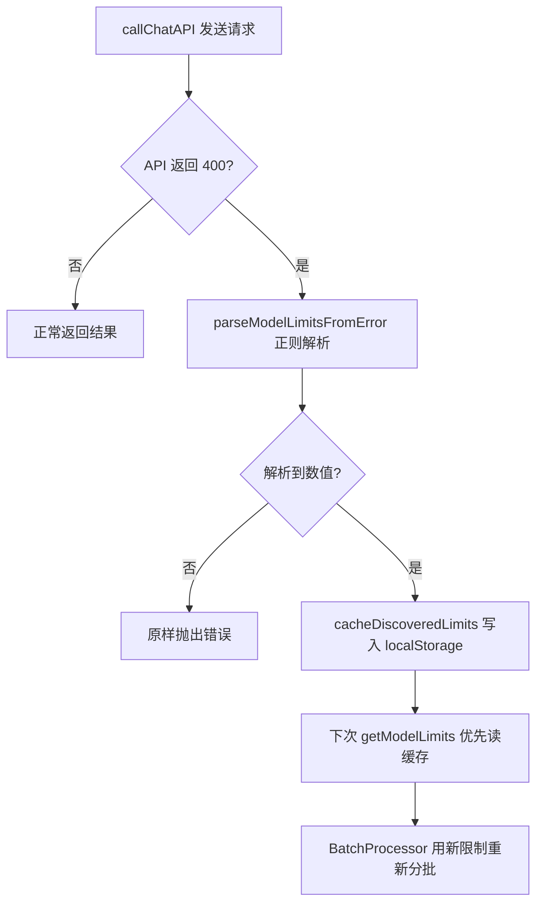
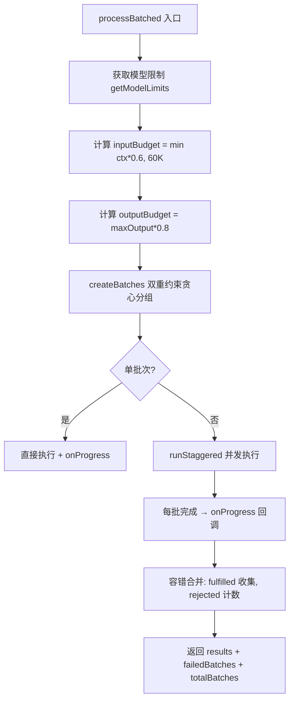

# PD-11.07 moyin-creator — 模块前缀结构化日志与 Error-Driven 模型限制发现

> 文档编号：PD-11.07
> 来源：moyin-creator `src/lib/ai/`, `src/packages/ai-core/api/`, `src/stores/`
> GitHub：https://github.com/MemeCalculate/moyin-creator.git
> 问题域：PD-11 可观测性 Observability & Cost Tracking
> 状态：可复用方案

---

## 第 1 章 问题与动机

### 1.1 核心问题

moyin-creator 是一个 AI 驱动的视频创作工具，核心流程是：用户输入故事文本 → AI 分析剧本 → 批量生成场景图片 → 批量生成视频。这个流程涉及多个异步阶段、多个 AI 提供商、Web Worker 跨线程通信、以及长时间的轮询等待。

在这种多阶段、多线程、多提供商的架构下，可观测性面临三个核心挑战：

1. **跨线程日志归属**：主线程和 Web Worker 各自产生日志，需要通过模块前缀区分来源，否则调试时无法定位问题发生在哪一侧
2. **模型能力不透明**：不同 AI 提供商（MemeFast 代理的 DeepSeek/GLM/Gemini 等）的 context window 和 max_tokens 限制各不相同，且代理平台不一定暴露真实限制。需要一种机制在运行时自动发现并缓存这些限制
3. **批量任务进度追踪**：批量生成 10-50 个场景时，用户需要知道当前进度、哪些批次失败了、失败原因是什么

### 1.2 moyin-creator 的解法概述

1. **统一模块前缀日志约定**：所有模块使用 `[ModuleName]` 前缀的 console.log/warn/error，形成全局一致的结构化日志（`src/lib/ai/worker-bridge.ts:47`, `src/lib/ai/feature-router.ts:163`, `src/stores/api-config-store.ts:333`）
2. **Error-Driven Discovery**：从 API 400 错误消息中正则解析模型的真实 max_tokens 和 context window 限制，持久化到 localStorage，下次直接使用（`src/lib/ai/model-registry.ts:178-229`）
3. **三层模型限制查找**：持久化缓存 → 静态注册表（prefix 匹配）→ 保守默认值，确保未知模型也能安全运行（`src/lib/ai/model-registry.ts:125-142`）
4. **多层进度回调**：BatchProcessor 提供批次级进度，TaskPoller 提供单任务轮询进度，WorkerBridge 提供场景级事件，三层组合覆盖完整生成流程
5. **批次级容错统计**：`processBatched` 返回 `failedBatches/totalBatches` 统计，部分失败不阻塞整体流程（`src/lib/ai/batch-processor.ts:200-232`）

### 1.3 设计思想

| 设计原则 | 具体实现 | 理由 | 替代方案 |
|----------|----------|------|----------|
| 约定优于配置 | `[ModuleName]` 前缀约定，无需日志框架 | 前端项目引入 winston/pino 过重，console.log + 前缀足够 | 引入 pino-browser 等前端日志库 |
| 错误即信号 | API 400 错误解析为模型限制缓存 | 代理平台不暴露模型限制，只能从错误中学习 | 维护完整的模型限制数据库 |
| 三层降级 | 缓存 → 静态表 → 默认值 | 保证任何模型都能运行，宁可多分批也不撞限制 | 只用静态表，未知模型报错 |
| 部分成功优于全部失败 | 批次级容错，失败批次不阻塞其他 | 批量生成中单个 API 超时不应废弃已完成的结果 | 全部失败回滚 |
| 进度可见 | 三层回调（批次/轮询/场景） | 长时间生成任务用户需要知道进度 | 只在最终完成时通知 |

---

## 第 2 章 源码实现分析

### 2.1 架构概览

moyin-creator 的可观测性分布在 4 个层次，从底层到上层：

```
┌─────────────────────────────────────────────────────────┐
│                    UI Layer (React)                       │
│  GenerationProgress 组件 ← DirectorStore 状态            │
├─────────────────────────────────────────────────────────┤
│                 Bridge Layer (主线程)                      │
│  WorkerBridge [WorkerBridge] ← Worker postMessage 事件   │
│  ├─ SCENE_PROGRESS / SCENE_COMPLETED / SCENE_FAILED      │
│  └─ 动态 import stores 注入媒体                          │
├─────────────────────────────────────────────────────────┤
│               Scheduling Layer (主线程)                    │
│  BatchProcessor [BatchProcessor]                          │
│  ├─ onProgress(completed, total, message)                │
│  ├─ 双重约束分批 (input + output tokens)                  │
│  └─ runStaggered 并发控制                                 │
│  FeatureRouter [FeatureRouter] [callFeatureAPI]           │
│  ├─ 多模型轮询调度                                        │
│  └─ 路由决策日志                                          │
├─────────────────────────────────────────────────────────┤
│              Infrastructure Layer                         │
│  ModelRegistry [ModelRegistry]                            │
│  ├─ 三层查找 (缓存→静态→默认)                             │
│  └─ Error-Driven Discovery + 持久化                       │
│  TaskPoller [TaskPoller] — 异步任务轮询 + 动态超时         │
│  TaskQueue [TaskQueue] — 优先级队列 + getStats()          │
│  RetryUtil [Retry] — 指数退避 + 429 检测                  │
│  APIConfigStore [APIConfig] — 配置变更日志                 │
└─────────────────────────────────────────────────────────┘
```

### 2.2 核心实现

#### 2.2.1 Error-Driven Discovery：从 API 错误中学习模型限制



对应源码 `src/lib/ai/model-registry.ts:178-229`：

```typescript
export function parseModelLimitsFromError(errorText: string): Partial<DiscoveredModelLimits> | null {
  const result: Partial<DiscoveredModelLimits> = {};
  let found = false;

  // Pattern 1: "valid range of max_tokens is [1, 8192]"
  const rangeMatch = errorText.match(/valid\s+range.*?\[\s*\d+\s*,\s*(\d+)\s*\]/i);
  if (rangeMatch) {
    result.maxOutput = parseInt(rangeMatch[1], 10);
    found = true;
  }

  // Pattern 2: "max_tokens must be less than or equal to 8192"
  if (!found) {
    const lteMatch = errorText.match(/max_tokens.*?(?:less than or equal to|<=|不超过|上限为?)\s*(\d{3,6})/i);
    if (lteMatch) {
      result.maxOutput = parseInt(lteMatch[1], 10);
      found = true;
    }
  }

  // Pattern 3: Generic fallback
  if (!found) {
    const genericMatch = errorText.match(/max_tokens.*?\b(\d{3,6})\b/i);
    if (genericMatch) {
      result.maxOutput = parseInt(genericMatch[1], 10);
      found = true;
    }
  }

  // 解析 context window
  const ctxMatch = errorText.match(/context.*?length.*?(\d{4,7})/i);
  if (ctxMatch) {
    result.contextWindow = parseInt(ctxMatch[1], 10);
    found = true;
  }

  if (!found) return null;
  result.discoveredAt = Date.now();
  return result;
}
```

三层查找逻辑 `src/lib/ai/model-registry.ts:125-142`：

```typescript
export function getModelLimits(modelName: string): ModelLimits {
  const m = modelName.toLowerCase();

  // Layer 1: 持久化缓存（从 API 错误中学到的真实值）
  if (_getDiscoveredLimits) {
    const discovered = _getDiscoveredLimits(m);
    if (discovered) {
      const staticFallback = lookupStatic(m);
      return {
        contextWindow: discovered.contextWindow ?? staticFallback.contextWindow,
        maxOutput: discovered.maxOutput ?? staticFallback.maxOutput,
      };
    }
  }

  // Layer 2 + 3: 静态注册表 → _default
  return lookupStatic(m);
}
```

#### 2.2.2 BatchProcessor 双重约束分批与进度追踪



对应源码 `src/lib/ai/batch-processor.ts:105-233`：

```typescript
export async function processBatched<TItem, TResult>(
  opts: ProcessBatchedOptions<TItem, TResult>,
): Promise<ProcessBatchedResult<TResult>> {
  // ... 参数解构 ...

  // 1. 获取模型限制
  const limits = getModelLimits(modelName);
  const inputBudget = Math.min(Math.floor(limits.contextWindow * 0.6), HARD_CAP_TOKENS);
  const outputBudget = Math.floor(limits.maxOutput * 0.8);

  console.log(
    `[BatchProcessor] ${feature}: model=${modelName}, ` +
    `ctx=${limits.contextWindow}, maxOutput=${limits.maxOutput}, ` +
    `inputBudget=${inputBudget}, outputBudget=${outputBudget}, ` +
    `items=${items.length}`,
  );

  // 3. 双重约束贪心分组
  const batches = createBatches(items, getItemTokens, getItemOutputTokens,
    inputBudget, outputBudget, systemPromptTokens);

  console.log(
    `[BatchProcessor] 分批结果: ${batches.length} 批次 ` +
    `(${batches.map(b => b.length).join(', ')} items)`,
  );

  // 4. 并发执行 + 进度回调
  const settled = await runStaggered(batchTasks, concurrency, 5000);

  // 5. 容错合并
  for (const result of settled) {
    if (result.status === 'fulfilled') {
      successResults.push(result.value);
    } else {
      failedBatches++;
      console.error('[BatchProcessor] 批次失败:', result.reason);
    }
  }

  return { results: finalResults, failedBatches, totalBatches: batches.length };
}
```

### 2.3 实现细节

#### 模块前缀日志约定

项目中所有模块统一使用 `[ModuleName]` 前缀，形成隐式的结构化日志：

| 模块 | 前缀 | 典型日志 |
|------|------|----------|
| WorkerBridge | `[WorkerBridge]` | `Worker ready, version 1.0` |
| FeatureRouter | `[FeatureRouter]` | `多模型轮询: script_analysis -> MemeFast:deepseek-v3` |
| callFeatureAPI | `[callFeatureAPI]` | `功能: script_analysis / 供应商: MemeFast / 模型: deepseek-v3` |
| BatchProcessor | `[BatchProcessor]` | `分批结果: 3 批次 (10, 10, 5 items)` |
| ModelRegistry | `[ModelRegistry]` | `🧠 已学习 deepseek-v3 的限制: maxOutput=8192` |
| TaskPoller | `[TaskPoller]` | `Task abc123 completed after 15 polls` |
| TaskQueue | `[TaskQueue]` | `Task img_001 failed, retrying (1/3)` |
| APIConfig | `[APIConfig]` | `Synced 150 models for MemeFast (from 2 keys)` |
| Retry | `[Retry]` | `Rate limit hit, retrying in 4000ms... (Attempt 2/3)` |

#### 依赖注入避免循环引用

`model-registry.ts` 需要读写 `api-config-store.ts` 中的 `discoveredModelLimits`，但两者存在循环依赖。解决方案是运行时注入（`src/lib/ai/model-registry.ts:107-113`）：

```typescript
// model-registry.ts 暴露注入接口
export function injectDiscoveryCache(
  getter: (model: string) => DiscoveredModelLimits | undefined,
  setter: (model: string, limits: Partial<DiscoveredModelLimits>) => void,
): void {
  _getDiscoveredLimits = getter;
  _setDiscoveredLimits = setter;
}
```

`api-config-store.ts:1192-1195` 在模块加载时完成注入：

```typescript
injectDiscoveryCache(
  (model) => useAPIConfigStore.getState().getDiscoveredModelLimits(model),
  (model, limits) => useAPIConfigStore.getState().setDiscoveredModelLimits(model, limits),
);
```

#### TaskPoller 动态超时调整

`src/packages/ai-core/api/task-poller.ts:76-84` 根据服务端返回的 `estimatedTime` 动态延长超时：

```typescript
if (result.estimatedTime && result.estimatedTime > 0) {
  const buffered = (result.estimatedTime * 2 + 120) * 1000; // 2x + 2分钟缓冲
  const newTimeout = Math.min(buffered, this.maxTimeout);   // 上限30分钟
  if (newTimeout > effectiveTimeout) {
    effectiveTimeout = newTimeout;
    console.log(`[TaskPoller] Extended timeout to ${Math.floor(effectiveTimeout / 60000)} minutes`);
  }
}
```

---

## 第 3 章 迁移指南

### 3.1 迁移清单

**阶段 1：模块前缀日志约定（0 依赖）**

- [ ] 定义项目的模块前缀命名规范（如 `[ModuleName]`）
- [ ] 在每个模块的关键操作点添加前缀日志
- [ ] 区分 log/warn/error 级别：正常流程用 log，降级用 warn，失败用 error

**阶段 2：Error-Driven Discovery（需要 localStorage 或等效持久化）**

- [ ] 实现 `parseModelLimitsFromError` 正则解析器，覆盖目标提供商的错误格式
- [ ] 实现三层查找：持久化缓存 → 静态注册表 → 默认值
- [ ] 在 API 调用的 catch 块中调用解析器并缓存结果
- [ ] 使用依赖注入模式避免 registry ↔ store 循环引用

**阶段 3：批次级进度追踪（需要 UI 集成）**

- [ ] 实现 `onProgress(completed, total, message)` 回调接口
- [ ] 在批处理器中集成进度回调
- [ ] 在 UI 层消费进度事件（进度条/状态文本）

### 3.2 适配代码模板

#### Error-Driven Model Discovery（TypeScript，可直接复用）

```typescript
// model-discovery.ts — 从 API 错误中学习模型限制

interface ModelLimits {
  contextWindow: number;
  maxOutput: number;
}

interface DiscoveredLimits {
  maxOutput?: number;
  contextWindow?: number;
  discoveredAt: number;
}

// 持久化缓存（可替换为 Redis/SQLite 等）
const discoveryCache = new Map<string, DiscoveredLimits>();

// 静态注册表
const STATIC_REGISTRY: Record<string, ModelLimits> = {
  'gpt-4o':       { contextWindow: 128000, maxOutput: 16384 },
  'claude-3.5':   { contextWindow: 200000, maxOutput: 8192 },
  '_default':     { contextWindow: 32000,  maxOutput: 4096 },
};

// 从错误消息中解析限制
export function parseModelLimitsFromError(
  errorText: string
): Partial<DiscoveredLimits> | null {
  const result: Partial<DiscoveredLimits> = {};
  let found = false;

  // max_tokens 相关模式
  const patterns = [
    /valid\s+range.*?\[\s*\d+\s*,\s*(\d+)\s*\]/i,
    /max_tokens.*?(?:less than or equal to|<=)\s*(\d{3,6})/i,
    /max_tokens.*?\b(\d{3,6})\b/i,
  ];
  for (const pattern of patterns) {
    const match = errorText.match(pattern);
    if (match) {
      result.maxOutput = parseInt(match[1], 10);
      found = true;
      break;
    }
  }

  // context window 模式
  const ctxMatch = errorText.match(/context.*?length.*?(\d{4,7})/i);
  if (ctxMatch) {
    result.contextWindow = parseInt(ctxMatch[1], 10);
    found = true;
  }

  if (!found) return null;
  result.discoveredAt = Date.now();
  return result;
}

// 三层查找
export function getModelLimits(modelName: string): ModelLimits {
  const key = modelName.toLowerCase();

  // Layer 1: 持久化缓存
  const cached = discoveryCache.get(key);
  if (cached) {
    const fallback = STATIC_REGISTRY[key] || STATIC_REGISTRY['_default'];
    return {
      contextWindow: cached.contextWindow ?? fallback.contextWindow,
      maxOutput: cached.maxOutput ?? fallback.maxOutput,
    };
  }

  // Layer 2: 静态注册表（精确 → prefix）
  if (STATIC_REGISTRY[key]) return STATIC_REGISTRY[key];
  for (const k of Object.keys(STATIC_REGISTRY).sort((a, b) => b.length - a.length)) {
    if (k !== '_default' && key.startsWith(k)) return STATIC_REGISTRY[k];
  }

  // Layer 3: 默认值
  return STATIC_REGISTRY['_default'];
}

// 在 API 调用的 catch 中使用
export function learnFromError(modelName: string, errorText: string): void {
  const limits = parseModelLimitsFromError(errorText);
  if (limits) {
    discoveryCache.set(modelName.toLowerCase(), limits as DiscoveredLimits);
    console.log(`[ModelRegistry] Learned ${modelName}: ${JSON.stringify(limits)}`);
  }
}
```

#### 批次级进度回调（TypeScript）

```typescript
// batch-progress.ts — 通用批处理进度追踪

interface BatchResult<T> {
  results: Map<string, T>;
  failedBatches: number;
  totalBatches: number;
}

type ProgressCallback = (completed: number, total: number, message: string) => void;

async function processBatchedWithProgress<TItem, TResult>(
  batches: TItem[][],
  executor: (batch: TItem[]) => Promise<Map<string, TResult>>,
  onProgress?: ProgressCallback,
): Promise<BatchResult<TResult>> {
  let completedCount = 0;
  const allResults: Map<string, TResult>[] = [];
  let failedBatches = 0;

  const tasks = batches.map((batch, idx) => async () => {
    onProgress?.(completedCount, batches.length, `处理批次 ${idx + 1}/${batches.length}`);
    const result = await executor(batch);
    completedCount++;
    onProgress?.(completedCount, batches.length, `批次 ${idx + 1} 完成`);
    return result;
  });

  // 使用 Promise.allSettled 容错执行
  const settled = await Promise.allSettled(tasks.map(t => t()));

  for (const result of settled) {
    if (result.status === 'fulfilled') {
      allResults.push(result.value);
    } else {
      failedBatches++;
      console.error('[BatchProcessor] 批次失败:', result.reason);
    }
  }

  const merged = new Map<string, TResult>();
  for (const map of allResults) {
    for (const [k, v] of map) merged.set(k, v);
  }

  return { results: merged, failedBatches, totalBatches: batches.length };
}
```

### 3.3 适用场景

| 场景 | 适用度 | 说明 |
|------|--------|------|
| 前端 AI 应用（多提供商） | ⭐⭐⭐ | 模块前缀日志 + Error-Driven Discovery 完美适配 |
| 批量 AI 生成任务 | ⭐⭐⭐ | 双重约束分批 + 进度回调直接可用 |
| Electron 桌面应用 | ⭐⭐⭐ | localStorage 持久化 + Web Worker 模式天然适配 |
| Node.js 后端服务 | ⭐⭐ | 模块前缀可用，但 Error-Driven Discovery 需改用 Redis/DB 持久化 |
| 需要 OTel 级追踪的系统 | ⭐ | 本方案是轻量级方案，无 span/trace 概念，不适合分布式追踪 |

---

## 第 4 章 测试用例

```typescript
import { describe, it, expect, vi } from 'vitest';

// ==================== Error-Driven Discovery 测试 ====================

describe('parseModelLimitsFromError', () => {
  // 模拟 model-registry.ts:178-229 的解析逻辑
  function parseModelLimitsFromError(errorText: string) {
    const result: { maxOutput?: number; contextWindow?: number; discoveredAt?: number } = {};
    let found = false;

    const rangeMatch = errorText.match(/valid\s+range.*?\[\s*\d+\s*,\s*(\d+)\s*\]/i);
    if (rangeMatch) { result.maxOutput = parseInt(rangeMatch[1], 10); found = true; }

    if (!found) {
      const lteMatch = errorText.match(/max_tokens.*?(?:less than or equal to|<=)\s*(\d{3,6})/i);
      if (lteMatch) { result.maxOutput = parseInt(lteMatch[1], 10); found = true; }
    }

    const ctxMatch = errorText.match(/context.*?length.*?(\d{4,7})/i);
    if (ctxMatch) { result.contextWindow = parseInt(ctxMatch[1], 10); found = true; }

    if (!found) return null;
    result.discoveredAt = Date.now();
    return result;
  }

  it('should parse DeepSeek range format', () => {
    const error = 'Invalid max_tokens value, the valid range of max_tokens is [1, 8192]';
    const result = parseModelLimitsFromError(error);
    expect(result).not.toBeNull();
    expect(result!.maxOutput).toBe(8192);
  });

  it('should parse OpenAI context length format', () => {
    const error = "This model's maximum context length is 128000 tokens. You requested 150000 tokens.";
    const result = parseModelLimitsFromError(error);
    expect(result).not.toBeNull();
    expect(result!.contextWindow).toBe(128000);
  });

  it('should parse GLM less-than-or-equal format', () => {
    const error = 'max_tokens must be less than or equal to 8192';
    const result = parseModelLimitsFromError(error);
    expect(result).not.toBeNull();
    expect(result!.maxOutput).toBe(8192);
  });

  it('should return null for unrelated errors', () => {
    const error = 'Network timeout after 30 seconds';
    const result = parseModelLimitsFromError(error);
    expect(result).toBeNull();
  });

  it('should parse both maxOutput and contextWindow from combined error', () => {
    const error = 'max_tokens must be <= 4096. Maximum context length is 32000 tokens.';
    const result = parseModelLimitsFromError(error);
    expect(result).not.toBeNull();
    expect(result!.maxOutput).toBe(4096);
    expect(result!.contextWindow).toBe(32000);
  });
});

// ==================== 三层查找测试 ====================

describe('getModelLimits three-layer lookup', () => {
  it('should return static registry for known models', () => {
    // 模拟 model-registry.ts 的静态表
    const registry: Record<string, { contextWindow: number; maxOutput: number }> = {
      'deepseek-v3': { contextWindow: 128000, maxOutput: 8192 },
      '_default': { contextWindow: 32000, maxOutput: 4096 },
    };

    const result = registry['deepseek-v3'];
    expect(result.contextWindow).toBe(128000);
    expect(result.maxOutput).toBe(8192);
  });

  it('should fall back to default for unknown models', () => {
    const registry: Record<string, { contextWindow: number; maxOutput: number }> = {
      '_default': { contextWindow: 32000, maxOutput: 4096 },
    };

    const result = registry['unknown-model'] || registry['_default'];
    expect(result.contextWindow).toBe(32000);
  });
});

// ==================== 批次分组测试 ====================

describe('createBatches dual constraint', () => {
  function createBatches(
    items: number[],
    getTokens: (n: number) => number,
    getOutput: (n: number) => number,
    inputBudget: number,
    outputBudget: number,
    systemTokens: number,
  ): number[][] {
    const batches: number[][] = [];
    let current: number[] = [];
    let inputUsed = systemTokens;
    let outputUsed = 0;

    for (const item of items) {
      const inp = getTokens(item);
      const out = getOutput(item);
      if (current.length > 0 && (inputUsed + inp > inputBudget || outputUsed + out > outputBudget)) {
        batches.push(current);
        current = [];
        inputUsed = systemTokens;
        outputUsed = 0;
      }
      current.push(item);
      inputUsed += inp;
      outputUsed += out;
    }
    if (current.length > 0) batches.push(current);
    return batches;
  }

  it('should split by input token budget', () => {
    const items = [1000, 1000, 1000, 1000, 1000];
    const batches = createBatches(items, n => n, () => 100, 2500, 10000, 500);
    expect(batches.length).toBe(3); // [1000,1000], [1000,1000], [1000]
  });

  it('should split by output token budget', () => {
    const items = [100, 100, 100, 100];
    const batches = createBatches(items, () => 100, n => n * 10, 100000, 250, 0);
    // output per item = 1000, budget = 250 → 每批1个
    expect(batches.length).toBe(4);
  });

  it('should handle single oversized item', () => {
    const items = [99999];
    const batches = createBatches(items, n => n, () => 100, 1000, 10000, 0);
    expect(batches.length).toBe(1); // 至少每批1个
    expect(batches[0]).toEqual([99999]);
  });
});
```

---

## 第 5 章 跨域关联

| 关联域 | 关系类型 | 说明 |
|--------|----------|------|
| PD-01 上下文管理 | 协同 | ModelRegistry 的三层查找为 BatchProcessor 提供 contextWindow 限制，直接影响分批策略。`estimateTokens` 的保守算法（字符数/1.5）宁可高估也不撞限制 |
| PD-03 容错与重试 | 协同 | `retryOperation` 的指数退避 + 429 检测为 BatchProcessor 提供单批次重试能力。Error-Driven Discovery 本身就是容错的副产品——从错误中学习 |
| PD-04 工具系统 | 依赖 | FeatureRouter 的多模型轮询调度依赖 APIConfigStore 的 feature binding 配置。工具系统的配置变更会触发 `[APIConfig]` 日志 |
| PD-08 搜索与检索 | 协同 | BatchProcessor 的双重约束分批可用于批量 embedding 生成场景，inputBudget 限制同样适用于检索系统的批量查询 |

---

## 第 6 章 来源文件索引

| 文件 | 行范围 | 关键实现 |
|------|--------|----------|
| `src/lib/ai/model-registry.ts` | L22-36 | ModelLimits / DiscoveredModelLimits 类型定义 |
| `src/lib/ai/model-registry.ts` | L50-89 | 静态注册表 STATIC_REGISTRY（20+ 模型 + prefix 规则） |
| `src/lib/ai/model-registry.ts` | L107-113 | injectDiscoveryCache 依赖注入接口 |
| `src/lib/ai/model-registry.ts` | L125-142 | getModelLimits 三层查找核心逻辑 |
| `src/lib/ai/model-registry.ts` | L178-229 | parseModelLimitsFromError 正则解析器（3 种 maxOutput + 2 种 contextWindow 模式） |
| `src/lib/ai/model-registry.ts` | L235-247 | cacheDiscoveredLimits 持久化写入 |
| `src/lib/ai/model-registry.ts` | L260-262 | estimateTokens 保守 token 估算 |
| `src/lib/ai/batch-processor.ts` | L27-31 | 常量定义：HARD_CAP_TOKENS=60K, MAX_BATCH_RETRIES=2 |
| `src/lib/ai/batch-processor.ts` | L105-233 | processBatched 主函数（分批+并发+容错+进度） |
| `src/lib/ai/batch-processor.ts` | L246-285 | createBatches 双重约束贪心分组算法 |
| `src/lib/ai/batch-processor.ts` | L292-326 | executeBatchWithRetry 单批次重试（指数退避） |
| `src/lib/ai/worker-bridge.ts` | L27-39 | AIWorkerBridge 类定义（pendingPromises + readyPromise） |
| `src/lib/ai/worker-bridge.ts` | L234-317 | handleWorkerMessage 事件分发（10 种事件类型） |
| `src/lib/ai/worker-bridge.ts` | L332-388 | handleSceneCompleted 媒体注入 + 日志 |
| `src/lib/ai/feature-router.ts` | L36 | featureRoundRobinIndex 轮询状态 |
| `src/lib/ai/feature-router.ts` | L133-182 | getFeatureConfig 多模型轮询调度 |
| `src/lib/ai/feature-router.ts` | L238-279 | callFeatureAPI 统一入口 + 路由决策日志 |
| `src/stores/api-config-store.ts` | L316-333 | addProvider + console.log 配置变更日志 |
| `src/stores/api-config-store.ts` | L842-858 | setDiscoveredModelLimits 持久化发现的限制 |
| `src/stores/api-config-store.ts` | L1192-1195 | injectDiscoveryCache 运行时注入 |
| `src/packages/ai-core/api/task-poller.ts` | L33-119 | TaskPoller.poll 动态超时 + 周期日志 |
| `src/packages/ai-core/api/task-queue.ts` | L26-152 | TaskQueue 优先级队列 + getStats + 重试日志 |
| `src/lib/utils/concurrency.ts` | L27-83 | runStaggered 错开启动并发控制 |
| `src/lib/utils/retry.ts` | L18-39 | isRateLimitError 429 检测（5 种模式） |
| `src/lib/utils/retry.ts` | L49-86 | retryOperation 指数退避 + onRetry 回调 |

---

## 第 7 章 横向对比维度

> **重要：** 本章用于自动填充 Butcher Wiki 的横向对比表。

```json comparison_data
{
  "project": "moyin-creator",
  "dimensions": {
    "追踪方式": "console.log + [ModuleName] 前缀约定，无追踪框架",
    "数据粒度": "批次级进度 + 单任务轮询 + 场景级事件三层",
    "持久化": "localStorage 持久化模型限制发现缓存",
    "多提供商": "FeatureRouter 多模型轮询调度 + 多 Key 轮转",
    "日志格式": "[ModuleName] 前缀的 console.log/warn/error",
    "指标采集": "BatchProcessor 返回 failedBatches/totalBatches 统计",
    "成本追踪": "无显式成本追踪，仅通过 token 估算控制分批",
    "Worker日志隔离": "WorkerBridge [WorkerBridge] 前缀区分主线程/Worker 日志",
    "延迟统计": "TaskPoller 记录 pollCount 和 elapsed，ping 测量 Worker 延迟",
    "日志噪声过滤": "TaskPoller 每 10 次轮询才输出一次进度日志",
    "卡死检测": "TaskPoller 动态超时 + 30 分钟硬上限",
    "缓存统计": "ModelRegistry 三层查找命中层级可从日志推断",
    "预算守卫": "HARD_CAP_TOKENS=60K 硬上限 + outputBudget=maxOutput*0.8",
    "错误驱动发现": "从 API 400 错误正则解析模型限制并持久化缓存"
  }
}
```

### 域元数据补充

```json domain_metadata
{
  "solution_summary": "moyin-creator 用 [ModuleName] 前缀约定实现结构化日志，Error-Driven Discovery 从 API 400 错误中正则解析模型限制并持久化到 localStorage，BatchProcessor 提供批次级 failedBatches/totalBatches 容错统计",
  "description": "前端 AI 应用的轻量级可观测性：无框架依赖的模块前缀日志 + 运行时自动学习模型能力",
  "sub_problems": [
    "Error-Driven Discovery 正则覆盖率：不同提供商的 400 错误格式差异大，需持续补充解析模式",
    "Web Worker 跨线程日志归属：主线程和 Worker 的 console.log 混在同一控制台，仅靠前缀区分",
    "Token 估算精度与分批效率的权衡：字符数/1.5 保守估算导致多分批，但避免了引入 tiktoken WASM",
    "轮询日志降频策略：高频轮询场景下每 N 次才输出一条日志避免控制台洪泛"
  ],
  "best_practices": [
    "依赖注入解决 registry↔store 循环引用：模块加载时注入读写函数而非直接 import",
    "三层模型限制查找保证未知模型安全运行：缓存→静态表→保守默认值，宁可多分批也不撞限制",
    "批次级容错统计而非全有全无：返回 failedBatches/totalBatches 让调用方决定是否接受部分结果"
  ]
}
```
