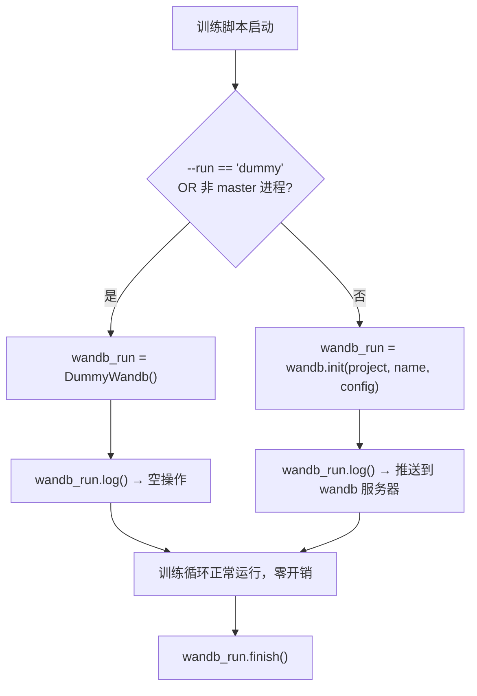
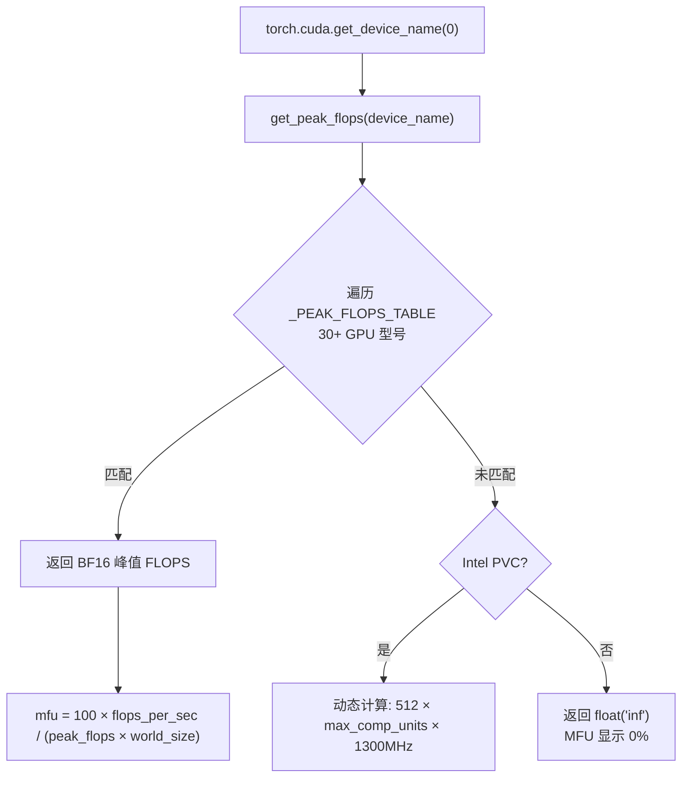
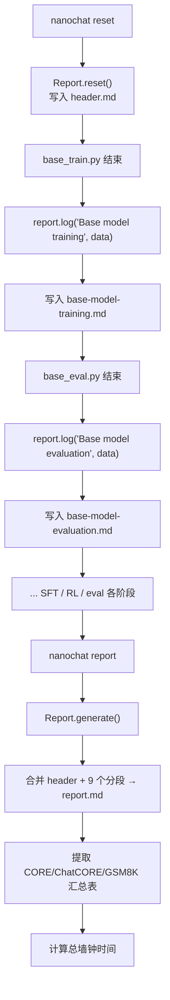

# PD-11.46 nanochat — wandb 训练全程可观测与 MFU/成本自动报告

> 文档编号：PD-11.46
> 来源：nanochat `nanochat/common.py` `nanochat/report.py` `scripts/base_train.py`
> GitHub：https://github.com/karpathy/nanochat.git
> 问题域：PD-11 可观测性 Observability & Cost Tracking
> 状态：可复用方案

---

## 第 1 章 问题与动机

### 1.1 核心问题

LLM 训练是一个长时间、高成本的过程。一次 8×H100 的训练可能持续数小时，消耗数千美元的 GPU 算力。如果缺乏实时可观测性，开发者面临三个核心风险：

1. **训练质量不可见**：loss 是否在下降？模型是否在学习？bpb（bits per byte）是否收敛？
2. **硬件利用率不透明**：GPU 是否被充分利用？MFU（Model FLOPs Utilization）是多少？是否存在 I/O 瓶颈？
3. **成本失控**：训练花了多少钱？每小时成本是多少？能否在训练结束后生成一份完整的成本报告？

对于分布式训练（DDP），还需要解决日志隔离问题——只有 rank 0 应该输出日志和写报告，其他 rank 保持静默。

### 1.2 nanochat 的解法概述

nanochat 采用三层可观测性架构：

1. **wandb 实时追踪**（`scripts/base_train.py:538-550`）：每 100 步将 loss/lrm/dt/tok_per_sec/mfu 等指标推送到 wandb，支持实时 Dashboard 可视化
2. **终端结构化日志**（`scripts/base_train.py:537`）：每步打印格式化的训练状态行，包含进度百分比、ETA、epoch 等
3. **Markdown 训练报告**（`nanochat/report.py:244-369`）：Report 类在训练各阶段（tokenizer/base/sft/rl/eval）写入分段 Markdown，最终合并为完整报告，包含硬件信息、bloat 指标、成本估算、最终评估分数汇总表

关键设计亮点：
- **DummyWandb 优雅降级**（`nanochat/common.py:195-202`）：当 `--run=dummy` 或非 master 进程时，用空操作替代 wandb 调用，零开销
- **GPU 峰值 FLOPS 硬编码表**（`nanochat/common.py:207-258`）：覆盖 NVIDIA Blackwell/Hopper/Ampere/Ada + AMD CDNA + 消费级 RTX，未知 GPU 返回 inf 使 MFU 显示 0% 而非错误值
- **成本估算**（`nanochat/report.py:89-118`）：基于 Lambda Cloud 定价表，按 GPU 型号×数量×运行时长估算总成本

### 1.3 设计思想

| 设计原则 | 具体实现 | 理由 | 替代方案 |
|----------|----------|------|----------|
| 零开销默认关闭 | DummyWandb 空操作类 | 非 master 进程和本地调试不应有 wandb 开销 | 条件 if 判断（代码侵入性高） |
| 硬件感知 MFU | get_peak_flops() 硬编码 30+ GPU 型号 | MFU 需要理论峰值 FLOPS，无法运行时测量 | 运行时 benchmark（耗时且不稳定） |
| 分段式报告 | Report.log() 按阶段写入独立 .md 文件 | 训练流水线各阶段独立，崩溃不丢失已完成阶段 | 单文件追加（崩溃可能损坏整个报告） |
| Rank 0 独占日志 | print0() + DummyReport | DDP 多进程只需一份日志 | 每个 rank 独立日志（冗余且混乱） |
| 未知 GPU 安全降级 | 返回 float('inf') 使 MFU=0% | 比抛异常或猜测更安全 | 抛出 ValueError（中断训练） |

---

## 第 2 章 源码实现分析

### 2.1 架构概览

nanochat 的可观测性系统由三个独立层组成，各自负责不同的数据消费场景：

```
┌─────────────────────────────────────────────────────────────────┐
│                    Training Loop (base_train.py)                │
│                                                                 │
│  每步计算: loss, tok/sec, MFU, ETA                              │
│     │              │                │                           │
│     ▼              ▼                ▼                           │
│  ┌──────┐   ┌───────────┐   ┌──────────────┐                   │
│  │print0│   │wandb_run  │   │Report.log()  │                   │
│  │终端行 │   │.log()     │   │分段 Markdown │                   │
│  └──────┘   └───────────┘   └──────────────┘                   │
│     │              │                │                           │
│     ▼              ▼                ▼                           │
│  终端实时     wandb Dashboard    report.md                      │
│  (人类即时)   (远程可视化)       (训练结束后归档)                 │
└─────────────────────────────────────────────────────────────────┘

DummyWandb / DummyReport: 非 master 进程的空操作替身
get_peak_flops(): 30+ GPU 型号的 BF16 峰值 FLOPS 查找表
estimate_cost(): Lambda Cloud 定价 × GPU 数量 × 运行时长
```

### 2.2 核心实现

#### 2.2.1 DummyWandb 优雅降级模式



对应源码 `nanochat/common.py:195-202`：

```python
class DummyWandb:
    """Useful if we wish to not use wandb but have all the same signatures"""
    def __init__(self):
        pass
    def log(self, *args, **kwargs):
        pass
    def finish(self):
        pass
```

初始化逻辑 `scripts/base_train.py:100-101`：

```python
use_dummy_wandb = args.run == "dummy" or not master_process
wandb_run = DummyWandb() if use_dummy_wandb else wandb.init(
    project="nanochat", name=args.run, config=user_config
)
```

这个模式的精妙之处在于：训练循环中所有 `wandb_run.log()` 调用无需任何条件判断，DummyWandb 通过鸭子类型（duck typing）静默吞掉所有调用。同样的模式也用于 Report（`DummyReport`，`nanochat/report.py:394-398`）和 print（`print0`，`nanochat/common.py:97-100`），确保只有 rank 0 产生输出。

#### 2.2.2 GPU 峰值 FLOPS 查找表与 MFU 计算



对应源码 `nanochat/common.py:207-258`：

```python
def get_peak_flops(device_name: str) -> float:
    name = device_name.lower()
    _PEAK_FLOPS_TABLE = (
        # NVIDIA Blackwell
        (["gb200"], 2.5e15),
        (["b200"], 2.25e15),
        (["b100"], 1.8e15),
        # NVIDIA Hopper
        (["h200", "nvl"], 836e12),
        (["h100"], 989e12),
        # NVIDIA Ampere
        (["a100"], 312e12),
        # AMD CDNA
        (["mi300x"], 1.3074e15),
        # Consumer RTX
        (["5090"], 209.5e12),
        (["4090"], 165.2e12),
        (["3090"], 71e12),
    )
    for patterns, flops in _PEAK_FLOPS_TABLE:
        if all(p in name for p in patterns):
            return flops
    # Unknown GPU - return inf so MFU shows as 0%
    logger.warning(f"Peak flops undefined for: {device_name}, MFU will show as 0%")
    return float('inf')
```

MFU 计算在训练循环中 `scripts/base_train.py:522-524`：

```python
tok_per_sec = int(total_batch_size / dt)
flops_per_sec = num_flops_per_token * total_batch_size / dt
mfu = 100 * flops_per_sec / (gpu_peak_flops * ddp_world_size)
```

其中 `num_flops_per_token` 由模型自身计算（`nanochat/gpt.py:292-317`），考虑了滑动窗口注意力的有效序列长度差异。


#### 2.2.3 wandb 指标推送策略

训练循环中的 wandb 日志分为两类频率：

**高频指标**（每 100 步，`scripts/base_train.py:538-550`）：

```python
if step % 100 == 0:
    log_data = {
        "step": step,
        "total_training_flops": flops_so_far,
        "total_training_time": total_training_time,
        "train/loss": debiased_smooth_loss,
        "train/lrm": lrm,
        "train/dt": dt,
        "train/tok_per_sec": tok_per_sec,
        "train/mfu": mfu,
        "train/epoch": epoch,
    }
    wandb_run.log(log_data)
```

**低频指标**（eval 时，`scripts/base_train.py:413-418` 和 `430-435`）：

```python
# 验证 bpb（每 eval_every 步）
wandb_run.log({
    "step": step,
    "total_training_flops": flops_so_far,
    "total_training_time": total_training_time,
    "val/bpb": val_bpb,
})

# CORE 评估指标（每 core_metric_every 步）
wandb_run.log({
    "step": step,
    "total_training_flops": flops_so_far,
    "core_metric": results["core_metric"],
    "centered_results": results["centered_results"],
})
```

关键设计：所有 wandb log 都包含 `step` 和 `total_training_flops` 作为 x 轴，支持按步数或按计算量对齐不同实验的曲线。

### 2.3 实现细节

#### 2.3.1 Report 分段式 Markdown 报告系统

Report 类（`nanochat/report.py:244-369`）采用分段写入 + 最终合并的架构：



Report.log() 方法（`nanochat/report.py:251-277`）支持混合数据类型：

```python
def log(self, section, data):
    slug = slugify(section)
    file_path = os.path.join(self.report_dir, f"{slug}.md")
    with open(file_path, "w", encoding="utf-8") as f:
        f.write(f"## {section}\n")
        f.write(f"timestamp: {datetime.datetime.now().strftime('%Y-%m-%d %H:%M:%S')}\n\n")
        for item in data:
            if not item:
                continue
            if isinstance(item, str):
                f.write(item)       # 直接写入字符串
            else:
                for k, v in item.items():
                    if isinstance(v, float):
                        vstr = f"{v:.4f}"
                    elif isinstance(v, int) and v >= 10000:
                        vstr = f"{v:,.0f}"
                    else:
                        vstr = str(v)
                    f.write(f"- {k}: {vstr}\n")
```

#### 2.3.2 Bloat 指标：代码库健康度量

`generate_header()`（`nanochat/report.py:166-198`）自动统计 git 跟踪的源文件的行数、字符数、估算 token 数和依赖数量：

```python
extensions = ['py', 'md', 'rs', 'html', 'toml', 'sh']
git_patterns = ' '.join(f"'*.{ext}'" for ext in extensions)
files_output = run_command(f"git ls-files -- {git_patterns}")
# ...
num_tokens = num_chars // 4  # assume approximately 4 chars per token
```

这是一个独特的可观测性维度——不仅追踪模型训练指标，还追踪代码库本身的"膨胀度"，帮助团队保持代码精简。

#### 2.3.3 成本估算

`estimate_cost()`（`nanochat/report.py:89-118`）基于 Lambda Cloud 定价：

```python
gpu_hourly_rates = {
    "H100": 3.00,
    "A100": 1.79,
    "V100": 0.55,
}
# 默认 $2.00/GPU/hour
hourly_rate = rate * gpu_info["count"]
estimated_total = hourly_rate * runtime_hours
```

#### 2.3.4 EMA 平滑与去偏

训练 loss 使用指数移动平均（EMA）平滑（`scripts/base_train.py:518-520`）：

```python
ema_beta = 0.9
smooth_train_loss = ema_beta * smooth_train_loss + (1 - ema_beta) * train_loss_f
debiased_smooth_loss = smooth_train_loss / (1 - ema_beta**(step + 1))
```

去偏（debiasing）修正了 EMA 在训练初期的低估问题，确保第一步的 smooth loss 就等于实际 loss。

#### 2.3.5 BPB（Bits Per Byte）指标

nanochat 使用 bpb 而非传统的 loss 作为评估指标（`nanochat/loss_eval.py:9-65`），这是一个 tokenizer 无关的指标——改变词表大小不影响 bpb 值，使得不同 tokenizer 配置的实验可以直接对比。

---

## 第 3 章 迁移指南

### 3.1 迁移清单

**阶段 1：DummyWandb 模式（30 分钟）**
- [ ] 复制 `DummyWandb` 类到项目的 common 模块
- [ ] 在训练脚本入口添加 `--run` 参数控制 wandb 开关
- [ ] 用 `wandb_run = DummyWandb() if ... else wandb.init(...)` 初始化

**阶段 2：MFU 计算（1-2 小时）**
- [ ] 复制 `get_peak_flops()` 函数，根据项目支持的 GPU 型号裁剪表
- [ ] 在模型类中实现 `estimate_flops()` 方法
- [ ] 在训练循环中计算 `mfu = flops_per_sec / (peak_flops * world_size)`

**阶段 3：Report 系统（2-3 小时）**
- [ ] 复制 `Report` 类和 `DummyReport` 类
- [ ] 定义项目的 `EXPECTED_FILES` 分段列表
- [ ] 在各训练阶段末尾调用 `report.log(section, data)`
- [ ] 实现 `report.generate()` 合并逻辑

### 3.2 适配代码模板

#### 最小可用版本：DummyWandb + MFU

```python
"""minimal_observability.py — 可直接复用的最小可观测性模块"""
import logging
import torch

logger = logging.getLogger(__name__)

class DummyWandb:
    """wandb 的空操作替身，用于非 master 进程或本地调试"""
    def log(self, *args, **kwargs): pass
    def finish(self): pass

# GPU BF16 峰值 FLOPS 查找表（按需裁剪）
_PEAK_FLOPS = {
    "h100": 989e12, "h200": 989e12,
    "a100": 312e12, "4090": 165.2e12,
    "3090": 71e12,
}

def get_peak_flops(device_name: str) -> float:
    name = device_name.lower()
    for key, flops in _PEAK_FLOPS.items():
        if key in name:
            return flops
    logger.warning(f"Unknown GPU: {device_name}, MFU will show 0%")
    return float('inf')

def compute_mfu(
    num_flops_per_token: int,
    total_batch_size: int,
    dt: float,
    peak_flops: float,
    world_size: int = 1,
) -> float:
    """计算 Model FLOPs Utilization (%)"""
    flops_per_sec = num_flops_per_token * total_batch_size / dt
    return 100 * flops_per_sec / (peak_flops * world_size)

def init_wandb(run_name: str, project: str, config: dict, is_master: bool = True):
    """初始化 wandb，支持优雅降级"""
    if run_name == "dummy" or not is_master:
        return DummyWandb()
    import wandb
    return wandb.init(project=project, name=run_name, config=config)
```

#### Report 系统模板

```python
"""training_report.py — 分段式 Markdown 训练报告"""
import os
import datetime

class TrainingReport:
    def __init__(self, report_dir: str):
        os.makedirs(report_dir, exist_ok=True)
        self.report_dir = report_dir

    def log(self, section: str, data: list[dict | str]):
        slug = section.lower().replace(" ", "-")
        path = os.path.join(self.report_dir, f"{slug}.md")
        with open(path, "w", encoding="utf-8") as f:
            f.write(f"## {section}\n")
            f.write(f"timestamp: {datetime.datetime.now():%Y-%m-%d %H:%M:%S}\n\n")
            for item in data:
                if isinstance(item, str):
                    f.write(item)
                elif isinstance(item, dict):
                    for k, v in item.items():
                        f.write(f"- {k}: {v}\n")

    def generate(self, sections: list[str]) -> str:
        report_path = os.path.join(self.report_dir, "report.md")
        with open(report_path, "w") as out:
            for section in sections:
                path = os.path.join(self.report_dir, f"{section}.md")
                if os.path.exists(path):
                    out.write(open(path).read() + "\n")
        return report_path

class DummyReport:
    def log(self, *a, **kw): pass
    def generate(self, *a, **kw): return ""
```

### 3.3 适用场景

| 场景 | 适用度 | 说明 |
|------|--------|------|
| 单 GPU 训练实验 | ⭐⭐⭐ | DummyWandb 零开销，MFU 直接可用 |
| 多 GPU DDP 训练 | ⭐⭐⭐ | rank 0 独占日志模式天然适配 |
| 多阶段训练流水线 | ⭐⭐⭐ | Report 分段写入 + 合并完美匹配 |
| Agent/LLM 推理服务 | ⭐⭐ | MFU 不适用，但 DummyWandb 模式和 Report 可复用 |
| 实时告警需求 | ⭐ | nanochat 无告警机制，需额外集成 |

---

## 第 4 章 测试用例

```python
"""test_nanochat_observability.py — 基于 nanochat 真实接口的测试"""
import math
import pytest
from unittest.mock import patch, MagicMock

# ---- DummyWandb 测试 ----

class DummyWandb:
    def __init__(self): pass
    def log(self, *args, **kwargs): pass
    def finish(self): pass

class TestDummyWandb:
    def test_log_accepts_any_args(self):
        w = DummyWandb()
        w.log({"loss": 0.5, "step": 1})
        w.log({"mfu": 42.0}, step=100, commit=True)

    def test_finish_is_noop(self):
        w = DummyWandb()
        w.finish()  # should not raise

    def test_duck_typing_with_real_wandb_interface(self):
        """DummyWandb 必须支持与 wandb.init() 返回值相同的方法签名"""
        w = DummyWandb()
        assert callable(w.log)
        assert callable(w.finish)

# ---- get_peak_flops 测试 ----

def get_peak_flops(device_name: str) -> float:
    name = device_name.lower()
    _TABLE = (
        (["h100"], 989e12), (["a100"], 312e12),
        (["4090"], 165.2e12), (["3090"], 71e12),
    )
    for patterns, flops in _TABLE:
        if all(p in name for p in patterns):
            return flops
    return float('inf')

class TestGetPeakFlops:
    def test_known_gpu_h100(self):
        assert get_peak_flops("NVIDIA H100 80GB HBM3") == 989e12

    def test_known_gpu_a100(self):
        assert get_peak_flops("NVIDIA A100-SXM4-80GB") == 312e12

    def test_unknown_gpu_returns_inf(self):
        assert get_peak_flops("Unknown GPU XYZ") == float('inf')

    def test_mfu_zero_for_unknown_gpu(self):
        """未知 GPU 的 MFU 应为 0%"""
        peak = get_peak_flops("Unknown GPU")
        mfu = 100 * 1e12 / peak
        assert mfu == 0.0

    def test_case_insensitive(self):
        assert get_peak_flops("nvidia h100 sxm") == 989e12

# ---- MFU 计算测试 ----

class TestMFUCalculation:
    def test_single_gpu_mfu(self):
        num_flops_per_token = 6e9
        total_batch_size = 524288
        dt = 1.0  # 1 second
        peak_flops = 989e12
        flops_per_sec = num_flops_per_token * total_batch_size / dt
        mfu = 100 * flops_per_sec / peak_flops
        assert 0 < mfu < 100

    def test_multi_gpu_mfu_scales(self):
        """多 GPU 的 MFU 应除以 world_size"""
        flops_per_sec = 500e12
        peak = 989e12
        mfu_1gpu = 100 * flops_per_sec / (peak * 1)
        mfu_8gpu = 100 * flops_per_sec / (peak * 8)
        assert mfu_1gpu == pytest.approx(mfu_8gpu * 8, rel=1e-6)

# ---- EMA 平滑测试 ----

class TestEMASmoothing:
    def test_debiased_ema_first_step(self):
        """去偏后第一步的 smooth loss 应等于实际 loss"""
        beta = 0.9
        smooth = 0.0
        loss = 2.5
        smooth = beta * smooth + (1 - beta) * loss
        debiased = smooth / (1 - beta ** 1)
        assert debiased == pytest.approx(loss, rel=1e-6)

    def test_ema_converges(self):
        """常数 loss 下 EMA 应收敛到该值"""
        beta = 0.9
        smooth = 0.0
        for step in range(1000):
            smooth = beta * smooth + (1 - beta) * 1.0
        debiased = smooth / (1 - beta ** 1000)
        assert debiased == pytest.approx(1.0, rel=1e-3)
```


---

## 第 5 章 跨域关联

| 关联域 | 关系类型 | 说明 |
|--------|----------|------|
| PD-01 上下文管理 | 协同 | MFU 和 tok/sec 指标直接反映上下文长度（max_seq_len）对训练效率的影响，滑动窗口注意力的 effective_seq_len 影响 FLOPs 估算 |
| PD-03 容错与重试 | 协同 | Report 分段写入机制天然支持崩溃恢复——已完成阶段的 .md 文件不会丢失；checkpoint 元数据中保存 loop_state 支持训练恢复 |
| PD-05 沙箱隔离 | 依赖 | DDP 多进程训练依赖 rank 隔离，print0/DummyWandb/DummyReport 确保只有 rank 0 产生可观测输出 |
| PD-07 质量检查 | 协同 | CORE 评估指标（每 core_metric_every 步）和 val bpb（每 eval_every 步）既是可观测性数据，也是质量检查的核心信号 |
| PD-12 推理增强 | 协同 | bpb（bits per byte）作为 tokenizer 无关的评估指标，使不同推理策略（不同 vocab size）的实验可以直接对比 |

---

## 第 6 章 来源文件索引

| 文件 | 行范围 | 关键实现 |
|------|--------|----------|
| `nanochat/common.py` | L13-47 | ColoredFormatter 彩色日志 + setup_default_logging |
| `nanochat/common.py` | L97-100 | print0() rank 0 独占打印 |
| `nanochat/common.py` | L195-202 | DummyWandb 空操作类 |
| `nanochat/common.py` | L207-258 | get_peak_flops() 30+ GPU 型号 BF16 峰值 FLOPS 表 |
| `nanochat/report.py` | L44-65 | get_gpu_info() GPU 硬件信息采集 |
| `nanochat/report.py` | L67-87 | get_system_info() 系统信息采集 |
| `nanochat/report.py` | L89-118 | estimate_cost() Lambda Cloud 定价成本估算 |
| `nanochat/report.py` | L120-199 | generate_header() 报告头 + bloat 指标 |
| `nanochat/report.py` | L244-277 | Report.log() 分段写入 |
| `nanochat/report.py` | L279-369 | Report.generate() 合并报告 + 汇总表 |
| `nanochat/report.py` | L394-408 | DummyReport + get_report() rank 0 独占 |
| `scripts/base_train.py` | L92-101 | wandb 初始化 + DummyWandb 降级 |
| `scripts/base_train.py` | L413-435 | val bpb + CORE 指标 wandb 推送 |
| `scripts/base_train.py` | L517-550 | 训练循环日志：EMA loss、MFU、tok/sec、ETA |
| `scripts/base_train.py` | L572-596 | 训练结束 Report.log() 写入 |
| `nanochat/loss_eval.py` | L9-65 | evaluate_bpb() tokenizer 无关的 bits-per-byte 评估 |
| `nanochat/gpt.py` | L292-317 | estimate_flops() 模型 FLOPs 估算（含滑动窗口） |
| `nanochat/gpt.py` | L319-341 | num_scaling_params() 参数分组计数 |

---

## 第 7 章 横向对比维度

> **重要：** 本章用于自动填充 Butcher Wiki 的横向对比表。

```json comparison_data
{
  "project": "nanochat",
  "dimensions": {
    "追踪方式": "wandb 实时推送 + 终端格式化行 + Markdown 分段报告三层并行",
    "数据粒度": "每步终端行，每 100 步 wandb，eval 时 bpb/CORE",
    "持久化": "wandb 云端 + 本地分段 .md 文件合并为 report.md",
    "多提供商": "仅 wandb，DummyWandb 优雅降级",
    "指标采集": "loss/bpb/MFU/tok_per_sec/CORE/ETA 六维指标",
    "可视化": "wandb Dashboard 远程可视化 + Markdown 汇总表",
    "成本追踪": "Lambda Cloud 定价表 × GPU 数量 × 运行时长估算",
    "日志格式": "终端彩色格式化 + Markdown 分段文件",
    "零开销路径": "DummyWandb/DummyReport/print0 三重空操作替身",
    "MFU计算": "30+ GPU 硬编码 BF16 峰值 FLOPS 表 + 滑动窗口 FLOPs 修正",
    "代码膨胀度量": "git ls-files 统计行数/字符/token/依赖数的 bloat 指标",
    "评估指标设计": "bpb 替代 loss 实现 tokenizer 无关的跨实验对比"
  }
}
```

### 域元数据补充

```json domain_metadata
{
  "solution_summary": "nanochat 通过 DummyWandb 鸭子类型降级 + 30+ GPU 硬编码 FLOPS 表计算 MFU + Report 分段 Markdown 合并，实现训练全程三层可观测",
  "description": "深度学习训练场景的硬件利用率（MFU）追踪与代码膨胀度量",
  "sub_problems": [
    "MFU 计算的 GPU 峰值 FLOPS 维护：新 GPU 发布后需手动添加到查找表",
    "bpb vs loss 指标选择：tokenizer 无关的评估指标设计使跨实验对比更公平",
    "代码膨胀度量：git 跟踪文件的行数/字符/token 统计作为项目健康信号",
    "EMA 去偏：训练初期 smooth loss 的低估修正",
    "分段报告崩溃安全：各阶段独立 .md 文件避免单文件追加的损坏风险"
  ],
  "best_practices": [
    "用 DummyXxx 鸭子类型替代条件判断：DummyWandb/DummyReport/print0 三重模式消除日志代码中的 if 分支",
    "未知 GPU 返回 inf 而非抛异常：MFU 显示 0% 比中断训练更安全",
    "wandb log 始终包含 step + total_training_flops 双 x 轴：支持按步数或按计算量对齐不同实验",
    "bpb 替代 loss 作为评估指标：消除 vocab size 对损失值的影响，跨 tokenizer 可比",
    "训练前 10 步不计入 total_training_time：排除编译预热对 ETA 估算的干扰"
  ]
}
```
