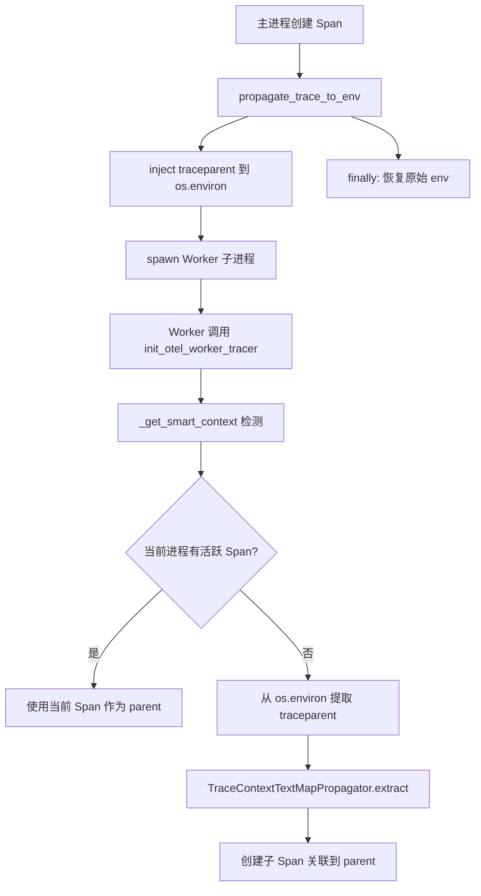
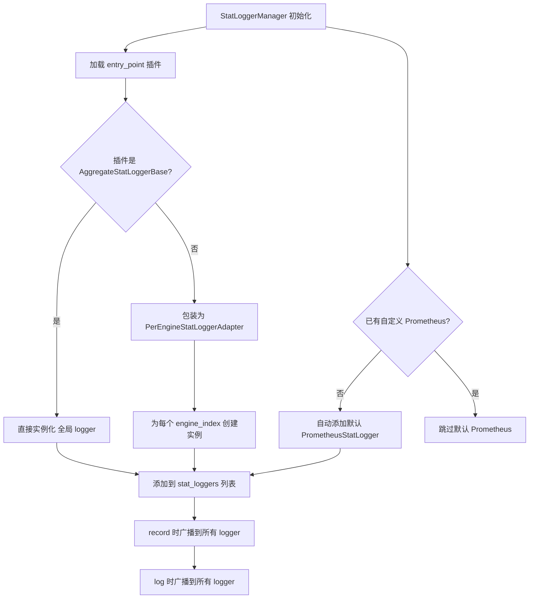

# PD-11.20 vLLM — Prometheus 多进程指标与 OTel 分布式追踪全栈可观测

> 文档编号：PD-11.20
> 来源：vLLM `vllm/tracing/otel.py`, `vllm/v1/metrics/loggers.py`, `vllm/config/observability.py`
> GitHub：https://github.com/vllm-project/vllm.git
> 问题域：PD-11 可观测性 Observability & Cost Tracking
> 状态：可复用方案

---

## 第 1 章 问题与动机

### 1.1 核心问题

高性能 LLM 推理引擎面临独特的可观测性挑战：

1. **多进程指标聚合**：vLLM 使用多 Worker 进程（GPU Worker、DP Engine）并行推理，Prometheus 默认的单进程 Registry 无法跨进程聚合指标
2. **分布式追踪传播**：主进程 spawn Worker 子进程时，OTel trace context 需要跨进程边界传播，标准 in-process context propagation 失效
3. **推理特有指标**：传统 Web 服务指标（QPS/延迟）不够，需要 TTFT（Time To First Token）、ITL（Inter-Token Latency）、KV Cache 命中率、MFU（Model FLOPs Utilization）等推理专属指标
4. **可插拔扩展**：不同部署场景需要不同的指标后端（Prometheus、自定义 StatLogger、第三方 APM），需要插件化架构
5. **零开销默认关闭**：大多数用户不需要详细追踪，OTel SDK 初始化和 span 创建不能拖慢推理热路径

### 1.2 vLLM 的解法概述

1. **Prometheus 多进程模式**：通过 `PROMETHEUS_MULTIPROC_DIR` 临时目录 + `MultiProcessCollector` 实现跨进程指标聚合，自动管理生命周期（`vllm/v1/metrics/prometheus.py:17-36`）
2. **环境变量 trace context 传播**：将 W3C `traceparent`/`tracestate` 注入 `os.environ`，子进程通过环境变量继承 trace context（`vllm/tracing/otel.py:240-265`）
3. **三层 StatLogger 架构**：`StatLoggerBase` → `AggregateStatLoggerBase` → `StatLoggerManager`，支持 per-engine 和 aggregated 两种模式（`vllm/v1/metrics/loggers.py:40-64`）
4. **Decorator 式透明插桩**：`@instrument` 装饰器自动为 sync/async 函数创建 span，预计算静态属性避免运行时开销（`vllm/tracing/otel.py:134-180`）
5. **可插拔后端注册表**：`_REGISTERED_TRACING_BACKENDS` 字典支持多追踪后端注册，当前实现 OTel，预留扩展点（`vllm/tracing/__init__.py:46-63`）

### 1.3 设计思想

| 设计原则 | 具体实现 | 理由 | 替代方案 |
|----------|----------|------|----------|
| 零开销默认关闭 | OTel 依赖 try/except 导入，`_IS_OTEL_AVAILABLE` 全局标志 | 未安装 OTel 包时零开销，不影响推理性能 | 始终加载 OTel SDK（增加启动时间和内存） |
| 环境变量跨进程传播 | `propagate_trace_to_env()` context manager 注入/恢复 env | Worker 进程通过 `os.environ` 继承 trace，无需 IPC | gRPC/HTTP 传播（需要额外网络开销） |
| 插件化指标后端 | `entry_points` 组 `vllm.stat_logger_plugins` | 用户可通过 pip 包注册自定义 StatLogger | 硬编码后端列表（不可扩展） |
| 多进程安全 | `TemporaryDirectory` 自动清理 + `mark_process_dead` | 避免 Prometheus 指标文件残留导致数据不准 | 手动管理目录（易出错） |
| 采样控制开销 | KV Cache 指标默认 1% 采样率 `kv_cache_metrics_sample=0.01` | 高频 eviction 事件全量记录会拖慢调度器 | 全量记录（性能不可接受） |

---

## 第 2 章 源码实现分析

### 2.1 架构概览

vLLM 的可观测性栈分为四个层次：

```
┌─────────────────────────────────────────────────────────────────┐
│                    API / Entrypoint Layer                        │
│  RequestLogger (输入/输出日志) + usage_lib (匿名使用统计)         │
├─────────────────────────────────────────────────────────────────┤
│                   StatLoggerManager (聚合层)                     │
│  ┌──────────────────┐  ┌──────────────────┐  ┌───────────────┐ │
│  │ LoggingStatLogger│  │PrometheusStatLog │  │ Plugin Logger │ │
│  │  (stdout 日志)   │  │  (Prom 指标)     │  │ (entry_point) │ │
│  └──────────────────┘  └──────────────────┘  └───────────────┘ │
├─────────────────────────────────────────────────────────────────┤
│                   Stats Collection Layer                         │
│  SchedulerStats + IterationStats + FinishedRequestStats          │
│  CachingMetrics (滑动窗口) + PerfStats (MFU)                    │
├─────────────────────────────────────────────────────────────────┤
│                   Tracing Layer (OTel)                           │
│  @instrument decorator + manual_instrument + env propagation     │
│  TracerProvider → BatchSpanProcessor → OTLP gRPC/HTTP Exporter  │
└─────────────────────────────────────────────────────────────────┘
```

### 2.2 核心实现

#### 2.2.1 Prometheus 多进程指标聚合

```mermaid
graph TD
    A[vLLM 启动] --> B{PROMETHEUS_MULTIPROC_DIR 已设置?}
    B -->|否| C[创建 TemporaryDirectory]
    C --> D[设置环境变量]
    B -->|是| E[警告用户需手动清理]
    D --> F[Worker 进程继承 env]
    E --> F
    F --> G[各进程写入独立 .db 文件]
    G --> H[/metrics 端点请求]
    H --> I[MultiProcessCollector 聚合所有 .db]
    I --> J[返回合并指标]
    G --> K[进程退出]
    K --> L[mark_process_dead 清理]
    L --> M[TemporaryDirectory 自动删除]
```

对应源码 `vllm/v1/metrics/prometheus.py:17-53`：

```python
def setup_multiprocess_prometheus():
    """Set up prometheus multiprocessing directory if not already configured."""
    global _prometheus_multiproc_dir

    if "PROMETHEUS_MULTIPROC_DIR" not in os.environ:
        _prometheus_multiproc_dir = tempfile.TemporaryDirectory()
        os.environ["PROMETHEUS_MULTIPROC_DIR"] = _prometheus_multiproc_dir.name
        logger.debug(
            "Created PROMETHEUS_MULTIPROC_DIR at %s", _prometheus_multiproc_dir.name
        )
    else:
        logger.warning(
            "Found PROMETHEUS_MULTIPROC_DIR was set by user. "
            "This directory must be wiped between vLLM runs or "
            "you will find inaccurate metrics."
        )

def get_prometheus_registry() -> CollectorRegistry:
    if os.getenv("PROMETHEUS_MULTIPROC_DIR") is not None:
        registry = CollectorRegistry()
        multiprocess.MultiProcessCollector(registry)
        return registry
    return REGISTRY
```

关键设计：`TemporaryDirectory` 作为全局变量持有引用，`atexit` 时自动清理。`shutdown_prometheus()` 在进程退出前调用 `mark_process_dead` 标记当前 PID 的指标文件为已死亡，防止聚合时包含过期数据。

#### 2.2.2 OTel 跨进程 Trace 传播



对应源码 `vllm/tracing/otel.py:216-265`：

```python
def _get_smart_context() -> Context | None:
    """
    Determines the parent context.
    1. If a Span is already active in this process, use it.
    2. If not, extract from os.environ, handling case-sensitivity mismatch.
    """
    current_span = trace.get_current_span()
    if current_span.get_span_context().is_valid:
        return None  # 使用当前活跃 span

    carrier = {}
    if tp := os.environ.get("traceparent", os.environ.get("TRACEPARENT")):
        carrier["traceparent"] = tp
    if ts := os.environ.get("tracestate", os.environ.get("TRACESTATE")):
        carrier["tracestate"] = ts
    if not carrier:
        carrier = dict(os.environ)

    return TraceContextTextMapPropagator().extract(carrier)

@contextmanager
def propagate_trace_to_env():
    """Temporarily injects current OTel context into os.environ."""
    if not _IS_OTEL_AVAILABLE:
        yield
        return
    original_state = {k: os.environ.get(k) for k in TRACE_HEADERS}
    try:
        inject(os.environ)
        yield
    finally:
        for key, original_value in original_state.items():
            if original_value is None:
                os.environ.pop(key, None)
            else:
                os.environ[key] = original_value
```

关键设计：`_get_smart_context` 实现了双路径检测——优先使用进程内活跃 span，回退到环境变量。`propagate_trace_to_env` 是 context manager，在 `finally` 中恢复原始环境变量，避免污染后续操作。

#### 2.2.3 可插拔 StatLogger 架构



对应源码 `vllm/v1/metrics/loggers.py:40-84`：

```python
class StatLoggerBase(ABC):
    """Interface for logging metrics. API users may define custom loggers."""

    @abstractmethod
    def __init__(self, vllm_config: VllmConfig, engine_index: int = 0): ...

    @abstractmethod
    def record(
        self,
        scheduler_stats: SchedulerStats | None,
        iteration_stats: IterationStats | None,
        mm_cache_stats: MultiModalCacheStats | None = None,
        engine_idx: int = 0,
    ): ...

    @abstractmethod
    def log_engine_initialized(self): ...

def load_stat_logger_plugin_factories() -> list[StatLoggerFactory]:
    factories: list[StatLoggerFactory] = []
    for name, plugin_class in load_plugins_by_group(
        STAT_LOGGER_PLUGINS_GROUP
    ).items():
        if not isinstance(plugin_class, type) or not issubclass(
            plugin_class, StatLoggerBase
        ):
            raise TypeError(
                f"Stat logger plugin {name!r} must be a subclass of StatLoggerBase"
            )
        factories.append(plugin_class)
    return factories
```

### 2.3 实现细节

**推理专属指标体系**（`vllm/v1/metrics/loggers.py:389-1204`）：

PrometheusStatLogger 注册了 30+ 个指标，按类别组织：

| 类别 | 指标示例 | 类型 |
|------|----------|------|
| 调度器状态 | `vllm:num_requests_running/waiting` | Gauge |
| Token 吞吐 | `vllm:prompt_tokens`, `vllm:generation_tokens` | Counter |
| Token 来源 | `vllm:prompt_tokens_by_source{source=local_compute/local_cache_hit/external_kv_transfer}` | Counter |
| 延迟分布 | `vllm:time_to_first_token_seconds`, `vllm:inter_token_latency_seconds` | Histogram |
| 请求生命周期 | `vllm:e2e_request_latency_seconds`, `vllm:request_queue_time_seconds` | Histogram |
| KV Cache | `vllm:kv_cache_usage_perc`, `vllm:prefix_cache_hits/queries` | Gauge/Counter |
| KV 驻留 | `vllm:kv_block_lifetime_seconds`, `vllm:kv_block_reuse_gap_seconds` | Histogram |
| MFU | `vllm:estimated_flops_per_gpu_total`, `vllm:estimated_read_bytes_per_gpu_total` | Counter |
| 引擎状态 | `vllm:engine_sleep_state{sleep_state=awake/weights_offloaded/discard_all}` | Gauge |

**直方图桶定制**：延迟类指标使用精细桶（1ms-2560s），token 数量类使用 1-2-5 序列桶（`build_1_2_5_buckets`），KV 驻留类使用对数桶（1ms-1800s）。

**滑动窗口缓存命中率**（`vllm/v1/metrics/stats.py:35-111`）：`CachingMetrics` 使用 deque 维护最近 1000 个请求的命中统计，避免全量累积导致早期数据稀释近期趋势。

**MFU 分析式计算**（`vllm/v1/metrics/perf.py:960-1091`）：`ModelMetrics` 通过 `ComponentMetrics` 注册表（Attention/FFN/Unembed）解析模型配置，按 batch 的 prefill/decode 分别计算理论 FLOPs 和内存带宽，支持 TP/PP/EP 并行度修正。

---

## 第 3 章 迁移指南

### 3.1 迁移清单

**阶段 1：Prometheus 多进程指标**
- [ ] 安装 `prometheus_client` 依赖
- [ ] 在主进程启动时调用 `setup_multiprocess_prometheus()`
- [ ] 在进程退出时调用 `shutdown_prometheus()`
- [ ] 定义 `StatLoggerBase` 子类实现 `record()` 和 `log()`
- [ ] 使用 `make_per_engine()` 为每个 worker 创建带 label 的指标

**阶段 2：OTel 分布式追踪**
- [ ] 安装 `opentelemetry-api`, `opentelemetry-sdk`, `opentelemetry-exporter-otlp`
- [ ] 实现 `init_tracer()` 初始化 TracerProvider
- [ ] 在 spawn 子进程前使用 `propagate_trace_to_env()` 注入 context
- [ ] 子进程中调用 `init_worker_tracer()` 从环境变量恢复 context
- [ ] 使用 `@instrument` 装饰器标注关键函数

**阶段 3：可插拔扩展**
- [ ] 定义 `entry_points` 组注册自定义 StatLogger
- [ ] 实现 `AggregateStatLoggerBase` 支持多 engine 聚合

### 3.2 适配代码模板

**多进程 Prometheus 指标管理器：**

```python
import os
import tempfile
import atexit
from prometheus_client import (
    Counter, Gauge, Histogram, CollectorRegistry,
    multiprocess, REGISTRY
)

class MultiProcessMetrics:
    """可复用的多进程 Prometheus 指标管理器。"""

    def __init__(self):
        self._tmpdir = None

    def setup(self):
        if "PROMETHEUS_MULTIPROC_DIR" not in os.environ:
            self._tmpdir = tempfile.TemporaryDirectory()
            os.environ["PROMETHEUS_MULTIPROC_DIR"] = self._tmpdir.name
            atexit.register(self.shutdown)

    def get_registry(self) -> CollectorRegistry:
        if os.getenv("PROMETHEUS_MULTIPROC_DIR"):
            registry = CollectorRegistry()
            multiprocess.MultiProcessCollector(registry)
            return registry
        return REGISTRY

    def shutdown(self):
        if self._tmpdir:
            try:
                pid = os.getpid()
                multiprocess.mark_process_dead(pid, self._tmpdir.name)
            except Exception:
                pass
```

**跨进程 OTel Trace 传播：**

```python
import os
from contextlib import contextmanager

TRACE_HEADERS = ["traceparent", "tracestate"]

@contextmanager
def propagate_trace_to_subprocess():
    """注入当前 trace context 到环境变量，供子进程继承。"""
    try:
        from opentelemetry.propagate import inject
        original = {k: os.environ.get(k) for k in TRACE_HEADERS}
        try:
            inject(os.environ)
            yield
        finally:
            for key, val in original.items():
                if val is None:
                    os.environ.pop(key, None)
                else:
                    os.environ[key] = val
    except ImportError:
        yield  # OTel 未安装时透传
```

### 3.3 适用场景

| 场景 | 适用度 | 说明 |
|------|--------|------|
| 多进程 GPU 推理服务 | ⭐⭐⭐ | 完美匹配：多 Worker + Prometheus + OTel |
| 单进程 API 服务 | ⭐⭐ | 多进程部分可简化，StatLogger 架构仍有价值 |
| Agent 编排系统 | ⭐⭐ | 环境变量传播适合 subprocess 场景，不适合 HTTP 微服务 |
| 训练框架 | ⭐ | MFU 计算逻辑可复用，但指标体系需大幅调整 |
| 边缘部署 | ⭐⭐⭐ | 零开销默认关闭 + 采样控制适合资源受限环境 |

---

## 第 4 章 测试用例

```python
import os
import time
import pytest
from unittest.mock import MagicMock, patch
from collections import deque
from dataclasses import dataclass


class TestCachingMetrics:
    """测试滑动窗口缓存命中率计算。"""

    def test_hit_rate_basic(self):
        """正常路径：命中率计算。"""
        from collections import deque

        class CachingMetrics:
            def __init__(self, max_recent=1000):
                self.max_recent = max_recent
                self.agg_requests = 0
                self.agg_total = 0
                self.agg_hit = 0
                self.queue = deque()

            def observe(self, requests, queries, hits):
                if requests == 0:
                    return
                self.queue.append((requests, queries, hits))
                self.agg_requests += requests
                self.agg_total += queries
                self.agg_hit += hits
                while len(self.queue) > 1 and self.agg_requests > self.max_recent:
                    old_r, old_q, old_h = self.queue.popleft()
                    self.agg_requests -= old_r
                    self.agg_total -= old_q
                    self.agg_hit -= old_h

            @property
            def hit_rate(self):
                return self.agg_hit / self.agg_total if self.agg_total else 0.0

        m = CachingMetrics(max_recent=10)
        m.observe(5, 100, 80)
        assert m.hit_rate == 0.8

        m.observe(5, 100, 40)
        assert m.hit_rate == 0.6

        # 超过窗口，旧数据被淘汰
        m.observe(5, 100, 100)
        assert m.agg_requests <= 10

    def test_empty_stats_ignored(self):
        """边界：空统计不应进入队列。"""
        class CachingMetrics:
            def __init__(self):
                self.queue = deque()
            def observe(self, requests, queries, hits):
                if requests == 0:
                    return
                self.queue.append((requests, queries, hits))

        m = CachingMetrics()
        m.observe(0, 0, 0)
        assert len(m.queue) == 0


class TestTraceContextPropagation:
    """测试跨进程 trace context 传播。"""

    def test_env_injection_and_restore(self):
        """正常路径：注入后恢复原始环境。"""
        original_tp = os.environ.get("traceparent")
        os.environ["traceparent"] = "test-original"

        # 模拟注入
        saved = {k: os.environ.get(k) for k in ["traceparent", "tracestate"]}
        os.environ["traceparent"] = "00-injected-trace-id-01"

        # 恢复
        for key, val in saved.items():
            if val is None:
                os.environ.pop(key, None)
            else:
                os.environ[key] = val

        assert os.environ.get("traceparent") == "test-original"

        # 清理
        if original_tp is None:
            os.environ.pop("traceparent", None)
        else:
            os.environ["traceparent"] = original_tp

    def test_smart_context_fallback(self):
        """降级：无活跃 span 时从 env 提取。"""
        os.environ["traceparent"] = (
            "00-4bf92f3577b34da6a3ce929d0e0e4736-00f067aa0ba902b7-01"
        )
        # _get_smart_context 应该能从 env 提取
        tp = os.environ.get("traceparent", os.environ.get("TRACEPARENT"))
        assert tp is not None
        assert tp.startswith("00-")
        os.environ.pop("traceparent", None)


class TestPrometheusMultiprocess:
    """测试多进程 Prometheus 目录管理。"""

    def test_tmpdir_auto_creation(self):
        """正常路径：自动创建临时目录。"""
        import tempfile
        original = os.environ.pop("PROMETHEUS_MULTIPROC_DIR", None)
        try:
            tmpdir = tempfile.TemporaryDirectory()
            os.environ["PROMETHEUS_MULTIPROC_DIR"] = tmpdir.name
            assert os.path.isdir(os.environ["PROMETHEUS_MULTIPROC_DIR"])
            tmpdir.cleanup()
        finally:
            if original:
                os.environ["PROMETHEUS_MULTIPROC_DIR"] = original
            else:
                os.environ.pop("PROMETHEUS_MULTIPROC_DIR", None)
```

---

## 第 5 章 跨域关联

| 关联域 | 关系类型 | 说明 |
|--------|----------|------|
| PD-02 多 Agent 编排 | 协同 | StatLoggerManager 的多 engine 聚合模式直接服务于 DP（Data Parallel）编排，每个 EngineCore 独立上报指标 |
| PD-03 容错与重试 | 协同 | `shutdown_prometheus()` 和 `atexit.register(trace_provider.shutdown)` 确保异常退出时指标和 trace 不丢失 |
| PD-04 工具系统 | 依赖 | `entry_points` 插件机制（`vllm.stat_logger_plugins`）复用了 vLLM 的通用插件加载框架 |
| PD-01 上下文管理 | 协同 | `PromptTokenStats` 区分 `computed/local_cache_hit/external_kv_transfer` 三种 token 来源，量化 prefix caching 对上下文处理的优化效果 |
| PD-08 搜索与检索 | 协同 | KV Cache 命中率指标（`CachingMetrics` 滑动窗口）直接反映 prefix cache 检索效率 |

---

## 第 6 章 来源文件索引

| 文件 | 行范围 | 关键实现 |
|------|--------|----------|
| `vllm/tracing/otel.py` | L60-91 | `init_otel_tracer` TracerProvider 初始化 + BatchSpanProcessor |
| `vllm/tracing/otel.py` | L105-124 | `init_otel_worker_tracer` Worker 进程 tracer 初始化 |
| `vllm/tracing/otel.py` | L134-180 | `instrument_otel` Decorator 式 span 创建（sync/async） |
| `vllm/tracing/otel.py` | L183-213 | `manual_instrument_otel` 手动 span 创建（显式时间戳） |
| `vllm/tracing/otel.py` | L216-265 | `_get_smart_context` + `propagate_trace_to_env` 跨进程传播 |
| `vllm/tracing/__init__.py` | L46-63 | `_REGISTERED_TRACING_BACKENDS` 可插拔后端注册表 |
| `vllm/tracing/__init__.py` | L90-118 | `instrument` 通用装饰器（dispatch 到 OTel） |
| `vllm/tracing/utils.py` | L15-54 | `SpanAttributes` + `LoadingSpanAttributes` 语义属性常量 |
| `vllm/config/observability.py` | L18-153 | `ObservabilityConfig` Pydantic 配置（OTel/KV Cache/CUDA Graph/MFU/NVTX） |
| `vllm/v1/metrics/prometheus.py` | L17-53 | `setup_multiprocess_prometheus` + `get_prometheus_registry` |
| `vllm/v1/metrics/prometheus.py` | L55-83 | `unregister_vllm_metrics` + `shutdown_prometheus` 生命周期管理 |
| `vllm/v1/metrics/loggers.py` | L40-64 | `StatLoggerBase` 抽象接口 |
| `vllm/v1/metrics/loggers.py` | L70-84 | `load_stat_logger_plugin_factories` 插件加载 |
| `vllm/v1/metrics/loggers.py` | L95-270 | `LoggingStatLogger` stdout 日志（吞吐/KV Cache/SpecDecode） |
| `vllm/v1/metrics/loggers.py` | L389-1204 | `PrometheusStatLogger` 30+ 指标注册与记录 |
| `vllm/v1/metrics/loggers.py` | L1242-1334 | `StatLoggerManager` 多 logger 聚合管理 |
| `vllm/v1/metrics/stats.py` | L35-111 | `CachingMetrics` 滑动窗口命中率 |
| `vllm/v1/metrics/stats.py` | L171-198 | `SchedulerStats` 调度器状态数据结构 |
| `vllm/v1/metrics/stats.py` | L240-301 | `PromptTokenStats` 三来源 token 分类统计 |
| `vllm/v1/metrics/stats.py` | L303-461 | `IterationStats` 迭代级统计（TTFT/ITL/完成请求） |
| `vllm/v1/metrics/perf.py` | L59-63 | `PerfStats` FLOPs/读写字节数据结构 |
| `vllm/v1/metrics/perf.py` | L192-262 | `ComponentMetrics` 抽象基类 + 注册表 |
| `vllm/v1/metrics/perf.py` | L368-494 | `AttentionMetrics` 注意力层 FLOPs/带宽计算 |
| `vllm/v1/metrics/perf.py` | L637-888 | `FfnMetrics` FFN/MoE 层 FLOPs/带宽计算 |
| `vllm/v1/metrics/perf.py` | L960-1091 | `ModelMetrics.get_step_perf_stats_per_gpu` 每步 MFU 计算 |
| `vllm/v1/metrics/perf.py` | L1240-1315 | `PerfMetricsProm` MFU Prometheus 指标 |
| `vllm/v1/metrics/reader.py` | L70-143 | `get_metrics_snapshot` 内存指标快照 API |
| `vllm/usage/usage_lib.py` | L47-70 | `is_usage_stats_enabled` 匿名使用统计开关 |
| `vllm/entrypoints/logger.py` | L17-54 | `RequestLogger` 请求输入/输出日志 |
| `vllm/logger.py` | L41-72 | `DEFAULT_LOGGING_CONFIG` 日志格式与颜色配置 |

---

## 第 7 章 横向对比维度

```json comparison_data
{
  "project": "vLLM",
  "dimensions": {
    "追踪方式": "OTel SDK + BatchSpanProcessor，OTLP gRPC/HTTP 双协议导出",
    "数据粒度": "请求级 TTFT/ITL/E2E + 迭代级 token 吞吐 + 组件级 FLOPs/带宽",
    "持久化": "Prometheus 多进程 .db 文件 + OTel OTLP 远程导出",
    "多提供商": "可插拔 _REGISTERED_TRACING_BACKENDS + entry_points 插件 StatLogger",
    "指标采集": "Prometheus Counter/Gauge/Histogram 30+ 指标，1-2-5 序列桶",
    "Worker日志隔离": "per-engine label + PROMETHEUS_MULTIPROC_DIR 进程级隔离",
    "延迟统计": "TTFT/ITL/E2E/Queue/Prefill/Decode/Inference 七维延迟直方图",
    "缓存统计": "滑动窗口 1000 请求命中率 + KV 驻留生命周期/空闲/复用间隔",
    "Span 传播": "os.environ 注入 traceparent/tracestate，子进程自动继承",
    "零开销路径": "try/except 导入 OTel + _IS_OTEL_AVAILABLE 全局标志，未安装时零开销",
    "Decorator 插桩": "@instrument 装饰器预计算静态属性，sync/async 双模式",
    "健康端点": "engine_sleep_state Gauge 三态（awake/weights_offloaded/discard_all）",
    "进程级监控": "mark_process_dead 清理 + TemporaryDirectory 自动回收",
    "日志格式": "结构化 logging + ColoredFormatter + 可配置 stream/level/prefix",
    "日志噪声过滤": "engine_is_idle 时降级为 debug 级别，避免空闲系统日志洪泛"
  }
}
```

### 域元数据补充

```json domain_metadata
{
  "solution_summary": "vLLM 用 Prometheus MultiProcessCollector 跨 Worker 聚合 30+ 推理指标，OTel 通过 os.environ 注入 traceparent 实现跨进程 trace 传播，ComponentMetrics 注册表分析式计算 MFU",
  "description": "高性能推理引擎的多进程指标聚合与分析式 FLOPs 利用率计算",
  "sub_problems": [
    "Prometheus 多进程目录残留：用户手动设置 PROMETHEUS_MULTIPROC_DIR 后未清理导致指标不准",
    "OTel 环境变量大小写不一致：traceparent vs TRACEPARENT 在不同 OS 和容器运行时行为不同",
    "MFU 计算的量化精度：FP8/MXFP4 等量化方法的 weight_byte_size 影响理论带宽估算",
    "DP 多引擎 Histogram 聚合：多个 api_server 使用 prometheus mp 时 Histogram 可能不准确",
    "KV Cache 驻留指标采样偏差：1% 采样率在低流量场景下样本不足导致统计失真",
    "NVTX 与 CUDA Graph 互斥：layerwise NVTX tracing 不兼容 CUDA Graph 模式需运行时检测"
  ],
  "best_practices": [
    "多进程 Prometheus 用 TemporaryDirectory 自动管理生命周期，atexit 时 mark_process_dead",
    "跨进程 trace 传播用 os.environ 注入 + context manager 恢复，比 IPC 简单可靠",
    "推理指标按 1-2-5 序列构建直方图桶，覆盖 1 到 max_model_len 的完整范围",
    "空闲引擎日志降级为 debug：检测连续两个周期吞吐为零时切换日志级别",
    "MFU 用分析式公式计算而非运行时采样：按 Attention/FFN/Unembed 组件分别估算 FLOPs 和带宽"
  ]
}
```
