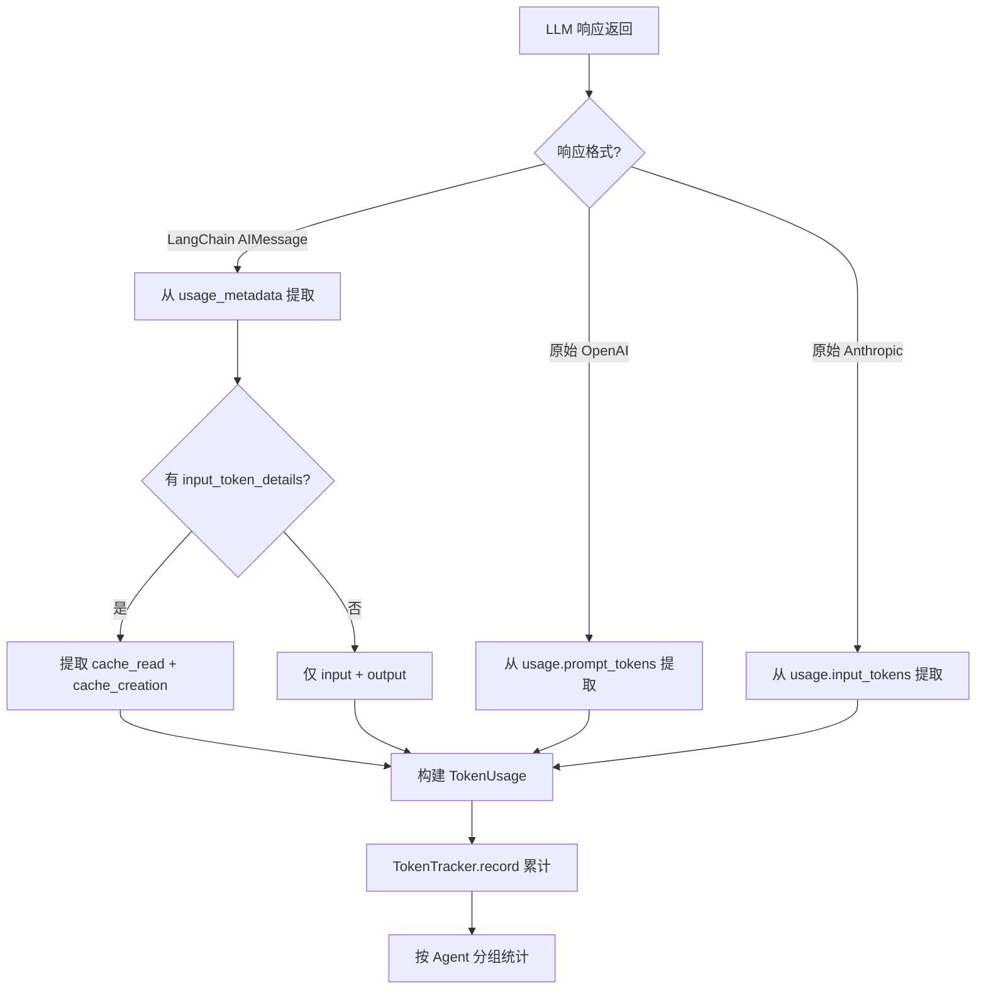
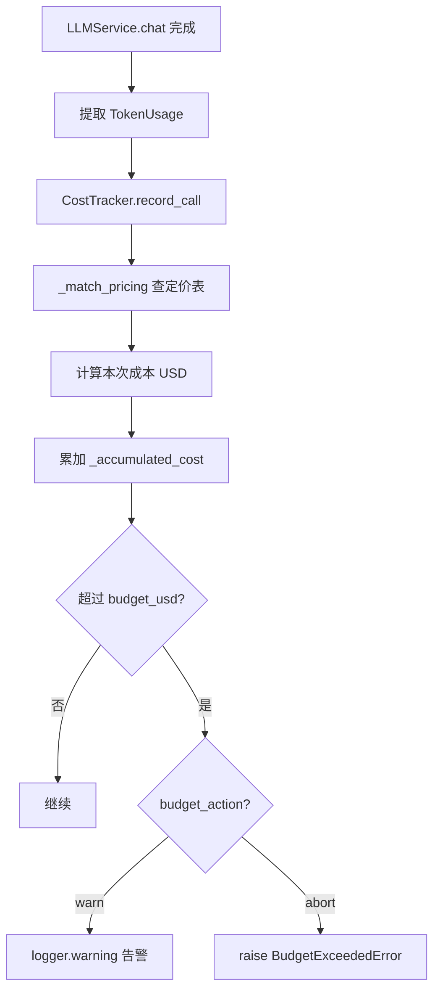
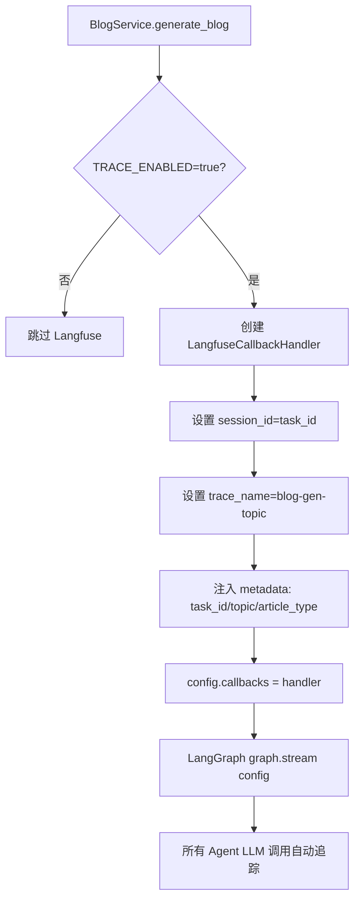

# PD-11.13 vibe-blog — Langfuse 链路追踪 + TokenTracker/CostTracker/SessionTracker 四层可观测体系

> 文档编号：PD-11.13
> 来源：vibe-blog `backend/utils/token_tracker.py` `backend/utils/cost_tracker.py` `backend/utils/session_tracker.py`
> GitHub：https://github.com/datawhalechina/vibe-blog.git
> 问题域：PD-11 可观测性 Observability & Cost Tracking
> 状态：可复用方案

---

## 第 1 章 问题与动机（≥ 30 行）

### 1.1 核心问题

多 Agent 博客生成系统中，一次完整的博客生成涉及 Researcher、Planner、Writer、Reviewer、Questioner、Deepen、Assembler 等 7+ 个 Agent 的协作，每个 Agent 可能多次调用 LLM。面临三个核心可观测性挑战：

1. **调用链路不透明**：LangGraph DAG 中多个 Agent 并行/串行执行，无法追踪每次 LLM 调用的输入/输出/耗时，出问题时难以定位是哪个 Agent 的哪次调用导致的。
2. **成本失控风险**：博客生成涉及多轮迭代（Reviewer 打分 → 修订 → 再打分），每轮都消耗 token，没有预算熔断机制可能导致单次生成成本远超预期。
3. **业务质量不可量化**：Reviewer 每轮打分、Questioner 深度评估、段落评估分数等业务指标散落在日志中，无法系统性地追踪质量趋势。

### 1.2 vibe-blog 的解法概述

vibe-blog 构建了四层可观测体系，每层解决不同粒度的问题：

1. **Langfuse 调用链追踪**（`app.py:19-31`）：通过 LangChain CallbackHandler 自动追踪每个 Agent 的 LLM 调用，零代码侵入。每个任务创建独立 handler 并设置 `session_id=task_id` 实现 trace 归组。
2. **TokenTracker 精确计量**（`token_tracker.py:34-135`）：从 LangChain AIMessage 的 `usage_metadata` 精确提取 4 种 token（input/output/cache_read/cache_write），按 Agent 分组累计，支持 OpenAI/Anthropic/国产模型三种响应格式。
3. **CostTracker 预算熔断**（`cost_tracker.py:24-109`）：基于 TokenTracker 的数据 + 硬编码定价表，实时估算 USD 成本，支持 warn/abort 两种预算超限动作。
4. **SessionTracker 业务追踪**（`session_tracker.py:36-145`）：复用 Langfuse 客户端记录 review_score、depth_score、section_quality 等业务质量分数和迭代快照。

5. **BlogTaskLog 结构化日志**（`task_log.py:35-184`）：每个 Agent 的每个步骤记录为 StepLog，含 timestamp/agent/action/duration_ms/tokens，任务完成后持久化为 JSON。

### 1.3 设计思想

| 设计原则 | 具体实现 | 理由 | 替代方案 |
|----------|----------|------|----------|
| 零侵入追踪 | Langfuse CallbackHandler 注入 LangGraph config["callbacks"] | Agent 代码无需修改，自动追踪所有 LLM 调用 | 手动在每个 Agent 中埋点（侵入性强） |
| 四种 token 精确提取 | 从 usage_metadata 提取 input/output/cache_read/cache_write | 缓存 token 计费规则不同，粗估误差 30%+ | len(content)/1.5 字符估算（误差大） |
| 预算熔断双模式 | warn 仅告警 + abort 抛 BudgetExceededError 中断 | 开发环境用 warn 观察，生产环境用 abort 保护 | 只告警不中断（无法防止成本失控） |
| 失败不影响主流程 | 所有 Tracker 操作 try/except 包裹 | 可观测性是辅助功能，不能因追踪失败导致博客生成失败 | 严格异常传播（追踪故障影响业务） |
| 环境变量开关 | TRACE_ENABLED / TOKEN_TRACKING_ENABLED / COST_TRACKING_ENABLED | 按需启用，不用的功能零开销 | 全部默认启用（增加不必要的依赖和开销） |

---

## 第 2 章 源码实现分析（≥ 60 行，核心章节）

### 2.1 架构概览

vibe-blog 的可观测体系分为四层，从底层 LLM 调用到顶层业务指标逐层叠加：

```
┌─────────────────────────────────────────────────────────┐
│                    SSE 实时推送层                         │
│  TaskManager → Queue → SSE endpoint → 前端              │
├─────────────────────────────────────────────────────────┤
│              业务追踪层 (SessionTracker)                  │
│  review_score / depth_score / section_quality / 快照     │
├─────────────────────────────────────────────────────────┤
│              成本追踪层 (CostTracker)                     │
│  PRICING 定价表 × token 数 → USD 成本 → 预算熔断         │
├─────────────────────────────────────────────────────────┤
│              Token 计量层 (TokenTracker)                  │
│  4 种 token 精确提取 → 按 Agent 分组 → 调用历史          │
├─────────────────────────────────────────────────────────┤
│              调用链追踪层 (Langfuse CallbackHandler)      │
│  自动追踪 LLM input/output/latency → Langfuse 控制台    │
├─────────────────────────────────────────────────────────┤
│              结构化日志层 (BlogTaskLog + logging_config)  │
│  StepLog → JSON 持久化 + RotatingFileHandler + Rich 彩色 │
└─────────────────────────────────────────────────────────┘
```

### 2.2 核心实现

#### 2.2.1 TokenTracker：四种 token 精确提取



对应源码 `backend/utils/token_tracker.py:139-183`：
```python
def extract_token_usage_from_langchain(
    response,
    model: str = "",
    provider: str = "",
) -> TokenUsage:
    usage = TokenUsage(model=model, provider=provider)
    try:
        # 格式 1: LangChain AIMessage（优先）
        if hasattr(response, "usage_metadata") and response.usage_metadata:
            meta = response.usage_metadata
            usage.input_tokens = meta.get("input_tokens", 0) or 0
            usage.output_tokens = meta.get("output_tokens", 0) or 0
            # 缓存 token（不同提供商字段不同）
            details = meta.get("input_token_details", {}) or {}
            if details:
                usage.cache_read_tokens = details.get("cache_read", 0) or 0
                usage.cache_write_tokens = details.get("cache_creation", 0) or 0
                if not usage.cache_read_tokens:
                    usage.cache_read_tokens = details.get("cached", 0) or 0
        # 格式 2: 原始 OpenAI 响应
        elif hasattr(response, "usage") and response.usage:
            u = response.usage
            usage.input_tokens = getattr(u, "prompt_tokens", 0) or 0
            usage.output_tokens = getattr(u, "completion_tokens", 0) or 0
    except Exception as e:
        logger.warning(f"Token 提取异常（不影响流程）: {e}")
    return usage
```

#### 2.2.2 CostTracker：预算熔断机制



对应源码 `backend/utils/cost_tracker.py:39-71`：
```python
def record_call(self, input_tokens: int, output_tokens: int,
                cache_read_tokens: int = 0, cache_write_tokens: int = 0,
                model: str = "", agent: str = "unknown"):
    from utils.token_tracker import _match_pricing
    prices = _match_pricing(model)
    if not prices:
        return
    cost = (
        input_tokens * prices.get("input", 0)
        + output_tokens * prices.get("output", 0)
        + cache_read_tokens * prices.get("cache_read", 0)
        + cache_write_tokens * prices.get("cache_write", 0)
    ) / 1_000_000
    self._accumulated_cost += cost
    self._cost_by_agent[agent] = self._cost_by_agent.get(agent, 0.0) + cost
    # 预算检查
    if not self._budget_exceeded and self._accumulated_cost > self.budget_usd:
        self._budget_exceeded = True
        if self.budget_action == "abort":
            raise BudgetExceededError(
                f"成本 ${self._accumulated_cost:.4f} 超过预算 ${self.budget_usd:.2f}"
            )
        else:
            logger.warning(f"[CostTracker] 预算告警: ${self._accumulated_cost:.4f}")
```


#### 2.2.3 Langfuse 注入：每任务独立 Handler



对应源码 `backend/services/blog_generator/blog_service.py:687-701`：
```python
# 注入 Langfuse 追踪回调（如果已启用）
# 每个任务创建独立 handler，设置 session_id 使同一任务的 trace 归组
try:
    if _os.environ.get('TRACE_ENABLED', 'false').lower() == 'true':
        from langfuse.langchain import CallbackHandler as LangfuseCallbackHandler
        langfuse_handler = LangfuseCallbackHandler(
            session_id=task_id,
            trace_name=f"blog-gen-{topic[:30]}",
            metadata={"task_id": task_id, "topic": topic,
                      "article_type": article_type, "target_length": target_length},
        )
        config["callbacks"] = [langfuse_handler]
except Exception:
    pass
```

### 2.3 实现细节

#### 结构化日志与任务隔离

vibe-blog 的日志系统有三个关键设计：

1. **ContextVar 任务链路注入**（`logging_config.py:14`）：通过 `task_id_context: ContextVar[str]` 在异步任务链中传递 task_id，`TaskIdFilter` 自动注入到每条日志记录。
2. **按任务分离日志文件**（`logging_config.py:181-208`）：`create_task_logger(task_id)` 为每个任务创建独立的 FileHandler，写入 `logs/blog_tasks/{task_id}/task.log`，通过 `TaskIdMatchFilter` 只放行匹配的日志。
3. **Rich 彩色降级**（`logging_config.py:107-122`）：优先使用 Rich 彩色输出，不可用时自动降级为 StreamHandler。

#### SSE 实时推送 Token 摘要

`BlogService._get_token_usage()`（`blog_service.py:56-66`）在任务完成时从 TokenTracker 提取摘要，注入到 SSE `complete` 事件中推送给前端。`TaskManager` 使用 Queue 实现线程安全的事件缓冲，每个事件自动附加 UUID id 和 timestamp（`task_service.py:85-96`）。

#### 多域限流指标暴露

`GlobalRateLimiter`（`rate_limiter.py:41-153`）为 llm/search_serper/search_sogou/search_arxiv 等 5 个域配置独立速率，`get_metrics()` 暴露 total_waits/total_wait_seconds/last_wait_time 指标，被 `CostTracker.get_summary()` 聚合到成本摘要中。

#### BlogTaskLog 结构化持久化

`BlogTaskLog`（`task_log.py:35-184`）记录每个 Agent 的每个步骤为 `StepLog`，含 timestamp/agent/action/level/duration_ms/tokens/metadata。`StepTimer` 上下文管理器自动计时。任务完成后 `save()` 持久化为 `logs/blog_tasks/{task_id}/task.json`，包含完整的 agent_stats 分组统计。

---

## 第 3 章 迁移指南（≥ 40 行）

### 3.1 迁移清单

**阶段 1：Token 精确计量（1 天）**
- [ ] 复制 `TokenUsage` 和 `TokenTracker` 数据类
- [ ] 实现 `extract_token_usage_from_langchain()` 适配你的 LLM 客户端
- [ ] 在 LLM 调用点注入 `tracker.record(usage, agent=agent_name)`
- [ ] 添加 PRICING 定价表（根据你使用的模型）

**阶段 2：成本预算熔断（0.5 天）**
- [ ] 复制 `CostTracker` 类
- [ ] 配置 `COST_BUDGET_USD` 和 `COST_BUDGET_ACTION` 环境变量
- [ ] 在 LLM 调用后调用 `cost_tracker.record_call()`
- [ ] 在上层捕获 `BudgetExceededError` 做优雅降级

**阶段 3：Langfuse 链路追踪（0.5 天）**
- [ ] `pip install langfuse`
- [ ] 配置 `LANGFUSE_PUBLIC_KEY` / `LANGFUSE_SECRET_KEY` / `LANGFUSE_HOST`
- [ ] 在 LangGraph/LangChain config 中注入 `CallbackHandler`
- [ ] 设置 `session_id` 实现 trace 归组

**阶段 4：结构化日志（1 天）**
- [ ] 复制 `BlogTaskLog` + `StepLog` + `StepTimer`
- [ ] 在每个 Agent 节点中使用 `StepTimer` 自动计时
- [ ] 配置 `RotatingFileHandler` + `ContextVar` 任务链路注入

### 3.2 适配代码模板

```python
"""可直接复用的 Token 追踪 + 成本熔断模板"""
from dataclasses import dataclass, field
from typing import Dict, List, Optional

@dataclass
class TokenUsage:
    input_tokens: int = 0
    output_tokens: int = 0
    cache_read_tokens: int = 0
    cache_write_tokens: int = 0
    model: str = ""

@dataclass
class TokenTracker:
    total_input: int = 0
    total_output: int = 0
    agent_usage: Dict[str, Dict[str, int]] = field(default_factory=dict)
    history: List[TokenUsage] = field(default_factory=list)

    def record(self, usage: TokenUsage, agent: str = "unknown"):
        self.total_input += usage.input_tokens
        self.total_output += usage.output_tokens
        if agent not in self.agent_usage:
            self.agent_usage[agent] = {"input": 0, "output": 0, "calls": 0}
        stats = self.agent_usage[agent]
        stats["input"] += usage.input_tokens
        stats["output"] += usage.output_tokens
        stats["calls"] += 1
        self.history.append(usage)

# 定价表（USD / 1M tokens）
PRICING = {
    "gpt-4o": {"input": 2.50, "output": 10.00, "cache_read": 1.25},
    "claude-3.5-sonnet": {"input": 3.00, "output": 15.00, "cache_read": 0.30, "cache_write": 3.75},
}

class BudgetExceededError(Exception):
    pass

@dataclass
class CostTracker:
    budget_usd: float = 2.0
    budget_action: str = "warn"  # warn | abort
    _cost: float = 0.0

    def record_call(self, usage: TokenUsage):
        prices = PRICING.get(usage.model, {})
        cost = (
            usage.input_tokens * prices.get("input", 0)
            + usage.output_tokens * prices.get("output", 0)
            + usage.cache_read_tokens * prices.get("cache_read", 0)
        ) / 1_000_000
        self._cost += cost
        if self._cost > self.budget_usd:
            if self.budget_action == "abort":
                raise BudgetExceededError(f"${self._cost:.4f} > ${self.budget_usd:.2f}")
```

### 3.3 适用场景

| 场景 | 适用度 | 说明 |
|------|--------|------|
| 多 Agent LangGraph 系统 | ⭐⭐⭐ | Langfuse CallbackHandler 零侵入追踪 |
| 单 Agent + 多轮迭代 | ⭐⭐⭐ | TokenTracker 按调用累计，CostTracker 预算保护 |
| 生产环境成本控制 | ⭐⭐⭐ | abort 模式 + BudgetExceededError 硬熔断 |
| 开发调试 | ⭐⭐ | BlogTaskLog JSON 持久化便于回溯 |
| 高并发 API 服务 | ⭐⭐ | 需要额外考虑线程安全（当前 TokenTracker 非线程安全） |

---

## 第 4 章 测试用例（≥ 20 行）

```python
import pytest
from unittest.mock import MagicMock

class TestTokenTracker:
    def test_record_accumulates(self):
        from utils.token_tracker import TokenTracker, TokenUsage
        tracker = TokenTracker()
        tracker.record(TokenUsage(input_tokens=100, output_tokens=50, model="gpt-4o"), agent="writer")
        tracker.record(TokenUsage(input_tokens=200, output_tokens=80, model="gpt-4o"), agent="reviewer")
        assert tracker.total_input_tokens == 300
        assert tracker.total_output_tokens == 130
        assert len(tracker.call_history) == 2
        assert tracker.agent_usage["writer"]["calls"] == 1
        assert tracker.agent_usage["reviewer"]["input"] == 200

    def test_cache_token_extraction(self):
        from utils.token_tracker import extract_token_usage_from_langchain, TokenUsage
        mock_response = MagicMock()
        mock_response.usage_metadata = {
            "input_tokens": 500, "output_tokens": 200,
            "input_token_details": {"cache_read": 300, "cache_creation": 100},
        }
        usage = extract_token_usage_from_langchain(mock_response, model="claude-3.5-sonnet")
        assert usage.cache_read_tokens == 300
        assert usage.cache_write_tokens == 100

    def test_openai_cached_fallback(self):
        from utils.token_tracker import extract_token_usage_from_langchain
        mock_response = MagicMock()
        mock_response.usage_metadata = {
            "input_tokens": 500, "output_tokens": 200,
            "input_token_details": {"cached": 150},
        }
        usage = extract_token_usage_from_langchain(mock_response, model="gpt-4o")
        assert usage.cache_read_tokens == 150

class TestCostTracker:
    def test_budget_warn(self):
        from utils.cost_tracker import CostTracker
        tracker = CostTracker(budget_usd=0.001, budget_action="warn")
        tracker.record_call(input_tokens=10000, output_tokens=5000, model="gpt-4o", agent="writer")
        assert tracker._budget_exceeded is True
        summary = tracker.get_summary()
        assert summary["budget_exceeded"] is True

    def test_budget_abort(self):
        from utils.cost_tracker import CostTracker, BudgetExceededError
        tracker = CostTracker(budget_usd=0.0001, budget_action="abort")
        with pytest.raises(BudgetExceededError):
            tracker.record_call(input_tokens=10000, output_tokens=5000, model="gpt-4o", agent="writer")

    def test_agent_breakdown(self):
        from utils.cost_tracker import CostTracker
        tracker = CostTracker(budget_usd=10.0)
        tracker.record_call(input_tokens=1000, output_tokens=500, model="gpt-4o", agent="writer")
        tracker.record_call(input_tokens=2000, output_tokens=800, model="gpt-4o", agent="reviewer")
        summary = tracker.get_summary()
        assert "writer" in summary["cost_by_agent"]
        assert "reviewer" in summary["cost_by_agent"]
        assert summary["cost_by_agent"]["reviewer"] > summary["cost_by_agent"]["writer"]

class TestSessionTracker:
    def test_disabled_when_no_langfuse(self):
        import os
        os.environ["TRACE_ENABLED"] = "false"
        from utils.session_tracker import SessionTracker
        tracker = SessionTracker(trace_id="test-123")
        assert tracker.enabled is False
        # 调用不应抛异常
        tracker.log_score("test", 0.8)
        tracker.log_review_score(85, round_num=1)

class TestBlogTaskLog:
    def test_step_logging_and_summary(self):
        from services.blog_generator.utils.task_log import BlogTaskLog
        log = BlogTaskLog(task_id="test-001", topic="AI 入门")
        log.log_step("writer", "generate_content", duration_ms=5000,
                     tokens={"input": 1000, "output": 2000})
        log.log_step("reviewer", "review", duration_ms=3000,
                     tokens={"input": 500, "output": 300})
        log.complete(score=8.5, word_count=3000, revision_rounds=2)
        assert log.status == "completed"
        assert log.total_tokens["input"] == 1500
        assert log.agent_stats["writer"]["steps"] == 1
        summary = log.get_summary()
        assert "8.5/10" in summary
```


---

## 第 5 章 跨域关联

| 关联域 | 关系类型 | 说明 |
|--------|----------|------|
| PD-01 上下文管理 | 协同 | TokenTracker 的 token 计量数据是上下文窗口管理的输入依据，知道消耗了多少 token 才能决定何时压缩 |
| PD-02 多 Agent 编排 | 依赖 | Langfuse CallbackHandler 通过 LangGraph config["callbacks"] 注入，依赖编排框架的回调机制 |
| PD-03 容错与重试 | 协同 | resilient_llm_caller 的重试/超时保护产生的额外 token 消耗需要被 TokenTracker 记录 |
| PD-06 记忆持久化 | 协同 | BlogTaskLog 的 JSON 持久化是一种结构化记忆，可供后续任务参考历史成本和质量趋势 |
| PD-07 质量检查 | 依赖 | SessionTracker 记录的 review_score/depth_score 来自 Reviewer/Questioner Agent 的质量评估 |
| PD-09 Human-in-the-Loop | 协同 | SSE 实时推送 token 摘要让用户感知生成进度和成本，辅助决策是否中断 |
| PD-10 中间件管道 | 协同 | TaskLogMiddleware 在 LangGraph 节点执行前后自动记录 StepLog，是中间件模式的应用 |

---

## 第 6 章 来源文件索引

| 文件 | 行范围 | 关键实现 |
|------|--------|----------|
| `backend/utils/token_tracker.py` | L19-L31 | TokenUsage 数据类：4 种 token 字段 |
| `backend/utils/token_tracker.py` | L34-L135 | TokenTracker：按 Agent 分组累计 + 格式化摘要 |
| `backend/utils/token_tracker.py` | L139-L183 | extract_token_usage_from_langchain：3 种响应格式适配 |
| `backend/utils/token_tracker.py` | L189-L225 | PRICING 定价表 + _match_pricing 前缀匹配 |
| `backend/utils/cost_tracker.py` | L24-L109 | CostTracker：预算熔断 warn/abort 双模式 |
| `backend/utils/session_tracker.py` | L25-L33 | _get_langfuse：懒加载 + TRACE_ENABLED 开关 |
| `backend/utils/session_tracker.py` | L36-L145 | SessionTracker：业务质量分数 + 迭代快照 |
| `backend/utils/rate_limiter.py` | L41-L153 | GlobalRateLimiter：5 域独立限流 + 指标暴露 |
| `backend/logging_config.py` | L14-L23 | task_id_context ContextVar + TaskIdFilter |
| `backend/logging_config.py` | L75-L158 | setup_logging：Rich 彩色 + RotatingFileHandler |
| `backend/logging_config.py` | L181-L208 | create_task_logger：按任务分离日志文件 |
| `backend/services/blog_generator/utils/task_log.py` | L22-L31 | StepLog 数据类 |
| `backend/services/blog_generator/utils/task_log.py` | L35-L184 | BlogTaskLog：结构化任务日志 + JSON 持久化 |
| `backend/services/blog_generator/utils/task_log.py` | L186-L214 | StepTimer：上下文管理器自动计时 |
| `backend/services/task_service.py` | L34-L236 | TaskManager：SSE 队列管理 + 事件推送 |
| `backend/services/blog_generator/blog_service.py` | L577-L611 | TokenTracker/CostTracker/TaskLog 创建与注入 |
| `backend/services/blog_generator/blog_service.py` | L687-L701 | Langfuse CallbackHandler 注入 |
| `backend/app.py` | L18-L35 | Langfuse 全局初始化 + get_langfuse_handler |
| `backend/services/llm_service.py` | L471-L485 | LLMService 中 token 记录 + cost_tracker 联动 |

---

## 第 7 章 横向对比维度

> **重要：** 本章用于自动填充 Butcher Wiki 的横向对比表。

```json comparison_data
{
  "project": "vibe-blog",
  "dimensions": {
    "追踪方式": "Langfuse CallbackHandler 自动追踪 + ContextVar 任务链路注入",
    "数据粒度": "4 种 token（input/output/cache_read/cache_write）按 Agent 分组",
    "持久化": "BlogTaskLog JSON 文件 + Langfuse 云端 + RotatingFileHandler",
    "多提供商": "OpenAI/Anthropic/智谱/DeepSeek 四提供商 token 提取适配",
    "日志格式": "结构化 StepLog JSON + Rich 彩色控制台 + 按任务分离文件",
    "成本追踪": "PRICING 硬编码定价表 × 精确 token 数 → USD 实时估算",
    "预算守卫": "warn 告警 + abort 抛 BudgetExceededError 双模式熔断",
    "Agent 状态追踪": "SessionTracker 记录 review_score/depth_score/section_quality 趋势",
    "指标采集": "GlobalRateLimiter 暴露 total_waits/wait_seconds 限流指标",
    "可视化": "Langfuse 控制台 trace 视图 + SSE 推送 token_usage 到前端",
    "日志噪声过滤": "werkzeug/fsevents/httpcore/openai 四个高频 logger 静默",
    "Worker日志隔离": "create_task_logger 按 task_id 创建独立 FileHandler",
    "零开销路径": "TRACE_ENABLED/TOKEN_TRACKING_ENABLED/COST_TRACKING_ENABLED 三开关",
    "Span 传播": "LangGraph config.callbacks 注入，不用 ThreadingInstrumentor 避免线程池冲突",
    "日志级别": "root=DEBUG + console=INFO + file=DEBUG 分层控制"
  }
}
```

### 域元数据补充

```json domain_metadata
{
  "solution_summary": "vibe-blog 用 Langfuse CallbackHandler 零侵入追踪 LangGraph Agent 调用链，配合 TokenTracker 4 种 token 精确提取 + CostTracker 预算熔断 + SessionTracker 业务质量分数追踪 + BlogTaskLog JSON 结构化持久化",
  "description": "多 Agent 系统中业务质量分数（审核分/深度分/段落分）的系统性追踪与趋势分析",
  "sub_problems": [
    "Langfuse 与 LangGraph 线程池冲突：ThreadingInstrumentor 会干扰 LangGraph 内部线程池，需改用 config.callbacks 手动注入",
    "SSE 事件队列日志洪泛：高频事件（writing_chunk/stream）需在入队时过滤 debug 日志避免淹没有效信息",
    "任务日志文件生命周期：create_task_logger 创建的 handler 需在 finally 中 remove，否则 handler 泄漏",
    "限流指标聚合到成本摘要：CostTracker.get_summary 聚合 RateLimiter 的等待统计，展示限流对延迟的影响"
  ],
  "best_practices": [
    "每个任务创建独立 Langfuse handler 并设 session_id=task_id：同一任务的所有 Agent trace 自动归组",
    "ContextVar 注入 task_id 到日志：异步任务链中自动传播，无需手动传参",
    "StepTimer 上下文管理器自动计时：with StepTimer(log, agent, action) 自动记录耗时和异常",
    "Rich 彩色输出自动降级：try import Rich，失败则 fallback 到 StreamHandler，不强依赖",
    "SSE 事件自动附加 UUID id + timestamp：便于前端去重和排序"
  ]
}
```
