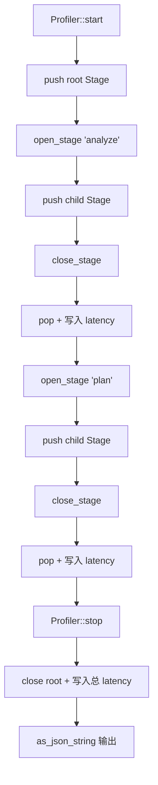
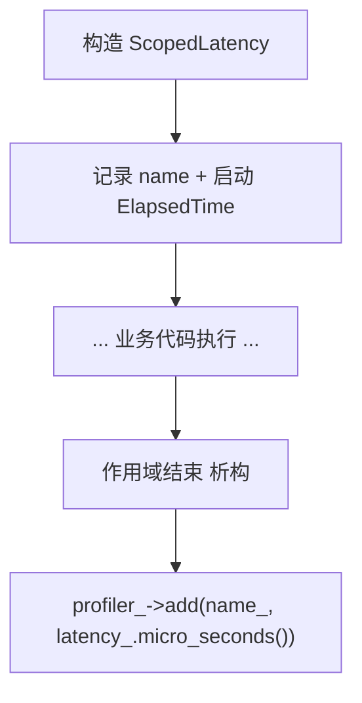
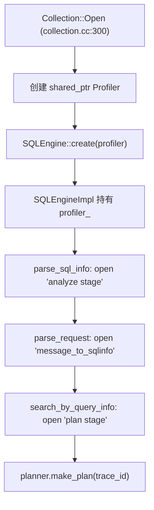

# PD-11.zvec zvec — Profiler 多层 Stage 嵌套计时与 RAII 延迟采集

> 文档编号：PD-11.zvec
> 来源：zvec `src/db/common/profiler.h`
> GitHub：https://github.com/alibaba/zvec.git
> 问题域：PD-11 可观测性 Observability & Cost Tracking
> 状态：可复用方案

---

## 第 1 章 问题与动机

### 1.1 核心问题

向量数据库的查询执行涉及多个阶段——SQL 解析、语义分析、查询规划、索引检索、结果归并——每个阶段的延迟分布直接影响性能调优决策。传统做法是在日志中散落 `LOG_INFO("stage X took %d ms")` 式的打点，存在三个问题：

1. **结构缺失**：纯文本日志无法被程序化解析，无法自动生成火焰图或瀑布图
2. **嵌套丢失**：多层调用（如 plan stage 内部的 segment 扫描）的父子关系无法表达
3. **开销不可控**：生产环境中全量 profiling 会拖慢查询，需要按需开关

zvec 的解法是一个轻量级的查询级 Profiler，核心思想是：**用栈式 Stage 嵌套 + JSON 树序列化 + enable 开关实现零开销可选 profiling**。

### 1.2 zvec 的解法概述

1. **Profiler 类**（`src/db/common/profiler.h:26`）：基于 `vector<Stage>` 的深度优先路径栈，每个 Stage 持有 JsonObject 节点和 ElapsedTime 计时器，open/close 操作自动构建 JSON 嵌套树
2. **ScopedLatency RAII 辅助**（`src/db/common/profiler.h:179`）：构造时启动计时，析构时自动写入延迟值到 Profiler，防止忘记 close
3. **双模式启用**（`src/db/common/profiler.h:50-60`）：`enable_` 标志位用于 debug 模式，`trace_id_` 非空用于分布式追踪模式，两者 OR 逻辑决定是否激活
4. **trace_id 传播**（`src/db/sqlengine/sqlengine_impl.cc:188`）：trace_id 从 Profiler 传递到 QueryPlanner，贯穿查询全链路
5. **JSON 序列化输出**（`src/db/common/profiler.h:135`）：`as_json_string()` 一次性输出完整的嵌套计时树，可直接用于可视化

### 1.3 设计思想

| 设计原则 | 具体实现 | 理由 | 替代方案 |
|----------|----------|------|----------|
| 零开销默认关闭 | `enabled()` 检查在每个 open/close/add 入口，false 时直接 return | 生产查询不应为 profiling 付出任何代价 | 编译期宏开关（更彻底但不灵活） |
| 栈式嵌套 | `vector<Stage> path_` 模拟调用栈，open_stage push，close_stage pop | 自然表达多层执行阶段的父子关系 | 平铺 map（丢失层级信息） |
| RAII 自动采集 | ScopedLatency 析构时写入延迟 | 防止异常路径遗漏 close_stage | 手动 try-finally（C++ 中不惯用） |
| JSON 树输出 | ailego::JsonObject 构建嵌套 JSON | 结构化数据可被任意工具消费 | protobuf（更重，序列化成本高） |
| 双模式激活 | debug 标志 OR trace_id 非空 | 本地调试和分布式追踪两种场景都覆盖 | 单一开关（无法区分场景） |

---

## 第 2 章 源码实现分析

### 2.1 架构概览

zvec 的可观测性体系分为三层：

```
┌─────────────────────────────────────────────────────────┐
│                    DB 层 (查询级 Profiler)                │
│  Collection → SQLEngine → Profiler(Stage 嵌套 + JSON)    │
│  trace_id 传播: SQLEngine → QueryPlanner → Segment       │
├─────────────────────────────────────────────────────────┤
│                  Core 层 (算法级计时)                      │
│  IndexContext.Profiler (map<string,double> 累加计时)      │
│  ElapsedTime 散点计时: IVF/Flat/Cluster 各算法内部        │
├─────────────────────────────────────────────────────────┤
│                  基础设施层 (日志系统)                      │
│  Logger 接口 → Factory 注册 → LoggerBroker 全局分发       │
│  ConsoleLogger (stdout/stderr) | AppendLogger (glog)     │
│  5 级日志: DEBUG/INFO/WARN/ERROR/FATAL                   │
│  ElapsedTime / ElapsedCPUTime 纳秒级计时工具              │
└─────────────────────────────────────────────────────────┘
```

三层之间的关系：
- DB 层 Profiler 用于查询级的结构化性能剖析，输出 JSON
- Core 层 Profiler 用于算法级的累加计时，输出文本表格
- 基础设施层提供日志分发和时间工具，被上两层共同依赖

### 2.2 核心实现

#### 2.2.1 DB 层 Profiler：栈式 Stage 嵌套



对应源码 `src/db/common/profiler.h:26-176`：

```cpp
class Profiler {
 public:
  using Ptr = std::shared_ptr<Profiler>;

 private:
  struct Stage {
    explicit Stage(ailego::JsonObject *node) : node_(node) {}
    ailego::JsonObject *node_{nullptr};
    ailego::ElapsedTime latency_;  // 构造时自动开始计时
  };

 public:
  explicit Profiler(bool enable = false) : enable_(enable) {
    if (enabled()) {
      root_.assign(ailego::JsonObject());
    }
  }

  bool enabled() const {
    return (enabled_debug() || enabled_trace());
  }

  bool enabled_trace() const {
    return !trace_id_.empty();
  }

  int open_stage(const std::string &name) {
    if (enabled()) {
      if (path_.empty()) {
        LOG_ERROR("Profiler did not start yet. name[%s]", name.c_str());
        return PROXIMA_ZVEC_ERROR_CODE(RuntimeError);
      }
      ailego::JsonString key(name);
      ailego::JsonObject child;
      current_path()->set(key, child);
      path_.emplace_back(Stage(
          &((*current_path())[name.c_str()].as_object())));
    }
    return 0;
  }

  int close_stage() {
    if (enabled()) {
      ailego::JsonValue latency(current()->latency_.micro_seconds());
      current_path()->set("latency", latency);
      path_.pop_back();
    }
    return 0;
  }

  std::string as_json_string() const {
    return enabled() ? root_.as_json_string().as_stl_string()
                     : std::string("{}");
  }

 private:
  bool enable_{false};
  std::string trace_id_{};
  ailego::JsonValue root_;
  std::vector<Stage> path_;  // 深度优先路径栈
};
```

关键设计点：
- `path_` 是一个 `vector<Stage>`，模拟调用栈。`open_stage` 在当前节点下创建子 JsonObject 并 push，`close_stage` 写入 latency 并 pop（`profiler.h:99-100`, `profiler.h:112-114`）
- `ElapsedTime` 在 Stage 构造时自动记录起始时间戳（`time_helper.h:138`），close 时读取差值，精度为微秒
- `stop()` 中检测 `path_.size() == 1` 确保只有 root 时才正常关闭，否则 WARN 提示有未关闭的 stage（`profiler.h:72-79`）

#### 2.2.2 ScopedLatency RAII 辅助



对应源码 `src/db/common/profiler.h:179-199`：

```cpp
class ScopedLatency {
 public:
  explicit ScopedLatency(const char *name, Profiler::Ptr profiler)
      : name_(name), profiler_(std::move(profiler)) {}

  ~ScopedLatency() {
    profiler_->add(name_, latency_.micro_seconds());
  }

 private:
  const char *name_{nullptr};
  ailego::ElapsedTime latency_;
  Profiler::Ptr profiler_;
};
```

ScopedLatency 与 open/close_stage 的区别：Stage 构建嵌套 JSON 树，ScopedLatency 只在当前节点添加一个 key-value 延迟值。两者互补——Stage 用于粗粒度阶段划分，ScopedLatency 用于细粒度单点计时。

#### 2.2.3 SQLEngine 中的 Profiler 使用



对应源码 `src/db/sqlengine/sqlengine_impl.cc:125-193`：

```cpp
// analyze 阶段
Result<QueryInfo::Ptr> SQLEngineImpl::parse_sql_info(
    const CollectionSchema &schema, const SQLInfo::Ptr &sql_info) {
  profiler_->open_stage("analyze stage");
  QueryAnalyzer analyzer;
  auto query_info = analyzer.analyze(schema, sql_info);
  // ...
  profiler_->close_stage();
  return query_info.value();
}

// plan 阶段 — trace_id 传播到 planner
Result<std::unique_ptr<arrow::RecordBatchReader>>
SQLEngineImpl::search_by_query_info(...) {
  profiler_->open_stage("plan stage");
  QueryPlanner planner(collection.get());
  auto plan_info =
      planner.make_plan(segments, profiler_->trace_id(), query_infos);
  profiler_->close_stage();
  return plan_info.value()->execute_to_reader();
}
```

### 2.3 实现细节

#### 日志系统：Factory + Broker 模式

zvec 的日志系统采用工厂模式注册 + 全局 Broker 分发：

- `Logger` 是纯虚接口（`logger.h:74-114`），定义 `init/cleanup/log` 三个方法
- `LoggerBroker` 是静态类（`logger.h:118-172`），持有全局唯一的 `Logger::Pointer`，提供 `Register/Unregister/SetLevel/Log` 静态方法
- `ConsoleLogger`（`logger.cc:33-64`）输出到 stdout/stderr，INFO 及以下走 stdout，WARN 及以上走 stderr
- `AppendLogger`（`glogger.h:38-97`）封装 glog，支持文件轮转（`FLAGS_max_log_size`）和过期清理（`google::EnableLogCleaner`）
- 日志格式包含：级别、时间戳、线程 ID、文件名:行号（`logger.cc:51-53`）

日志级别通过 `LoggerBroker::SetLevel` 全局控制，`IsLevelEnabled` 在宏展开时做短路检查（`logger.h:31-37`），低于阈值的日志零开销跳过。

#### Core 层 Profiler：累加计时器

`IndexContext` 内嵌了一个简单的 `core::Profiler`（`index_context.h:31-53`），与 DB 层 Profiler 不同：

- 使用 `map<string, double> timings` 累加同名计时
- `display()` 输出文本表格，用于算法调试
- 无嵌套能力，无 JSON 序列化

#### ElapsedTime：纳秒级单调时钟

`ElapsedTime`（`time_helper.h:135-167`）基于 `Monotime::NanoSeconds()` 单调时钟，构造时记录起始时间戳，提供 nano/micro/milli/seconds 四种精度读取。`ElapsedCPUTime`（`time_helper.h:171-203`）则基于线程级 CPU 时间，用于排除 I/O 等待。

两者在 core 层算法中广泛使用：IVF 搜索（`ivf_searcher.cc:55`）、KMeans 聚类（`opt_kmeans_cluster.cc:538`）、Flat 构建（`flat_builder.cc:83`）等均用 `ElapsedTime` 做局部计时。


---

## 第 3 章 迁移指南

### 3.1 迁移清单

**阶段 1：基础计时工具（1 个文件）**
- [ ] 移植 `ElapsedTime` 类（基于 `std::chrono::steady_clock`，替代 zvec 的 `Monotime`）
- [ ] 移植 `ScopedLatency` RAII 辅助类

**阶段 2：Profiler 核心（1 个文件）**
- [ ] 移植 `Profiler` 类，将 `ailego::JsonObject` 替换为 `nlohmann::json` 或项目已有的 JSON 库
- [ ] 实现 `open_stage/close_stage/add/as_json_string` 四个核心方法
- [ ] 实现 `enable_` + `trace_id_` 双模式激活逻辑

**阶段 3：集成到业务层**
- [ ] 在查询入口创建 `shared_ptr<Profiler>`，注入到执行引擎
- [ ] 在各执行阶段插入 `open_stage/close_stage` 调用
- [ ] 将 `trace_id` 从请求头传入 Profiler，贯穿全链路

**阶段 4：日志系统（可选）**
- [ ] 如需可插拔日志后端，移植 Factory + Broker 模式
- [ ] 否则直接使用 spdlog/glog 等现有方案

### 3.2 适配代码模板

以下是用标准 C++17 + nlohmann::json 重写的 Profiler，可直接编译运行：

```cpp
#pragma once
#include <chrono>
#include <memory>
#include <string>
#include <vector>
#include <nlohmann/json.hpp>

class Profiler {
 public:
  using Ptr = std::shared_ptr<Profiler>;

  explicit Profiler(bool enable = false) : enable_(enable) {
    if (enabled()) root_ = nlohmann::json::object();
  }

  bool enabled() const { return enable_ || !trace_id_.empty(); }

  void start() {
    if (enabled() && path_.empty()) {
      path_.push_back({&root_, std::chrono::steady_clock::now()});
    }
  }

  void stop() {
    if (enabled() && path_.size() == 1) {
      close_stage();
    }
  }

  void open_stage(const std::string &name) {
    if (!enabled() || path_.empty()) return;
    auto *parent = path_.back().node;
    (*parent)[name] = nlohmann::json::object();
    path_.push_back({&(*parent)[name], std::chrono::steady_clock::now()});
  }

  void close_stage() {
    if (!enabled() || path_.empty()) return;
    auto &stage = path_.back();
    auto elapsed = std::chrono::duration_cast<std::chrono::microseconds>(
        std::chrono::steady_clock::now() - stage.start);
    (*stage.node)["latency_us"] = elapsed.count();
    path_.pop_back();
  }

  template <typename T>
  void add(const std::string &name, const T &value) {
    if (enabled() && !path_.empty()) {
      (*path_.back().node)[name] = value;
    }
  }

  void set_trace_id(const std::string &id) {
    trace_id_ = id;
    if (enabled()) root_ = nlohmann::json::object();
  }

  const std::string &trace_id() const { return trace_id_; }
  std::string as_json_string() const {
    return enabled() ? root_.dump() : "{}";
  }

 private:
  struct Stage {
    nlohmann::json *node;
    std::chrono::steady_clock::time_point start;
  };

  bool enable_{false};
  std::string trace_id_;
  nlohmann::json root_;
  std::vector<Stage> path_;
};

class ScopedLatency {
 public:
  ScopedLatency(const char *name, Profiler::Ptr profiler)
      : name_(name), profiler_(std::move(profiler)),
        start_(std::chrono::steady_clock::now()) {}

  ~ScopedLatency() {
    auto elapsed = std::chrono::duration_cast<std::chrono::microseconds>(
        std::chrono::steady_clock::now() - start_);
    profiler_->add(name_, elapsed.count());
  }

 private:
  const char *name_;
  Profiler::Ptr profiler_;
  std::chrono::steady_clock::time_point start_;
};
```

### 3.3 适用场景

| 场景 | 适用度 | 说明 |
|------|--------|------|
| 数据库查询性能剖析 | ⭐⭐⭐ | 完美匹配：多阶段执行、需要嵌套计时 |
| HTTP 请求链路追踪 | ⭐⭐⭐ | 每个中间件/handler 作为一个 Stage |
| LLM Agent 工具调用追踪 | ⭐⭐ | 适合单次调用内部阶段，跨调用需额外 span 传播 |
| 批处理 ETL 管道 | ⭐⭐ | 每个 transform 步骤作为 Stage |
| 实时流处理 | ⭐ | 高频场景下 JSON 序列化开销可能不可接受 |

---

## 第 4 章 测试用例

```cpp
#include <gtest/gtest.h>
#include "profiler.h"  // 使用 3.2 节的适配代码

class ProfilerTest : public ::testing::Test {
 protected:
  Profiler::Ptr profiler_;
  void SetUp() override {
    profiler_ = std::make_shared<Profiler>(true);
  }
};

// 测试基本 Stage 嵌套
TEST_F(ProfilerTest, NestedStages) {
  profiler_->start();
  profiler_->open_stage("parse");
  profiler_->add("sql_length", 42);
  profiler_->close_stage();
  profiler_->open_stage("plan");
  profiler_->close_stage();
  profiler_->stop();

  auto json = nlohmann::json::parse(profiler_->as_json_string());
  ASSERT_TRUE(json.contains("parse"));
  ASSERT_TRUE(json["parse"].contains("latency_us"));
  ASSERT_TRUE(json["parse"].contains("sql_length"));
  ASSERT_EQ(json["parse"]["sql_length"], 42);
  ASSERT_TRUE(json.contains("plan"));
  ASSERT_TRUE(json.contains("latency_us"));  // root latency
}

// 测试禁用时零开销
TEST_F(ProfilerTest, DisabledProfilerReturnsEmpty) {
  auto disabled = std::make_shared<Profiler>(false);
  disabled->start();
  disabled->open_stage("should_not_appear");
  disabled->close_stage();
  disabled->stop();
  ASSERT_EQ(disabled->as_json_string(), "{}");
}

// 测试 trace_id 激活
TEST_F(ProfilerTest, TraceIdEnablesProfiler) {
  auto p = std::make_shared<Profiler>(false);  // enable=false
  ASSERT_FALSE(p->enabled());
  p->set_trace_id("req-12345");
  ASSERT_TRUE(p->enabled());
  p->start();
  p->open_stage("traced_stage");
  p->close_stage();
  p->stop();
  auto json = nlohmann::json::parse(p->as_json_string());
  ASSERT_TRUE(json.contains("traced_stage"));
}

// 测试 ScopedLatency RAII
TEST_F(ProfilerTest, ScopedLatencyAutoRecords) {
  profiler_->start();
  {
    ScopedLatency sl("inner_op", profiler_);
    // 模拟一些工作
    volatile int sum = 0;
    for (int i = 0; i < 10000; ++i) sum += i;
  }
  profiler_->stop();
  auto json = nlohmann::json::parse(profiler_->as_json_string());
  ASSERT_TRUE(json.contains("inner_op"));
  ASSERT_GT(json["inner_op"].get<int64_t>(), 0);
}

// 测试深层嵌套
TEST_F(ProfilerTest, DeepNesting) {
  profiler_->start();
  profiler_->open_stage("level1");
  profiler_->open_stage("level2");
  profiler_->open_stage("level3");
  profiler_->add("depth", 3);
  profiler_->close_stage();
  profiler_->close_stage();
  profiler_->close_stage();
  profiler_->stop();
  auto json = nlohmann::json::parse(profiler_->as_json_string());
  ASSERT_EQ(json["level1"]["level2"]["level3"]["depth"], 3);
}
```


---

## 第 5 章 跨域关联

| 关联域 | 关系类型 | 说明 |
|--------|----------|------|
| PD-01 上下文管理 | 协同 | Profiler 的 JSON 输出可作为上下文压缩的决策依据——哪些阶段耗时最长，优先保留其上下文 |
| PD-03 容错与重试 | 协同 | `close_stage` 的错误检测（`path_.size() != 1` 时 WARN）可触发重试或降级逻辑 |
| PD-04 工具系统 | 依赖 | Profiler 依赖 ailego 工具库（JsonObject、ElapsedTime、Factory），工具系统的设计质量直接影响 Profiler 的可维护性 |
| PD-08 搜索与检索 | 协同 | 向量检索的各阶段（analyze → plan → search）是 Profiler 的主要插桩点，检索性能优化依赖 Profiler 数据 |
| PD-12 推理增强 | 互补 | 推理增强关注结果质量，Profiler 关注执行效率，两者共同指导查询优化方向 |

---

## 第 6 章 来源文件索引

| 文件 | 行范围 | 关键实现 |
|------|--------|----------|
| `src/db/common/profiler.h` | L26-L201 | Profiler 类（Stage 嵌套 + JSON 树）+ ScopedLatency RAII |
| `src/include/zvec/ailego/logger/logger.h` | L23-L175 | Logger 接口 + LoggerBroker 全局分发 + 5 级日志宏 |
| `src/ailego/logger/logger.cc` | L25-L74 | ConsoleLogger 实现 + LoggerBroker 静态成员初始化 |
| `src/db/common/glogger.h` | L38-L97 | AppendLogger（glog 封装）+ 文件轮转配置 |
| `src/db/common/logger.h` | L27-L73 | LogUtil 初始化入口 + Factory 创建 Logger |
| `src/db/common/config.cc` | L109-L140 | GlobalConfig::Initialize 中日志初始化 + atexit 注册 |
| `src/db/sqlengine/sqlengine_impl.cc` | L49-L196 | SQLEngineImpl 中 Profiler 的 3 阶段使用 |
| `src/db/collection.cc` | L300-L301 | Collection::Open 中创建 Profiler 并注入 SQLEngine |
| `src/include/zvec/ailego/utility/time_helper.h` | L135-L203 | ElapsedTime + ElapsedCPUTime 纳秒级计时 |
| `src/include/zvec/core/framework/index_context.h` | L31-L53, L247-L258 | Core 层 Profiler（累加计时 map）+ IndexContext 集成 |
| `src/db/sqlengine/planner/query_planner.cc` | L331-L345 | trace_id 从 Profiler 传播到 QueryPlanner |

---

## 第 7 章 横向对比维度

```json comparison_data
{
  "project": "zvec",
  "dimensions": {
    "追踪方式": "栈式 Stage 嵌套 + JSON 树，open/close 手动插桩",
    "数据粒度": "查询级多阶段嵌套（analyze→plan→search），微秒精度",
    "持久化": "JSON 字符串序列化，无内置持久化，由调用方决定存储",
    "日志格式": "printf 格式化 + 级别/时间/线程ID/文件:行 结构化前缀",
    "日志级别": "5 级 DEBUG/INFO/WARN/ERROR/FATAL，全局阈值控制",
    "零开销路径": "enabled() 短路检查，false 时所有 open/close/add 直接 return 0",
    "延迟统计": "ElapsedTime 单调时钟纳秒级 + ElapsedCPUTime 线程级 CPU 时间",
    "Span 传播": "trace_id 从 Profiler 经 SQLEngine 传播到 QueryPlanner",
    "Decorator 插桩": "ScopedLatency RAII 析构自动写入延迟，非 Decorator 模式",
    "指标采集": "Core 层 map<string,double> 累加计时 + DB 层 JSON 嵌套树",
    "多提供商": "Factory 模式注册 Logger：ConsoleLogger + AppendLogger(glog)",
    "优雅关闭": "atexit 注册 LogUtil::Shutdown，确保 glog 刷盘"
  }
}
```

### 域元数据补充

```json domain_metadata
{
  "solution_summary": "zvec 用栈式 Stage 嵌套 Profiler + ScopedLatency RAII 实现查询级多阶段 JSON 性能剖析，支持 trace_id 双模式激活与零开销默认关闭",
  "description": "C++ 系统级可观测性：编译期零开销 + 运行时按需激活的查询剖析",
  "sub_problems": [
    "Stage 未关闭检测：多层嵌套中异常路径导致 open/close 不配对的诊断与恢复",
    "双层 Profiler 统一：DB 层 JSON 树与 Core 层累加 map 两套计时体系的数据合并",
    "CPU 时间 vs 墙钟时间：ElapsedCPUTime 排除 I/O 等待后的纯计算耗时对比分析"
  ],
  "best_practices": [
    "用 RAII 包装计时采集：ScopedLatency 析构自动写入，防止异常路径遗漏 close",
    "栈式路径追踪嵌套关系：vector<Stage> 模拟调用栈，自然表达父子阶段层级",
    "双模式激活（debug 标志 OR trace_id）：本地调试和分布式追踪共用同一 Profiler"
  ]
}
```

