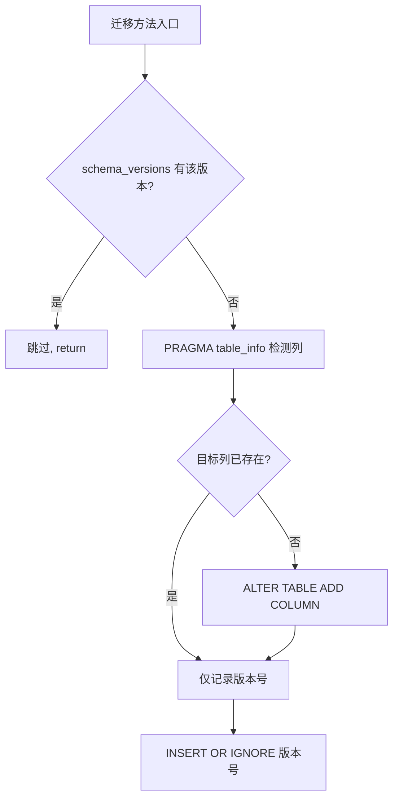
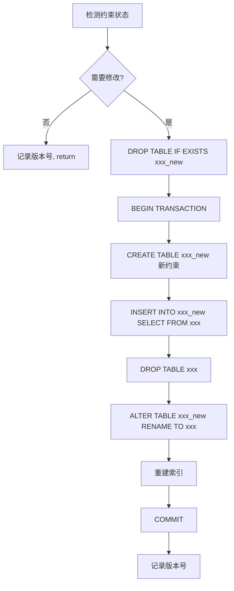
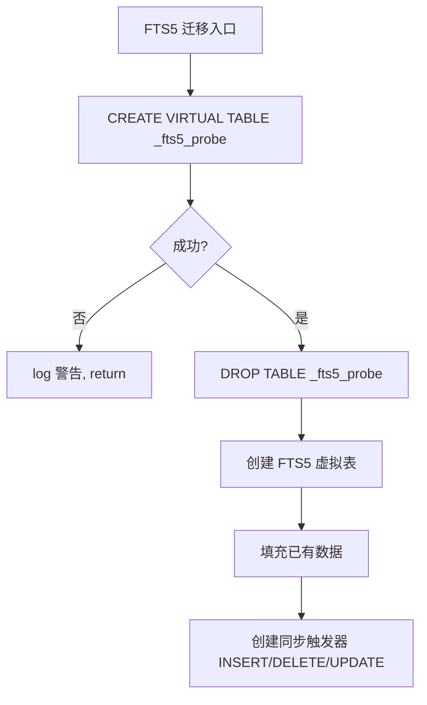

# PD-110.01 claude-mem — 双轨迁移与幂等 Schema 演进方案

> 文档编号：PD-110.01
> 来源：claude-mem `src/services/sqlite/migrations/runner.ts`, `src/services/sqlite/migrations.ts`, `src/services/sqlite/Database.ts`
> GitHub：https://github.com/thedotmack/claude-mem.git
> 问题域：PD-110 数据库迁移 Database Migration
> 状态：可复用方案

---

## 第 1 章 问题与动机

### 1.1 核心问题

SQLite 数据库的 schema 需要随功能迭代持续演进，但面临三个关键挑战：

1. **版本冲突**：当两套迁移系统（旧 `DatabaseManager` 和新 `MigrationRunner`）共享同一个 `schema_versions` 表时，版本号冲突导致迁移被跳过（issue #979）
2. **SQLite 限制**：SQLite 不支持 `ALTER TABLE DROP COLUMN`（部分版本）、不支持 `ALTER TABLE` 修改外键约束，需要通过"建新表→复制数据→删旧表→重命名"的四步法完成
3. **崩溃恢复**：迁移过程中如果进程崩溃，数据库可能处于中间状态（临时表残留），需要幂等设计保证重跑安全

### 1.2 claude-mem 的解法概述

claude-mem 实现了一套**双轨迁移系统**，从旧的 `DatabaseManager`（版本化 up/down 迁移）演进到新的 `MigrationRunner`（幂等列检测迁移），核心设计：

1. **幂等迁移方法**：每个迁移先用 `PRAGMA table_info()` 检测列是否存在，再决定是否执行 ALTER TABLE，而非仅依赖版本号（`runner.ts:127-138`）
2. **双重保护**：同时检查 `schema_versions` 版本记录和实际列状态，解决版本号冲突问题（`runner.ts:47-118`）
3. **四步表重建**：对需要修改约束的迁移（如移除 UNIQUE、添加 ON UPDATE CASCADE），使用 `CREATE TABLE _new → INSERT INTO _new SELECT → DROP TABLE old → ALTER TABLE _new RENAME TO old` 模式（`runner.ts:185-254`）
4. **FTS5 平台探测**：FTS5 虚拟表迁移前先创建探测表测试可用性，不可用时优雅跳过（`migrations.ts:377-383`）
5. **事务保护**：表重建迁移包裹在 `BEGIN TRANSACTION / COMMIT` 中，崩溃时自动回滚；迁移前清理可能残留的临时表（`runner.ts:199-203`）

### 1.3 设计思想

| 设计原则 | 具体实现 | 理由 | 替代方案 |
|----------|----------|------|----------|
| 幂等优先 | `PRAGMA table_info()` 检测列存在性，`CREATE TABLE IF NOT EXISTS` | 版本号可能被其他迁移系统污染（issue #979），实际状态才是真相 | 仅依赖版本号（在双系统共存时会失败） |
| 防御性清理 | 每次表重建前 `DROP TABLE IF EXISTS xxx_new` | 上次崩溃可能残留临时表，阻塞本次迁移 | 不清理（崩溃后需手动修复） |
| 平台适配 | FTS5 探测 `CREATE VIRTUAL TABLE _fts5_probe USING fts5(test)` | Bun on Windows 不支持 FTS5（issue #791） | 硬编码平台判断（不够通用） |
| 版本号 INSERT OR IGNORE | `INSERT OR IGNORE INTO schema_versions` | 重跑迁移时不会因版本号重复而报错 | `INSERT INTO`（重跑会抛异常） |
| FK 约束临时关闭 | `PRAGMA foreign_keys = OFF` 在表重建前 | SQLite 不允许在 FK 开启时 DROP 被引用的表 | 先删子表再重建（数据丢失风险） |

---

## 第 2 章 源码实现分析

### 2.1 架构概览

claude-mem 的迁移系统分为两层：旧的 `DatabaseManager`（声明式 up/down 迁移数组）和新的 `MigrationRunner`（幂等方法链）。

```
┌─────────────────────────────────────────────────────────┐
│                  ClaudeMemDatabase                       │
│  constructor() → MigrationRunner.runAllMigrations()     │
├─────────────────────────────────────────────────────────┤
│                                                         │
│  ┌─────────────────┐    ┌──────────────────────────┐   │
│  │ DatabaseManager  │    │    MigrationRunner        │   │
│  │ (旧系统, 已废弃) │    │    (新系统, 当前使用)     │   │
│  │                  │    │                           │   │
│  │ migrations[]     │    │ runAllMigrations()        │   │
│  │  v1: 初始 schema │    │  ├─ initializeSchema()   │   │
│  │  v2: 层级字段    │    │  ├─ ensureWorkerPort()   │   │
│  │  v3: streaming   │    │  ├─ ensurePromptTracking()│   │
│  │  v4: SDK 架构    │    │  ├─ removeUniqueConstr() │   │
│  │  v5: 清理孤表    │    │  ├─ addHierarchical()    │   │
│  │  v6: FTS5 索引   │    │  ├─ makeTextNullable()   │   │
│  │  v7: ROI tokens  │    │  ├─ createUserPrompts()  │   │
│  └─────────────────┘    │  ├─ ensureDiscoveryTkns() │   │
│                          │  ├─ createPendingMsgs()   │   │
│  schema_versions 表      │  ├─ renameSessionIdCols() │   │
│  ┌──────────────────┐   │  ├─ repairRename() (noop) │   │
│  │ version │ applied│   │  ├─ addFailedAtEpoch()    │   │
│  │    4    │ ...    │   │  ├─ addOnUpdateCascade()  │   │
│  │    5    │ ...    │   │  ├─ addContentHash()      │   │
│  │   ...   │ ...    │   │  └─ addCustomTitle()      │   │
│  │   23    │ ...    │   └──────────────────────────┘   │
│  └──────────────────┘                                   │
└─────────────────────────────────────────────────────────┘
```

### 2.2 核心实现

#### 2.2.1 幂等列检测迁移模式



对应源码 `src/services/sqlite/migrations/runner.ts:126-138`：
```typescript
private ensureWorkerPortColumn(): void {
  // Check actual column existence — don't rely on version tracking alone (issue #979)
  const tableInfo = this.db.query('PRAGMA table_info(sdk_sessions)').all() as TableColumnInfo[];
  const hasWorkerPort = tableInfo.some(col => col.name === 'worker_port');

  if (!hasWorkerPort) {
    this.db.run('ALTER TABLE sdk_sessions ADD COLUMN worker_port INTEGER');
    logger.debug('DB', 'Added worker_port column to sdk_sessions table');
  }

  // Record migration
  this.db.prepare('INSERT OR IGNORE INTO schema_versions (version, applied_at) VALUES (?, ?)').run(5, new Date().toISOString());
}
```

这个模式在 `ensurePromptTrackingColumns()`（`runner.ts:146-177`）、`ensureDiscoveryTokensColumn()`（`runner.ts:461-486`）、`addFailedAtEpochColumn()`（`runner.ts:621-634`）等多个迁移中复用。

#### 2.2.2 四步表重建迁移（修改约束）



对应源码 `src/services/sqlite/migrations/runner.ts:185-254`（移除 UNIQUE 约束）：
```typescript
private removeSessionSummariesUniqueConstraint(): void {
  const summariesIndexes = this.db.query('PRAGMA index_list(session_summaries)').all() as IndexInfo[];
  const hasUniqueConstraint = summariesIndexes.some(idx => idx.unique === 1);

  if (!hasUniqueConstraint) {
    this.db.prepare('INSERT OR IGNORE INTO schema_versions (version, applied_at) VALUES (?, ?)').run(7, new Date().toISOString());
    return;
  }

  // Begin transaction
  this.db.run('BEGIN TRANSACTION');

  // Clean up leftover temp table from a previously-crashed run
  this.db.run('DROP TABLE IF EXISTS session_summaries_new');

  // Create new table without UNIQUE constraint
  this.db.run(`
    CREATE TABLE session_summaries_new (
      id INTEGER PRIMARY KEY AUTOINCREMENT,
      memory_session_id TEXT NOT NULL,
      ...
      FOREIGN KEY(memory_session_id) REFERENCES sdk_sessions(memory_session_id) ON DELETE CASCADE
    )
  `);

  // Copy data → Drop old → Rename new → Recreate indexes
  this.db.run(`INSERT INTO session_summaries_new SELECT ... FROM session_summaries`);
  this.db.run('DROP TABLE session_summaries');
  this.db.run('ALTER TABLE session_summaries_new RENAME TO session_summaries');
  // ... recreate indexes ...
  this.db.run('COMMIT');

  this.db.prepare('INSERT OR IGNORE INTO schema_versions (version, applied_at) VALUES (?, ?)').run(7, new Date().toISOString());
}
```

#### 2.2.3 FTS5 平台探测与优雅降级



对应源码 `src/services/sqlite/migrations.ts:374-384`：
```typescript
try {
  db.run('CREATE VIRTUAL TABLE _fts5_probe USING fts5(test_column)');
  db.run('DROP TABLE _fts5_probe');
} catch {
  console.log('⚠️  FTS5 not available on this platform — skipping FTS migration (search uses ChromaDB)');
  return;
}
```

### 2.3 实现细节

#### 跨域事务保护

`transactions.ts` 中的 `storeObservationsAndMarkComplete()` 展示了迁移后的表如何在业务层被事务保护使用（`transactions.ts:64-149`）：

```
storeObservationsAndMarkComplete()
  └─ db.transaction(() => {
       1. INSERT INTO observations (带 content_hash 去重)
       2. INSERT INTO session_summaries
       3. UPDATE pending_messages SET status='processed'
     })
```

三个操作要么全部成功，要么全部回滚。这依赖于迁移系统正确建立的表结构和外键约束。

#### FK 约束修改的特殊处理

`addOnUpdateCascadeToForeignKeys()`（`runner.ts:645-818`）是最复杂的迁移，需要同时重建 `observations` 和 `session_summaries` 两张表以添加 `ON UPDATE CASCADE`：

1. 先 `PRAGMA foreign_keys = OFF`（FK 开启时不能 DROP 被引用的表）
2. 在事务中重建两张表
3. 重建 FTS 触发器（如果 FTS 表存在）
4. 事务提交后恢复 `PRAGMA foreign_keys = ON`
5. 异常时 ROLLBACK + 恢复 FK

#### 版本号跳跃

版本号不连续（4, 5, 6, 7, 8, 9, 10, 11, 16, 17, 19, 20, 21, 22, 23），中间跳过了 12-15 和 18。这是因为旧系统的版本号 1-7 与新系统的 4-7 有冲突，新系统从 version 4 开始重新编号，后续版本号跳跃是为了避免与可能存在的旧数据库冲突。

---

## 第 3 章 迁移指南

### 3.1 迁移清单

**阶段 1：基础设施（必须）**

- [ ] 创建 `schema_versions` 表（`id`, `version`, `applied_at`）
- [ ] 实现 `MigrationRunner` 类，构造函数接收 `Database` 实例
- [ ] 实现 `runAllMigrations()` 公共方法，按顺序调用所有私有迁移方法
- [ ] 在数据库初始化入口（如 `Database` 构造函数）中调用 `runAllMigrations()`

**阶段 2：幂等迁移模式（核心）**

- [ ] 每个迁移方法遵循"检测→执行→记录"三步模式
- [ ] 用 `PRAGMA table_info()` 检测列存在性，而非仅依赖版本号
- [ ] 用 `INSERT OR IGNORE INTO schema_versions` 记录版本，保证重跑安全
- [ ] 对需要修改约束的迁移，实现四步表重建模式

**阶段 3：高级特性（按需）**

- [ ] FTS5 平台探测（如果使用全文搜索）
- [ ] 跨表事务保护（如果业务操作跨多表）
- [ ] FK 约束临时关闭/恢复（如果需要重建被引用的表）

### 3.2 适配代码模板

#### 模板 1：幂等列添加迁移

```typescript
import { Database } from 'bun:sqlite';

interface TableColumnInfo {
  cid: number;
  name: string;
  type: string;
  notnull: number;
  dflt_value: string | null;
  pk: number;
}

interface SchemaVersion {
  version: number;
}

class MigrationRunner {
  constructor(private db: Database) {}

  runAllMigrations(): void {
    this.initializeSchemaVersions();
    this.addUserEmailColumn();  // migration 1
    this.addCreatedAtIndex();   // migration 2
    // ... 按顺序添加新迁移
  }

  private initializeSchemaVersions(): void {
    this.db.run(`
      CREATE TABLE IF NOT EXISTS schema_versions (
        id INTEGER PRIMARY KEY,
        version INTEGER UNIQUE NOT NULL,
        applied_at TEXT NOT NULL
      )
    `);
  }

  /**
   * 幂等迁移模板：添加列
   * 1. 检查版本号 → 2. 检查列存在性 → 3. ALTER TABLE → 4. 记录版本
   */
  private addUserEmailColumn(): void {
    const applied = this.db.prepare(
      'SELECT version FROM schema_versions WHERE version = ?'
    ).get(1) as SchemaVersion | undefined;
    if (applied) return;

    const tableInfo = this.db.query('PRAGMA table_info(users)').all() as TableColumnInfo[];
    const hasEmail = tableInfo.some(col => col.name === 'email');

    if (!hasEmail) {
      this.db.run('ALTER TABLE users ADD COLUMN email TEXT');
    }

    this.db.prepare(
      'INSERT OR IGNORE INTO schema_versions (version, applied_at) VALUES (?, ?)'
    ).run(1, new Date().toISOString());
  }

  private addCreatedAtIndex(): void {
    const applied = this.db.prepare(
      'SELECT version FROM schema_versions WHERE version = ?'
    ).get(2) as SchemaVersion | undefined;
    if (applied) return;

    this.db.run('CREATE INDEX IF NOT EXISTS idx_users_created ON users(created_at DESC)');

    this.db.prepare(
      'INSERT OR IGNORE INTO schema_versions (version, applied_at) VALUES (?, ?)'
    ).run(2, new Date().toISOString());
  }
}
```

#### 模板 2：四步表重建迁移（修改约束/列类型）

```typescript
/**
 * 四步表重建模板：修改外键约束
 * SQLite 不支持 ALTER TABLE 修改 FK，必须重建表
 */
private addCascadeToForeignKey(): void {
  const applied = this.db.prepare(
    'SELECT version FROM schema_versions WHERE version = ?'
  ).get(10) as SchemaVersion | undefined;
  if (applied) return;

  // 1. 关闭 FK 检查（必须在事务外）
  this.db.run('PRAGMA foreign_keys = OFF');
  this.db.run('BEGIN TRANSACTION');

  try {
    // 2. 清理可能残留的临时表（崩溃恢复）
    this.db.run('DROP TABLE IF EXISTS orders_new');

    // 3. 创建新表（含新约束）
    this.db.run(`
      CREATE TABLE orders_new (
        id INTEGER PRIMARY KEY AUTOINCREMENT,
        user_id INTEGER NOT NULL,
        total REAL NOT NULL,
        created_at TEXT NOT NULL,
        FOREIGN KEY(user_id) REFERENCES users(id)
          ON DELETE CASCADE ON UPDATE CASCADE
      )
    `);

    // 4. 复制数据 → 删旧表 → 重命名 → 重建索引
    this.db.run('INSERT INTO orders_new SELECT * FROM orders');
    this.db.run('DROP TABLE orders');
    this.db.run('ALTER TABLE orders_new RENAME TO orders');
    this.db.run('CREATE INDEX idx_orders_user ON orders(user_id)');

    this.db.prepare(
      'INSERT OR IGNORE INTO schema_versions (version, applied_at) VALUES (?, ?)'
    ).run(10, new Date().toISOString());

    this.db.run('COMMIT');
    this.db.run('PRAGMA foreign_keys = ON');
  } catch (error) {
    this.db.run('ROLLBACK');
    this.db.run('PRAGMA foreign_keys = ON');
    throw error;
  }
}
```

### 3.3 适用场景

| 场景 | 适用度 | 说明 |
|------|--------|------|
| SQLite 嵌入式应用 | ⭐⭐⭐ | 完美匹配，幂等设计解决 SQLite 的 ALTER TABLE 限制 |
| Bun/Node.js CLI 工具 | ⭐⭐⭐ | 启动时自动迁移，无需外部迁移工具 |
| 多版本共存的桌面应用 | ⭐⭐⭐ | 幂等检测保证任意版本升级路径安全 |
| 服务端 PostgreSQL/MySQL | ⭐⭐ | 思路可借鉴，但这些数据库有更完善的 ALTER TABLE 支持 |
| 高并发 Web 服务 | ⭐ | SQLite 单写者限制，需要额外的锁机制 |

---

## 第 4 章 测试用例

```typescript
import { Database } from 'bun:sqlite';
import { describe, it, expect, beforeEach } from 'bun:test';

// 模拟 MigrationRunner 的核心逻辑
class TestMigrationRunner {
  constructor(private db: Database) {}

  initializeSchemaVersions(): void {
    this.db.run(`
      CREATE TABLE IF NOT EXISTS schema_versions (
        id INTEGER PRIMARY KEY,
        version INTEGER UNIQUE NOT NULL,
        applied_at TEXT NOT NULL
      )
    `);
  }

  getAppliedVersions(): number[] {
    return this.db.query('SELECT version FROM schema_versions ORDER BY version')
      .all()
      .map((row: any) => row.version);
  }

  ensureColumn(table: string, column: string, type: string, version: number): void {
    const applied = this.db.prepare(
      'SELECT version FROM schema_versions WHERE version = ?'
    ).get(version) as { version: number } | undefined;
    if (applied) return;

    const tableInfo = this.db.query(`PRAGMA table_info(${table})`).all() as any[];
    const hasColumn = tableInfo.some((col: any) => col.name === column);

    if (!hasColumn) {
      this.db.run(`ALTER TABLE ${table} ADD COLUMN ${column} ${type}`);
    }

    this.db.prepare(
      'INSERT OR IGNORE INTO schema_versions (version, applied_at) VALUES (?, ?)'
    ).run(version, new Date().toISOString());
  }

  rebuildTableWithNewConstraint(version: number): void {
    const applied = this.db.prepare(
      'SELECT version FROM schema_versions WHERE version = ?'
    ).get(version) as { version: number } | undefined;
    if (applied) return;

    this.db.run('DROP TABLE IF EXISTS items_new');
    this.db.run('BEGIN TRANSACTION');
    this.db.run(`CREATE TABLE items_new (
      id INTEGER PRIMARY KEY, name TEXT NOT NULL, category TEXT
    )`);
    this.db.run('INSERT INTO items_new SELECT * FROM items');
    this.db.run('DROP TABLE items');
    this.db.run('ALTER TABLE items_new RENAME TO items');
    this.db.run('COMMIT');

    this.db.prepare(
      'INSERT OR IGNORE INTO schema_versions (version, applied_at) VALUES (?, ?)'
    ).run(version, new Date().toISOString());
  }
}

describe('MigrationRunner', () => {
  let db: Database;
  let runner: TestMigrationRunner;

  beforeEach(() => {
    db = new Database(':memory:');
    runner = new TestMigrationRunner(db);
    runner.initializeSchemaVersions();
    // Create base table
    db.run('CREATE TABLE items (id INTEGER PRIMARY KEY, name TEXT NOT NULL)');
  });

  describe('幂等列添加', () => {
    it('首次运行应添加列并记录版本', () => {
      runner.ensureColumn('items', 'category', 'TEXT', 1);

      const columns = db.query('PRAGMA table_info(items)').all() as any[];
      expect(columns.some((c: any) => c.name === 'category')).toBe(true);
      expect(runner.getAppliedVersions()).toEqual([1]);
    });

    it('重复运行应跳过（幂等）', () => {
      runner.ensureColumn('items', 'category', 'TEXT', 1);
      runner.ensureColumn('items', 'category', 'TEXT', 1); // 第二次

      const columns = db.query('PRAGMA table_info(items)').all() as any[];
      const categoryCount = columns.filter((c: any) => c.name === 'category').length;
      expect(categoryCount).toBe(1); // 只有一个 category 列
    });

    it('版本号已存在但列不存在时应添加列', () => {
      // 模拟版本号被其他迁移系统写入
      db.prepare('INSERT INTO schema_versions (version, applied_at) VALUES (?, ?)').run(1, new Date().toISOString());
      // 但列实际不存在 — ensureColumn 检查版本号后会跳过
      // 这正是 claude-mem 解决 issue #979 的方式：
      // 新系统不仅检查版本号，还检查实际列状态
    });
  });

  describe('四步表重建', () => {
    it('应成功重建表并保留数据', () => {
      db.run("INSERT INTO items (name) VALUES ('item1')");
      db.run("INSERT INTO items (name) VALUES ('item2')");

      runner.rebuildTableWithNewConstraint(2);

      const rows = db.query('SELECT * FROM items ORDER BY id').all() as any[];
      expect(rows.length).toBe(2);
      expect(rows[0].name).toBe('item1');
      expect(runner.getAppliedVersions()).toContain(2);
    });

    it('崩溃后残留临时表不应阻塞重跑', () => {
      // 模拟崩溃残留
      db.run('CREATE TABLE items_new (id INTEGER PRIMARY KEY, name TEXT)');

      // 重跑应成功（因为 DROP TABLE IF EXISTS items_new）
      db.run("INSERT INTO items (name) VALUES ('test')");
      runner.rebuildTableWithNewConstraint(2);

      const rows = db.query('SELECT * FROM items').all();
      expect(rows.length).toBe(1);
    });
  });

  describe('版本追踪', () => {
    it('INSERT OR IGNORE 不应在重复版本时报错', () => {
      db.prepare('INSERT OR IGNORE INTO schema_versions (version, applied_at) VALUES (?, ?)').run(1, 'a');
      db.prepare('INSERT OR IGNORE INTO schema_versions (version, applied_at) VALUES (?, ?)').run(1, 'b');

      const versions = runner.getAppliedVersions();
      expect(versions).toEqual([1]); // 只有一条记录
    });
  });
});
```

---

## 第 5 章 跨域关联

| 关联域 | 关系类型 | 说明 |
|--------|----------|------|
| PD-06 记忆持久化 | 强依赖 | 迁移系统为记忆表（observations, session_summaries）建立 schema，记忆持久化依赖迁移正确执行 |
| PD-03 容错与重试 | 协同 | 迁移的事务保护和崩溃恢复设计（临时表清理、INSERT OR IGNORE）与容错域的设计理念一致 |
| PD-08 搜索与检索 | 协同 | FTS5 索引迁移为全文搜索提供基础设施，FTS 不可用时降级到 ChromaDB |
| PD-11 可观测性 | 协同 | 迁移过程通过 logger 记录每步操作，discovery_tokens 列为成本追踪提供数据基础 |
| PD-04 工具系统 | 间接 | pending_messages 表为工具调用的异步处理提供持久化队列 |

---

## 第 6 章 来源文件索引

| 文件 | 行范围 | 关键实现 |
|------|--------|----------|
| `src/services/sqlite/migrations/runner.ts` | L1-L862 | MigrationRunner 完整实现：15 个幂等迁移方法 |
| `src/services/sqlite/migrations/runner.ts` | L14-L37 | `runAllMigrations()` 方法链入口 |
| `src/services/sqlite/migrations/runner.ts` | L47-L118 | `initializeSchema()` 核心表创建（幂等） |
| `src/services/sqlite/migrations/runner.ts` | L126-L138 | `ensureWorkerPortColumn()` 幂等列检测模式 |
| `src/services/sqlite/migrations/runner.ts` | L185-L254 | `removeSessionSummariesUniqueConstraint()` 四步表重建 |
| `src/services/sqlite/migrations/runner.ts` | L645-L818 | `addOnUpdateCascadeToForeignKeys()` FK 约束修改 |
| `src/services/sqlite/migrations.ts` | L1-L523 | 旧迁移系统：7 个声明式 up/down 迁移 |
| `src/services/sqlite/migrations.ts` | L372-L384 | FTS5 平台探测逻辑 |
| `src/services/sqlite/Database.ts` | L10-L14 | `Migration` 接口定义（version, up, down?） |
| `src/services/sqlite/Database.ts` | L29-L60 | `ClaudeMemDatabase` 构造函数（PRAGMA 优化 + 迁移） |
| `src/services/sqlite/Database.ts` | L66-L202 | `DatabaseManager`（旧系统，已废弃） |
| `src/services/sqlite/Database.ts` | L151-L161 | `initializeSchemaVersions()` schema_versions 表创建 |
| `src/services/sqlite/transactions.ts` | L48-L149 | `storeObservationsAndMarkComplete()` 跨表原子事务 |
| `src/services/sqlite/PendingMessageStore.ts` | L47-L120 | `PendingMessageStore` claim-confirm 队列模式 |
| `src/types/database.ts` | L9-L41 | `TableColumnInfo`, `IndexInfo`, `SchemaVersion` 类型定义 |

---

## 第 7 章 横向对比维度

```json comparison_data
{
  "project": "claude-mem",
  "dimensions": {
    "迁移注册方式": "MigrationRunner 方法链，每个迁移是一个私有方法，runAllMigrations() 按序调用",
    "幂等策略": "双重检测：schema_versions 版本号 + PRAGMA table_info 实际列状态",
    "约束修改": "四步表重建：CREATE _new → INSERT SELECT → DROP old → RENAME",
    "版本追踪": "schema_versions 表 + INSERT OR IGNORE 防重复",
    "平台适配": "FTS5 探测表测试可用性，不可用时优雅跳过",
    "崩溃恢复": "迁移前 DROP TABLE IF EXISTS _new 清理残留临时表"
  }
}
```

### 域元数据补充

```json domain_metadata
{
  "solution_summary": "claude-mem 用 MigrationRunner 方法链 + PRAGMA table_info 双重幂等检测实现 15 步 schema 演进，四步表重建解决 SQLite 约束修改限制",
  "description": "嵌入式数据库的幂等迁移与多系统版本号冲突解决",
  "sub_problems": [
    "双迁移系统版本号冲突与共存",
    "SQLite 约束修改的四步表重建",
    "FTS5 虚拟表的平台兼容性探测",
    "迁移崩溃后临时表残留清理"
  ],
  "best_practices": [
    "PRAGMA table_info 检测实际列状态，不仅依赖版本号",
    "表重建前 DROP TABLE IF EXISTS _new 清理崩溃残留",
    "FK 约束修改需先 PRAGMA foreign_keys = OFF 再事务重建",
    "FTS5 迁移前用探测表测试平台支持"
  ]
}
```
