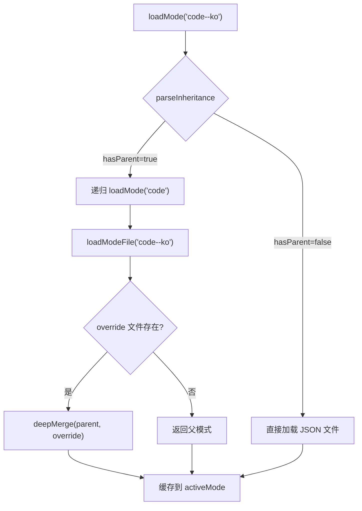
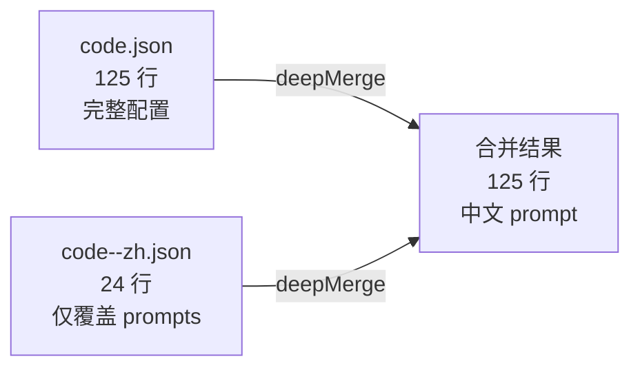
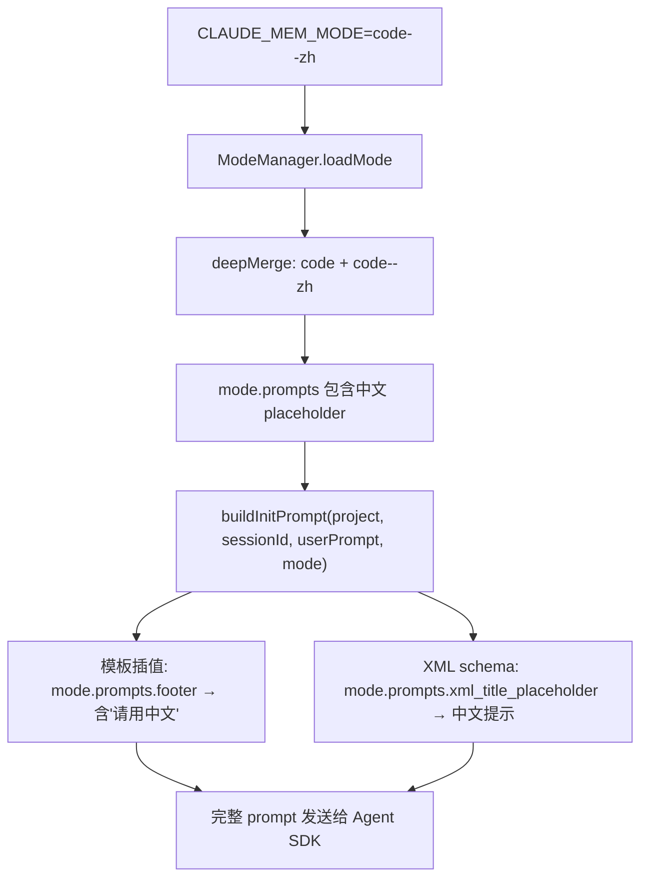
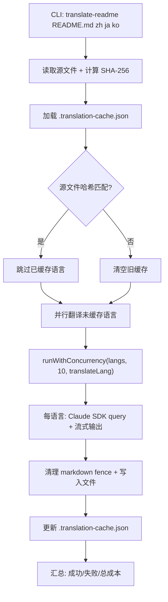

# PD-111.01 ClaudeMem — Mode 继承式 i18n 系统

> 文档编号：PD-111.01
> 来源：ClaudeMem `src/services/domain/ModeManager.ts`
> GitHub：https://github.com/thedotmack/claude-mem.git
> 问题域：PD-111 国际化 Internationalization
> 状态：可复用方案

---

## 第 1 章 问题与动机

### 1.1 核心问题

Agent 系统的 prompt 本地化面临一个根本矛盾：prompt 模板数量多（claude-mem 有 30+ 个 prompt 字段）、语言数量多（30+ 种语言），如果为每种语言维护完整的 prompt 配置文件，会产生 N×M 的组合爆炸。更新基础 prompt 时需要同步修改所有语言文件，维护成本极高。

同时，README 文档的多语言翻译也需要自动化——手动翻译 30+ 语言的 README 不现实，但翻译质量和缓存策略需要精心设计。

### 1.2 ClaudeMem 的解法概述

1. **Mode 继承模式**：用 `parent--override` 命名约定（如 `code--zh`），子模式只覆盖需要翻译的字段，其余继承父模式 (`ModeManager.ts:49-71`)
2. **递归 deepMerge**：对象递归合并、数组整体替换、原始值直接覆盖，确保语言覆盖文件最小化 (`ModeManager.ts:91-108`)
3. **多级回退链**：子模式文件缺失 → 用父模式；父模式缺失 → 回退到 `code` 基础模式 (`ModeManager.ts:146-153`)
4. **Claude Agent SDK 驱动的 README 翻译**：用 LLM 并行翻译 README 到 30+ 语言，SHA-256 内容哈希缓存避免重复翻译 (`scripts/translate-readme/index.ts:265-433`)
5. **行为变体与语言变体统一**：`code--chill`（行为变体）和 `code--zh`（语言变体）使用同一套继承机制，无需区分 (`plugin/modes/code--chill.json`)

### 1.3 设计思想

| 设计原则 | 具体实现 | 理由 | 替代方案 |
|----------|----------|------|----------|
| 最小覆盖原则 | 语言文件只含 `name` + `prompts` 子集（~20行 vs 基础模式 125 行） | 减少 90% 重复内容，基础 prompt 更新自动传播 | 每语言完整副本（维护噩梦） |
| 单级继承 | 只支持 `parent--child`，不支持 `a--b--c` 多级链 | 避免菱形继承等复杂性，30+ 语言场景够用 | 多级继承（过度设计） |
| 数组整体替换 | deepMerge 中数组不做元素级合并，直接替换 | prompt 字段多为字符串，数组场景（observation_types）需要整体一致性 | 数组元素级合并（语义不明确） |
| 内容哈希缓存 | README 翻译用 SHA-256 哈希源文件，未变化则跳过 | 30+ 语言翻译成本约 $3-4，缓存避免无意义重复开销 | 时间戳比较（不可靠） |
| 并发限制 | 翻译最多 10 并发，带预算上限检查 | 防止 API 限流和成本失控 | 无限并发（API 会拒绝） |

---

## 第 2 章 源码实现分析

### 2.1 架构概览

ClaudeMem 的 i18n 系统分为两个独立子系统：

```
┌─────────────────────────────────────────────────────────────┐
│                    i18n 架构总览                              │
├─────────────────────┬───────────────────────────────────────┤
│  Mode 继承系统       │  README 翻译系统                       │
│                     │                                       │
│  code.json (基础)    │  README.md (英文源)                    │
│    ↓ deepMerge      │    ↓ Claude Agent SDK                 │
│  code--zh.json      │  README.zh.md                         │
│  code--ko.json      │  README.ko.md                         │
│  code--chill.json   │  README.ja.md                         │
│  ... (30+ 文件)     │  ... (31 个翻译文件)                    │
│                     │                                       │
│  ModeManager        │  translate-readme/index.ts             │
│  (单例, 运行时)      │  (CLI 工具, 构建时)                     │
├─────────────────────┴───────────────────────────────────────┤
│  共享: CLAUDE_MEM_MODE 设置 → 选择 mode → 注入 prompt        │
│  共享: 语言代码表 (4 tier, 34 种语言)                         │
└─────────────────────────────────────────────────────────────┘
```

### 2.2 核心实现

#### 2.2.1 Mode 继承解析与 deepMerge



对应源码 `src/services/domain/ModeManager.ts:49-108`：

```typescript
// 继承解析：用 '--' 分割 modeId
private parseInheritance(modeId: string): {
  hasParent: boolean;
  parentId: string;
  overrideId: string;
} {
  const parts = modeId.split('--');
  if (parts.length === 1) {
    return { hasParent: false, parentId: '', overrideId: '' };
  }
  // 只支持单级继承
  if (parts.length > 2) {
    throw new Error(
      `Invalid mode inheritance: ${modeId}. Only one level supported`
    );
  }
  return {
    hasParent: true,
    parentId: parts[0],
    overrideId: modeId  // 用完整 ID 查找覆盖文件
  };
}

// 递归深度合并
private deepMerge<T>(base: T, override: Partial<T>): T {
  const result = { ...base } as T;
  for (const key in override) {
    const overrideValue = override[key];
    const baseValue = base[key];
    if (this.isPlainObject(overrideValue) && this.isPlainObject(baseValue)) {
      result[key] = this.deepMerge(baseValue, overrideValue as any);
    } else {
      // 数组和原始值直接替换
      result[key] = overrideValue as T[Extract<keyof T, string>];
    }
  }
  return result;
}
```

#### 2.2.2 语言覆盖文件的最小化设计



对应源码 `plugin/modes/code--zh.json`（完整文件，仅 24 行）：

```json
{
  "name": "Code Development (Chinese)",
  "prompts": {
    "footer": "...LANGUAGE REQUIREMENTS: Please write the observation data in 中文",
    "xml_title_placeholder": "[**title**: 捕捉核心行动或主题的简短标题]",
    "xml_subtitle_placeholder": "[**subtitle**: 一句话解释（最多24个单词）]",
    "xml_fact_placeholder": "[简洁、独立的陈述]",
    "xml_narrative_placeholder": "[**narrative**: 完整背景：做了什么、如何工作、为什么重要]",
    "xml_concept_placeholder": "[知识类型类别]",
    "xml_file_placeholder": "[文件路径]",
    "xml_summary_request_placeholder": "[捕捉用户请求和讨论/完成内容实质的简短标题]",
    "continuation_instruction": "...LANGUAGE REQUIREMENTS: Please write the observation data in 中文",
    "summary_footer": "...LANGUAGE REQUIREMENTS: Please write ALL summary content in 中文"
  }
}
```

关键观察：语言覆盖文件只翻译了 XML placeholder 和 footer 中的语言指令，其余 20+ 个 prompt 字段（`system_identity`, `observer_role`, `recording_focus` 等）全部继承自 `code.json`。这是因为这些字段是给 LLM 的指令（英文即可），而 placeholder 和 footer 中的语言要求才决定输出语言。

### 2.3 实现细节

#### 2.3.1 Mode 加载入口与回退链

`src/services/worker-service.ts:382-404` 是 mode 系统的启动入口：

```typescript
const { ModeManager } = await import('./domain/ModeManager.js');
const settings = SettingsDefaultsManager.loadFromFile(USER_SETTINGS_PATH);
const modeId = settings.CLAUDE_MEM_MODE;  // 默认 'code'
ModeManager.getInstance().loadMode(modeId);
```

回退链设计 (`ModeManager.ts:133-197`)：
- `code--ko` → 加载 `code` 父模式 → 加载 `code--ko` 覆盖 → deepMerge
- `code--ko` 覆盖文件不存在 → 直接用 `code` 父模式（warn 日志）
- 父模式 `code` 不存在 → 抛出 `Critical: code.json mode file missing`
- 任意未知 modeId → 回退到 `code`

#### 2.3.2 Prompt 注入流程

Mode 配置通过 `buildInitPrompt` 注入到 Agent 的 system prompt 中 (`src/sdk/prompts.ts:29-86`)：



`ModeConfig.prompts` 的 `language_instruction` 字段（`types.ts:21`）是可选的，实际语言控制嵌入在 `footer` 和 `continuation_instruction` 的 `LANGUAGE REQUIREMENTS` 尾部。

#### 2.3.3 README 翻译系统

`scripts/translate-readme/index.ts` 实现了基于 Claude Agent SDK 的并行翻译管线：



对应源码 `scripts/translate-readme/index.ts:358-397`（并发控制器）：

```typescript
async function runWithConcurrency<T>(
  items: T[], limit: number,
  fn: (item: T) => Promise<TranslationResult>
): Promise<TranslationResult[]> {
  const results: TranslationResult[] = [];
  const executing = new Set<Promise<void>>();
  for (const item of items) {
    if (maxBudgetUsd && totalCostUsd >= maxBudgetUsd) {
      results.push({ language: String(item), outputPath: "", success: false, error: "Budget exceeded" });
      continue;
    }
    const p = fn(item).then((result) => {
      results.push(result);
      if (result.costUsd) totalCostUsd += result.costUsd;
    });
    const wrapped = p.finally(() => { executing.delete(wrapped); });
    executing.add(wrapped);
    if (executing.size >= limit) await Promise.race(executing);
  }
  await Promise.all(executing);
  return results;
}
```

#### 2.3.4 翻译缓存结构

`.translation-cache.json` 记录每种语言的翻译状态：

```json
{
  "sourceHash": "9ab0d799179c66f9",
  "lastUpdated": "2025-12-12T07:42:03.489Z",
  "translations": {
    "zh": { "hash": "9ab0d799179c66f9", "translatedAt": "2025-12-12T07:06:55.026Z", "costUsd": 0.1226 },
    "ja": { "hash": "9ab0d799179c66f9", "translatedAt": "2025-12-12T07:06:55.026Z", "costUsd": 0.1297 }
  }
}
```

缓存命中条件：`sourceHash === cache.sourceHash && cache.translations[lang] && outputFile exists`。源文件任何变化都会使所有语言缓存失效（`index.ts:296-297`）。

#### 2.3.5 行为变体复用继承机制

`code--chill.json` 展示了同一继承机制用于行为变体（非语言）：

```json
{
  "name": "Code Development (Chill)",
  "prompts": {
    "recording_focus": "WHAT TO RECORD (SELECTIVE MODE)\n...Only record work that would be painful to rediscover...",
    "skip_guidance": "WHEN TO SKIP (BE LIBERAL)\n...When in doubt, skip it. Less is more..."
  }
}
```

它只覆盖 `recording_focus` 和 `skip_guidance` 两个字段，改变了观察行为但不改变语言。这证明继承机制的通用性——不仅限于 i18n。


---

## 第 3 章 迁移指南

### 3.1 迁移清单

**阶段 1：基础继承系统（1 个文件）**

- [ ] 定义 `ModeConfig` 接口（含 `prompts` 子对象）
- [ ] 实现 `parseInheritance(id: string)` 解析 `parent--child` 命名
- [ ] 实现 `deepMerge(base, override)` 递归合并
- [ ] 实现 `loadMode(id)` 带回退链
- [ ] 创建基础模式 JSON（如 `default.json`）

**阶段 2：语言覆盖文件（按需）**

- [ ] 为每种目标语言创建最小覆盖 JSON
- [ ] 只翻译面向用户的 prompt 字段（placeholder、footer 中的语言指令）
- [ ] 保持 system prompt 等指令字段为英文（LLM 理解英文指令更好）

**阶段 3：README 翻译管线（可选）**

- [ ] 实现 `translateReadme()` 函数，调用 LLM API
- [ ] 添加 SHA-256 内容哈希缓存
- [ ] 实现并发控制器（限制 10 并发 + 预算上限）
- [ ] 创建 CLI 入口

### 3.2 适配代码模板

#### 模板 1：通用 Mode 继承管理器（TypeScript）

```typescript
import { readFileSync, existsSync } from 'fs';
import { join } from 'path';

interface ModeConfig {
  name: string;
  prompts: Record<string, string>;
  [key: string]: unknown;
}

class ModeManager {
  private modesDir: string;
  private cache = new Map<string, ModeConfig>();

  constructor(modesDir: string) {
    this.modesDir = modesDir;
  }

  /**
   * 解析继承关系：'base--zh' → { parent: 'base', override: 'base--zh' }
   */
  private parseInheritance(modeId: string) {
    const parts = modeId.split('--');
    if (parts.length === 1) return { hasParent: false, parentId: '', overrideId: '' };
    if (parts.length > 2) throw new Error(`Multi-level inheritance not supported: ${modeId}`);
    return { hasParent: true, parentId: parts[0], overrideId: modeId };
  }

  /**
   * 递归深度合并：对象递归、数组替换、原始值覆盖
   */
  private deepMerge<T extends Record<string, any>>(base: T, override: Partial<T>): T {
    const result = { ...base };
    for (const key in override) {
      const ov = override[key], bv = base[key];
      if (ov && typeof ov === 'object' && !Array.isArray(ov) && bv && typeof bv === 'object' && !Array.isArray(bv)) {
        result[key] = this.deepMerge(bv, ov as any);
      } else {
        result[key] = ov as any;
      }
    }
    return result;
  }

  private loadFile(modeId: string): ModeConfig {
    const filePath = join(this.modesDir, `${modeId}.json`);
    if (!existsSync(filePath)) throw new Error(`Mode not found: ${filePath}`);
    return JSON.parse(readFileSync(filePath, 'utf-8'));
  }

  /**
   * 加载模式，支持继承和回退
   */
  loadMode(modeId: string): ModeConfig {
    if (this.cache.has(modeId)) return this.cache.get(modeId)!;

    const { hasParent, parentId, overrideId } = this.parseInheritance(modeId);

    if (!hasParent) {
      try {
        const mode = this.loadFile(modeId);
        this.cache.set(modeId, mode);
        return mode;
      } catch {
        if (modeId === 'default') throw new Error('Critical: default mode missing');
        return this.loadMode('default');  // 回退
      }
    }

    const parent = this.loadMode(parentId);
    try {
      const override = this.loadFile(overrideId);
      const merged = this.deepMerge(parent, override);
      this.cache.set(modeId, merged);
      return merged;
    } catch {
      this.cache.set(modeId, parent);
      return parent;  // 覆盖文件缺失，用父模式
    }
  }
}

// 使用示例
const manager = new ModeManager('./modes');
const zhMode = manager.loadMode('code--zh');
console.log(zhMode.prompts.footer);  // 包含 "请用中文"
```

#### 模板 2：LLM 驱动的文档翻译器（核心逻辑）

```typescript
import { createHash } from 'crypto';
import * as fs from 'fs/promises';

interface TranslationCache {
  sourceHash: string;
  translations: Record<string, { hash: string; translatedAt: string; costUsd: number }>;
}

function hashContent(content: string): string {
  return createHash('sha256').update(content).digest('hex').slice(0, 16);
}

async function translateWithCache(
  sourcePath: string,
  languages: string[],
  translateFn: (content: string, lang: string) => Promise<{ text: string; cost: number }>,
  options: { maxConcurrency?: number; maxBudget?: number; force?: boolean } = {}
) {
  const { maxConcurrency = 10, maxBudget = Infinity, force = false } = options;
  const content = await fs.readFile(sourcePath, 'utf-8');
  const sourceHash = hashContent(content);
  const cacheFile = sourcePath.replace(/\.md$/, '.translation-cache.json');

  let cache: TranslationCache | null = null;
  try { cache = JSON.parse(await fs.readFile(cacheFile, 'utf-8')); } catch {}
  const hashMatch = cache?.sourceHash === sourceHash;

  let totalCost = 0;
  const executing = new Set<Promise<void>>();
  const results: Array<{ lang: string; success: boolean; cost: number }> = [];

  for (const lang of languages) {
    if (!force && hashMatch && cache?.translations[lang]) {
      results.push({ lang, success: true, cost: 0 });
      continue;
    }
    if (totalCost >= maxBudget) {
      results.push({ lang, success: false, cost: 0 });
      continue;
    }

    const p = translateFn(content, lang).then(async ({ text, cost }) => {
      const outPath = sourcePath.replace(/\.md$/, `.${lang}.md`);
      await fs.writeFile(outPath, text, 'utf-8');
      totalCost += cost;
      results.push({ lang, success: true, cost });
    }).catch(() => { results.push({ lang, success: false, cost: 0 }); });

    const wrapped = p.finally(() => executing.delete(wrapped));
    executing.add(wrapped);
    if (executing.size >= maxConcurrency) await Promise.race(executing);
  }
  await Promise.all(executing);

  // 更新缓存
  const newCache: TranslationCache = {
    sourceHash,
    translations: {
      ...(hashMatch ? cache?.translations : {}),
      ...Object.fromEntries(results.filter(r => r.success && r.cost > 0).map(r =>
        [r.lang, { hash: sourceHash, translatedAt: new Date().toISOString(), costUsd: r.cost }]
      )),
    },
  };
  await fs.writeFile(cacheFile, JSON.stringify(newCache, null, 2));
  return { results, totalCost };
}
```

### 3.3 适用场景

| 场景 | 适用度 | 说明 |
|------|--------|------|
| Agent prompt 多语言化 | ⭐⭐⭐ | 核心场景，继承模式完美匹配 |
| 配置文件多语言变体 | ⭐⭐⭐ | 任何 JSON 配置的 i18n 都可用此模式 |
| 文档自动翻译 | ⭐⭐⭐ | README/docs 的 LLM 翻译管线直接可用 |
| UI 界面 i18n | ⭐⭐ | 可用但不如 i18next 等专用框架，缺少复数/插值 |
| 行为变体管理 | ⭐⭐⭐ | chill 模式证明继承不限于语言，可用于任何配置变体 |
| 多级继承需求 | ⭐ | 只支持单级，需要多级继承的场景不适用 |

---

## 第 4 章 测试用例

```python
import json
import pytest
from pathlib import Path
from typing import Any

# ---- 模拟 ModeManager 核心逻辑 ----

def parse_inheritance(mode_id: str) -> dict:
    parts = mode_id.split("--")
    if len(parts) == 1:
        return {"has_parent": False, "parent_id": "", "override_id": ""}
    if len(parts) > 2:
        raise ValueError(f"Multi-level inheritance not supported: {mode_id}")
    return {"has_parent": True, "parent_id": parts[0], "override_id": mode_id}


def deep_merge(base: dict, override: dict) -> dict:
    result = {**base}
    for key, ov in override.items():
        bv = base.get(key)
        if isinstance(ov, dict) and not isinstance(ov, list) and isinstance(bv, dict):
            result[key] = deep_merge(bv, ov)
        else:
            result[key] = ov
    return result


class TestParseInheritance:
    def test_no_inheritance(self):
        r = parse_inheritance("code")
        assert r["has_parent"] is False

    def test_single_level(self):
        r = parse_inheritance("code--zh")
        assert r["has_parent"] is True
        assert r["parent_id"] == "code"
        assert r["override_id"] == "code--zh"

    def test_multi_level_raises(self):
        with pytest.raises(ValueError, match="Multi-level"):
            parse_inheritance("code--zh--verbose")

    def test_hyphenated_parent(self):
        r = parse_inheritance("email-investigation--zh")
        assert r["parent_id"] == "email-investigation"


class TestDeepMerge:
    def test_primitive_override(self):
        base = {"name": "Code", "version": "1.0"}
        override = {"name": "Code (Chinese)"}
        result = deep_merge(base, override)
        assert result["name"] == "Code (Chinese)"
        assert result["version"] == "1.0"  # 未覆盖的保留

    def test_nested_object_merge(self):
        base = {"prompts": {"footer": "English", "system": "You are..."}}
        override = {"prompts": {"footer": "中文"}}
        result = deep_merge(base, override)
        assert result["prompts"]["footer"] == "中文"
        assert result["prompts"]["system"] == "You are..."  # 继承

    def test_array_replacement(self):
        base = {"types": ["bugfix", "feature"]}
        override = {"types": ["entity", "relationship"]}
        result = deep_merge(base, override)
        assert result["types"] == ["entity", "relationship"]  # 整体替换

    def test_deep_nested_merge(self):
        base = {"a": {"b": {"c": 1, "d": 2}}}
        override = {"a": {"b": {"c": 99}}}
        result = deep_merge(base, override)
        assert result["a"]["b"]["c"] == 99
        assert result["a"]["b"]["d"] == 2

    def test_new_key_in_override(self):
        base = {"prompts": {"footer": "en"}}
        override = {"prompts": {"footer": "zh", "language_instruction": "Write in Chinese"}}
        result = deep_merge(base, override)
        assert result["prompts"]["language_instruction"] == "Write in Chinese"


class TestLanguageOverrideMinimality:
    """验证语言覆盖文件的最小化原则"""

    def test_zh_override_only_has_prompts_and_name(self):
        zh_override = {
            "name": "Code Development (Chinese)",
            "prompts": {
                "footer": "...LANGUAGE REQUIREMENTS: Please write in 中文",
                "xml_title_placeholder": "[**title**: 简短标题]",
            }
        }
        # 覆盖文件不应包含 observation_types 等完整结构
        assert "observation_types" not in zh_override
        assert "observation_concepts" not in zh_override
        assert "version" not in zh_override

    def test_merged_mode_has_all_fields(self):
        base = {
            "name": "Code",
            "version": "1.0",
            "observation_types": [{"id": "bugfix"}],
            "prompts": {"footer": "English", "system": "You are..."}
        }
        override = {
            "name": "Code (Chinese)",
            "prompts": {"footer": "中文"}
        }
        merged = deep_merge(base, override)
        assert merged["version"] == "1.0"
        assert merged["observation_types"] == [{"id": "bugfix"}]
        assert merged["prompts"]["footer"] == "中文"
        assert merged["prompts"]["system"] == "You are..."


class TestTranslationCache:
    """验证翻译缓存逻辑"""

    def test_cache_hit(self):
        cache = {"sourceHash": "abc123", "translations": {"zh": {"hash": "abc123"}}}
        source_hash = "abc123"
        assert cache["sourceHash"] == source_hash
        assert "zh" in cache["translations"]

    def test_cache_miss_on_source_change(self):
        cache = {"sourceHash": "abc123", "translations": {"zh": {"hash": "abc123"}}}
        new_source_hash = "def456"
        assert cache["sourceHash"] != new_source_hash  # 缓存失效

    def test_partial_cache(self):
        cache = {"sourceHash": "abc123", "translations": {"zh": {"hash": "abc123"}}}
        source_hash = "abc123"
        # zh 命中，ja 未命中
        assert "zh" in cache["translations"]
        assert "ja" not in cache["translations"]
```


---

## 第 5 章 跨域关联

| 关联域 | 关系类型 | 说明 |
|--------|----------|------|
| PD-01 上下文管理 | 协同 | 语言覆盖后的 prompt 长度变化影响上下文窗口预算；中文 prompt 通常比英文短（token 数），需要重新估算 |
| PD-04 工具系统 | 协同 | ModeManager 作为单例被 Agent（SDKAgent/GeminiAgent/OpenRouterAgent）共享，mode 配置决定了工具调用的 observation type 验证规则 |
| PD-06 记忆持久化 | 依赖 | 记忆系统的 observation 内容语言由 mode 决定；切换语言后历史记忆仍为旧语言，需要考虑混合语言检索 |
| PD-115 配置管理 | 依赖 | `CLAUDE_MEM_MODE` 设置通过 `SettingsDefaultsManager` 加载，mode 系统依赖配置管理基础设施 |
| PD-11 可观测性 | 协同 | README 翻译系统追踪每种语言的翻译成本（costUsd），支持预算上限控制 |

---

## 第 6 章 来源文件索引

| 文件 | 行范围 | 关键实现 |
|------|--------|----------|
| `src/services/domain/ModeManager.ts` | L1-L254 | Mode 继承解析、deepMerge、loadMode 回退链 |
| `src/services/domain/types.ts` | L1-L72 | ModeConfig/ModePrompts 接口定义，30+ prompt 字段 |
| `plugin/modes/code.json` | L1-L125 | 基础 code 模式完整配置 |
| `plugin/modes/code--zh.json` | L1-L24 | 中文语言覆盖（最小化示例） |
| `plugin/modes/code--ko.json` | L1-L24 | 韩文语言覆盖 |
| `plugin/modes/code--chill.json` | L1-L8 | 行为变体覆盖（非语言） |
| `scripts/translate-readme/index.ts` | L1-L437 | README 翻译管线：并发控制、缓存、Claude SDK 调用 |
| `scripts/translate-readme/cli.ts` | L1-L260 | 翻译 CLI 入口，34 种语言定义 |
| `src/sdk/prompts.ts` | L29-L86 | buildInitPrompt：mode.prompts 注入到 Agent prompt |
| `src/services/worker-service.ts` | L382-L404 | Mode 加载入口，CLAUDE_MEM_MODE 读取 |
| `src/services/context/ContextConfigLoader.ts` | L17-L57 | code 模式 vs 非 code 模式的 observation type 过滤 |
| `docs/public/modes.mdx` | L1-L105 | 模式系统文档，30 种语言列表 |
| `.translation-cache.json` | L1-L30+ | README 翻译缓存（SHA-256 哈希 + 成本记录） |

---

## 第 7 章 横向对比维度

```json comparison_data
{
  "project": "ClaudeMem",
  "dimensions": {
    "i18n 架构": "Mode 继承式：parent--child 命名 + deepMerge，语言文件仅覆盖 prompt 子集",
    "覆盖粒度": "JSON 字段级：只覆盖需翻译的 prompt 字段，其余自动继承",
    "语言覆盖量": "30+ 语言覆盖文件，每个仅 20-24 行（vs 基础模式 125 行）",
    "回退机制": "三级回退：child → parent → code 基础模式，任何环节缺失自动降级",
    "文档翻译": "Claude Agent SDK 并行翻译 README，SHA-256 缓存 + 10 并发 + 预算上限",
    "变体统一性": "语言变体(code--zh)和行为变体(code--chill)共用同一继承机制"
  }
}
```

### 域元数据补充

```json domain_metadata
{
  "solution_summary": "ClaudeMem 用 parent--child 命名约定 + deepMerge 实现 30+ 语言的 prompt 继承式覆盖，语言文件仅 20 行即可本地化完整 Agent 行为",
  "description": "Agent prompt 系统的配置继承式多语言方案，兼顾行为变体",
  "sub_problems": [
    "LLM 驱动的文档批量翻译与缓存",
    "行为变体与语言变体的统一继承"
  ],
  "best_practices": [
    "语言指令嵌入 footer 尾部而非独立字段，减少覆盖点",
    "SHA-256 内容哈希做翻译缓存，源文件不变则跳过",
    "翻译并发限制(10)+预算上限双重保护防止成本失控"
  ]
}
```

