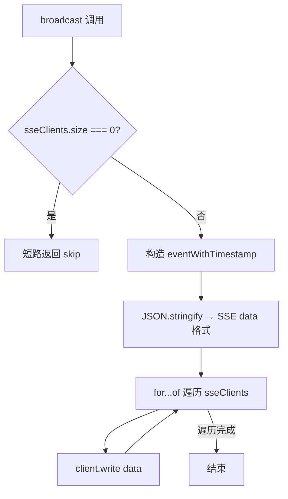
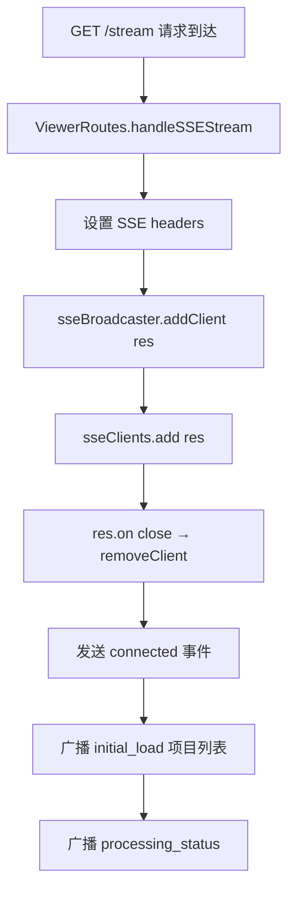

# PD-112.01 claude-mem — SSE 三层事件流架构

> 文档编号：PD-112.01
> 来源：claude-mem `src/services/worker/SSEBroadcaster.ts`
> GitHub：https://github.com/thedotmack/claude-mem.git
> 问题域：PD-112 实时事件流 Real-time Event Streaming
> 状态：可复用方案

---

## 第 1 章 问题与动机

### 1.1 核心问题

Agent 系统在后台处理用户请求时，前端 UI 需要实时感知处理进度——新 prompt 到达、observation 生成、session 完成等事件。传统轮询方案延迟高、浪费带宽；WebSocket 对于单向推送场景过于重量级。SSE（Server-Sent Events）是服务端→客户端单向推送的最佳选择，但需要解决连接池管理、断连重连、事件语义化等工程问题。

claude-mem 作为 Claude Code 的记忆插件，其 Web Viewer UI 需要实时展示记忆流（observations、summaries、prompts），同时显示后台处理队列深度和活跃状态。这要求一套完整的 SSE 事件流架构。

### 1.2 claude-mem 的解法概述

claude-mem 采用三层 SSE 架构：

1. **传输层 — SSEBroadcaster**（`src/services/worker/SSEBroadcaster.ts:15`）：管理 SSE 客户端连接池（`Set<Response>`），提供 `broadcast()` 单次遍历广播，自动清理断连客户端
2. **语义层 — SessionEventBroadcaster**（`src/services/worker/events/SessionEventBroadcaster.ts:12`）：封装 session 生命周期事件（`new_prompt` / `session_started` / `observation_queued` / `session_completed`），每次广播后自动同步 processing status
3. **业务层 — ObservationBroadcaster**（`src/services/worker/agents/ObservationBroadcaster.ts:23`）：Agent 处理完成后广播 `new_observation` / `new_summary`，通过 WorkerRef 安全引用 SSEBroadcaster
4. **消费层 — useSSE Hook**（`src/ui/viewer/hooks/useSSE.ts:6`）：React Hook 封装 EventSource，自动重连（3s 延迟），按事件类型分发到独立 state

### 1.3 设计思想

| 设计原则 | 具体实现 | 理由 | 替代方案 |
|----------|----------|------|----------|
| 单次遍历广播 | `for (const client of this.sseClients) { client.write(data) }` 无 try-catch 包裹 | Express Response.write 不抛异常，断连由 `close` 事件异步清理，避免两步遍历（先写后清）的性能开销 | 两步法：先收集失败客户端再批量删除 |
| 短路无客户端 | `if (this.sseClients.size === 0) return` | 无客户端时跳过 JSON 序列化和遍历，减少无效计算 | 始终序列化后遍历空集合 |
| 语义化事件封装 | SessionEventBroadcaster 提供 `broadcastNewPrompt()` 等方法 | 调用方无需关心 SSE 协议细节和 processing status 同步逻辑 | 各处直接调用 `sseBroadcaster.broadcast()` |
| 连接即推送 | `addClient()` 立即发送 `connected` 事件 + `initial_load` + `processing_status` | 客户端连接后立即获得完整状态，无需额外请求 | 客户端连接后主动请求初始状态 |
| 自动重连 | 客户端 `onerror` 后 3s 延迟重连 | SSE 连接可能因网络波动断开，自动重连保证最终一致性 | 手动刷新页面 |

---

## 第 2 章 源码实现分析

### 2.1 架构概览

claude-mem 的 SSE 事件流架构分为服务端三层和客户端一层：

```
┌─────────────────────────────────────────────────────────────────┐
│                        Web Viewer (React)                       │
│  useSSE() Hook ← EventSource ← GET /stream                     │
│  ┌──────────┐ ┌──────────┐ ┌──────────┐ ┌──────────────────┐   │
│  │ prompts  │ │ obs      │ │ summaries│ │ processingStatus │   │
│  └──────────┘ └──────────┘ └──────────┘ └──────────────────┘   │
└─────────────────────────────────────────────────────────────────┘
                              ▲ SSE data: ${JSON.stringify(event)}\n\n
┌─────────────────────────────────────────────────────────────────┐
│                     SSEBroadcaster (传输层)                      │
│  sseClients: Set<Response>                                      │
│  broadcast() → 单次遍历 write                                    │
│  addClient() → close 事件自动清理                                 │
└──────────┬──────────────────────────────────┬───────────────────┘
           │                                  │
┌──────────▼──────────┐          ┌────────────▼────────────────┐
│ SessionEventBroadcaster │      │ ObservationBroadcaster      │
│ (语义层)                │      │ (业务层)                     │
│ broadcastNewPrompt()    │      │ broadcastObservation()      │
│ broadcastSessionStarted │      │ broadcastSummary()          │
│ broadcastObservationQueued│    │ WorkerRef?.sseBroadcaster   │
│ broadcastSessionCompleted │    └─────────────────────────────┘
│ + auto broadcastProcessingStatus │
└──────────────────────────────────┘
```

### 2.2 核心实现

#### 传输层：SSEBroadcaster 单次遍历广播



对应源码 `src/services/worker/SSEBroadcaster.ts:45-59`：

```typescript
broadcast(event: SSEEvent): void {
  if (this.sseClients.size === 0) {
    logger.debug('WORKER', 'SSE broadcast skipped (no clients)', { eventType: event.type });
    return; // Short-circuit if no clients
  }

  const eventWithTimestamp = { ...event, timestamp: Date.now() };
  const data = `data: ${JSON.stringify(eventWithTimestamp)}\n\n`;

  logger.debug('WORKER', 'SSE broadcast sent', { eventType: event.type, clients: this.sseClients.size });

  // Single-pass write
  for (const client of this.sseClients) {
    client.write(data);
  }
}
```

关键设计：使用 `Set<Response>` 而非数组，`delete` 操作 O(1)；`broadcast` 不做 try-catch，因为 Express `res.write()` 对已断开连接不抛异常，断连清理由 `res.on('close')` 回调异步完成（`SSEBroadcaster.ts:26-28`）。

#### 连接管理：addClient 与自动清理



对应源码 `src/services/worker/SSEBroadcaster.ts:21-32` 和 `src/services/worker/http/routes/ViewerRoutes.ts:70-95`：

```typescript
// SSEBroadcaster.ts:21-32
addClient(res: Response): void {
  this.sseClients.add(res);
  logger.debug('WORKER', 'Client connected', { total: this.sseClients.size });

  // Setup cleanup on disconnect
  res.on('close', () => {
    this.removeClient(res);
  });

  // Send initial event
  this.sendToClient(res, { type: 'connected', timestamp: Date.now() });
}

// ViewerRoutes.ts:70-95
private handleSSEStream = this.wrapHandler((req: Request, res: Response): void => {
  res.setHeader('Content-Type', 'text/event-stream');
  res.setHeader('Cache-Control', 'no-cache');
  res.setHeader('Connection', 'keep-alive');

  this.sseBroadcaster.addClient(res);

  const allProjects = this.dbManager.getSessionStore().getAllProjects();
  this.sseBroadcaster.broadcast({
    type: 'initial_load',
    projects: allProjects,
    timestamp: Date.now()
  });

  const isProcessing = this.sessionManager.isAnySessionProcessing();
  const queueDepth = this.sessionManager.getTotalActiveWork();
  this.sseBroadcaster.broadcast({
    type: 'processing_status',
    isProcessing,
    queueDepth
  });
});
```

### 2.3 实现细节

#### 语义层：SessionEventBroadcaster 的双重广播模式

SessionEventBroadcaster 的每个方法都执行"事件广播 + 状态同步"双重操作。以 `broadcastNewPrompt` 为例（`SessionEventBroadcaster.ts:22-44`）：

1. 广播 `new_prompt` 事件（携带 prompt 详情）
2. 广播 `processing_status` 事件（`isProcessing: true`）
3. 调用 `workerService.broadcastProcessingStatus()` 更新队列深度

这种模式确保 UI 在收到业务事件的同时，总能获得最新的处理状态。

#### 业务层：ObservationBroadcaster 的安全引用

`ObservationBroadcaster.ts:23-35` 使用 `WorkerRef` 可选引用模式：

```typescript
export function broadcastObservation(
  worker: WorkerRef | undefined,
  payload: ObservationSSEPayload
): void {
  if (!worker?.sseBroadcaster) {
    return; // 安全短路：worker 未初始化时静默跳过
  }
  worker.sseBroadcaster.broadcast({
    type: 'new_observation',
    observation: payload
  });
}
```

Agent 处理模块不直接依赖 SSEBroadcaster 实例，而是通过 `WorkerRef` 间接引用，解耦了 Agent 逻辑与 SSE 传输。

#### 客户端：useSSE Hook 的重连策略

`src/ui/viewer/hooks/useSSE.ts:36-46` 实现了断连自动重连：

```typescript
eventSource.onerror = (error) => {
  setIsConnected(false);
  eventSource.close();
  reconnectTimeoutRef.current = setTimeout(() => {
    reconnectTimeoutRef.current = undefined;
    connect();
  }, TIMING.SSE_RECONNECT_DELAY_MS); // 3000ms
};
```

重连延迟 3 秒（`src/ui/viewer/constants/timing.ts:7`），避免服务端重启时客户端疯狂重连。

#### 事件类型体系

客户端 `StreamEvent` 联合类型（`src/ui/viewer/types.ts:45-55`）定义了 5 种事件：

| 事件类型 | 触发时机 | 携带数据 |
|----------|----------|----------|
| `initial_load` | 客户端连接时 | `projects: string[]` |
| `new_observation` | Agent 生成 observation | `observation: Observation` |
| `new_summary` | Agent 生成 summary | `summary: Summary` |
| `new_prompt` | 用户发送新 prompt | `prompt: UserPrompt` |
| `processing_status` | 队列变化时 | `isProcessing: boolean, queueDepth: number` |

服务端还有 `session_started`、`session_completed`、`observation_queued`、`connected` 等事件，但客户端 `useSSE` 未消费（仅用于日志/调试）。


---

## 第 3 章 迁移指南

### 3.1 迁移清单

**阶段 1：传输层（SSEBroadcaster）**
- [ ] 创建 `SSEBroadcaster` 类，使用 `Set<Response>` 管理客户端
- [ ] 实现 `addClient()`：注册客户端 + `close` 事件自动清理
- [ ] 实现 `broadcast()`：短路检查 + 单次遍历 write
- [ ] 创建 SSE 路由端点（`GET /stream`），设置 `text/event-stream` headers

**阶段 2：语义层（可选）**
- [ ] 创建 `EventBroadcaster` 封装业务事件方法
- [ ] 每个方法内自动同步 processing status

**阶段 3：客户端消费**
- [ ] 创建 `useSSE()` Hook（或等效的 EventSource 封装）
- [ ] 实现断连自动重连（建议 3-5s 延迟）
- [ ] 按事件类型分发到独立 state

### 3.2 适配代码模板

#### 传输层模板（TypeScript + Express）

```typescript
import type { Response } from 'express';

interface SSEEvent {
  type: string;
  timestamp?: number;
  [key: string]: any;
}

export class SSEBroadcaster {
  private clients = new Set<Response>();

  addClient(res: Response): void {
    // 设置 SSE headers
    res.setHeader('Content-Type', 'text/event-stream');
    res.setHeader('Cache-Control', 'no-cache');
    res.setHeader('Connection', 'keep-alive');

    this.clients.add(res);

    // 断连自动清理
    res.on('close', () => {
      this.clients.delete(res);
    });

    // 发送连接确认
    this.sendTo(res, { type: 'connected' });
  }

  broadcast(event: SSEEvent): void {
    if (this.clients.size === 0) return;

    const data = `data: ${JSON.stringify({ ...event, timestamp: Date.now() })}\n\n`;
    for (const client of this.clients) {
      client.write(data);
    }
  }

  private sendTo(res: Response, event: SSEEvent): void {
    res.write(`data: ${JSON.stringify(event)}\n\n`);
  }

  get clientCount(): number {
    return this.clients.size;
  }
}
```

#### 客户端消费模板（React Hook）

```typescript
import { useState, useEffect, useRef } from 'react';

const RECONNECT_DELAY = 3000;

export function useSSE<T extends { type: string }>(url: string) {
  const [events, setEvents] = useState<T[]>([]);
  const [connected, setConnected] = useState(false);
  const esRef = useRef<EventSource | null>(null);
  const timerRef = useRef<ReturnType<typeof setTimeout>>();

  useEffect(() => {
    const connect = () => {
      esRef.current?.close();
      const es = new EventSource(url);
      esRef.current = es;

      es.onopen = () => {
        setConnected(true);
        if (timerRef.current) clearTimeout(timerRef.current);
      };

      es.onerror = () => {
        setConnected(false);
        es.close();
        timerRef.current = setTimeout(connect, RECONNECT_DELAY);
      };

      es.onmessage = (e) => {
        const data = JSON.parse(e.data) as T;
        setEvents(prev => [data, ...prev]);
      };
    };

    connect();
    return () => {
      esRef.current?.close();
      if (timerRef.current) clearTimeout(timerRef.current);
    };
  }, [url]);

  return { events, connected };
}
```

### 3.3 适用场景

| 场景 | 适用度 | 说明 |
|------|--------|------|
| Agent 处理进度实时展示 | ⭐⭐⭐ | 核心场景：后台 Agent 处理，前端实时展示 |
| 多用户协作实时同步 | ⭐⭐ | SSE 是单向推送，双向通信需 WebSocket |
| 日志/监控面板 | ⭐⭐⭐ | 服务端日志实时推送到 Web 面板 |
| 聊天应用 | ⭐ | 需要双向通信，SSE 不适合 |
| 高并发推送（>1000 客户端） | ⭐⭐ | Set 遍历 + write 可支撑中等规模，超大规模需 Redis Pub/Sub |

---

## 第 4 章 测试用例

```typescript
import { describe, it, expect, vi, beforeEach } from 'vitest';

// Mock Express Response
function createMockResponse() {
  const res = {
    setHeader: vi.fn(),
    write: vi.fn(),
    on: vi.fn(),
    _closeHandlers: [] as Function[],
  };
  res.on.mockImplementation((event: string, handler: Function) => {
    if (event === 'close') res._closeHandlers.push(handler);
  });
  return res;
}

describe('SSEBroadcaster', () => {
  let broadcaster: SSEBroadcaster;

  beforeEach(() => {
    broadcaster = new SSEBroadcaster();
  });

  describe('addClient', () => {
    it('should register client and send connected event', () => {
      const res = createMockResponse();
      broadcaster.addClient(res as any);

      expect(broadcaster.getClientCount()).toBe(1);
      expect(res.write).toHaveBeenCalledWith(
        expect.stringContaining('"type":"connected"')
      );
    });

    it('should auto-remove client on close event', () => {
      const res = createMockResponse();
      broadcaster.addClient(res as any);
      expect(broadcaster.getClientCount()).toBe(1);

      // Simulate disconnect
      res._closeHandlers.forEach(h => h());
      expect(broadcaster.getClientCount()).toBe(0);
    });
  });

  describe('broadcast', () => {
    it('should short-circuit when no clients connected', () => {
      // No clients — broadcast should not throw
      broadcaster.broadcast({ type: 'test' });
      // No assertion needed — just verifying no error
    });

    it('should write SSE-formatted data to all clients', () => {
      const res1 = createMockResponse();
      const res2 = createMockResponse();
      broadcaster.addClient(res1 as any);
      broadcaster.addClient(res2 as any);

      broadcaster.broadcast({ type: 'new_observation', id: 42 });

      // Both clients should receive the event
      expect(res1.write).toHaveBeenCalledWith(
        expect.stringMatching(/^data: \{.*"type":"new_observation".*\}\n\n$/)
      );
      expect(res2.write).toHaveBeenCalledWith(
        expect.stringMatching(/^data: \{.*"type":"new_observation".*\}\n\n$/)
      );
    });

    it('should add timestamp to broadcast events', () => {
      const res = createMockResponse();
      broadcaster.addClient(res as any);

      const before = Date.now();
      broadcaster.broadcast({ type: 'test' });
      const after = Date.now();

      const lastCall = res.write.mock.calls[res.write.mock.calls.length - 1][0];
      const parsed = JSON.parse(lastCall.replace('data: ', '').trim());
      expect(parsed.timestamp).toBeGreaterThanOrEqual(before);
      expect(parsed.timestamp).toBeLessThanOrEqual(after);
    });
  });

  describe('SessionEventBroadcaster', () => {
    it('should broadcast new_prompt with processing_status', () => {
      const mockBroadcaster = { broadcast: vi.fn() };
      const mockWorker = { broadcastProcessingStatus: vi.fn() };
      const seb = new SessionEventBroadcaster(mockBroadcaster as any, mockWorker as any);

      seb.broadcastNewPrompt({
        id: 1,
        content_session_id: 'sess-1',
        project: 'test',
        prompt_number: 1,
        prompt_text: 'hello',
        created_at_epoch: Date.now()
      });

      // Should broadcast new_prompt + processing_status
      expect(mockBroadcaster.broadcast).toHaveBeenCalledTimes(2);
      expect(mockBroadcaster.broadcast).toHaveBeenCalledWith(
        expect.objectContaining({ type: 'new_prompt' })
      );
      expect(mockBroadcaster.broadcast).toHaveBeenCalledWith(
        expect.objectContaining({ type: 'processing_status', isProcessing: true })
      );
      expect(mockWorker.broadcastProcessingStatus).toHaveBeenCalled();
    });
  });
});
```


---

## 第 5 章 跨域关联

| 关联域 | 关系类型 | 说明 |
|--------|----------|------|
| PD-11 可观测性 | 协同 | SSE 事件流是可观测性的实时传输通道，processing_status 事件直接反映系统负载 |
| PD-09 Human-in-the-Loop | 协同 | 实时事件流让用户感知 Agent 处理进度，是 HITL 交互的基础设施 |
| PD-02 多 Agent 编排 | 依赖 | SessionEventBroadcaster 的事件（session_started/completed）反映编排状态变化 |
| PD-03 容错与重试 | 协同 | 客户端 useSSE 的自动重连机制是前端层面的容错策略 |
| PD-06 记忆持久化 | 协同 | SSE 推送的 observation/summary 事件是记忆系统写入后的实时通知 |

---

## 第 6 章 来源文件索引

| 文件 | 行范围 | 关键实现 |
|------|--------|----------|
| `src/services/worker/SSEBroadcaster.ts` | L15-L76 | SSE 传输层：客户端连接池 + 单次遍历广播 |
| `src/services/worker/events/SessionEventBroadcaster.ts` | L12-L97 | 语义层：session 生命周期事件封装 |
| `src/services/worker/agents/ObservationBroadcaster.ts` | L23-L55 | 业务层：observation/summary 广播 |
| `src/services/worker/http/routes/ViewerRoutes.ts` | L70-L95 | SSE 端点：GET /stream 路由处理 |
| `src/services/worker-service.ts` | L167-L215 | WorkerService 构造：SSEBroadcaster 实例化与注入 |
| `src/services/worker-service.ts` | L872-L888 | broadcastProcessingStatus：队列深度广播 |
| `src/services/worker-types.ts` | L77-L83 | SSEEvent / SSEClient 类型定义 |
| `src/ui/viewer/hooks/useSSE.ts` | L6-L109 | 客户端 React Hook：EventSource + 自动重连 |
| `src/ui/viewer/types.ts` | L45-L55 | StreamEvent 联合类型定义 |
| `src/ui/viewer/constants/timing.ts` | L7 | SSE_RECONNECT_DELAY_MS = 3000 |

---

## 第 7 章 横向对比维度

```json comparison_data
{
  "project": "claude-mem",
  "dimensions": {
    "传输协议": "SSE（text/event-stream），Express res.write 单向推送",
    "连接池结构": "Set<Response> 内存集合，O(1) 增删，单次遍历广播",
    "事件类型体系": "5 种客户端事件 + 4 种服务端事件，联合类型约束",
    "断连处理": "服务端 res.on('close') 自动清理，客户端 3s 延迟重连",
    "语义封装": "三层架构：传输层 SSEBroadcaster → 语义层 SessionEventBroadcaster → 业务层 ObservationBroadcaster",
    "状态同步": "每次业务事件广播后自动同步 processing_status（队列深度 + 活跃状态）"
  }
}
```

### 域元数据补充

```json domain_metadata
{
  "solution_summary": "claude-mem 用三层 SSE 架构（传输层 Set<Response> 连接池 + 语义层 SessionEventBroadcaster + 业务层 ObservationBroadcaster）实现 Agent 记忆流实时推送",
  "description": "服务端→客户端单向事件推送的分层架构设计与断连恢复",
  "sub_problems": [
    "事件类型体系设计与客户端分发",
    "连接时初始状态同步",
    "业务事件与状态事件的自动联动"
  ],
  "best_practices": [
    "三层封装：传输层/语义层/业务层职责分离",
    "连接即推送：addClient 后立即发送 initial_load + processing_status",
    "WorkerRef 可选引用模式解耦 Agent 与 SSE 传输"
  ]
}
```
