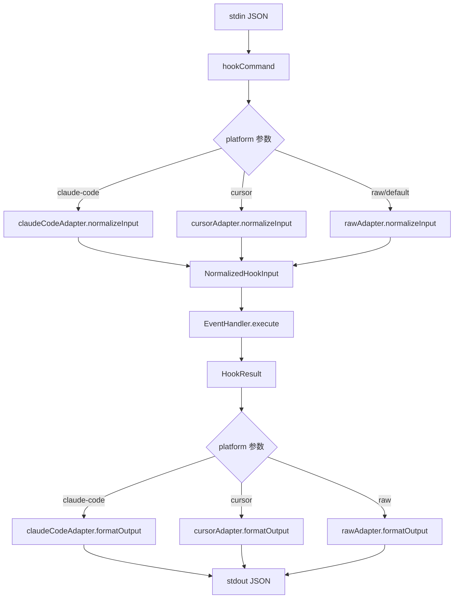
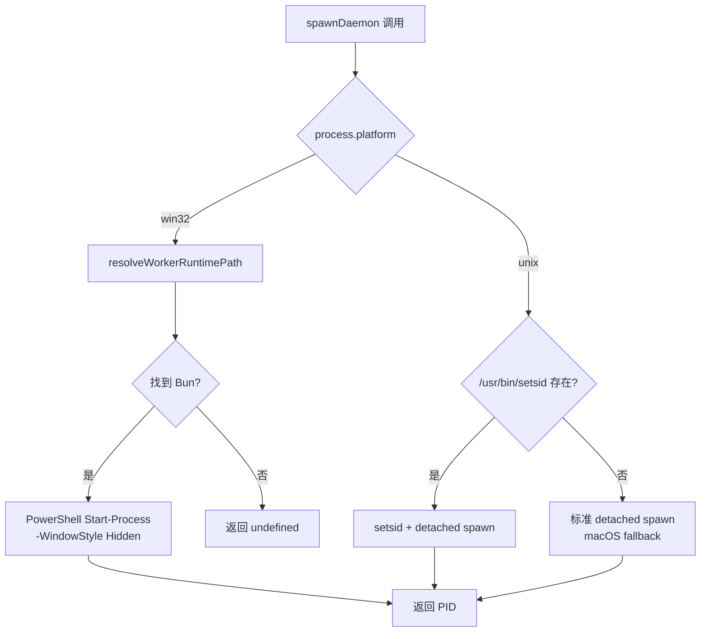
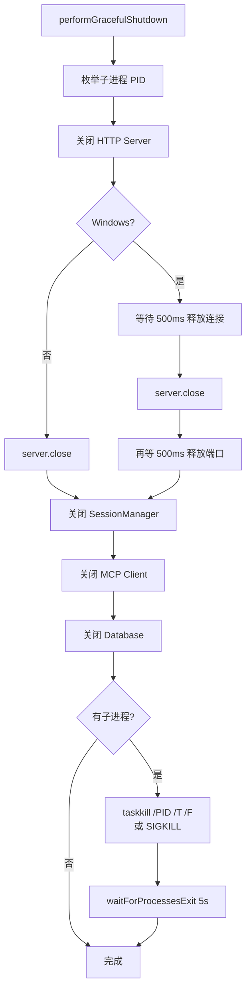

# PD-113.01 claude-mem — Adapter 模式多 IDE 平台适配 + 跨 OS 守护进程管理

> 文档编号：PD-113.01
> 来源：claude-mem `src/cli/adapters/`, `src/services/infrastructure/ProcessManager.ts`, `src/services/integrations/CursorHooksInstaller.ts`
> GitHub：https://github.com/thedotmack/claude-mem.git
> 问题域：PD-113 平台适配 Platform Adaptation
> 状态：可复用方案

---

## 第 1 章 问题与动机

### 1.1 核心问题

claude-mem 是一个为 AI 编码助手提供持久记忆的工具，需要同时支持多个 IDE 平台（Claude Code、Cursor、Codex CLI 等）和多个操作系统（Windows、macOS、Linux）。每个 IDE 的 hook 输入格式不同（字段名、嵌套结构、可选字段），每个 OS 的进程管理方式不同（信号机制、守护进程生成、子进程枚举、超时特性）。

如果不做抽象，核心业务逻辑（记忆存储、上下文注入、会话管理）会被大量 `if (platform === 'cursor')` 和 `if (process.platform === 'win32')` 污染，导致：
- 新增 IDE 支持需要修改所有 handler
- 平台 bug 修复散落在各处，容易遗漏
- 测试矩阵爆炸（IDE × OS × hook 类型）

### 1.2 claude-mem 的解法概述

1. **IDE 适配层**：三个 PlatformAdapter（claude-code/cursor/raw）实现统一的 `normalizeInput` + `formatOutput` 接口，将不同 IDE 的 JSON 格式标准化为 `NormalizedHookInput`（`src/cli/adapters/index.ts:6`）
2. **OS 适配层**：`ProcessManager.ts` 集中处理 Windows/Unix 差异——守护进程生成用 PowerShell Start-Process vs setsid/detached spawn，子进程枚举用 WQL Get-CimInstance vs ps，进程终止用 taskkill /T /F vs SIGKILL（`src/services/infrastructure/ProcessManager.ts:622-696`）
3. **超时倍率系统**：双层超时调整——hook 侧 1.5x（`hook-constants.ts:10`），worker 侧 2.0x（`ProcessManager.ts:174-177`），Windows 系统性能差异通过乘数因子补偿
4. **Cursor 深度集成**：`CursorHooksInstaller.ts` 处理 Cursor IDE 的 hooks.json 生成、MCP 配置、上下文文件管理、项目注册表，支持 project/user/enterprise 三级安装（`src/services/integrations/CursorHooksInstaller.ts:296-392`）
5. **Windows 僵尸进程防护**：`GracefulShutdown.ts` 在关闭时先枚举子进程再逐步关闭服务，Windows 额外等待 500ms 释放端口（`src/services/infrastructure/GracefulShutdown.ts:57-130`）

### 1.3 设计思想

| 设计原则 | 具体实现 | 理由 | 替代方案 |
|----------|----------|------|----------|
| Adapter 模式隔离 IDE 差异 | PlatformAdapter 接口 + 3 个实现 | 新增 IDE 只需加一个 adapter 文件，不改 handler | 在每个 handler 里 switch/case |
| 平台检测集中化 | `process.platform === 'win32'` 判断集中在 ProcessManager | 避免平台判断散落各处 | 每个模块自行判断 |
| 超时乘数因子 | 1.5x hook 侧 / 2.0x worker 侧 | Windows I/O 和进程操作系统性慢，用乘数而非硬编码值 | 为每个平台维护独立超时表 |
| 优雅降级 | setsid 不存在时 fallback 到 detached spawn | macOS 无 setsid，Linux 有 | 强制要求 setsid |
| 安全性优先 | PID 验证 + 命令注入防护 | 所有 taskkill/kill 前验证 PID 为正整数 | 直接拼接 PID 到命令 |

---

## 第 2 章 源码实现分析

### 2.1 架构概览

claude-mem 的平台适配分为两个正交维度：IDE 适配（输入输出格式）和 OS 适配（进程管理）。

```
┌─────────────────────────────────────────────────────────┐
│                    Hook Entry Point                      │
│              hook-command.ts:hookCommand()                │
├─────────────┬───────────────────────┬───────────────────┤
│ Claude Code │       Cursor          │    Raw / Codex    │
│  Adapter    │      Adapter          │     Adapter       │
│ (snake_case)│ (conversation_id,     │  (passthrough,    │
│             │  workspace_roots)     │   camel+snake)    │
├─────────────┴───────────────────────┴───────────────────┤
│              NormalizedHookInput (统一格式)               │
├─────────────────────────────────────────────────────────┤
│              Event Handlers (平台无关)                    │
│     session-init / context / observation / summarize     │
├─────────────────────────────────────────────────────────┤
│              Worker Service (HTTP API)                    │
├──────────────────────┬──────────────────────────────────┤
│   ProcessManager     │    GracefulShutdown              │
│  (OS 进程管理)       │   (OS 关闭协调)                   │
│  ┌────────┬────────┐ │  ┌──────────┬──────────┐        │
│  │Windows │ Unix   │ │  │ Windows  │  Unix    │        │
│  │PowerSh │ setsid │ │  │ taskkill │ SIGKILL  │        │
│  │WQL     │ ps     │ │  │ 500ms    │ 即时     │        │
│  └────────┴────────┘ │  └──────────┴──────────┘        │
└──────────────────────┴──────────────────────────────────┘
```

### 2.2 核心实现

#### 2.2.1 IDE Adapter 模式



对应源码 `src/cli/hook-command.ts:68-90`：

```typescript
export async function hookCommand(platform: string, event: string, options: HookCommandOptions = {}): Promise<number> {
  const originalStderrWrite = process.stderr.write.bind(process.stderr);
  process.stderr.write = (() => true) as typeof process.stderr.write;

  try {
    const adapter = getPlatformAdapter(platform);
    const handler = getEventHandler(event);

    const rawInput = await readJsonFromStdin();
    const input = adapter.normalizeInput(rawInput);
    input.platform = platform;  // Inject platform for handler-level decisions
    const result = await handler.execute(input);
    const output = adapter.formatOutput(result);

    console.log(JSON.stringify(output));
    const exitCode = result.exitCode ?? HOOK_EXIT_CODES.SUCCESS;
    if (!options.skipExit) {
      process.exit(exitCode);
    }
    return exitCode;
  } catch (error) {
    // ... error handling with graceful degradation
  }
}
```

Adapter 工厂 `src/cli/adapters/index.ts:6-14`：

```typescript
export function getPlatformAdapter(platform: string): PlatformAdapter {
  switch (platform) {
    case 'claude-code': return claudeCodeAdapter;
    case 'cursor': return cursorAdapter;
    case 'raw': return rawAdapter;
    default: return rawAdapter;  // Codex CLI 等兼容平台用 raw
  }
}
```

Cursor Adapter 处理多版本字段差异 `src/cli/adapters/cursor.ts:11-33`：

```typescript
export const cursorAdapter: PlatformAdapter = {
  normalizeInput(raw) {
    const r = (raw ?? {}) as any;
    const isShellCommand = !!r.command && !r.tool_name;
    return {
      sessionId: r.conversation_id || r.generation_id || r.id,
      cwd: r.workspace_roots?.[0] ?? r.cwd ?? process.cwd(),
      prompt: r.prompt ?? r.query ?? r.input ?? r.message,
      toolName: isShellCommand ? 'Bash' : r.tool_name,
      toolInput: isShellCommand ? { command: r.command } : r.tool_input,
      toolResponse: isShellCommand ? { output: r.output } : r.result_json,
      transcriptPath: undefined,  // Cursor 不提供 transcript
      filePath: r.file_path,
      edits: r.edits,
    };
  },
  formatOutput(result) {
    return { continue: result.continue ?? true };
  }
};
```


#### 2.2.2 跨 OS 守护进程生成



对应源码 `src/services/infrastructure/ProcessManager.ts:622-696`：

```typescript
export function spawnDaemon(
  scriptPath: string,
  port: number,
  extraEnv: Record<string, string> = {}
): number | undefined {
  const isWindows = process.platform === 'win32';
  const env = {
    ...process.env,
    CLAUDE_MEM_WORKER_PORT: String(port),
    ...extraEnv
  };

  if (isWindows) {
    const runtimePath = resolveWorkerRuntimePath();
    if (!runtimePath) {
      logger.error('SYSTEM', 'Failed to locate Bun runtime for Windows worker spawn');
      return undefined;
    }
    const escapedRuntimePath = runtimePath.replace(/'/g, "''");
    const escapedScriptPath = scriptPath.replace(/'/g, "''");
    const psCommand = `Start-Process -FilePath '${escapedRuntimePath}' -ArgumentList '${escapedScriptPath}','--daemon' -WindowStyle Hidden`;
    try {
      execSync(`powershell -NoProfile -Command "${psCommand}"`, {
        stdio: 'ignore', windowsHide: true, env
      });
      return 0;  // Windows sentinel: PID unknown but process spawned
    } catch (error) {
      return undefined;
    }
  }

  // Unix: setsid 创建新会话，防止 SIGHUP 传播
  const setsidPath = '/usr/bin/setsid';
  if (existsSync(setsidPath)) {
    const child = spawn(setsidPath, [process.execPath, scriptPath, '--daemon'], {
      detached: true, stdio: 'ignore', env
    });
    if (child.pid === undefined) return undefined;
    child.unref();
    return child.pid;
  }

  // Fallback: macOS 等无 setsid 的系统
  const child = spawn(process.execPath, [scriptPath, '--daemon'], {
    detached: true, stdio: 'ignore', env
  });
  if (child.pid === undefined) return undefined;
  child.unref();
  return child.pid;
}
```

#### 2.2.3 Windows 僵尸进程清理



对应源码 `src/services/infrastructure/GracefulShutdown.ts:111-130`：

```typescript
async function closeHttpServer(server: http.Server): Promise<void> {
  server.closeAllConnections();
  // Windows 需要额外时间释放 socket
  if (process.platform === 'win32') {
    await new Promise(r => setTimeout(r, 500));
  }
  await new Promise<void>((resolve, reject) => {
    server.close(err => err ? reject(err) : resolve());
  });
  // Windows 额外延迟确保端口完全释放
  if (process.platform === 'win32') {
    await new Promise(r => setTimeout(r, 500));
    logger.info('SYSTEM', 'Waited for Windows port cleanup');
  }
}
```

### 2.3 实现细节

**双层超时倍率系统**：claude-mem 区分 hook 侧（客户端快路径）和 worker 侧（服务端慢路径）的超时调整：

- Hook 侧 1.5x（`src/shared/hook-constants.ts:10,30-34`）：健康检查、启动等待等快速操作
- Worker 侧 2.0x（`src/services/infrastructure/ProcessManager.ts:174-177`）：socket 操作、进程枚举等慢操作

```typescript
// hook-constants.ts — hook 侧 1.5x
export function getTimeout(baseTimeout: number): number {
  return process.platform === 'win32'
    ? Math.round(baseTimeout * HOOK_TIMEOUTS.WINDOWS_MULTIPLIER)  // 1.5
    : baseTimeout;
}

// ProcessManager.ts — worker 侧 2.0x
export function getPlatformTimeout(baseMs: number): number {
  const WINDOWS_MULTIPLIER = 2.0;
  return process.platform === 'win32' ? Math.round(baseMs * WINDOWS_MULTIPLIER) : baseMs;
}
```

**Windows Bun 运行时解析**：Windows 上 worker-service.cjs 依赖 `bun:sqlite`，必须用 Bun 运行。`resolveWorkerRuntimePath()` 按优先级搜索 8 个候选路径（`ProcessManager.ts:78-122`）：环境变量 BUN/BUN_PATH → ~/.bun/bin/ → USERPROFILE → LOCALAPPDATA → PATH 查找。

**Windows .cmd 文件处理**：SDK 生成的 spawn 命令在 Windows 上可能是 .cmd 文件，需要 `cmd.exe /d /c` 包装才能正确处理含空格的路径（`ProcessRegistry.ts:337-346`）。

**孤儿进程分级清理**：`aggressiveStartupCleanup()` 区分两类进程——worker-service.cjs 和 chroma-mcp 立即杀死（不应存活于父进程之外），mcp-server.cjs 保留 30 分钟年龄门控（可能合法运行中）（`ProcessManager.ts:431-571`）。

---

## 第 3 章 迁移指南

### 3.1 迁移清单

**阶段 1：IDE Adapter 层**
- [ ] 定义 `NormalizedInput` 接口（统一所有 IDE 的输入字段）
- [ ] 定义 `PlatformAdapter` 接口（normalizeInput + formatOutput）
- [ ] 实现第一个 adapter（如 claude-code）
- [ ] 实现 adapter 工厂函数（switch + default fallback）
- [ ] 在 hook 入口点集成 adapter 调用链

**阶段 2：OS 适配层**
- [ ] 集中所有 `process.platform` 判断到 ProcessManager 模块
- [ ] 实现 `spawnDaemon()` 的 Windows/Unix 分支
- [ ] 实现超时倍率函数（区分快路径/慢路径）
- [ ] 实现跨平台进程枚举（PowerShell WQL vs ps）
- [ ] 实现跨平台进程终止（taskkill /T /F vs SIGKILL）

**阶段 3：IDE 深度集成**
- [ ] 实现 IDE 配置文件生成（如 Cursor hooks.json）
- [ ] 实现安装/卸载/状态检查命令
- [ ] 实现上下文文件自动更新机制

### 3.2 适配代码模板

**IDE Adapter 模板（TypeScript）：**

```typescript
// types.ts
export interface NormalizedInput {
  sessionId: string;
  cwd: string;
  platform?: string;
  prompt?: string;
  toolName?: string;
  toolInput?: unknown;
  toolResponse?: unknown;
}

export interface AdapterResult {
  continue?: boolean;
  systemMessage?: string;
  exitCode?: number;
}

export interface PlatformAdapter {
  normalizeInput(raw: unknown): NormalizedInput;
  formatOutput(result: AdapterResult): unknown;
}

// adapters/factory.ts
const adapters: Record<string, PlatformAdapter> = {};

export function registerAdapter(name: string, adapter: PlatformAdapter): void {
  adapters[name] = adapter;
}

export function getAdapter(platform: string): PlatformAdapter {
  return adapters[platform] ?? adapters['raw'];
}

// adapters/cursor.ts — 示例：处理多版本字段差异
export const cursorAdapter: PlatformAdapter = {
  normalizeInput(raw) {
    const r = (raw ?? {}) as Record<string, any>;
    return {
      sessionId: r.conversation_id || r.generation_id || r.id || 'unknown',
      cwd: r.workspace_roots?.[0] ?? r.cwd ?? process.cwd(),
      prompt: r.prompt ?? r.query ?? r.input ?? r.message,
      toolName: r.command ? 'Bash' : r.tool_name,
      toolInput: r.command ? { command: r.command } : r.tool_input,
      toolResponse: r.command ? { output: r.output } : r.result_json,
    };
  },
  formatOutput(result) {
    return { continue: result.continue ?? true };
  }
};
```

**跨平台守护进程生成模板：**

```typescript
import { spawn, execSync } from 'child_process';
import { existsSync } from 'fs';

export function spawnDaemon(script: string, env: Record<string, string> = {}): number | undefined {
  const fullEnv = { ...process.env, ...env };

  if (process.platform === 'win32') {
    // Windows: PowerShell Start-Process 创建独立隐藏进程
    const escaped = script.replace(/'/g, "''");
    try {
      execSync(
        `powershell -NoProfile -Command "Start-Process -FilePath 'node' -ArgumentList '${escaped}' -WindowStyle Hidden"`,
        { stdio: 'ignore', windowsHide: true, env: fullEnv }
      );
      return 0; // PID unknown sentinel
    } catch { return undefined; }
  }

  // Unix: 优先 setsid（新会话，防 SIGHUP），fallback detached
  const args = [process.execPath, script];
  const setsid = '/usr/bin/setsid';
  const cmd = existsSync(setsid) ? setsid : process.execPath;
  const spawnArgs = existsSync(setsid) ? args : [script];

  const child = spawn(cmd, spawnArgs, { detached: true, stdio: 'ignore', env: fullEnv });
  if (!child.pid) return undefined;
  child.unref();
  return child.pid;
}
```

### 3.3 适用场景

| 场景 | 适用度 | 说明 |
|------|--------|------|
| 多 IDE 插件/扩展 | ⭐⭐⭐ | 核心场景：同一后端服务支持多个 IDE 前端 |
| CLI 工具跨平台 | ⭐⭐⭐ | 守护进程管理、进程清理的 Windows/Unix 差异处理 |
| MCP Server 多客户端 | ⭐⭐ | MCP 协议本身已标准化，但客户端 hook 格式仍需适配 |
| 纯 Web 应用 | ⭐ | 无 OS 层差异，IDE adapter 层也不需要 |


---

## 第 4 章 测试用例

```typescript
import { describe, it, expect, vi, beforeEach } from 'vitest';

// ============================================================
// IDE Adapter 测试
// ============================================================

describe('PlatformAdapter', () => {
  describe('claudeCodeAdapter', () => {
    it('should normalize snake_case fields to camelCase', () => {
      const raw = {
        session_id: 'sess-123',
        cwd: '/project',
        tool_name: 'Read',
        tool_input: { path: '/file.ts' },
        tool_response: { content: '...' },
        transcript_path: '/tmp/transcript.json'
      };
      const result = claudeCodeAdapter.normalizeInput(raw);
      expect(result.sessionId).toBe('sess-123');
      expect(result.toolName).toBe('Read');
      expect(result.transcriptPath).toBe('/tmp/transcript.json');
    });

    it('should handle undefined input gracefully (SessionStart)', () => {
      const result = claudeCodeAdapter.normalizeInput(undefined);
      expect(result.sessionId).toBeUndefined();
      expect(result.cwd).toBe(process.cwd());
    });

    it('should format output with hookSpecificOutput', () => {
      const result = claudeCodeAdapter.formatOutput({
        hookSpecificOutput: { hookEventName: 'test', additionalContext: 'ctx' },
        systemMessage: 'msg'
      });
      expect(result).toHaveProperty('hookSpecificOutput');
      expect(result).toHaveProperty('systemMessage', 'msg');
    });
  });

  describe('cursorAdapter', () => {
    it('should normalize Cursor-specific fields', () => {
      const raw = {
        conversation_id: 'conv-456',
        workspace_roots: ['/workspace'],
        query: 'help me',
        result_json: { data: 'response' }
      };
      const result = cursorAdapter.normalizeInput(raw);
      expect(result.sessionId).toBe('conv-456');
      expect(result.cwd).toBe('/workspace');
      expect(result.prompt).toBe('help me');
      expect(result.toolResponse).toEqual({ data: 'response' });
    });

    it('should detect shell commands and map to Bash tool', () => {
      const raw = {
        conversation_id: 'conv-789',
        command: 'ls -la',
        output: 'file1\nfile2'
      };
      const result = cursorAdapter.normalizeInput(raw);
      expect(result.toolName).toBe('Bash');
      expect(result.toolInput).toEqual({ command: 'ls -la' });
      expect(result.toolResponse).toEqual({ output: 'file1\nfile2' });
    });

    it('should fallback session ID through generation_id and id', () => {
      expect(cursorAdapter.normalizeInput({ generation_id: 'gen-1' }).sessionId).toBe('gen-1');
      expect(cursorAdapter.normalizeInput({ id: 'id-1' }).sessionId).toBe('id-1');
    });
  });

  describe('getPlatformAdapter', () => {
    it('should return raw adapter for unknown platforms', () => {
      const adapter = getPlatformAdapter('codex');
      expect(adapter).toBe(rawAdapter);
    });
  });
});

// ============================================================
// 跨平台超时测试
// ============================================================

describe('Platform Timeout', () => {
  it('should apply 1.5x multiplier for hook-side on Windows', () => {
    const original = process.platform;
    Object.defineProperty(process, 'platform', { value: 'win32' });
    expect(getTimeout(3000)).toBe(4500);
    Object.defineProperty(process, 'platform', { value: original });
  });

  it('should apply 2.0x multiplier for worker-side on Windows', () => {
    const original = process.platform;
    Object.defineProperty(process, 'platform', { value: 'win32' });
    expect(getPlatformTimeout(3000)).toBe(6000);
    Object.defineProperty(process, 'platform', { value: original });
  });

  it('should return base timeout on Unix', () => {
    const original = process.platform;
    Object.defineProperty(process, 'platform', { value: 'darwin' });
    expect(getTimeout(3000)).toBe(3000);
    expect(getPlatformTimeout(3000)).toBe(3000);
    Object.defineProperty(process, 'platform', { value: original });
  });
});

// ============================================================
// 守护进程生成测试
// ============================================================

describe('spawnDaemon', () => {
  it('should use setsid on Linux when available', () => {
    // Mock existsSync to return true for /usr/bin/setsid
    vi.spyOn(fs, 'existsSync').mockReturnValue(true);
    const spawnSpy = vi.spyOn(child_process, 'spawn').mockReturnValue(mockChild);
    
    spawnDaemon('/path/to/script.js', 3000);
    
    expect(spawnSpy).toHaveBeenCalledWith(
      '/usr/bin/setsid',
      expect.arrayContaining(['/path/to/script.js', '--daemon']),
      expect.objectContaining({ detached: true, stdio: 'ignore' })
    );
  });

  it('should fallback to detached spawn on macOS', () => {
    vi.spyOn(fs, 'existsSync').mockReturnValue(false);
    const spawnSpy = vi.spyOn(child_process, 'spawn').mockReturnValue(mockChild);
    
    spawnDaemon('/path/to/script.js', 3000);
    
    expect(spawnSpy).toHaveBeenCalledWith(
      process.execPath,
      ['/path/to/script.js', '--daemon'],
      expect.objectContaining({ detached: true })
    );
  });
});

// ============================================================
// 进程存活检测测试
// ============================================================

describe('isProcessAlive', () => {
  it('should treat PID 0 as alive (Windows sentinel)', () => {
    expect(isProcessAlive(0)).toBe(true);
  });

  it('should treat negative PID as dead', () => {
    expect(isProcessAlive(-1)).toBe(false);
  });

  it('should treat EPERM as alive (different user)', () => {
    vi.spyOn(process, 'kill').mockImplementation(() => {
      const err = new Error('EPERM') as NodeJS.ErrnoException;
      err.code = 'EPERM';
      throw err;
    });
    expect(isProcessAlive(12345)).toBe(true);
  });
});
```

---

## 第 5 章 跨域关联

| 关联域 | 关系类型 | 说明 |
|--------|----------|------|
| PD-03 容错与重试 | 协同 | 超时倍率系统直接服务于容错——Windows 超时更长避免误判为失败 |
| PD-04 工具系统 | 协同 | IDE adapter 标准化的 toolName/toolInput 是工具系统的输入源 |
| PD-05 沙箱隔离 | 协同 | 守护进程生成（setsid/detached）是进程级隔离的基础 |
| PD-09 Human-in-the-Loop | 依赖 | Cursor hooks.json 的 beforeSubmitPrompt 是 HITL 的触发点 |
| PD-11 可观测性 | 协同 | ProcessRegistry 的进程追踪为可观测性提供进程级指标 |

---

## 第 6 章 来源文件索引

| 文件 | 行范围 | 关键实现 |
|------|--------|----------|
| `src/cli/types.ts` | L1-L31 | PlatformAdapter 接口定义、NormalizedHookInput、HookResult |
| `src/cli/adapters/index.ts` | L1-L17 | Adapter 工厂函数 getPlatformAdapter |
| `src/cli/adapters/claude-code.ts` | L1-L28 | Claude Code adapter：snake_case 标准化 + hookSpecificOutput 输出 |
| `src/cli/adapters/cursor.ts` | L1-L33 | Cursor adapter：多版本字段兼容 + shell command 检测 |
| `src/cli/adapters/raw.ts` | L1-L22 | Raw adapter：camelCase + snake_case 双格式透传 |
| `src/cli/hook-command.ts` | L68-L112 | Hook 入口：adapter 调用链 + 错误分类（transport vs client bug） |
| `src/shared/hook-constants.ts` | L1-L34 | 超时常量 + hook 侧 1.5x Windows 倍率 |
| `src/services/infrastructure/ProcessManager.ts` | L78-L122 | Windows Bun 运行时路径解析（8 候选路径） |
| `src/services/infrastructure/ProcessManager.ts` | L174-L177 | Worker 侧 2.0x Windows 超时倍率 |
| `src/services/infrastructure/ProcessManager.ts` | L183-L210 | Windows 子进程枚举（PowerShell WQL Get-CimInstance） |
| `src/services/infrastructure/ProcessManager.ts` | L217-L236 | 跨平台进程终止（taskkill /T /F vs SIGKILL） |
| `src/services/infrastructure/ProcessManager.ts` | L622-L696 | 跨平台守护进程生成（PowerShell vs setsid vs detached） |
| `src/services/infrastructure/GracefulShutdown.ts` | L57-L130 | 优雅关闭 + Windows 端口释放延迟 |
| `src/services/integrations/CursorHooksInstaller.ts` | L40-L49 | 平台检测 + 脚本扩展名选择 |
| `src/services/integrations/CursorHooksInstaller.ts` | L206-L224 | Cursor 安装目标路径（project/user/enterprise × 3 OS） |
| `src/services/integrations/CursorHooksInstaller.ts` | L296-L392 | Cursor hooks 安装：hooks.json 生成 + 上下文初始化 |
| `src/services/worker/ProcessRegistry.ts` | L328-L390 | PID 捕获 spawn：Windows .cmd 文件 cmd.exe 包装 |

---

## 第 7 章 横向对比维度

```json comparison_data
{
  "project": "claude-mem",
  "dimensions": {
    "适配架构": "Adapter 模式：PlatformAdapter 接口 + 3 实现（claude-code/cursor/raw）",
    "平台检测": "process.platform 集中在 ProcessManager，IDE 平台由 CLI 参数传入",
    "超时策略": "双层倍率：hook 侧 1.5x + worker 侧 2.0x，区分快慢路径",
    "进程管理": "Windows PowerShell Start-Process / WQL 枚举 / taskkill；Unix setsid / ps / SIGKILL",
    "IDE 集成深度": "Cursor 深度集成（hooks.json + MCP + 上下文文件 + 项目注册表），Claude Code 原生 hook",
    "僵尸进程防护": "三级清理：启动时 aggressive cleanup + 运行时 5min reaper + 关闭时子进程枚举终止"
  }
}
```

```json domain_metadata
{
  "solution_summary": "claude-mem 用 PlatformAdapter 接口统一 Claude Code/Cursor/Raw 三种 IDE 输入输出格式，ProcessManager 集中处理 Windows PowerShell/Unix setsid 守护进程生成与双层超时倍率",
  "description": "IDE hook 格式标准化与跨 OS 进程生命周期管理的工程实践",
  "sub_problems": [
    "IDE 多版本字段兼容（Cursor conversation_id/generation_id/id 等）",
    "Windows Bun 运行时路径解析（8 候选路径优先级搜索）",
    "Windows 僵尸端口防护（socket 继承 + 延迟释放）",
    "孤儿进程分级清理（立即杀死 vs 年龄门控）"
  ],
  "best_practices": [
    "双层超时倍率区分 hook 快路径(1.5x)和 worker 慢路径(2.0x)",
    "Windows 守护进程用 PowerShell Start-Process 而非 WMIC（继承环境变量）",
    "PID 验证防命令注入：所有 taskkill/kill 前校验正整数"
  ]
}
```
