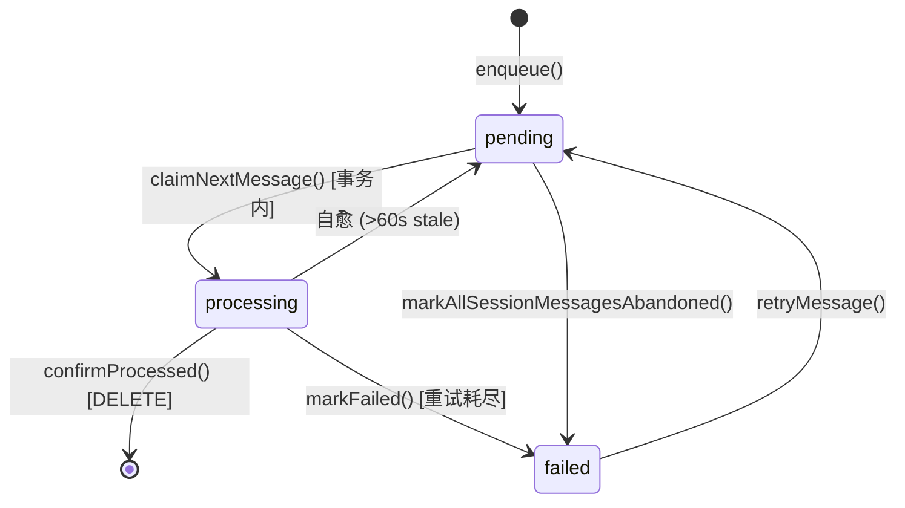
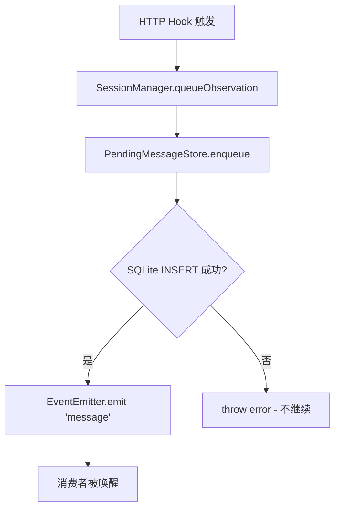
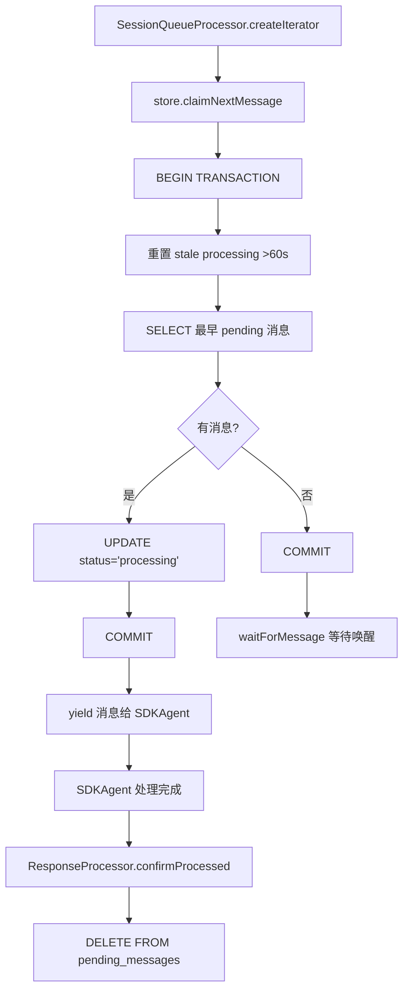
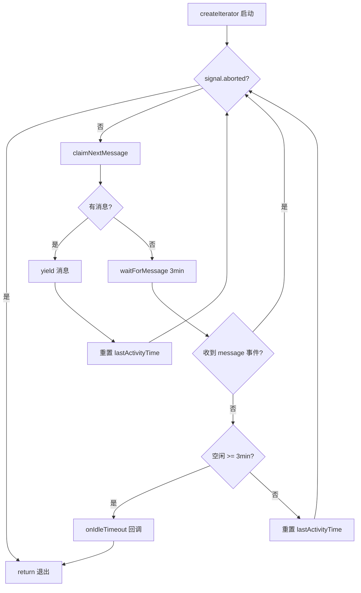

# PD-114.01 claude-mem — 事件驱动异步消息队列

> 文档编号：PD-114.01
> 来源：claude-mem `src/services/queue/SessionQueueProcessor.ts`
> GitHub：https://github.com/thedotmack/claude-mem.git
> 问题域：PD-114 异步队列处理 Async Queue Processing
> 状态：可复用方案

---

## 第 1 章 问题与动机

### 1.1 核心问题

claude-mem 是一个 Claude Code 的记忆增强插件，通过 hook 机制拦截用户与 Claude 的交互，将工具调用观察（observation）和会话摘要（summarize）异步发送给后台 worker 处理。核心挑战在于：

1. **HTTP hook 与 SDK Agent 的速率不匹配** — hook 在毫秒级触发，但 SDK Agent 处理一条消息需要数秒到数十秒（LLM 推理）
2. **消息不能丢失** — 每条 observation 都是用户工作的记录，丢失意味着记忆断裂
3. **子进程生命周期管理** — SDK Agent 是一个 Claude 子进程，空闲时必须终止以释放资源，但不能在处理中被杀
4. **Worker 崩溃恢复** — worker-service 可能随时重启，处理中的消息不能丢失
5. **避免轮询开销** — 传统 `setInterval` 轮询浪费 CPU，且引入不必要的延迟

### 1.2 claude-mem 的解法概述

claude-mem 实现了一套完整的事件驱动异步消息队列系统，核心组件：

1. **PendingMessageStore** (`src/services/sqlite/PendingMessageStore.ts:47`) — SQLite 持久化队列，4 态状态机（pending → processing → processed/failed），原子 claim-confirm 事务
2. **SessionQueueProcessor** (`src/services/queue/SessionQueueProcessor.ts:15`) — async iterator 消费者，EventEmitter 唤醒 + 3 分钟空闲超时自动终止
3. **SessionManager** (`src/services/worker/SessionManager.ts:19`) — 会话生命周期管理，queueObservation 入队 + getMessageIterator 出队，EventEmitter 零延迟通知
4. **ProcessRegistry** (`src/services/worker/ProcessRegistry.ts:33`) — 子进程 PID 追踪，SIGKILL 升级，孤儿进程收割
5. **ResponseProcessor** (`src/services/worker/agents/ResponseProcessor.ts:48`) — 处理完成后原子 confirmProcessed，关闭 claim-confirm 闭环

### 1.3 设计思想

| 设计原则 | 具体实现 | 理由 | 替代方案 |
|----------|----------|------|----------|
| 持久化优先 | 消息先写 SQLite 再通知消费者 | worker 崩溃时消息不丢失 | 纯内存队列（丢失风险） |
| 原子 claim-confirm | 事务内 SELECT+UPDATE，处理完 DELETE | 防止重复处理和消息丢失 | 乐观锁（并发冲突） |
| 事件驱动唤醒 | EventEmitter.emit('message') 零延迟 | 避免轮询 CPU 开销和延迟 | setInterval 轮询（浪费+延迟） |
| async iterator 消费 | `for await...of` 自然背压 | 消费者速度自动适配生产者 | 回调地狱（难维护） |
| 自愈机制 | claimNextMessage 内重置 >60s 的 stale 消息 | 无需外部定时器，每次 claim 自动修复 | 独立 watchdog 线程 |
| 空闲超时终止 | 3 分钟无消息 → onIdleTimeout → abort | 释放 Claude 子进程资源 | 永久保活（内存泄漏） |

---

## 第 2 章 源码实现分析

### 2.1 架构概览

claude-mem 的异步队列系统由 5 个核心组件组成，形成一条从 HTTP hook 到 SDK Agent 的事件驱动管道：

```
┌──────────────┐     ┌──────────────────┐     ┌─────────────────────┐
│  HTTP Hook   │────→│  SessionManager  │────→│ PendingMessageStore │
│ (queueObs)   │     │  (enqueue+emit)  │     │   (SQLite 持久化)    │
└──────────────┘     └──────┬───────────┘     └──────────┬──────────┘
                            │ EventEmitter                │
                            │ .emit('message')            │ claimNextMessage()
                            ▼                             ▼
                   ┌────────────────────┐     ┌─────────────────────┐
                   │ SessionQueueProc.  │────→│     SDKAgent        │
                   │ (async iterator)   │     │ (for await...of)    │
                   └────────────────────┘     └──────────┬──────────┘
                                                         │
                                                         ▼
                                              ┌─────────────────────┐
                                              │ ResponseProcessor   │
                                              │ (confirmProcessed)  │
                                              └─────────────────────┘
```

消息生命周期状态机：



### 2.2 核心实现

#### 2.2.1 入队：持久化优先 + 零延迟通知



对应源码 `src/services/worker/SessionManager.ts:201-236`：

```typescript
queueObservation(sessionDbId: number, data: ObservationData): void {
    let session = this.sessions.get(sessionDbId);
    if (!session) {
      session = this.initializeSession(sessionDbId);
    }

    // CRITICAL: Persist to database FIRST
    const message: PendingMessage = {
      type: 'observation',
      tool_name: data.tool_name,
      tool_input: data.tool_input,
      tool_response: data.tool_response,
      prompt_number: data.prompt_number,
      cwd: data.cwd
    };

    try {
      const messageId = this.getPendingStore().enqueue(
        sessionDbId, session.contentSessionId, message
      );
      // ... logging
    } catch (error) {
      throw error; // Don't continue if we can't persist
    }

    // Notify generator immediately (zero latency)
    const emitter = this.sessionQueues.get(sessionDbId);
    emitter?.emit('message');
}
```

关键设计：先 `enqueue()` 写入 SQLite，成功后才 `emit('message')` 通知消费者。如果持久化失败，直接 throw，不会发出虚假通知。

#### 2.2.2 原子 claim-confirm：防重复处理



对应源码 `src/services/sqlite/PendingMessageStore.ts:93-139`：

```typescript
claimNextMessage(sessionDbId: number): PersistentPendingMessage | null {
    const claimTx = this.db.transaction((sessionId: number) => {
      const now = Date.now();
      // Self-healing: reset stale 'processing' messages back to 'pending'
      const staleCutoff = now - STALE_PROCESSING_THRESHOLD_MS;
      const resetStmt = this.db.prepare(`
        UPDATE pending_messages
        SET status = 'pending', started_processing_at_epoch = NULL
        WHERE session_db_id = ? AND status = 'processing'
          AND started_processing_at_epoch < ?
      `);
      resetStmt.run(sessionId, staleCutoff);

      const peekStmt = this.db.prepare(`
        SELECT * FROM pending_messages
        WHERE session_db_id = ? AND status = 'pending'
        ORDER BY id ASC LIMIT 1
      `);
      const msg = peekStmt.get(sessionId);

      if (msg) {
        const updateStmt = this.db.prepare(`
          UPDATE pending_messages
          SET status = 'processing', started_processing_at_epoch = ?
          WHERE id = ?
        `);
        updateStmt.run(now, msg.id);
      }
      return msg;
    });

    return claimTx(sessionDbId);
}
```

关键设计：整个 claim 操作在一个 SQLite 事务内完成，包含三步：(1) 自愈 stale 消息，(2) 查询最早 pending，(3) 标记为 processing。事务保证原子性，不会出现两个消费者 claim 同一条消息。

#### 2.2.3 async iterator + EventEmitter 唤醒



对应源码 `src/services/queue/SessionQueueProcessor.ts:32-74`：

```typescript
async *createIterator(options: CreateIteratorOptions):
    AsyncIterableIterator<PendingMessageWithId> {
    const { sessionDbId, signal, onIdleTimeout } = options;
    let lastActivityTime = Date.now();

    while (!signal.aborted) {
      try {
        const persistentMessage = this.store.claimNextMessage(sessionDbId);

        if (persistentMessage) {
          lastActivityTime = Date.now();
          yield this.toPendingMessageWithId(persistentMessage);
        } else {
          // Queue empty - wait for wake-up event or timeout
          const receivedMessage = await this.waitForMessage(
            signal, IDLE_TIMEOUT_MS
          );

          if (!receivedMessage && !signal.aborted) {
            const idleDuration = Date.now() - lastActivityTime;
            if (idleDuration >= IDLE_TIMEOUT_MS) {
              onIdleTimeout?.();
              return;
            }
            lastActivityTime = Date.now();
          }
        }
      } catch (error) {
        if (signal.aborted) return;
        // Small backoff to prevent tight loop on DB error
        await new Promise(resolve => setTimeout(resolve, 1000));
      }
    }
}
```

### 2.3 实现细节

#### waitForMessage 的三路竞争

`waitForMessage` (`SessionQueueProcessor.ts:91-122`) 实现了一个精巧的三路竞争：EventEmitter 事件、AbortSignal、setTimeout。三者共享一个 `cleanup` 函数，确保无论哪个先触发，都能正确清理另外两个监听器，避免内存泄漏：

```typescript
private waitForMessage(signal: AbortSignal, timeoutMs: number): Promise<boolean> {
    return new Promise<boolean>((resolve) => {
      const cleanup = () => {
        if (timeoutId !== undefined) clearTimeout(timeoutId);
        this.events.off('message', onMessage);
        signal.removeEventListener('abort', onAbort);
      };
      this.events.once('message', onMessage);
      signal.addEventListener('abort', onAbort, { once: true });
      timeoutId = setTimeout(onTimeout, timeoutMs);
    });
}
```

#### confirm 闭环：ResponseProcessor 中的批量确认

处理完成后，`ResponseProcessor.ts:114-124` 批量确认所有已处理消息：

```typescript
const pendingStore = sessionManager.getPendingMessageStore();
for (const messageId of session.processingMessageIds) {
    pendingStore.confirmProcessed(messageId);
}
session.processingMessageIds = [];
```

这确保了只有在 observation 成功写入数据库后，pending_messages 中的记录才会被删除。如果 ResponseProcessor 在存储前崩溃，消息仍在 processing 状态，60 秒后会被自愈机制重置为 pending。

#### 子进程生命周期：从 spawn 到 reap

ProcessRegistry (`ProcessRegistry.ts:38-41`) 通过 `createPidCapturingSpawn` 拦截 SDK 的子进程创建，注册 PID。`ensureProcessExit` (`ProcessRegistry.ts:136-173`) 实现了优雅退出 → SIGKILL 升级的两阶段终止。`startOrphanReaper` (`ProcessRegistry.ts:396-411`) 每 5 分钟扫描一次孤儿进程。

---

## 第 3 章 迁移指南

### 3.1 迁移清单

**阶段 1：持久化队列（必须）**

- [ ] 创建 `pending_messages` 表（id, session_id, message_type, status, payload, retry_count, created_at_epoch, started_processing_at_epoch）
- [ ] 实现 `PendingMessageStore`：enqueue / claimNextMessage / confirmProcessed / markFailed
- [ ] claimNextMessage 必须在事务内完成 SELECT + UPDATE
- [ ] 添加自愈逻辑：claim 前重置 stale processing 消息

**阶段 2：事件驱动消费者（必须）**

- [ ] 实现 `SessionQueueProcessor` 的 async iterator 模式
- [ ] 使用 EventEmitter 替代轮询
- [ ] 实现 `waitForMessage` 三路竞争（event / abort / timeout）
- [ ] 集成 AbortSignal 实现优雅取消

**阶段 3：空闲超时管理（推荐）**

- [ ] 添加 `IDLE_TIMEOUT_MS` 配置（建议 3-5 分钟）
- [ ] 实现 `onIdleTimeout` 回调触发 AbortController.abort()
- [ ] 确保超时后子进程被正确终止

**阶段 4：子进程生命周期（推荐）**

- [ ] 实现 ProcessRegistry 追踪所有子进程 PID
- [ ] 实现 ensureProcessExit 两阶段终止（graceful → SIGKILL）
- [ ] 添加孤儿进程收割定时器

### 3.2 适配代码模板

以下是一个可直接运行的 TypeScript 实现模板，提取了 claude-mem 的核心模式：

```typescript
import { EventEmitter } from 'events';
import Database from 'better-sqlite3';

// ============ 1. 持久化队列 Store ============

interface QueueMessage {
  id: number;
  session_id: string;
  payload: string;
  status: 'pending' | 'processing' | 'processed' | 'failed';
  retry_count: number;
  created_at: number;
  started_at: number | null;
}

class PersistentQueueStore {
  private db: Database.Database;
  private maxRetries: number;
  private staleThresholdMs: number;

  constructor(dbPath: string, maxRetries = 3, staleThresholdMs = 60_000) {
    this.db = new Database(dbPath);
    this.maxRetries = maxRetries;
    this.staleThresholdMs = staleThresholdMs;
    this.db.exec(`
      CREATE TABLE IF NOT EXISTS queue_messages (
        id INTEGER PRIMARY KEY AUTOINCREMENT,
        session_id TEXT NOT NULL,
        payload TEXT NOT NULL,
        status TEXT NOT NULL DEFAULT 'pending',
        retry_count INTEGER NOT NULL DEFAULT 0,
        created_at INTEGER NOT NULL,
        started_at INTEGER
      )
    `);
  }

  enqueue(sessionId: string, payload: object): number {
    const stmt = this.db.prepare(
      `INSERT INTO queue_messages (session_id, payload, status, created_at)
       VALUES (?, ?, 'pending', ?)`
    );
    return Number(stmt.run(sessionId, JSON.stringify(payload), Date.now()).lastInsertRowid);
  }

  claimNext(sessionId: string): QueueMessage | null {
    const tx = this.db.transaction((sid: string) => {
      const now = Date.now();
      // Self-heal stale processing messages
      this.db.prepare(
        `UPDATE queue_messages SET status='pending', started_at=NULL
         WHERE session_id=? AND status='processing' AND started_at < ?`
      ).run(sid, now - this.staleThresholdMs);

      const msg = this.db.prepare(
        `SELECT * FROM queue_messages
         WHERE session_id=? AND status='pending' ORDER BY id ASC LIMIT 1`
      ).get(sid) as QueueMessage | undefined;

      if (msg) {
        this.db.prepare(
          `UPDATE queue_messages SET status='processing', started_at=? WHERE id=?`
        ).run(now, msg.id);
      }
      return msg ?? null;
    });
    return tx(sessionId);
  }

  confirmProcessed(messageId: number): void {
    this.db.prepare('DELETE FROM queue_messages WHERE id=?').run(messageId);
  }

  markFailed(messageId: number): void {
    const msg = this.db.prepare(
      'SELECT retry_count FROM queue_messages WHERE id=?'
    ).get(messageId) as { retry_count: number } | undefined;
    if (!msg) return;

    if (msg.retry_count < this.maxRetries) {
      this.db.prepare(
        `UPDATE queue_messages SET status='pending', retry_count=retry_count+1,
         started_at=NULL WHERE id=?`
      ).run(messageId);
    } else {
      this.db.prepare(
        `UPDATE queue_messages SET status='failed' WHERE id=?`
      ).run(messageId);
    }
  }
}

// ============ 2. 事件驱动消费者 ============

interface IteratorOptions {
  sessionId: string;
  signal: AbortSignal;
  idleTimeoutMs?: number;
  onIdleTimeout?: () => void;
}

class QueueConsumer {
  constructor(
    private store: PersistentQueueStore,
    private events: EventEmitter
  ) {}

  async *consume(options: IteratorOptions): AsyncIterableIterator<QueueMessage> {
    const { sessionId, signal, idleTimeoutMs = 180_000, onIdleTimeout } = options;
    let lastActivity = Date.now();

    while (!signal.aborted) {
      const msg = this.store.claimNext(sessionId);
      if (msg) {
        lastActivity = Date.now();
        yield msg;
      } else {
        const woken = await this.waitForEvent(signal, idleTimeoutMs);
        if (!woken && !signal.aborted) {
          if (Date.now() - lastActivity >= idleTimeoutMs) {
            onIdleTimeout?.();
            return;
          }
          lastActivity = Date.now();
        }
      }
    }
  }

  private waitForEvent(signal: AbortSignal, timeoutMs: number): Promise<boolean> {
    return new Promise(resolve => {
      let timer: ReturnType<typeof setTimeout> | undefined;
      const cleanup = () => {
        if (timer) clearTimeout(timer);
        this.events.off('message', onMsg);
        signal.removeEventListener('abort', onAbort);
      };
      const onMsg = () => { cleanup(); resolve(true); };
      const onAbort = () => { cleanup(); resolve(false); };
      this.events.once('message', onMsg);
      signal.addEventListener('abort', onAbort, { once: true });
      timer = setTimeout(() => { cleanup(); resolve(false); }, timeoutMs);
    });
  }
}

// ============ 3. 使用示例 ============

async function example() {
  const store = new PersistentQueueStore('./queue.db');
  const events = new EventEmitter();
  const consumer = new QueueConsumer(store, events);
  const ac = new AbortController();

  // 生产者：入队 + 通知
  const msgId = store.enqueue('session-1', { type: 'observation', data: '...' });
  events.emit('message');

  // 消费者：async iterator
  for await (const msg of consumer.consume({
    sessionId: 'session-1',
    signal: ac.signal,
    onIdleTimeout: () => ac.abort()
  })) {
    try {
      await processMessage(msg);
      store.confirmProcessed(msg.id);
    } catch {
      store.markFailed(msg.id);
    }
  }
}
```

### 3.3 适用场景

| 场景 | 适用度 | 说明 |
|------|--------|------|
| Agent 后台任务队列 | ⭐⭐⭐ | 核心场景：HTTP 请求触发异步 LLM 处理 |
| 插件/hook 消息缓冲 | ⭐⭐⭐ | 高频事件 → 低速消费者的速率适配 |
| 子进程生命周期管理 | ⭐⭐⭐ | 需要空闲超时 + 优雅终止的场景 |
| 分布式任务队列 | ⭐ | 仅适用于单进程，多 worker 需要分布式锁 |
| 高吞吐消息系统 | ⭐ | SQLite 写入有锁竞争，高并发需 Redis/RabbitMQ |

---

## 第 4 章 测试用例

```typescript
import { describe, it, expect, beforeEach, afterEach } from 'vitest';
import { EventEmitter } from 'events';
import Database from 'better-sqlite3';

// 假设已按 3.2 模板实现 PersistentQueueStore 和 QueueConsumer

describe('PersistentQueueStore', () => {
  let store: PersistentQueueStore;

  beforeEach(() => {
    store = new PersistentQueueStore(':memory:');
  });

  it('enqueue 返回递增 ID', () => {
    const id1 = store.enqueue('s1', { type: 'obs' });
    const id2 = store.enqueue('s1', { type: 'obs' });
    expect(id2).toBe(id1 + 1);
  });

  it('claimNext 原子标记为 processing', () => {
    store.enqueue('s1', { type: 'obs' });
    const msg = store.claimNext('s1');
    expect(msg).not.toBeNull();
    expect(msg!.status).toBe('pending'); // 返回的是 claim 前的快照
    // 再次 claim 应该返回 null（已被标记为 processing）
    const msg2 = store.claimNext('s1');
    expect(msg2).toBeNull();
  });

  it('confirmProcessed 删除消息', () => {
    const id = store.enqueue('s1', { type: 'obs' });
    store.claimNext('s1');
    store.confirmProcessed(id);
    // 队列应为空
    const msg = store.claimNext('s1');
    expect(msg).toBeNull();
  });

  it('自愈：stale processing 消息被重置为 pending', async () => {
    const id = store.enqueue('s1', { type: 'obs' });
    store.claimNext('s1');
    // 模拟 stale：手动设置 started_at 为 2 分钟前
    // （实际测试中需要 mock Date.now 或直接操作 DB）
    // 再次 claimNext 应该自愈并返回该消息
  });

  it('markFailed 在重试次数内回退为 pending', () => {
    const id = store.enqueue('s1', { type: 'obs' });
    store.claimNext('s1');
    store.markFailed(id);
    // 应该可以再次 claim
    const msg = store.claimNext('s1');
    expect(msg).not.toBeNull();
  });

  it('markFailed 超过最大重试次数标记为 failed', () => {
    const id = store.enqueue('s1', { type: 'obs' });
    for (let i = 0; i <= 3; i++) {
      store.claimNext('s1');
      store.markFailed(id);
    }
    const msg = store.claimNext('s1');
    expect(msg).toBeNull(); // 已永久失败
  });
});

describe('QueueConsumer', () => {
  let store: PersistentQueueStore;
  let events: EventEmitter;
  let consumer: QueueConsumer;

  beforeEach(() => {
    store = new PersistentQueueStore(':memory:');
    events = new EventEmitter();
    consumer = new QueueConsumer(store, events);
  });

  it('消费已有消息', async () => {
    store.enqueue('s1', { type: 'obs', data: 'hello' });
    const ac = new AbortController();
    const messages: any[] = [];

    // 消费一条后立即 abort
    setTimeout(() => ac.abort(), 100);
    for await (const msg of consumer.consume({
      sessionId: 's1', signal: ac.signal
    })) {
      messages.push(msg);
      store.confirmProcessed(msg.id);
      ac.abort();
    }
    expect(messages).toHaveLength(1);
  });

  it('EventEmitter 唤醒消费者', async () => {
    const ac = new AbortController();
    const messages: any[] = [];

    // 先启动消费者（队列为空，会等待）
    const consuming = (async () => {
      for await (const msg of consumer.consume({
        sessionId: 's1', signal: ac.signal
      })) {
        messages.push(msg);
        store.confirmProcessed(msg.id);
        ac.abort();
      }
    })();

    // 50ms 后入队并通知
    await new Promise(r => setTimeout(r, 50));
    store.enqueue('s1', { type: 'obs' });
    events.emit('message');

    await consuming;
    expect(messages).toHaveLength(1);
  });

  it('空闲超时触发 onIdleTimeout', async () => {
    let timedOut = false;
    const ac = new AbortController();

    for await (const _ of consumer.consume({
      sessionId: 's1',
      signal: ac.signal,
      idleTimeoutMs: 100,
      onIdleTimeout: () => { timedOut = true; }
    })) {
      // 不会进入这里
    }
    expect(timedOut).toBe(true);
  });
});
```

---

## 第 5 章 跨域关联

| 关联域 | 关系类型 | 说明 |
|--------|----------|------|
| PD-03 容错与重试 | 协同 | claim-confirm + 自愈机制本质上是队列层面的容错设计，stale 消息重置 = 自动重试 |
| PD-05 沙箱隔离 | 协同 | ProcessRegistry 的 PID 追踪和 SIGKILL 升级确保子进程不会逃逸，是进程级隔离 |
| PD-06 记忆持久化 | 依赖 | claude-mem 的队列服务于记忆系统，observation 最终写入 SQLite + Chroma 向量库 |
| PD-11 可观测性 | 协同 | 队列深度、处理延迟、stale 消息数量都是关键可观测指标，SessionManager 暴露了 getTotalQueueDepth / isAnySessionProcessing 等接口 |

---

## 第 6 章 来源文件索引

| 文件 | 行范围 | 关键实现 |
|------|--------|----------|
| `src/services/queue/SessionQueueProcessor.ts` | L1-L123 | async iterator 消费者，waitForMessage 三路竞争，空闲超时 |
| `src/services/sqlite/PendingMessageStore.ts` | L47-L489 | SQLite 持久化队列，claim-confirm 事务，自愈机制，重试逻辑 |
| `src/services/worker/SessionManager.ts` | L19-L491 | 会话生命周期，queueObservation 入队，getMessageIterator 出队 |
| `src/services/worker/ProcessRegistry.ts` | L1-L411 | PID 追踪，ensureProcessExit 两阶段终止，孤儿进程收割 |
| `src/services/worker/SDKAgent.ts` | L30-L488 | SDK 查询循环，createMessageGenerator 消费 iterator |
| `src/services/worker/agents/ResponseProcessor.ts` | L48-L152 | 处理完成后 confirmProcessed 批量确认 |
| `src/services/worker-types.ts` | L20-L63 | ActiveSession / PendingMessage / PendingMessageWithId 类型定义 |

---

## 第 7 章 横向对比维度

```json comparison_data
{
  "project": "claude-mem",
  "dimensions": {
    "队列存储": "SQLite pending_messages 表，4 态状态机（pending/processing/processed/failed）",
    "消费模式": "async iterator + EventEmitter 唤醒，零轮询",
    "防重复机制": "SQLite 事务内原子 claim（SELECT+UPDATE），单消费者模型",
    "自愈策略": "claimNextMessage 内置 60s stale 检测，无需外部 watchdog",
    "空闲管理": "3 分钟无消息触发 onIdleTimeout → AbortController.abort() 终止子进程",
    "进程生命周期": "ProcessRegistry PID 追踪 + ensureProcessExit 两阶段终止 + 5 分钟孤儿收割"
  }
}
```

### 域元数据补充

```json domain_metadata
{
  "solution_summary": "claude-mem 用 SQLite 4 态状态机 + EventEmitter 唤醒 + async iterator 实现事件驱动消息队列，claim-confirm 事务防重复，60s 自愈重置 stale 消息",
  "description": "单进程场景下用 SQLite 替代 Redis 实现轻量持久化队列的工程实践",
  "sub_problems": [
    "生产者-消费者速率不匹配的背压控制",
    "子进程僵尸进程检测与收割"
  ],
  "best_practices": [
    "claim 事务内嵌入自愈逻辑，无需独立 watchdog 线程",
    "waitForMessage 三路竞争（event/abort/timeout）确保无泄漏"
  ]
}
```
