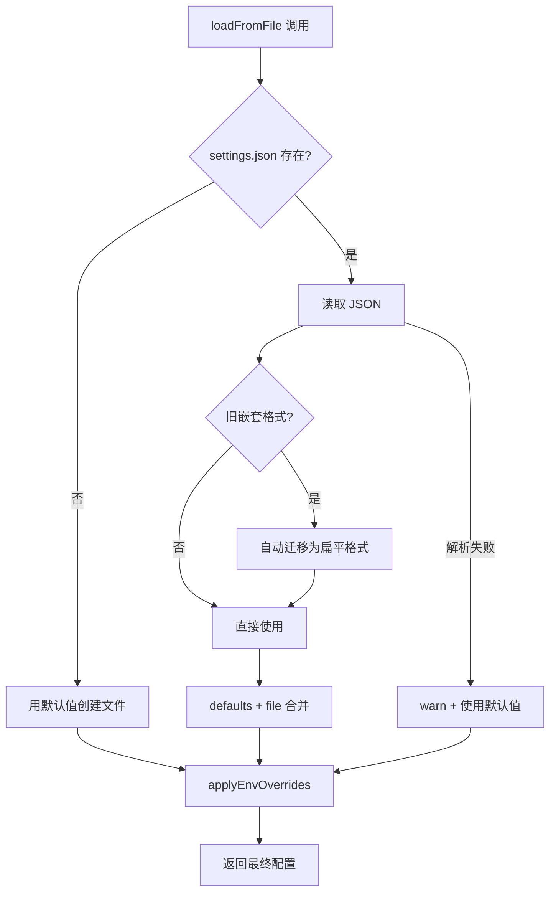
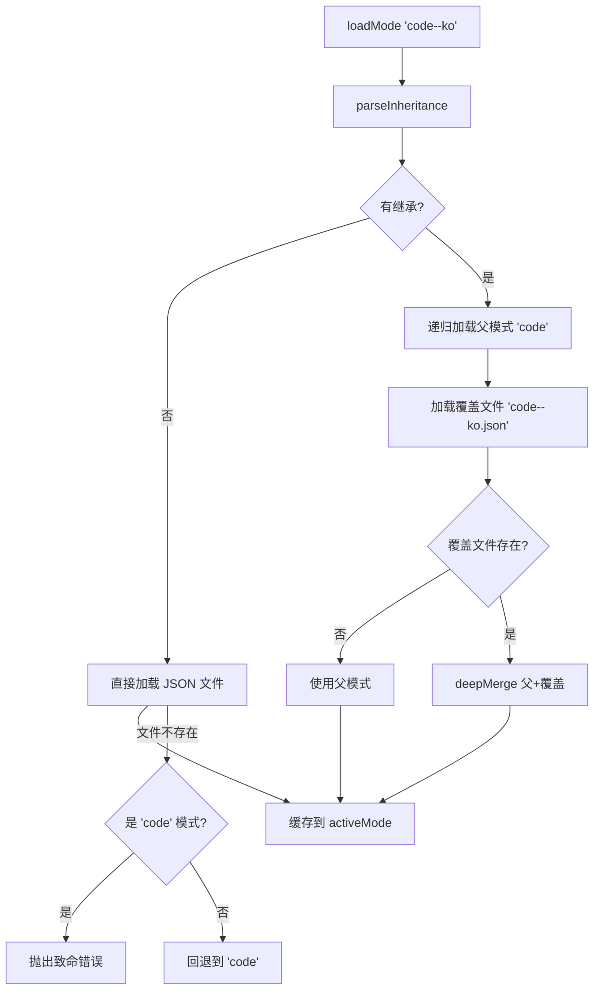

# PD-115.01 claude-mem — 分层配置系统与模式继承

> 文档编号：PD-115.01
> 来源：claude-mem `src/shared/SettingsDefaultsManager.ts` `src/services/domain/ModeManager.ts` `src/services/context/ContextConfigLoader.ts`
> GitHub：https://github.com/thedotmack/claude-mem.git
> 问题域：PD-115 配置管理 Configuration Management
> 状态：可复用方案

---

## 第 1 章 问题与动机

### 1.1 核心问题

Agent 系统的配置管理面临三重挑战：

1. **配置来源多样**：默认值、用户配置文件、环境变量、运行时参数，优先级如何确定？
2. **模式切换需求**：同一个 Agent 需要在不同场景下（代码开发、邮件调查、多语言）使用不同的 prompt 模板和观察类型，如何优雅切换？
3. **循环依赖风险**：Logger 需要配置（日志级别），配置加载需要 Logger（记录错误），如何打破循环？

claude-mem 作为 Claude Code 的记忆增强插件，管理 40+ 配置项（AI 提供商、向量数据库、显示选项、观察过滤等），需要一套健壮的分层配置系统。

### 1.2 claude-mem 的解法概述

1. **SettingsDefaultsManager 单一真相源**：所有 40+ 默认值集中在一个静态类中（`src/shared/SettingsDefaultsManager.ts:77-133`），任何模块获取默认值都通过它
2. **三层优先级合并**：环境变量 > 配置文件 > 默认值，在 `loadFromFile()` 方法中一次性完成（`src/shared/SettingsDefaultsManager.ts:190-243`）
3. **ModeManager 模式继承**：通过 `parent--override` 命名约定实现模式继承，如 `code--ko` 继承 `code` 并覆盖韩语 prompt（`src/services/domain/ModeManager.ts:49-72`）
4. **ContextConfigLoader 桥接层**：将扁平配置转换为结构化的 ContextConfig 对象，并根据当前模式动态调整过滤规则（`src/services/context/ContextConfigLoader.ts:17-57`）
5. **循环依赖规避**：Logger 内联默认数据目录常量，避免导入 SettingsDefaultsManager（`src/utils/logger.ts:28-29`）

### 1.3 设计思想

| 设计原则 | 具体实现 | 理由 | 替代方案 |
|----------|----------|------|----------|
| 单一真相源 | SettingsDefaultsManager 静态类集中所有默认值 | 避免默认值散落在各模块导致不一致 | 分散的 `config.defaults` 文件 |
| 三层合并 | env > file > defaults，一次性在 loadFromFile 完成 | 符合 12-Factor App 环境变量优先原则 | 多次合并、延迟解析 |
| 模式继承 | `parent--override` 命名 + deepMerge | 34 个模式文件中大量共享基础配置，继承避免重复 | 每个模式完整定义所有字段 |
| 优雅降级 | 模式加载失败回退到 `code`，配置文件损坏回退到默认值 | 配置错误不应阻塞用户工作 | 抛异常中断启动 |
| 自动迁移 | 检测到旧 `{ env: {...} }` 嵌套格式自动迁移为扁平格式 | 版本升级时用户无感知 | 要求用户手动迁移 |

---

## 第 2 章 源码实现分析

### 2.1 架构概览

claude-mem 的配置系统由三个核心组件构成，形成清晰的分层架构：

```
┌─────────────────────────────────────────────────────────┐
│                    消费者层                               │
│  session-init.ts │ ContextConfigLoader │ Logger │ Agents │
└────────┬─────────┴──────────┬──────────┴────┬───┴───┬───┘
         │                    │               │       │
         ▼                    ▼               │       │
┌─────────────────┐  ┌───────────────┐       │       │
│  ModeManager    │  │ ContextConfig │       │       │
│  (模式继承)      │  │  Loader       │       │       │
│  Singleton      │  │  (桥接层)      │       │       │
└────────┬────────┘  └───────┬───────┘       │       │
         │                   │               │       │
         ▼                   ▼               ▼       ▼
┌────────────────────────────────────────────────────────┐
│            SettingsDefaultsManager (静态类)              │
│  ┌──────────┐  ┌──────────────┐  ┌──────────────────┐  │
│  │ DEFAULTS │→ │ loadFromFile │→ │ applyEnvOverrides│  │
│  │ (40+项)  │  │ (文件合并)    │  │ (环境变量覆盖)    │  │
│  └──────────┘  └──────────────┘  └──────────────────┘  │
└────────────────────────────────────────────────────────┘
         │                   │                    │
         ▼                   ▼                    ▼
  硬编码默认值      ~/.claude-mem/        process.env.*
                  settings.json
```

### 2.2 核心实现

#### 2.2.1 SettingsDefaultsManager — 三层配置合并



对应源码 `src/shared/SettingsDefaultsManager.ts:190-243`：

```typescript
static loadFromFile(settingsPath: string): SettingsDefaults {
  try {
    if (!existsSync(settingsPath)) {
      const defaults = this.getAllDefaults();
      try {
        const dir = dirname(settingsPath);
        if (!existsSync(dir)) {
          mkdirSync(dir, { recursive: true });
        }
        writeFileSync(settingsPath, JSON.stringify(defaults, null, 2), 'utf-8');
      } catch (error) {
        console.warn('[SETTINGS] Failed to create settings file, using in-memory defaults:', settingsPath, error);
      }
      return this.applyEnvOverrides(defaults);
    }

    const settingsData = readFileSync(settingsPath, 'utf-8');
    const settings = JSON.parse(settingsData);

    // MIGRATION: Handle old nested schema { env: {...} }
    let flatSettings = settings;
    if (settings.env && typeof settings.env === 'object') {
      flatSettings = settings.env;
      try {
        writeFileSync(settingsPath, JSON.stringify(flatSettings, null, 2), 'utf-8');
      } catch (error) {
        console.warn('[SETTINGS] Failed to auto-migrate settings file:', settingsPath, error);
      }
    }

    // Merge file settings with defaults (flat schema)
    const result: SettingsDefaults = { ...this.DEFAULTS };
    for (const key of Object.keys(this.DEFAULTS) as Array<keyof SettingsDefaults>) {
      if (flatSettings[key] !== undefined) {
        result[key] = flatSettings[key];
      }
    }
    return this.applyEnvOverrides(result);
  } catch (error) {
    console.warn('[SETTINGS] Failed to load settings, using defaults:', settingsPath, error);
    return this.applyEnvOverrides(this.getAllDefaults());
  }
}
```

关键设计点：
- **自动创建**：首次运行时自动创建 `~/.claude-mem/settings.json`，包含所有默认值（`SettingsDefaultsManager.ts:194-199`）
- **自动迁移**：检测旧版嵌套 `{ env: {...} }` 格式并自动迁移（`SettingsDefaultsManager.ts:214-226`）
- **三重容错**：文件不存在 → 创建；JSON 损坏 → 用默认值；写入失败 → 内存中继续

#### 2.2.2 ModeManager — 模式继承与深度合并



对应源码 `src/services/domain/ModeManager.ts:133-198`：

```typescript
loadMode(modeId: string): ModeConfig {
  const inheritance = this.parseInheritance(modeId);

  if (!inheritance.hasParent) {
    try {
      const mode = this.loadModeFile(modeId);
      this.activeMode = mode;
      return mode;
    } catch (error) {
      logger.warn('SYSTEM', `Mode file not found: ${modeId}, falling back to 'code'`);
      if (modeId === 'code') {
        throw new Error('Critical: code.json mode file missing');
      }
      return this.loadMode('code');
    }
  }

  const { parentId, overrideId } = inheritance;
  let parentMode: ModeConfig;
  try {
    parentMode = this.loadMode(parentId);
  } catch (error) {
    parentMode = this.loadMode('code');
  }

  let overrideConfig: Partial<ModeConfig>;
  try {
    overrideConfig = this.loadModeFile(overrideId);
  } catch (error) {
    this.activeMode = parentMode;
    return parentMode;
  }

  const mergedMode = this.deepMerge(parentMode, overrideConfig);
  this.activeMode = mergedMode;
  return mergedMode;
}
```

继承命名约定（`ModeManager.ts:49-72`）：
- `code` → 直接加载 `modes/code.json`
- `code--ko` → 加载 `modes/code.json` 作为父，`modes/code--ko.json` 作为覆盖，深度合并
- 只支持一级继承，`code--ko--verbose` 会抛错

深度合并策略（`ModeManager.ts:91-108`）：
- 嵌套对象：递归合并
- 数组：完整替换（不合并）
- 原始值：覆盖

### 2.3 实现细节

#### 循环依赖规避

Logger 是系统中最早初始化的模块之一，但它需要知道日志目录路径（来自配置）。claude-mem 的解法是在 Logger 中内联默认值：

```typescript
// src/utils/logger.ts:28-29
// NOTE: This default must match DEFAULT_DATA_DIR in src/shared/SettingsDefaultsManager.ts
// Inlined here to avoid circular dependency with SettingsDefaultsManager
const DEFAULT_DATA_DIR = join(homedir(), '.claude-mem');
```

这是一个务实的权衡：牺牲 DRY 原则换取启动时的稳定性。

#### ContextConfigLoader 桥接层

`ContextConfigLoader` 不只是简单转发配置，它根据当前模式动态调整行为（`src/services/context/ContextConfigLoader.ts:22-41`）：

```typescript
const modeId = settings.CLAUDE_MEM_MODE;
const isCodeMode = modeId === 'code' || modeId.startsWith('code--');

if (isCodeMode) {
  // Code 模式：使用用户设置的过滤规则
  observationTypes = new Set(
    settings.CLAUDE_MEM_CONTEXT_OBSERVATION_TYPES.split(',').map(t => t.trim()).filter(Boolean)
  );
} else {
  // 非 Code 模式：使用模式定义的全部类型（忽略用户过滤设置）
  const mode = ModeManager.getInstance().getActiveMode();
  observationTypes = new Set(mode.observation_types.map(t => t.id));
}
```

这意味着切换到 `email-investigation` 模式时，观察类型自动切换为该模式定义的类型，用户无需手动调整过滤设置。

#### 配置验证（SettingsRoutes）

HTTP API 层提供完整的配置验证（`src/services/worker/http/routes/SettingsRoutes.ts:234-366`），包括：
- 端口范围检查（1024-65535）
- IP 地址格式验证
- 枚举值校验（provider、log level、Gemini model）
- 布尔字符串校验
- 数值范围校验（observation count 1-200, session count 1-50）
- URL 格式校验（OpenRouter site URL）


---

## 第 3 章 迁移指南

### 3.1 迁移清单

**阶段 1：基础配置层**
- [ ] 定义 `SettingsDefaults` 接口，列出所有配置键和类型
- [ ] 实现 `SettingsDefaultsManager` 静态类，硬编码所有默认值
- [ ] 实现 `loadFromFile(path)` 方法：文件读取 → 合并默认值 → 环境变量覆盖
- [ ] 实现配置文件自动创建（首次运行时）

**阶段 2：模式系统**
- [ ] 定义 `ModeConfig` 接口（名称、描述、类型列表、prompt 模板）
- [ ] 实现 `ModeManager` 单例，支持从 JSON 文件加载模式
- [ ] 实现 `parent--override` 继承命名约定和 `deepMerge`
- [ ] 创建默认模式文件（如 `code.json`）

**阶段 3：桥接与验证**
- [ ] 实现 `ConfigLoader` 桥接层，将扁平配置转为结构化对象
- [ ] 添加模式感知的动态配置调整
- [ ] 实现 HTTP API 配置验证（端口、枚举、布尔值、范围）

### 3.2 适配代码模板

#### 最小可用的分层配置管理器（TypeScript）

```typescript
import { readFileSync, writeFileSync, existsSync, mkdirSync } from 'fs';
import { dirname } from 'path';

// Step 1: 定义配置接口
interface AppSettings {
  APP_PORT: string;
  APP_LOG_LEVEL: string;
  APP_MODE: string;
  APP_DATA_DIR: string;
  // ... 按需扩展
}

// Step 2: 集中管理默认值
class SettingsManager {
  private static readonly DEFAULTS: AppSettings = {
    APP_PORT: '3000',
    APP_LOG_LEVEL: 'INFO',
    APP_MODE: 'default',
    APP_DATA_DIR: '~/.myapp',
  };

  static get(key: keyof AppSettings): string {
    return this.DEFAULTS[key];
  }

  // Step 3: 三层合并 — env > file > defaults
  static loadFromFile(settingsPath: string): AppSettings {
    let fileSettings: Partial<AppSettings> = {};

    try {
      if (!existsSync(settingsPath)) {
        // 自动创建配置文件
        const dir = dirname(settingsPath);
        if (!existsSync(dir)) mkdirSync(dir, { recursive: true });
        writeFileSync(settingsPath, JSON.stringify(this.DEFAULTS, null, 2));
      } else {
        fileSettings = JSON.parse(readFileSync(settingsPath, 'utf-8'));
      }
    } catch {
      // 文件损坏时静默回退到默认值
    }

    // 合并：defaults + file
    const merged = { ...this.DEFAULTS };
    for (const key of Object.keys(this.DEFAULTS) as Array<keyof AppSettings>) {
      if (fileSettings[key] !== undefined) merged[key] = fileSettings[key]!;
    }

    // 环境变量覆盖（最高优先级）
    for (const key of Object.keys(this.DEFAULTS) as Array<keyof AppSettings>) {
      if (process.env[key] !== undefined) merged[key] = process.env[key]!;
    }

    return merged;
  }
}
```

#### 最小可用的模式继承管理器（TypeScript）

```typescript
import { readFileSync, existsSync } from 'fs';
import { join } from 'path';

interface ModeConfig {
  name: string;
  description: string;
  prompts: Record<string, string>;
  features: string[];
}

class ModeManager {
  private static instance: ModeManager;
  private activeMode: ModeConfig | null = null;

  static getInstance(): ModeManager {
    if (!this.instance) this.instance = new ModeManager();
    return this.instance;
  }

  // 深度合并：对象递归合并，数组完整替换
  private deepMerge<T extends Record<string, any>>(base: T, override: Partial<T>): T {
    const result = { ...base };
    for (const key in override) {
      const ov = override[key], bv = base[key];
      if (ov && bv && typeof ov === 'object' && typeof bv === 'object' && !Array.isArray(ov)) {
        result[key] = this.deepMerge(bv, ov as any);
      } else {
        result[key] = ov as any;
      }
    }
    return result;
  }

  loadMode(modeId: string, modesDir: string): ModeConfig {
    const parts = modeId.split('--');

    // 无继承：直接加载
    if (parts.length === 1) {
      const path = join(modesDir, `${modeId}.json`);
      if (!existsSync(path)) {
        if (modeId === 'default') throw new Error('Critical: default mode missing');
        return this.loadMode('default', modesDir);
      }
      this.activeMode = JSON.parse(readFileSync(path, 'utf-8'));
      return this.activeMode!;
    }

    // 有继承：parent--override
    const parent = this.loadMode(parts[0], modesDir);
    const overridePath = join(modesDir, `${modeId}.json`);
    if (!existsSync(overridePath)) {
      this.activeMode = parent;
      return parent;
    }

    const override = JSON.parse(readFileSync(overridePath, 'utf-8'));
    this.activeMode = this.deepMerge(parent, override);
    return this.activeMode;
  }

  getActiveMode(): ModeConfig {
    if (!this.activeMode) throw new Error('No mode loaded');
    return this.activeMode;
  }
}
```

### 3.3 适用场景

| 场景 | 适用度 | 说明 |
|------|--------|------|
| CLI 工具配置 | ⭐⭐⭐ | 三层优先级（env > file > defaults）是 CLI 工具的标准模式 |
| Agent 多模式切换 | ⭐⭐⭐ | 模式继承适合 prompt 模板的多语言/多场景变体 |
| 插件系统配置 | ⭐⭐⭐ | 自动创建 + 自动迁移对插件用户体验很重要 |
| 微服务配置 | ⭐⭐ | 微服务通常用 etcd/consul，但本方案适合单机部署 |
| 前端应用配置 | ⭐ | 前端通常用 .env + 构建时注入，不需要运行时文件加载 |

---

## 第 4 章 测试用例

```typescript
import { describe, it, expect, beforeEach, afterEach } from 'vitest';
import { writeFileSync, mkdirSync, rmSync, existsSync } from 'fs';
import { join } from 'path';
import { tmpdir } from 'os';

// 模拟 SettingsDefaultsManager 的核心逻辑
class TestSettingsManager {
  private static DEFAULTS = {
    APP_PORT: '3000',
    APP_LOG_LEVEL: 'INFO',
    APP_MODE: 'default',
  };

  static loadFromFile(path: string): Record<string, string> {
    const result = { ...this.DEFAULTS };
    try {
      if (existsSync(path)) {
        const file = JSON.parse(require('fs').readFileSync(path, 'utf-8'));
        for (const key of Object.keys(this.DEFAULTS)) {
          if (file[key] !== undefined) result[key as keyof typeof result] = file[key];
        }
      }
    } catch { /* fallback to defaults */ }
    for (const key of Object.keys(this.DEFAULTS)) {
      if (process.env[key] !== undefined) result[key as keyof typeof result] = process.env[key]!;
    }
    return result;
  }
}

describe('SettingsDefaultsManager', () => {
  const testDir = join(tmpdir(), 'config-test-' + Date.now());
  const settingsPath = join(testDir, 'settings.json');

  beforeEach(() => mkdirSync(testDir, { recursive: true }));
  afterEach(() => {
    rmSync(testDir, { recursive: true, force: true });
    delete process.env.APP_PORT;
    delete process.env.APP_LOG_LEVEL;
  });

  it('returns defaults when no file exists', () => {
    const settings = TestSettingsManager.loadFromFile(join(testDir, 'nonexistent.json'));
    expect(settings.APP_PORT).toBe('3000');
    expect(settings.APP_LOG_LEVEL).toBe('INFO');
  });

  it('merges file settings over defaults', () => {
    writeFileSync(settingsPath, JSON.stringify({ APP_PORT: '8080' }));
    const settings = TestSettingsManager.loadFromFile(settingsPath);
    expect(settings.APP_PORT).toBe('8080');
    expect(settings.APP_LOG_LEVEL).toBe('INFO'); // 未覆盖的保持默认
  });

  it('env vars override file settings', () => {
    writeFileSync(settingsPath, JSON.stringify({ APP_PORT: '8080' }));
    process.env.APP_PORT = '9090';
    const settings = TestSettingsManager.loadFromFile(settingsPath);
    expect(settings.APP_PORT).toBe('9090'); // env > file
  });

  it('handles corrupted JSON gracefully', () => {
    writeFileSync(settingsPath, '{ invalid json !!!');
    const settings = TestSettingsManager.loadFromFile(settingsPath);
    expect(settings.APP_PORT).toBe('3000'); // 回退到默认值
  });

  it('ignores unknown keys in file', () => {
    writeFileSync(settingsPath, JSON.stringify({ APP_PORT: '8080', UNKNOWN_KEY: 'value' }));
    const settings = TestSettingsManager.loadFromFile(settingsPath);
    expect(settings.APP_PORT).toBe('8080');
    expect((settings as any).UNKNOWN_KEY).toBeUndefined();
  });
});

describe('ModeManager inheritance', () => {
  const modesDir = join(tmpdir(), 'modes-test-' + Date.now());

  beforeEach(() => {
    mkdirSync(modesDir, { recursive: true });
    writeFileSync(join(modesDir, 'code.json'), JSON.stringify({
      name: 'Code', description: 'Dev mode',
      prompts: { system: 'You are a code assistant', lang: 'English' },
      features: ['bugfix', 'refactor'],
    }));
    writeFileSync(join(modesDir, 'code--ko.json'), JSON.stringify({
      name: 'Code (Korean)',
      prompts: { lang: 'Korean' },
    }));
  });
  afterEach(() => rmSync(modesDir, { recursive: true, force: true }));

  it('loads base mode directly', () => {
    // 直接加载 code.json
    const mode = JSON.parse(require('fs').readFileSync(join(modesDir, 'code.json'), 'utf-8'));
    expect(mode.name).toBe('Code');
    expect(mode.prompts.system).toBe('You are a code assistant');
  });

  it('merges override onto parent via deep merge', () => {
    const parent = JSON.parse(require('fs').readFileSync(join(modesDir, 'code.json'), 'utf-8'));
    const override = JSON.parse(require('fs').readFileSync(join(modesDir, 'code--ko.json'), 'utf-8'));
    // 模拟 deepMerge
    const merged = { ...parent, ...override, prompts: { ...parent.prompts, ...override.prompts } };
    expect(merged.name).toBe('Code (Korean)'); // 覆盖
    expect(merged.prompts.system).toBe('You are a code assistant'); // 继承
    expect(merged.prompts.lang).toBe('Korean'); // 覆盖
    expect(merged.features).toEqual(['bugfix', 'refactor']); // 继承（override 未定义）
  });

  it('falls back to code mode when mode not found', () => {
    const codePath = join(modesDir, 'code.json');
    const unknownPath = join(modesDir, 'unknown.json');
    expect(existsSync(unknownPath)).toBe(false);
    // 回退逻辑：加载 code.json
    const fallback = JSON.parse(require('fs').readFileSync(codePath, 'utf-8'));
    expect(fallback.name).toBe('Code');
  });
});
```


---

## 第 5 章 跨域关联

| 关联域 | 关系类型 | 说明 |
|--------|----------|------|
| PD-06 记忆持久化 | 协同 | 配置决定记忆系统的行为（观察数量、过滤类型、显示字段），ModeManager 的模式切换直接影响记忆的观察类型集合 |
| PD-11 可观测性 | 协同 | Logger 依赖配置获取日志级别，但通过内联常量规避循环依赖；配置变更事件可作为可观测性的数据源 |
| PD-04 工具系统 | 依赖 | `CLAUDE_MEM_SKIP_TOOLS` 配置项控制哪些工具被跳过，配置系统是工具系统的上游 |
| PD-09 Human-in-the-Loop | 协同 | SettingsRoutes 提供 HTTP API 让用户通过 Web UI 修改配置，是人机交互的一种形式 |

---

## 第 6 章 来源文件索引

| 文件 | 行范围 | 关键实现 |
|------|--------|----------|
| `src/shared/SettingsDefaultsManager.ts` | L15-71 | SettingsDefaults 接口定义（40+ 配置键） |
| `src/shared/SettingsDefaultsManager.ts` | L73-133 | DEFAULTS 静态常量（所有默认值） |
| `src/shared/SettingsDefaultsManager.ts` | L170-178 | applyEnvOverrides 环境变量覆盖 |
| `src/shared/SettingsDefaultsManager.ts` | L190-243 | loadFromFile 三层合并 + 自动迁移 |
| `src/services/domain/ModeManager.ts` | L15-34 | ModeManager 构造函数（多路径探测） |
| `src/services/domain/ModeManager.ts` | L49-72 | parseInheritance 继承命名解析 |
| `src/services/domain/ModeManager.ts` | L91-108 | deepMerge 深度合并策略 |
| `src/services/domain/ModeManager.ts` | L133-198 | loadMode 模式加载 + 继承 + 回退 |
| `src/services/context/ContextConfigLoader.ts` | L17-57 | loadContextConfig 模式感知配置桥接 |
| `src/services/worker/http/routes/SettingsRoutes.ts` | L234-366 | validateSettings 完整配置验证 |
| `src/services/worker/http/routes/SettingsRoutes.ts` | L46-141 | GET/POST /api/settings HTTP 端点 |
| `src/shared/paths.ts` | L27-42 | 路径常量（DATA_DIR、MODES_DIR、USER_SETTINGS_PATH） |
| `src/utils/logger.ts` | L28-29 | 内联默认值规避循环依赖 |
| `src/services/domain/types.ts` | L1-72 | ModeConfig/ModePrompts/ObservationType 类型定义 |
| `src/cli/handlers/session-init.ts` | L34-35 | 配置加载在 hook 入口的使用示例 |

---

## 第 7 章 横向对比维度

```json comparison_data
{
  "project": "claude-mem",
  "dimensions": {
    "配置层级": "三层合并：env > JSON 文件 > 静态默认值，loadFromFile 一次性完成",
    "默认值管理": "SettingsDefaultsManager 静态类集中 40+ 默认值，类型安全的 get/getInt/getBool",
    "模式系统": "ModeManager 单例 + parent--override 命名继承 + deepMerge，34 个模式文件",
    "配置验证": "SettingsRoutes 提供 HTTP API 层验证（端口范围、枚举、布尔、URL 格式）",
    "自动迁移": "检测旧版嵌套 schema 自动迁移为扁平格式，用户无感知",
    "循环依赖处理": "Logger 内联默认路径常量，避免导入 SettingsDefaultsManager"
  }
}
```

### 域元数据补充

```json domain_metadata
{
  "solution_summary": "claude-mem 用 SettingsDefaultsManager 静态类集中 40+ 默认值，loadFromFile 实现 env>file>defaults 三层合并，ModeManager 通过 parent--override 命名约定实现 34 个模式的继承与深度合并",
  "description": "配置系统的模式继承、自动迁移与循环依赖规避策略",
  "sub_problems": [
    "配置 schema 版本迁移（旧格式自动转新格式）",
    "配置模块间循环依赖规避",
    "HTTP API 层配置验证与安全校验"
  ],
  "best_practices": [
    "用 parent--override 命名约定实现模式继承，避免 34 个模式文件重复定义基础配置",
    "Logger 等早期模块内联关键默认值，用注释标记同步要求，规避循环依赖",
    "配置文件首次运行自动创建 + 旧版 schema 自动迁移，用户零配置即可启动"
  ]
}
```

