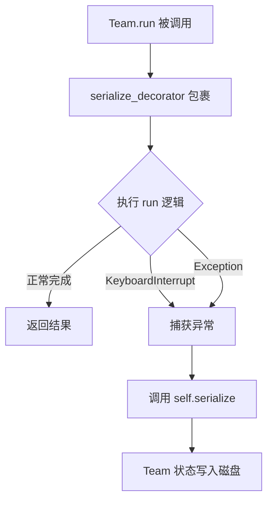

# PD-116.01 MetaGPT — SerializationMixin 全链路 JSON 序列化与状态恢复

> 文档编号：PD-116.01
> 来源：MetaGPT `metagpt/schema.py`, `metagpt/base/base_serialization.py`, `metagpt/team.py`
> GitHub：https://github.com/FoundationAgents/MetaGPT.git
> 问题域：PD-116 序列化与状态恢复 Serialization & State Recovery
> 状态：可复用方案

---

## 第 1 章 问题与动机

### 1.1 核心问题

多 Agent 系统的运行过程通常涉及多个角色（Role）、环境（Environment）、上下文（Context）和消息队列（MessageQueue）等复杂对象图。当系统因异常中断、用户主动暂停或资源耗尽而停止时，如何将整个运行状态完整保存到磁盘，并在下次启动时从断点恢复，是一个关键的工程问题。

核心挑战包括：
- **多态子类序列化**：Pydantic 默认将子类序列化为父类，丢失子类特有字段（如 Engineer 序列化为 Role）
- **循环引用**：Role 持有 Environment 引用，Environment 又持有 Role 字典，直接序列化会无限递归
- **异步队列持久化**：asyncio.Queue 不可直接 JSON 序列化
- **异常时自动保存**：系统崩溃时必须在退出前完成序列化，否则进度全部丢失

### 1.2 MetaGPT 的解法概述

1. **BaseSerialization 多态 Mixin**：通过 `__module_class_name` 标记实现 Pydantic 多态序列化/反序列化，子类自动注册到 `__subclasses_map__` (`metagpt/base/base_serialization.py:8-67`)
2. **SerializationMixin 文件持久化**：在 BaseSerialization 之上封装 `serialize()`/`deserialize()` 方法，自动写入/读取 `workspace/storage/ClassName.json` (`metagpt/schema.py:72-130`)
3. **Team 级全链路序列化**：Team.serialize 递归保存 Team → Environment → Roles → Actions → Memory 完整对象图 (`metagpt/team.py:59-81`)
4. **serialize_decorator 异常捕获**：装饰 `Team.run()`，在 KeyboardInterrupt 或 Exception 时自动触发序列化 (`metagpt/utils/common.py:675-686`)
5. **role_raise_decorator 消息回滚**：Role 执行异常时删除最新观察消息，确保恢复后能重新处理 (`metagpt/utils/common.py:689-706`)

### 1.3 设计思想

| 设计原则 | 具体实现 | 理由 | 替代方案 |
|----------|----------|------|----------|
| 多态透明 | `__module_class_name` 自动注入 + `__subclasses_map__` 查找 | Pydantic 原生不支持多态反序列化 | pickle（不可读）、手动 type 字段 |
| 异常即保存 | `serialize_decorator` 包裹 Team.run | 崩溃时不丢失进度 | 定时 checkpoint（可能丢失最近进度） |
| 消息回滚 | `role_raise_decorator` 删除最新 observed msg | 恢复后 Role 能重新观察到未处理消息 | 标记消息状态（更复杂） |
| 循环引用切断 | `exclude=True` 标记 env/msg_buffer/todo/news | 避免无限递归，恢复时重建引用 | weakref（Pydantic 不支持） |
| 约定式路径 | `SERDESER_PATH / ClassName.json` | 无需配置，按类名自动定位 | 数据库存储（过重） |

---

## 第 2 章 源码实现分析

### 2.1 架构概览

MetaGPT 的序列化体系分为三层：

```
┌─────────────────────────────────────────────────────────────┐
│                    Team.serialize()                          │
│  保存 team.json = model_dump() + context.serialize()        │
├─────────────────────────────────────────────────────────────┤
│              SerializationMixin (schema.py)                  │
│  serialize() → model_dump() → write_json_file()             │
│  deserialize() → read_json_file() → cls(**data)             │
├─────────────────────────────────────────────────────────────┤
│           BaseSerialization (base_serialization.py)          │
│  @model_serializer: 注入 __module_class_name                │
│  @model_validator: 查找 __subclasses_map__ 构造真实子类      │
│  __init_subclass__: 自动注册子类到 map                       │
└─────────────────────────────────────────────────────────────┘
```

对象图序列化路径：

```
Team
 ├── env: Environment
 │    ├── roles: dict[str, SerializeAsAny[BaseRole]]
 │    │    ├── RoleA (Engineer/PM/Architect...)
 │    │    │    ├── actions: list[SerializeAsAny[Action]]
 │    │    │    ├── rc: RoleContext
 │    │    │    │    ├── memory: Memory (storage + index)
 │    │    │    │    ├── state: int
 │    │    │    │    └── watch: set[str]
 │    │    │    └── (env, msg_buffer, todo, news → exclude=True)
 │    │    └── RoleB ...
 │    ├── history: Memory
 │    └── (context → exclude=True, 单独序列化)
 ├── investment: float
 ├── idea: str
 └── context → Context.serialize() (kwargs + cost_manager)
```

### 2.2 核心实现

#### 2.2.1 BaseSerialization — 多态序列化引擎

```mermaid
graph TD
    A[子类定义 e.g. Engineer] --> B[__init_subclass__ 触发]
    B --> C[注册到 __subclasses_map__]
    D[model_dump 调用] --> E[@model_serializer]
    E --> F[注入 __module_class_name 字段]
    G[model_validate 调用] --> H[@model_validator]
    H --> I{有 __module_class_name?}
    I -->|是| J[从 __subclasses_map__ 查找类]
    J --> K[用真实子类构造实例]
    I -->|否| L[用当前类构造]
```

对应源码 `metagpt/base/base_serialization.py:8-67`：

```python
class BaseSerialization(BaseModel, extra="forbid"):
    __is_polymorphic_base = False
    __subclasses_map__ = {}

    @model_serializer(mode="wrap")
    def __serialize_with_class_type__(self, default_serializer) -> Any:
        ret = default_serializer(self)
        ret["__module_class_name"] = f"{self.__class__.__module__}.{self.__class__.__qualname__}"
        return ret

    @model_validator(mode="wrap")
    @classmethod
    def __convert_to_real_type__(cls, value: Any, handler):
        if isinstance(value, dict) is False:
            return handler(value)
        class_full_name = value.pop("__module_class_name", None)
        if not cls.__is_polymorphic_base:
            if class_full_name is None:
                return handler(value)
            elif str(cls) == f"<class '{class_full_name}'>":
                return handler(value)
        if class_full_name is None:
            raise ValueError("Missing __module_class_name field")
        class_type = cls.__subclasses_map__.get(class_full_name, None)
        if class_type is None:
            raise TypeError(f"Trying to instantiate {class_full_name}, which has not yet been defined!")
        return class_type(**value)

    def __init_subclass__(cls, is_polymorphic_base: bool = False, **kwargs):
        cls.__is_polymorphic_base = is_polymorphic_base
        cls.__subclasses_map__[f"{cls.__module__}.{cls.__qualname__}"] = cls
        super().__init_subclass__(**kwargs)
```

关键设计：`__init_subclass__` 是 Python 元编程钩子，每当定义新子类时自动调用，实现零配置注册。`__module_class_name` 使用完全限定名（module + qualname）避免同名类冲突。

#### 2.2.2 serialize_decorator — 异常时自动保存



对应源码 `metagpt/utils/common.py:675-686`：

```python
def serialize_decorator(func):
    async def wrapper(self, *args, **kwargs):
        try:
            result = await func(self, *args, **kwargs)
            return result
        except KeyboardInterrupt:
            logger.error(f"KeyboardInterrupt occurs, start to serialize the project, exp:\n{format_trackback_info()}")
        except Exception:
            logger.error(f"Exception occurs, start to serialize the project, exp:\n{format_trackback_info()}")
        self.serialize()  # Team.serialize
    return wrapper
```

使用方式 `metagpt/team.py:122-123`：

```python
@serialize_decorator
async def run(self, n_round=3, idea="", send_to="", auto_archive=True):
    ...
```

#### 2.2.3 Team 全链路序列化与反序列化

```mermaid
graph TD
    A[Team.serialize] --> B[self.model_dump]
    B --> C[递归序列化 env/roles/actions/memory]
    A --> D[self.env.context.serialize]
    D --> E[kwargs + cost_manager 单独序列化]
    B --> F[write_json_file team.json]

    G[Team.deserialize] --> H[read_json_file team.json]
    H --> I[提取 context 数据]
    I --> J[Context.deserialize 恢复上下文]
    H --> K[Team(**team_info, context=ctx)]
    K --> L[model_validate 触发多态恢复]
    L --> M[每个 Role 恢复为真实子类]
```

对应源码 `metagpt/team.py:59-81`：

```python
def serialize(self, stg_path: Path = None):
    stg_path = SERDESER_PATH.joinpath("team") if stg_path is None else stg_path
    team_info_path = stg_path.joinpath("team.json")
    serialized_data = self.model_dump()
    serialized_data["context"] = self.env.context.serialize()
    write_json_file(team_info_path, serialized_data)

@classmethod
def deserialize(cls, stg_path: Path, context: Context = None) -> "Team":
    team_info_path = stg_path.joinpath("team.json")
    if not team_info_path.exists():
        raise FileNotFoundError(
            "recover storage meta file `team.json` not exist, "
            "not to recover and please start a new project."
        )
    team_info: dict = read_json_file(team_info_path)
    ctx = context or Context()
    ctx.deserialize(team_info.pop("context", None))
    team = Team(**team_info, context=ctx)
    return team
```

### 2.3 实现细节

#### 循环引用处理

MetaGPT 通过 Pydantic 的 `exclude=True` 和 `Field(exclude=True)` 切断循环引用链：

- `RoleContext.env` → `exclude=True`（Role 不序列化 Environment 引用）
- `RoleContext.msg_buffer` → `exclude=True`（asyncio.Queue 不可序列化）
- `RoleContext.todo` → `exclude=True`（Action 实例在恢复时重建）
- `RoleContext.news` → `exclude=True`（临时消息不持久化）
- `Environment.context` → `exclude=True`（Context 由 Team 单独序列化）

恢复时，`Team.__init__` 中重建这些引用 (`metagpt/team.py:45-57`)：

```python
def __init__(self, context: Context = None, **data: Any):
    super(Team, self).__init__(**data)
    ctx = context or Context()
    if not self.env and not self.use_mgx:
        self.env = Environment(context=ctx)
    elif not self.env and self.use_mgx:
        self.env = MGXEnv(context=ctx)
    else:
        self.env.context = ctx  # The `env` object is allocated by deserialization
```

#### role_raise_decorator — 消息回滚保证幂等恢复

当 Role 执行过程中抛出异常，`role_raise_decorator` 会删除该 Role 最近观察到的消息 (`metagpt/utils/common.py:689-706`)。这确保恢复后 Role 能重新观察到该消息并重试处理，实现幂等恢复语义。

#### MessageQueue 序列化

`MessageQueue` 通过 `dump()`/`load()` 方法实现异步队列的 JSON 序列化 (`metagpt/schema.py:748-782`)。`dump()` 使用 `wait_for` 超时机制逐个取出消息序列化，然后放回队列，保证队列状态不变。

#### recovery_util — Plan 与 Notebook 持久化

`metagpt/utils/recovery_util.py` 提供 `save_history()`/`load_history()` 用于保存和恢复 Data Interpreter 角色的执行历史：
- Plan 序列化为 `plan.json`（使用 `plan.dict()`）
- Jupyter Notebook 执行历史保存为 `code.ipynb`（使用 nbformat）


---

## 第 3 章 迁移指南

### 3.1 迁移清单

**阶段 1：基础多态序列化（1 个文件）**

- [ ] 复制 `BaseSerialization` 类到项目中
- [ ] 让所有需要多态序列化的基类继承 `BaseSerialization`
- [ ] 在容器字段上使用 `SerializeAsAny` 注解

**阶段 2：文件持久化层（2 个文件）**

- [ ] 实现 `SerializationMixin`（serialize/deserialize/get_serialization_path）
- [ ] 配置 `SERDESER_PATH` 常量
- [ ] 让核心实体类（Role/Agent 等）继承 SerializationMixin

**阶段 3：异常自动保存（1 个装饰器）**

- [ ] 实现 `serialize_decorator` 装饰器
- [ ] 应用到顶层 run 方法
- [ ] 实现 `role_raise_decorator` 用于消息回滚

**阶段 4：全链路恢复（集成）**

- [ ] 实现顶层容器（Team）的 serialize/deserialize
- [ ] 处理循环引用（exclude + 恢复时重建）
- [ ] 编写恢复入口逻辑

### 3.2 适配代码模板

#### 多态序列化基类（可直接复用）

```python
from __future__ import annotations
from typing import Any
from pydantic import BaseModel, model_serializer, model_validator


class PolymorphicMixin(BaseModel, extra="forbid"):
    """多态序列化 Mixin — 从 MetaGPT BaseSerialization 提取"""

    __is_polymorphic_base = False
    __subclasses_map__: dict[str, type] = {}

    @model_serializer(mode="wrap")
    def _inject_class_name(self, default_serializer) -> Any:
        ret = default_serializer(self)
        ret["__class__"] = f"{self.__class__.__module__}.{self.__class__.__qualname__}"
        return ret

    @model_validator(mode="wrap")
    @classmethod
    def _resolve_real_type(cls, value: Any, handler):
        if not isinstance(value, dict):
            return handler(value)
        class_name = value.pop("__class__", None)
        if not cls.__is_polymorphic_base:
            if class_name is None or str(cls) == f"<class '{class_name}'>":
                return handler(value)
        if class_name is None:
            raise ValueError("Missing __class__ field for polymorphic deserialization")
        real_cls = cls.__subclasses_map__.get(class_name)
        if real_cls is None:
            raise TypeError(f"Unknown class: {class_name}")
        return real_cls(**value)

    def __init_subclass__(cls, is_polymorphic_base: bool = False, **kwargs):
        cls.__is_polymorphic_base = is_polymorphic_base
        cls.__subclasses_map__[f"{cls.__module__}.{cls.__qualname__}"] = cls
        super().__init_subclass__(**kwargs)
```

#### 异常自动保存装饰器

```python
import functools
import traceback
import logging

logger = logging.getLogger(__name__)


def auto_checkpoint(func):
    """装饰异步 run 方法，异常时自动序列化状态"""
    @functools.wraps(func)
    async def wrapper(self, *args, **kwargs):
        try:
            return await func(self, *args, **kwargs)
        except (KeyboardInterrupt, Exception) as e:
            logger.error(f"Exception in {func.__name__}, auto-saving state: {traceback.format_exc()}")
            if hasattr(self, 'serialize'):
                self.serialize()
            raise
    return wrapper
```

#### 全链路序列化容器

```python
import json
from pathlib import Path
from pydantic import BaseModel, Field, SerializeAsAny


class AgentTeam(BaseModel):
    agents: dict[str, SerializeAsAny["BaseAgent"]] = Field(default_factory=dict)
    context: dict = Field(default_factory=dict)

    def serialize(self, path: Path):
        path.mkdir(parents=True, exist_ok=True)
        data = self.model_dump()
        data["context"] = self._serialize_context()
        with open(path / "team.json", "w") as f:
            json.dump(data, f, indent=2, ensure_ascii=False)

    @classmethod
    def deserialize(cls, path: Path) -> "AgentTeam":
        with open(path / "team.json") as f:
            data = json.load(f)
        ctx = data.pop("context", {})
        team = cls(**data)
        team._restore_context(ctx)
        return team

    def _serialize_context(self) -> dict:
        return {"cost": self.context.get("cost", 0)}

    def _restore_context(self, ctx: dict):
        self.context.update(ctx)
```

### 3.3 适用场景

| 场景 | 适用度 | 说明 |
|------|--------|------|
| 多 Agent 长时间运行任务 | ⭐⭐⭐ | 核心场景，中断恢复避免重复执行 |
| 多态 Agent 子类序列化 | ⭐⭐⭐ | BaseSerialization 完美解决 Pydantic 多态问题 |
| 单 Agent 简单任务 | ⭐ | 过度设计，直接重跑更简单 |
| 需要增量 checkpoint | ⭐⭐ | MetaGPT 方案是全量序列化，增量需额外实现 |
| 分布式多节点 Agent | ⭐ | 文件系统序列化不适合分布式，需改用数据库 |

---

## 第 4 章 测试用例

```python
import json
import shutil
from pathlib import Path
from typing import Any

import pytest
from pydantic import BaseModel, Field, SerializeAsAny, model_serializer, model_validator


# === 基础设施 ===

class PolymorphicMixin(BaseModel, extra="forbid"):
    __is_polymorphic_base = False
    __subclasses_map__: dict = {}

    @model_serializer(mode="wrap")
    def _inject_class_name(self, default_serializer) -> Any:
        ret = default_serializer(self)
        ret["__class__"] = f"{self.__class__.__module__}.{self.__class__.__qualname__}"
        return ret

    @model_validator(mode="wrap")
    @classmethod
    def _resolve_real_type(cls, value: Any, handler):
        if not isinstance(value, dict):
            return handler(value)
        class_name = value.pop("__class__", None)
        if not cls.__is_polymorphic_base:
            if class_name is None or str(cls) == f"<class '{class_name}'>":
                return handler(value)
        if class_name is None:
            raise ValueError("Missing __class__")
        real_cls = cls.__subclasses_map__.get(class_name)
        if real_cls is None:
            raise TypeError(f"Unknown: {class_name}")
        return real_cls(**value)

    def __init_subclass__(cls, is_polymorphic_base=False, **kwargs):
        cls.__is_polymorphic_base = is_polymorphic_base
        cls.__subclasses_map__[f"{cls.__module__}.{cls.__qualname__}"] = cls
        super().__init_subclass__(**kwargs)


class BaseAction(PolymorphicMixin):
    name: str = ""


class WriteCode(BaseAction):
    name: str = "WriteCode"
    language: str = "python"


class ReviewCode(BaseAction):
    name: str = "ReviewCode"
    strictness: int = 3


class BaseAgent(PolymorphicMixin):
    name: str = ""
    actions: list[SerializeAsAny[BaseAction]] = []


class Engineer(BaseAgent):
    name: str = "Engineer"
    use_code_review: bool = False


class AgentContainer(BaseModel):
    agents: list[SerializeAsAny[BaseAgent]] = []


# === 测试用例 ===

class TestPolymorphicSerialization:
    """测试多态序列化/反序列化"""

    def test_action_roundtrip(self):
        """Action 子类序列化后能恢复为正确类型"""
        action = WriteCode(language="rust")
        data = action.model_dump()
        assert "__class__" in data
        restored = BaseAction.model_validate(data)
        assert isinstance(restored, WriteCode)
        assert restored.language == "rust"

    def test_nested_polymorphic(self):
        """嵌套多态：Agent 包含多态 Action 列表"""
        eng = Engineer(actions=[WriteCode(), ReviewCode(strictness=5)])
        data = eng.model_dump()
        restored = BaseAgent.model_validate(data)
        assert isinstance(restored, Engineer)
        assert isinstance(restored.actions[0], WriteCode)
        assert isinstance(restored.actions[1], ReviewCode)
        assert restored.actions[1].strictness == 5

    def test_container_roundtrip(self):
        """容器级序列化：多个不同类型 Agent"""
        container = AgentContainer(agents=[
            Engineer(actions=[WriteCode()]),
            BaseAgent(name="Generic"),
        ])
        data = container.model_dump()
        restored = AgentContainer.model_validate(data)
        assert isinstance(restored.agents[0], Engineer)
        assert isinstance(restored.agents[0].actions[0], WriteCode)


class TestFileCheckpoint:
    """测试文件级 checkpoint"""

    def test_serialize_to_file(self, tmp_path):
        """序列化到 JSON 文件并恢复"""
        eng = Engineer(actions=[WriteCode()])
        file_path = tmp_path / "engineer.json"
        data = eng.model_dump()
        with open(file_path, "w") as f:
            json.dump(data, f)
        with open(file_path) as f:
            loaded = json.load(f)
        restored = Engineer(**loaded)
        assert restored.name == "Engineer"
        assert isinstance(restored.actions[0], WriteCode)

    def test_team_serialize_deserialize(self, tmp_path):
        """Team 级全链路序列化"""
        team_data = {
            "agents": [
                Engineer(actions=[WriteCode()]).model_dump(),
            ],
            "context": {"cost": 1.5},
        }
        file_path = tmp_path / "team.json"
        with open(file_path, "w") as f:
            json.dump(team_data, f)
        with open(file_path) as f:
            loaded = json.load(f)
        assert loaded["context"]["cost"] == 1.5


class TestEdgeCases:
    """边界情况测试"""

    def test_missing_class_name(self):
        """缺少 __class__ 字段时的行为"""
        data = {"name": "test"}
        # 非多态基类，缺少 __class__ 时用当前类构造
        result = BaseAction.model_validate(data)
        assert result.name == "test"

    def test_unknown_class_name(self):
        """未注册的类名应抛出 TypeError"""
        data = {"name": "test", "__class__": "nonexistent.module.FakeClass"}
        with pytest.raises(TypeError, match="Unknown"):
            BaseAction.model_validate(data)

    def test_exclude_fields_not_serialized(self):
        """exclude=True 的字段不出现在序列化结果中"""
        class AgentWithExclude(BaseModel):
            name: str = "test"
            _internal: str = Field(default="secret", exclude=True)
        agent = AgentWithExclude()
        data = agent.model_dump()
        assert "_internal" not in data
```


---

## 第 5 章 跨域关联

| 关联域 | 关系类型 | 说明 |
|--------|----------|------|
| PD-02 多 Agent 编排 | 依赖 | Team/Environment/Role 的编排结构决定了序列化的对象图深度 |
| PD-03 容错与重试 | 协同 | serialize_decorator 是容错的一部分，异常时保存状态；role_raise_decorator 实现消息回滚重试 |
| PD-06 记忆持久化 | 协同 | Memory 的 storage/index 作为 Role 状态的一部分被序列化，recovery_util 保存 Plan 和 Notebook |
| PD-01 上下文管理 | 协同 | Context（kwargs + cost_manager）作为全局上下文被单独序列化，恢复时注入到 Environment |
| PD-11 可观测性 | 协同 | CostManager 的 total_cost/max_budget 通过 Context 序列化保存，恢复后继续累计 |

---

## 第 6 章 来源文件索引

| 文件 | 行范围 | 关键实现 |
|------|--------|----------|
| `metagpt/base/base_serialization.py` | L1-L67 | BaseSerialization 多态 Mixin：__module_class_name 注入、__subclasses_map__ 注册、model_validator 多态恢复 |
| `metagpt/schema.py` | L72-L130 | SerializationMixin：serialize/deserialize 文件持久化、get_serialization_path 约定式路径 |
| `metagpt/schema.py` | L748-L782 | MessageQueue.dump/load：异步队列 JSON 序列化 |
| `metagpt/team.py` | L59-L81 | Team.serialize/deserialize：全链路序列化入口，Context 单独处理 |
| `metagpt/team.py` | L122-L138 | Team.run + @serialize_decorator：异常自动保存 |
| `metagpt/context.py` | L102-L128 | Context.serialize/deserialize：kwargs + cost_manager 序列化 |
| `metagpt/utils/common.py` | L675-L686 | serialize_decorator：异常捕获 + 自动序列化 |
| `metagpt/utils/common.py` | L689-L710 | role_raise_decorator：消息回滚保证幂等恢复 |
| `metagpt/utils/common.py` | L572-L609 | read_json_file/write_json_file：JSON 文件读写工具 |
| `metagpt/utils/serialize.py` | L60-L83 | serialize_message/deserialize_message：Message pickle 序列化（含 instruct_content 处理） |
| `metagpt/utils/recovery_util.py` | L17-L58 | save_history/load_history：Plan + Notebook 执行历史持久化 |
| `metagpt/roles/role.py` | L92-L150 | RoleContext：exclude 字段定义（env/msg_buffer/todo/news） |
| `metagpt/environment/base_env.py` | L124-L248 | Environment：roles 字典使用 SerializeAsAny，context exclude=True |
| `metagpt/const.py` | L58 | SERDESER_PATH = DEFAULT_WORKSPACE_ROOT / "storage" |

---

## 第 7 章 横向对比维度

```json comparison_data
{
  "project": "MetaGPT",
  "dimensions": {
    "序列化格式": "Pydantic model_dump → JSON 文件，约定式路径 workspace/storage/",
    "多态处理": "__module_class_name + __subclasses_map__ 自动注册，零配置多态反序列化",
    "触发机制": "serialize_decorator 异常自动保存 + 手动 Team.serialize",
    "循环引用": "Pydantic exclude=True 切断 env/msg_buffer/todo，恢复时 __init__ 重建",
    "恢复粒度": "Team 级全量恢复，含 roles/actions/memory/context/cost_manager",
    "消息回滚": "role_raise_decorator 删除最新 observed msg 保证幂等重试"
  }
}
```

### 域元数据补充

```json domain_metadata
{
  "solution_summary": "MetaGPT 通过 BaseSerialization Mixin 实现 __module_class_name 多态标记 + __subclasses_map__ 自动注册，配合 serialize_decorator 异常自动保存，支持 Team→Environment→Role→Action 全链路 JSON 序列化与断点恢复",
  "description": "多态对象图的透明序列化与异常触发的自动 checkpoint 机制",
  "sub_problems": [
    "Pydantic 多态子类序列化丢失子类字段",
    "异步消息队列的非破坏性序列化",
    "异常中断时的自动状态保存触发"
  ],
  "best_practices": [
    "用 __init_subclass__ 实现零配置子类注册",
    "用 exclude=True 切断循环引用并在构造函数中重建",
    "用装饰器包裹顶层 run 方法实现异常自动 checkpoint"
  ]
}
```

