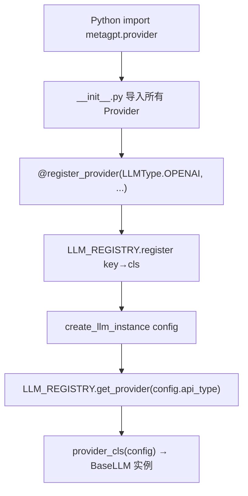
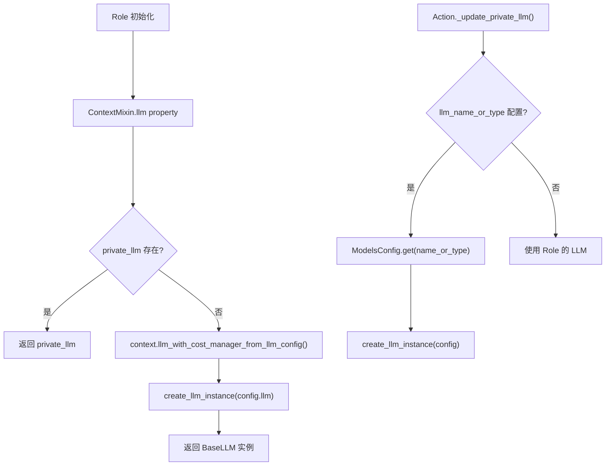

# PD-117.02 MetaGPT — LLMProviderRegistry 注册表式多 Provider 适配

> 文档编号：PD-117.02
> 来源：MetaGPT `metagpt/provider/llm_provider_registry.py`
> GitHub：https://github.com/FoundationAgents/MetaGPT.git
> 问题域：PD-117 多 LLM Provider 适配 Multi-LLM Provider Adapter
> 状态：可复用方案

---

## 第 1 章 问题与动机

### 1.1 核心问题

Agent 框架需要同时对接多家 LLM 后端（OpenAI、Anthropic、Gemini、Ollama、Azure、Bedrock、DashScope、Spark 等），每家 API 的认证方式、请求格式、响应结构、流式协议、Token 计费方式都不同。如果在业务代码中直接调用各家 SDK，会导致：

- 业务逻辑与 Provider 实现强耦合，切换模型需要改业务代码
- 每新增一个 Provider 都要修改工厂函数或 if-else 分支
- 不同 Provider 的成本核算、流式输出、错误重试逻辑无法统一
- 角色/Action 级别的模型配置难以实现

### 1.2 MetaGPT 的解法概述

MetaGPT 采用 **注册表模式（Registry Pattern）+ 装饰器自注册** 的三层架构：

1. **LLMType 枚举** — 27 个枚举值定义所有支持的 Provider 类型（`metagpt/configs/llm_config.py:19-49`）
2. **LLMProviderRegistry 单例** — 全局注册表 `LLM_REGISTRY`，`@register_provider` 装饰器让 Provider 类在 import 时自动注册（`metagpt/provider/llm_provider_registry.py:12-48`）
3. **BaseLLM 抽象类** — 统一 `aask/acompletion/acompletion_text` 接口，内置消息压缩、成本追踪、重试逻辑（`metagpt/provider/base_llm.py:35-412`）
4. **LLMConfig 统一配置** — 一个 Pydantic 模型覆盖所有 Provider 的配置字段（`metagpt/configs/llm_config.py:52-137`）
5. **ModelsConfig 多模型字典** — 支持按名称或 api_type 查找 LLMConfig，实现 Action 级别模型切换（`metagpt/configs/models_config.py:26-112`）

### 1.3 设计思想

| 设计原则 | 具体实现 | 理由 | 替代方案 |
|----------|----------|------|----------|
| 开闭原则 | `@register_provider` 装饰器自注册，新增 Provider 零修改注册表 | 避免 if-else 膨胀，新 Provider 只需一个文件 | 工厂方法 + switch-case |
| 依赖倒置 | 业务代码依赖 `BaseLLM` 抽象，不依赖具体 Provider | 角色/Action 可透明切换模型 | 直接依赖 OpenAI SDK |
| 单一职责 | 每个 Provider 文件只负责一家 API 的适配 | 修改 Anthropic 不影响 Gemini | 一个大类处理所有 Provider |
| OpenAI 兼容复用 | 11 个 OpenAI 兼容 Provider 共享 `OpenAILLM` 实现 | DeepSeek/Moonshot/Fireworks 等只需改 base_url | 每个 Provider 独立实现 |
| 配置驱动 | `LLMConfig.api_type` 决定 Provider 选择 | YAML 配置即可切换，无需改代码 | 硬编码 Provider 选择 |

---

## 第 2 章 源码实现分析

### 2.1 架构概览

MetaGPT 的 LLM Provider 系统由 4 层组成：配置层、注册表层、抽象层、实现层。

```
┌─────────────────────────────────────────────────────────────────┐
│                     业务层 (Role / Action)                       │
│  ContextMixin.llm → Context.llm() → create_llm_instance()      │
├─────────────────────────────────────────────────────────────────┤
│                     注册表层 (Registry)                          │
│  LLM_REGISTRY.get_provider(config.api_type)(config) → BaseLLM  │
├─────────────────────────────────────────────────────────────────┤
│                     抽象层 (BaseLLM)                             │
│  aask() → acompletion_text() → _achat_completion/_stream        │
│  + compress_messages() + _update_costs() + retry(tenacity)      │
├──────────┬──────────┬──────────┬──────────┬─────────────────────┤
│ OpenAILLM│Anthropic │ GeminiLLM│ OllamaLLM│ BedrockLLM │ ...   │
│ (×11 type│  LLM     │          │ (×4 type)│            │       │
│  共享)   │          │          │          │            │       │
└──────────┴──────────┴──────────┴──────────┴─────────────────────┘
```

13 个 Provider 实现类覆盖 27 个 LLMType 枚举值。其中 `OpenAILLM` 一个类注册了 11 个类型（所有 OpenAI 兼容 API），`OllamaLLM` 注册了 4 个类型（chat/generate/embeddings/embed）。

### 2.2 核心实现

#### 2.2.1 注册表 + 装饰器自注册



对应源码 `metagpt/provider/llm_provider_registry.py:12-48`：

```python
class LLMProviderRegistry:
    def __init__(self):
        self.providers = {}

    def register(self, key, provider_cls):
        self.providers[key] = provider_cls

    def get_provider(self, enum: LLMType):
        """get provider instance according to the enum"""
        return self.providers[enum]


def register_provider(keys):
    """register provider to registry"""
    def decorator(cls):
        if isinstance(keys, list):
            for key in keys:
                LLM_REGISTRY.register(key, cls)
        else:
            LLM_REGISTRY.register(keys, cls)
        return cls
    return decorator


def create_llm_instance(config: LLMConfig) -> BaseLLM:
    """get the default llm provider"""
    llm = LLM_REGISTRY.get_provider(config.api_type)(config)
    if llm.use_system_prompt and not config.use_system_prompt:
        llm.use_system_prompt = config.use_system_prompt
    return llm

LLM_REGISTRY = LLMProviderRegistry()
```

关键设计：`register_provider` 支持传入单个 key 或 key 列表，使得 `OpenAILLM` 可以一次注册 11 个兼容类型。`create_llm_instance` 是唯一的工厂入口，额外处理了 `use_system_prompt` 的覆盖逻辑（针对 o1 系列模型）。

#### 2.2.2 BaseLLM 抽象类的统一接口

```mermaid
graph TD
    A["aask(msg, system_msgs, images)"] --> B[构建 message 列表]
    B --> C["compress_messages(messages)"]
    C --> D{"stream?"}
    D -->|是| E["_achat_completion_stream(messages)"]
    D -->|否| F["_achat_completion(messages)"]
    E --> G["get_choice_text(resp) → str"]
    F --> G
    G --> H["_update_costs(usage, model)"]
```



对应源码 `metagpt/provider/base_llm.py:179-210`：

```python
async def aask(
    self,
    msg: Union[str, list[dict[str, str]]],
    system_msgs: Optional[list[str]] = None,
    format_msgs: Optional[list[dict[str, str]]] = None,
    images: Optional[Union[str, list[str]]] = None,
    timeout=USE_CONFIG_TIMEOUT,
    stream=None,
) -> str:
    if system_msgs:
        message = self._system_msgs(system_msgs)
    else:
        message = [self._default_system_msg()]
    if not self.use_system_prompt:
        message = []
    if format_msgs:
        message.extend(format_msgs)
    if isinstance(msg, str):
        message.append(self._user_msg(msg, images=images))
    else:
        message.extend(msg)
    if stream is None:
        stream = self.config.stream
    compressed_message = self.compress_messages(message, compress_type=self.config.compress_type)
    rsp = await self.acompletion_text(compressed_message, stream=stream, timeout=self.get_timeout(timeout))
    return rsp
```

`aask` 是业务层最常用的入口，它统一处理了 system prompt 注入、多模态图片、消息压缩、流式/非流式分发。子类只需实现 `_achat_completion` 和 `_achat_completion_stream` 两个抽象方法。

#### 2.2.3 OpenAI 兼容 Provider 的一对多注册

对应源码 `metagpt/provider/openai_api.py:43-57`：

```python
@register_provider(
    [
        LLMType.OPENAI,
        LLMType.FIREWORKS,
        LLMType.OPEN_LLM,
        LLMType.MOONSHOT,
        LLMType.MISTRAL,
        LLMType.YI,
        LLMType.OPEN_ROUTER,
        LLMType.DEEPSEEK,
        LLMType.SILICONFLOW,
        LLMType.OPENROUTER,
        LLMType.LLAMA_API,
    ]
)
class OpenAILLM(BaseLLM):
    ...
```

这是 MetaGPT 最精妙的设计之一：所有 OpenAI 兼容 API（DeepSeek、Moonshot、Fireworks、SiliconFlow 等）共享同一个 `OpenAILLM` 实现，只需在 `LLMConfig` 中配置不同的 `base_url` 和 `api_key`。流式输出中还针对不同服务的 usage 返回位置做了兼容处理（`openai_api.py:113-125`）。

### 2.3 实现细节

#### Provider 差异适配策略

不同 Provider 的 API 差异通过以下方式吸收：

| 差异点 | 适配方式 | 示例 |
|--------|----------|------|
| 消息格式 | 子类覆写 `_user_msg`/`_assistant_msg`/`format_msg` | Gemini 用 `parts` 替代 `content`（`google_gemini_api.py:64-99`） |
| system prompt | 子类设置 `use_system_prompt=False` 或覆写 `_const_kwargs` | Anthropic 将 system 提取为独立参数（`anthropic_api.py:31-35`） |
| 认证方式 | `LLMConfig` 统一字段 + 子类 `__init__` 适配 | Bedrock 用 `access_key/secret_key/session_token`（`bedrock_api.py:37-45`） |
| 流式协议 | 子类各自实现 `_achat_completion_stream` | Anthropic 用 event.type 分发（`anthropic_api.py:60-86`） |
| Token 计费 | `CostManager` 子类化 | Fireworks 按模型大小分级计费（`cost_manager.py:111-149`） |
| 响应解析 | 子类覆写 `get_choice_text` | Anthropic 返回 `resp.content[0].text`（`anthropic_api.py:44-50`） |
| reasoning 模式 | 各 Provider 独立处理 thinking/reasoning 字段 | Anthropic 用 `thinking` 参数（`anthropic_api.py:37`），DeepSeek 用 `reasoning_content`（`openai_api.py:106-107`） |

#### 按角色/Action 配置不同模型



对应源码 `metagpt/actions/action.py:43-51`：

```python
@model_validator(mode="after")
@classmethod
def _update_private_llm(cls, data: Any) -> Any:
    config = ModelsConfig.default().get(data.llm_name_or_type)
    if config:
        llm = create_llm_instance(config)
        llm.cost_manager = data.llm.cost_manager
        data.llm = llm
    return data
```

Action 通过 `llm_name_or_type` 字段可以覆盖 Role 级别的 LLM 配置。`ModelsConfig` 支持按模型名称或 `api_type` 查找（`models_config.py:94-112`），实现了"全局默认 + 角色覆盖 + Action 覆盖"的三级配置。


---

## 第 3 章 迁移指南

### 3.1 迁移清单

**阶段 1：基础架构（必须）**

- [ ] 定义 `LLMType` 枚举，列出需要支持的 Provider 类型
- [ ] 实现 `LLMProviderRegistry` 单例 + `@register_provider` 装饰器
- [ ] 定义 `BaseLLM` 抽象类，包含 `aask`/`acompletion`/`acompletion_text` 接口
- [ ] 实现 `LLMConfig` Pydantic 模型，统一所有 Provider 的配置字段
- [ ] 实现 `create_llm_instance` 工厂函数

**阶段 2：Provider 实现（按需）**

- [ ] 实现 `OpenAILLM`（覆盖所有 OpenAI 兼容 API）
- [ ] 实现 `AnthropicLLM`（处理 system prompt 分离 + thinking 模式）
- [ ] 实现其他 Provider（Gemini/Ollama/Bedrock 等）
- [ ] 在 `__init__.py` 中导入所有 Provider（触发自注册）

**阶段 3：业务集成（可选）**

- [ ] 实现 `ModelsConfig` 多模型字典，支持按名称查找
- [ ] 在 Action/Role 层实现 `llm_name_or_type` 覆盖机制
- [ ] 实现 `CostManager` 及其子类，支持不同计费策略

### 3.2 适配代码模板

以下是一个可直接运行的最小化 Provider 注册系统：

```python
"""minimal_provider_registry.py — 可直接复用的 Provider 注册表"""
from __future__ import annotations
from abc import ABC, abstractmethod
from enum import Enum
from typing import Optional, Union
from pydantic import BaseModel


# === 1. 配置层 ===
class LLMType(Enum):
    OPENAI = "openai"
    ANTHROPIC = "anthropic"
    OLLAMA = "ollama"

    def __missing__(self, key):
        return self.OPENAI  # 未知类型降级到 OpenAI


class LLMConfig(BaseModel):
    api_key: str = ""
    api_type: LLMType = LLMType.OPENAI
    base_url: str = "https://api.openai.com/v1"
    model: Optional[str] = None
    max_token: int = 4096
    temperature: float = 0.0
    stream: bool = True
    timeout: int = 600


# === 2. 注册表层 ===
class LLMProviderRegistry:
    def __init__(self):
        self.providers: dict[LLMType, type] = {}

    def register(self, key: LLMType, provider_cls: type):
        self.providers[key] = provider_cls

    def get_provider(self, enum: LLMType) -> type:
        if enum not in self.providers:
            raise KeyError(f"Provider {enum} not registered")
        return self.providers[enum]


LLM_REGISTRY = LLMProviderRegistry()


def register_provider(keys: Union[LLMType, list[LLMType]]):
    """装饰器：Provider 类在 import 时自动注册到全局注册表"""
    def decorator(cls):
        if isinstance(keys, list):
            for key in keys:
                LLM_REGISTRY.register(key, cls)
        else:
            LLM_REGISTRY.register(keys, cls)
        return cls
    return decorator


def create_llm_instance(config: LLMConfig) -> "BaseLLM":
    """工厂函数：根据 config.api_type 创建对应 Provider 实例"""
    return LLM_REGISTRY.get_provider(config.api_type)(config)


# === 3. 抽象层 ===
class BaseLLM(ABC):
    config: LLMConfig
    model: Optional[str] = None

    @abstractmethod
    def __init__(self, config: LLMConfig): ...

    @abstractmethod
    async def acompletion(self, messages: list[dict]) -> dict: ...

    @abstractmethod
    async def acompletion_stream(self, messages: list[dict]) -> str: ...

    async def aask(self, msg: str, system_prompt: str = "") -> str:
        messages = []
        if system_prompt:
            messages.append({"role": "system", "content": system_prompt})
        messages.append({"role": "user", "content": msg})
        resp = await self.acompletion(messages)
        return self._extract_text(resp)

    def _extract_text(self, resp: dict) -> str:
        return resp["choices"][0]["message"]["content"]


# === 4. 实现层示例 ===
@register_provider([LLMType.OPENAI])
class OpenAIProvider(BaseLLM):
    def __init__(self, config: LLMConfig):
        self.config = config
        self.model = config.model
        # from openai import AsyncOpenAI
        # self.client = AsyncOpenAI(api_key=config.api_key, base_url=config.base_url)

    async def acompletion(self, messages: list[dict]) -> dict:
        # return await self.client.chat.completions.create(
        #     model=self.model, messages=messages, max_tokens=self.config.max_token
        # )
        raise NotImplementedError("Connect real OpenAI client")

    async def acompletion_stream(self, messages: list[dict]) -> str:
        raise NotImplementedError


# === 使用示例 ===
# config = LLMConfig(api_type=LLMType.OPENAI, api_key="sk-xxx", model="gpt-4")
# llm = create_llm_instance(config)
# result = await llm.aask("Hello")
```

### 3.3 适用场景

| 场景 | 适用度 | 说明 |
|------|--------|------|
| 多 Provider Agent 框架 | ⭐⭐⭐ | 核心场景，注册表模式完美匹配 |
| 按角色分配不同模型 | ⭐⭐⭐ | ModelsConfig + Action.llm_name_or_type 直接可用 |
| OpenAI 兼容 API 快速接入 | ⭐⭐⭐ | 一个 OpenAILLM 类覆盖 11 个 Provider |
| 需要精细成本控制 | ⭐⭐ | CostManager 子类化支持不同计费，但缺少预算硬限制 |
| 需要动态热加载 Provider | ⭐ | 当前注册在 import 时完成，不支持运行时动态加载 |

---

## 第 4 章 测试用例

```python
"""test_provider_registry.py — 基于 MetaGPT 真实接口的测试"""
import pytest
from unittest.mock import AsyncMock, MagicMock, patch
from enum import Enum
from typing import Optional
from abc import ABC, abstractmethod


# --- 模拟 MetaGPT 核心类型 ---
class LLMType(Enum):
    OPENAI = "openai"
    ANTHROPIC = "anthropic"
    CUSTOM = "custom"


class LLMConfig:
    def __init__(self, api_type=LLMType.OPENAI, api_key="sk-test",
                 base_url="https://api.openai.com/v1", model="gpt-4",
                 max_token=4096, stream=True, use_system_prompt=True):
        self.api_type = api_type
        self.api_key = api_key
        self.base_url = base_url
        self.model = model
        self.max_token = max_token
        self.stream = stream
        self.use_system_prompt = use_system_prompt


class LLMProviderRegistry:
    def __init__(self):
        self.providers = {}

    def register(self, key, provider_cls):
        self.providers[key] = provider_cls

    def get_provider(self, enum):
        return self.providers[enum]


def register_provider(keys):
    def decorator(cls):
        if isinstance(keys, list):
            for key in keys:
                _REGISTRY.register(key, cls)
        else:
            _REGISTRY.register(keys, cls)
        return cls
    return decorator


_REGISTRY = LLMProviderRegistry()


class BaseLLM(ABC):
    use_system_prompt: bool = True
    @abstractmethod
    def __init__(self, config: LLMConfig): ...


def create_llm_instance(config: LLMConfig) -> BaseLLM:
    llm = _REGISTRY.get_provider(config.api_type)(config)
    if llm.use_system_prompt and not config.use_system_prompt:
        llm.use_system_prompt = config.use_system_prompt
    return llm


# --- Provider 实现 ---
@register_provider([LLMType.OPENAI])
class MockOpenAILLM(BaseLLM):
    def __init__(self, config):
        self.config = config
        self.model = config.model


@register_provider([LLMType.ANTHROPIC])
class MockAnthropicLLM(BaseLLM):
    def __init__(self, config):
        self.config = config
        self.model = config.model
        self.use_system_prompt = True


# --- 测试用例 ---
class TestProviderRegistry:
    def test_register_and_retrieve(self):
        """注册后能正确获取 Provider 类"""
        assert _REGISTRY.get_provider(LLMType.OPENAI) is MockOpenAILLM
        assert _REGISTRY.get_provider(LLMType.ANTHROPIC) is MockAnthropicLLM

    def test_create_instance_openai(self):
        """create_llm_instance 根据 api_type 创建正确实例"""
        config = LLMConfig(api_type=LLMType.OPENAI, model="gpt-4o")
        llm = create_llm_instance(config)
        assert isinstance(llm, MockOpenAILLM)
        assert llm.model == "gpt-4o"

    def test_create_instance_anthropic(self):
        """create_llm_instance 创建 Anthropic 实例"""
        config = LLMConfig(api_type=LLMType.ANTHROPIC, model="claude-3-opus")
        llm = create_llm_instance(config)
        assert isinstance(llm, MockAnthropicLLM)
        assert llm.model == "claude-3-opus"

    def test_system_prompt_override(self):
        """config.use_system_prompt=False 时覆盖 Provider 默认值"""
        config = LLMConfig(api_type=LLMType.ANTHROPIC, use_system_prompt=False)
        llm = create_llm_instance(config)
        assert llm.use_system_prompt is False

    def test_unregistered_provider_raises(self):
        """未注册的 Provider 类型抛出 KeyError"""
        with pytest.raises(KeyError):
            _REGISTRY.get_provider(LLMType.CUSTOM)

    def test_multi_key_registration(self):
        """一个类注册多个 key（如 OpenAILLM 注册 11 个类型）"""
        registry = LLMProviderRegistry()

        class FakeProvider(BaseLLM):
            def __init__(self, config): self.config = config

        for key in [LLMType.OPENAI, LLMType.ANTHROPIC]:
            registry.register(key, FakeProvider)

        assert registry.get_provider(LLMType.OPENAI) is FakeProvider
        assert registry.get_provider(LLMType.ANTHROPIC) is FakeProvider

    def test_decorator_returns_original_class(self):
        """装饰器不修改原始类"""
        assert MockOpenAILLM.__name__ == "MockOpenAILLM"
```


---

## 第 5 章 跨域关联

| 关联域 | 关系类型 | 说明 |
|--------|----------|------|
| PD-01 上下文管理 | 协同 | `BaseLLM.compress_messages()` 内置 4 种压缩策略（PRE/POST × CUT_BY_TOKEN/MSG），直接在 Provider 层处理上下文窗口限制 |
| PD-03 容错与重试 | 协同 | `BaseLLM.acompletion_text` 使用 tenacity 装饰器实现 3 次指数退避重试（`base_llm.py:249-255`），`OpenAILLM` 覆写为 6 次重试（`openai_api.py:165-171`） |
| PD-04 工具系统 | 协同 | `OpenAILLM.aask_code()` 通过 OpenAI function calling 实现工具调用（`openai_api.py:189-203`），其他 Provider 暂不支持 |
| PD-11 可观测性 | 依赖 | `CostManager` 在每次 API 调用后更新 token 计数和成本，`FireworksCostManager` 按模型大小分级计费（`cost_manager.py:111-149`） |
| PD-10 中间件管道 | 协同 | `ContextMixin` 实现了 private_context/private_config/private_llm 三级覆盖链（`context_mixin.py:28-33`），类似中间件的配置传播 |

---

## 第 6 章 来源文件索引

| 文件 | 行范围 | 关键实现 |
|------|--------|----------|
| `metagpt/provider/llm_provider_registry.py` | L12-L48 | LLMProviderRegistry 单例 + @register_provider 装饰器 + create_llm_instance 工厂 |
| `metagpt/provider/base_llm.py` | L35-L412 | BaseLLM 抽象类：aask/acompletion_text/compress_messages/_update_costs |
| `metagpt/configs/llm_config.py` | L19-L137 | LLMType 枚举（27 值）+ LLMConfig Pydantic 模型 |
| `metagpt/provider/openai_api.py` | L43-L328 | OpenAILLM：11 个 LLMType 共享实现，流式 usage 兼容处理 |
| `metagpt/provider/anthropic_api.py` | L14-L87 | AnthropicLLM：system prompt 分离 + thinking 模式 + 流式事件分发 |
| `metagpt/provider/google_gemini_api.py` | L42-L165 | GeminiLLM：parts 格式适配 + count_tokens 异步实现 |
| `metagpt/provider/ollama_api.py` | L189-L333 | OllamaLLM：4 个子类型 + OllamaMessageMeta 元类注册 |
| `metagpt/provider/bedrock_api.py` | L21-L170 | BedrockLLM：boto3 同步转异步 + 内部 Provider 子策略 |
| `metagpt/provider/__init__.py` | L1-L39 | 导入所有 Provider 触发自注册 |
| `metagpt/context.py` | L58-L100 | Context.llm()：LLM 实例创建 + CostManager 选择 |
| `metagpt/context_mixin.py` | L17-L101 | ContextMixin：三级 LLM 配置覆盖链 |
| `metagpt/actions/action.py` | L43-L51 | Action._update_private_llm：Action 级别模型切换 |
| `metagpt/configs/models_config.py` | L26-L112 | ModelsConfig：多模型字典 + 按名称/类型查找 |
| `metagpt/utils/cost_manager.py` | L25-L149 | CostManager + TokenCostManager + FireworksCostManager |

---

## 第 7 章 横向对比维度

> **重要：** 本章用于自动填充 Butcher Wiki 的横向对比表。

```json comparison_data
{
  "project": "MetaGPT",
  "dimensions": {
    "注册方式": "@register_provider 装饰器 + LLMType 枚举，import 时自注册",
    "抽象层设计": "BaseLLM ABC 统一 aask/acompletion，子类实现 _achat_completion",
    "Provider 数量": "13 个实现类覆盖 27 个 LLMType，OpenAILLM 一类注册 11 型",
    "配置模型": "LLMConfig Pydantic 统一字段 + ModelsConfig 多模型字典",
    "模型切换粒度": "三级覆盖：全局默认 → Role 级 → Action.llm_name_or_type",
    "成本追踪": "CostManager 子类化：标准/Token-only/Fireworks 分级计费",
    "流式适配": "各 Provider 独立实现 _achat_completion_stream，处理不同 SSE 协议"
  }
}
```

### 域元数据补充

```json domain_metadata
{
  "solution_summary": "MetaGPT 用 LLMProviderRegistry + @register_provider 装饰器实现 13 类 Provider 覆盖 27 个 LLMType，BaseLLM 统一 aask/acompletion 接口，支持全局→Role→Action 三级模型切换",
  "description": "Provider 适配需要处理消息格式差异、reasoning 模式兼容和按角色粒度的模型分配",
  "sub_problems": [
    "reasoning/thinking 模式跨 Provider 兼容",
    "按角色/Action 粒度的模型分配与配置覆盖",
    "OpenAI 兼容 API 的流式 usage 返回位置差异"
  ],
  "best_practices": [
    "一对多注册：OpenAI 兼容 API 共享单一实现类",
    "三级配置覆盖链：全局→Role→Action 逐层可覆盖",
    "CostManager 子类化适配不同计费模型"
  ]
}
```

