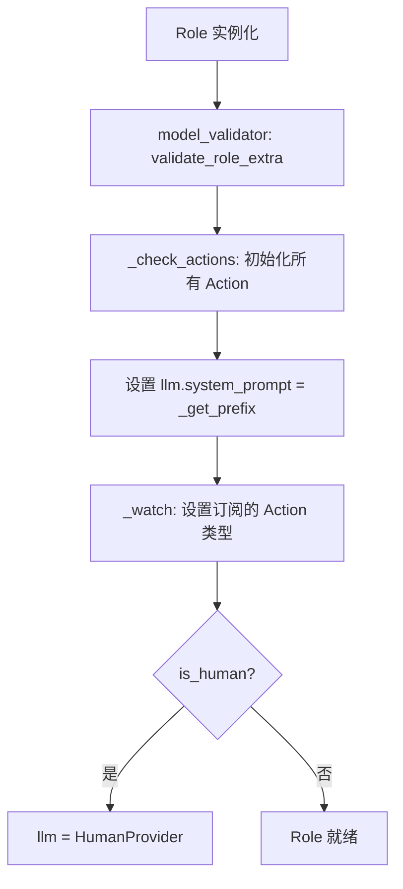
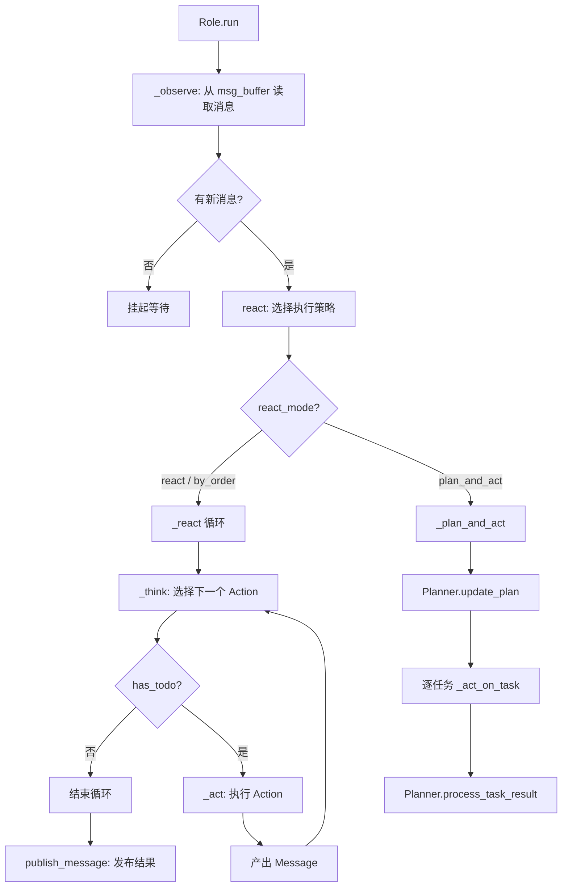
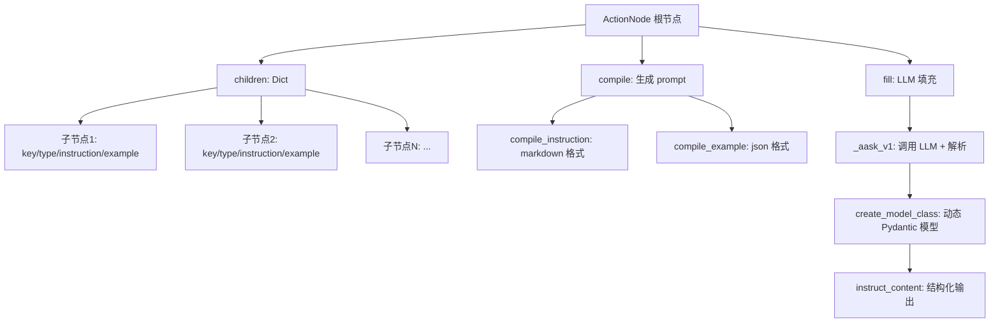

# PD-118.01 MetaGPT — SOP 驱动的角色系统

> 文档编号：PD-118.01
> 来源：MetaGPT `metagpt/roles/role.py`, `metagpt/actions/action.py`, `metagpt/actions/action_node.py`
> GitHub：https://github.com/FoundationAgents/MetaGPT.git
> 问题域：PD-118 SOP 驱动的角色系统 SOP-Driven Role System
> 状态：可复用方案

---

## 第 1 章 问题与动机

### 1.1 核心问题

多 Agent 系统中，如何让每个 Agent 像真实团队成员一样，拥有明确的职责边界、标准化的工作流程、以及基于消息的协作机制？

传统 Agent 框架通常只定义"你是谁"（system prompt），缺乏对行为流程的结构化约束。这导致：
- Agent 行为不可预测，容易偏离预期工作流
- 多 Agent 协作时消息路由混乱，缺乏订阅/发布机制
- 动作选择依赖纯 LLM 推理，没有状态机保障
- 角色复用困难，每次都要重写大量 prompt

MetaGPT 的核心哲学是 **Code = SOP(Team)**：将人类团队的标准操作流程（SOP）编码为 Agent 的行为约束，让 Agent 按照预定义的流程协作。

### 1.2 MetaGPT 的解法概述

1. **五要素角色定义**：每个 Role 通过 `profile/goal/constraints/actions/watch` 五个维度完整定义，其中 `watch` 决定该角色订阅哪些上游动作的消息（`metagpt/roles/role.py:130-133`）
2. **三阶段执行循环**：`_observe → _think → _act` 构成角色的核心运行循环，`_observe` 从消息缓冲区过滤感兴趣的消息，`_think` 决定下一步动作，`_act` 执行并产出消息（`metagpt/roles/role.py:340-397`）
3. **三种执行模式**：`react`（LLM 动态选择动作）、`by_order`（按预定义顺序执行）、`plan_and_act`（先规划再执行），通过 `RoleReactMode` 枚举切换（`metagpt/roles/role.py:82-85`）
4. **cause_by 消息路由**：消息通过 `cause_by` 标签标记来源动作，角色通过 `watch` 集合过滤感兴趣的消息，实现发布-订阅模式（`metagpt/roles/role.py:410-411`）
5. **ActionNode 结构化输出**：通过树形 ActionNode 定义 LLM 输出的结构约束，支持 JSON/Markdown/XML 多种 schema，自动生成 Pydantic 模型校验输出（`metagpt/actions/action_node.py:135-210`）

### 1.3 设计思想

| 设计原则 | 具体实现 | 理由 | 替代方案 |
|----------|----------|------|----------|
| SOP 即代码 | Role 基类 + actions 列表 + watch 订阅 | 将人类团队 SOP 编码为可执行的 Agent 行为约束 | 纯 prompt 描述工作流（不可靠） |
| 发布-订阅消息路由 | cause_by 标签 + watch 集合 + Environment.publish_message | 解耦角色间通信，角色只关心消息来源动作而非发送者 | 点对点直接通信（耦合度高） |
| 状态机驱动动作选择 | RoleContext.state + _set_state + _think | 确保动作执行有序，支持恢复和回退 | 纯 LLM 自由选择（不可控） |
| 结构化输出约束 | ActionNode 树 + Pydantic 动态模型 | 保证 LLM 输出格式可解析、可校验 | 正则/手动解析（脆弱） |
| 角色-环境分离 | Environment 管理角色集合和消息分发 | 角色不直接通信，通过环境中转，便于扩展 | 角色直接持有其他角色引用（紧耦合） |

---

## 第 2 章 源码实现分析

### 2.1 架构概览

MetaGPT 的角色系统由四层构成：Team → Environment → Role → Action/ActionNode。

```
┌─────────────────────────────────────────────────────────┐
│                        Team                              │
│  ┌───────────────────────────────────────────────────┐  │
│  │                  Environment                       │  │
│  │  ┌──────────┐  ┌──────────┐  ┌──────────────┐    │  │
│  │  │ProductMgr│  │ Architect│  │   Engineer    │    │  │
│  │  │ profile  │  │ profile  │  │   profile     │    │  │
│  │  │ goal     │  │ goal     │  │   goal        │    │  │
│  │  │ actions  │  │ actions  │  │   actions     │    │  │
│  │  │ watch    │  │ watch    │  │   watch       │    │  │
│  │  └────┬─────┘  └────┬─────┘  └──────┬───────┘    │  │
│  │       │              │               │             │  │
│  │       └──────────────┼───────────────┘             │  │
│  │              publish_message / put_message          │  │
│  │              (cause_by 路由)                        │  │
│  └───────────────────────────────────────────────────┘  │
└─────────────────────────────────────────────────────────┘
```

消息流转路径：
1. Role._act() 产出 Message（带 cause_by 标签）
2. Role.publish_message() 将消息发送到 Environment
3. Environment.publish_message() 根据 member_addrs 路由到目标 Role 的 msg_buffer
4. 目标 Role._observe() 从 msg_buffer 中过滤 watch 匹配的消息

### 2.2 核心实现

#### 2.2.1 Role 基类与五要素定义



对应源码 `metagpt/roles/role.py:125-178`：
```python
class Role(BaseRole, SerializationMixin, ContextMixin, BaseModel):
    """Role/Agent"""
    model_config = ConfigDict(arbitrary_types_allowed=True, extra="allow")

    name: str = ""
    profile: str = ""
    goal: str = ""
    constraints: str = ""
    desc: str = ""
    is_human: bool = False
    enable_memory: bool = True

    role_id: str = ""
    states: list[str] = []
    actions: list[SerializeAsAny[Action]] = Field(default=[], validate_default=True)
    rc: RoleContext = Field(default_factory=RoleContext)
    addresses: set[str] = set()
    planner: Planner = Field(default_factory=Planner)

    recovered: bool = False
    latest_observed_msg: Optional[Message] = None
    observe_all_msg_from_buffer: bool = False
```

角色的 system prompt 由 `_get_prefix()` 动态生成（`metagpt/roles/role.py:323-338`）：
```python
PREFIX_TEMPLATE = """You are a {profile}, named {name}, your goal is {goal}. """
CONSTRAINT_TEMPLATE = "the constraint is {constraints}. "

def _get_prefix(self):
    if self.desc:
        return self.desc
    prefix = PREFIX_TEMPLATE.format(
        profile=self.profile, name=self.name, goal=self.goal
    )
    if self.constraints:
        prefix += CONSTRAINT_TEMPLATE.format(constraints=self.constraints)
    if self.rc.env and self.rc.env.desc:
        all_roles = self.rc.env.role_names()
        other_role_names = ", ".join([r for r in all_roles if r != self.name])
        env_desc = f"You are in {self.rc.env.desc} with roles({other_role_names})."
        prefix += env_desc
    return prefix
```

#### 2.2.2 三阶段执行循环：_observe → _think → _act



`_observe` 的消息过滤逻辑（`metagpt/roles/role.py:399-427`）：
```python
async def _observe(self) -> int:
    news = []
    if self.recovered and self.latest_observed_msg:
        news = self.rc.memory.find_news(observed=[self.latest_observed_msg], k=10)
    if not news:
        news = self.rc.msg_buffer.pop_all()
    old_messages = [] if not self.enable_memory else self.rc.memory.get()
    # 核心过滤：cause_by 必须在 watch 集合中，或消息直接发给自己
    self.rc.news = [
        n for n in news
        if (n.cause_by in self.rc.watch or self.name in n.send_to)
        and n not in old_messages
    ]
    self.rc.memory.add_batch(self.rc.news)
    self.latest_observed_msg = self.rc.news[-1] if self.rc.news else None
    return len(self.rc.news)
```

`_think` 的状态机选择逻辑（`metagpt/roles/role.py:340-379`）：
```python
async def _think(self) -> bool:
    if len(self.actions) == 1:
        self._set_state(0)  # 单动作直接执行
        return True
    if self.recovered and self.rc.state >= 0:
        self._set_state(self.rc.state)  # 从恢复状态继续
        self.recovered = False
        return True
    if self.rc.react_mode == RoleReactMode.BY_ORDER:
        if self.rc.max_react_loop != len(self.actions):
            self.rc.max_react_loop = len(self.actions)
        self._set_state(self.rc.state + 1)  # 按顺序递增
        return self.rc.state >= 0 and self.rc.state < len(self.actions)
    # react 模式：LLM 动态选择
    prompt = self._get_prefix()
    prompt += STATE_TEMPLATE.format(
        history=self.rc.history,
        states="\n".join(self.states),
        n_states=len(self.states) - 1,
        previous_state=self.rc.state,
    )
    next_state = await self.llm.aask(prompt)
    next_state = extract_state_value_from_output(next_state)
    # -1 表示终止
    if (not next_state.isdigit() and next_state != "-1") or int(next_state) not in range(-1, len(self.states)):
        logger.warning(f"Invalid answer of state, {next_state=}, will be set to -1")
        next_state = -1
    self._set_state(int(next_state))
    return True
```

#### 2.2.3 ActionNode 结构化输出树



对应源码 `metagpt/actions/action_node.py:135-216`：
```python
class ActionNode:
    """ActionNode is a tree of nodes."""
    schema: str          # raw/json/markdown
    context: str         # all the context
    llm: BaseLLM         # LLM with aask interface
    children: dict[str, "ActionNode"]

    # Action Input
    key: str             # Product Requirement / File list / Code
    expected_type: Type  # str / int / float etc.
    instruction: str     # the instructions should be followed
    example: Any         # example for In Context-Learning

    # Action Output
    content: str
    instruct_content: BaseModel

    # For ActionGraph (DAG 依赖)
    prevs: List["ActionNode"]   # previous nodes
    nexts: List["ActionNode"]   # next nodes
```

ActionNode 的 `fill` 方法支持 4 种填充模式（`metagpt/actions/action_node.py:597-663`）：
- `simple`：一次性填充所有子节点
- `complex`：逐个子节点独立填充
- `code_fill`：代码块提取模式
- `xml_fill`：XML 标签提取模式

### 2.3 实现细节

**消息路由的完整链路：**

Environment 的 `publish_message` 方法（`metagpt/environment/base_env.py:175-195`）根据 `member_addrs` 映射将消息路由到目标角色：

```python
def publish_message(self, message: Message, peekable: bool = True) -> bool:
    found = False
    for role, addrs in self.member_addrs.items():
        if is_send_to(message, addrs):
            role.put_message(message)
            found = True
    if not found:
        logger.warning(f"Message no recipients: {message.dump()}")
    self.history.add(message)
    return True
```

**RoleContext 作为运行时状态容器**（`metagpt/roles/role.py:92-123`）：

| 字段 | 类型 | 作用 |
|------|------|------|
| `env` | BaseEnvironment | 所属环境引用 |
| `msg_buffer` | MessageQueue | 私有消息接收缓冲区 |
| `memory` | Memory | 角色记忆（已处理消息） |
| `working_memory` | Memory | 工作记忆（任务执行中） |
| `state` | int | 当前状态机状态（-1=初始/终止） |
| `todo` | Action | 当前待执行动作 |
| `watch` | set[str] | 订阅的动作类型集合 |
| `react_mode` | RoleReactMode | 执行模式 |
| `max_react_loop` | int | 最大循环次数 |

**Memory 的 cause_by 索引**（`metagpt/memory/memory.py:20-35`）：Memory 类维护一个 `index: DefaultDict[str, list[Message]]`，以 `cause_by` 为键索引消息，支持 `get_by_actions` 快速检索特定动作产出的消息。

**具体角色定义示例 — Engineer**（`metagpt/roles/engineer.py:73-109`）：
```python
class Engineer(Role):
    name: str = "Alex"
    profile: str = "Engineer"
    goal: str = "write elegant, readable, extensible, efficient code"
    constraints: str = (
        "the code should conform to standards like google-style "
        "and be modular and maintainable."
    )
    def __init__(self, **kwargs) -> None:
        super().__init__(**kwargs)
        self.enable_memory = False
        self.set_actions([WriteCode])
        self._watch([WriteTasks, SummarizeCode, WriteCode,
                     WriteCodeReview, FixBug, WriteCodePlanAndChange])
```

Engineer 订阅了 6 种上游动作的消息，覆盖了从任务分配到代码审查的完整链路。


---

## 第 3 章 迁移指南

### 3.1 迁移清单

**阶段 1：角色基类（1 个文件）**
- [ ] 定义 `Role` 基类，包含 `profile/goal/constraints/actions` 四个核心字段
- [ ] 实现 `RoleContext` 运行时上下文，包含 `state/todo/watch/memory/msg_buffer`
- [ ] 实现 `_get_prefix()` 动态生成 system prompt

**阶段 2：三阶段循环（1 个文件）**
- [ ] 实现 `_observe()`：从消息缓冲区过滤 watch 匹配的消息
- [ ] 实现 `_think()`：根据 react_mode 选择下一个动作
- [ ] 实现 `_act()`：执行动作并产出带 cause_by 标签的消息
- [ ] 实现 `run()` 入口：串联 observe → react → publish

**阶段 3：消息路由（2 个文件）**
- [ ] 定义 `Message` 类，包含 `cause_by/sent_from/send_to` 路由字段
- [ ] 实现 `Environment.publish_message()`：根据 addresses 路由消息
- [ ] 实现 `Role.publish_message()` 和 `Role.put_message()`

**阶段 4：结构化输出（1 个文件，可选）**
- [ ] 实现 `ActionNode` 树形结构
- [ ] 实现 `compile()` prompt 生成和 `fill()` LLM 填充
- [ ] 实现 `create_model_class()` 动态 Pydantic 模型

### 3.2 适配代码模板

以下是一个最小可运行的 SOP 角色系统实现：

```python
"""Minimal SOP-driven Role System inspired by MetaGPT"""
from __future__ import annotations
import asyncio
from enum import Enum
from typing import Any, Optional, Type
from pydantic import BaseModel, Field
from collections import defaultdict


# --- Message Layer ---
class Message(BaseModel):
    content: str = ""
    role: str = "user"
    cause_by: str = ""       # 来源动作的类名
    sent_from: str = ""
    send_to: set[str] = Field(default={"<all>"})

    def __hash__(self):
        return hash(self.content + self.cause_by)


# --- Action Layer ---
class Action(BaseModel):
    name: str = ""
    prefix: str = ""

    def model_post_init(self, __context: Any) -> None:
        if not self.name:
            self.name = self.__class__.__name__

    async def run(self, history: list[Message] = None) -> str:
        raise NotImplementedError


# --- Memory Layer ---
class Memory(BaseModel):
    storage: list[Message] = []
    index: dict[str, list[Message]] = Field(default_factory=lambda: defaultdict(list))

    def add(self, msg: Message):
        if msg not in self.storage:
            self.storage.append(msg)
            if msg.cause_by:
                self.index[msg.cause_by].append(msg)

    def get(self, k: int = 0) -> list[Message]:
        return self.storage[-k:] if k else self.storage

    def get_by_actions(self, actions: set[str]) -> list[Message]:
        result = []
        for action in actions:
            result.extend(self.index.get(action, []))
        return result


# --- React Mode ---
class ReactMode(str, Enum):
    REACT = "react"
    BY_ORDER = "by_order"


# --- Role Context ---
class RoleContext(BaseModel):
    memory: Memory = Field(default_factory=Memory)
    msg_buffer: list[Message] = []
    state: int = -1
    todo: Optional[Action] = None
    watch: set[str] = set()
    react_mode: ReactMode = ReactMode.REACT
    max_react_loop: int = 1
    news: list[Message] = []


# --- Role Base ---
class Role(BaseModel):
    name: str = ""
    profile: str = ""
    goal: str = ""
    constraints: str = ""
    actions: list[Action] = []
    rc: RoleContext = Field(default_factory=RoleContext)
    env: Optional[Any] = Field(default=None, exclude=True)

    def set_actions(self, actions: list[type[Action] | Action]):
        self.actions = []
        for a in actions:
            action = a() if isinstance(a, type) else a
            self.actions.append(action)

    def watch(self, action_classes: list[type[Action]]):
        self.rc.watch = {cls.__name__ for cls in action_classes}

    def _set_state(self, state: int):
        self.rc.state = state
        self.rc.todo = self.actions[state] if 0 <= state < len(self.actions) else None

    async def _observe(self) -> int:
        news = list(self.rc.msg_buffer)
        self.rc.msg_buffer.clear()
        old = self.rc.memory.get()
        self.rc.news = [
            n for n in news
            if (n.cause_by in self.rc.watch or self.name in n.send_to)
            and n not in old
        ]
        for n in self.rc.news:
            self.rc.memory.add(n)
        return len(self.rc.news)

    async def _think(self) -> bool:
        if len(self.actions) == 1:
            self._set_state(0)
            return True
        if self.rc.react_mode == ReactMode.BY_ORDER:
            self._set_state(self.rc.state + 1)
            return 0 <= self.rc.state < len(self.actions)
        # react mode: 实际项目中这里调用 LLM 选择
        self._set_state(0)
        return True

    async def _act(self) -> Message:
        response = await self.rc.todo.run(self.rc.memory.get())
        msg = Message(
            content=response,
            cause_by=self.rc.todo.__class__.__name__,
            sent_from=self.name,
        )
        self.rc.memory.add(msg)
        return msg

    async def run(self, msg: Message = None) -> Optional[Message]:
        if msg:
            self.rc.msg_buffer.append(msg)
        if not await self._observe():
            return None
        actions_taken = 0
        rsp = None
        while actions_taken < self.rc.max_react_loop:
            if not await self._think():
                break
            rsp = await self._act()
            actions_taken += 1
        self._set_state(-1)
        if rsp and self.env:
            self.env.publish_message(rsp)
        return rsp


# --- Environment ---
class Environment(BaseModel):
    roles: dict[str, Role] = {}

    def add_roles(self, roles: list[Role]):
        for role in roles:
            self.roles[role.name] = role
            role.env = self

    def publish_message(self, msg: Message):
        for role in self.roles.values():
            if msg.cause_by in role.rc.watch or role.name in msg.send_to:
                role.rc.msg_buffer.append(msg)

    async def run(self, rounds: int = 3):
        for _ in range(rounds):
            futures = [role.run() for role in self.roles.values() if role.rc.msg_buffer]
            if not futures:
                break
            await asyncio.gather(*futures)
```

### 3.3 适用场景

| 场景 | 适用度 | 说明 |
|------|--------|------|
| 软件开发团队模拟 | ⭐⭐⭐ | MetaGPT 的核心场景，PM→Architect→Engineer→QA 完整 SOP |
| 多角色对话系统 | ⭐⭐⭐ | 每个角色有明确职责和约束，消息路由清晰 |
| 工作流自动化 | ⭐⭐ | by_order 模式适合固定流程，但灵活性不如 DAG 编排 |
| 单 Agent 复杂任务 | ⭐⭐ | plan_and_act 模式支持，但 Planner 需要额外实现 |
| 实时交互场景 | ⭐ | 基于轮次的消息处理，不适合低延迟实时交互 |

---

## 第 4 章 测试用例

```python
import pytest
import asyncio
from unittest.mock import AsyncMock, patch


class WriteRequirement(Action):
    """模拟产品经理写需求"""
    name: str = "WriteRequirement"
    async def run(self, history=None) -> str:
        return "## PRD\n- Feature: User login\n- Priority: High"


class WriteDesign(Action):
    """模拟架构师写设计"""
    name: str = "WriteDesign"
    async def run(self, history=None) -> str:
        return "## Design\n- Auth service with JWT\n- REST API endpoints"


class TestRoleSystem:
    """测试 SOP 驱动的角色系统核心功能"""

    def test_role_five_elements(self):
        """测试角色五要素定义"""
        role = Role(
            name="Alice",
            profile="Product Manager",
            goal="Create PRD",
            constraints="Use same language as user",
        )
        role.set_actions([WriteRequirement])
        role.watch([Action])  # watch UserRequirement

        assert role.name == "Alice"
        assert role.profile == "Product Manager"
        assert len(role.actions) == 1
        assert "Action" in role.rc.watch

    def test_state_machine(self):
        """测试状态机转换"""
        role = Role(name="Bob", profile="Architect")
        role.set_actions([WriteRequirement, WriteDesign])

        assert role.rc.state == -1
        assert role.rc.todo is None

        role._set_state(0)
        assert role.rc.state == 0
        assert isinstance(role.rc.todo, WriteRequirement)

        role._set_state(1)
        assert role.rc.state == 1
        assert isinstance(role.rc.todo, WriteDesign)

        role._set_state(-1)
        assert role.rc.todo is None

    @pytest.mark.asyncio
    async def test_observe_filters_by_watch(self):
        """测试 _observe 按 watch 过滤消息"""
        role = Role(name="Bob", profile="Architect")
        role.set_actions([WriteDesign])
        role.watch([WriteRequirement])

        # 匹配的消息
        msg_match = Message(content="PRD done", cause_by="WriteRequirement")
        # 不匹配的消息
        msg_no_match = Message(content="Code done", cause_by="WriteCode")

        role.rc.msg_buffer.extend([msg_match, msg_no_match])
        count = await role._observe()

        assert count == 1
        assert role.rc.news[0].content == "PRD done"

    @pytest.mark.asyncio
    async def test_by_order_mode(self):
        """测试 by_order 模式按顺序执行"""
        role = Role(name="Alice", profile="PM")
        role.set_actions([WriteRequirement, WriteDesign])
        role.rc.react_mode = ReactMode.BY_ORDER
        role.rc.max_react_loop = 2

        # state 从 -1 开始，+1 后为 0
        has_todo = await role._think()
        assert has_todo is True
        assert role.rc.state == 0

        has_todo = await role._think()
        assert has_todo is True
        assert role.rc.state == 1

        has_todo = await role._think()
        assert has_todo is False  # 超出 actions 范围

    @pytest.mark.asyncio
    async def test_message_routing(self):
        """测试 Environment 消息路由"""
        env = Environment()
        pm = Role(name="Alice", profile="PM")
        pm.set_actions([WriteRequirement])
        pm.watch([Action])

        arch = Role(name="Bob", profile="Architect")
        arch.set_actions([WriteDesign])
        arch.watch([WriteRequirement])

        env.add_roles([pm, arch])

        # PM 发布消息
        msg = Message(content="PRD", cause_by="WriteRequirement", sent_from="Alice")
        env.publish_message(msg)

        # Architect 应该收到（watch WriteRequirement）
        assert len(arch.rc.msg_buffer) == 1
        # PM 不应该收到（不 watch WriteRequirement）
        assert len(pm.rc.msg_buffer) == 0

    @pytest.mark.asyncio
    async def test_full_sop_flow(self):
        """测试完整 SOP 流程：需求 → 设计"""
        env = Environment()
        pm = Role(name="Alice", profile="PM")
        pm.set_actions([WriteRequirement])
        pm.watch([Action])

        arch = Role(name="Bob", profile="Architect")
        arch.set_actions([WriteDesign])
        arch.watch([WriteRequirement])

        env.add_roles([pm, arch])

        # 触发 PM
        user_msg = Message(content="Build a login system", cause_by="Action")
        pm.rc.msg_buffer.append(user_msg)

        # PM 执行
        pm_result = await pm.run()
        assert pm_result is not None
        assert "PRD" in pm_result.content

        # Architect 应该收到 PM 的输出
        assert len(arch.rc.msg_buffer) == 1
        arch_result = await arch.run()
        assert arch_result is not None
        assert "Design" in arch_result.content

    def test_memory_cause_by_index(self):
        """测试 Memory 的 cause_by 索引"""
        mem = Memory()
        msg1 = Message(content="PRD", cause_by="WritePRD")
        msg2 = Message(content="Design", cause_by="WriteDesign")
        msg3 = Message(content="PRD v2", cause_by="WritePRD")

        mem.add(msg1)
        mem.add(msg2)
        mem.add(msg3)

        prd_msgs = mem.get_by_actions({"WritePRD"})
        assert len(prd_msgs) == 2
        design_msgs = mem.get_by_actions({"WriteDesign"})
        assert len(design_msgs) == 1
```


---

## 第 5 章 跨域关联

| 关联域 | 关系类型 | 说明 |
|--------|----------|------|
| PD-01 上下文管理 | 依赖 | RoleContext.memory 和 working_memory 管理角色的上下文窗口，Planner.get_useful_memories() 实现上下文裁剪 |
| PD-02 多 Agent 编排 | 协同 | Team → Environment → Role 三层结构本身就是一种编排模式，Environment.run() 通过 asyncio.gather 并行执行所有非空闲角色 |
| PD-03 容错与重试 | 依赖 | ActionNode._aask_v1 使用 tenacity 的 @retry 装饰器（最多 6 次指数退避重试），_think 中对 LLM 返回的无效状态值做降级处理（设为 -1） |
| PD-04 工具系统 | 协同 | Action 是工具的抽象基类，ActionNode 通过 fill() 方法将 LLM 输出结构化为工具可消费的格式 |
| PD-06 记忆持久化 | 依赖 | Memory 类提供 cause_by 索引的消息存储，SerializationMixin 支持角色状态的 JSON 序列化/反序列化，支持断点恢复 |
| PD-09 Human-in-the-Loop | 协同 | is_human 标志将 LLM 替换为 HumanProvider，ActionNode 支持 ReviewMode.HUMAN 和 ReviseMode.HUMAN 人工审查模式，Planner.ask_review() 支持人工确认任务结果 |
| PD-10 中间件管道 | 互补 | MetaGPT 的 _observe → _think → _act 三阶段循环是一种隐式管道，但没有显式的中间件钩子机制 |
| PD-11 可观测性 | 依赖 | Environment.history 记录所有消息用于调试，logger.debug 在关键节点输出状态信息，cost_manager 追踪 LLM 调用成本 |

---

## 第 6 章 来源文件索引

| 文件 | 行范围 | 关键实现 |
|------|--------|----------|
| `metagpt/roles/role.py` | L51-79 | PREFIX_TEMPLATE / STATE_TEMPLATE / ROLE_TEMPLATE prompt 模板 |
| `metagpt/roles/role.py` | L82-90 | RoleReactMode 枚举（react/by_order/plan_and_act） |
| `metagpt/roles/role.py` | L92-123 | RoleContext 运行时上下文（state/todo/watch/memory/msg_buffer） |
| `metagpt/roles/role.py` | L125-159 | Role 基类定义（五要素 + actions + planner） |
| `metagpt/roles/role.py` | L239-259 | set_actions：初始化动作列表并构建 states 描述 |
| `metagpt/roles/role.py` | L261-282 | _set_react_mode：配置三种执行模式 |
| `metagpt/roles/role.py` | L284-291 | _watch：设置消息订阅的动作类型集合 |
| `metagpt/roles/role.py` | L302-306 | _set_state：状态机转换，更新 todo |
| `metagpt/roles/role.py` | L340-379 | _think：动作选择逻辑（单动作/恢复/by_order/LLM 选择） |
| `metagpt/roles/role.py` | L381-397 | _act：执行动作，产出带 cause_by 的 Message |
| `metagpt/roles/role.py` | L399-427 | _observe：消息过滤（cause_by ∈ watch ∨ name ∈ send_to） |
| `metagpt/roles/role.py` | L429-446 | publish_message：消息发布到 Environment |
| `metagpt/roles/role.py` | L454-470 | _react：think-act 循环（max_react_loop 限制） |
| `metagpt/roles/role.py` | L472-496 | _plan_and_act：先规划再逐任务执行 |
| `metagpt/roles/role.py` | L530-554 | run：入口方法，串联 observe → react → publish |
| `metagpt/actions/action.py` | L29-114 | Action 基类（name/i_context/prefix/node/run） |
| `metagpt/actions/action_node.py` | L135-210 | ActionNode 树形结构（key/type/instruction/children/prevs/nexts） |
| `metagpt/actions/action_node.py` | L246-282 | create_model_class：动态 Pydantic 模型生成 |
| `metagpt/actions/action_node.py` | L382-421 | compile：prompt 编译（context + example + instruction + constraint） |
| `metagpt/actions/action_node.py` | L597-663 | fill：LLM 填充（simple/complex/code_fill/xml_fill 四种模式） |
| `metagpt/memory/memory.py` | L20-112 | Memory 类（storage + cause_by 索引 + get_by_actions） |
| `metagpt/schema.py` | L232-317 | Message 类（cause_by/sent_from/send_to 路由字段） |
| `metagpt/environment/base_env.py` | L124-248 | Environment（角色管理 + publish_message 消息路由 + 并行 run） |
| `metagpt/team.py` | L32-138 | Team（hire 角色 + run_project 发布需求 + 轮次循环） |
| `metagpt/strategy/planner.py` | L58-192 | Planner（plan_and_act 模式的计划管理 + 任务确认 + 人工审查） |
| `metagpt/roles/engineer.py` | L73-109 | Engineer 角色（watch 6 种动作 + 自定义 _act） |
| `metagpt/roles/product_manager.py` | L21-64 | ProductManager 角色（BY_ORDER 模式 + 自定义 _think） |
| `metagpt/roles/architect.py` | L17-58 | Architect 角色（watch WritePRD + RoleZero 扩展） |

---

## 第 7 章 横向对比维度

```json comparison_data
{
  "project": "MetaGPT",
  "dimensions": {
    "角色定义方式": "Pydantic BaseModel 五要素：profile/goal/constraints/actions/watch",
    "动作选择策略": "三模式切换：react(LLM选择)/by_order(顺序)/plan_and_act(规划)",
    "消息路由机制": "cause_by 标签 + watch 订阅集合，Environment 发布-订阅分发",
    "状态管理": "RoleContext 整数状态机，state=-1 表示终止，支持断点恢复",
    "输出结构化": "ActionNode 树 + 动态 Pydantic 模型，支持 JSON/Markdown/XML/Code 四种 schema",
    "角色协作模式": "Team→Environment→Role 三层，asyncio.gather 并行执行非空闲角色"
  }
}
```

### 域元数据补充

```json domain_metadata
{
  "solution_summary": "MetaGPT 用 Pydantic 五要素 Role 基类 + cause_by 发布-订阅消息路由 + 三模式状态机（react/by_order/plan_and_act）实现 Code=SOP(Team) 的角色系统",
  "description": "将人类团队 SOP 编码为 Agent 可执行的行为约束与协作协议",
  "sub_problems": [
    "消息路由与订阅过滤",
    "结构化输出约束与校验",
    "角色状态序列化与断点恢复",
    "角色-环境解耦与并行执行"
  ],
  "best_practices": [
    "cause_by 标签实现发布-订阅解耦通信",
    "ActionNode 树形结构约束 LLM 输出格式",
    "三种 react_mode 覆盖不同编排需求"
  ]
}
```

