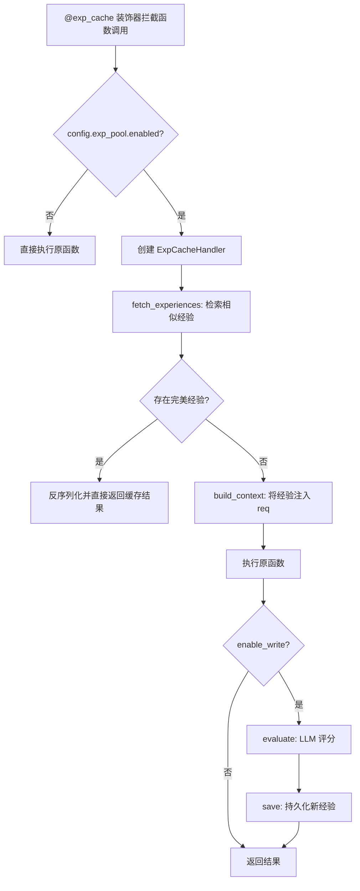
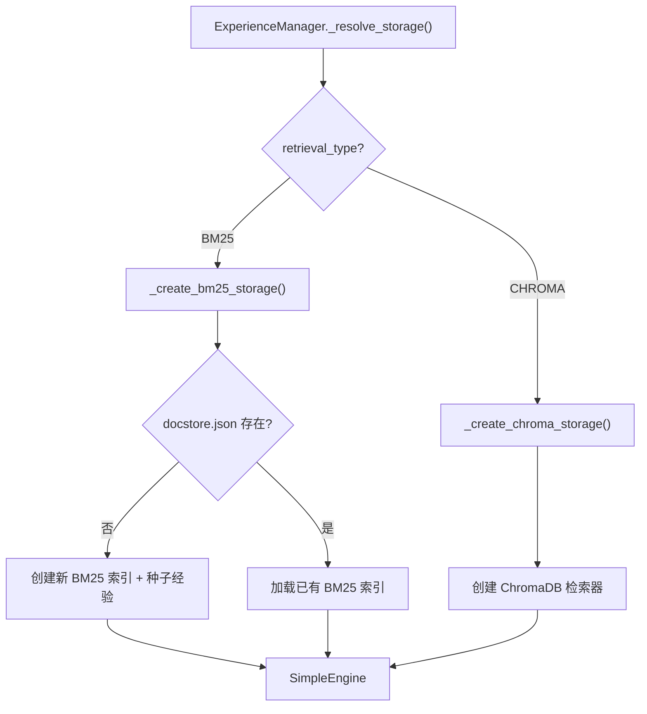

# PD-119.01 MetaGPT — ExperiencePool 经验池系统

> 文档编号：PD-119.01
> 来源：MetaGPT `metagpt/exp_pool/`
> GitHub：https://github.com/FoundationAgents/MetaGPT.git
> 问题域：PD-119 经验池与学习 Experience Pool & Learning
> 状态：可复用方案

---

## 第 1 章 问题与动机

### 1.1 核心问题

LLM Agent 在执行任务时，每次都从零开始推理，无法利用历史执行中积累的成功经验。这导致：

1. **重复计算浪费**：相同或相似的请求每次都要重新调用 LLM，消耗 token 和时间
2. **质量不稳定**：同一请求多次执行可能产生质量参差不齐的结果，无法锁定最优解
3. **无法跨会话学习**：Agent 在一次会话中发现的优秀解法，下次会话无法复用
4. **缺乏质量反馈闭环**：执行结果没有评分机制，无法区分好经验和差经验

核心挑战在于：如何在不修改业务逻辑的前提下，透明地为 Agent 的每次执行注入历史经验，并自动积累新经验？

### 1.2 MetaGPT 的解法概述

MetaGPT 设计了一套完整的 ExperiencePool 系统，核心思路是**装饰器驱动的透明经验缓存**：

1. **`@exp_cache` 装饰器**（`metagpt/exp_pool/decorator.py:29`）：一行注解即可为任意函数启用经验缓存，零侵入业务代码
2. **策略模式四大可插拔组件**：Scorer（评分）、PerfectJudge（完美判定）、ContextBuilder（上下文构建）、Serializer（序列化），全部通过抽象基类 + 依赖注入实现
3. **双存储后端**（`metagpt/exp_pool/manager.py:138-143`）：BM25 关键词检索 + ChromaDB 向量检索，通过配置切换
4. **LLM-as-Judge 评分**（`metagpt/exp_pool/scorers/simple.py:47`）：用 LLM 对每次执行结果打分（1-10），只有满分经验才被视为"完美"可直接复用
5. **日志回放导入**（`examples/exp_pool/load_exps_from_log.py:11`）：从历史日志中批量提取经验，支持离线积累

### 1.3 设计思想

| 设计原则 | 具体实现 | 理由 | 替代方案 |
|----------|----------|------|----------|
| 零侵入 | `@exp_cache` 装饰器模式 | 业务函数无需修改，加一行注解即可 | 手动在每个函数中调用缓存 API |
| 策略可插拔 | 4 个抽象基类 + 依赖注入 | 不同场景需要不同的评分/序列化/上下文策略 | 硬编码单一策略 |
| 质量门控 | LLM 评分 + 满分判定 | 只复用高质量经验，避免错误传播 | 无评分直接缓存（会积累垃圾） |
| 双模检索 | BM25 + ChromaDB 可切换 | BM25 适合精确匹配，向量适合语义相似 | 只用一种检索方式 |
| 读写分离 | `enable_read` / `enable_write` 独立开关 | 生产环境可只读不写，开发环境可读写 | 单一开关控制 |
| 懒加载 | `_storage` 属性延迟初始化 | 未启用时零开销 | 启动时立即初始化 |

---

## 第 2 章 源码实现分析

### 2.1 架构概览

MetaGPT ExperiencePool 的整体架构由 5 层组成：

```
┌─────────────────────────────────────────────────────────────┐
│                    @exp_cache 装饰器层                        │
│  decorator.py — 拦截函数调用，编排经验读写流程                   │
├─────────────────────────────────────────────────────────────┤
│              ExpCacheHandler 编排层                           │
│  fetch → judge → execute → score → save                     │
├──────────┬──────────┬──────────────┬────────────────────────┤
│ Scorer   │ Judge    │ ContextBuilder│ Serializer            │
│ 评分策略  │ 完美判定  │ 上下文注入     │ 序列化/反序列化        │
├──────────┴──────────┴──────────────┴────────────────────────┤
│              ExperienceManager 管理层                         │
│  manager.py — CRUD + 存储后端选择                             │
├─────────────────────────────────────────────────────────────┤
│              Storage 存储层                                   │
│  BM25 (docstore.json) │ ChromaDB (向量数据库)                 │
└─────────────────────────────────────────────────────────────┘
```

### 2.2 核心实现

#### 2.2.1 @exp_cache 装饰器 — 经验缓存的入口



对应源码 `metagpt/exp_pool/decorator.py:60-94`：

```python
def decorator(func: Callable[..., ReturnType]) -> Callable[..., ReturnType]:
    @functools.wraps(func)
    async def get_or_create(args: Any, kwargs: Any) -> ReturnType:
        if not config.exp_pool.enabled:
            rsp = func(*args, **kwargs)
            return await rsp if asyncio.iscoroutine(rsp) else rsp

        handler = ExpCacheHandler(
            func=func, args=args, kwargs=kwargs,
            query_type=query_type, exp_manager=manager,
            exp_scorer=scorer, exp_perfect_judge=perfect_judge,
            context_builder=context_builder, serializer=serializer, tag=tag,
        )

        await handler.fetch_experiences()

        if exp := await handler.get_one_perfect_exp():
            return exp

        await handler.execute_function()

        if config.exp_pool.enable_write:
            await handler.process_experience()

        return handler._raw_resp

    return ExpCacheHandler.choose_wrapper(func, get_or_create)
```

关键设计点：
- **海象运算符** `if exp :=` 实现"找到即返回"的短路逻辑（`decorator.py:82`）
- **同步/异步双模**：`choose_wrapper` 根据原函数类型自动选择包装器（`decorator.py:183-193`）
- **tag 自动生成**：默认用 `ClassName.method_name` 作为经验标签（`decorator.py:199-209`）

#### 2.2.2 ExperienceManager — 存储后端策略



对应源码 `metagpt/exp_pool/manager.py:135-218`：

```python
def _resolve_storage(self) -> "SimpleEngine":
    storage_creators = {
        ExperiencePoolRetrievalType.BM25: self._create_bm25_storage,
        ExperiencePoolRetrievalType.CHROMA: self._create_chroma_storage,
    }
    return storage_creators[self.config.exp_pool.retrieval_type]()

def _create_bm25_storage(self) -> "SimpleEngine":
    persist_path = Path(self.config.exp_pool.persist_path)
    docstore_path = persist_path / "docstore.json"
    ranker_configs = self._get_ranker_configs()

    if not docstore_path.exists():
        exps = [Experience(req="req", resp="resp")]  # 种子经验
        retriever_configs = [BM25RetrieverConfig(
            create_index=True, similarity_top_k=DEFAULT_SIMILARITY_TOP_K
        )]
        storage = SimpleEngine.from_objs(
            objs=exps, retriever_configs=retriever_configs,
            ranker_configs=ranker_configs
        )
        return storage

    retriever_configs = [BM25RetrieverConfig(
        similarity_top_k=DEFAULT_SIMILARITY_TOP_K
    )]
    storage = SimpleEngine.from_index(
        BM25IndexConfig(persist_path=persist_path),
        retriever_configs=retriever_configs,
        ranker_configs=ranker_configs,
    )
    return storage
```

关键设计点：
- **策略字典**替代 if-else 分支（`manager.py:138-143`）
- **种子经验**：BM25 首次创建时插入一条占位经验，避免空索引问题（`manager.py:172`）
- **可选 LLM Ranker**：`use_llm_ranker` 配置项控制是否用 LLM 对检索结果二次排序（`manager.py:220-232`）

### 2.3 实现细节

#### 数据模型层次

Experience 数据模型（`metagpt/exp_pool/schema.py:62-76`）采用 Pydantic BaseModel，包含完整的元数据：

- `req` / `resp`：请求-响应对，经验的核心内容
- `metric`：包含 `Score`（1-10 评分 + 理由）、`time_cost`、`money_cost`
- `exp_type`：SUCCESS / FAILURE / INSIGHT 三种经验类型
- `entry_type`：AUTOMATIC（装饰器自动）/ MANUAL（手动录入）
- `tag`：经验标签，用于过滤（默认 `ClassName.method_name`）
- `traj`：Trajectory 轨迹（plan → action → observation → reward）
- `rag_key()`：返回 `req` 作为向量检索的 key

#### 完美经验判定

`SimplePerfectJudge`（`metagpt/exp_pool/perfect_judges/simple.py:13-27`）的判定逻辑：
1. 请求完全匹配（`serialized_req == exp.req`）
2. 评分满分（`exp.metric.score.val == MAX_SCORE`，即 10 分）

两个条件同时满足才返回缓存结果，这是一个保守策略——宁可重新执行也不返回次优结果。

#### 上下文注入的三种策略

| 策略 | 类 | 适用场景 |
|------|-----|---------|
| Simple | `SimpleContextBuilder` | 通用函数，将经验拼接到 req 前 |
| ActionNode | `ActionNodeContextBuilder` | ActionNode.fill()，在 prompt 末尾追加经验 |
| RoleZero | `RoleZeroContextBuilder` | RoleZero 角色，替换 `EXPERIENCE_MASK` 占位符 |

`RoleZeroContextBuilder`（`metagpt/exp_pool/context_builders/role_zero.py:10-39`）的独特之处在于它不是简单拼接，而是用 `EXPERIENCE_MASK` 占位符替换，让经验自然融入角色的 system prompt 中。

#### 序列化的三种策略

| 策略 | 类 | 特点 |
|------|-----|------|
| Simple | `SimpleSerializer` | `str()` 直接转换 |
| ActionNode | `ActionNodeSerializer` | 序列化 `instruct_content.model_dump_json()`，反序列化构造 ActionNode 壳 |
| RoleZero | `RoleZeroSerializer` | 过滤 req 中的冗余消息，只保留文件读取内容 |

`ActionNodeSerializer`（`metagpt/exp_pool/serializers/action_node.py:14-36`）的反序列化特别巧妙：由于 ActionNode 包含不可序列化的 SSLContext，它构造了一个轻量 `InstructContent` 代理对象，只保留 JSON 数据。


---

## 第 3 章 迁移指南

### 3.1 迁移清单

**阶段 1：核心框架（必须）**

- [ ] 定义 `Experience` Pydantic 模型（req/resp/metric/tag/uuid）
- [ ] 实现 `ExperienceManager`（CRUD + 存储后端抽象）
- [ ] 实现 `@exp_cache` 装饰器（拦截 + 编排）
- [ ] 实现 `BaseScorer` + `SimpleScorer`（LLM 评分）
- [ ] 实现 `BasePerfectJudge` + `SimplePerfectJudge`（满分判定）
- [ ] 配置类 `ExperiencePoolConfig`（enabled/read/write/persist_path）

**阶段 2：检索增强（推荐）**

- [ ] 集成 BM25 或向量数据库作为存储后端
- [ ] 实现 `BaseContextBuilder` + 至少一种上下文注入策略
- [ ] 实现 `BaseSerializer` + 针对业务对象的序列化器
- [ ] 可选：LLM Ranker 二次排序

**阶段 3：运维工具（可选）**

- [ ] 日志回放导入工具（从历史日志提取经验）
- [ ] 经验统计 API（count/query/delete）
- [ ] 读写分离开关（生产只读，开发读写）

### 3.2 适配代码模板

以下是一个最小可运行的经验池实现，不依赖 MetaGPT 的 RAG 模块：

```python
"""Minimal Experience Pool — 可直接复用的经验池框架"""
import json
import time
import functools
import asyncio
from uuid import uuid4
from typing import Any, Callable, Optional
from abc import ABC, abstractmethod
from pydantic import BaseModel, Field


# === Schema ===
class Score(BaseModel):
    val: int = Field(default=1, ge=1, le=10)
    reason: str = ""

class Experience(BaseModel):
    req: str
    resp: str
    tag: str = ""
    score: Optional[Score] = None
    timestamp: float = Field(default_factory=time.time)
    uuid: str = Field(default_factory=lambda: uuid4().hex)


# === Abstract Interfaces ===
class BaseScorer(ABC):
    @abstractmethod
    async def evaluate(self, req: str, resp: str) -> Score: ...

class BasePerfectJudge(ABC):
    @abstractmethod
    async def is_perfect(self, exp: Experience, req: str) -> bool: ...


# === Simple Implementations ===
class SimplePerfectJudge(BasePerfectJudge):
    async def is_perfect(self, exp: Experience, req: str) -> bool:
        return exp.req == req and exp.score and exp.score.val == 10


class InMemoryExpManager:
    """内存存储，可替换为 SQLite/ChromaDB/Redis"""
    def __init__(self):
        self._store: list[Experience] = []
        self.enabled = True
        self.enable_read = True
        self.enable_write = True

    def create(self, exp: Experience):
        if self.enable_write:
            self._store.append(exp)

    def query(self, req: str, tag: str = "") -> list[Experience]:
        if not self.enable_read:
            return []
        results = [e for e in self._store if tag == "" or e.tag == tag]
        # 简单的字符串匹配，生产环境替换为向量检索
        return sorted(results, key=lambda e: -(e.score.val if e.score else 0))[:2]


_manager = InMemoryExpManager()


# === Decorator ===
def exp_cache(
    scorer: Optional[BaseScorer] = None,
    judge: Optional[BasePerfectJudge] = None,
    tag: Optional[str] = None,
):
    def decorator(func: Callable) -> Callable:
        @functools.wraps(func)
        async def wrapper(*args, **kwargs):
            if not _manager.enabled:
                return await func(*args, **kwargs) if asyncio.iscoroutinefunction(func) else func(*args, **kwargs)

            req_str = str(kwargs.get("req", ""))
            func_tag = tag or func.__name__

            # 1. 查找完美经验
            exps = _manager.query(req_str, tag=func_tag)
            _judge = judge or SimplePerfectJudge()
            for exp in exps:
                if await _judge.is_perfect(exp, req_str):
                    return exp.resp  # 命中缓存

            # 2. 执行原函数
            result = await func(*args, **kwargs) if asyncio.iscoroutinefunction(func) else func(*args, **kwargs)

            # 3. 评分并保存
            if _manager.enable_write and scorer:
                score = await scorer.evaluate(req_str, str(result))
                exp = Experience(req=req_str, resp=str(result), tag=func_tag, score=score)
                _manager.create(exp)

            return result
        return wrapper
    return decorator
```

### 3.3 适用场景

| 场景 | 适用度 | 说明 |
|------|--------|------|
| LLM Agent 重复性任务 | ⭐⭐⭐ | 代码生成、文档撰写等高重复场景，经验命中率高 |
| ActionNode 结构化输出 | ⭐⭐⭐ | MetaGPT 原生场景，ActionNode.fill() 直接受益 |
| 多轮对话角色 | ⭐⭐⭐ | RoleZero 等角色通过经验注入提升一致性 |
| 一次性创意任务 | ⭐ | 每次请求都不同，经验命中率极低 |
| 实时性要求极高 | ⭐⭐ | 经验检索增加延迟，但命中时可跳过 LLM 调用 |
| 离线批处理 | ⭐⭐⭐ | 日志回放导入 + 批量评分，适合离线积累经验 |

---

## 第 4 章 测试用例

```python
"""Tests for ExperiencePool core functionality."""
import pytest
import asyncio
from unittest.mock import AsyncMock, MagicMock, patch
from uuid import uuid4


# --- Schema Tests ---
class TestExperienceSchema:
    def test_experience_creation(self):
        """验证 Experience 基本创建和字段默认值"""
        from metagpt.exp_pool.schema import Experience, ExperienceType, EntryType
        exp = Experience(req="test request", resp="test response")
        assert exp.req == "test request"
        assert exp.resp == "test response"
        assert exp.exp_type == ExperienceType.SUCCESS
        assert exp.entry_type == EntryType.AUTOMATIC
        assert exp.uuid is not None
        assert exp.timestamp is not None

    def test_experience_rag_key(self):
        """验证 rag_key 返回 req 字段"""
        from metagpt.exp_pool.schema import Experience
        exp = Experience(req="my query", resp="my answer")
        assert exp.rag_key() == "my query"

    def test_score_range(self):
        """验证 Score 值范围"""
        from metagpt.exp_pool.schema import Score
        score = Score(val=8, reason="good quality")
        assert 1 <= score.val <= 10
        assert score.reason == "good quality"


# --- PerfectJudge Tests ---
class TestSimplePerfectJudge:
    @pytest.mark.asyncio
    async def test_perfect_match(self):
        """完全匹配 + 满分 → 返回 True"""
        from metagpt.exp_pool.perfect_judges.simple import SimplePerfectJudge
        from metagpt.exp_pool.schema import Experience, Metric, Score, MAX_SCORE
        judge = SimplePerfectJudge()
        exp = Experience(
            req="hello", resp="world",
            metric=Metric(score=Score(val=MAX_SCORE, reason="perfect"))
        )
        assert await judge.is_perfect_exp(exp, "hello") is True

    @pytest.mark.asyncio
    async def test_imperfect_score(self):
        """匹配但非满分 → 返回 False"""
        from metagpt.exp_pool.perfect_judges.simple import SimplePerfectJudge
        from metagpt.exp_pool.schema import Experience, Metric, Score
        judge = SimplePerfectJudge()
        exp = Experience(
            req="hello", resp="world",
            metric=Metric(score=Score(val=8, reason="good"))
        )
        assert await judge.is_perfect_exp(exp, "hello") is False

    @pytest.mark.asyncio
    async def test_no_metric(self):
        """无 metric → 返回 False"""
        from metagpt.exp_pool.perfect_judges.simple import SimplePerfectJudge
        from metagpt.exp_pool.schema import Experience
        judge = SimplePerfectJudge()
        exp = Experience(req="hello", resp="world")
        assert await judge.is_perfect_exp(exp, "hello") is False


# --- Serializer Tests ---
class TestSimpleSerializer:
    def test_serialize_req(self):
        from metagpt.exp_pool.serializers.simple import SimpleSerializer
        s = SimpleSerializer()
        assert s.serialize_req(req="test") == "test"

    def test_roundtrip(self):
        from metagpt.exp_pool.serializers.simple import SimpleSerializer
        s = SimpleSerializer()
        original = "response data"
        serialized = s.serialize_resp(original)
        deserialized = s.deserialize_resp(serialized)
        assert deserialized == original


# --- ContextBuilder Tests ---
class TestSimpleContextBuilder:
    @pytest.mark.asyncio
    async def test_build_with_exps(self):
        """有经验时应包含 Experiences 和 Instruction"""
        from metagpt.exp_pool.context_builders.simple import SimpleContextBuilder
        from metagpt.exp_pool.schema import Experience, Metric, Score
        builder = SimpleContextBuilder()
        builder.exps = [
            Experience(req="q1", resp="a1", metric=Metric(score=Score(val=8)))
        ]
        result = await builder.build("new question")
        assert "Experiences" in result
        assert "new question" in result
        assert "Instruction" in result


# --- Manager Tests ---
class TestExperienceManager:
    def test_is_readable_writable(self):
        """读写开关独立控制"""
        from metagpt.exp_pool.manager import ExperienceManager
        mgr = ExperienceManager()
        mgr.config.exp_pool.enabled = True
        mgr.config.exp_pool.enable_read = True
        mgr.config.exp_pool.enable_write = False
        assert mgr.is_readable is True
        assert mgr.is_writable is False
```


---

## 第 5 章 跨域关联

| 关联域 | 关系类型 | 说明 |
|--------|----------|------|
| PD-01 上下文管理 | 协同 | 经验注入会增加 prompt 长度，需要与上下文窗口管理协调；RoleZeroSerializer 通过过滤冗余消息控制经验体积 |
| PD-06 记忆持久化 | 依赖 | ExperiencePool 本质是一种结构化记忆，底层依赖 ChromaDB/BM25 持久化存储 |
| PD-07 质量检查 | 协同 | SimpleScorer 用 LLM-as-Judge 评分，与质量检查域的 Reviewer 模式一脉相承 |
| PD-08 搜索与检索 | 依赖 | 经验检索复用 MetaGPT 的 RAG SimpleEngine，BM25/向量检索是搜索域的子集 |
| PD-11 可观测性 | 协同 | 经验的 Metric 包含 time_cost 和 money_cost，日志回放工具从结构化日志提取经验 |
| PD-12 推理增强 | 协同 | 经验注入本质是一种 few-shot 增强，通过历史成功案例引导 LLM 推理方向 |

---

## 第 6 章 来源文件索引

| 文件 | 行范围 | 关键实现 |
|------|--------|----------|
| `metagpt/exp_pool/schema.py` | L1-77 | Experience/Score/Metric/Trajectory 数据模型 |
| `metagpt/exp_pool/decorator.py` | L29-94 | `@exp_cache` 装饰器定义 |
| `metagpt/exp_pool/decorator.py` | L97-228 | `ExpCacheHandler` 编排器（fetch→judge→execute→score→save） |
| `metagpt/exp_pool/manager.py` | L18-143 | `ExperienceManager` CRUD + 双存储后端策略 |
| `metagpt/exp_pool/manager.py` | L145-232 | BM25/ChromaDB 存储创建 + LLM Ranker 配置 |
| `metagpt/exp_pool/scorers/simple.py` | L13-65 | `SimpleScorer` LLM-as-Judge 评分 |
| `metagpt/exp_pool/scorers/base.py` | L1-16 | `BaseScorer` 抽象基类 |
| `metagpt/exp_pool/perfect_judges/simple.py` | L10-27 | `SimplePerfectJudge` 满分+精确匹配判定 |
| `metagpt/exp_pool/perfect_judges/base.py` | L1-21 | `BasePerfectJudge` 抽象基类 |
| `metagpt/exp_pool/context_builders/base.py` | L1-42 | `BaseContextBuilder` + `format_exps` 模板 |
| `metagpt/exp_pool/context_builders/simple.py` | L1-27 | `SimpleContextBuilder` 简单拼接 |
| `metagpt/exp_pool/context_builders/action_node.py` | L1-31 | `ActionNodeContextBuilder` ActionNode 专用 |
| `metagpt/exp_pool/context_builders/role_zero.py` | L1-39 | `RoleZeroContextBuilder` 占位符替换 |
| `metagpt/exp_pool/serializers/base.py` | L1-30 | `BaseSerializer` 抽象基类 |
| `metagpt/exp_pool/serializers/simple.py` | L1-23 | `SimpleSerializer` str() 转换 |
| `metagpt/exp_pool/serializers/action_node.py` | L1-36 | `ActionNodeSerializer` 不可序列化对象处理 |
| `metagpt/exp_pool/serializers/role_zero.py` | L1-59 | `RoleZeroSerializer` 消息过滤 |
| `metagpt/configs/exp_pool_config.py` | L1-26 | `ExperiencePoolConfig` 配置项 |
| `metagpt/actions/action_node.py` | L596 | `@exp_cache` 在 ActionNode.fill() 上的实际使用 |
| `metagpt/roles/di/role_zero.py` | L267-274 | `@exp_cache` 在 RoleZero.llm_cached_aask() 上的实际使用 |
| `examples/exp_pool/load_exps_from_log.py` | L1-85 | 日志回放导入工具 |
| `examples/exp_pool/decorator.py` | L1-28 | 装饰器使用示例 |

---

## 第 7 章 横向对比维度

```json comparison_data
{
  "project": "MetaGPT",
  "dimensions": {
    "经验模型": "Pydantic Experience 含 req/resp/metric/traj/tag，支持 SUCCESS/FAILURE/INSIGHT 三类型",
    "缓存策略": "@exp_cache 装饰器零侵入拦截，满分精确匹配才复用",
    "检索方式": "BM25 关键词 + ChromaDB 向量双后端，可选 LLM Ranker 二次排序",
    "评分机制": "LLM-as-Judge 1-10 分评分，SimpleScorer prompt 驱动",
    "上下文注入": "3 种 ContextBuilder 策略：Simple 拼接 / ActionNode 追加 / RoleZero 占位符替换",
    "序列化策略": "3 种 Serializer：Simple str / ActionNode JSON / RoleZero 消息过滤",
    "读写控制": "enable_read + enable_write 独立开关，支持生产只读模式",
    "离线积累": "日志回放工具从结构化日志批量提取经验"
  }
}
```

### 域元数据补充

```json domain_metadata
{
  "solution_summary": "MetaGPT 用 @exp_cache 装饰器 + 4 大可插拔策略组件（Scorer/Judge/ContextBuilder/Serializer）实现零侵入经验缓存，BM25+ChromaDB 双后端检索，LLM-as-Judge 评分门控",
  "description": "装饰器驱动的透明经验缓存框架，策略模式实现评分/检索/注入全链路可插拔",
  "sub_problems": [
    "经验序列化与不可序列化对象处理",
    "完美经验判定策略",
    "离线经验批量导入"
  ],
  "best_practices": [
    "LLM-as-Judge 评分 + 满分门控防止低质量经验污染",
    "策略模式四大可插拔组件实现场景适配",
    "读写分离开关支持生产只读模式"
  ]
}
```
