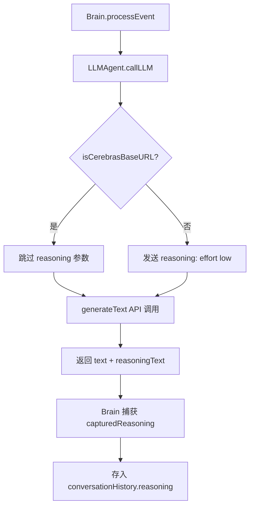
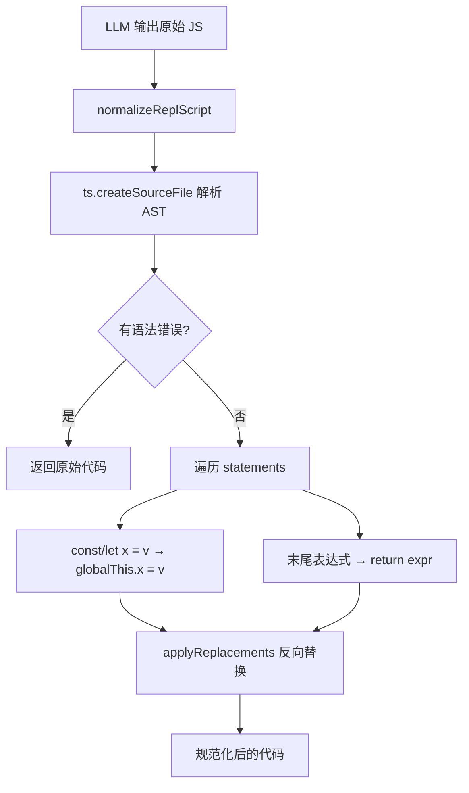
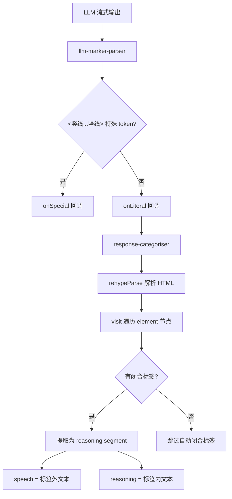

# PD-12.07 AIRI — REPL 代码生成与双轨推理分离

> 文档编号：PD-12.07
> 来源：AIRI `services/minecraft/src/cognitive/conscious/brain.ts`, `packages/stage-ui/src/composables/response-categoriser.ts`
> GitHub：https://github.com/moeru-ai/airi.git
> 问题域：PD-12 推理增强 Reasoning Enhancement
> 状态：可复用方案

---

## 第 1 章 问题与动机

### 1.1 核心问题

传统 Agent 系统中，LLM 的推理过程与行动输出混杂在同一文本流中，导致三个工程难题：

1. **推理不可执行**：LLM 输出的"思考过程"是自然语言，无法直接驱动工具调用，需要额外的 JSON 解析层
2. **推理不可分离**：模型的内心独白（reasoning）和外部表达（speech）混在一起，前端无法独立展示或过滤
3. **推理不可持久**：extended thinking 产生的 reasoning 字段在对话历史中丢失，后续 turn 无法回溯

AIRI 的核心洞察是：**让 LLM 直接输出可执行 JavaScript 而非 JSON/自然语言**，将推理过程编码为代码逻辑，同时通过双轨机制分离 reasoning 和 speech。

### 1.2 AIRI 的解法概述

1. **REPL 代码生成替代 JSON**：Brain 要求 LLM 输出纯 JavaScript，通过 `JavaScriptPlanner` 在 Node.js VM 沙箱中直接执行，消除 JSON 解析失败问题（`services/minecraft/src/cognitive/conscious/js-planner.ts:134-180`）
2. **Extended Thinking 捕获**：`LLMAgent` 通过 `@xsai/generate-text` 的 `reasoning` 参数启用模型深度思考，捕获 `reasoningText` 字段（`services/minecraft/src/cognitive/conscious/llm-agent.ts:46-54`）
3. **Reasoning 持久化到对话历史**：Brain 将 capturedReasoning 附加到 assistant message 的 `reasoning` 字段，跨 turn 可访问（`services/minecraft/src/cognitive/conscious/brain.ts:2050-2054`）
4. **前端双轨分离**：`response-categoriser` 用 rehype HTML 解析器提取 `<think>`/`<reasoning>` 等 XML 标签，将回复分为 reasoning（内心独白）和 speech（外部表达）（`packages/stage-ui/src/composables/response-categoriser.ts:140-208`）
5. **流式推理边界检测**：`llm-marker-parser` 通过 `<|...|>` 特殊 token 标记实现流式推理/内容切换点检测（`packages/stage-ui/src/composables/llm-marker-parser.ts:72-124`）

### 1.3 设计思想

| 设计原则 | 具体实现 | 理由 | 替代方案 |
|----------|----------|------|----------|
| 代码即推理 | LLM 输出 JS 而非 JSON，推理逻辑编码为变量赋值和条件分支 | 消除 JSON 解析失败；代码天然支持多步推理 | JSON Schema + function calling |
| 双轨分离 | reasoning 通过 XML 标签或 extended thinking API 分离 | TTS 只需 speech，调试需要 reasoning | 单一文本流 + 正则提取 |
| 供应商感知 | Cerebras 等不支持 reasoning 的供应商自动跳过 | 避免 API 报错 | 统一参数强制发送 |
| Silent-eval 模式 | 允许纯评估 turn（无 action），下一 turn 用 `prevRun.returnRaw` 消费结果 | 支持多步推理而不产生副作用 | 每 turn 必须产生 action |
| 代码规范化 | TypeScript AST 将 `const/let` 转为 `globalThis.x =`，末尾表达式加 `return` | VM 沙箱中变量声明不跨 turn 持久化 | 手动要求 LLM 写 globalThis |

---

## 第 2 章 源码实现分析

### 2.1 架构概览

AIRI 的推理增强架构分为三层：后端认知循环（Brain + LLMAgent + JavaScriptPlanner）、代码规范化层（repl-code-normalizer）、前端推理分离层（response-categoriser + llm-marker-parser）。

```
┌─────────────────────────────────────────────────────────────────┐
│                        Brain (认知循环)                          │
│  Event → Context View → System Prompt → LLM Call → REPL Eval   │
│                                                                 │
│  ┌──────────┐   ┌──────────┐   ┌────────────────┐              │
│  │ LLMAgent │──→│ reasoning│──→│ conversationHist│              │
│  │ callLLM  │   │ captured │   │ .reasoning field│              │
│  └──────────┘   └──────────┘   └────────────────┘              │
│       │                                                         │
│       ▼                                                         │
│  ┌──────────────────┐   ┌──────────────────────┐               │
│  │ repl-code-       │──→│ JavaScriptPlanner     │               │
│  │ normalizer (AST) │   │ VM sandbox evaluate() │               │
│  └──────────────────┘   └──────────────────────┘               │
└─────────────────────────────────────────────────────────────────┘

┌─────────────────────────────────────────────────────────────────┐
│                    前端推理分离层 (stage-ui)                      │
│                                                                 │
│  ┌──────────────────┐   ┌──────────────────────┐               │
│  │ llm-marker-parser│──→│ response-categoriser  │               │
│  │ <|special|> 检测  │   │ <think> XML 标签提取   │               │
│  └──────────────────┘   └──────────────────────┘               │
│       │                        │                                │
│       ▼                        ▼                                │
│  speech (TTS)           reasoning (调试面板)                     │
└─────────────────────────────────────────────────────────────────┘
```

### 2.2 核心实现

#### 2.2.1 LLMAgent — Extended Thinking 捕获



对应源码 `services/minecraft/src/cognitive/conscious/llm-agent.ts:37-57`：

```typescript
async callLLM(options: LLMCallOptions): Promise<LLMResult> {
    const shouldSendReasoning = !this.isCerebrasBaseURL(this.config.baseURL)
    const response = await generateText({
      baseURL: this.config.baseURL,
      apiKey: this.config.apiKey,
      model: this.config.model,
      messages: options.messages,
      headers: { 'Accept-Encoding': 'identity' },
      ...(options.responseFormat && { responseFormat: options.responseFormat }),
      ...(shouldSendReasoning && {
        reasoning: options.reasoning ?? { effort: 'low' },
      }),
    } as Parameters<typeof generateText>[0])

    return {
      text: response.text ?? '',
      reasoning: (response as any).reasoningText,
      usage: response.usage,
    }
  }
```

关键设计点：
- **供应商感知**（`llm-agent.ts:29-31`）：通过 `isCerebrasBaseURL` 检测 Cerebras 供应商，自动跳过不支持的 reasoning 参数
- **默认低开销**（`llm-agent.ts:48`）：reasoning effort 默认 `'low'`，避免不必要的 token 消耗
- **类型穿透**（`llm-agent.ts:54`）：`reasoningText` 通过 `as any` 访问，因为 `@xsai/generate-text` 的类型定义尚未覆盖此字段

#### 2.2.2 REPL 代码规范化 — TypeScript AST 转换



对应源码 `services/minecraft/src/cognitive/conscious/repl-code-normalizer.ts:53-91`：

```typescript
export function normalizeReplScript(code: string): string {
  const sourceFile = ts.createSourceFile(
    'repl.ts', code, ts.ScriptTarget.Latest, true, ts.ScriptKind.TS
  )
  const diagnostics = (sourceFile as ts.SourceFile & {
    parseDiagnostics?: readonly ts.DiagnosticWithLocation[]
  }).parseDiagnostics

  if (diagnostics && diagnostics.length > 0)
    return code  // 语法错误时不转换，保留原始代码

  const replacements: TextReplacement[] = []

  for (const statement of sourceFile.statements) {
    if (!ts.isVariableStatement(statement))
      continue
    const start = statement.getStart(sourceFile, false)
    const end = statement.getEnd()
    replacements.push({
      start, end,
      value: normalizeVariableStatement(sourceFile, statement),
    })
  }

  // 末尾表达式自动加 return，使其成为 REPL 返回值
  const hasTopLevelReturn = sourceFile.statements.some(
    statement => ts.isReturnStatement(statement)
  )
  if (!hasTopLevelReturn && sourceFile.statements.length > 0) {
    const lastStatement = sourceFile.statements[sourceFile.statements.length - 1]
    if (ts.isExpressionStatement(lastStatement)) {
      const expressionText = getNodeText(sourceFile, lastStatement.expression)
      replacements.push({
        start: lastStatement.getStart(sourceFile, false),
        end: lastStatement.getEnd(),
        value: `return (${expressionText})`,
      })
    }
  }

  return applyReplacements(code, replacements)
}
```

变量声明转换逻辑（`repl-code-normalizer.ts:23-39`）：

```typescript
function normalizeVariableStatement(
  sourceFile: ts.SourceFile, statement: ts.VariableStatement
): string {
  const keyword = getVariableKeyword(statement.declarationList.flags)
  const fragments: string[] = []
  for (const declaration of statement.declarationList.declarations) {
    if (ts.isIdentifier(declaration.name)) {
      const initializer = declaration.initializer
        ? getNodeText(sourceFile, declaration.initializer)
        : 'undefined'
      fragments.push(`globalThis.${declaration.name.text} = ${initializer};`)
      continue
    }
    // 解构赋值保留原始声明
    const declarationText = getNodeText(sourceFile, declaration)
    fragments.push(`${keyword} ${declarationText};`)
  }
  return fragments.join('\n')
}
```

#### 2.2.3 前端推理分离 — rehype HTML 解析



对应源码 `packages/stage-ui/src/composables/response-categoriser.ts:140-208`：

```typescript
export function categorizeResponse(
  response: string,
  _providerId?: string,
): CategorizedResponse {
  const extractedTags = extractAllTags(response)

  if (extractedTags.length === 0) {
    return {
      segments: [],
      speech: response,
      reasoning: '',
      raw: response,
    }
  }

  const segments: CategorizedSegment[] = extractedTags.map(tag => ({
    category: mapTagNameToCategory(tag.tagName),
    content: tag.content.trim(),
    startIndex: tag.startIndex,
    endIndex: tag.endIndex,
    raw: tag.fullMatch,
    tagName: tag.tagName,
  }))

  segments.sort((a, b) => a.startIndex - b.startIndex)

  // 提取 speech：标签外的所有文本
  const speechParts: string[] = []
  let lastEnd = 0
  for (const segment of segments) {
    if (segment.startIndex > lastEnd) {
      const text = response.slice(lastEnd, segment.startIndex).trim()
      if (text) speechParts.push(text)
    }
    lastEnd = segment.endIndex
  }
  if (lastEnd < response.length) {
    const text = response.slice(lastEnd).trim()
    if (text) speechParts.push(text)
  }

  const reasoning = segments
    .filter(s => s.category === 'reasoning')
    .map(s => s.content)
    .join('\n\n')

  return {
    segments,
    speech: speechParts.join(' ').trim() || '',
    reasoning,
    raw: response,
  }
}
```

### 2.3 实现细节

**流式推理状态机**（`response-categoriser.ts:224-308`）：`createStreamingCategorizer` 内部维护一个轻量级标签状态机（`outside → in-opening-tag → in-content → in-closing-tag`），增量处理每个 chunk，仅在标签闭合时触发完整的 rehype 重解析，避免 O(n²) 的重复解析开销。

**Silent-eval 模式**（`brain-prompt.md:128-137`）：Brain 的 system prompt 鼓励 LLM 使用"评估-行动"两步模式——Turn A 只做计算和查询（无 action），返回值通过 `prevRun.returnRaw` 持久化；Turn B 基于确认的值执行 action。这实现了零副作用的推理空间。

**配置双模型**（`config.ts:10-15`）：`OpenAIConfig` 同时定义 `model` 和 `reasoningModel`，支持主模型和推理模型分离配置，通过环境变量 `OPENAI_MODEL` 和 `OPENAI_REASONING_MODEL` 控制。

**LLM Trace 轻量化**（`brain.ts:1924-1947`）：trace 条目不克隆完整 messages 数组（避免 O(turns²) 内存增长），仅记录 `messageCount` 和 `estimatedTokens`，reasoning 字段完整保留用于调试。


---

## 第 3 章 迁移指南

### 3.1 迁移清单

**阶段 1：REPL 代码生成（替代 JSON 解析）**

- [ ] 安装 `typescript` 包用于 AST 解析
- [ ] 移植 `repl-code-normalizer.ts`（92 行，零外部依赖除 typescript）
- [ ] 创建 VM 沙箱执行器（参考 `js-planner.ts` 的 `vm.createContext` + `vm.Script`）
- [ ] 修改 system prompt，要求 LLM 输出 JavaScript 而非 JSON
- [ ] 实现 action 工具注册机制（将工具函数注入 VM 全局作用域）

**阶段 2：Extended Thinking 捕获**

- [ ] 在 LLM 调用层添加 `reasoning` 参数支持
- [ ] 实现供应商检测逻辑（跳过不支持 reasoning 的供应商）
- [ ] 将 reasoning 字段持久化到对话历史的 assistant message 中
- [ ] 在 LLM trace/日志中记录 reasoning 大小用于成本分析

**阶段 3：前端推理分离**

- [ ] 安装 `rehype-parse`、`rehype-stringify`、`unified`、`unist-util-visit`
- [ ] 移植 `response-categoriser.ts`（467 行）
- [ ] 移植 `llm-marker-parser.ts`（220 行）用于特殊 token 检测
- [ ] 在 UI 中分别渲染 speech 和 reasoning

### 3.2 适配代码模板

**REPL 代码规范化器（可直接复用）：**

```typescript
import ts from 'typescript'

interface TextReplacement {
  start: number
  end: number
  value: string
}

export function normalizeReplScript(code: string): string {
  const sourceFile = ts.createSourceFile(
    'repl.ts', code, ts.ScriptTarget.Latest, true, ts.ScriptKind.TS
  )

  // 语法错误时不转换
  const diagnostics = (sourceFile as any).parseDiagnostics
  if (diagnostics?.length > 0) return code

  const replacements: TextReplacement[] = []

  for (const stmt of sourceFile.statements) {
    if (!ts.isVariableStatement(stmt)) continue
    const start = stmt.getStart(sourceFile, false)
    const end = stmt.getEnd()

    const fragments: string[] = []
    for (const decl of stmt.declarationList.declarations) {
      if (ts.isIdentifier(decl.name)) {
        const init = decl.initializer
          ? sourceFile.text.slice(decl.initializer.getStart(sourceFile), decl.initializer.getEnd())
          : 'undefined'
        fragments.push(`globalThis.${decl.name.text} = ${init};`)
      }
    }
    if (fragments.length > 0) {
      replacements.push({ start, end, value: fragments.join('\n') })
    }
  }

  // 末尾表达式自动 return
  const last = sourceFile.statements[sourceFile.statements.length - 1]
  if (last && ts.isExpressionStatement(last)
    && !sourceFile.statements.some(s => ts.isReturnStatement(s))) {
    const expr = sourceFile.text.slice(
      last.expression.getStart(sourceFile), last.expression.getEnd()
    )
    replacements.push({
      start: last.getStart(sourceFile, false),
      end: last.getEnd(),
      value: `return (${expr})`,
    })
  }

  // 反向替换避免偏移
  let output = code
  for (const r of [...replacements].sort((a, b) => b.start - a.start)) {
    output = output.slice(0, r.start) + r.value + output.slice(r.end)
  }
  return output
}
```

**VM 沙箱执行器模板：**

```typescript
import vm from 'node:vm'

export class ReplExecutor {
  private context: vm.Context
  private sandbox: Record<string, unknown> = {}

  constructor(private timeoutMs = 750) {
    this.context = vm.createContext(this.sandbox)
  }

  registerTool(name: string, fn: (...args: unknown[]) => unknown) {
    Object.defineProperty(this.sandbox, name, {
      value: fn, configurable: true, enumerable: true, writable: false,
    })
  }

  async evaluate(code: string): Promise<{ returnValue?: string; logs: string[] }> {
    const logs: string[] = []
    this.sandbox.log = (...args: unknown[]) => {
      logs.push(args.map(String).join(' '))
    }

    const normalized = normalizeReplScript(code)
    const wrapped = `(async () => {\n${normalized}\n})()`
    const result = await new vm.Script(wrapped)
      .runInContext(this.context, { timeout: this.timeoutMs })

    return {
      returnValue: result !== undefined ? String(result) : undefined,
      logs,
    }
  }
}
```

### 3.3 适用场景

| 场景 | 适用度 | 说明 |
|------|--------|------|
| 游戏 AI / 机器人控制 | ⭐⭐⭐ | 代码输出天然适合控制指令序列 |
| 多工具编排 Agent | ⭐⭐⭐ | JS 支持条件分支、循环、异步等复杂编排 |
| 对话系统（需分离内心独白） | ⭐⭐⭐ | 双轨分离让 TTS 只播放 speech |
| 简单 Q&A 系统 | ⭐ | 过度工程化，JSON 足够 |
| 安全敏感场景 | ⭐⭐ | VM 沙箱提供隔离，但需审计注入的全局变量 |

---

## 第 4 章 测试用例

```typescript
import { describe, it, expect } from 'vitest'
import { normalizeReplScript } from './repl-code-normalizer'

describe('normalizeReplScript', () => {
  it('should convert const to globalThis assignment', () => {
    const input = 'const x = 42'
    const output = normalizeReplScript(input)
    expect(output).toContain('globalThis.x = 42;')
    expect(output).toContain('return (')  // 末尾不是表达式，不加 return
  })

  it('should add return for trailing expression', () => {
    const input = 'const x = 1\nx + 1'
    const output = normalizeReplScript(input)
    expect(output).toContain('globalThis.x = 1;')
    expect(output).toContain('return (x + 1)')
  })

  it('should not transform code with syntax errors', () => {
    const input = 'const x = {'  // 不完整
    const output = normalizeReplScript(input)
    expect(output).toBe(input)
  })

  it('should preserve destructuring declarations', () => {
    const input = 'const { a, b } = obj'
    const output = normalizeReplScript(input)
    expect(output).toContain('const { a, b } = obj;')
  })
})

describe('categorizeResponse', () => {
  // 需要导入 categorizeResponse
  it('should separate reasoning from speech', () => {
    const response = 'Hello! <think>I should greet them warmly</think> How are you?'
    // const result = categorizeResponse(response)
    // expect(result.speech).toBe('Hello! How are you?')
    // expect(result.reasoning).toBe('I should greet them warmly')
  })

  it('should treat no-tag response as pure speech', () => {
    const response = 'Just a normal message'
    // const result = categorizeResponse(response)
    // expect(result.speech).toBe('Just a normal message')
    // expect(result.reasoning).toBe('')
  })

  it('should handle multiple reasoning tags', () => {
    const response = '<think>first thought</think> speech <reasoning>second thought</reasoning>'
    // const result = categorizeResponse(response)
    // expect(result.reasoning).toContain('first thought')
    // expect(result.reasoning).toContain('second thought')
    // expect(result.speech).toBe('speech')
  })
})

describe('LLMAgent reasoning capture', () => {
  it('should skip reasoning for Cerebras provider', () => {
    // const agent = new LLMAgent({
    //   baseURL: 'https://api.cerebras.ai/v1',
    //   apiKey: 'test', model: 'test'
    // })
    // Verify isCerebrasBaseURL returns true
    // expect(agent['isCerebrasBaseURL']('https://api.cerebras.ai/v1')).toBe(true)
  })

  it('should include reasoning for non-Cerebras providers', () => {
    // const agent = new LLMAgent({
    //   baseURL: 'https://api.openai.com/v1',
    //   apiKey: 'test', model: 'test'
    // })
    // expect(agent['isCerebrasBaseURL']('https://api.openai.com/v1')).toBe(false)
  })
})

describe('StreamingCategorizer state machine', () => {
  it('should detect tag closure incrementally', () => {
    // const categorizer = createStreamingCategorizer()
    // categorizer.consume('<think>')
    // categorizer.consume('reasoning content')
    // categorizer.consume('</think>')
    // categorizer.consume(' speech content')
    // const result = categorizer.end()
    // expect(result.reasoning).toBe('reasoning content')
    // expect(result.speech).toBe('speech content')
  })
})
```


---

## 第 5 章 跨域关联

| 关联域 | 关系类型 | 说明 |
|--------|----------|------|
| PD-01 上下文管理 | 协同 | Brain 的 `enterContext`/`exitContext` 机制管理推理上下文边界，auto-trim 在 30 条消息时触发，archived contexts 压缩为摘要 |
| PD-04 工具系统 | 依赖 | JavaScriptPlanner 的 `installActionTools` 将工具注册为 VM 全局函数，工具调用通过 `runAction` 统一验证和执行 |
| PD-05 沙箱隔离 | 依赖 | REPL 代码在 `vm.createContext` 沙箱中执行，750ms 超时保护，每 turn 最多 5 个 action |
| PD-03 容错与重试 | 协同 | Brain 的 LLM 调用有 3 次重试 + 指数退避，Error Burst Guard 检测连续错误并强制 giveUp |
| PD-09 Human-in-the-Loop | 协同 | Brain 的 `paused` 状态允许人工暂停认知循环，`giveUp` 机制等待玩家输入后恢复 |
| PD-11 可观测性 | 协同 | LLM trace 记录每次调用的 reasoning 大小、token 用量、耗时；llmLog 提供结构化查询接口 |

---

## 第 6 章 来源文件索引

| 文件 | 行范围 | 关键实现 |
|------|--------|----------|
| `services/minecraft/src/cognitive/conscious/brain.ts` | L254-2326 | Brain 类：认知循环、reasoning 捕获、对话历史管理 |
| `services/minecraft/src/cognitive/conscious/llm-agent.ts` | L1-58 | LLMAgent：extended thinking 参数、供应商感知 |
| `services/minecraft/src/cognitive/conscious/js-planner.ts` | L119-640 | JavaScriptPlanner：VM 沙箱、工具注册、代码执行 |
| `services/minecraft/src/cognitive/conscious/repl-code-normalizer.ts` | L1-91 | TypeScript AST 代码规范化 |
| `packages/stage-ui/src/composables/response-categoriser.ts` | L1-466 | 前端推理/语音分离：rehype 解析、流式状态机 |
| `packages/stage-ui/src/composables/llm-marker-parser.ts` | L1-219 | 特殊 token `<|...|>` 流式解析器 |
| `services/minecraft/src/cognitive/conscious/prompts/brain-prompt.md` | L1-307 | Brain system prompt：Silent-eval 模式、Value-first 规则 |
| `services/minecraft/src/cognitive/conscious/prompts/brain-prompt.ts` | L127-152 | Prompt 模板渲染 + 工具签名格式化 |
| `services/minecraft/src/composables/config.ts` | L10-15 | OpenAIConfig：model + reasoningModel 双模型配置 |
| `packages/stage-ui/src/composables/use-chat-session/summary.ts` | L1-77 | 会话摘要：reasoning 提取与聚合 |

---

## 第 7 章 横向对比维度

> **重要：** 本章用于自动填充 Butcher Wiki 的横向对比表。

```json comparison_data
{
  "project": "AIRI",
  "dimensions": {
    "推理方式": "REPL 代码生成：LLM 输出可执行 JS 而非 JSON，推理编码为代码逻辑",
    "模型策略": "单模型 + reasoning effort 参数，配置支持 model/reasoningModel 分离",
    "成本": "默认 reasoning effort=low 最小化开销，Silent-eval 避免无效 action",
    "适用场景": "游戏 AI 机器人控制、多工具编排、需分离内心独白的对话系统",
    "推理模式": "Silent-eval 两步模式：Turn A 纯评估 → Turn B 基于确认值执行",
    "输出结构": "纯 JavaScript 代码，TypeScript AST 规范化后在 VM 沙箱执行",
    "推理可见性": "前端双轨分离：XML 标签提取 reasoning，speech 送 TTS",
    "供应商兼容性": "运行时检测 Cerebras 等供应商，自动跳过不支持的 reasoning 参数",
    "零副作用推理工具": "Silent-eval turn 允许纯计算无 action，prevRun.returnRaw 跨 turn 传递",
    "推理开关控制": "reasoning effort 三级可配（low/medium/high），供应商级自动禁用",
    "流式推理检测": "llm-marker-parser 检测 <|...|> 特殊 token + 增量标签状态机",
    "结构化输出集成": "代码即结构化输出，VM 沙箱直接执行，无需 JSON Schema 约束",
    "增强策略": "代码规范化（AST 变量提升 + 自动 return）+ prompt 引导 eval-then-act",
    "思考预算": "no-action follow-up budget 默认 3 次、最大 8 次，可动态调整",
    "迭代终止策略": "budget 耗尽或 stagnation 检测（连续相同签名）时强制停止"
  }
}
```

### 域元数据补充

```json domain_metadata
{
  "solution_summary": "AIRI 用 REPL 代码生成替代 JSON 解析，LLM 输出可执行 JS 在 VM 沙箱运行，配合 rehype 双轨分离 reasoning/speech 和 Silent-eval 两步推理模式",
  "description": "代码生成作为推理载体：将推理过程编码为可执行代码而非自然语言描述",
  "sub_problems": [
    "REPL 代码规范化：AST 级变量声明提升和自动 return 注入",
    "推理/语音双轨分离：从混合文本中分离内心独白和外部表达",
    "跨 turn 推理值传递：无副作用评估 turn 的返回值持久化机制",
    "流式 XML 标签增量检测：避免重复解析的轻量级标签状态机",
    "No-action 预算与停滞检测：防止推理循环无限空转"
  ],
  "best_practices": [
    "代码即推理：让 LLM 输出可执行代码而非 JSON，消除解析失败并天然支持多步推理",
    "eval-then-act 两步模式：先纯评估确认值，再基于确认值执行 action，避免 TOCTOU",
    "供应商级 reasoning 参数感知：运行时检测供应商能力，自动跳过不支持的参数",
    "增量标签状态机：流式场景下 O(chunk) 检测标签闭合，仅在必要时触发完整解析"
  ]
}
```

