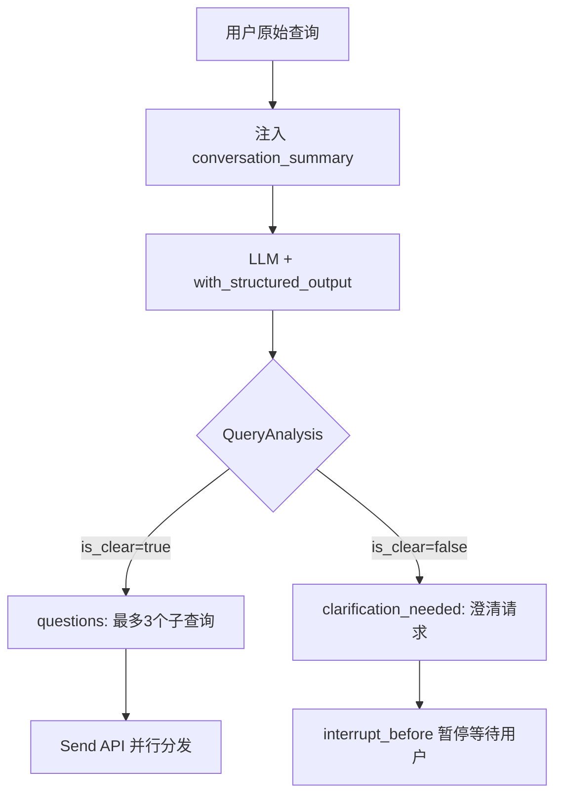
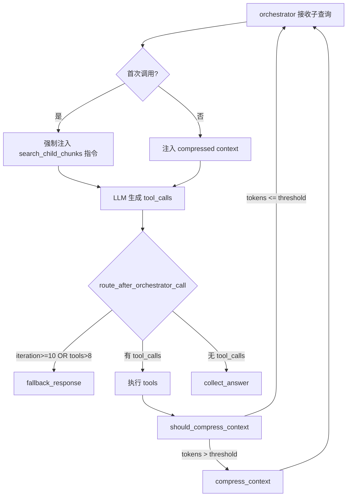
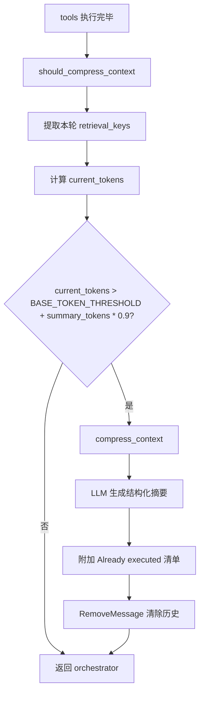

# PD-12.NN AgenticRAG — 查询分解与多步检索推理循环

> 文档编号：PD-12.NN
> 来源：agentic-rag-for-dummies `project/rag_agent/nodes.py`, `project/rag_agent/prompts.py`
> GitHub：https://github.com/GiovanniPasq/agentic-rag-for-dummies.git
> 问题域：PD-12 推理增强 Reasoning Enhancement
> 状态：可复用方案

---

## 第 1 章 问题与动机

### 1.1 核心问题

RAG 系统面临的推理瓶颈不在检索本身，而在于**单轮检索无法覆盖复杂查询的全部信息需求**。用户的一个问题可能包含多个子话题，单次向量搜索只能命中其中一个方面。更棘手的是，当首轮检索结果不充分时，系统需要自主判断"哪些信息还缺"，并改写查询重新检索——这要求 LLM 具备**元认知能力**：知道自己不知道什么。

传统 RAG 的 retrieve-then-generate 管道是一次性的：检索一次、生成一次、结束。这种模式在面对以下场景时失效：

1. **复合查询**：用户问"A 和 B 的区别是什么？"，需要分别检索 A 和 B 的信息再对比
2. **信息分散**：答案散布在多个文档的不同段落中，单次检索只能命中部分
3. **上下文依赖**：多轮对话中，当前问题依赖之前的对话上下文才能正确理解
4. **检索失败**：首轮检索结果不相关时，需要自动改写查询重试

agentic-rag-for-dummies 通过三层推理增强解决这些问题：查询分解（将复杂问题拆为子查询）、多步检索循环（搜索-分析-再搜索）、上下文压缩（防止推理窗口溢出）。

### 1.2 AgenticRAG 的解法概述

1. **QueryAnalysis 结构化分解**（`schemas.py:4-13`）：用 Pydantic 模型约束 LLM 输出，将复杂查询拆分为最多 3 个独立子查询，每个子查询自包含、可独立检索
2. **conversation_summary 跨轮上下文**（`nodes.py:10-28`）：提取最近 6 轮对话的摘要（30-50 词），注入查询改写环节，解决代词消解和上下文依赖
3. **orchestrator 多步推理循环**（`nodes.py:50-65`）：LLM 作为研究员，执行"搜索→分析→判断是否充分→不充分则改写再搜索"的闭环，直到满意或达到预算上限
4. **动态上下文压缩**（`nodes.py:96-164`）：token 超阈值时自动压缩历史为结构化摘要，附带"已执行操作"清单防止重复检索
5. **Send API 并行子代理**（`edges.py:10-12`）：每个子查询独立启动一个 agent 子图实例，并行执行后聚合答案

### 1.3 设计思想

| 设计原则 | 具体实现 | 理由 | 替代方案 |
|----------|----------|------|----------|
| 查询先分解再检索 | QueryAnalysis Pydantic 模型拆分为 ≤3 子查询 | 单查询无法覆盖复合问题的多个信息需求 | 直接用原始查询检索（信息覆盖不全） |
| LLM 自主决定检索轮次 | orchestrator 循环 + route_after_orchestrator_call 路由 | 不同问题需要不同检索深度，硬编码轮次浪费或不足 | 固定 N 轮检索（不灵活） |
| 压缩而非截断 | compress_context 节点生成结构化摘要 | 截断丢失关键信息，压缩保留核心事实 | 滑动窗口截断（丢失早期信息） |
| 防重复检索 | retrieval_keys Set 追踪已执行的搜索和已获取的 parent ID | 避免浪费 token 重复获取相同内容 | 无去重（浪费预算） |
| 优雅降级 | fallback_response 在预算耗尽时用已有信息生成最佳答案 | 总比返回错误好，用户至少得到部分答案 | 直接报错（用户体验差） |

---

## 第 2 章 源码实现分析

### 2.1 架构概览

agentic-rag-for-dummies 采用 LangGraph 双层图架构：外层主图负责对话管理和查询分解，内层子图负责单个子查询的多步检索推理。

```
┌─────────────────────── Main Graph ───────────────────────┐
│                                                           │
│  START → [summarize_history] → [rewrite_query]           │
│                                      │                    │
│                    ┌─────────────────┼──────────────┐    │
│                    │ questionIsClear? │              │    │
│                    │   No ↓           Yes ↓          │    │
│              [request_clarification]  Send(agent×N)  │    │
│                    │                  │ │ │          │    │
│                    └──→ rewrite_query │ │ │          │    │
│                                       ↓ ↓ ↓          │    │
│                              [aggregate_answers]      │    │
│                                      ↓                │    │
│                                     END               │    │
└───────────────────────────────────────────────────────────┘

┌─────────────── Agent Subgraph (per sub-query) ───────────┐
│                                                           │
│  START → [orchestrator] ←──────────────────────┐         │
│               │                                 │         │
│    ┌──────────┼──────────────┐                 │         │
│    │ has_tools? exceeded?    │                 │         │
│    ↓          ↓              ↓                 │         │
│  [tools]  [fallback]  [collect_answer]→END    │         │
│    ↓          ↓                                │         │
│  [should_compress_context]  [collect_answer]   │         │
│    │          │              ↓                  │         │
│    │ tokens>  │ tokens≤     END                │         │
│    │ threshold│ threshold                      │         │
│    ↓          └────────────────────────────────┘         │
│  [compress_context] ──────────────────────────→┘         │
└───────────────────────────────────────────────────────────┘
```

### 2.2 核心实现

#### 2.2.1 查询分解：Pydantic 结构化输出



对应源码 `project/rag_agent/nodes.py:30-44`：

```python
def rewrite_query(state: State, llm):
    last_message = state["messages"][-1]
    conversation_summary = state.get("conversation_summary", "")

    context_section = (
        f"Conversation Context:\n{conversation_summary}\n"
        if conversation_summary.strip() else ""
    ) + f"User Query:\n{last_message.content}\n"

    llm_with_structure = llm.with_config(temperature=0.1).with_structured_output(QueryAnalysis)
    response = llm_with_structure.invoke([
        SystemMessage(content=get_rewrite_query_prompt()),
        HumanMessage(content=context_section)
    ])

    if response.questions and response.is_clear:
        delete_all = [RemoveMessage(id=m.id) for m in state["messages"]
                      if not isinstance(m, SystemMessage)]
        return {
            "questionIsClear": True,
            "messages": delete_all,
            "originalQuery": last_message.content,
            "rewrittenQuestions": response.questions
        }

    clarification = (response.clarification_needed
                     if response.clarification_needed
                     and len(response.clarification_needed.strip()) > 10
                     else "I need more information to understand your question.")
    return {"questionIsClear": False, "messages": [AIMessage(content=clarification)]}
```

关键设计点：
- `temperature=0.1` 确保分解结果稳定可复现（`nodes.py:36`）
- `with_structured_output(QueryAnalysis)` 强制 LLM 输出符合 Pydantic schema（`nodes.py:36`）
- 分解后清除所有历史消息（`nodes.py:40`），子代理从干净状态开始
- 澄清文本长度 < 10 字符时使用默认提示（`nodes.py:43`），防止 LLM 输出空澄清

#### 2.2.2 多步检索推理循环



对应源码 `project/rag_agent/nodes.py:50-65`：

```python
def orchestrator(state: AgentState, llm_with_tools):
    context_summary = state.get("context_summary", "").strip()
    sys_msg = SystemMessage(content=get_orchestrator_prompt())
    summary_injection = (
        [HumanMessage(content=
            f"[COMPRESSED CONTEXT FROM PRIOR RESEARCH]\n\n{context_summary}")]
        if context_summary else []
    )
    if not state.get("messages"):
        human_msg = HumanMessage(content=state["question"])
        force_search = HumanMessage(content=
            "YOU MUST CALL 'search_child_chunks' AS THE FIRST STEP "
            "TO ANSWER THIS QUESTION.")
        response = llm_with_tools.invoke(
            [sys_msg] + summary_injection + [human_msg, force_search])
        return {
            "messages": [human_msg, response],
            "tool_call_count": len(response.tool_calls or []),
            "iteration_count": 1
        }

    response = llm_with_tools.invoke(
        [sys_msg] + summary_injection + state["messages"])
    tool_calls = response.tool_calls if hasattr(response, "tool_calls") else []
    return {
        "messages": [response],
        "tool_call_count": len(tool_calls) if tool_calls else 0,
        "iteration_count": 1
    }
```

关键设计点：
- 首次调用时注入强制搜索指令（`nodes.py:59`），确保 LLM 不会跳过检索直接回答
- `iteration_count` 使用 `operator.add` reducer（`graph_state.py:30`），每次调用自动累加
- 路由函数 `route_after_orchestrator_call`（`edges.py:15-28`）实现三路分发：继续工具调用 / 预算耗尽降级 / 无工具调用则收集答案

#### 2.2.3 动态上下文压缩与去重



对应源码 `project/rag_agent/nodes.py:96-164`：

```python
def should_compress_context(state: AgentState) -> Command[
        Literal["compress_context", "orchestrator"]]:
    messages = state["messages"]
    new_ids: Set[str] = set()
    for msg in reversed(messages):
        if isinstance(msg, AIMessage) and getattr(msg, "tool_calls", None):
            for tc in msg.tool_calls:
                if tc["name"] == "retrieve_parent_chunks":
                    raw = (tc["args"].get("parent_id")
                           or tc["args"].get("id")
                           or tc["args"].get("ids") or [])
                    if isinstance(raw, str):
                        new_ids.add(f"parent::{raw}")
                    else:
                        new_ids.update(f"parent::{r}" for r in raw)
                elif tc["name"] == "search_child_chunks":
                    query = tc["args"].get("query", "")
                    if query:
                        new_ids.add(f"search::{query}")
            break

    updated_ids = state.get("retrieval_keys", set()) | new_ids
    current_token_messages = estimate_context_tokens(messages)
    current_token_summary = estimate_context_tokens(
        [HumanMessage(content=state.get("context_summary", ""))])
    current_tokens = current_token_messages + current_token_summary
    max_allowed = BASE_TOKEN_THRESHOLD + int(
        current_token_summary * TOKEN_GROWTH_FACTOR)

    goto = "compress_context" if current_tokens > max_allowed else "orchestrator"
    return Command(update={"retrieval_keys": updated_ids}, goto=goto)
```

### 2.3 实现细节

**动态阈值公式**：`max_allowed = 2000 + int(summary_tokens × 0.9)`

这意味着随着压缩摘要的增长，允许的总 token 数也线性增长。当摘要为 0 时阈值为 2000；当摘要为 1000 tokens 时阈值为 2900。这种设计避免了"压缩后立即再次触发压缩"的死循环。

**retrieval_keys 去重机制**：使用 `Set[str]` 配合 `set_union` reducer（`graph_state.py:10-11`），跨迭代累积所有已执行的搜索查询（`search::query`）和已获取的 parent ID（`parent::id`）。压缩时将这些 key 附加到摘要末尾（`nodes.py:157-162`），orchestrator prompt 中明确指示"不要重复已列出的查询和 parent ID"（`prompts.py:70-72`）。

**并行子代理 Map-Reduce**：`route_after_rewrite`（`edges.py:6-13`）使用 LangGraph 的 `Send` API 为每个子查询创建独立的 agent 子图实例。每个实例有自己的 `AgentState`，互不干扰。所有子代理完成后，`agent_answers` 通过 `accumulate_or_reset` reducer（`graph_state.py:5-8`）合并到主图状态，再由 `aggregate_answers`（`nodes.py:176-188`）聚合为单一回答。

**强制首次搜索**：orchestrator 首次调用时注入 `"YOU MUST CALL 'search_child_chunks' AS THE FIRST STEP"`（`nodes.py:59`），这是一种 prompt-level 约束，防止 LLM 在没有检索的情况下直接编造答案。这比 tool_choice="required" 更灵活，因为后续迭代中 LLM 可以自主决定是否继续搜索。

---

## 第 3 章 迁移指南

### 3.1 迁移清单

**阶段 1：查询分解（1 个文件）**
- [ ] 定义 QueryAnalysis Pydantic 模型（is_clear / questions / clarification_needed）
- [ ] 实现 rewrite_query 节点，使用 `with_structured_output` 约束 LLM 输出
- [ ] 配置 temperature=0.1 确保分解稳定性

**阶段 2：多步检索子图（3 个文件）**
- [ ] 定义 AgentState（question, context_summary, retrieval_keys, iteration_count, tool_call_count）
- [ ] 实现 orchestrator 节点，首次调用强制搜索
- [ ] 实现 route_after_orchestrator_call 三路路由（tools / fallback / collect）
- [ ] 配置 MAX_ITERATIONS 和 MAX_TOOL_CALLS 硬限制

**阶段 3：上下文压缩（2 个文件）**
- [ ] 实现 should_compress_context 节点，计算动态阈值
- [ ] 实现 compress_context 节点，生成结构化摘要 + "Already executed" 清单
- [ ] 配置 BASE_TOKEN_THRESHOLD 和 TOKEN_GROWTH_FACTOR

**阶段 4：并行与聚合（1 个文件）**
- [ ] 使用 Send API 为每个子查询启动独立子图实例
- [ ] 实现 aggregate_answers 节点合并多个子代理的回答

### 3.2 适配代码模板

以下模板可直接复用，实现查询分解 + 多步检索的核心逻辑：

```python
from typing import List, Set, Annotated, Literal
from pydantic import BaseModel, Field
from langgraph.graph import StateGraph, MessagesState, START, END
from langgraph.types import Command, Send
from langgraph.prebuilt import ToolNode
from langchain_core.messages import (
    SystemMessage, HumanMessage, AIMessage, ToolMessage, RemoveMessage
)
import operator

# --- 1. 查询分解 Schema ---
class QueryAnalysis(BaseModel):
    is_clear: bool = Field(description="查询是否清晰可回答")
    questions: List[str] = Field(description="拆分后的自包含子查询列表，最多3个")
    clarification_needed: str = Field(default="", description="不清晰时的澄清请求")

# --- 2. 状态定义 ---
def set_union(a: Set[str], b: Set[str]) -> Set[str]:
    return a | b

class AgentState(MessagesState):
    question: str = ""
    question_index: int = 0
    context_summary: str = ""
    retrieval_keys: Annotated[Set[str], set_union] = set()
    tool_call_count: Annotated[int, operator.add] = 0
    iteration_count: Annotated[int, operator.add] = 0

# --- 3. 配置 ---
MAX_ITERATIONS = 10
MAX_TOOL_CALLS = 8
BASE_TOKEN_THRESHOLD = 2000
TOKEN_GROWTH_FACTOR = 0.9

# --- 4. 查询分解节点 ---
def rewrite_query(state, llm):
    query = state["messages"][-1].content
    summary = state.get("conversation_summary", "")
    context = (f"Context:\n{summary}\n" if summary.strip() else "") + f"Query:\n{query}"

    result = llm.with_config(temperature=0.1).with_structured_output(
        QueryAnalysis
    ).invoke([
        SystemMessage(content="Rewrite the query into self-contained sub-queries (max 3)."),
        HumanMessage(content=context)
    ])

    if result.is_clear and result.questions:
        return {"rewrittenQuestions": result.questions, "questionIsClear": True}
    return {"questionIsClear": False}

# --- 5. Orchestrator 节点 ---
def orchestrator(state: AgentState, llm_with_tools):
    sys_msg = SystemMessage(content="Search documents first, then answer.")
    ctx = state.get("context_summary", "").strip()
    injection = ([HumanMessage(content=f"[PRIOR CONTEXT]\n{ctx}")]
                 if ctx else [])

    if not state.get("messages"):
        q = HumanMessage(content=state["question"])
        force = HumanMessage(content="YOU MUST CALL search tool FIRST.")
        resp = llm_with_tools.invoke([sys_msg] + injection + [q, force])
        return {"messages": [q, resp],
                "tool_call_count": len(resp.tool_calls or []),
                "iteration_count": 1}

    resp = llm_with_tools.invoke([sys_msg] + injection + state["messages"])
    return {"messages": [resp],
            "tool_call_count": len(getattr(resp, "tool_calls", None) or []),
            "iteration_count": 1}

# --- 6. 路由函数 ---
def route_orchestrator(state: AgentState) -> Literal[
        "tools", "fallback", "collect"]:
    if (state.get("iteration_count", 0) >= MAX_ITERATIONS
            or state.get("tool_call_count", 0) > MAX_TOOL_CALLS):
        return "fallback"
    last = state["messages"][-1]
    if getattr(last, "tool_calls", None):
        return "tools"
    return "collect"

# --- 7. 并行分发 ---
def route_after_rewrite(state):
    if not state.get("questionIsClear"):
        return "clarify"
    return [Send("agent", {"question": q, "question_index": i, "messages": []})
            for i, q in enumerate(state["rewrittenQuestions"])]
```

### 3.3 适用场景

| 场景 | 适用度 | 说明 |
|------|--------|------|
| 企业知识库问答 | ⭐⭐⭐ | 复合查询常见，文档分散，多步检索价值高 |
| 学术论文检索 | ⭐⭐⭐ | 研究问题天然多面，需要跨文档综合 |
| 客服对话系统 | ⭐⭐ | 多轮对话需要上下文摘要，但查询通常较简单 |
| 实时搜索引擎 | ⭐ | 延迟敏感，多步循环增加响应时间 |
| 单文档 QA | ⭐ | 信息集中，单轮检索通常足够 |

---

## 第 4 章 测试用例

```python
import pytest
from unittest.mock import MagicMock, patch
from pydantic import BaseModel
from typing import List, Set

# --- Schema 测试 ---
class QueryAnalysis(BaseModel):
    is_clear: bool
    questions: List[str]
    clarification_needed: str = ""

class TestQueryAnalysis:
    def test_clear_single_query(self):
        qa = QueryAnalysis(is_clear=True, questions=["What is RAG?"])
        assert qa.is_clear is True
        assert len(qa.questions) == 1

    def test_clear_multi_query_max_3(self):
        qa = QueryAnalysis(
            is_clear=True,
            questions=["What is A?", "What is B?", "Compare A and B"]
        )
        assert len(qa.questions) == 3

    def test_unclear_query(self):
        qa = QueryAnalysis(
            is_clear=False,
            questions=[],
            clarification_needed="Please specify which product."
        )
        assert qa.is_clear is False
        assert len(qa.clarification_needed) > 10

    def test_empty_clarification_fallback(self):
        qa = QueryAnalysis(is_clear=False, questions=[], clarification_needed="")
        fallback = (qa.clarification_needed
                    if qa.clarification_needed and len(qa.clarification_needed.strip()) > 10
                    else "I need more information.")
        assert fallback == "I need more information."

# --- 去重机制测试 ---
class TestRetrievalKeyDedup:
    def test_set_union_dedup(self):
        existing: Set[str] = {"search::what is RAG", "parent::doc1_chunk3"}
        new: Set[str] = {"search::what is RAG", "parent::doc2_chunk1"}
        merged = existing | new
        assert len(merged) == 3
        assert "search::what is RAG" in merged

    def test_parent_id_extraction(self):
        tool_call = {"name": "retrieve_parent_chunks",
                     "args": {"parent_id": "abc123"}}
        new_ids = set()
        raw = tool_call["args"].get("parent_id", "")
        if isinstance(raw, str):
            new_ids.add(f"parent::{raw}")
        assert new_ids == {"parent::abc123"}

    def test_search_query_extraction(self):
        tool_call = {"name": "search_child_chunks",
                     "args": {"query": "machine learning basics"}}
        new_ids = set()
        query = tool_call["args"].get("query", "")
        if query:
            new_ids.add(f"search::{query}")
        assert new_ids == {"search::machine learning basics"}

# --- 路由逻辑测试 ---
class TestRouting:
    def test_iteration_limit_triggers_fallback(self):
        state = {"iteration_count": 10, "tool_call_count": 3, "messages": []}
        MAX_ITERATIONS, MAX_TOOL_CALLS = 10, 8
        if state["iteration_count"] >= MAX_ITERATIONS:
            result = "fallback"
        assert result == "fallback"

    def test_tool_limit_triggers_fallback(self):
        state = {"iteration_count": 2, "tool_call_count": 9, "messages": []}
        MAX_TOOL_CALLS = 8
        if state["tool_call_count"] > MAX_TOOL_CALLS:
            result = "fallback"
        assert result == "fallback"

    def test_no_tool_calls_collects_answer(self):
        msg = MagicMock()
        msg.tool_calls = []
        state = {"iteration_count": 1, "tool_call_count": 1,
                 "messages": [msg]}
        tool_calls = getattr(msg, "tool_calls", None) or []
        result = "collect" if not tool_calls else "tools"
        assert result == "collect"

# --- 动态阈值测试 ---
class TestDynamicThreshold:
    def test_base_threshold_no_summary(self):
        BASE_TOKEN_THRESHOLD = 2000
        TOKEN_GROWTH_FACTOR = 0.9
        summary_tokens = 0
        max_allowed = BASE_TOKEN_THRESHOLD + int(summary_tokens * TOKEN_GROWTH_FACTOR)
        assert max_allowed == 2000

    def test_threshold_grows_with_summary(self):
        BASE_TOKEN_THRESHOLD = 2000
        TOKEN_GROWTH_FACTOR = 0.9
        summary_tokens = 1000
        max_allowed = BASE_TOKEN_THRESHOLD + int(summary_tokens * TOKEN_GROWTH_FACTOR)
        assert max_allowed == 2900

    def test_compression_triggered(self):
        current_tokens = 3500
        max_allowed = 2900
        assert current_tokens > max_allowed  # should compress

# --- accumulate_or_reset reducer 测试 ---
class TestAccumulateOrReset:
    def accumulate_or_reset(self, existing, new):
        if new and any(item.get('__reset__') for item in new):
            return []
        return existing + new

    def test_normal_accumulation(self):
        existing = [{"index": 0, "answer": "A"}]
        new = [{"index": 1, "answer": "B"}]
        result = self.accumulate_or_reset(existing, new)
        assert len(result) == 2

    def test_reset_clears_all(self):
        existing = [{"index": 0, "answer": "A"}]
        new = [{"__reset__": True}]
        result = self.accumulate_or_reset(existing, new)
        assert result == []
```

---

## 第 5 章 跨域关联

| 关联域 | 关系类型 | 说明 |
|--------|----------|------|
| PD-01 上下文管理 | 强依赖 | compress_context 节点是上下文窗口管理的核心实现，动态阈值公式 `BASE_TOKEN_THRESHOLD + summary_tokens × 0.9` 直接控制何时压缩。retrieval_keys 去重机制防止压缩后重复检索 |
| PD-02 多 Agent 编排 | 协同 | Send API 并行分发子查询到独立 agent 子图，accumulate_or_reset reducer 合并并行结果。主图-子图双层架构是编排模式的典型实现 |
| PD-04 工具系统 | 依赖 | orchestrator 依赖 search_child_chunks 和 retrieve_parent_chunks 两个工具。ToolFactory 模式将工具创建与图构建解耦 |
| PD-08 搜索与检索 | 强依赖 | 推理增强的核心循环建立在 hybrid search（dense + sparse）之上。Parent-Child 分层索引提供精确搜索 + 上下文丰富的双重能力 |
| PD-09 Human-in-the-Loop | 协同 | interrupt_before=["request_clarification"] 在查询不清晰时暂停图执行，等待用户澄清后重新进入 rewrite_query |
| PD-03 容错与重试 | 协同 | fallback_response 节点在预算耗尽时提供优雅降级，用已有的 compressed context + 当前迭代数据生成最佳答案 |

---

## 第 6 章 来源文件索引

| 文件 | 行范围 | 关键实现 |
|------|--------|----------|
| `project/rag_agent/schemas.py` | L1-L13 | QueryAnalysis Pydantic 模型定义（is_clear / questions / clarification_needed） |
| `project/rag_agent/nodes.py` | L10-L28 | summarize_history：提取最近 6 轮对话生成 30-50 词摘要 |
| `project/rag_agent/nodes.py` | L30-L44 | rewrite_query：结构化查询分解，temperature=0.1，最多 3 个子查询 |
| `project/rag_agent/nodes.py` | L50-L65 | orchestrator：多步检索推理循环，首次强制搜索，注入 compressed context |
| `project/rag_agent/nodes.py` | L67-L94 | fallback_response：预算耗尽时的优雅降级，合并压缩上下文 + 当前数据 |
| `project/rag_agent/nodes.py` | L96-L125 | should_compress_context：动态阈值计算 + retrieval_keys 去重追踪 |
| `project/rag_agent/nodes.py` | L127-L164 | compress_context：结构化摘要生成 + "Already executed" 清单附加 |
| `project/rag_agent/nodes.py` | L166-L188 | collect_answer + aggregate_answers：答案收集与多子代理结果聚合 |
| `project/rag_agent/edges.py` | L6-L13 | route_after_rewrite：Send API 并行分发子查询 |
| `project/rag_agent/edges.py` | L15-L28 | route_after_orchestrator_call：三路路由（tools / fallback / collect） |
| `project/rag_agent/graph.py` | L10-L51 | 双层图构建：主图（State）+ agent 子图（AgentState） |
| `project/rag_agent/graph_state.py` | L1-L30 | State / AgentState 定义，accumulate_or_reset / set_union reducer |
| `project/rag_agent/prompts.py` | L58-L81 | orchestrator prompt：搜索优先 + compressed context 利用规则 |
| `project/rag_agent/prompts.py` | L118-L150 | context_compression prompt：结构化摘要模板（Focus / Findings / Gaps） |
| `project/rag_agent/tools.py` | L5-L80 | ToolFactory：search_child_chunks（hybrid search）+ retrieve_parent_chunks |
| `project/config.py` | L20-L24 | Agent 配置：MAX_TOOL_CALLS=8, MAX_ITERATIONS=10, BASE_TOKEN_THRESHOLD=2000 |
| `project/utils.py` | L27-L37 | estimate_context_tokens：tiktoken 编码估算 token 数 |

---

## 第 7 章 横向对比维度

```json comparison_data
{
  "project": "AgenticRAG",
  "dimensions": {
    "推理方式": "查询分解 + 多步检索循环，LLM 自主决定是否继续搜索",
    "模型策略": "单模型（Qwen3 4B），temperature 按任务分级（0.1 分解 / 0.2 摘要 / 0 推理）",
    "成本": "MAX_TOOL_CALLS=8 + MAX_ITERATIONS=10 硬限制，动态压缩减少重复检索",
    "适用场景": "企业知识库多文档复合查询，学术论文跨文档综合",
    "增强策略": "Pydantic 结构化分解 + 强制首次搜索 + 压缩上下文注入",
    "迭代终止策略": "双重硬限制（迭代次数 + 工具调用次数）+ LLM 自主停止",
    "成本控制": "动态阈值压缩（2000 + summary×0.9）+ retrieval_keys 去重防重复检索",
    "检索范式": "Parent-Child 分层索引 + Hybrid Search（dense + BM25 sparse）",
    "结构化输出集成": "with_structured_output(QueryAnalysis) 约束查询分解输出",
    "输出结构": "Pydantic BaseModel（is_clear / questions / clarification_needed）",
    "推理模式": "搜索-分析-判断-改写循环，orchestrator 作为自主研究员",
    "思考预算": "无 extended thinking，通过迭代次数和工具调用次数间接控制"
  }
}
```

### 域元数据补充

```json domain_metadata
{
  "solution_summary": "AgenticRAG 用 Pydantic QueryAnalysis 将复杂查询分解为≤3个子查询，Send API 并行启动子图实例，orchestrator 执行搜索-分析-再搜索循环，动态阈值压缩（2000+summary×0.9）防止窗口溢出",
  "description": "查询分解与多步检索循环是轻量级推理增强的典型范式，适合小模型场景",
  "sub_problems": [
    "查询分解粒度控制：如何决定拆分为几个子查询以及拆分边界",
    "强制首次搜索：prompt 级约束确保 LLM 先检索再回答",
    "压缩摘要与原始数据冲突解决：compressed context 和当前迭代数据不一致时的优先级",
    "并行子代理答案聚合：多个独立检索结果的去重与融合策略"
  ],
  "best_practices": [
    "动态压缩阈值应随摘要增长而线性扩展，避免压缩后立即再触发",
    "用 retrieval_keys Set 追踪已执行操作，附加到压缩摘要中防止重复检索",
    "查询分解时使用低 temperature（0.1）确保拆分结果稳定可复现"
  ]
}
```
