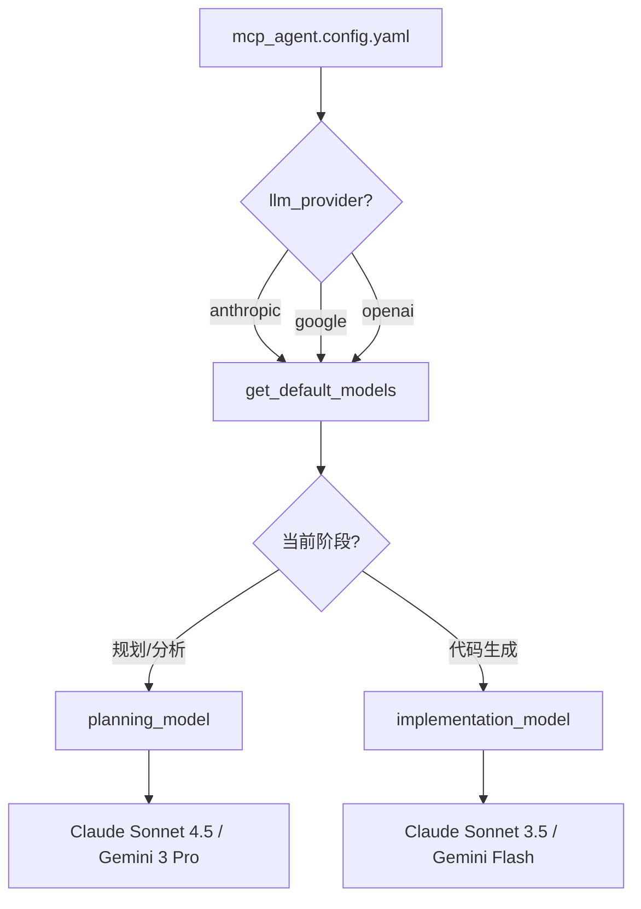
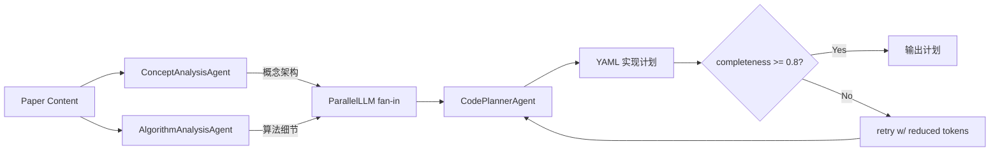
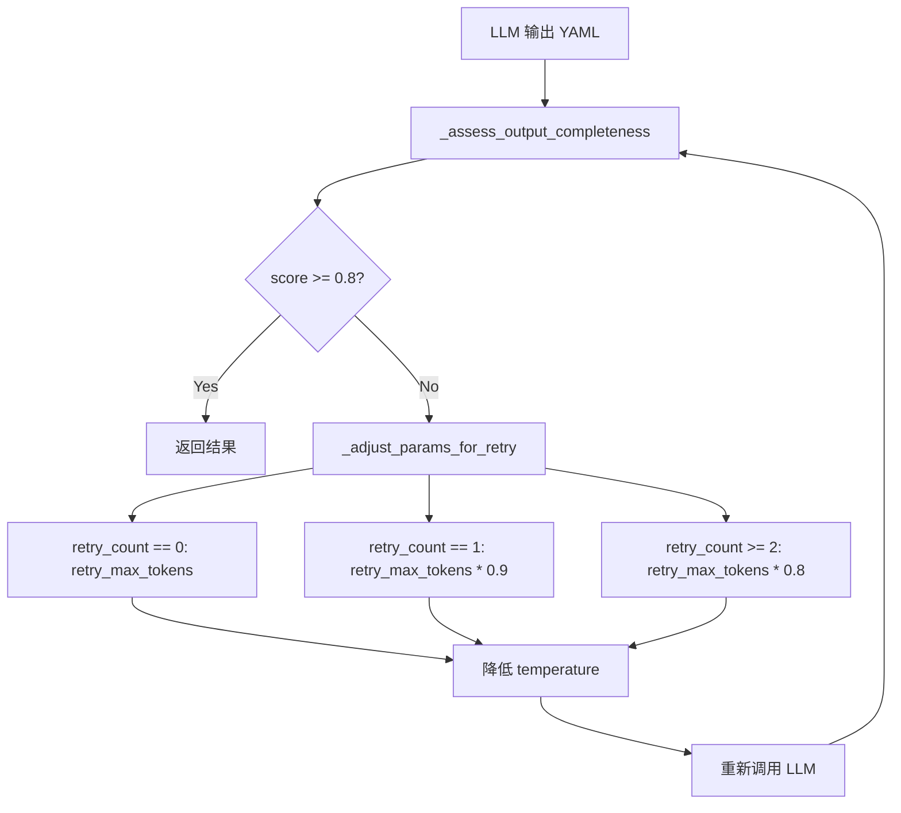

# PD-12.06 DeepCode — 分阶段模型策略与三阶段推理管道

> 文档编号：PD-12.06
> 来源：DeepCode `utils/llm_utils.py` `workflows/agent_orchestration_engine.py`
> GitHub：https://github.com/HKUDS/DeepCode.git
> 问题域：PD-12 推理增强 Reasoning Enhancement
> 状态：可复用方案

---

## 第 1 章 问题与动机（≥ 30 行）

### 1.1 核心问题

在 Research-to-Code 自动化流水线中，不同阶段对 LLM 推理能力的需求差异巨大：

- **规划阶段**（概念分析、算法提取、代码架构设计）需要深度理解和结构化推理，对模型智力要求高
- **实现阶段**（代码生成、文件写入）需要快速响应和大量 token 输出，对速度和成本敏感
- **重试阶段**（输出不完整时的补救）需要在 context window 限制内动态调整 token 分配

如果全程使用同一模型，要么规划质量不足（用了快模型），要么实现成本过高（用了强模型）。DeepCode 通过配置驱动的分阶段模型策略解决了这个矛盾。

### 1.2 DeepCode 的解法概述

1. **配置驱动的双模型分离**：每个 LLM 提供商在 `mcp_agent.config.yaml` 中配置 `planning_model` 和 `implementation_model`，规划用强模型，实现用快模型（`mcp_agent.config.yaml:114-131`）
2. **三阶段 Paper 分析管道**：ConceptAnalysis → AlgorithmAnalysis → CodePlanner，前两个 Agent 并行 fan-out，结果汇聚到 CodePlanner 做 fan-in（`agent_orchestration_engine.py:708-728`）
3. **完整性评估驱动的重试**：`_assess_output_completeness()` 对 YAML 输出做 4 维评分，不达标则触发 token 递减重试（`agent_orchestration_engine.py:68-147`）
4. **自适应 Prompt 切换**：根据文档大小自动选择 Segmented 或 Traditional 版本的 Prompt（`utils/llm_utils.py:406-437`）
5. **Token 限制的配置化管理**：`base_max_tokens` 和 `retry_max_tokens` 从配置文件读取，支持不同模型的 context window 差异（`utils/llm_utils.py:174-211`）

### 1.3 设计思想

| 设计原则 | 具体实现 | 理由 | 替代方案 |
|----------|----------|------|----------|
| 阶段感知模型选择 | config 中 planning_model / implementation_model 分离 | 规划需要智力，实现需要速度，一刀切浪费资源 | 全程用同一模型 |
| Fan-out/Fan-in 并行推理 | ParallelLLM 将概念分析和算法提取并行执行 | 两个分析维度独立，并行可减半延迟 | 串行执行三阶段 |
| 完整性驱动重试 | 4 维评分 + token 递减策略 | 模型输出可能被截断，需要检测并补救 | 固定重试次数不检查质量 |
| Prompt 自适应 | 文档 > 50K 字符用分段读取 Prompt | 大文档直接塞入会超 context window | 固定 Prompt 不区分文档大小 |

---

## 第 2 章 源码实现分析（≥ 60 行，核心章节）

### 2.1 架构概览

DeepCode 的推理增强架构分为三层：配置层（模型选择）、编排层（多 Agent 管道）、质量层（完整性评估与重试）。

```
┌─────────────────────────────────────────────────────────┐
│                  mcp_agent.config.yaml                   │
│  ┌─────────────┐  ┌──────────────┐  ┌─────────────────┐ │
│  │  anthropic   │  │    google    │  │     openai      │ │
│  │ planning:    │  │ planning:    │  │ planning:       │ │
│  │  sonnet-4.5  │  │  gemini-3-pro│  │  gemini-3-flash │ │
│  │ implement:   │  │ implement:   │  │ implement:      │ │
│  │  sonnet-3.5  │  │  gemini-flash│  │  gemini-3-flash │ │
│  └─────────────┘  └──────────────┘  └─────────────────┘ │
└────────────────────────┬────────────────────────────────┘
                         │ get_default_models()
                         ▼
┌─────────────────────────────────────────────────────────┐
│              Agent Orchestration Engine                   │
│                                                          │
│  ┌──────────────┐  ┌───────────────────┐                │
│  │ ConceptAgent │──┐                   │                │
│  │ (fan-out)    │  │  ParallelLLM      │                │
│  └──────────────┘  │  ┌─────────────┐  │                │
│  ┌──────────────┐  ├─→│ CodePlanner │  │                │
│  │AlgorithmAgent│──┘  │ (fan-in)    │  │                │
│  │ (fan-out)    │     └─────────────┘  │                │
│  └──────────────┘                      │                │
│                                        │                │
│  ┌─────────────────────────────────┐   │                │
│  │ _assess_output_completeness()   │   │                │
│  │ → score < 0.8 → retry w/ less  │   │                │
│  │   tokens + lower temperature    │   │                │
│  └─────────────────────────────────┘   │                │
└─────────────────────────────────────────────────────────┘
```

### 2.2 核心实现

#### 2.2.1 配置驱动的双模型分离



对应源码 `utils/llm_utils.py:214-268`：
```python
def get_default_models(config_path: str = "mcp_agent.config.yaml"):
    """
    Get default models from configuration file.
    Returns dict with 'anthropic', 'openai', 'google' default models,
    plus 'google_planning' and 'google_implementation' for phase-specific models
    """
    # ...
    anthropic_config = config.get("anthropic") or {}
    google_config = config.get("google") or {}

    # Phase-specific models (fall back to default if not specified)
    google_planning = google_config.get("planning_model", google_model)
    google_implementation = google_config.get("implementation_model", google_model)
    anthropic_planning = anthropic_config.get("planning_model", anthropic_model)
    anthropic_implementation = anthropic_config.get(
        "implementation_model", anthropic_model
    )

    return {
        "anthropic": anthropic_model,
        "google_planning": google_planning,
        "google_implementation": google_implementation,
        "anthropic_planning": anthropic_planning,
        "anthropic_implementation": anthropic_implementation,
        # ...
    }
```

实际使用时，编排引擎的规划阶段通过 `get_preferred_llm_class()` 获取 planning_model（`agent_orchestration_engine.py:414`），而 `CodeImplementationWorkflow` 在代码生成时显式使用 `implementation_model`（`code_implementation_workflow.py:689-693`）：

```python
# 规划阶段 — 使用 planning_model（通过 mcp_agent 框架自动路由）
analyzer = await analyzer_agent.attach_llm(get_preferred_llm_class())

# 实现阶段 — 显式使用 implementation_model
impl_model = self.default_models.get(
    "anthropic_implementation", self.default_models["anthropic"]
)
response = await client.messages.create(model=impl_model, ...)
```

#### 2.2.2 三阶段 Paper 分析管道（Fan-out/Fan-in）



对应源码 `workflows/agent_orchestration_engine.py:708-728`：
```python
concept_analysis_agent = Agent(
    name="ConceptAnalysisAgent",
    instruction=prompts["concept_analysis"],
    server_names=agent_config["concept_analysis"],
)
algorithm_analysis_agent = Agent(
    name="AlgorithmAnalysisAgent",
    instruction=prompts["algorithm_analysis"],
    server_names=agent_config["algorithm_analysis"],
)
code_planner_agent = Agent(
    name="CodePlannerAgent",
    instruction=prompts["code_planning"],
    server_names=agent_config["code_planner"],
)

code_aggregator_agent = ParallelLLM(
    fan_in_agent=code_planner_agent,
    fan_out_agents=[concept_analysis_agent, algorithm_analysis_agent],
    llm_factory=get_preferred_llm_class(),
)
```

`ParallelLLM` 是 mcp_agent 框架提供的并行编排原语：fan_out_agents 并行执行，各自输出汇聚后传给 fan_in_agent 做综合。

#### 2.2.3 完整性评估与 Token 递减重试



对应源码 `workflows/agent_orchestration_engine.py:68-147`：
```python
def _assess_output_completeness(text: str) -> float:
    """精准评估YAML格式实现计划的完整性"""
    if not text or len(text.strip()) < 500:
        return 0.0

    score = 0.0

    # 1. 检查5个必需的YAML sections (权重: 0.5)
    required_sections = [
        "file_structure:", "implementation_components:",
        "validation_approach:", "environment_setup:",
        "implementation_strategy:",
    ]
    sections_found = sum(1 for s in required_sections if s in text.lower())
    score += (sections_found / len(required_sections)) * 0.5

    # 2. YAML结构完整性 (权重: 0.2)
    has_yaml_start = any(m in text for m in ["```yaml", "complete_reproduction_plan:"])
    has_yaml_end = any(m in text[-500:] for m in ["```", "implementation_strategy:"])
    if has_yaml_start and has_yaml_end:
        score += 0.2

    # 3. 最后一行完整性 (权重: 0.15)
    # 4. 合理最小长度 (权重: 0.15)
    # ...
    return min(score, 1.0)
```

Token 递减策略 `agent_orchestration_engine.py:150-197`：
```python
def _adjust_params_for_retry(params, retry_count, config_path="mcp_agent.config.yaml"):
    """Token减少策略以适应模型context限制
    为什么要REDUCE而不是INCREASE？
    - 当遇到 "maximum context length exceeded" 错误时，
      说明 input + requested_output > context_limit
    - INCREASING max_tokens只会让问题更严重！
    - 正确做法：DECREASE output tokens，为更多input留出空间
    """
    _, retry_max_tokens = get_token_limits(config_path)

    if retry_count == 0:
        new_max_tokens = retry_max_tokens          # 第一次重试
    elif retry_count == 1:
        new_max_tokens = int(retry_max_tokens * 0.9)  # 第二次：90%
    else:
        new_max_tokens = int(retry_max_tokens * 0.8)  # 第三次：80%

    new_temperature = max(params.temperature - (retry_count * 0.15), 0.05)
    return new_max_tokens, new_temperature
```

### 2.3 实现细节

**自适应 Prompt 切换**（`utils/llm_utils.py:331-437`）：

DeepCode 根据文档大小决定使用分段读取（Segmented）还是全文读取（Traditional）的 Prompt 版本。阈值默认 50,000 字符，可通过配置调整。分段版 Prompt 指导 Agent 使用 `read_document_segments` 工具按 query_type 和 keywords 检索相关段落，避免超出 context window。

```python
def should_use_document_segmentation(document_content, config_path):
    seg_config = get_document_segmentation_config(config_path)
    if not seg_config["enabled"]:
        return False, "Document segmentation disabled"
    doc_size = len(document_content)
    threshold = seg_config["size_threshold_chars"]
    if doc_size > threshold:
        return True, f"Document size ({doc_size:,}) exceeds threshold ({threshold:,})"
    return False, f"Document size ({doc_size:,}) below threshold ({threshold:,})"
```

**多提供商 LLM 选择**（`utils/llm_utils.py:109-171`）：

`get_preferred_llm_class()` 实现了优先级链：用户偏好 → API Key 可用性 → 默认 fallback。支持 Anthropic、Google、OpenAI 三家提供商，通过懒加载避免不必要的 import。


---

## 第 3 章 迁移指南（≥ 40 行）

### 3.1 迁移清单

**Phase 1：配置驱动的双模型分离**

- [ ] 在项目配置文件中为每个 LLM 提供商添加 `planning_model` 和 `implementation_model` 字段
- [ ] 实现 `get_default_models()` 函数，解析配置并返回阶段-模型映射
- [ ] 在编排层区分规划调用和实现调用，分别使用对应模型

**Phase 2：Fan-out/Fan-in 并行推理**

- [ ] 定义多个分析 Agent（如概念分析、算法分析），各自有独立 Prompt
- [ ] 使用并行执行框架（asyncio.gather / LangGraph fan-out）并行调用
- [ ] 实现 fan-in 汇聚逻辑，将多个分析结果合并传给下游 Agent

**Phase 3：完整性评估与重试**

- [ ] 实现输出完整性评分函数（检查必需 section、结构完整性、长度等）
- [ ] 实现 token 递减重试策略（每次重试减少 output tokens）
- [ ] 设置最大重试次数和最低 temperature 阈值

### 3.2 适配代码模板

```python
"""分阶段模型策略 — 可直接复用的代码模板"""
import yaml
from dataclasses import dataclass
from typing import Dict, Optional, Tuple


@dataclass
class PhaseModelConfig:
    """阶段感知的模型配置"""
    planning_model: str
    implementation_model: str
    base_max_tokens: int = 16384
    retry_max_tokens: int = 8192


def load_phase_models(config_path: str) -> Dict[str, PhaseModelConfig]:
    """从 YAML 配置加载分阶段模型映射"""
    with open(config_path, "r") as f:
        config = yaml.safe_load(f)

    providers = {}
    for provider_name in ["anthropic", "google", "openai"]:
        provider_config = config.get(provider_name, {})
        default_model = provider_config.get("default_model", "")
        providers[provider_name] = PhaseModelConfig(
            planning_model=provider_config.get("planning_model", default_model),
            implementation_model=provider_config.get("implementation_model", default_model),
            base_max_tokens=provider_config.get("base_max_tokens", 16384),
            retry_max_tokens=provider_config.get("retry_max_tokens", 8192),
        )
    return providers


def assess_output_completeness(
    text: str,
    required_sections: list[str],
    min_length: int = 500,
) -> float:
    """通用的输出完整性评估函数

    Args:
        text: LLM 输出文本
        required_sections: 必需的 section 关键词列表
        min_length: 最小有效长度

    Returns:
        0.0-1.0 的完整性分数
    """
    if not text or len(text.strip()) < min_length:
        return 0.0

    score = 0.0
    text_lower = text.lower()

    # Section 覆盖率 (权重 0.5)
    found = sum(1 for s in required_sections if s in text_lower)
    score += (found / len(required_sections)) * 0.5

    # 结构完整性 (权重 0.3) — 检查首尾是否完整
    has_start = text.strip().startswith(("```", "#", "---"))
    last_500 = text[-500:] if len(text) > 500 else text
    has_end = any(m in last_500 for m in ["```", "---", "##"])
    if has_start and has_end:
        score += 0.3

    # 长度合理性 (权重 0.2)
    if len(text) > min_length * 3:
        score += 0.2
    elif len(text) > min_length:
        score += 0.1

    return min(score, 1.0)


def adjust_retry_params(
    retry_count: int,
    base_max_tokens: int,
    base_temperature: float = 0.7,
) -> Tuple[int, float]:
    """Token 递减重试策略

    每次重试减少 output tokens 并降低 temperature，
    为 input context 留出更多空间。

    Returns:
        (new_max_tokens, new_temperature)
    """
    reduction_factors = [1.0, 0.9, 0.8, 0.7]
    factor = reduction_factors[min(retry_count, len(reduction_factors) - 1)]
    new_tokens = int(base_max_tokens * factor)
    new_temp = max(base_temperature - (retry_count * 0.15), 0.05)
    return new_tokens, new_temp
```

### 3.3 适用场景

| 场景 | 适用度 | 说明 |
|------|--------|------|
| Research-to-Code 自动化 | ⭐⭐⭐ | DeepCode 的核心场景，规划用强模型，实现用快模型 |
| 多步骤 Agent 工作流 | ⭐⭐⭐ | 任何有"分析→规划→执行"阶段的 Agent 系统 |
| 长文档处理 | ⭐⭐ | 自适应 Prompt 切换对大文档有效，但需要分段读取工具支持 |
| 简单 Q&A 系统 | ⭐ | 单轮对话不需要分阶段模型策略 |
| 成本敏感的批量任务 | ⭐⭐⭐ | 实现阶段用便宜模型可显著降低成本 |

---

## 第 4 章 测试用例（≥ 20 行）

```python
import pytest
from unittest.mock import patch, MagicMock


class TestPhaseModelConfig:
    """测试分阶段模型配置"""

    def test_load_phase_models_with_separate_models(self, tmp_path):
        """测试配置文件中 planning 和 implementation 模型分离"""
        config_content = """
anthropic:
  default_model: claude-sonnet-4-20250514
  planning_model: claude-sonnet-4-20250514
  implementation_model: claude-3-5-sonnet-20241022
google:
  default_model: gemini-2.0-flash
  planning_model: gemini-2.5-pro-preview-05-06
  implementation_model: gemini-2.0-flash
"""
        config_file = tmp_path / "config.yaml"
        config_file.write_text(config_content)

        models = load_phase_models(str(config_file))

        assert models["anthropic"].planning_model == "claude-sonnet-4-20250514"
        assert models["anthropic"].implementation_model == "claude-3-5-sonnet-20241022"
        assert models["google"].planning_model == "gemini-2.5-pro-preview-05-06"
        assert models["google"].implementation_model == "gemini-2.0-flash"

    def test_load_phase_models_fallback_to_default(self, tmp_path):
        """测试未指定阶段模型时回退到 default_model"""
        config_content = """
anthropic:
  default_model: claude-sonnet-4-20250514
"""
        config_file = tmp_path / "config.yaml"
        config_file.write_text(config_content)

        models = load_phase_models(str(config_file))
        assert models["anthropic"].planning_model == "claude-sonnet-4-20250514"
        assert models["anthropic"].implementation_model == "claude-sonnet-4-20250514"


class TestOutputCompleteness:
    """测试输出完整性评估"""

    def test_empty_output_returns_zero(self):
        assert assess_output_completeness("", ["section1:"]) == 0.0

    def test_short_output_returns_zero(self):
        assert assess_output_completeness("short", ["section1:"], min_length=100) == 0.0

    def test_complete_output_scores_high(self):
        text = "```yaml\n" + "section1: value\n" * 200 + "```"
        score = assess_output_completeness(text, ["section1:"], min_length=100)
        assert score >= 0.8

    def test_missing_sections_reduce_score(self):
        text = "```yaml\n" + "other_content: value\n" * 200 + "```"
        score = assess_output_completeness(
            text, ["section1:", "section2:", "section3:"], min_length=100
        )
        assert score < 0.8


class TestRetryParams:
    """测试 Token 递减重试策略"""

    def test_first_retry_uses_full_tokens(self):
        tokens, temp = adjust_retry_params(0, 8192, 0.7)
        assert tokens == 8192
        assert temp == 0.7

    def test_second_retry_reduces_tokens(self):
        tokens, temp = adjust_retry_params(1, 8192, 0.7)
        assert tokens == int(8192 * 0.9)
        assert abs(temp - 0.55) < 0.01

    def test_third_retry_reduces_more(self):
        tokens, temp = adjust_retry_params(2, 8192, 0.7)
        assert tokens == int(8192 * 0.8)
        assert abs(temp - 0.40) < 0.01

    def test_temperature_never_below_minimum(self):
        _, temp = adjust_retry_params(10, 8192, 0.7)
        assert temp >= 0.05
```


---

## 第 5 章 跨域关联

| 关联域 | 关系类型 | 说明 |
|--------|----------|------|
| PD-01 上下文管理 | 依赖 | Token 递减重试策略本质是 context window 管理的一部分；自适应 Prompt 切换也是为了避免超出 context 限制 |
| PD-02 多 Agent 编排 | 协同 | Fan-out/Fan-in 并行推理依赖 ParallelLLM 编排原语；三阶段管道本身就是多 Agent 编排的实例 |
| PD-03 容错与重试 | 协同 | 完整性评估驱动的重试是容错机制的推理增强特化版；token 递减策略是重试策略的具体实现 |
| PD-04 工具系统 | 依赖 | 分段读取 Prompt 依赖 `read_document_segments` 工具；MCP 工具系统是 Agent 执行的基础 |
| PD-07 质量检查 | 协同 | `_assess_output_completeness()` 是质量检查在推理输出层面的应用 |
| PD-11 可观测性 | 协同 | 分阶段模型策略天然支持按阶段统计成本，planning vs implementation 的 token 消耗可分别追踪 |

---

## 第 6 章 来源文件索引

| 文件 | 行范围 | 关键实现 |
|------|--------|----------|
| `utils/llm_utils.py` | L109-171 | `get_preferred_llm_class()` — 多提供商 LLM 选择与优先级链 |
| `utils/llm_utils.py` | L174-211 | `get_token_limits()` — 从配置读取 base/retry token 限制 |
| `utils/llm_utils.py` | L214-293 | `get_default_models()` — 解析 planning/implementation 模型映射 |
| `utils/llm_utils.py` | L331-437 | `should_use_document_segmentation()` — 自适应 Prompt 切换逻辑 |
| `workflows/agent_orchestration_engine.py` | L68-147 | `_assess_output_completeness()` — 4 维 YAML 完整性评分 |
| `workflows/agent_orchestration_engine.py` | L150-197 | `_adjust_params_for_retry()` — Token 递减重试策略 |
| `workflows/agent_orchestration_engine.py` | L708-728 | ParallelLLM fan-out/fan-in 三阶段管道构建 |
| `workflows/code_implementation_workflow.py` | L689-693 | 实现阶段显式使用 `implementation_model` |
| `mcp_agent.config.yaml` | L106-131 | 各提供商 planning_model / implementation_model 配置 |

---

## 第 7 章 横向对比维度

> **重要：** 本章用于自动填充 Butcher Wiki 的横向对比表。
> 必须严格按以下 JSON 格式输出，放在 `comparison_data` 代码块中。

```json comparison_data
{
  "project": "DeepCode",
  "dimensions": {
    "推理方式": "三阶段管道：概念分析→算法提取→代码规划，Fan-out/Fan-in 并行",
    "模型策略": "配置驱动双模型分离：planning_model 用强模型，implementation_model 用快模型",
    "成本": "规划阶段用 Sonnet 4.5/Gemini Pro，实现阶段用 Sonnet 3.5/Gemini Flash，按阶段优化",
    "适用场景": "Research-to-Code 自动化，论文→可运行代码的全流程",
    "推理模式": "ParallelLLM 并行推理 + 完整性评估驱动重试",
    "输出结构": "YAML 格式实现计划，含 file_structure/components/validation 等 5 个必需 section",
    "增强策略": "自适应 Prompt 切换（文档 >50K 字符用分段读取）+ Token 递减重试",
    "成本控制": "Token 递减策略：重试时逐步减少 output tokens（100%→90%→80%），为 input 留空间",
    "思考预算": "base_max_tokens 和 retry_max_tokens 从配置文件读取，支持按模型差异化设置"
  }
}
```

### 域元数据补充

```json domain_metadata
{
  "solution_summary": "DeepCode 用配置驱动的 planning_model/implementation_model 双模型分离 + ParallelLLM Fan-out/Fan-in 三阶段论文分析管道实现推理增强",
  "description": "分阶段模型选择与并行推理管道可显著降低 Research-to-Code 场景的成本与延迟",
  "sub_problems": [
    "输出完整性评估：对 LLM 结构化输出做多维评分，检测截断和缺失",
    "Token 递减重试：context 超限时减少 output tokens 而非增加，为 input 留空间"
  ],
  "best_practices": [
    "配置驱动模型分离：规划和实现阶段的模型选择应可独立配置，不硬编码",
    "Fan-out/Fan-in 并行分析：独立的分析维度应并行执行，结果汇聚到下游 Agent"
  ]
}
```

