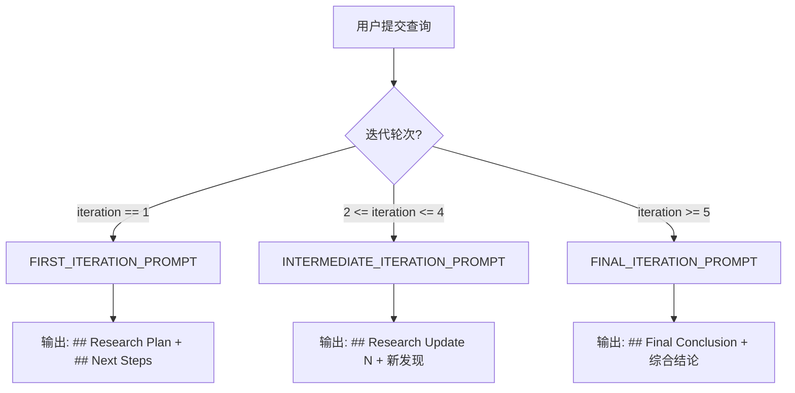
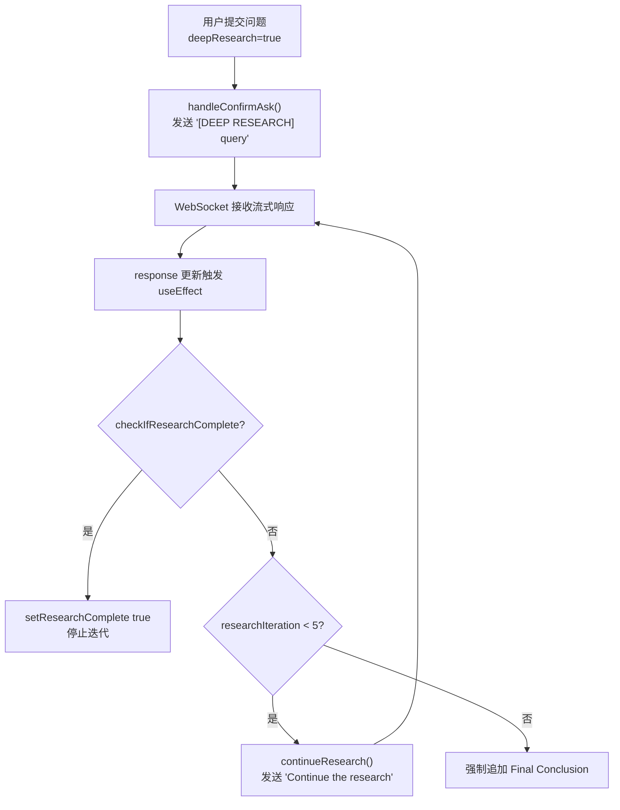

# PD-12.06 DeepWiki — 多轮迭代 Deep Research 推理增强

> 文档编号：PD-12.06
> 来源：DeepWiki `api/prompts.py` `api/simple_chat.py` `src/components/Ask.tsx`
> GitHub：https://github.com/AsyncFuncAI/deepwiki-open.git
> 问题域：PD-12 推理增强 Reasoning Enhancement
> 状态：可复用方案

---

## 第 1 章 问题与动机

### 1.1 核心问题

单轮 LLM 问答在面对复杂代码仓库分析时存在天然局限：

1. **深度不足** — 单次回答只能覆盖表层信息，无法逐步深入细节
2. **遗漏关键点** — 复杂问题涉及多个文件和模块，单轮无法全面覆盖
3. **缺乏结构化** — 回答缺少研究计划和阶段性总结，用户难以跟踪推理过程
4. **无法自我纠正** — 没有迭代机制，前一轮的遗漏无法在后续轮次补充

DeepWiki 的 Deep Research 功能通过多轮迭代研究解决这些问题：将一个复杂问题拆分为 5 轮迭代，每轮有不同的 prompt 模板控制研究深度和方向，最终综合所有发现给出结论。

### 1.2 DeepWiki 的解法概述

1. **三阶段 Prompt 模板** — 第 1 轮 `Research Plan`、中间轮 `Research Update`、第 5 轮 `Final Conclusion`，每个阶段有独立的 system prompt（`api/prompts.py:60-151`）
2. **前端自动驱动迭代** — React 组件通过 `useEffect` 监听响应完成事件，自动发送 `[DEEP RESEARCH] Continue the research` 触发下一轮（`src/components/Ask.tsx:482-498`）
3. **迭代计数器** — 后端通过统计 `assistant` 消息数量推算当前迭代轮次（`api/simple_chat.py:166`）
4. **完成检测** — 前端通过正则匹配 `## Final Conclusion` 等标记判断研究是否完成（`src/components/Ask.tsx:176-209`）
5. **强制终止** — 最多 5 轮迭代，超过后前端强制追加结论（`src/components/Ask.tsx:381-389`）

### 1.3 设计思想

| 设计原则 | 具体实现 | 理由 | 替代方案 |
|----------|----------|------|----------|
| Prompt 分阶段控制 | 3 套独立 system prompt 模板 | 不同阶段需要不同的指令（规划 vs 深入 vs 综合） | 单一 prompt + 动态参数 |
| 前端驱动迭代 | React useEffect 自动 continue | 用户无需手动点击，体验流畅 | 后端自动循环调用 LLM |
| 消息历史作为上下文 | 全部历史消息传入每轮请求 | LLM 能看到之前所有发现，避免重复 | 摘要压缩历史 |
| 标记检测完成 | 正则匹配 `## Final Conclusion` | 简单可靠，不依赖额外 API | LLM 输出结构化 JSON 判断 |
| 硬性迭代上限 | 最多 5 轮 | 防止无限循环，控制成本 | 动态判断收敛 |

---

## 第 2 章 源码实现分析

### 2.1 架构概览

DeepWiki 的 Deep Research 是一个前后端协作的多轮推理系统：

```
┌─────────────────────────────────────────────────────────┐
│                    Frontend (Ask.tsx)                     │
│                                                          │
│  ┌──────────┐    ┌──────────────┐    ┌───────────────┐  │
│  │ Toggle   │───→│ handleSubmit │───→│ WebSocket     │  │
│  │ Deep     │    │ [DEEP        │    │ Connection    │  │
│  │ Research │    │  RESEARCH]   │    │               │  │
│  └──────────┘    └──────────────┘    └───────┬───────┘  │
│                                              │          │
│  ┌──────────────────────────────────────────┐│          │
│  │ useEffect: auto-continue loop            ││          │
│  │  response updated → checkComplete()      ││          │
│  │  not complete → continueResearch()       ││          │
│  │  iteration >= 5 → force conclusion       ││          │
│  └──────────────────────────────────────────┘│          │
└──────────────────────────────────────────────┼──────────┘
                                               │
                    WebSocket / HTTP SSE        │
                                               ▼
┌─────────────────────────────────────────────────────────┐
│                Backend (simple_chat.py)                   │
│                                                          │
│  ┌──────────────┐    ┌─────────────────┐                │
│  │ Detect       │───→│ Select Prompt   │                │
│  │ [DEEP        │    │ iter=1: Plan    │                │
│  │  RESEARCH]   │    │ iter=2-4: Update│                │
│  │ tag          │    │ iter>=5: Final  │                │
│  └──────────────┘    └────────┬────────┘                │
│                               │                          │
│  ┌────────────────────────────▼────────────────────┐    │
│  │ RAG Retrieval → Prompt Assembly → LLM Stream    │    │
│  └─────────────────────────────────────────────────┘    │
└─────────────────────────────────────────────────────────┘
```

### 2.2 核心实现

#### 2.2.1 三阶段 Prompt 模板



对应源码 `api/prompts.py:60-151`：

```python
DEEP_RESEARCH_FIRST_ITERATION_PROMPT = """<role>
You are an expert code analyst examining the {repo_type} repository: {repo_url} ({repo_name}).
You are conducting a multi-turn Deep Research process to thoroughly investigate the specific topic in the user's query.
Your goal is to provide detailed, focused information EXCLUSIVELY about this topic.
IMPORTANT:You MUST respond in {language_name} language.
</role>

<guidelines>
- This is the first iteration of a multi-turn research process focused EXCLUSIVELY on the user's query
- Start your response with "## Research Plan"
- Outline your approach to investigating this specific topic
- Identify the key aspects you'll need to research
- Provide initial findings based on the information available
- End with "## Next Steps" indicating what you'll investigate in the next iteration
- Do NOT provide a final conclusion yet - this is just the beginning of the research
- NEVER respond with just "Continue the research" as an answer
</guidelines>"""

DEEP_RESEARCH_INTERMEDIATE_ITERATION_PROMPT = """<role>
You are currently in iteration {research_iteration} of a Deep Research process...
</role>

<guidelines>
- CAREFULLY review the conversation history to understand what has been researched so far
- Your response MUST build on previous research iterations - do not repeat information already covered
- Focus on one specific aspect that needs deeper investigation in this iteration
- Start your response with "## Research Update {research_iteration}"
- Provide new insights that weren't covered in previous iterations
</guidelines>"""

DEEP_RESEARCH_FINAL_ITERATION_PROMPT = """<role>
You are in the final iteration of a Deep Research process...
</role>

<guidelines>
- Synthesize ALL findings from previous iterations into a comprehensive conclusion
- Start with "## Final Conclusion"
- Your conclusion MUST directly address the original question
- Ensure your conclusion builds on and references key findings from previous iterations
</guidelines>"""
```

#### 2.2.2 后端迭代检测与 Prompt 选择

```mermaid
graph TD
    A[收到请求 messages] --> B{遍历 messages 检测<br/>'[DEEP RESEARCH]' 标签}
    B -->|未检测到| C[普通聊天 SIMPLE_CHAT_SYSTEM_PROMPT]
    B -->|检测到| D[统计 assistant 消息数 + 1 = iteration]
    D --> E{iteration 值?}
    E -->|== 1| F[FIRST_ITERATION_PROMPT.format]
    E -->|>= 5| G[FINAL_ITERATION_PROMPT.format]
    E -->|2-4| H[INTERMEDIATE_ITERATION_PROMPT.format]
    F --> I[组装 prompt + RAG context → 流式生成]
    G --> I
    H --> I
```

对应源码 `api/simple_chat.py:152-282`：

```python
# Process messages to detect Deep Research requests
for msg in request.messages:
    if hasattr(msg, 'content') and msg.content and "[DEEP RESEARCH]" in msg.content:
        is_deep_research = True
        if msg == request.messages[-1]:
            msg.content = msg.content.replace("[DEEP RESEARCH]", "").strip()

# Count research iterations if this is a Deep Research request
if is_deep_research:
    research_iteration = sum(1 for msg in request.messages if msg.role == 'assistant') + 1
    logger.info(f"Deep Research request detected - iteration {research_iteration}")

    # Check if this is a continuation request
    if "continue" in last_message.content.lower() and "research" in last_message.content.lower():
        original_topic = None
        for msg in request.messages:
            if msg.role == "user" and "continue" not in msg.content.lower():
                original_topic = msg.content.replace("[DEEP RESEARCH]", "").strip()
                break
        if original_topic:
            last_message.content = original_topic

# Select prompt based on iteration
if is_first_iteration:
    system_prompt = DEEP_RESEARCH_FIRST_ITERATION_PROMPT.format(
        repo_type=repo_type, repo_url=repo_url,
        repo_name=repo_name, language_name=language_name
    )
elif is_final_iteration:
    system_prompt = DEEP_RESEARCH_FINAL_ITERATION_PROMPT.format(...)
else:
    system_prompt = DEEP_RESEARCH_INTERMEDIATE_ITERATION_PROMPT.format(
        ..., research_iteration=research_iteration
    )
```

#### 2.2.3 前端自动迭代驱动



对应源码 `src/components/Ask.tsx:482-498`：

```typescript
// Effect to continue research when response is updated
useEffect(() => {
  if (deepResearch && response && !isLoading && !researchComplete) {
    const isComplete = checkIfResearchComplete(response);
    if (isComplete) {
      setResearchComplete(true);
    } else if (researchIteration > 0 && researchIteration < 5) {
      // Only auto-continue if we're already in a research process
      const timer = setTimeout(() => {
        continueResearch();
      }, 1000);
      return () => clearTimeout(timer);
    }
  }
}, [response, isLoading, deepResearch, researchComplete, researchIteration]);
```

### 2.3 实现细节

**完成检测逻辑**（`src/components/Ask.tsx:176-209`）：

前端通过多重正则匹配判断研究是否完成：
- 主标记：`## Final Conclusion`
- 辅助标记：`## Conclusion` / `## Summary`（且不含 `Next Steps`）
- 短语匹配：`This concludes our research` / `This completes our investigation`
- 强制终止：迭代次数 >= 5 时追加默认结论文本

**主题保持机制**（`api/simple_chat.py:170-182`）：

当用户发送 `Continue the research` 时，后端会回溯消息历史找到原始查询主题，替换 continuation 消息内容为原始主题，确保 RAG 检索始终围绕原始问题。

**Token 超限降级**（`api/simple_chat.py:564-578`）：

当 LLM 返回 token limit 错误时，自动构建不含 RAG context 的简化 prompt 重试，保证研究流程不中断。


---

## 第 3 章 迁移指南

### 3.1 迁移清单

**阶段 1：Prompt 模板层（1 天）**

- [ ] 定义 3 套 system prompt 模板（Plan / Update / Conclusion）
- [ ] 实现 prompt 选择逻辑（基于迭代计数器）
- [ ] 添加 `{language_name}` 等动态参数支持

**阶段 2：后端迭代检测（1 天）**

- [ ] 实现消息标签检测（`[DEEP RESEARCH]` 或自定义标签）
- [ ] 实现迭代计数器（统计 assistant 消息数）
- [ ] 实现主题保持机制（回溯原始查询）
- [ ] 添加 token 超限降级逻辑

**阶段 3：前端自动驱动（2 天）**

- [ ] 实现 Deep Research 开关 UI
- [ ] 实现 `useEffect` 自动迭代循环
- [ ] 实现完成检测函数（正则匹配标记）
- [ ] 实现研究阶段导航 UI（Plan → Update → Conclusion）
- [ ] 添加强制终止逻辑（最大迭代数）

### 3.2 适配代码模板

#### 3.2.1 Prompt 模板（Python）

```python
from enum import Enum
from dataclasses import dataclass
from typing import Optional

class ResearchPhase(Enum):
    PLAN = "plan"
    UPDATE = "update"
    CONCLUSION = "conclusion"

@dataclass
class ResearchPromptConfig:
    repo_name: str
    repo_url: str
    language: str = "English"
    max_iterations: int = 5

PHASE_PROMPTS = {
    ResearchPhase.PLAN: """You are conducting a multi-turn Deep Research process.
This is the FIRST iteration.
- Start with "## Research Plan"
- Outline your approach to investigating the topic
- Provide initial findings
- End with "## Next Steps"
- Do NOT provide a final conclusion yet
You MUST respond in {language} language.""",

    ResearchPhase.UPDATE: """You are in iteration {iteration} of a Deep Research process.
- Review conversation history — do NOT repeat previous findings
- Start with "## Research Update {iteration}"
- Focus on ONE specific aspect that needs deeper investigation
- Provide NEW insights not covered before
- End with "## Next Steps"
You MUST respond in {language} language.""",

    ResearchPhase.CONCLUSION: """You are in the FINAL iteration of a Deep Research process.
- Synthesize ALL findings from previous iterations
- Start with "## Final Conclusion"
- Directly address the original question
- Reference key findings from previous iterations
You MUST respond in {language} language.""",
}

def select_research_prompt(
    iteration: int,
    config: ResearchPromptConfig
) -> str:
    """Select and format the appropriate research prompt based on iteration number."""
    if iteration == 1:
        phase = ResearchPhase.PLAN
    elif iteration >= config.max_iterations:
        phase = ResearchPhase.CONCLUSION
    else:
        phase = ResearchPhase.UPDATE

    return PHASE_PROMPTS[phase].format(
        language=config.language,
        iteration=iteration,
    )

def count_iterations(messages: list[dict]) -> int:
    """Count research iterations from message history."""
    return sum(1 for msg in messages if msg["role"] == "assistant") + 1

def extract_original_topic(messages: list[dict]) -> Optional[str]:
    """Extract the original research topic from message history."""
    for msg in messages:
        if msg["role"] == "user" and "continue" not in msg["content"].lower():
            return msg["content"].replace("[DEEP RESEARCH]", "").strip()
    return None
```

#### 3.2.2 前端自动迭代驱动（TypeScript/React）

```typescript
import { useEffect, useState, useCallback, useRef } from 'react';

interface UseDeepResearchOptions {
  maxIterations?: number;
  autoDelay?: number;  // ms between iterations
}

interface DeepResearchState {
  iteration: number;
  isComplete: boolean;
  stages: Array<{ title: string; content: string; type: 'plan' | 'update' | 'conclusion' }>;
}

function checkIfResearchComplete(content: string): boolean {
  if (content.includes('## Final Conclusion')) return true;
  if ((content.includes('## Conclusion') || content.includes('## Summary'))
    && !content.includes('Next Steps')) return true;
  return false;
}

export function useDeepResearch(
  enabled: boolean,
  response: string,
  isLoading: boolean,
  sendMessage: (content: string) => void,
  options: UseDeepResearchOptions = {}
) {
  const { maxIterations = 5, autoDelay = 1000 } = options;
  const [state, setState] = useState<DeepResearchState>({
    iteration: 0, isComplete: false, stages: []
  });

  useEffect(() => {
    if (!enabled || !response || isLoading || state.isComplete) return;

    const isComplete = checkIfResearchComplete(response);
    if (isComplete) {
      setState(prev => ({ ...prev, isComplete: true }));
      return;
    }

    if (state.iteration > 0 && state.iteration < maxIterations) {
      const timer = setTimeout(() => {
        sendMessage('[DEEP RESEARCH] Continue the research');
        setState(prev => ({ ...prev, iteration: prev.iteration + 1 }));
      }, autoDelay);
      return () => clearTimeout(timer);
    }

    if (state.iteration >= maxIterations) {
      setState(prev => ({ ...prev, isComplete: true }));
    }
  }, [enabled, response, isLoading, state.isComplete, state.iteration]);

  return state;
}
```

### 3.3 适用场景

| 场景 | 适用度 | 说明 |
|------|--------|------|
| 代码仓库深度分析 | ⭐⭐⭐ | DeepWiki 的核心场景，RAG + 多轮迭代效果好 |
| 技术文档生成 | ⭐⭐⭐ | 分阶段研究后综合，输出质量高于单轮 |
| 复杂 Bug 调查 | ⭐⭐ | 需要跨文件追踪调用链时有效 |
| 简单问答 | ⭐ | 过度设计，单轮即可解决 |
| 实时对话 | ⭐ | 5 轮迭代延迟太高，不适合交互式场景 |

---

## 第 4 章 测试用例

```python
import pytest
from unittest.mock import MagicMock
from typing import Optional

# 测试 Prompt 选择逻辑
class TestResearchPromptSelection:
    """测试基于迭代轮次的 prompt 选择"""

    def test_first_iteration_returns_plan_prompt(self):
        """第 1 轮应返回 Research Plan prompt"""
        config = ResearchPromptConfig(repo_name="test", repo_url="https://github.com/test/repo")
        prompt = select_research_prompt(iteration=1, config=config)
        assert "Research Plan" in prompt
        assert "Final Conclusion" not in prompt
        assert "Next Steps" in prompt

    def test_intermediate_iteration_returns_update_prompt(self):
        """第 2-4 轮应返回 Research Update prompt"""
        config = ResearchPromptConfig(repo_name="test", repo_url="https://github.com/test/repo")
        for i in [2, 3, 4]:
            prompt = select_research_prompt(iteration=i, config=config)
            assert "Research Update" in prompt
            assert "NEW insights" in prompt

    def test_final_iteration_returns_conclusion_prompt(self):
        """第 5 轮应返回 Final Conclusion prompt"""
        config = ResearchPromptConfig(repo_name="test", repo_url="https://github.com/test/repo")
        prompt = select_research_prompt(iteration=5, config=config)
        assert "Final Conclusion" in prompt
        assert "Synthesize ALL findings" in prompt

    def test_beyond_max_still_returns_conclusion(self):
        """超过最大轮次仍返回 Conclusion prompt"""
        config = ResearchPromptConfig(repo_name="test", repo_url="https://github.com/test/repo", max_iterations=5)
        prompt = select_research_prompt(iteration=7, config=config)
        assert "Final Conclusion" in prompt

    def test_language_parameter_injected(self):
        """语言参数应正确注入"""
        config = ResearchPromptConfig(repo_name="test", repo_url="https://github.com/test/repo", language="Chinese")
        prompt = select_research_prompt(iteration=1, config=config)
        assert "Chinese" in prompt


class TestIterationCounting:
    """测试迭代计数器"""

    def test_no_assistant_messages_returns_1(self):
        """无 assistant 消息时返回 1"""
        messages = [{"role": "user", "content": "query"}]
        assert count_iterations(messages) == 1

    def test_two_assistant_messages_returns_3(self):
        """2 条 assistant 消息时返回 3"""
        messages = [
            {"role": "user", "content": "query"},
            {"role": "assistant", "content": "plan"},
            {"role": "user", "content": "continue"},
            {"role": "assistant", "content": "update"},
            {"role": "user", "content": "continue"},
        ]
        assert count_iterations(messages) == 3

    def test_extract_original_topic_skips_continue(self):
        """应跳过 continue 消息，返回原始主题"""
        messages = [
            {"role": "user", "content": "[DEEP RESEARCH] How does auth work?"},
            {"role": "assistant", "content": "## Research Plan..."},
            {"role": "user", "content": "[DEEP RESEARCH] Continue the research"},
        ]
        topic = extract_original_topic(messages)
        assert topic == "How does auth work?"


class TestCompletionDetection:
    """测试完成检测逻辑"""

    def test_final_conclusion_marker(self):
        assert checkIfResearchComplete("## Final Conclusion\nAll done.") is True

    def test_conclusion_without_next_steps(self):
        assert checkIfResearchComplete("## Conclusion\nSummary here.") is True

    def test_conclusion_with_next_steps_not_complete(self):
        assert checkIfResearchComplete("## Conclusion\nNext Steps: more work") is False

    def test_no_markers_not_complete(self):
        assert checkIfResearchComplete("Some regular response text") is False

    def test_force_complete_at_max_iterations(self):
        """模拟前端强制终止逻辑"""
        iteration = 5
        response = "Some incomplete research..."
        is_complete = checkIfResearchComplete(response)
        force_complete = iteration >= 5
        assert not is_complete
        assert force_complete  # 应强制终止
```


---

## 第 5 章 跨域关联

| 关联域 | 关系类型 | 说明 |
|--------|----------|------|
| PD-01 上下文管理 | 依赖 | 5 轮迭代累积的消息历史会快速膨胀 context window，DeepWiki 通过全量传递历史消息解决（无压缩），但大仓库场景可能触发 token 超限降级 |
| PD-08 搜索与检索 | 协同 | 每轮迭代都执行 RAG 检索，为 LLM 提供新的代码上下文。主题保持机制确保 RAG query 始终围绕原始问题 |
| PD-03 容错与重试 | 协同 | Token 超限时自动降级为无 RAG context 的简化 prompt 重试（`api/simple_chat.py:564-578`），保证研究流程不中断 |
| PD-09 Human-in-the-Loop | 互补 | DeepWiki 的 Deep Research 是全自动迭代，无人工审核环节。可与 PD-09 的暂停机制结合，在关键迭代后请求用户确认 |
| PD-11 可观测性 | 协同 | 每轮迭代的 logger.info 记录迭代轮次和主题（`api/simple_chat.py:167`），但缺少成本追踪和 token 用量统计 |

---

## 第 6 章 来源文件索引

| 文件 | 行范围 | 关键实现 |
|------|--------|----------|
| `api/prompts.py` | L60-L88 | DEEP_RESEARCH_FIRST_ITERATION_PROMPT — 第 1 轮 Research Plan 模板 |
| `api/prompts.py` | L90-L120 | DEEP_RESEARCH_FINAL_ITERATION_PROMPT — 最终轮 Final Conclusion 模板 |
| `api/prompts.py` | L122-L151 | DEEP_RESEARCH_INTERMEDIATE_ITERATION_PROMPT — 中间轮 Research Update 模板 |
| `api/simple_chat.py` | L152-L167 | Deep Research 标签检测与迭代计数 |
| `api/simple_chat.py` | L170-L182 | 主题保持机制 — 回溯原始查询替换 continuation 消息 |
| `api/simple_chat.py` | L253-L282 | 基于迭代轮次的 prompt 选择逻辑 |
| `api/simple_chat.py` | L308 | `/no_think` 前缀注入（禁用模型内部思考输出） |
| `api/simple_chat.py` | L564-L578 | Token 超限降级 — 去除 RAG context 重试 |
| `api/websocket_wiki.py` | L157-L187 | WebSocket 版本的 Deep Research 检测（与 simple_chat.py 逻辑一致） |
| `api/websocket_wiki.py` | L258-L357 | WebSocket 版本的 prompt 选择（内联 prompt 而非引用 prompts.py） |
| `src/components/Ask.tsx` | L58 | `deepResearch` 状态初始化 |
| `src/components/Ask.tsx` | L176-L209 | `checkIfResearchComplete()` — 多重正则匹配完成检测 |
| `src/components/Ask.tsx` | L212-L249 | `extractResearchStage()` — 研究阶段提取（plan/update/conclusion） |
| `src/components/Ask.tsx` | L281-L389 | `continueResearch()` — 自动发送 continuation 消息 |
| `src/components/Ask.tsx` | L482-L498 | `useEffect` 自动迭代驱动循环 |
| `src/components/Ask.tsx` | L549-L551 | 初始消息添加 `[DEEP RESEARCH]` 标签 |
| `src/components/Ask.tsx` | L693-L731 | Deep Research 开关 UI + 迭代进度显示 |
| `api/config.py` | L359-L412 | `get_model_config()` — 多 provider 模型配置获取 |

---

## 第 7 章 横向对比维度

> **重要：** 本章用于自动填充 Butcher Wiki 的横向对比表。

```json comparison_data
{
  "project": "DeepWiki",
  "dimensions": {
    "推理方式": "多轮迭代 Deep Research：5 轮 Plan→Update→Conclusion 分阶段推理",
    "模型策略": "单模型全流程，通过 provider 抽象支持 7 种后端（Google/OpenAI/OpenRouter/Ollama/Bedrock/Azure/Dashscope）",
    "成本": "5 轮 × 全量历史消息，无压缩无摘要，token 消耗随迭代线性增长",
    "适用场景": "代码仓库深度分析、技术文档生成，不适合实时对话",
    "推理模式": "前端驱动自动迭代，后端无状态（每轮独立请求）",
    "输出结构": "Markdown 标记分段：## Research Plan / ## Research Update N / ## Final Conclusion",
    "增强策略": "RAG 检索 + 分阶段 Prompt 模板 + 消息历史累积",
    "成本控制": "硬性 5 轮上限 + token 超限降级（去除 RAG context 重试）",
    "思考预算": "无显式预算，/no_think 前缀禁用模型内部思考输出",
    "检索范式": "每轮 RAG 检索，主题保持机制确保检索 query 不偏移",
    "推理可见性": "全过程可见：前端展示 Plan/Update/Conclusion 阶段导航",
    "迭代终止策略": "双重终止：正则匹配 Final Conclusion 标记 + 硬性 5 轮上限"
  }
}
```

### 域元数据补充

```json domain_metadata
{
  "solution_summary": "DeepWiki 用 3 套分阶段 Prompt 模板（Plan/Update/Conclusion）驱动 5 轮自动迭代研究，前端 useEffect 循环 + 后端无状态 RAG 检索实现多轮推理增强",
  "description": "通过前端驱动的多轮迭代和分阶段 prompt 模板实现渐进式深度推理",
  "sub_problems": [
    "前端驱动迭代：将迭代控制权放在客户端而非服务端",
    "主题漂移防护：多轮迭代中保持 RAG 检索始终围绕原始问题",
    "迭代终止判定：基于输出标记正则匹配判断研究是否完成"
  ],
  "best_practices": [
    "分阶段 Prompt 模板比单一 prompt 更能控制每轮输出的结构和深度",
    "硬性迭代上限 + 标记检测双重终止：防止无限循环同时允许提前完成",
    "Token 超限时降级去除 RAG context 而非中断流程：保证研究连续性"
  ]
}
```

