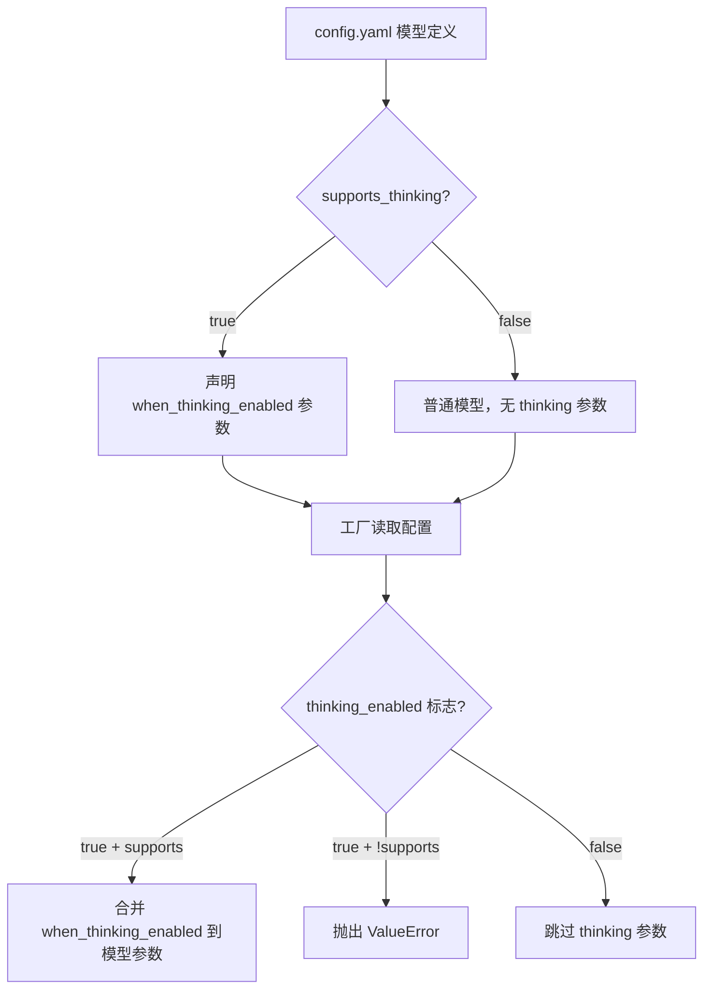
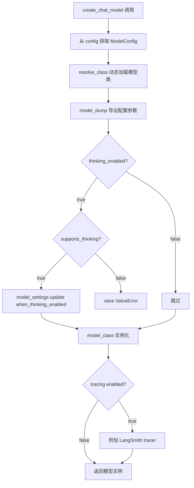

# PD-12.NN DeerFlow — 四模式推理增强与 Thinking 动态切换

> 文档编号：PD-12.NN
> 来源：DeerFlow `backend/src/config/model_config.py` `backend/src/models/factory.py` `backend/src/agents/lead_agent/`
> GitHub：https://github.com/bytedance/deer-flow.git
> 问题域：PD-12 推理增强 Reasoning Enhancement
> 状态：可复用方案

---

## 第 1 章 问题与动机

### 1.1 核心问题

推理增强（Reasoning Enhancement）的核心挑战在于：不同任务对推理深度的需求差异巨大。简单问答只需快速响应，而复杂分析需要模型深度思考。如果一刀切地启用 extended thinking，会导致：

1. **成本浪费**：简单任务消耗大量 thinking token，ROI 极低
2. **延迟膨胀**：thinking 模式下响应时间显著增加，影响用户体验
3. **供应商锁定**：不同模型的 thinking API 参数格式不同（DeepSeek 用 `extra_body.thinking.type`，Claude 用 `thinking.budget_tokens`），硬编码会导致供应商切换困难
4. **多轮对话兼容**：部分推理模型（如 DeepSeek）要求多轮对话中所有 assistant 消息都携带 `reasoning_content`，否则 API 报错

### 1.2 DeerFlow 的解法概述

DeerFlow 2.0 采用**四模式前端驱动 + 配置声明式 thinking 参数 + 工厂动态注入**的三层架构：

1. **前端四模式选择器**（`frontend/src/core/settings/local.ts:26`）：用户在 flash / thinking / pro / ultra 四种模式间切换，前端将 mode 映射为 `thinking_enabled` + `is_plan_mode` + `subagent_enabled` 三个布尔标志
2. **配置声明式 thinking 参数**（`backend/src/config/model_config.py:16-20`）：`ModelConfig` 用 `supports_thinking` 声明能力，`when_thinking_enabled` 声明启用时的额外参数，与模型实现解耦
3. **工厂动态注入**（`backend/src/models/factory.py:37-40`）：`create_chat_model` 根据 `thinking_enabled` 标志决定是否将 `when_thinking_enabled` 参数合并到模型配置中
4. **子 Agent 推理降级**（`backend/src/subagents/executor.py:166`）：子 Agent 强制 `thinking_enabled=False`，避免嵌套推理的 token 爆炸
5. **PatchedChatDeepSeek**（`backend/src/models/patched_deepseek.py:17-65`）：修补 DeepSeek 多轮对话中 `reasoning_content` 丢失问题

### 1.3 设计思想

| 设计原则 | 具体实现 | 理由 | 替代方案 |
|----------|----------|------|----------|
| 用户驱动推理级别 | 前端 4 模式选择器（flash/thinking/pro/ultra） | 用户最了解任务复杂度，比自动判断更准确 | LLM 自动判断复杂度（延迟高、不可控） |
| 声明式能力描述 | `supports_thinking` + `when_thinking_enabled` 在 YAML 中声明 | 新增模型只改配置不改代码，零代码适配 | 硬编码 if-else 分支（每加一个模型改一次代码） |
| 工厂模式动态注入 | `create_chat_model` 根据标志合并参数 | 单一入口，所有调用方无需关心 thinking 细节 | 各调用方自行处理（重复逻辑、容易遗漏） |
| 子 Agent 推理降级 | SubagentExecutor 强制 `thinking_enabled=False` | 子 Agent 执行具体任务不需要深度推理，节省 token | 继承父 Agent 推理级别（成本翻倍） |
| 供应商兼容补丁 | PatchedChatDeepSeek 覆写 `_get_request_payload` | 最小侵入修复 DeepSeek API 的多轮兼容问题 | Fork 整个 SDK（维护成本高） |

---

## 第 2 章 源码实现分析

### 2.1 架构概览

DeerFlow 的推理增强架构分为三层：前端模式选择 → 后端配置解析 → 模型工厂注入。

```
┌─────────────────────────────────────────────────────────┐
│                    Frontend (React)                       │
│  ┌──────────────────────────────────────────────────┐    │
│  │  Mode Selector: flash | thinking | pro | ultra   │    │
│  │  ↓ 映射规则:                                      │    │
│  │  flash    → thinking_enabled=false                │    │
│  │  thinking → thinking_enabled=true                 │    │
│  │  pro      → thinking_enabled=true, plan_mode=true │    │
│  │  ultra    → thinking + plan + subagent            │    │
│  └──────────────────────────────────────────────────┘    │
│                         ↓ AgentThreadContext               │
├─────────────────────────────────────────────────────────┤
│                    Backend (Python)                        │
│  ┌──────────────┐    ┌──────────────┐    ┌────────────┐  │
│  │ ModelConfig   │    │ create_chat  │    │ Lead Agent │  │
│  │ (YAML声明)    │───→│ _model()     │───→│ (运行时)    │  │
│  │ supports_     │    │ 动态注入      │    │            │  │
│  │ thinking      │    │ thinking参数  │    │            │  │
│  └──────────────┘    └──────────────┘    └────────────┘  │
│                                               │           │
│                                    ┌──────────┴────────┐  │
│                                    │ SubagentExecutor   │  │
│                                    │ thinking=False     │  │
│                                    │ (强制降级)          │  │
│                                    └───────────────────┘  │
├─────────────────────────────────────────────────────────┤
│                    Model Layer                            │
│  ┌──────────────────┐  ┌──────────────────────────────┐  │
│  │ ChatOpenAI       │  │ PatchedChatDeepSeek          │  │
│  │ ChatAnthropic    │  │ (reasoning_content 保留补丁)  │  │
│  │ (标准 LangChain) │  │                              │  │
│  └──────────────────┘  └──────────────────────────────┘  │
└─────────────────────────────────────────────────────────┘
```

### 2.2 核心实现

#### 2.2.1 ModelConfig 声明式能力描述



对应源码 `backend/src/config/model_config.py:1-22`：

```python
class ModelConfig(BaseModel):
    """Config section for a model"""
    name: str = Field(..., description="Unique name for the model")
    display_name: str | None = Field(..., default_factory=lambda: None)
    description: str | None = Field(..., default_factory=lambda: None)
    use: str = Field(..., description="Class path of the model provider")
    model: str = Field(..., description="Model name")
    model_config = ConfigDict(extra="allow")
    supports_thinking: bool = Field(
        default_factory=lambda: False,
        description="Whether the model supports thinking",
    )
    when_thinking_enabled: dict | None = Field(
        default_factory=lambda: None,
        description="Extra settings when thinking is enabled",
    )
    supports_vision: bool = Field(
        default_factory=lambda: False,
        description="Whether the model supports vision/image inputs",
    )
```

关键设计：`ConfigDict(extra="allow")` 允许 YAML 中传入任意额外字段（如 `api_key`、`max_tokens`、`temperature`），这些字段会透传给 LangChain 模型构造函数。`when_thinking_enabled` 是一个自由 dict，不限制内部结构，因此可以适配任何供应商的 thinking 参数格式。

#### 2.2.2 工厂动态注入



对应源码 `backend/src/models/factory.py:9-58`：

```python
def create_chat_model(name: str | None = None, thinking_enabled: bool = False, **kwargs) -> BaseChatModel:
    config = get_app_config()
    if name is None:
        name = config.models[0].name
    model_config = config.get_model_config(name)
    if model_config is None:
        raise ValueError(f"Model {name} not found in config") from None
    model_class = resolve_class(model_config.use, BaseChatModel)
    model_settings_from_config = model_config.model_dump(
        exclude_none=True,
        exclude={"use", "name", "display_name", "description",
                 "supports_thinking", "when_thinking_enabled", "supports_vision"},
    )
    if thinking_enabled and model_config.when_thinking_enabled is not None:
        if not model_config.supports_thinking:
            raise ValueError(f"Model {name} does not support thinking.")
        model_settings_from_config.update(model_config.when_thinking_enabled)
    model_instance = model_class(**kwargs, **model_settings_from_config)
    # ... tracing attachment ...
    return model_instance
```

核心逻辑在 L37-40：只有当 `thinking_enabled=True` 且模型声明了 `when_thinking_enabled` 时，才将额外参数合并。`model_dump(exclude=...)` 确保元数据字段不会泄漏到模型构造函数中。

#### 2.2.3 前端四模式映射

对应源码 `frontend/src/app/workspace/chats/[thread_id]/page.tsx:188-193`：

```typescript
threadContext: {
  ...settings.context,
  thinking_enabled: settings.context.mode !== "flash",
  is_plan_mode:
    settings.context.mode === "pro" || settings.context.mode === "ultra",
  subagent_enabled: settings.context.mode === "ultra",
}
```

四模式映射表：

| 模式 | thinking_enabled | is_plan_mode | subagent_enabled | 适用场景 |
|------|:---:|:---:|:---:|------|
| flash | ✗ | ✗ | ✗ | 快速问答、简单任务 |
| thinking | ✓ | ✗ | ✗ | 需要深度推理的分析 |
| pro | ✓ | ✓ | ✗ | 复杂任务 + 计划模式 |
| ultra | ✓ | ✓ | ✓ | 最复杂任务 + 子代理并行 |

### 2.3 实现细节

#### PatchedChatDeepSeek：多轮推理兼容补丁

DeepSeek 的 thinking API 有一个特殊要求：启用 thinking 后，多轮对话中所有 assistant 消息都必须携带 `reasoning_content` 字段。LangChain 的 `ChatDeepSeek` 将 `reasoning_content` 存在 `additional_kwargs` 中，但在构建后续请求时不会将其注入 payload，导致 API 报错。

`PatchedChatDeepSeek`（`backend/src/models/patched_deepseek.py:17-65`）通过覆写 `_get_request_payload` 方法修复此问题：

1. 调用父类获取原始 payload
2. 遍历 payload 中的 assistant 消息
3. 从对应的 `AIMessage.additional_kwargs` 中提取 `reasoning_content`
4. 注入到 payload 消息中

这是一个最小侵入的猴子补丁模式——只覆写一个方法，不修改任何其他行为。

#### 子 Agent 推理降级

`SubagentExecutor._create_agent`（`backend/src/subagents/executor.py:163-184`）中硬编码 `thinking_enabled=False`：

```python
def _create_agent(self):
    model_name = _get_model_name(self.config, self.parent_model)
    model = create_chat_model(name=model_name, thinking_enabled=False)
    # ... minimal middlewares ...
```

设计理由：子 Agent 执行的是被分解后的具体子任务（搜索、文件操作等），不需要深度推理。父 Agent（Lead Agent）负责任务分解和综合，才需要 thinking 能力。这种分层策略可以将 thinking token 成本控制在单一 Agent 上。

#### 系统 Prompt 中的结构化思考指引

`backend/src/agents/lead_agent/prompt.py:156-163` 定义了 `<thinking_style>` 块：

```
<thinking_style>
- Think concisely and strategically about the user's request BEFORE taking action
- Break down the task: What is clear? What is ambiguous? What is missing?
- PRIORITY CHECK: If anything is unclear, missing, or has multiple interpretations,
  you MUST ask for clarification FIRST
- Never write down your full final answer in thinking process, but only outline
</thinking_style>
```

这不是模型级别的 extended thinking，而是 prompt 级别的推理引导——即使模型不支持 thinking API，也能通过 prompt 引导结构化思考。

---

## 第 3 章 迁移指南

### 3.1 迁移清单

**阶段 1：配置层（1 个文件）**

- [ ] 定义 `ModelConfig` Pydantic 模型，包含 `supports_thinking`、`when_thinking_enabled`、`supports_vision` 字段
- [ ] 在 YAML 配置中为每个模型声明 thinking 能力和参数
- [ ] 确保 `ConfigDict(extra="allow")` 允许透传任意参数

**阶段 2：工厂层（1 个文件）**

- [ ] 实现 `create_chat_model` 工厂函数
- [ ] 添加 `thinking_enabled` 参数的条件注入逻辑
- [ ] 添加 `supports_thinking` 校验（不支持时抛异常）

**阶段 3：前端模式映射（可选）**

- [ ] 定义模式枚举（flash/thinking/pro/ultra 或自定义）
- [ ] 实现模式到 `thinking_enabled` + 其他标志的映射
- [ ] 在 UI 中提供模式选择器

**阶段 4：供应商兼容（按需）**

- [ ] 如果使用 DeepSeek，实现 `PatchedChatDeepSeek` 补丁
- [ ] 如果使用其他有特殊 thinking API 的模型，编写对应补丁

### 3.2 适配代码模板

#### 最小可用版本：配置 + 工厂

```python
# model_config.py
from pydantic import BaseModel, ConfigDict, Field
from typing import Any

class ModelConfig(BaseModel):
    """声明式模型配置，支持 thinking 能力描述"""
    model_config = ConfigDict(extra="allow")

    name: str
    use: str  # e.g. "langchain_openai:ChatOpenAI"
    model: str
    supports_thinking: bool = False
    when_thinking_enabled: dict[str, Any] | None = None

# model_factory.py
from importlib import import_module

def create_chat_model(
    config: ModelConfig,
    thinking_enabled: bool = False,
    **kwargs,
):
    """工厂函数：根据配置和 thinking 标志创建模型实例"""
    # 动态加载模型类
    module_path, class_name = config.use.rsplit(":", 1)
    module = import_module(module_path)
    model_class = getattr(module, class_name)

    # 导出配置参数，排除元数据字段
    settings = config.model_dump(
        exclude_none=True,
        exclude={"use", "name", "supports_thinking", "when_thinking_enabled"},
    )

    # 条件注入 thinking 参数
    if thinking_enabled:
        if not config.supports_thinking:
            raise ValueError(f"Model {config.name} does not support thinking")
        if config.when_thinking_enabled:
            settings.update(config.when_thinking_enabled)

    return model_class(**kwargs, **settings)
```

#### YAML 配置示例

```yaml
models:
  - name: gpt-4o
    use: langchain_openai:ChatOpenAI
    model: gpt-4o
    api_key: $OPENAI_API_KEY
    max_tokens: 4096
    supports_thinking: false

  - name: deepseek-r1
    use: my_project.models.patched_deepseek:PatchedChatDeepSeek
    model: deepseek-reasoner
    api_key: $DEEPSEEK_API_KEY
    supports_thinking: true
    when_thinking_enabled:
      extra_body:
        thinking:
          type: enabled

  - name: claude-3-5-sonnet
    use: langchain_anthropic:ChatAnthropic
    model: claude-3-5-sonnet-20241022
    api_key: $ANTHROPIC_API_KEY
    supports_thinking: true
    when_thinking_enabled:
      thinking:
        type: enabled
        budget_tokens: 10000
```

### 3.3 适用场景

| 场景 | 适用度 | 说明 |
|------|--------|------|
| 多模型 Agent 系统 | ⭐⭐⭐ | 不同任务用不同推理深度，配置驱动零代码切换 |
| 单模型但需控制推理成本 | ⭐⭐⭐ | flash/thinking 两档即可，前端模式选择器可简化 |
| 需要支持 DeepSeek thinking | ⭐⭐⭐ | PatchedChatDeepSeek 直接可用 |
| 纯 API 服务（无前端） | ⭐⭐ | 工厂 + 配置层仍然适用，前端模式映射可省略 |
| 固定单模型、无推理需求 | ⭐ | 过度设计，直接实例化模型即可 |

---

## 第 4 章 测试用例

```python
import pytest
from unittest.mock import patch, MagicMock
from pydantic import BaseModel, ConfigDict, Field


# ---- 模拟 ModelConfig ----
class ModelConfig(BaseModel):
    model_config = ConfigDict(extra="allow")
    name: str
    use: str
    model: str
    supports_thinking: bool = False
    when_thinking_enabled: dict | None = None
    supports_vision: bool = False


class TestModelConfigThinking:
    """测试 ModelConfig 的 thinking 声明"""

    def test_default_no_thinking(self):
        config = ModelConfig(name="gpt-4", use="langchain_openai:ChatOpenAI", model="gpt-4")
        assert config.supports_thinking is False
        assert config.when_thinking_enabled is None

    def test_thinking_enabled_with_params(self):
        config = ModelConfig(
            name="deepseek-r1",
            use="langchain_deepseek:ChatDeepSeek",
            model="deepseek-reasoner",
            supports_thinking=True,
            when_thinking_enabled={"extra_body": {"thinking": {"type": "enabled"}}},
        )
        assert config.supports_thinking is True
        assert config.when_thinking_enabled["extra_body"]["thinking"]["type"] == "enabled"

    def test_extra_fields_allowed(self):
        """ConfigDict(extra='allow') 允许透传任意参数"""
        config = ModelConfig(
            name="test",
            use="test:Test",
            model="test",
            api_key="sk-xxx",
            max_tokens=4096,
            temperature=0.7,
        )
        dumped = config.model_dump(exclude_none=True, exclude={"use", "name", "supports_thinking", "when_thinking_enabled", "supports_vision"})
        assert dumped["api_key"] == "sk-xxx"
        assert dumped["max_tokens"] == 4096
        assert dumped["temperature"] == 0.7


class TestCreateChatModelThinking:
    """测试工厂函数的 thinking 注入逻辑"""

    def test_thinking_disabled_no_injection(self):
        """thinking_enabled=False 时不注入额外参数"""
        config = ModelConfig(
            name="deepseek",
            use="test:Mock",
            model="deepseek-reasoner",
            supports_thinking=True,
            when_thinking_enabled={"extra_body": {"thinking": {"type": "enabled"}}},
        )
        settings = config.model_dump(
            exclude_none=True,
            exclude={"use", "name", "supports_thinking", "when_thinking_enabled", "supports_vision"},
        )
        # 不调用 update，settings 中不应有 extra_body
        assert "extra_body" not in settings

    def test_thinking_enabled_injects_params(self):
        """thinking_enabled=True 时合并 when_thinking_enabled"""
        config = ModelConfig(
            name="deepseek",
            use="test:Mock",
            model="deepseek-reasoner",
            supports_thinking=True,
            when_thinking_enabled={"extra_body": {"thinking": {"type": "enabled"}}},
        )
        settings = config.model_dump(
            exclude_none=True,
            exclude={"use", "name", "supports_thinking", "when_thinking_enabled", "supports_vision"},
        )
        thinking_enabled = True
        if thinking_enabled and config.when_thinking_enabled is not None:
            if not config.supports_thinking:
                raise ValueError("not supported")
            settings.update(config.when_thinking_enabled)
        assert settings["extra_body"]["thinking"]["type"] == "enabled"

    def test_thinking_enabled_but_not_supported_raises(self):
        """模型不支持 thinking 时启用应抛异常"""
        config = ModelConfig(
            name="gpt-4",
            use="test:Mock",
            model="gpt-4",
            supports_thinking=False,
            when_thinking_enabled={"extra_body": {"thinking": {"type": "enabled"}}},
        )
        with pytest.raises(ValueError, match="does not support thinking"):
            if True and config.when_thinking_enabled is not None:
                if not config.supports_thinking:
                    raise ValueError(f"Model {config.name} does not support thinking.")


class TestFrontendModeMapping:
    """测试前端四模式到后端标志的映射"""

    @pytest.mark.parametrize("mode,expected_thinking,expected_plan,expected_subagent", [
        ("flash", False, False, False),
        ("thinking", True, False, False),
        ("pro", True, True, False),
        ("ultra", True, True, True),
    ])
    def test_mode_mapping(self, mode, expected_thinking, expected_plan, expected_subagent):
        thinking_enabled = mode != "flash"
        is_plan_mode = mode in ("pro", "ultra")
        subagent_enabled = mode == "ultra"
        assert thinking_enabled == expected_thinking
        assert is_plan_mode == expected_plan
        assert subagent_enabled == expected_subagent


class TestSubagentThinkingDegradation:
    """测试子 Agent 推理降级"""

    def test_subagent_always_thinking_false(self):
        """SubagentExecutor 创建模型时强制 thinking_enabled=False"""
        # 模拟 SubagentExecutor._create_agent 的行为
        thinking_enabled = False  # 硬编码在 executor.py:166
        assert thinking_enabled is False
```

---

## 第 5 章 跨域关联

| 关联域 | 关系类型 | 说明 |
|--------|----------|------|
| PD-01 上下文管理 | 协同 | thinking 模式会消耗大量 token，需要与上下文压缩策略配合。DeerFlow 的 SummarizationMiddleware 在 thinking 模式下尤为重要 |
| PD-02 多 Agent 编排 | 依赖 | ultra 模式启用子 Agent 并行，子 Agent 强制 thinking_enabled=False 是编排层的推理成本控制策略 |
| PD-04 工具系统 | 协同 | 前端 mode 决定可用工具集（ultra 模式启用 subagent task 工具），推理级别与工具权限联动 |
| PD-09 Human-in-the-Loop | 协同 | pro/ultra 模式启用 plan_mode（TodoListMiddleware），用户可审核 Agent 的推理计划 |
| PD-10 中间件管道 | 依赖 | thinking_enabled 标志通过 RunnableConfig 传递，中间件链中的 TitleMiddleware 和 MemoryMiddleware 显式使用 `thinking_enabled=False` 创建轻量模型 |
| PD-11 可观测性 | 协同 | `make_lead_agent` 将 `thinking_enabled` 写入 LangSmith trace metadata，支持按推理模式筛选和分析成本 |

---

## 第 6 章 来源文件索引

| 文件 | 行范围 | 关键实现 |
|------|--------|----------|
| `backend/src/config/model_config.py` | L1-22 | ModelConfig Pydantic 模型，声明 supports_thinking / when_thinking_enabled |
| `backend/src/models/factory.py` | L9-58 | create_chat_model 工厂函数，thinking 参数动态注入 |
| `backend/src/models/patched_deepseek.py` | L17-65 | PatchedChatDeepSeek，修复多轮对话 reasoning_content 丢失 |
| `backend/src/agents/lead_agent/agent.py` | L238-265 | make_lead_agent，从 RunnableConfig 提取 thinking_enabled 并传递 |
| `backend/src/agents/lead_agent/prompt.py` | L149-280 | 系统 prompt 模板，含 thinking_style 结构化思考指引 |
| `backend/src/subagents/executor.py` | L163-184 | SubagentExecutor._create_agent，子 Agent 强制 thinking_enabled=False |
| `backend/src/gateway/routers/models.py` | L9-110 | Models API，暴露 supports_thinking 给前端 |
| `config.example.yaml` | L15-77 | 模型配置示例，含 DeepSeek/Doubao/Kimi thinking 配置 |
| `frontend/src/core/settings/local.ts` | L18-31 | LocalSettings 类型，定义 mode 枚举 |
| `frontend/src/core/threads/types.ts` | L15-21 | AgentThreadContext，定义 thinking_enabled 字段 |
| `frontend/src/app/workspace/chats/[thread_id]/page.tsx` | L188-193 | 四模式到 thinking_enabled/plan_mode/subagent_enabled 映射 |
| `backend/src/reflection/resolvers.py` | L49-71 | resolve_class 动态类加载，支持 `package:ClassName` 路径 |

---

## 第 7 章 横向对比维度

> **重要：** 本章用于自动填充 Butcher Wiki 的横向对比表。

```json comparison_data
{
  "project": "DeerFlow",
  "dimensions": {
    "推理方式": "四模式前端驱动（flash/thinking/pro/ultra）+ 配置声明式 thinking 参数",
    "模型策略": "单模型多模式切换，YAML 声明 supports_thinking + when_thinking_enabled",
    "成本控制": "子 Agent 强制 thinking_enabled=False，flash 模式跳过 thinking token",
    "适用场景": "多模型 Agent 系统，需按任务复杂度动态切换推理深度",
    "推理模式": "用户显式选择四档推理级别，非自动判断",
    "输出结构": "thinking_style prompt 引导结构化思考（分解/歧义检查/优先级）",
    "增强策略": "Prompt 级思考指引 + 模型级 extended thinking 双层增强",
    "思考预算": "由 when_thinking_enabled 中的供应商参数控制（如 budget_tokens）",
    "推理可见性": "前端模式选择器直接展示当前推理级别，LangSmith metadata 记录",
    "供应商兼容性": "PatchedChatDeepSeek 修复多轮 reasoning_content，YAML 适配任意供应商参数格式",
    "角色-模型静态绑定": "子 Agent 在 executor 中硬编码 thinking=False，Lead Agent 由前端 mode 决定",
    "子Agent推理降级": "SubagentExecutor 强制 thinking_enabled=False，仅 Lead Agent 使用深度推理"
  }
}
```

### 域元数据补充

```json domain_metadata
{
  "solution_summary": "DeerFlow 用前端四模式选择器（flash/thinking/pro/ultra）驱动 YAML 声明式 thinking 参数注入，工厂函数动态切换推理深度，子 Agent 强制降级",
  "description": "前端用户驱动的多档推理级别切换与声明式供应商适配",
  "sub_problems": [
    "多轮推理上下文保持：推理模型要求历史消息携带 reasoning_content",
    "前端模式-后端标志映射：将用户友好的模式名转换为多个布尔控制标志"
  ],
  "best_practices": [
    "声明式 thinking 参数：用 YAML 描述模型能力和启用参数，新增模型零代码适配",
    "子 Agent 推理降级：编排场景下子任务不需要深度推理，硬编码 thinking=False 控制成本",
    "最小侵入供应商补丁：覆写单个方法修复 SDK 兼容问题，不 fork 整个库"
  ]
}
```
