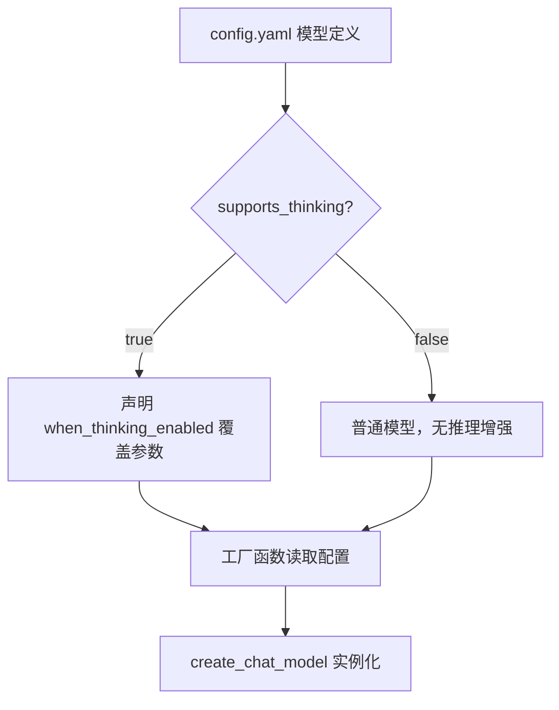
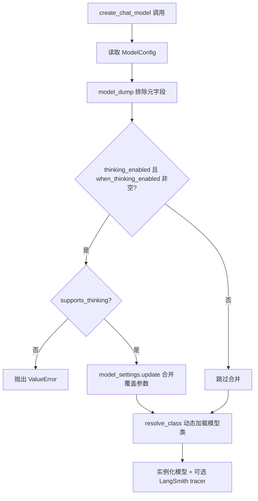
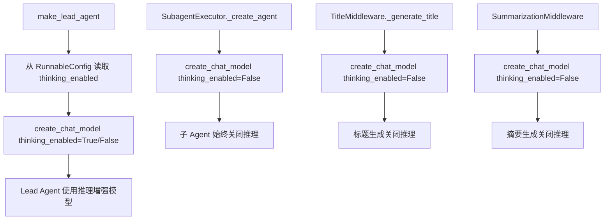
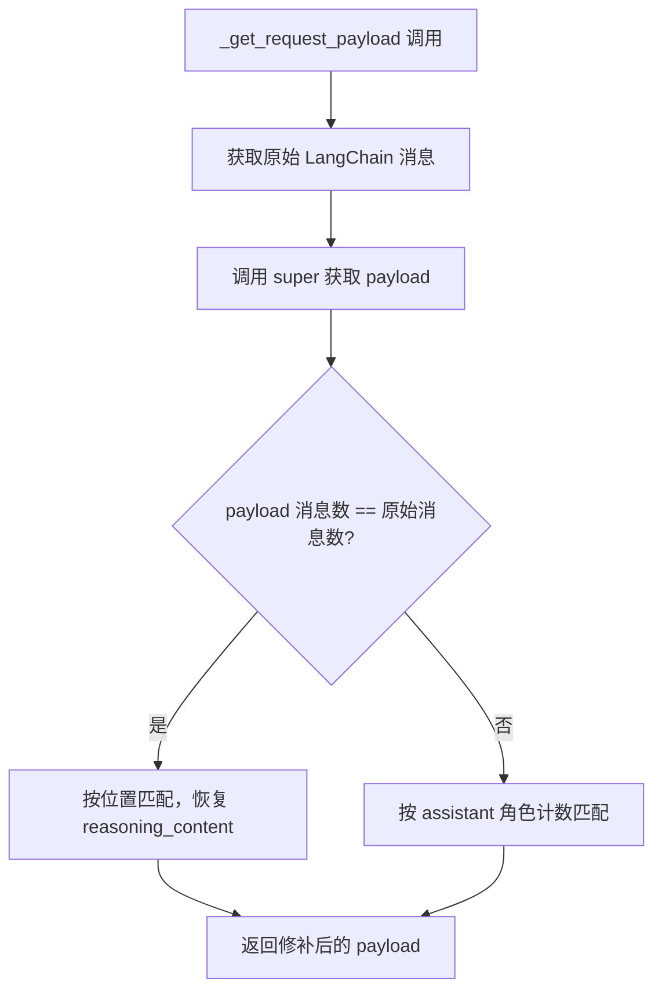

# PD-12.04 DeerFlow — 配置驱动推理增强与四模式思考体系

> 文档编号：PD-12.04
> 来源：DeerFlow `backend/src/models/factory.py`, `backend/src/config/model_config.py`, `backend/src/agents/lead_agent/prompt.py`
> GitHub：https://github.com/bytedance/deer-flow
> 问题域：PD-12 推理增强 Reasoning Enhancement
> 状态：可复用方案

---

## 第 1 章 问题与动机

### 1.1 核心问题

LLM Agent 系统面临推理增强的三重挑战：

1. **模型异构性**：不同模型提供商（OpenAI、Anthropic、DeepSeek、Moonshot）的推理增强参数格式各不相同——Claude 用 `extended_thinking`，DeepSeek 用 `extra_body.thinking.type`，且部分模型根本不支持推理增强。如何用统一接口屏蔽差异？
2. **成本与质量的权衡**：深度推理（thinking mode）显著增加 token 消耗。简单任务（生成标题、摘要）不需要深度推理，复杂任务（多步规划、代码分析）才需要。如何按场景精细控制？
3. **多轮对话中的推理状态保持**：DeepSeek 等模型要求多轮对话中所有 assistant 消息都携带 `reasoning_content`，否则 API 报错。LangChain 默认实现丢失了这个字段。

### 1.2 DeerFlow 的解法概述

DeerFlow 采用**配置驱动 + 四模式 UI + 子 Agent 降级**的三层方案：

1. **YAML 声明式模型能力**：每个模型在 `config.yaml` 中声明 `supports_thinking: true/false` 和 `when_thinking_enabled` 覆盖参数，工厂函数按需合并（`backend/src/models/factory.py:37-40`）
2. **四模式前端切换**：用户可选 flash / thinking / pro / ultra 四种模式，映射到 `thinking_enabled` + `is_plan_mode` + `subagent_enabled` 三个布尔开关（`frontend/src/app/workspace/chats/[thread_id]/page.tsx:190-193`）
3. **子 Agent 推理降级**：所有子 Agent 强制 `thinking_enabled=False`，避免嵌套推理导致 token 爆炸（`backend/src/subagents/executor.py:166`）
4. **DeepSeek reasoning_content 补丁**：`PatchedChatDeepSeek` 在多轮对话中恢复被 LangChain 丢弃的 `reasoning_content` 字段（`backend/src/models/patched_deepseek.py:17-65`）
5. **Prompt 级思考引导**：系统提示中嵌入 `<thinking_style>` 结构化思考指引，引导 Agent 先分析再行动（`backend/src/agents/lead_agent/prompt.py:156-163`）

### 1.3 设计思想

| 设计原则 | 具体实现 | 理由 | 替代方案 |
|----------|----------|------|----------|
| 配置驱动能力声明 | `ModelConfig.supports_thinking` + `when_thinking_enabled` | 新增模型只需改 YAML，不改代码 | 硬编码模型名判断（不可扩展） |
| 参数覆盖而非分支 | `model_settings.update(when_thinking_enabled)` 合并 | 一个工厂函数服务所有模型 | 每个模型写独立工厂（代码膨胀） |
| 子 Agent 强制降级 | `create_chat_model(thinking_enabled=False)` | 子 Agent 执行具体任务，不需要深度推理 | 继承父 Agent 推理级别（浪费 token） |
| 前端模式抽象 | 4 种模式映射到 3 个布尔开关 | 用户无需理解底层参数 | 直接暴露 thinking_enabled 开关（认知负担） |
| 多轮推理状态修补 | PatchedChatDeepSeek 重写 `_get_request_payload` | 修复 LangChain 丢失 reasoning_content 的 bug | 等待上游修复（不可控） |

---

## 第 2 章 源码实现分析

### 2.1 架构概览

DeerFlow 的推理增强体系分为三层：配置层、工厂层、运行时层。

```
┌─────────────────────────────────────────────────────────┐
│                    Frontend (React)                      │
│  ┌─────────┐ ┌──────────┐ ┌─────────┐ ┌──────────────┐ │
│  │  flash   │ │ thinking │ │   pro   │ │    ultra     │ │
│  │ (快速)   │ │ (推理)   │ │(计划+推理)│ │(子Agent+推理)│ │
│  └────┬─────┘ └────┬─────┘ └────┬────┘ └──────┬───────┘ │
│       │            │            │              │         │
│       ▼            ▼            ▼              ▼         │
│  thinking_enabled: false  true       true         true   │
│  is_plan_mode:     false  false      true         true   │
│  subagent_enabled: false  false      false        true   │
└────────────────────────┬────────────────────────────────┘
                         │ RunnableConfig
                         ▼
┌─────────────────────────────────────────────────────────┐
│              Backend: make_lead_agent()                   │
│  ┌──────────────────┐    ┌────────────────────────────┐ │
│  │  config.yaml      │    │  create_chat_model()       │ │
│  │  supports_thinking│───→│  thinking_enabled=True?    │ │
│  │  when_thinking_   │    │  → merge overrides         │ │
│  │  enabled: {...}   │    │  → instantiate model       │ │
│  └──────────────────┘    └────────────────────────────┘ │
│                                                          │
│  ┌──────────────────────────────────────────────────┐   │
│  │  SubagentExecutor                                 │   │
│  │  → create_chat_model(thinking_enabled=False)      │   │
│  │  → 子 Agent 始终关闭推理                           │   │
│  └──────────────────────────────────────────────────┘   │
│                                                          │
│  ┌──────────────────────────────────────────────────┐   │
│  │  PatchedChatDeepSeek                              │   │
│  │  → 多轮对话 reasoning_content 保持                 │   │
│  └──────────────────────────────────────────────────┘   │
└─────────────────────────────────────────────────────────┘
```

### 2.2 核心实现

#### 2.2.1 配置层：ModelConfig 声明模型推理能力



对应源码 `backend/src/config/model_config.py:4-21`：

```python
class ModelConfig(BaseModel):
    """Config section for a model"""
    name: str = Field(..., description="Unique name for the model")
    display_name: str | None = Field(..., default_factory=lambda: None)
    description: str | None = Field(..., default_factory=lambda: None)
    use: str = Field(..., description="Class path of the model provider")
    model: str = Field(..., description="Model name")
    model_config = ConfigDict(extra="allow")
    supports_thinking: bool = Field(
        default_factory=lambda: False,
        description="Whether the model supports thinking"
    )
    when_thinking_enabled: dict | None = Field(
        default_factory=lambda: None,
        description="Extra settings to be passed to the model when thinking is enabled",
    )
    supports_vision: bool = Field(default_factory=lambda: False)
```

YAML 配置示例（`config.example.yaml:36-48`）：

```yaml
- name: deepseek-v3
  display_name: DeepSeek V3 (Thinking)
  use: src.models.patched_deepseek:PatchedChatDeepSeek
  model: deepseek-reasoner
  api_key: $DEEPSEEK_API_KEY
  max_tokens: 16384
  supports_thinking: true
  when_thinking_enabled:
    extra_body:
      thinking:
        type: enabled
```

#### 2.2.2 工厂层：create_chat_model 条件合并



对应源码 `backend/src/models/factory.py:9-58`：

```python
def create_chat_model(name: str | None = None, thinking_enabled: bool = False, **kwargs) -> BaseChatModel:
    config = get_app_config()
    if name is None:
        name = config.models[0].name
    model_config = config.get_model_config(name)
    if model_config is None:
        raise ValueError(f"Model {name} not found in config")
    model_class = resolve_class(model_config.use, BaseChatModel)
    model_settings_from_config = model_config.model_dump(
        exclude_none=True,
        exclude={"use", "name", "display_name", "description",
                 "supports_thinking", "when_thinking_enabled", "supports_vision"},
    )
    if thinking_enabled and model_config.when_thinking_enabled is not None:
        if not model_config.supports_thinking:
            raise ValueError(f"Model {name} does not support thinking.")
        model_settings_from_config.update(model_config.when_thinking_enabled)
    model_instance = model_class(**kwargs, **model_settings_from_config)
    # ... tracing attachment ...
    return model_instance
```

关键设计点：
- `model_dump(exclude=...)` 排除 DeerFlow 自定义的元字段，只保留模型提供商需要的参数
- `update()` 合并而非替换，`when_thinking_enabled` 中的参数会覆盖同名默认参数
- `resolve_class()` 支持任意 Python 类路径，如 `langchain_openai:ChatOpenAI` 或自定义 `src.models.patched_deepseek:PatchedChatDeepSeek`

#### 2.2.3 运行时层：Lead Agent 与子 Agent 的推理分级



Lead Agent 入口（`backend/src/agents/lead_agent/agent.py:238-265`）：

```python
def make_lead_agent(config: RunnableConfig):
    thinking_enabled = config.get("configurable", {}).get("thinking_enabled", True)
    model_name = config.get("configurable", {}).get("model_name")
    # ...
    return create_agent(
        model=create_chat_model(name=model_name, thinking_enabled=thinking_enabled),
        tools=get_available_tools(model_name=model_name, subagent_enabled=subagent_enabled),
        middleware=_build_middlewares(config),
        system_prompt=apply_prompt_template(...),
        state_schema=ThreadState,
    )
```

子 Agent 强制降级（`backend/src/subagents/executor.py:163-166`）：

```python
def _create_agent(self):
    model_name = _get_model_name(self.config, self.parent_model)
    model = create_chat_model(name=model_name, thinking_enabled=False)
    # ...
```

### 2.3 实现细节

#### 2.3.1 PatchedChatDeepSeek：多轮推理状态修补

DeepSeek API 在 thinking 模式下要求所有 assistant 消息都携带 `reasoning_content`。LangChain 的 `ChatDeepSeek` 将 `reasoning_content` 存入 `additional_kwargs` 但在构建请求时丢弃了它。

`PatchedChatDeepSeek`（`backend/src/models/patched_deepseek.py:17-65`）通过重写 `_get_request_payload` 修复：



核心逻辑：遍历 payload 中的 assistant 消息，从对应的 `AIMessage.additional_kwargs` 中取回 `reasoning_content` 并注入。

#### 2.3.2 前端四模式映射

前端定义了 4 种用户可见模式（`frontend/src/core/settings/local.ts:26`）：

```typescript
mode: "flash" | "thinking" | "pro" | "ultra" | undefined;
```

映射逻辑（`frontend/src/app/workspace/chats/[thread_id]/page.tsx:188-194`）：

```typescript
threadContext: {
  ...settings.context,
  thinking_enabled: settings.context.mode !== "flash",      // flash 关闭，其余开启
  is_plan_mode: settings.context.mode === "pro" || settings.context.mode === "ultra",
  subagent_enabled: settings.context.mode === "ultra",
}
```

| 模式 | thinking_enabled | is_plan_mode | subagent_enabled | 适用场景 |
|------|:---:|:---:|:---:|------|
| flash | ✗ | ✗ | ✗ | 快速问答、简单任务 |
| thinking | ✓ | ✗ | ✗ | 需要深度推理的单步任务 |
| pro | ✓ | ✓ | ✗ | 复杂任务 + 计划模式 |
| ultra | ✓ | ✓ | ✓ | 最强模式：推理 + 计划 + 子 Agent |

#### 2.3.3 Prompt 级思考引导

系统提示中的 `<thinking_style>` 块（`backend/src/agents/lead_agent/prompt.py:156-163`）：

```
<thinking_style>
- Think concisely and strategically about the user's request BEFORE taking action
- Break down the task: What is clear? What is ambiguous? What is missing?
- PRIORITY CHECK: If anything is unclear, missing, or has multiple interpretations,
  you MUST ask for clarification FIRST
- Never write down your full final answer in thinking process, but only outline
- CRITICAL: After thinking, you MUST provide your actual response to the user
</thinking_style>
```

这不是模型级的 extended thinking，而是 prompt 级的思考引导——即使模型不支持 thinking mode，也能通过 prompt 引导结构化思考。

#### 2.3.4 API 层能力暴露

`/api/models` 端点（`backend/src/gateway/routers/models.py:30-69`）将 `supports_thinking` 暴露给前端，前端据此决定是否显示 thinking/pro/ultra 模式选项：

```python
@router.get("/models")
async def list_models() -> ModelsListResponse:
    config = get_app_config()
    models = [
        ModelResponse(
            name=model.name,
            display_name=model.display_name,
            description=model.description,
            supports_thinking=model.supports_thinking,
        )
        for model in config.models
    ]
    return ModelsListResponse(models=models)
```

前端根据 `supports_thinking` 自动设置默认模式（`frontend/src/components/workspace/input-box.tsx:114`）：

```typescript
mode: model.supports_thinking ? "pro" : "flash",
```

---

## 第 3 章 迁移指南

### 3.1 迁移清单

**阶段 1：配置层（1 个文件）**
- [ ] 定义 `ModelConfig` Pydantic 模型，包含 `supports_thinking` 和 `when_thinking_enabled` 字段
- [ ] 在 YAML 配置中为每个模型声明推理能力

**阶段 2：工厂层（1 个文件）**
- [ ] 实现 `create_chat_model(name, thinking_enabled)` 工厂函数
- [ ] 实现 `when_thinking_enabled` 参数合并逻辑
- [ ] 添加 `supports_thinking` 校验（不支持时抛异常）

**阶段 3：运行时层（2-3 个文件）**
- [ ] 主 Agent 从运行时配置读取 `thinking_enabled`
- [ ] 子 Agent / 辅助任务强制 `thinking_enabled=False`
- [ ] 系统提示中添加 `<thinking_style>` 结构化思考引导

**阶段 4：前端（可选）**
- [ ] API 暴露 `supports_thinking` 字段
- [ ] 实现模式选择器（flash/thinking/pro/ultra 或自定义分级）
- [ ] 模式到后端参数的映射逻辑

**阶段 5：特殊模型适配（按需）**
- [ ] DeepSeek reasoning_content 多轮保持补丁
- [ ] 其他模型的特殊推理参数处理

### 3.2 适配代码模板

#### 模板 1：配置驱动的模型工厂

```python
from pydantic import BaseModel, Field, ConfigDict
from typing import Any

class ModelConfig(BaseModel):
    """模型配置，声明推理能力。"""
    name: str
    use: str  # 类路径，如 "langchain_openai:ChatOpenAI"
    model: str
    model_config = ConfigDict(extra="allow")
    supports_thinking: bool = Field(default=False)
    when_thinking_enabled: dict[str, Any] | None = Field(default=None)

def create_chat_model(
    name: str | None = None,
    thinking_enabled: bool = False,
    **kwargs,
) -> "BaseChatModel":
    """工厂函数：根据配置创建模型实例，按需启用推理增强。"""
    config = get_app_config()
    model_config = config.get_model_config(name or config.models[0].name)
    if model_config is None:
        raise ValueError(f"Model {name} not found")

    # 动态加载模型类
    model_class = resolve_class(model_config.use)

    # 排除 DeerFlow 自定义元字段，只保留模型提供商参数
    settings = model_config.model_dump(
        exclude_none=True,
        exclude={"use", "name", "supports_thinking", "when_thinking_enabled"},
    )

    # 条件合并推理增强参数
    if thinking_enabled and model_config.when_thinking_enabled:
        if not model_config.supports_thinking:
            raise ValueError(f"Model {name} does not support thinking")
        settings.update(model_config.when_thinking_enabled)

    return model_class(**kwargs, **settings)
```

#### 模板 2：子 Agent 推理降级

```python
class SubagentExecutor:
    """子 Agent 执行器，强制关闭推理增强。"""

    def _create_agent(self):
        model_name = self._resolve_model_name()
        # 关键：子 Agent 始终关闭 thinking
        model = create_chat_model(name=model_name, thinking_enabled=False)
        return create_agent(model=model, tools=self.tools, ...)
```

#### 模板 3：DeepSeek 多轮推理修补

```python
from langchain_deepseek import ChatDeepSeek
from langchain_core.messages import AIMessage

class PatchedChatDeepSeek(ChatDeepSeek):
    """修补 reasoning_content 在多轮对话中的丢失问题。"""

    def _get_request_payload(self, input_, *, stop=None, **kwargs):
        original_messages = self._convert_input(input_).to_messages()
        payload = super()._get_request_payload(input_, stop=stop, **kwargs)
        payload_messages = payload.get("messages", [])

        if len(payload_messages) == len(original_messages):
            for p_msg, o_msg in zip(payload_messages, original_messages):
                if p_msg.get("role") == "assistant" and isinstance(o_msg, AIMessage):
                    rc = o_msg.additional_kwargs.get("reasoning_content")
                    if rc is not None:
                        p_msg["reasoning_content"] = rc
        return payload
```

### 3.3 适用场景

| 场景 | 适用度 | 说明 |
|------|--------|------|
| 多模型 Agent 平台 | ⭐⭐⭐ | 配置驱动方案天然适合多模型切换 |
| 单模型 Agent 应用 | ⭐⭐ | 方案可简化，但 thinking 开关仍有价值 |
| 编排型多 Agent 系统 | ⭐⭐⭐ | 子 Agent 降级策略直接可用 |
| 纯 API 后端（无前端） | ⭐⭐ | 跳过前端模式层，直接用工厂函数 |
| DeepSeek 集成项目 | ⭐⭐⭐ | PatchedChatDeepSeek 直接解决多轮 bug |
| 成本敏感场景 | ⭐⭐⭐ | 四模式分级 + 子 Agent 降级有效控制 token |

---

## 第 4 章 测试用例

```python
import pytest
from unittest.mock import MagicMock, patch
from pydantic import BaseModel, Field, ConfigDict
from typing import Any


# ---- 测试 ModelConfig ----

class ModelConfig(BaseModel):
    name: str
    use: str
    model: str
    model_config = ConfigDict(extra="allow")
    supports_thinking: bool = Field(default=False)
    when_thinking_enabled: dict[str, Any] | None = Field(default=None)


class TestModelConfig:
    def test_default_no_thinking(self):
        """默认不支持推理增强"""
        config = ModelConfig(name="gpt-4", use="langchain_openai:ChatOpenAI", model="gpt-4")
        assert config.supports_thinking is False
        assert config.when_thinking_enabled is None

    def test_thinking_enabled_config(self):
        """声明推理增强能力"""
        config = ModelConfig(
            name="deepseek-v3",
            use="src.models.patched_deepseek:PatchedChatDeepSeek",
            model="deepseek-reasoner",
            supports_thinking=True,
            when_thinking_enabled={"extra_body": {"thinking": {"type": "enabled"}}},
        )
        assert config.supports_thinking is True
        assert config.when_thinking_enabled["extra_body"]["thinking"]["type"] == "enabled"

    def test_extra_fields_allowed(self):
        """允许额外字段（如 api_key, max_tokens）"""
        config = ModelConfig(
            name="gpt-4", use="langchain_openai:ChatOpenAI", model="gpt-4",
            api_key="sk-xxx", max_tokens=4096, temperature=0.7,
        )
        assert config.model_dump()["api_key"] == "sk-xxx"

    def test_model_dump_excludes_meta_fields(self):
        """model_dump 排除元字段后只保留模型提供商参数"""
        config = ModelConfig(
            name="deepseek-v3",
            use="src.models:PatchedChatDeepSeek",
            model="deepseek-reasoner",
            supports_thinking=True,
            when_thinking_enabled={"extra_body": {"thinking": {"type": "enabled"}}},
            api_key="sk-xxx",
            max_tokens=16384,
        )
        dumped = config.model_dump(
            exclude_none=True,
            exclude={"use", "name", "supports_thinking", "when_thinking_enabled"},
        )
        assert "use" not in dumped
        assert "name" not in dumped
        assert "supports_thinking" not in dumped
        assert "when_thinking_enabled" not in dumped
        assert dumped["model"] == "deepseek-reasoner"
        assert dumped["api_key"] == "sk-xxx"


# ---- 测试工厂函数逻辑 ----

class TestCreateChatModelLogic:
    def test_thinking_disabled_no_merge(self):
        """thinking_enabled=False 时不合并覆盖参数"""
        settings = {"model": "deepseek-reasoner", "api_key": "sk-xxx"}
        when_thinking = {"extra_body": {"thinking": {"type": "enabled"}}}
        thinking_enabled = False

        if thinking_enabled and when_thinking:
            settings.update(when_thinking)

        assert "extra_body" not in settings

    def test_thinking_enabled_merges_overrides(self):
        """thinking_enabled=True 时合并 when_thinking_enabled"""
        settings = {"model": "deepseek-reasoner", "api_key": "sk-xxx"}
        when_thinking = {"extra_body": {"thinking": {"type": "enabled"}}}
        thinking_enabled = True

        if thinking_enabled and when_thinking:
            settings.update(when_thinking)

        assert settings["extra_body"]["thinking"]["type"] == "enabled"
        assert settings["api_key"] == "sk-xxx"  # 原有参数保留

    def test_thinking_enabled_but_not_supported_raises(self):
        """模型不支持 thinking 时启用应抛异常"""
        supports_thinking = False
        thinking_enabled = True
        when_thinking = {"extra_body": {"thinking": {"type": "enabled"}}}

        with pytest.raises(ValueError, match="does not support thinking"):
            if thinking_enabled and when_thinking:
                if not supports_thinking:
                    raise ValueError("Model gpt-4 does not support thinking")


# ---- 测试前端模式映射逻辑 ----

class TestFrontendModeMapping:
    @pytest.mark.parametrize("mode,expected_thinking,expected_plan,expected_subagent", [
        ("flash", False, False, False),
        ("thinking", True, False, False),
        ("pro", True, True, False),
        ("ultra", True, True, True),
    ])
    def test_mode_to_flags(self, mode, expected_thinking, expected_plan, expected_subagent):
        """四模式到三布尔开关的映射"""
        thinking_enabled = mode != "flash"
        is_plan_mode = mode in ("pro", "ultra")
        subagent_enabled = mode == "ultra"

        assert thinking_enabled == expected_thinking
        assert is_plan_mode == expected_plan
        assert subagent_enabled == expected_subagent


# ---- 测试 reasoning_content 保持逻辑 ----

class TestReasoningContentPreservation:
    def test_reasoning_content_injected(self):
        """reasoning_content 应从 additional_kwargs 注入到 payload"""
        payload_messages = [
            {"role": "user", "content": "hello"},
            {"role": "assistant", "content": "hi"},
        ]
        # 模拟 AIMessage 的 additional_kwargs
        reasoning_content = "Let me think step by step..."

        # 模拟修补逻辑
        for msg in payload_messages:
            if msg.get("role") == "assistant":
                msg["reasoning_content"] = reasoning_content

        assert payload_messages[1]["reasoning_content"] == reasoning_content

    def test_no_reasoning_content_no_injection(self):
        """无 reasoning_content 时不注入"""
        payload_messages = [
            {"role": "user", "content": "hello"},
            {"role": "assistant", "content": "hi"},
        ]
        reasoning_content = None

        for msg in payload_messages:
            if msg.get("role") == "assistant" and reasoning_content is not None:
                msg["reasoning_content"] = reasoning_content

        assert "reasoning_content" not in payload_messages[1]
```
