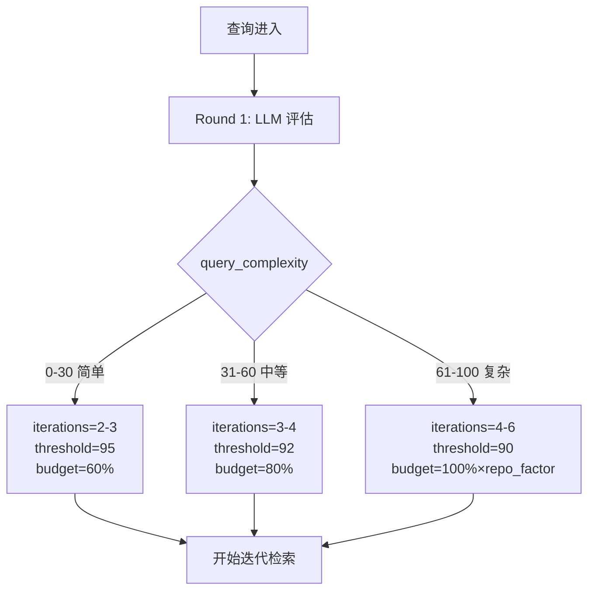
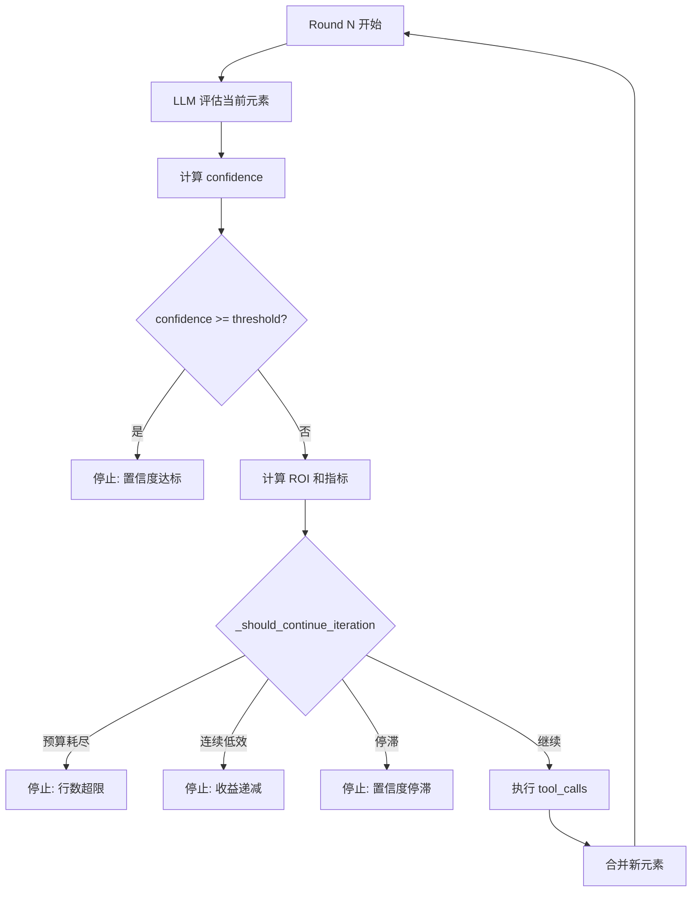
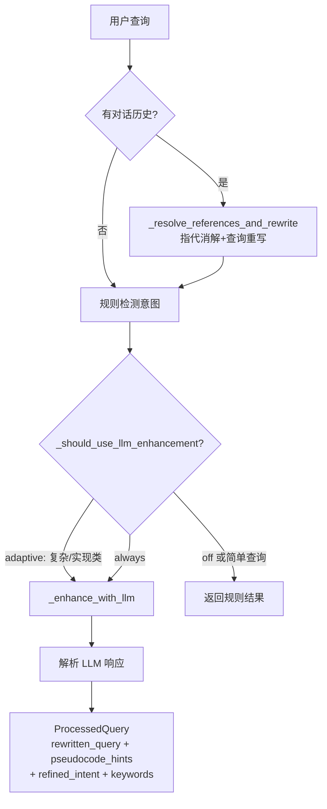

# PD-12.09 FastCode — 置信度驱动迭代推理与自适应检索

> 文档编号：PD-12.09
> 来源：FastCode `fastcode/iterative_agent.py`, `fastcode/query_processor.py`
> GitHub：https://github.com/HKUDS/FastCode.git
> 问题域：PD-12 推理增强 Reasoning Enhancement
> 状态：可复用方案

---

## 第 1 章 问题与动机

### 1.1 核心问题

代码检索系统面临一个根本矛盾：单轮检索无法保证覆盖所有相关代码，但无限制的多轮检索又会导致 token 浪费和延迟膨胀。核心挑战在于：

1. **检索不确定性**：用户查询的复杂度差异巨大，简单查找只需 1 轮，跨模块架构分析可能需要 4-5 轮
2. **成本不可控**：每轮检索都消耗 LLM 推理 token + 代码行数预算，无约束迭代成本线性增长
3. **收益递减**：后续轮次的边际信息增益通常递减，但系统缺乏量化手段判断何时停止
4. **查询理解不足**：原始用户查询可能模糊、多语言、含指代，直接用于检索效果差

### 1.2 FastCode 的解法概述

FastCode 通过 `IterativeAgent` 实现了一套完整的置信度驱动多轮推理框架，核心思路是"让 LLM 自己评估检索够不够，不够就继续找"：

1. **自适应参数初始化**：根据查询复杂度（0-100）和仓库复杂度因子动态调整迭代次数上限、置信阈值、行数预算（`iterative_agent.py:109-152`）
2. **ROI 驱动的迭代控制**：每轮计算 `ROI = confidence_gain / lines_added * 1000`，连续低 ROI 则停止（`iterative_agent.py:2268-2390`）
3. **LLM 增强查询处理**：QueryProcessor 通过 LLM 实现意图检测、查询重写、伪代码提示生成，提升检索精度（`query_processor.py:129-233`）
4. **多粒度元素选择**：LLM 在 file/class/function 三个粒度选择代码元素，避免整文件检索的浪费（`iterative_agent.py:942-1016`）
5. **智能剪枝与预算管理**：超预算时按优先级评分（相关性×来源×类型×大小）智能裁剪（`iterative_agent.py:1971-2076`）

### 1.3 设计思想

| 设计原则 | 具体实现 | 理由 | 替代方案 |
|----------|----------|------|----------|
| 置信度即停止信号 | LLM 每轮输出 0-100 置信度分数 | 让最了解上下文的 LLM 自己判断信息是否充分 | 固定轮次、固定 token 阈值 |
| 自适应参数 | 复杂度→迭代次数/阈值/预算的映射函数 | 简单查询不浪费，复杂查询给足空间 | 全局统一参数 |
| ROI 量化决策 | confidence_gain / lines_cost 作为继续/停止依据 | 经济学思维：边际收益 < 边际成本时停止 | 仅看置信度绝对值 |
| 查询增强前置 | LLM 重写查询 + 伪代码提示 + 意图分类 | 提升首轮检索命中率，减少后续迭代需求 | 纯规则分词 |
| 多粒度选择 | file/class/function 三级选择 | 精确到函数级可节省 80% 无关代码行 | 仅文件级检索 |

---

## 第 2 章 源码实现分析

### 2.1 架构概览

FastCode 的推理增强架构由两个核心组件构成：`QueryProcessor`（查询增强）和 `IterativeAgent`（迭代检索控制），通过 `FastCode` 主类编排。

```
┌─────────────────────────────────────────────────────────────────┐
│                        FastCode Main                            │
│  ┌──────────────┐    ┌──────────────┐    ┌──────────────────┐  │
│  │QueryProcessor│───→│IterativeAgent│───→│AnswerGenerator   │  │
│  │(查询增强)     │    │(迭代检索控制) │    │(答案生成)         │  │
│  └──────────────┘    └──────┬───────┘    └──────────────────┘  │
│                             │                                   │
│         ┌───────────────────┼───────────────────┐              │
│         ▼                   ▼                   ▼              │
│  ┌─────────────┐   ┌──────────────┐   ┌──────────────┐       │
│  │AgentTools   │   │HybridRetriever│   │CodeGraph     │       │
│  │(代码探索)    │   │(混合检索)     │   │(图扩展)       │       │
│  └─────────────┘   └──────────────┘   └──────────────┘       │
└─────────────────────────────────────────────────────────────────┘
```

### 2.2 核心实现

#### 2.2.1 自适应参数初始化



对应源码 `fastcode/iterative_agent.py:109-152`：

```python
def _initialize_adaptive_parameters(self, query_complexity: int):
    repo_factor = self._calculate_repo_factor()
    
    # 自适应迭代次数：复杂度越高允许越多轮
    complexity_score = (query_complexity / 100 + repo_factor) / 2
    self.max_iterations = max(2, min(6, int(self.base_max_iterations * (0.7 + complexity_score * 0.6))))
    
    # 自适应置信阈值：复杂查询接受较低置信度
    if query_complexity >= 80:
        self.confidence_threshold = max(90, self.base_confidence_threshold - 5)
    elif query_complexity >= 60:
        self.confidence_threshold = max(92, self.base_confidence_threshold - 3)
    else:
        self.confidence_threshold = self.base_confidence_threshold
    
    # 自适应行数预算：简单查询小预算，复杂查询大预算
    if query_complexity <= 30:
        self.adaptive_line_budget = int(self.max_total_lines * 0.6)
    elif query_complexity <= 60:
        self.adaptive_line_budget = int(self.max_total_lines * 0.8)
    else:
        self.adaptive_line_budget = int(self.max_total_lines * 1.0 * repo_factor)
```

仓库复杂度因子 `_calculate_repo_factor`（`iterative_agent.py:2432-2459`）综合文件数（对数尺度）、平均文件行数、目录深度三个维度，输出 0.5-2.0 的乘数。

#### 2.2.2 ROI 驱动的迭代控制循环



对应源码 `fastcode/iterative_agent.py:222-319`（主循环）和 `iterative_agent.py:2268-2390`（停止决策）：

```python
# 主迭代循环 (iterative_agent.py:222-319)
while current_round <= self.max_iterations:
    current_elements = self._merge_elements(retained_elements, pending_elements)
    round_result = self._round_n(query, current_elements, query_info, current_round, dialogue_history)
    
    # 过滤保留元素
    if round_result.get("keep_files"):
        filtered_elements = self._filter_elements_by_keep_files(current_elements, round_result["keep_files"])
    
    confidence = round_result["confidence"]
    
    # 计算 ROI 指标
    total_lines = self._calculate_total_lines(current_elements)
    confidence_gain = confidence - prev_confidence
    lines_added = total_lines - prev_lines
    roi = (confidence_gain / lines_added * 1000) if lines_added > 0 else 0.0
    
    # 置信度达标则停止
    if confidence >= self.confidence_threshold:
        break
    
    # 成本效益分析决定是否继续
    should_continue = self._should_continue_iteration(
        current_round, confidence, current_elements, query_complexity
    )
    if not should_continue:
        break
```

`_should_continue_iteration` 的 6 层检查（`iterative_agent.py:2268-2390`）：

1. **置信度检查**：`confidence >= threshold` → 停止
2. **硬迭代上限**：`round >= max_iterations` → 停止
3. **行数预算**：`total_lines >= adaptive_line_budget` → 停止
4. **停滞检测**：连续 2 轮 `|gain| < 1.0` → 停止
5. **连续低效检测**：连续 2 轮 `is_low_performance(gain, roi)` → 停止
6. **成本效益估算**：`estimated_lines_needed > remaining_budget * 1.5` → 停止

#### 2.2.3 QueryProcessor LLM 增强



对应源码 `fastcode/query_processor.py:460-510`（自适应判断）：

```python
def _should_use_llm_enhancement(self, query: str, intent: str) -> bool:
    if self.llm_enhancement_mode == "always":
        return True
    if self.llm_enhancement_mode == "off":
        return False
    
    # adaptive 模式：实现类、复杂、模糊查询才用 LLM
    is_implementation = any(ind in query_lower for ind in implementation_indicators)
    tech_term_count = sum(1 for keyword in self.code_keywords if keyword in query_lower)
    is_complex = tech_term_count >= 3 or len(query.split()) >= 15
    is_ambiguous = len(query.split()) <= 5 and tech_term_count <= 1
    
    return is_implementation or is_complex or is_ambiguous
```

### 2.3 实现细节

**智能剪枝优先级评分**（`iterative_agent.py:2016-2076`）：

当检索元素超出行数预算时，`_smart_prune_elements` 按 5 因子加权评分排序裁剪：

| 因子 | 权重 | 说明 |
|------|------|------|
| 检索相关性 | 0.4 | total_score 来自语义+关键词+图扩展 |
| 来源加成 | 0.3/0.2/0.15 | agent_found > llm_selected > high_semantic |
| 元素类型 | 0.2/0.15/0 | function > class > file |
| 大小适度性 | 0.2 | 50-200 行最优，>500 行惩罚 |
| 选择粒度 | 0.15/0 | class/function 精选 > file 全选 |

**效率评级**（`iterative_agent.py:434-444`）：

```
excellent: ROI >= 5.0 且 budget < 70%
good:      ROI >= 3.0 且 budget < 85%
acceptable: ROI >= 1.5 或 budget < 90%
inefficient: 其他
```

**停止原因分析**（`iterative_agent.py:420-432`）：5 种停止原因被记录到 metadata 中，支持后续分析优化。


---

## 第 3 章 迁移指南

### 3.1 迁移清单

**阶段 1：核心迭代框架（必选）**
- [ ] 实现 `IterativeAgent` 基类，包含置信度评估 + 迭代循环
- [ ] 定义自适应参数初始化逻辑（复杂度→迭代次数/阈值/预算映射）
- [ ] 实现 `_should_continue_iteration` 的 6 层停止检查
- [ ] 实现 ROI 计算和迭代历史记录

**阶段 2：查询增强（推荐）**
- [ ] 实现 `QueryProcessor` 的 LLM 增强模式（adaptive/always/off）
- [ ] 实现意图检测（规则 + LLM 精化）
- [ ] 实现查询重写和伪代码提示生成
- [ ] 实现多轮对话的指代消解

**阶段 3：精细化控制（可选）**
- [ ] 实现多粒度元素选择（file/class/function）
- [ ] 实现智能剪枝优先级评分
- [ ] 实现仓库复杂度因子计算
- [ ] 实现效率评级和停止原因分析

### 3.2 适配代码模板

以下是一个可直接复用的置信度驱动迭代框架模板：

```python
"""置信度驱动迭代推理框架 — 从 FastCode IterativeAgent 提炼"""

from dataclasses import dataclass, field
from typing import List, Dict, Any, Optional, Tuple
import logging

logger = logging.getLogger(__name__)


@dataclass
class IterationMetrics:
    """单轮迭代指标"""
    round: int
    confidence: float
    elements_count: int
    total_cost: float  # 通用成本（行数/token/时间）
    confidence_gain: float = 0.0
    cost_added: float = 0.0
    roi: float = 0.0  # confidence_gain / cost_added


@dataclass
class AdaptiveParams:
    """自适应参数"""
    max_iterations: int = 4
    confidence_threshold: float = 95.0
    min_confidence_gain: float = 5.0
    cost_budget: float = 12000.0


class ConfidenceDrivenIterator:
    """
    置信度驱动的迭代推理控制器
    
    核心思路：每轮让 LLM 评估置信度，计算 ROI 决定是否继续。
    """
    
    def __init__(self, base_params: AdaptiveParams):
        self.base_params = base_params
        self.params = AdaptiveParams()  # 当前查询的自适应参数
        self.history: List[IterationMetrics] = []
    
    def initialize_adaptive(self, query_complexity: int, context_factor: float = 1.0):
        """根据查询复杂度初始化自适应参数"""
        score = (query_complexity / 100 + context_factor) / 2
        
        self.params.max_iterations = max(2, min(6, 
            int(self.base_params.max_iterations * (0.7 + score * 0.6))))
        
        if query_complexity >= 80:
            self.params.confidence_threshold = max(90, self.base_params.confidence_threshold - 5)
        elif query_complexity >= 60:
            self.params.confidence_threshold = max(92, self.base_params.confidence_threshold - 3)
        else:
            self.params.confidence_threshold = self.base_params.confidence_threshold
        
        budget_ratio = {0: 0.6, 30: 0.8, 60: 1.0}
        for threshold in sorted(budget_ratio.keys(), reverse=True):
            if query_complexity >= threshold:
                self.params.cost_budget = self.base_params.cost_budget * budget_ratio[threshold] * context_factor
                break
    
    def should_continue(self, current_round: int, confidence: float, 
                        total_cost: float) -> Tuple[bool, str]:
        """6 层停止检查，返回 (是否继续, 原因)"""
        if confidence >= self.params.confidence_threshold:
            return False, "confidence_threshold_reached"
        if current_round >= self.params.max_iterations:
            return False, "max_iterations_reached"
        if total_cost >= self.params.cost_budget:
            return False, "cost_budget_exceeded"
        
        # 停滞检测
        if len(self.history) >= 2:
            recent_gains = [h.confidence_gain for h in self.history[-2:]]
            if all(abs(g) < 1.0 for g in recent_gains):
                return False, "stagnation"
        
        # 连续低效检测
        if len(self.history) >= 2:
            if all(self._is_low_performance(h) for h in self.history[-2:]):
                return False, "consecutive_low_performance"
        
        # 成本效益估算
        gap = self.params.confidence_threshold - confidence
        remaining = self.params.cost_budget - total_cost
        if gap * 100 > remaining * 1.5:
            return False, "unlikely_to_reach_target"
        
        return True, "continue"
    
    def record_round(self, round_num: int, confidence: float, 
                     elements_count: int, total_cost: float):
        """记录一轮迭代指标"""
        prev = self.history[-1] if self.history else None
        gain = confidence - prev.confidence if prev else 0
        cost_added = total_cost - prev.total_cost if prev else total_cost
        roi = (gain / cost_added * 1000) if cost_added > 0 else 0
        
        self.history.append(IterationMetrics(
            round=round_num, confidence=confidence,
            elements_count=elements_count, total_cost=total_cost,
            confidence_gain=gain, cost_added=cost_added, roi=roi
        ))
    
    def _is_low_performance(self, metrics: IterationMetrics) -> bool:
        """判断某轮是否低效"""
        if metrics.confidence_gain < -1.0:
            return True
        if metrics.confidence_gain < self.params.min_confidence_gain and metrics.roi < 2.0:
            return True
        return False
```

### 3.3 适用场景

| 场景 | 适用度 | 说明 |
|------|--------|------|
| 代码检索 RAG | ⭐⭐⭐ | FastCode 的原生场景，直接复用 |
| 研究型 Agent（多轮搜索） | ⭐⭐⭐ | 将"代码行数"替换为"搜索结果数"即可 |
| 多步推理 Agent | ⭐⭐ | 置信度评估需要适配具体推理任务 |
| 单轮问答系统 | ⭐ | 过度设计，单轮不需要迭代控制 |
| 实时对话系统 | ⭐ | 多轮迭代延迟较高，不适合实时场景 |

---

## 第 4 章 测试用例

```python
"""FastCode 置信度驱动迭代推理 — 测试用例"""

import pytest
from unittest.mock import MagicMock, patch


class TestAdaptiveParameterInitialization:
    """测试自适应参数初始化"""
    
    def test_simple_query_gets_small_budget(self):
        """简单查询应获得较小的行数预算"""
        agent = self._create_agent()
        agent._initialize_adaptive_parameters(query_complexity=20)
        
        assert agent.max_iterations <= 3
        assert agent.confidence_threshold == 95  # 保持高标准
        assert agent.adaptive_line_budget == int(12000 * 0.6)
    
    def test_complex_query_gets_large_budget(self):
        """复杂查询应获得较大的行数预算和宽松阈值"""
        agent = self._create_agent()
        agent.repo_stats = {"total_files": 500, "avg_file_lines": 200, "max_depth": 5}
        agent._initialize_adaptive_parameters(query_complexity=85)
        
        assert agent.max_iterations >= 4
        assert agent.confidence_threshold <= 92
        assert agent.adaptive_line_budget >= 12000
    
    def test_medium_complexity_balanced(self):
        """中等复杂度查询参数应居中"""
        agent = self._create_agent()
        agent._initialize_adaptive_parameters(query_complexity=50)
        
        assert 3 <= agent.max_iterations <= 4
        assert agent.adaptive_line_budget == int(12000 * 0.8)
    
    def _create_agent(self):
        config = {
            "agent": {"iterative": {
                "max_iterations": 4, "confidence_threshold": 95,
                "min_confidence_gain": 5, "max_total_lines": 12000,
                "temperature_agent": 0.2, "max_tokens_agent": 8000,
                "max_elements": 100, "max_candidates_display": 200
            }},
            "generation": {"provider": "openai"}
        }
        with patch.dict("os.environ", {"OPENAI_API_KEY": "test", "MODEL": "test"}):
            agent = MagicMock()
            agent.base_max_iterations = 4
            agent.base_confidence_threshold = 95
            agent.min_confidence_gain = 5
            agent.max_total_lines = 12000
            agent.repo_stats = None
            agent._calculate_repo_factor = lambda: 1.0
            agent._initialize_adaptive_parameters = IterativeAgent._initialize_adaptive_parameters.__get__(agent)
            return agent


class TestShouldContinueIteration:
    """测试迭代继续/停止决策"""
    
    def test_stop_when_confidence_reached(self):
        """置信度达标时应停止"""
        agent = self._create_agent(confidence_threshold=95)
        result = agent._should_continue_iteration(2, 96, [], 50)
        assert result is False
    
    def test_stop_when_budget_exceeded(self):
        """行数预算耗尽时应停止"""
        agent = self._create_agent(line_budget=1000)
        elements = [{"element": {"start_line": 1, "end_line": 1200}}]
        result = agent._should_continue_iteration(2, 70, elements, 50)
        assert result is False
    
    def test_stop_on_stagnation(self):
        """连续小波动应检测为停滞"""
        agent = self._create_agent()
        agent.iteration_history = [
            {"confidence": 70, "confidence_gain": 0.5, "roi": 0.1, "total_lines": 5000},
            {"confidence": 70.3, "confidence_gain": 0.3, "roi": 0.05, "total_lines": 6000},
            {"confidence": 70.5, "confidence_gain": 0.2, "roi": 0.03, "total_lines": 7000},
        ]
        result = agent._should_continue_iteration(4, 70.5, [], 50)
        assert result is False
    
    def test_continue_when_making_progress(self):
        """有明显进展时应继续"""
        agent = self._create_agent()
        agent.iteration_history = [
            {"confidence": 50, "confidence_gain": 0, "roi": 0, "total_lines": 2000},
            {"confidence": 65, "confidence_gain": 15, "roi": 5.0, "total_lines": 5000},
        ]
        result = agent._should_continue_iteration(3, 65, [], 60)
        assert result is True
    
    def _create_agent(self, confidence_threshold=95, line_budget=12000):
        agent = MagicMock()
        agent.confidence_threshold = confidence_threshold
        agent.max_iterations = 6
        agent.adaptive_line_budget = line_budget
        agent.min_confidence_gain = 5
        agent.iteration_history = []
        agent._calculate_total_lines = IterativeAgent._calculate_total_lines.__get__(agent)
        agent._should_continue_iteration = IterativeAgent._should_continue_iteration.__get__(agent)
        agent._get_min_roi_threshold = IterativeAgent._get_min_roi_threshold.__get__(agent)
        agent.logger = MagicMock()
        return agent


class TestQueryProcessorAdaptive:
    """测试查询处理器的自适应 LLM 增强"""
    
    def test_implementation_query_triggers_llm(self):
        """实现类查询应触发 LLM 增强"""
        processor = self._create_processor(mode="adaptive")
        result = processor._should_use_llm_enhancement("how to implement authentication", "implement")
        assert result is True
    
    def test_simple_lookup_skips_llm(self):
        """简单查找不应触发 LLM 增强"""
        processor = self._create_processor(mode="adaptive")
        result = processor._should_use_llm_enhancement("where is the login function", "find")
        assert result is False
    
    def test_always_mode_always_triggers(self):
        """always 模式始终触发"""
        processor = self._create_processor(mode="always")
        result = processor._should_use_llm_enhancement("hello", "general")
        assert result is True
    
    def _create_processor(self, mode="adaptive"):
        processor = MagicMock()
        processor.use_llm_enhancement = True
        processor.llm_client = MagicMock()
        processor.llm_enhancement_mode = mode
        processor.code_keywords = {"function", "class", "method", "api", "endpoint"}
        processor._should_use_llm_enhancement = QueryProcessor._should_use_llm_enhancement.__get__(processor)
        return processor
```


---

## 第 5 章 跨域关联

| 关联域 | 关系类型 | 说明 |
|--------|----------|------|
| PD-01 上下文管理 | 依赖 | 自适应行数预算本质是上下文窗口管理的一种形式，`max_context_tokens` 和 `reserve_tokens_for_response` 直接约束答案生成 |
| PD-08 搜索与检索 | 协同 | IterativeAgent 的多轮检索建立在 HybridRetriever（语义+关键词+图扩展）之上，检索质量直接影响置信度收敛速度 |
| PD-07 质量检查 | 协同 | 置信度评估本质是一种自评质量检查，效率评级（excellent/good/acceptable/inefficient）是质量度量 |
| PD-11 可观测性 | 协同 | iteration_metadata 记录了完整的迭代历史（每轮置信度、ROI、预算使用率），是成本追踪的天然数据源 |
| PD-04 工具系统 | 依赖 | AgentTools 提供 `search_codebase` 和 `list_directory` 两个只读工具，IterativeAgent 通过 tool_calls 调用 |
| PD-09 Human-in-the-Loop | 互补 | 当前 IterativeAgent 完全自主决策，可在低置信度时引入人工确认（如 confidence < 60 时暂停询问用户） |

---

## 第 6 章 来源文件索引

| 文件 | 行范围 | 关键实现 |
|------|--------|----------|
| `fastcode/iterative_agent.py` | L20-85 | IterativeAgent 类定义和初始化 |
| `fastcode/iterative_agent.py` | L109-152 | `_initialize_adaptive_parameters` 自适应参数 |
| `fastcode/iterative_agent.py` | L154-343 | `retrieve_with_iteration` 主迭代循环 |
| `fastcode/iterative_agent.py` | L420-444 | 停止原因分析和效率评级 |
| `fastcode/iterative_agent.py` | L446-589 | Round 1 评估 prompt 构建和解析 |
| `fastcode/iterative_agent.py` | L942-1016 | 多粒度元素选择（file/class/function） |
| `fastcode/iterative_agent.py` | L1971-2076 | 智能剪枝和优先级评分 |
| `fastcode/iterative_agent.py` | L2268-2390 | `_should_continue_iteration` 6 层停止检查 |
| `fastcode/iterative_agent.py` | L2404-2430 | `_get_min_roi_threshold` 动态 ROI 阈值 |
| `fastcode/iterative_agent.py` | L2432-2459 | `_calculate_repo_factor` 仓库复杂度因子 |
| `fastcode/query_processor.py` | L17-43 | ProcessedQuery 数据结构 |
| `fastcode/query_processor.py` | L46-103 | QueryProcessor 初始化和意图模式 |
| `fastcode/query_processor.py` | L129-233 | `process` 主处理流程（LLM 增强） |
| `fastcode/query_processor.py` | L460-510 | `_should_use_llm_enhancement` 自适应判断 |
| `fastcode/query_processor.py` | L546-590 | LLM 增强 prompt 构建 |
| `fastcode/query_processor.py` | L729-828 | 多轮对话指代消解 |
| `config/config.yaml` | L122-140 | 查询处理配置（LLM 增强模式、多轮设置） |
| `config/config.yaml` | L169-181 | Agent 迭代参数配置 |
| `fastcode/agent_tools.py` | L15-47 | AgentTools 只读工具基类 |

---

## 第 7 章 横向对比维度

```json comparison_data
{
  "project": "FastCode",
  "dimensions": {
    "推理方式": "置信度驱动多轮迭代，LLM 每轮自评 0-100 置信度决定是否继续",
    "模型策略": "单模型多轮调用，同一 LLM 兼任评估和检索决策",
    "成本控制": "ROI 量化（confidence_gain/lines_cost），6 层停止检查",
    "适用场景": "代码仓库级检索 RAG，支持多仓库和多轮对话",
    "推理模式": "迭代收敛式：Round1 评估→RoundN 检索+评估→置信度达标停止",
    "增强策略": "查询重写+伪代码提示+意图分类+指代消解四重增强",
    "思考预算": "三级自适应：简单60%/中等80%/复杂100%×repo_factor",
    "检索范式": "混合检索（语义+BM25+图扩展）+ Agent 工具调用",
    "推理可见性": "完整 iteration_metadata 含每轮置信度/ROI/预算使用率/停止原因"
  }
}
```

### 域元数据补充

```json domain_metadata
{
  "solution_summary": "FastCode 用 IterativeAgent 实现置信度驱动多轮检索：LLM 每轮自评 0-100 置信度，ROI(置信增益/行数成本)量化决策，6 层停止检查，QueryProcessor 四重查询增强",
  "description": "迭代检索场景下的置信度收敛控制与成本效益量化决策",
  "sub_problems": [
    "置信度驱动迭代：LLM 自评置信度作为迭代停止信号",
    "ROI 量化决策：用经济学边际收益/成本比决定是否继续迭代",
    "自适应参数初始化：根据查询和仓库复杂度动态调整迭代参数",
    "多粒度元素选择：file/class/function 三级粒度精确检索"
  ],
  "best_practices": [
    "6 层停止检查防过度迭代：置信度→硬上限→预算→停滞→连续低效→成本效益",
    "查询增强前置减少迭代：LLM 重写+伪代码提示提升首轮命中率",
    "仓库复杂度因子动态调预算：文件数/行数/深度三维度 0.5-2.0 乘数"
  ]
}
```
