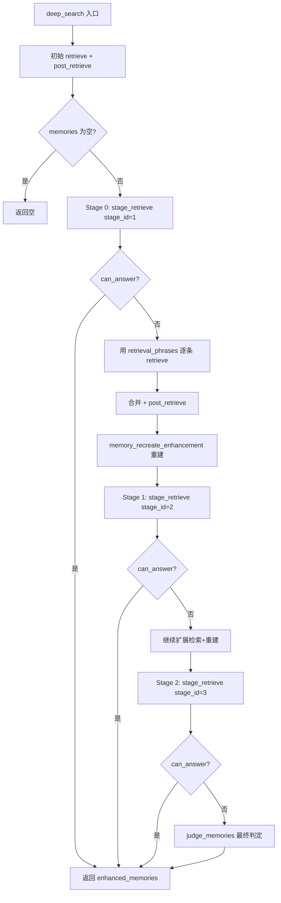
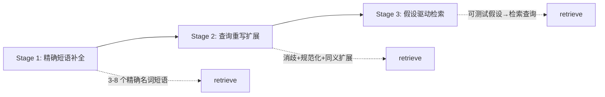
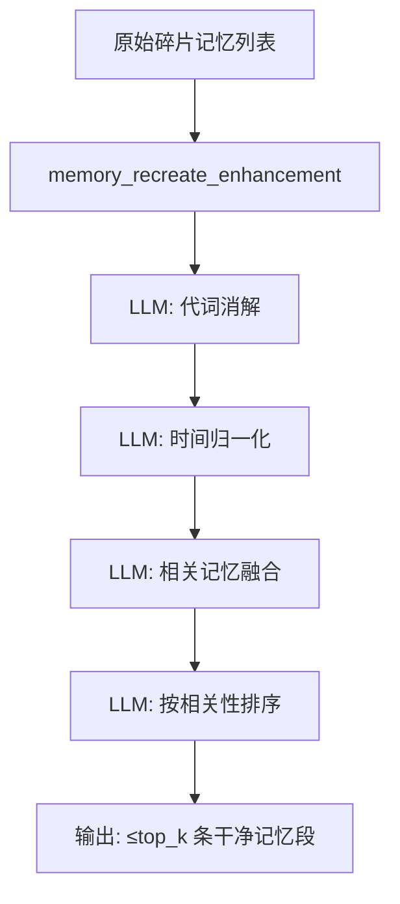

# PD-12.NN MemOS — 三阶段推理检索与记忆重建增强

> 文档编号：PD-12.NN
> 来源：MemOS `src/memos/memories/textual/tree_text_memory/retrieve/advanced_searcher.py`
> GitHub：https://github.com/MemTensor/MemOS.git
> 问题域：PD-12 推理增强 Reasoning Enhancement
> 状态：可复用方案

---

## 第 1 章 问题与动机

### 1.1 核心问题

记忆系统的检索质量直接决定 Agent 回答的准确性。传统的单轮向量检索存在三个根本缺陷：

1. **语义鸿沟**：用户查询与记忆存储之间存在表述差异，单次 embedding 匹配无法覆盖所有相关记忆
2. **信息碎片化**：相关事实分散在多条记忆中，需要推理才能判断是否"足够回答"
3. **检索噪声**：返回的记忆包含代词歧义、时间模糊、冗余重复，直接喂给 LLM 会降低回答质量

核心挑战：如何让检索系统像人类一样"思考"——先检索、再判断够不够、不够就换个角度再找、找到后还要整理归纳？

### 1.2 MemOS 的解法概述

MemOS 的 `AdvancedSearcher` 实现了一个多阶段推理检索管道，核心思路是 **retrieve → reason → expand → judge** 的迭代循环：

1. **三阶段渐进式检索扩展**（`deep_search`，`advanced_searcher.py:232`）：默认 3 轮 `thinking_stages`，每轮用不同策略的 prompt 让 LLM 判断 `can_answer` 并生成新的 `retrieval_phrases`
2. **阶段化 prompt 升级**（`advanced_search_prompts.py:1-123`）：Stage1 精确短语补全 → Stage2 查询重写与同义扩展 → Stage3 假设驱动检索，策略逐轮升级
3. **记忆重建增强**（`memory_recreate_enhancement`，`advanced_searcher.py:193`）：用 LLM 对检索结果做代词消解、时间归一化、事实融合，输出干净的记忆段
4. **CoT 查询分解**（`_cot_query`，`searcher.py:1124`）：复杂查询先用 LLM 拆分为子问题，多向量并行检索
5. **双 LLM 分工**（`dispatcher_llm` + `process_llm`）：基础检索用轻量模型，深度推理用强模型

### 1.3 设计思想

| 设计原则 | 具体实现 | 理由 | 替代方案 |
|----------|----------|------|----------|
| 渐进式策略升级 | 3 个 stage prompt 从精确匹配到假设推理逐步放宽 | 避免一开始就用昂贵的假设推理，大部分查询 Stage1 就能解决 | 固定单一策略（浪费或不足） |
| LLM-as-Judge 终止 | 每轮 `can_answer` 判断，满足即停 | 避免无意义的额外检索轮次，节省 token | 固定轮数（浪费）或人工阈值（不灵活） |
| 检索后重建 | `memory_recreate_enhancement` 做代词消解+事实融合 | 原始记忆碎片化、有歧义，直接用会降低 LLM 回答质量 | 直接拼接原始记忆（噪声大） |
| 双模型分离 | `dispatcher_llm` 做基础解析，`process_llm` 做深度推理 | 基础任务不需要强模型，降低成本 | 单一模型（成本高或质量低） |
| XML 标签结构化输出 | `<can_answer>`, `<reason>`, `<retrieval_phrases>` 标签解析 | 比 JSON 更鲁棒，LLM 生成 XML 标签的格式一致性更高 | JSON 输出（容易格式错误） |

---

## 第 2 章 源码实现分析

### 2.1 架构概览

MemOS 的检索系统分为两层：基础 `Searcher` 提供多路并行检索 + CoT 查询分解，`AdvancedSearcher` 继承它并叠加多阶段推理循环。

```
┌─────────────────────────────────────────────────────────────┐
│                    AdvancedSearcher                          │
│  ┌─────────────────────────────────────────────────────┐    │
│  │              deep_search() 主循环                    │    │
│  │  ┌──────────┐  ┌──────────┐  ┌──────────┐          │    │
│  │  │ Stage 1  │→│ Stage 2  │→│ Stage 3  │→ judge    │    │
│  │  │精确短语补全│  │查询重写扩展│  │假设驱动检索│  memories │    │
│  │  └────┬─────┘  └────┬─────┘  └────┬─────┘          │    │
│  │       │can_answer?   │can_answer?   │can_answer?     │    │
│  │       ↓ No           ↓ No           ↓ No             │    │
│  │  retrieve()     retrieve()     retrieve()            │    │
│  │       ↓              ↓              ↓                │    │
│  │  memory_recreate_enhancement() ← 每轮合并+重建       │    │
│  └─────────────────────────────────────────────────────┘    │
│                                                             │
│  ┌─────────────────────────────────────────────────────┐    │
│  │           Searcher (基类) — 多路并行检索              │    │
│  │  Path A: WorkingMemory    ─┐                        │    │
│  │  Path B: LongTerm+User    ─┼─ ThreadPoolExecutor(5) │    │
│  │  Path C: Internet         ─┤                        │    │
│  │  Path D: ToolMemory       ─┤                        │    │
│  │  Path E: SkillMemory      ─┘                        │    │
│  │           ↓                                          │    │
│  │  TaskGoalParser → GraphRetriever → Reranker          │    │
│  └─────────────────────────────────────────────────────┘    │
└─────────────────────────────────────────────────────────────┘
```

### 2.2 核心实现

#### 2.2.1 三阶段推理检索主循环



对应源码 `advanced_searcher.py:232-364`：

```python
class AdvancedSearcher(Searcher):
    def __init__(self, ...):
        super().__init__(...)
        self.stage_retrieve_top = 3
        self.process_llm = process_llm
        self.thinking_stages = 3      # 默认 3 轮推理
        self.max_retry_times = 2       # 每轮 LLM 调用最多重试 2 次
        self.deep_search_top_k_bar = 2

    def deep_search(self, query, top_k, info=None, memory_type="All",
                    search_filter=None, user_name=None, **kwargs):
        previous_retrieval_phrases = [query]
        # 初始检索
        retrieved_memories = self.retrieve(query=query, ...)
        memories = self.post_retrieve(retrieved_results=retrieved_memories, ...)
        if len(memories) == 0:
            return memories

        mem_list, _ = self.tree_memories_to_text_memories(memories=memories)
        rewritten_flag = False

        for current_stage_id in range(self.thinking_stages + 1):
            # 最后一轮：用 judge_memories 做最终判定
            if current_stage_id == self.thinking_stages:
                reason, can_answer = self.judge_memories(query=query,
                    text_memories="- " + "\n- ".join(mem_list) + "\n")
                return enhanced_memories[:top_k]

            # 当前轮：用对应 stage prompt 判断
            can_answer, reason, retrieval_phrases = self.stage_retrieve(
                stage_id=current_stage_id + 1, query=query,
                previous_retrieval_phrases=previous_retrieval_phrases,
                text_memories="- " + "\n- ".join(mem_list) + "\n")

            if can_answer:
                return enhanced_memories[:top_k]
            else:
                # 用新 phrases 逐条检索补充
                for phrase in retrieval_phrases:
                    _retrieved = self.retrieve(query=phrase,
                        top_k=self.stage_retrieve_top, ...)
                    additional_retrieved_memories.extend(_retrieved)
                # 合并 + 重建
                merged = self.post_retrieve(
                    retrieved_results=retrieved_memories + additional_retrieved_memories, ...)
                mem_list = self.memory_recreate_enhancement(
                    query=query, top_k=top_k, text_memories=mem_list, ...)
```

#### 2.2.2 三阶段 Prompt 策略升级



对应源码 `advanced_search_prompts.py:1-123`：

```python
# Stage 1: 精确短语补全 — 生成 3-8 个精确的名词短语/属性值对
STAGE1_EXPAND_RETRIEVE_PROMPT = """
## Retrieval Phrase Requirements (if can_answer = false)
- Output 3–8 short, discriminative noun phrases or attribute-value pairs.
- Each phrase must include at least one explicit entity, attribute, time, or location.
- Avoid fuzzy words, subjective terms, or pronouns.
- Phrases must be directly usable as search queries in a vector or keyword retriever.
...
"""

# Stage 2: 查询重写 — 代词消解、实体规范化、时间归一化、同义扩展
STAGE2_EXPAND_RETRIEVE_PROMPT = """
## Rewrite Strategy
- **Resolve ambiguous references**: Replace pronouns with explicit entity names
- **Canonicalize entities**: Use full names, known roles, or unambiguous identifiers
- **Normalize temporal expressions**: Convert relative time to absolute dates
- **Enrich with discriminative context**: Combine entity + action + time + location
- **Decompose complex queries**: Break multi-part questions into focused sub-queries
...
"""

# Stage 3: 假设驱动 — 基于已有记忆生成可测试假设，每个假设带验证标准
STAGE3_EXPAND_RETRIEVE_PROMPT = """
## Rules
- Frame each hypothesis as a testable conditional statement:
  "If [X] is true, then the query can be answered."
- For each hypothesis, specify 1–3 concrete evidence requirements
...
"""
```

#### 2.2.3 记忆重建增强



对应源码 `advanced_searcher.py:193-230` 和 `advanced_search_prompts.py:165-203`：

```python
def memory_recreate_enhancement(self, query, top_k, text_memories, retries):
    text_memories = "\n".join([f"- [{i}] {mem}" for i, mem in enumerate(text_memories)])
    prompt = self.build_prompt(
        template_name="memory_recreate_enhancement",
        query=query, top_k=top_k, memories=text_memories)
    llm_response = self.process_llm.generate([{"role": "user", "content": prompt}])
    processed = parse_structured_output(content=llm_response)
    return processed["answer"]  # 返回融合后的记忆列表
```

重建 prompt 的核心规则（`MEMORY_RECREATE_ENHANCEMENT_PROMPT`）：
- 消解所有代词和模糊引用（"yesterday" → 具体日期，"she" → 全名）
- 融合时间/主题/参与者相关的记忆条目
- 保留每条原始记忆的所有事实，不删除不发明
- 输出不超过 `top_k` 条，按与查询的相关性排序

### 2.3 实现细节

**CoT 查询分解**（`searcher.py:1124-1160`）：基础 `Searcher` 提供 `_cot_query` 方法，用 LLM 判断查询是否复杂（`is_complex`），复杂则拆分为 2-3 个子问题，分别 embedding 后并行检索。支持中英文双语 prompt。

**XML 标签解析器**（`retrieve_utils.py:16-83`）：`parse_structured_output` 用正则 `<tag_name>(.*?)</tag_name>` 提取所有标签内容，自动判断是字符串还是列表（以 `- ` 开头的行解析为列表）。这比 JSON 解析更鲁棒，因为 LLM 生成 XML 标签的格式一致性远高于 JSON。

**多路并行检索**（`searcher.py:316-436`）：基类 `Searcher._retrieve_paths` 用 `ContextThreadPoolExecutor(max_workers=5)` 并行执行 5 条检索路径（WorkingMemory / LongTerm+User / Internet / ToolMemory / SkillMemory），每条路径独立检索+重排序。

**双模型架构**：`dispatcher_llm` 用于 `TaskGoalParser`（查询解析）和 `MemoryReasoner`（记忆筛选），`process_llm` 用于 `AdvancedSearcher` 的深度推理（stage_retrieve + memory_recreate_enhancement）。两个 LLM 可以是不同规格的模型。


---

## 第 3 章 迁移指南

### 3.1 迁移清单

**阶段 1：基础多阶段检索（1-2 天）**
- [ ] 定义 3 个阶段的 prompt 模板（精确补全 → 查询重写 → 假设驱动）
- [ ] 实现 `stage_retrieve` 方法：调用 LLM + 解析 XML 标签输出
- [ ] 实现 `deep_search` 主循环：迭代调用 stage_retrieve，can_answer 时提前退出
- [ ] 实现 XML 标签解析器 `parse_structured_output`

**阶段 2：记忆重建增强（0.5-1 天）**
- [ ] 定义 `memory_recreate_enhancement` prompt（代词消解+事实融合）
- [ ] 在每轮检索扩展后调用重建，输出干净记忆段

**阶段 3：CoT 查询分解（可选）**
- [ ] 实现 `_cot_query`：LLM 判断查询复杂度，复杂则拆分子问题
- [ ] 子问题分别 embedding，合并到检索向量列表

### 3.2 适配代码模板

以下是一个可独立运行的多阶段推理检索模板，不依赖 MemOS 的 Neo4j/Reranker 等基础设施：

```python
import re
from typing import Any

# --- XML 标签解析器（直接复用 MemOS 的实现）---
def parse_structured_output(content: str) -> dict[str, str | list[str]]:
    """解析 LLM 输出中的 XML 标签，自动判断字符串/列表"""
    result = {}
    tag_pattern = r"<([a-zA-Z_][a-zA-Z0-9_]*)>(.*?)</\1>"
    matches = re.findall(tag_pattern, content, re.DOTALL)
    for tag_name, raw_content in matches:
        text = raw_content.strip()
        if not text:
            result[tag_name] = ""
            continue
        lines = [line.strip() for line in text.splitlines() if line.strip()]
        if lines and all(line.startswith("-") for line in lines):
            result[tag_name] = [line[1:].strip() for line in lines]
        else:
            result[tag_name] = text
    return result


# --- 三阶段 Prompt 模板 ---
STAGE_PROMPTS = {
    1: """Given query: {query}
Previous phrases: {previous_phrases}
Current memories: {memories}

Judge if memories can answer the query. If not, generate 3-8 precise retrieval phrases.
<can_answer>true or false</can_answer>
<reason>brief explanation</reason>
<retrieval_phrases>
- phrase 1
- phrase 2
</retrieval_phrases>""",

    2: """Given query: {query}
Previous phrases: {previous_phrases}
Current memories: {memories}

Rewrite query with: pronoun resolution, entity canonicalization, temporal normalization.
<can_answer>true or false</can_answer>
<reason>how rewrite improves recall</reason>
<retrieval_phrases>
- rewritten phrase 1
- rewritten phrase 2
</retrieval_phrases>""",

    3: """Given query: {query}
Previous phrases: {previous_phrases}
Current memories: {memories}

Generate grounded hypotheses based ONLY on memories. Each hypothesis implies a retrieval target.
<can_answer>true or false</can_answer>
<reason>hypothesis with validation criteria</reason>
<retrieval_phrases>
- hypothesis-driven query 1
- hypothesis-driven query 2
</retrieval_phrases>""",
}

RECREATE_PROMPT = """Transform memories into clean, unambiguous factual statements:
1. Resolve vague references (pronouns → names, "yesterday" → dates)
2. Fuse related entries by time/topic/participants
3. Preserve ALL facts, no deletion
4. Return at most {top_k} segments ordered by relevance to query.

Query: {query}
Memories: {memories}

<answer>
- resolved segment 1
- resolved segment 2
</answer>"""


class MultiStageReasoningRetriever:
    """可移植的多阶段推理检索器"""

    def __init__(self, llm_call, retrieve_fn, thinking_stages: int = 3,
                 max_retries: int = 2, stage_top_k: int = 3):
        self.llm_call = llm_call          # (prompt: str) -> str
        self.retrieve_fn = retrieve_fn    # (query: str, top_k: int) -> list[str]
        self.thinking_stages = thinking_stages
        self.max_retries = max_retries
        self.stage_top_k = stage_top_k

    def deep_search(self, query: str, top_k: int = 10) -> list[str]:
        # 初始检索
        memories = self.retrieve_fn(query, top_k)
        if not memories:
            return []

        previous_phrases = [query]

        for stage_id in range(1, self.thinking_stages + 1):
            # 调用对应阶段的 prompt
            can_answer, reason, new_phrases = self._stage_retrieve(
                stage_id, query, previous_phrases, memories)

            if can_answer:
                return memories[:top_k]

            # 用新 phrases 扩展检索
            for phrase in new_phrases:
                additional = self.retrieve_fn(phrase, self.stage_top_k)
                memories = list(set(memories + additional))
            previous_phrases.extend(new_phrases)

            # 记忆重建增强
            memories = self._recreate_enhancement(query, top_k, memories)

        return memories[:top_k]

    def _stage_retrieve(self, stage_id, query, previous_phrases, memories):
        prompt = STAGE_PROMPTS[stage_id].format(
            query=query,
            previous_phrases="\n".join(f"- {p}" for p in previous_phrases),
            memories="\n".join(f"- {m}" for m in memories))

        for attempt in range(self.max_retries + 1):
            try:
                response = self.llm_call(prompt)
                result = parse_structured_output(response)
                can_answer = str(result.get("can_answer", "")).lower() in {"true", "yes"}
                phrases = result.get("retrieval_phrases", [])
                if isinstance(phrases, str):
                    phrases = [p.strip() for p in phrases.splitlines() if p.strip()]
                return can_answer, result.get("reason", ""), phrases
            except Exception:
                if attempt == self.max_retries:
                    return False, "parse failed", []
        return False, "", []

    def _recreate_enhancement(self, query, top_k, memories):
        prompt = RECREATE_PROMPT.format(
            query=query, top_k=top_k,
            memories="\n".join(f"- [{i}] {m}" for i, m in enumerate(memories)))
        try:
            response = self.llm_call(prompt)
            result = parse_structured_output(response)
            return result.get("answer", memories)
        except Exception:
            return memories
```

### 3.3 适用场景

| 场景 | 适用度 | 说明 |
|------|--------|------|
| 个人记忆助手（MemOS 原场景） | ⭐⭐⭐ | 记忆碎片化严重，多阶段推理价值最大 |
| RAG 知识库问答 | ⭐⭐⭐ | 文档分块后信息分散，需要迭代检索补全 |
| 多轮对话上下文检索 | ⭐⭐ | 对话历史中代词多，记忆重建增强有价值 |
| 实时搜索引擎 | ⭐ | 延迟敏感，3 轮 LLM 调用成本太高 |
| 简单 FAQ 匹配 | ⭐ | 单轮检索已足够，多阶段推理过度设计 |

---

## 第 4 章 测试用例

```python
import pytest
from unittest.mock import MagicMock


class TestParseStructuredOutput:
    """测试 XML 标签解析器"""

    def test_parse_single_string_tag(self):
        content = "<can_answer>\ntrue\n</can_answer>"
        result = parse_structured_output(content)
        assert result["can_answer"] == "true"

    def test_parse_list_tag(self):
        content = """<retrieval_phrases>
- phrase one
- phrase two
- phrase three
</retrieval_phrases>"""
        result = parse_structured_output(content)
        assert result["retrieval_phrases"] == ["phrase one", "phrase two", "phrase three"]

    def test_parse_multiple_tags(self):
        content = """<can_answer>false</can_answer>
<reason>Missing temporal info</reason>
<retrieval_phrases>
- John birthday 2023
- John party location
</retrieval_phrases>"""
        result = parse_structured_output(content)
        assert result["can_answer"] == "false"
        assert result["reason"] == "Missing temporal info"
        assert len(result["retrieval_phrases"]) == 2

    def test_parse_empty_tag(self):
        content = "<reason></reason>"
        result = parse_structured_output(content)
        assert result["reason"] == ""

    def test_parse_no_matching_tags(self):
        content = "No tags here"
        result = parse_structured_output(content)
        assert result == {}


class TestMultiStageReasoningRetriever:
    """测试多阶段推理检索器"""

    def _make_retriever(self, llm_responses, retrieve_results):
        call_count = {"llm": 0, "retrieve": 0}

        def mock_llm(prompt):
            idx = min(call_count["llm"], len(llm_responses) - 1)
            call_count["llm"] += 1
            return llm_responses[idx]

        def mock_retrieve(query, top_k):
            idx = min(call_count["retrieve"], len(retrieve_results) - 1)
            call_count["retrieve"] += 1
            return retrieve_results[idx]

        return MultiStageReasoningRetriever(
            llm_call=mock_llm, retrieve_fn=mock_retrieve,
            thinking_stages=3, max_retries=1, stage_top_k=3
        ), call_count

    def test_early_exit_on_can_answer(self):
        """Stage 1 就判断 can_answer=true，应立即返回"""
        llm_responses = [
            "<can_answer>true</can_answer><reason>sufficient</reason><retrieval_phrases></retrieval_phrases>"
        ]
        retriever, counts = self._make_retriever(
            llm_responses, [["memory about John's birthday"]])
        result = retriever.deep_search("When is John's birthday?", top_k=5)
        assert len(result) > 0
        assert counts["llm"] == 1  # 只调用了 1 次 LLM

    def test_expansion_on_cannot_answer(self):
        """Stage 1 不够，Stage 2 扩展后够了"""
        llm_responses = [
            # Stage 1: can't answer
            "<can_answer>false</can_answer><reason>missing date</reason>"
            "<retrieval_phrases>\n- John birthday date\n</retrieval_phrases>",
            # recreate enhancement
            "<answer>\n- John was born on March 15 1990\n</answer>",
            # Stage 2: can answer
            "<can_answer>true</can_answer><reason>found date</reason>"
            "<retrieval_phrases></retrieval_phrases>",
        ]
        retriever, counts = self._make_retriever(
            llm_responses, [["John likes cake"], ["John born March 15"]])
        result = retriever.deep_search("When is John's birthday?", top_k=5)
        assert len(result) > 0

    def test_empty_initial_retrieval(self):
        """初始检索为空，应直接返回空列表"""
        retriever, _ = self._make_retriever([], [[]])
        result = retriever.deep_search("unknown query", top_k=5)
        assert result == []

    def test_degradation_on_parse_failure(self):
        """LLM 输出格式错误时应降级而非崩溃"""
        llm_responses = ["garbage output without tags"] * 10
        retriever, _ = self._make_retriever(
            llm_responses, [["some memory"]])
        result = retriever.deep_search("test query", top_k=5)
        # 不应抛异常，应返回某些结果
        assert isinstance(result, list)
```


---

## 第 5 章 跨域关联

| 关联域 | 关系类型 | 说明 |
|--------|----------|------|
| PD-01 上下文管理 | 协同 | `memory_recreate_enhancement` 将碎片记忆融合为紧凑段，直接减少注入 LLM 的 token 数量，是一种隐式的上下文压缩 |
| PD-03 容错与重试 | 依赖 | 每个 `stage_retrieve` 和 `memory_recreate_enhancement` 都有 `max_retry_times` 重试机制，LLM 调用失败时 sleep(1) 后重试，最终 stage 失败时 `continue` 跳过而非崩溃 |
| PD-06 记忆持久化 | 依赖 | 推理检索的输入来自 Neo4j 图数据库中的持久化记忆节点，`tree_memories_to_text_memories` 从 `TextualMemoryItem` 提取文本和 sources |
| PD-07 质量检查 | 协同 | `judge_memories` 是最终轮的质量判定，用 LLM 评估检索结果是否足以回答查询，类似 LLM-as-Judge 模式 |
| PD-08 搜索与检索 | 依赖 | `AdvancedSearcher` 继承 `Searcher`，复用其多路并行检索（5 条路径）、CoT 查询分解、BM25+向量混合检索等基础能力 |
| PD-10 中间件管道 | 协同 | 三阶段推理本身就是一个管道：retrieve → stage_retrieve → expand → recreate → judge，每个阶段可独立替换 |

---

## 第 6 章 来源文件索引

| 文件 | 行范围 | 关键实现 |
|------|--------|----------|
| `src/memos/memories/textual/tree_text_memory/retrieve/advanced_searcher.py` | L25-57 | `AdvancedSearcher.__init__`：thinking_stages=3, max_retry_times=2 等参数 |
| `src/memos/memories/textual/tree_text_memory/retrieve/advanced_searcher.py` | L71-133 | `stage_retrieve`：单阶段 LLM 调用 + XML 解析 + 重试 |
| `src/memos/memories/textual/tree_text_memory/retrieve/advanced_searcher.py` | L135-166 | `judge_memories`：最终轮 LLM 判定 |
| `src/memos/memories/textual/tree_text_memory/retrieve/advanced_searcher.py` | L193-230 | `memory_recreate_enhancement`：记忆重建增强 |
| `src/memos/memories/textual/tree_text_memory/retrieve/advanced_searcher.py` | L232-364 | `deep_search`：三阶段推理主循环 |
| `src/memos/templates/advanced_search_prompts.py` | L1-39 | `STAGE1_EXPAND_RETRIEVE_PROMPT`：精确短语补全 |
| `src/memos/templates/advanced_search_prompts.py` | L43-78 | `STAGE2_EXPAND_RETRIEVE_PROMPT`：查询重写扩展 |
| `src/memos/templates/advanced_search_prompts.py` | L82-123 | `STAGE3_EXPAND_RETRIEVE_PROMPT`：假设驱动检索 |
| `src/memos/templates/advanced_search_prompts.py` | L125-163 | `MEMORY_JUDGMENT_PROMPT`：记忆充分性判定 |
| `src/memos/templates/advanced_search_prompts.py` | L165-211 | `MEMORY_RECREATE_ENHANCEMENT_PROMPT`：记忆重建增强 |
| `src/memos/memories/textual/tree_text_memory/retrieve/searcher.py` | L41-73 | `Searcher.__init__`：基类初始化，CoT 策略配置 |
| `src/memos/memories/textual/tree_text_memory/retrieve/searcher.py` | L316-436 | `_retrieve_paths`：5 路并行检索 |
| `src/memos/memories/textual/tree_text_memory/retrieve/searcher.py` | L1124-1160 | `_cot_query`：CoT 查询分解 |
| `src/memos/memories/textual/tree_text_memory/retrieve/retrieve_utils.py` | L16-83 | `parse_structured_output`：XML 标签解析器 |
| `src/memos/memories/textual/tree_text_memory/retrieve/reasoner.py` | L11-61 | `MemoryReasoner`：记忆推理筛选 |
| `src/memos/memories/textual/tree_text_memory/retrieve/task_goal_parser.py` | L18-135 | `TaskGoalParser`：fast/fine 双模式查询解析 |
| `src/memos/templates/mem_search_prompts.py` | L1-93 | CoT prompt 模板（中英文双语） |

---

## 第 7 章 横向对比维度

> **重要：** 本章用于自动填充 Butcher Wiki 的横向对比表。
> 必须严格按以下 JSON 格式输出，放在 `comparison_data` 代码块中。

```json comparison_data
{
  "project": "MemOS",
  "dimensions": {
    "推理方式": "三阶段渐进式推理检索：精确补全→查询重写→假设驱动，每轮 LLM 判断 can_answer",
    "模型策略": "双 LLM 分离：dispatcher_llm 做基础解析，process_llm 做深度推理",
    "成本": "LLM-as-Judge 提前终止 + 阶段化策略升级，大部分查询 Stage1 即可解决",
    "适用场景": "个人记忆助手、碎片化记忆检索、需要代词消解和事实融合的场景",
    "推理模式": "retrieve→reason→expand→judge 迭代循环，默认 3 轮 thinking_stages",
    "输出结构": "XML 标签结构化输出（<can_answer>/<reason>/<retrieval_phrases>）",
    "增强策略": "memory_recreate_enhancement：代词消解+时间归一化+事实融合+相关性排序",
    "成本控制": "can_answer 提前退出 + 双模型分离 + stage_retrieve_top=3 限制每轮检索量",
    "检索范式": "5 路并行检索（Working/LongTerm/User/Internet/Tool/Skill）+ CoT 查询分解",
    "迭代终止策略": "LLM 每轮输出 can_answer 布尔值，true 即停；最终轮用 judge_memories 兜底",
    "树构建": "基于 Neo4j 图数据库的树形记忆结构，节点含 embedding + metadata + sources",
    "记忆重建融合": "LLM 驱动的碎片记忆融合，保留所有事实，消解代词，输出 ≤top_k 条干净段"
  }
}
```

### 域元数据补充

```json domain_metadata
{
  "solution_summary": "MemOS 用三阶段渐进式 prompt（精确补全→查询重写→假设驱动）+ memory_recreate_enhancement 记忆重建，实现 retrieve→reason→expand→judge 迭代推理检索",
  "description": "检索后推理增强：不仅增强推理过程本身，还增强检索结果的质量和可用性",
  "sub_problems": [
    "记忆重建融合：对检索结果做代词消解、时间归一化、事实融合，输出干净记忆段",
    "渐进式策略升级：多轮检索中逐步放宽检索策略，从精确匹配到假设推理",
    "假设驱动检索：基于已有证据生成可测试假设，用假设的验证标准作为检索查询"
  ],
  "best_practices": [
    "XML 标签比 JSON 更适合 LLM 结构化输出：格式一致性高，解析容错性强",
    "检索后重建应保留所有原始事实：融合是压缩表述而非删除信息",
    "双 LLM 分离降低推理成本：基础解析用轻量模型，深度推理用强模型"
  ]
}
```
