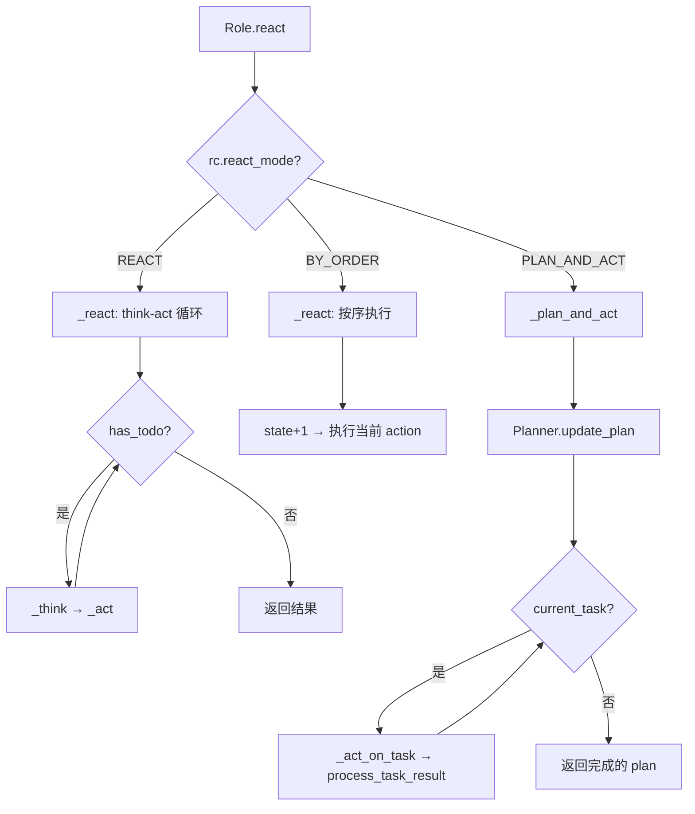
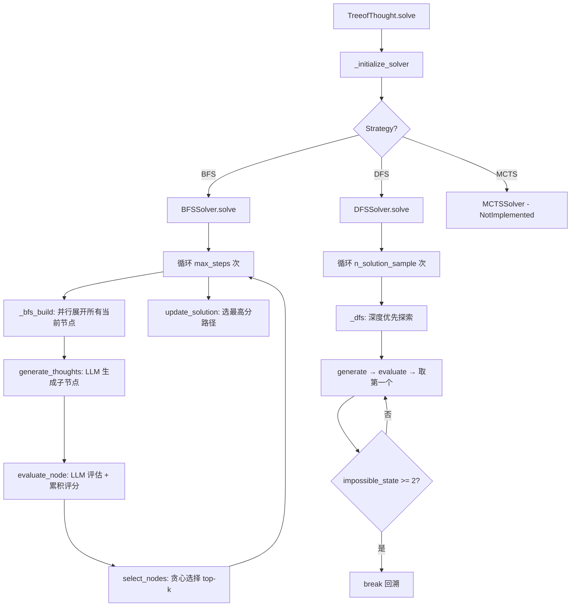
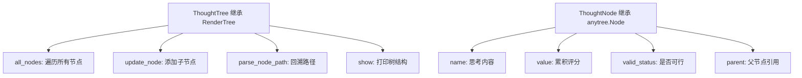
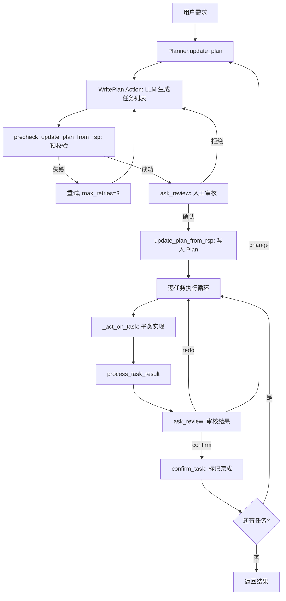

# PD-12.06 MetaGPT — Tree of Thought + Plan-and-Act 多模式推理增强

> 文档编号：PD-12.06
> 来源：MetaGPT `metagpt/strategy/tot.py` `metagpt/strategy/planner.py` `metagpt/roles/role.py`
> GitHub：https://github.com/FoundationAgents/MetaGPT.git
> 问题域：PD-12 推理增强 Reasoning Enhancement
> 状态：可复用方案

---

## 第 1 章 问题与动机

### 1.1 核心问题

Agent 系统面临的推理挑战可以归纳为三个层次：

1. **单步推理不足**：简单的 prompt → response 模式无法处理需要多步探索的复杂问题，LLM 容易陷入局部最优解
2. **复杂任务分解**：面对多步骤任务时，Agent 需要先规划再执行，而非盲目地逐步 react
3. **推理模式僵化**：不同任务需要不同的推理策略（快速响应 vs 深度规划 vs 有序执行），单一模式无法适配所有场景

MetaGPT 的核心洞察是：推理增强不是单一技术，而是一个**策略工具箱**——根据任务复杂度选择合适的推理模式。

### 1.2 MetaGPT 的解法概述

MetaGPT 在推理增强上提供了三层能力：

1. **Tree of Thought (ToT) 框架** (`metagpt/strategy/tot.py:235-278`)：完整的树搜索推理，支持 BFS/DFS/MCTS 三种搜索策略，通过节点生成→评估→选择的循环探索解空间
2. **Plan-and-Act 模式** (`metagpt/strategy/planner.py:58-193`)：先用 LLM 生成任务计划（含依赖关系），再逐任务执行，支持人工审核和动态计划修改
3. **三模式推理切换** (`metagpt/roles/role.py:82-86`)：`RoleReactMode` 枚举定义 `react`/`by_order`/`plan_and_act` 三种模式，Role 在运行时根据配置选择推理策略
4. **任务类型引导** (`metagpt/strategy/task_type.py:22-87`)：通过 `TaskType` 枚举为不同类型任务注入人类先验知识（guidance），引导 LLM 更好地完成特定领域任务
5. **经验检索增强** (`metagpt/strategy/experience_retriever.py:1-19`)：`ExpRetriever` 接口支持从历史经验中检索相关示例，注入到推理 prompt 中

### 1.3 设计思想

| 设计原则 | 具体实现 | 理由 | 替代方案 |
|----------|----------|------|----------|
| 策略模式解耦 | `TreeofThought` 通过 `Strategy` 枚举选择 BFS/DFS/MCTS solver | 搜索策略与树结构解耦，新增策略只需实现 `ThoughtSolverBase` | 硬编码 if-else 分支 |
| 推理模式可配置 | `RoleReactMode` 枚举 + `_set_react_mode()` 方法 | 同一 Role 类可在不同场景下使用不同推理模式 | 为每种模式创建不同 Role 子类 |
| 人类先验注入 | `TaskType.guidance` 为每种任务类型提供领域指导 prompt | 减少 LLM 在特定领域的试错成本 | 纯靠 LLM 自行推理 |
| 计划可审核 | `Planner.ask_review()` 支持人工确认/修改计划 | 关键决策点引入人类判断，降低错误传播 | 全自动执行无审核 |
| 累积评分 | `ThoughtNode.update_value(parent_value + value)` 路径累积 | 考虑完整推理路径质量而非单步评分 | 仅用当前节点评分 |

---

## 第 2 章 源码实现分析

### 2.1 架构概览

MetaGPT 的推理增强体系由三个独立但可组合的子系统构成：

```
┌─────────────────────────────────────────────────────────────┐
│                     Role.react()                            │
│                  metagpt/roles/role.py:512                   │
├──────────────┬──────────────────┬───────────────────────────┤
│  REACT 模式  │   BY_ORDER 模式   │    PLAN_AND_ACT 模式      │
│  _react()    │   _react()       │    _plan_and_act()        │
│  LLM选择动作  │   按序执行动作     │    先规划再执行             │
│  :454-470    │   :353-357       │    :472-496               │
├──────────────┴──────────────────┴───────────────────────────┤
│                                                             │
│  ┌─────────────────┐    ┌──────────────────────────────┐    │
│  │  Tree of Thought │    │         Planner               │    │
│  │  strategy/tot.py │    │   strategy/planner.py         │    │
│  │                  │    │                               │    │
│  │  BFS / DFS / MCTS│    │  Plan → Task[] → TaskResult   │    │
│  │  ThoughtTree     │    │  WritePlan + AskReview        │    │
│  │  ThoughtNode     │    │  拓扑排序 + 依赖管理            │    │
│  └─────────────────┘    └──────────────────────────────┘    │
│                                                             │
│  ┌──────────────────────────────────────────────────────┐   │
│  │  TaskType (task_type.py) + ExpRetriever              │   │
│  │  人类先验 guidance + 经验检索                          │   │
│  └──────────────────────────────────────────────────────┘   │
└─────────────────────────────────────────────────────────────┘
```

### 2.2 核心实现

#### 2.2.1 三模式推理入口



对应源码 `metagpt/roles/role.py:512-523`：
```python
async def react(self) -> Message:
    """Entry to one of three strategies by which Role reacts to the observed Message"""
    if self.rc.react_mode == RoleReactMode.REACT or self.rc.react_mode == RoleReactMode.BY_ORDER:
        rsp = await self._react()
    elif self.rc.react_mode == RoleReactMode.PLAN_AND_ACT:
        rsp = await self._plan_and_act()
    else:
        raise ValueError(f"Unsupported react mode: {self.rc.react_mode}")
    self._set_state(state=-1)  # current reaction is complete, reset state to -1
    if isinstance(rsp, AIMessage):
        rsp.with_agent(self._setting)
    return rsp
```

`RoleReactMode` 定义于 `metagpt/roles/role.py:82-89`：
```python
class RoleReactMode(str, Enum):
    REACT = "react"
    BY_ORDER = "by_order"
    PLAN_AND_ACT = "plan_and_act"
```

#### 2.2.2 Tree of Thought 搜索框架



对应源码 `metagpt/strategy/tot.py:126-178`（BFS 核心）：
```python
class BFSSolver(ThoughtSolverBase):
    async def solve(self, init_prompt=""):
        root = ThoughtNode(init_prompt)
        self.thought_tree = ThoughtTree(root)
        current_nodes = [root]
        for step in range(self.config.max_steps):
            solutions = await self._bfs_build(current_nodes)
            selected_nodes = self.select_nodes(solutions)
            current_nodes = selected_nodes
            self.thought_tree.show()
        best_solution, best_solution_path = self.update_solution()
        return best_solution_path

    async def _bfs_build(self, current_nodes):
        tasks = []
        for node in current_nodes:
            current_state = self.config.parser(node.name)
            current_value = node.value
            tasks.append(self.generate_and_evaluate_nodes(current_state, current_value, node))
        thought_nodes_list = await asyncio.gather(*tasks)  # 并行展开
        solutions = [child_node for thought_nodes in thought_nodes_list for child_node in thought_nodes]
        return solutions
```

关键设计点：
- **并行节点展开**：`asyncio.gather` 并行处理所有当前层节点的子节点生成和评估（`tot.py:168`）
- **累积评分**：`evaluate_node` 中 `node.update_value(parent_value + value)`（`tot.py:90`），路径越长评分越高
- **贪心剪枝**：`select_nodes` 按 value 降序取 top `n_select_sample`，未选中节点从树中移除（`tot.py:107-111`）

#### 2.2.3 ThoughtTree 数据结构



对应源码 `metagpt/strategy/base.py:34-109`：
```python
class ThoughtNode(Node):
    """A node representing a thought in the thought tree."""
    name: str = ""
    value: int = 0
    id: int = 0
    valid_status: bool = True

    def update_value(self, value) -> None:
        self.value = value

    def update_valid_status(self, status) -> None:
        self.valid_status = status

class ThoughtTree(RenderTree):
    @property
    def all_nodes(self) -> List[ThoughtNode]:
        return [node for _, _, node in self]

    def update_node(self, thought: List[dict] = [], current_node: ThoughtNode = None) -> List[ThoughtNode]:
        nodes = []
        for node_info in thought:
            node = ThoughtNode(
                name=node_info["node_state_instruction"], parent=current_node, id=int(node_info["node_id"])
            )
            nodes.append(node)
        return nodes

    def parse_node_path(self, node) -> List[str]:
        full_node_path = []
        while node is not None:
            full_node_path.append(node.name)
            node = node.parent
        full_node_path.reverse()
        return full_node_path
```

### 2.3 实现细节

#### Plan-and-Act 的任务生命周期



`Plan` 数据结构（`metagpt/schema.py:496-522`）使用拓扑排序管理任务依赖：
- `tasks: list[Task]` — 有序任务列表
- `task_map: dict[str, Task]` — 快速查找
- `_topological_sort()` — 确保依赖顺序
- `add_tasks()` — 智能合并新旧计划（保留公共前缀）

#### TaskType 人类先验注入

`metagpt/strategy/task_type.py:22-87` 定义了 10 种任务类型，每种携带领域特定的 guidance prompt：

```python
class TaskType(Enum):
    """By identifying specific types of tasks, we can inject human priors (guidance) to help task solving"""
    EDA = TaskTypeDef(name="eda", desc="For performing exploratory data analysis", guidance=EDA_PROMPT)
    DATA_PREPROCESS = TaskTypeDef(name="data preprocessing", ...)
    MODEL_TRAIN = TaskTypeDef(name="model train", ...)
    # ... 共 10 种
```

`Planner.get_plan_status()` 在构建 prompt 时自动注入当前任务类型的 guidance（`planner.py:178-192`），实现了**任务感知的推理增强**。

---

## 第 3 章 迁移指南

### 3.1 迁移清单

#### 阶段 1：三模式推理框架（核心，1 个文件）

- [ ] 定义 `ReactMode` 枚举：`react` / `by_order` / `plan_and_act`
- [ ] 在 Agent 基类中实现 `react()` 入口方法，根据模式分发
- [ ] 实现 `_react()` 方法：think-act 循环 + `max_react_loop` 防无限循环
- [ ] 实现 `_plan_and_act()` 方法：先规划再逐任务执行

#### 阶段 2：Plan-and-Act 子系统（2 个文件）

- [ ] 定义 `Task` 和 `Plan` 数据模型（含 `dependent_task_ids`）
- [ ] 实现 `Planner` 类：`update_plan()` / `process_task_result()` / `confirm_task()`
- [ ] 实现 `WritePlan` Action：LLM 生成 JSON 格式任务列表
- [ ] 实现拓扑排序确保任务依赖顺序
- [ ] （可选）实现 `AskReview` 人工审核节点

#### 阶段 3：Tree of Thought（3 个文件，按需）

- [ ] 定义 `ThoughtNode`（继承 anytree.Node）和 `ThoughtTree`（继承 RenderTree）
- [ ] 实现 `ThoughtSolverBase`：`generate_thoughts()` / `evaluate_node()` / `select_nodes()`
- [ ] 实现 `BFSSolver`：并行展开 + 贪心选择
- [ ] 实现 `DFSSolver`：深度优先 + impossible state 回溯
- [ ] 定义 `ThoughtSolverConfig`：`max_steps` / `n_generate_sample` / `n_select_sample`

#### 阶段 4：任务类型引导（可选增强）

- [ ] 定义 `TaskType` 枚举，每种类型携带 `guidance` prompt
- [ ] 在 Planner 构建 prompt 时注入当前任务类型的 guidance

### 3.2 适配代码模板

#### 最小可用的三模式推理框架

```python
"""
三模式推理框架 — 从 MetaGPT 提取的可移植模板
依赖：pydantic, asyncio
"""
from enum import Enum
from typing import Any, Optional
from pydantic import BaseModel, Field


class ReactMode(str, Enum):
    REACT = "react"           # think-act 循环，LLM 动态选择动作
    BY_ORDER = "by_order"     # 按预定义顺序执行动作
    PLAN_AND_ACT = "plan_and_act"  # 先规划再执行


class Task(BaseModel):
    task_id: str = ""
    dependent_task_ids: list[str] = []
    instruction: str = ""
    task_type: str = ""
    code: str = ""
    result: str = ""
    is_success: bool = False
    is_finished: bool = False


class Plan(BaseModel):
    goal: str
    tasks: list[Task] = []
    current_task_id: str = ""

    @property
    def current_task(self) -> Optional[Task]:
        return next((t for t in self.tasks if t.task_id == self.current_task_id), None)

    def finish_current_task(self):
        if task := self.current_task:
            task.is_finished = True
        # 找下一个未完成且依赖已满足的任务
        for t in self.tasks:
            if not t.is_finished and all(
                any(d.task_id == dep_id and d.is_finished for d in self.tasks)
                for dep_id in t.dependent_task_ids
            ):
                self.current_task_id = t.task_id
                return
        self.current_task_id = ""  # 全部完成


class BaseAgent:
    """三模式推理 Agent 基类"""

    def __init__(self, react_mode: ReactMode = ReactMode.REACT, max_react_loop: int = 5):
        self.react_mode = react_mode
        self.max_react_loop = max_react_loop
        self.plan: Optional[Plan] = None
        self.actions: list = []
        self.state: int = -1

    async def react(self, message: str) -> str:
        if self.react_mode == ReactMode.REACT:
            return await self._react(message)
        elif self.react_mode == ReactMode.BY_ORDER:
            return await self._by_order(message)
        elif self.react_mode == ReactMode.PLAN_AND_ACT:
            return await self._plan_and_act(message)

    async def _react(self, message: str) -> str:
        """ReAct: think-act 循环"""
        result = ""
        for _ in range(self.max_react_loop):
            action = await self._think(message)
            if action is None:
                break
            result = await self._act(action)
        return result

    async def _by_order(self, message: str) -> str:
        """按序执行所有 action"""
        result = ""
        for action in self.actions:
            result = await self._act(action)
        return result

    async def _plan_and_act(self, message: str) -> str:
        """先规划再执行"""
        self.plan = await self._create_plan(message)
        while self.plan.current_task:
            task = self.plan.current_task
            result = await self._execute_task(task)
            task.result = result
            task.is_success = True  # 简化：实际应检查执行结果
            self.plan.finish_current_task()
        return self._summarize_plan()

    # 以下方法由子类实现
    async def _think(self, context: str) -> Optional[Any]:
        raise NotImplementedError

    async def _act(self, action: Any) -> str:
        raise NotImplementedError

    async def _create_plan(self, goal: str) -> Plan:
        raise NotImplementedError

    async def _execute_task(self, task: Task) -> str:
        raise NotImplementedError

    def _summarize_plan(self) -> str:
        return "\n".join(f"[{'✓' if t.is_finished else '○'}] {t.instruction}" for t in self.plan.tasks)
```

### 3.3 适用场景

| 场景 | 适用度 | 推荐模式 | 说明 |
|------|--------|----------|------|
| 数据分析流水线 | ⭐⭐⭐ | plan_and_act | 任务有明确依赖链，先规划再逐步执行 |
| 开放式问答 | ⭐⭐⭐ | react | 需要动态决定下一步，think-act 循环最灵活 |
| 代码生成流水线 | ⭐⭐⭐ | by_order | PRD→设计→编码→测试，步骤固定 |
| 创意写作/头脑风暴 | ⭐⭐⭐ | ToT (BFS) | 需要探索多个方向，选最优路径 |
| 数学证明/逻辑推理 | ⭐⭐ | ToT (DFS) | 深度优先探索，遇到死胡同回溯 |
| 简单工具调用 | ⭐ | react (loop=1) | 单步 think→act 即可，无需复杂推理 |

---

## 第 4 章 测试用例

```python
"""
测试 MetaGPT 推理增强核心组件
基于真实函数签名：ThoughtNode, ThoughtTree, Plan, Task, RoleReactMode
"""
import pytest
from unittest.mock import AsyncMock, MagicMock, patch


# ---- ThoughtNode & ThoughtTree 测试 ----

class TestThoughtNode:
    def test_initial_state(self):
        """ThoughtNode 初始状态：value=0, valid_status=True"""
        from metagpt.strategy.base import ThoughtNode
        node = ThoughtNode("test thought")
        assert node.name == "test thought"
        assert node.value == 0
        assert node.valid_status is True

    def test_update_value_accumulates(self):
        """累积评分：parent_value + current_value"""
        from metagpt.strategy.base import ThoughtNode
        node = ThoughtNode("child")
        node.update_value(0 + 0.8)  # parent=0, self=0.8
        assert node.value == 0.8
        child = ThoughtNode("grandchild", parent=node)
        child.update_value(node.value + 0.6)  # 累积
        assert child.value == pytest.approx(1.4)

    def test_invalid_status_marks_dead_end(self):
        """标记不可行节点"""
        from metagpt.strategy.base import ThoughtNode
        node = ThoughtNode("dead end")
        node.update_valid_status(False)
        assert node.valid_status is False


class TestThoughtTree:
    def test_update_node_creates_children(self):
        """update_node 从 JSON 创建子节点"""
        from metagpt.strategy.base import ThoughtNode, ThoughtTree
        root = ThoughtNode("root")
        tree = ThoughtTree(root)
        thoughts = [
            {"node_id": "1", "node_state_instruction": "approach A"},
            {"node_id": "2", "node_state_instruction": "approach B"},
        ]
        children = tree.update_node(thoughts, current_node=root)
        assert len(children) == 2
        assert children[0].parent == root
        assert children[1].name == "approach B"

    def test_parse_node_path_traces_ancestry(self):
        """parse_node_path 回溯完整路径"""
        from metagpt.strategy.base import ThoughtNode, ThoughtTree
        root = ThoughtNode("step1")
        child = ThoughtNode("step2", parent=root)
        grandchild = ThoughtNode("step3", parent=child)
        tree = ThoughtTree(root)
        path = tree.parse_node_path(grandchild)
        assert path == ["step1", "step2", "step3"]


# ---- Plan & Task 测试 ----

class TestPlanTaskLifecycle:
    def test_task_reset(self):
        """Task.reset 清除执行状态"""
        from metagpt.schema import Task
        task = Task(task_id="1", instruction="test", code="print(1)", result="ok", is_success=True)
        task.reset()
        assert task.code == ""
        assert task.result == ""
        assert task.is_success is False

    def test_plan_topological_sort(self):
        """Plan._topological_sort 确保依赖顺序"""
        from metagpt.schema import Plan, Task
        tasks = [
            Task(task_id="2", dependent_task_ids=["1"], instruction="step 2"),
            Task(task_id="1", dependent_task_ids=[], instruction="step 1"),
            Task(task_id="3", dependent_task_ids=["2"], instruction="step 3"),
        ]
        plan = Plan(goal="test")
        sorted_tasks = plan._topological_sort(tasks)
        ids = [t.task_id for t in sorted_tasks]
        assert ids.index("1") < ids.index("2") < ids.index("3")

    def test_plan_add_tasks_merges_prefix(self):
        """add_tasks 保留公共前缀，追加新任务"""
        from metagpt.schema import Plan, Task
        plan = Plan(goal="test")
        plan.add_tasks([
            Task(task_id="1", instruction="step 1"),
            Task(task_id="2", dependent_task_ids=["1"], instruction="step 2"),
        ])
        assert len(plan.tasks) == 2
        # 再次 add 修改后的计划
        plan.add_tasks([
            Task(task_id="1", instruction="step 1"),  # 相同前缀
            Task(task_id="2", dependent_task_ids=["1"], instruction="step 2 revised"),
            Task(task_id="3", dependent_task_ids=["2"], instruction="step 3"),
        ])
        assert len(plan.tasks) == 3


# ---- RoleReactMode 测试 ----

class TestRoleReactMode:
    def test_mode_values(self):
        """三种模式枚举值"""
        from metagpt.roles.role import RoleReactMode
        assert RoleReactMode.REACT.value == "react"
        assert RoleReactMode.BY_ORDER.value == "by_order"
        assert RoleReactMode.PLAN_AND_ACT.value == "plan_and_act"
        assert len(RoleReactMode.values()) == 3


# ---- BFSSolver 选择逻辑测试 ----

class TestBFSSolverSelection:
    def test_greedy_select_top_k(self):
        """贪心选择：按 value 降序取 top n_select_sample"""
        from metagpt.strategy.base import ThoughtNode
        from metagpt.strategy.tot import BFSSolver
        from metagpt.strategy.tot_schema import ThoughtSolverConfig, MethodSelect

        config = ThoughtSolverConfig(n_select_sample=2, method_select=MethodSelect.GREEDY)
        solver = BFSSolver(config=config)

        root = ThoughtNode("root")
        nodes = [ThoughtNode(f"n{i}", parent=root) for i in range(4)]
        nodes[0].update_value(0.9)
        nodes[1].update_value(0.3)
        nodes[2].update_value(0.7)
        nodes[3].update_value(0.5)

        selected = solver.select_nodes(nodes)
        assert len(selected) == 2
        assert selected[0].value == 0.9
        assert selected[1].value == 0.7
        # 未选中节点从树中移除
        assert nodes[1].parent is None
        assert nodes[3].parent is None


# ---- ThoughtSolverConfig 默认值测试 ----

class TestThoughtSolverConfig:
    def test_default_config(self):
        """默认配置值"""
        from metagpt.strategy.tot_schema import ThoughtSolverConfig, MethodSelect
        config = ThoughtSolverConfig()
        assert config.max_steps == 3
        assert config.n_generate_sample == 5
        assert config.n_select_sample == 3
        assert config.n_solution_sample == 5
        assert config.method_select == MethodSelect.GREEDY
```

---

## 第 5 章 跨域关联

| 关联域 | 关系类型 | 说明 |
|--------|----------|------|
| PD-01 上下文管理 | 协同 | `Planner.get_useful_memories()` 精心筛选上下文（只传结构化计划状态而非全部历史），是上下文窗口管理的实践；`working_memory` 每任务清空避免上下文膨胀 |
| PD-02 多 Agent 编排 | 依赖 | `RoleReactMode` 决定单个 Agent 的推理策略，而多 Agent 编排决定 Agent 间的协作模式；MetaGPT 的 `thinking_command.py` 中 `Command` 枚举将计划操作和环境交互统一为命令，是编排与推理的桥梁 |
| PD-04 工具系统 | 协同 | `TaskType` 枚举与工具推荐系统（`BM25ToolRecommender`）配合，根据任务类型推荐合适工具，推理增强指导工具选择 |
| PD-07 质量检查 | 协同 | `Planner.ask_review()` 在计划生成和任务执行后引入人工审核，`precheck_update_plan_from_rsp()` 在写入前预校验计划合法性 |
| PD-09 Human-in-the-Loop | 依赖 | Plan-and-Act 模式的 `AskReview` 是 HITL 的典型实现：支持 confirm/change/redo/exit 四种人工反馈，审核结果直接影响计划走向 |
| PD-11 可观测性 | 协同 | `ThoughtTree.show()` 打印树结构用于调试，`DataInterpreter` 中 `ThoughtReporter` 提供推理过程的流式可观测性 |

---

## 第 6 章 来源文件索引

| 文件 | 行范围 | 关键实现 |
|------|--------|----------|
| `metagpt/roles/role.py` | L82-89 | `RoleReactMode` 枚举定义三种推理模式 |
| `metagpt/roles/role.py` | L261-282 | `_set_react_mode()` 模式配置方法 |
| `metagpt/roles/role.py` | L340-379 | `_think()` 方法：LLM 动态选择下一个 action |
| `metagpt/roles/role.py` | L454-470 | `_react()` 方法：think-act 循环实现 |
| `metagpt/roles/role.py` | L472-496 | `_plan_and_act()` 方法：先规划再执行 |
| `metagpt/roles/role.py` | L512-523 | `react()` 入口：三模式分发 |
| `metagpt/strategy/planner.py` | L58-193 | `Planner` 类：计划管理、任务审核、上下文构建 |
| `metagpt/strategy/planner.py` | L77-100 | `update_plan()` 方法：LLM 生成计划 + 预校验 + 人工审核 |
| `metagpt/strategy/planner.py` | L155-167 | `get_useful_memories()` 方法：结构化上下文构建 |
| `metagpt/strategy/tot.py` | L33-123 | `ThoughtSolverBase`：生成、评估、选择的基础框架 |
| `metagpt/strategy/tot.py` | L126-178 | `BFSSolver`：BFS 搜索 + asyncio.gather 并行展开 |
| `metagpt/strategy/tot.py` | L180-227 | `DFSSolver`：DFS 搜索 + impossible state 回溯 |
| `metagpt/strategy/tot.py` | L235-278 | `TreeofThought`：策略模式入口，根据 Strategy 枚举选择 solver |
| `metagpt/strategy/base.py` | L34-49 | `ThoughtNode`：树节点，含 value 累积评分和 valid_status |
| `metagpt/strategy/base.py` | L51-109 | `ThoughtTree`：树结构，支持节点更新和路径回溯 |
| `metagpt/strategy/tot_schema.py` | L1-31 | `Strategy` 枚举、`MethodSelect` 枚举、`ThoughtSolverConfig` 配置 |
| `metagpt/strategy/task_type.py` | L22-87 | `TaskType` 枚举：10 种任务类型 + 领域 guidance |
| `metagpt/strategy/solver.py` | L15-78 | `BaseSolver` 及 NaiveSolver/TOTSolver/COTSolver/ReActSolver 接口 |
| `metagpt/strategy/experience_retriever.py` | L6-19 | `ExpRetriever` 接口：经验检索注入推理 prompt |
| `metagpt/strategy/thinking_command.py` | L13-76 | `Command` 枚举：计划操作 + 环境交互统一命令体系 |
| `metagpt/actions/di/write_plan.py` | L43-51 | `WritePlan` Action：LLM 生成 JSON 任务列表 |
| `metagpt/actions/di/ask_review.py` | L27-62 | `AskReview` Action：人工审核交互 |
| `metagpt/roles/di/data_interpreter.py` | L36-80 | `DataInterpreter`：plan_and_act 模式的实际应用 |
| `metagpt/schema.py` | L457-478 | `Task` 和 `TaskResult` 数据模型 |
| `metagpt/schema.py` | L496-556 | `Plan` 类：拓扑排序、任务合并、依赖管理 |

---

## 第 7 章 横向对比维度

```json comparison_data
{
  "project": "MetaGPT",
  "dimensions": {
    "推理方式": "三模式可切换：ReAct think-act 循环 / 按序执行 / Plan-and-Act 先规划再执行",
    "模型策略": "单模型，通过 TaskType guidance 注入领域先验替代多模型分层",
    "成本": "ToT BFS 每层 n_generate×n_select 次 LLM 调用，Plan-and-Act 每任务 1 次",
    "适用场景": "软件开发全流程（PRD→设计→编码）、数据分析、开放式问答",
    "推理模式": "RoleReactMode 枚举：react/by_order/plan_and_act，运行时可配置",
    "输出结构": "ToT 输出 JSON node_list，Plan 输出 JSON task_list，均为结构化格式",
    "增强策略": "ToT 树搜索 + TaskType 先验注入 + ExpRetriever 经验检索",
    "成本控制": "max_react_loop 限制循环次数，max_steps 限制树深度，max_tasks 限制计划规模",
    "树构建": "ThoughtTree 基于 anytree，BFS 并行展开 + 贪心剪枝，DFS 深度探索 + 死胡同回溯",
    "专家知识集成": "TaskType.guidance 为 10 种任务类型注入领域 prompt，ExpRetriever 检索历史经验"
  }
}
```

### 域元数据补充

```json domain_metadata
{
  "solution_summary": "MetaGPT 用 RoleReactMode 三模式切换（react/by_order/plan_and_act）+ TreeofThought BFS/DFS 树搜索 + TaskType 领域先验注入实现多层次推理增强",
  "description": "推理模式应作为 Agent 基类的可配置属性，而非硬编码到子类中",
  "sub_problems": [
    "Tree of Thought：通过树搜索探索多条推理路径并选择最优解",
    "任务类型先验注入：根据任务类型自动注入领域特定的 guidance prompt",
    "计划预校验：在人工审核前先用代码校验计划合法性，减少无效审核"
  ],
  "best_practices": [
    "推理模式枚举化：将 react/by_order/plan_and_act 定义为枚举，Agent 运行时可切换",
    "ToT 并行展开：BFS 层级内用 asyncio.gather 并行生成和评估节点，减少延迟",
    "计划合并保留前缀：更新计划时保留与旧计划的公共前缀，避免重复执行已完成任务"
  ]
}
```
