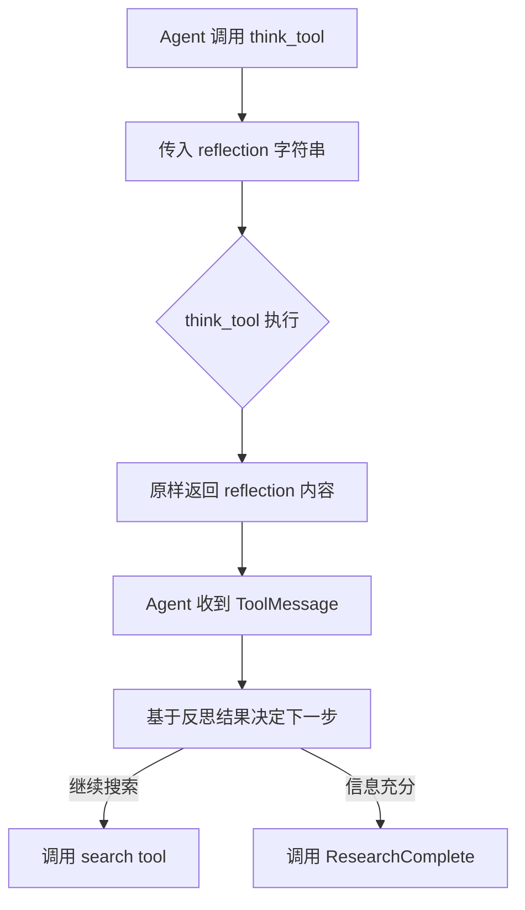
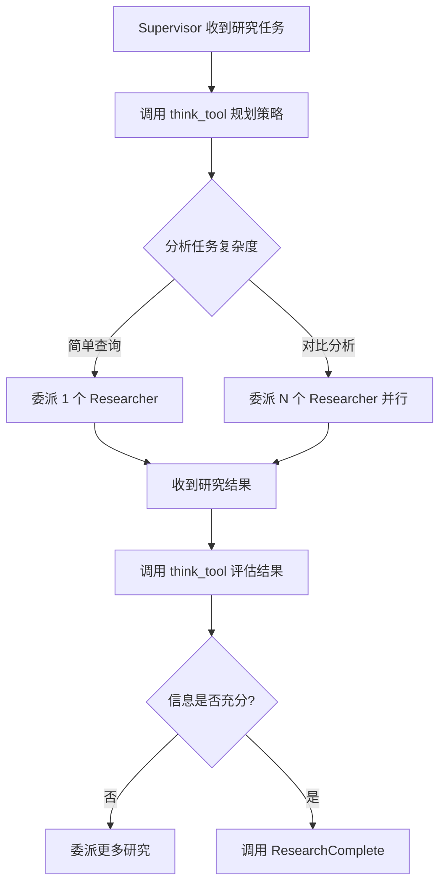
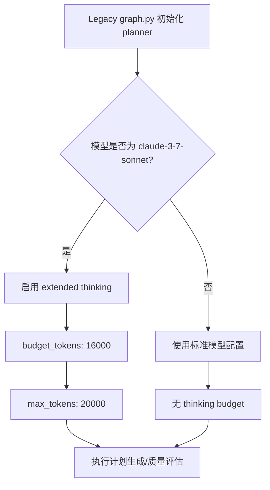

# PD-12.06 Open Deep Research — think_tool 结构化反思与分层推理增强

> 文档编号：PD-12.06
> 来源：Open Deep Research `src/open_deep_research/utils.py`, `src/open_deep_research/deep_researcher.py`, `src/legacy/graph.py`
> GitHub：https://github.com/langchain-ai/open_deep_research.git
> 问题域：PD-12 推理增强 Reasoning Enhancement
> 状态：可复用方案

---

## 第 1 章 问题与动机

### 1.1 核心问题

在多 Agent 深度研究系统中，LLM 容易陷入"搜索-回答"的机械循环：搜索一次就急于给出结论，或者无限搜索却不知何时停止。核心挑战是：

1. **缺乏反思暂停点**：Agent 在工具调用之间没有结构化的"思考时间"，导致搜索策略随机、信息收集不完整
2. **Supervisor 决策盲目**：研究主管在委派子任务前后缺乏系统性评估，无法判断何时信息已足够
3. **推理预算浪费**：所有任务使用相同的推理深度，简单查询和复杂分析消耗同样的 token
4. **跨模型推理能力差异**：不同模型（Claude、GPT-4、Gemini）的推理增强方式完全不同，需要统一抽象

### 1.2 Open Deep Research 的解法概述

Open Deep Research 通过三层推理增强策略解决上述问题：

1. **think_tool 零副作用反思工具**：定义在 `src/open_deep_research/utils.py:219-244`，一个不产生外部效果的工具，强制 Agent 在每次搜索后暂停并进行 gap assessment + strategic planning
2. **Prompt 嵌入式 Show Your Thinking 指令**：在 `src/open_deep_research/prompts.py:112-121` 和 `prompts.py:176-182` 中，通过 prompt 模板强制 Supervisor 和 Researcher 在工具调用前后使用 think_tool 反思
3. **Legacy 版本 Extended Thinking 预算**：在 `src/legacy/graph.py:119-124` 中，为 Claude 3.7 Sonnet 分配专用 16000 tokens 的 thinking budget，启用模型原生深度推理
4. **可配置迭代预算**：通过 `configuration.py:94-118` 的 `max_researcher_iterations` 和 `max_react_tool_calls` 控制推理深度上限
5. **多提供商搜索抽象**：支持 Tavily/Anthropic/OpenAI 三种搜索 API，每种有不同的推理集成方式（`utils.py:531-567`）

### 1.3 设计思想

| 设计原则 | 具体实现 | 理由 | 替代方案 |
|----------|----------|------|----------|
| 零副作用反思 | think_tool 只返回输入内容，不触发任何外部操作 | 给 LLM 一个"内心独白"空间，不污染外部状态 | 在 system prompt 中要求"先思考再行动"（不可靠） |
| Prompt 强制反思 | `<Show Your Thinking>` 标签明确要求调用 think_tool | 仅靠工具定义不够，需要 prompt 级别的行为约束 | 依赖模型自发反思（不稳定） |
| 分层推理预算 | Legacy 版为 Claude 分配 16000 token thinking budget，主版本用 think_tool | 不同模型需要不同的推理增强方式 | 统一使用 extended thinking（不兼容非 Anthropic 模型） |
| 迭代预算硬限制 | max_researcher_iterations=6, max_react_tool_calls=10 | 防止无限推理循环，控制成本 | 让模型自行判断何时停止（不可靠） |
| Supervisor-Researcher 分层反思 | Supervisor 反思"是否需要更多研究"，Researcher 反思"搜索结果是否充分" | 不同层级的反思关注点不同 | 单一 Agent 同时负责规划和执行（职责混乱） |

---

## 第 2 章 源码实现分析

### 2.1 架构概览

Open Deep Research 的推理增强贯穿整个三层架构：

```
┌─────────────────────────────────────────────────────────────┐
│                    Main Deep Researcher Graph                │
│                                                              │
│  START → clarify_with_user → write_research_brief            │
│              ↓                                               │
│  ┌──────────────────────────────────────────────┐            │
│  │         research_supervisor (subgraph)        │            │
│  │                                               │            │
│  │  supervisor ←──→ supervisor_tools             │            │
│  │      │              │                         │            │
│  │      │         think_tool (反思)              │            │
│  │      │         ConductResearch (委派)         │            │
│  │      │         ResearchComplete (完成)        │            │
│  │      │              │                         │            │
│  │      │    ┌─────────┴──────────┐              │            │
│  │      │    │ researcher_subgraph │ ×N (并行)   │            │
│  │      │    │                     │              │            │
│  │      │    │ researcher ←→ tools │              │            │
│  │      │    │      │              │              │            │
│  │      │    │ think_tool (反思)   │              │            │
│  │      │    │ tavily_search       │              │            │
│  │      │    │      ↓              │              │            │
│  │      │    │ compress_research   │              │            │
│  │      │    └─────────────────────┘              │            │
│  └──────────────────────────────────────────────┘            │
│              ↓                                               │
│  final_report_generation → END                               │
└─────────────────────────────────────────────────────────────┘
```

### 2.2 核心实现

#### 2.2.1 think_tool：零副作用反思工具



对应源码 `src/open_deep_research/utils.py:219-244`：

```python
@tool(description="Strategic reflection tool for research planning")
def think_tool(reflection: str) -> str:
    """Tool for strategic reflection on research progress and decision-making.

    Use this tool after each search to analyze results and plan next steps systematically.
    This creates a deliberate pause in the research workflow for quality decision-making.

    When to use:
    - After receiving search results: What key information did I find?
    - Before deciding next steps: Do I have enough to answer comprehensively?
    - When assessing research gaps: What specific information am I still missing?
    - Before concluding research: Can I provide a complete answer now?

    Reflection should address:
    1. Analysis of current findings - What concrete information have I gathered?
    2. Gap assessment - What crucial information is still missing?
    3. Quality evaluation - Do I have sufficient evidence/examples for a good answer?
    4. Strategic decision - Should I continue searching or provide my answer?

    Args:
        reflection: Your detailed reflection on research progress, findings, gaps, and next steps

    Returns:
        Confirmation that reflection was recorded for decision-making
    """
    return f"Reflection recorded: {reflection}"
```

关键设计：工具的 docstring 本身就是推理指引，定义了反思的四个维度（findings analysis、gap assessment、quality evaluation、strategic decision）。工具实现只是原样返回，真正的推理发生在 LLM 构造 `reflection` 参数的过程中。

#### 2.2.2 Supervisor 层反思：规划前后的 think_tool 调用



对应源码 `src/open_deep_research/prompts.py:92-121`（lead_researcher_prompt 中的 Show Your Thinking 指令）：

```python
lead_researcher_prompt = """You are a research supervisor...

<Show Your Thinking>
Before you call ConductResearch tool call, use think_tool to plan your approach:
- Can the task be broken down into smaller sub-tasks?

After each ConductResearch tool call, use think_tool to analyze the results:
- What key information did I find?
- What's missing?
- Do I have enough to answer the question comprehensively?
- Should I delegate more research or call ResearchComplete?
</Show Your Thinking>

<Hard Limits>
**Task Delegation Budgets** (Prevent excessive delegation):
- **Bias towards single agent** - Use single agent for simplicity unless the user request has clear opportunity for parallelization
- **Stop when you can answer confidently** - Don't keep delegating research for perfection
- **Limit tool calls** - Always stop after {max_researcher_iterations} tool calls to ConductResearch and think_tool if you cannot find the right sources

**Maximum {max_concurrent_research_units} parallel agents per iteration**
</Hard Limits>
..."""
```

Supervisor 的工具绑定在 `deep_researcher.py:202`：

```python
lead_researcher_tools = [ConductResearch, ResearchComplete, think_tool]
```

三个工具形成完整的推理闭环：think_tool 负责反思，ConductResearch 负责委派，ResearchComplete 负责终止。

#### 2.2.3 Researcher 层反思：搜索后的强制暂停

对应源码 `src/open_deep_research/prompts.py:146-182`（research_system_prompt）：

```python
research_system_prompt = """You are a research assistant...

<Available Tools>
1. **tavily_search**: For conducting web searches to gather information
2. **think_tool**: For reflection and strategic planning during research

**CRITICAL: Use think_tool after each search to reflect on results and plan next steps.
Do not call think_tool with the tavily_search or any other tools.
It should be to reflect on the results of the search.**
</Available Tools>

<Hard Limits>
**Tool Call Budgets** (Prevent excessive searching):
- **Simple queries**: Use 2-3 search tool calls maximum
- **Complex queries**: Use up to 5 search tool calls maximum
- **Always stop**: After 5 search tool calls if you cannot find the right sources

**Stop Immediately When**:
- You can answer the user's question comprehensively
- You have 3+ relevant examples/sources for the question
- Your last 2 searches returned similar information
</Hard Limits>

<Show Your Thinking>
After each search tool call, use think_tool to analyze the results:
- What key information did I find?
- What's missing?
- Do I have enough to answer the question comprehensively?
- Should I search more or provide my answer?
</Show Your Thinking>
"""
```

注意 prompt 中的 **CRITICAL** 约束：think_tool 不能与搜索工具并行调用，必须在搜索之后单独调用。这确保了反思是一个独立的、有意识的步骤。

#### 2.2.4 Legacy 版本：Claude Extended Thinking 预算



对应源码 `src/legacy/graph.py:119-131`：

```python
if planner_model == "claude-3-7-sonnet-latest":
    # Allocate a thinking budget for claude-3-7-sonnet-latest as the planner model
    planner_llm = init_chat_model(model=planner_model, 
                                  model_provider=planner_provider, 
                                  max_tokens=20_000, 
                                  thinking={"type": "enabled", "budget_tokens": 16_000})
else:
    # With other models, thinking tokens are not specifically allocated
    planner_llm = init_chat_model(model=planner_model, 
                                  model_provider=planner_provider,
                                  model_kwargs=planner_model_kwargs)
```

同样的模式在 `src/legacy/graph.py:328-336` 的 section grading（质量评估）中复用：

```python
if planner_model == "claude-3-7-sonnet-latest":
    reflection_model = init_chat_model(model=planner_model, 
                                       model_provider=planner_provider, 
                                       max_tokens=20_000, 
                                       thinking={"type": "enabled", "budget_tokens": 16_000}).with_structured_output(Feedback)
else:
    reflection_model = init_chat_model(model=planner_model, 
                                       model_provider=planner_provider, 
                                       model_kwargs=planner_model_kwargs).with_structured_output(Feedback)
```

### 2.3 实现细节

#### 迭代预算控制

Supervisor 的迭代控制在 `deep_researcher.py:247-262`：

```python
exceeded_allowed_iterations = research_iterations > configurable.max_researcher_iterations
no_tool_calls = not most_recent_message.tool_calls
research_complete_tool_call = any(
    tool_call["name"] == "ResearchComplete" 
    for tool_call in most_recent_message.tool_calls
)

if exceeded_allowed_iterations or no_tool_calls or research_complete_tool_call:
    return Command(goto=END, update={...})
```

三重终止条件：超过迭代上限 OR 模型不再调用工具 OR 显式调用 ResearchComplete。

#### Token 超限渐进截断

最终报告生成的 token 超限处理在 `deep_researcher.py:661-683`：

```python
if is_token_limit_exceeded(e, configurable.final_report_model):
    current_retry += 1
    if current_retry == 1:
        model_token_limit = get_model_token_limit(configurable.final_report_model)
        findings_token_limit = model_token_limit * 4  # 字符近似
    else:
        findings_token_limit = int(findings_token_limit * 0.9)  # 每次减少 10%
    findings = findings[:findings_token_limit]
```

#### 多提供商 Token 限制检测

`utils.py:665-785` 实现了 OpenAI/Anthropic/Gemini 三家的 token 超限异常检测，每家的错误模式完全不同：
- OpenAI: `BadRequestError` + `context_length_exceeded`
- Anthropic: `BadRequestError` + `prompt is too long`
- Gemini: `ResourceExhausted` 异常类


---

## 第 3 章 迁移指南

### 3.1 迁移清单

**阶段 1：基础反思工具（1 天）**
- [ ] 实现 think_tool 零副作用反思工具
- [ ] 在 Agent 的工具列表中注册 think_tool
- [ ] 在 system prompt 中添加 `<Show Your Thinking>` 指令

**阶段 2：分层反思集成（2 天）**
- [ ] 为 Supervisor 层添加反思指令（委派前后）
- [ ] 为 Researcher 层添加反思指令（搜索后）
- [ ] 配置迭代预算上限（max_iterations, max_tool_calls）

**阶段 3：Extended Thinking 集成（可选）**
- [ ] 为 Anthropic 模型添加 thinking budget 配置
- [ ] 实现模型检测逻辑（仅 Claude 3.7+ 启用）
- [ ] 配置 max_tokens 和 budget_tokens 参数

**阶段 4：Token 超限容错（1 天）**
- [ ] 实现多提供商 token 超限检测
- [ ] 添加渐进截断重试逻辑
- [ ] 配置 MODEL_TOKEN_LIMITS 映射表

### 3.2 适配代码模板

#### 模板 1：通用 think_tool 实现

```python
from langchain_core.tools import tool

@tool(description="Strategic reflection tool for research planning")
def think_tool(reflection: str) -> str:
    """Zero-side-effect reflection tool for structured reasoning.
    
    Use after each tool call to:
    1. Analyze current findings
    2. Assess information gaps
    3. Evaluate quality of evidence
    4. Decide next action (continue or conclude)
    
    Args:
        reflection: Detailed reflection on progress and next steps
    Returns:
        Confirmation string (content is irrelevant, reasoning happens in arg construction)
    """
    return f"Reflection recorded: {reflection}"
```

#### 模板 2：带 Extended Thinking 的模型初始化

```python
from langchain.chat_models import init_chat_model

def create_reasoning_model(model_name: str, provider: str, **kwargs):
    """Create a model with appropriate reasoning enhancement based on provider."""
    
    if model_name.startswith("claude-3-7") or model_name.startswith("claude-sonnet-4"):
        # Anthropic models: use native extended thinking
        return init_chat_model(
            model=model_name,
            model_provider=provider,
            max_tokens=20_000,
            thinking={"type": "enabled", "budget_tokens": 16_000}
        )
    else:
        # Other models: rely on think_tool for structured reflection
        return init_chat_model(
            model=model_name,
            model_provider=provider,
            **kwargs
        )
```

#### 模板 3：Prompt 中的 Show Your Thinking 模板

```python
SHOW_YOUR_THINKING_TEMPLATE = """
<Show Your Thinking>
{when_to_think}

When using think_tool, address these dimensions:
1. **Findings Analysis** - What concrete information have I gathered?
2. **Gap Assessment** - What crucial information is still missing?
3. **Quality Evaluation** - Do I have sufficient evidence for a good answer?
4. **Strategic Decision** - Should I continue or provide my answer?

**CRITICAL: Do not call think_tool in parallel with other tools. 
It must be a separate, deliberate step.**
</Show Your Thinking>

<Hard Limits>
- Maximum {max_iterations} tool call iterations
- Stop when you can answer confidently
- Stop if last 2 searches returned similar information
</Hard Limits>
"""
```

#### 模板 4：多提供商 Token 超限检测

```python
def is_token_limit_exceeded(exception: Exception, model_name: str = None) -> bool:
    """Detect token limit errors across OpenAI, Anthropic, and Google providers."""
    error_str = str(exception).lower()
    
    # Provider detection from model name
    provider = None
    if model_name:
        model_str = str(model_name).lower()
        if model_str.startswith('openai:'):
            provider = 'openai'
        elif model_str.startswith('anthropic:'):
            provider = 'anthropic'
        elif model_str.startswith('google:') or model_str.startswith('gemini:'):
            provider = 'gemini'
    
    # OpenAI: BadRequestError + context_length_exceeded
    if provider in (None, 'openai'):
        if 'context_length_exceeded' in error_str or (
            exception.__class__.__name__ == 'BadRequestError' and 
            any(kw in error_str for kw in ['token', 'context', 'length'])
        ):
            return True
    
    # Anthropic: BadRequestError + "prompt is too long"
    if provider in (None, 'anthropic'):
        if 'prompt is too long' in error_str:
            return True
    
    # Google: ResourceExhausted
    if provider in (None, 'gemini'):
        if exception.__class__.__name__ in ['ResourceExhausted', 'GoogleGenerativeAIFetchError']:
            return True
    
    return False
```

### 3.3 适用场景

| 场景 | 适用度 | 说明 |
|------|--------|------|
| 多轮搜索研究 Agent | ⭐⭐⭐ | think_tool 在搜索间隙提供结构化反思，显著提升信息收集质量 |
| Supervisor-Worker 架构 | ⭐⭐⭐ | 分层反思让 Supervisor 的委派决策更有依据 |
| 单 Agent 问答 | ⭐⭐ | 简单问答不需要反思工具，增加不必要的 token 消耗 |
| 代码生成 Agent | ⭐⭐ | 可用于"写代码前先思考方案"，但 extended thinking 更适合 |
| 实时对话系统 | ⭐ | 反思步骤增加延迟，不适合低延迟场景 |

---

## 第 4 章 测试用例

```python
import pytest
from unittest.mock import AsyncMock, MagicMock, patch
from langchain_core.messages import AIMessage, HumanMessage, ToolMessage


class TestThinkTool:
    """Tests for the zero-side-effect reflection tool."""
    
    def test_think_tool_returns_reflection(self):
        """think_tool should return the reflection content unchanged."""
        from open_deep_research.utils import think_tool
        result = think_tool.invoke({"reflection": "I found 3 relevant sources about AI safety."})
        assert "Reflection recorded:" in result
        assert "3 relevant sources" in result
    
    def test_think_tool_no_side_effects(self):
        """think_tool should not modify any external state."""
        from open_deep_research.utils import think_tool
        # Call multiple times - should be idempotent
        result1 = think_tool.invoke({"reflection": "First reflection"})
        result2 = think_tool.invoke({"reflection": "Second reflection"})
        assert "First reflection" in result1
        assert "Second reflection" in result2
    
    def test_think_tool_has_correct_metadata(self):
        """think_tool should have proper tool description for LLM guidance."""
        from open_deep_research.utils import think_tool
        assert "reflection" in think_tool.description.lower()
        assert "research" in think_tool.description.lower()


class TestSupervisorIterationControl:
    """Tests for supervisor iteration budget enforcement."""
    
    def test_exceeds_max_iterations_triggers_exit(self):
        """Supervisor should exit when max iterations exceeded."""
        from open_deep_research.configuration import Configuration
        config = Configuration()
        # Default max_researcher_iterations is 6
        assert config.max_researcher_iterations == 6
        # research_iterations > 6 should trigger exit
        research_iterations = 7
        assert research_iterations > config.max_researcher_iterations
    
    def test_research_complete_triggers_exit(self):
        """ResearchComplete tool call should trigger supervisor exit."""
        tool_calls = [{"name": "ResearchComplete", "id": "call_1", "args": {}}]
        research_complete = any(tc["name"] == "ResearchComplete" for tc in tool_calls)
        assert research_complete is True
    
    def test_no_tool_calls_triggers_exit(self):
        """Empty tool calls should trigger supervisor exit."""
        tool_calls = []
        assert not tool_calls  # Falsy = exit condition


class TestTokenLimitDetection:
    """Tests for multi-provider token limit exceeded detection."""
    
    def test_openai_context_length_exceeded(self):
        """Should detect OpenAI context_length_exceeded errors."""
        from open_deep_research.utils import is_token_limit_exceeded
        
        class FakeOpenAIError(Exception):
            code = "context_length_exceeded"
            type = "invalid_request_error"
        
        error = FakeOpenAIError("context_length_exceeded")
        # Without model name, checks all providers
        assert is_token_limit_exceeded(error) is True
    
    def test_anthropic_prompt_too_long(self):
        """Should detect Anthropic 'prompt is too long' errors."""
        from open_deep_research.utils import is_token_limit_exceeded
        error = Exception("prompt is too long: 250000 tokens > 200000 maximum")
        assert is_token_limit_exceeded(error, "anthropic:claude-sonnet-4") is True
    
    def test_normal_error_not_detected(self):
        """Should not flag normal errors as token limit exceeded."""
        from open_deep_research.utils import is_token_limit_exceeded
        error = Exception("Connection timeout")
        assert is_token_limit_exceeded(error) is False


class TestExtendedThinkingBudget:
    """Tests for Legacy version's Claude extended thinking budget."""
    
    def test_claude_37_gets_thinking_budget(self):
        """Claude 3.7 Sonnet should receive 16000 token thinking budget."""
        planner_model = "claude-3-7-sonnet-latest"
        # This is the condition from legacy/graph.py:119
        assert planner_model == "claude-3-7-sonnet-latest"
        budget_tokens = 16_000
        max_tokens = 20_000
        assert budget_tokens < max_tokens
        assert budget_tokens == 16000
    
    def test_non_claude_no_thinking_budget(self):
        """Non-Claude models should not receive thinking budget."""
        planner_model = "gpt-4.1"
        assert planner_model != "claude-3-7-sonnet-latest"
        # Should use standard model_kwargs instead
```


---

## 第 5 章 跨域关联

| 关联域 | 关系类型 | 说明 |
|--------|----------|------|
| PD-01 上下文管理 | 协同 | think_tool 的反思内容占用上下文窗口，token 超限时需要渐进截断（`deep_researcher.py:661-683`）；compress_research 节点压缩研究发现以控制上下文长度 |
| PD-02 多 Agent 编排 | 依赖 | 分层反思依赖 Supervisor-Researcher 的层级编排架构；think_tool 在两层中的使用方式不同（规划 vs 评估） |
| PD-04 工具系统 | 协同 | think_tool 作为零副作用工具注册在工具系统中（`utils.py:579`），与 search tool、ResearchComplete 共同组成工具集 |
| PD-08 搜索与检索 | 协同 | think_tool 的反思发生在搜索调用之间，形成"搜索→反思→搜索"循环；搜索结果质量直接影响反思内容 |
| PD-09 Human-in-the-Loop | 协同 | Legacy 版本的 human_feedback 节点（`legacy/graph.py:142-192`）在计划生成后引入人工审核，与 think_tool 的自动反思互补 |
| PD-11 可观测性 | 协同 | think_tool 的调用记录可作为推理过程的审计日志；`tags=["langsmith:nostream"]` 标记用于 LangSmith 追踪 |

---

## 第 6 章 来源文件索引

| 文件 | 行范围 | 关键实现 |
|------|--------|----------|
| `src/open_deep_research/utils.py` | L219-L244 | think_tool 零副作用反思工具定义 |
| `src/open_deep_research/utils.py` | L569-L597 | get_all_tools：工具集组装（think_tool + search + MCP） |
| `src/open_deep_research/utils.py` | L665-L785 | 多提供商 token 超限检测（OpenAI/Anthropic/Gemini） |
| `src/open_deep_research/utils.py` | L788-L829 | MODEL_TOKEN_LIMITS 模型 token 限制映射表 |
| `src/open_deep_research/utils.py` | L848-L866 | remove_up_to_last_ai_message 消息截断 |
| `src/open_deep_research/prompts.py` | L79-L136 | lead_researcher_prompt：Supervisor 层 Show Your Thinking 指令 |
| `src/open_deep_research/prompts.py` | L138-L183 | research_system_prompt：Researcher 层 Show Your Thinking 指令 |
| `src/open_deep_research/prompts.py` | L186-L222 | compress_research_system_prompt：研究压缩指令 |
| `src/open_deep_research/deep_researcher.py` | L178-L223 | supervisor 节点：绑定 think_tool + ConductResearch + ResearchComplete |
| `src/open_deep_research/deep_researcher.py` | L225-L349 | supervisor_tools：处理 think_tool 反思和 ConductResearch 委派 |
| `src/open_deep_research/deep_researcher.py` | L365-L424 | researcher 节点：绑定 think_tool + search tools |
| `src/open_deep_research/deep_researcher.py` | L435-L509 | researcher_tools：执行搜索和反思工具 |
| `src/open_deep_research/deep_researcher.py` | L511-L585 | compress_research：带重试的研究压缩 |
| `src/open_deep_research/deep_researcher.py` | L607-L697 | final_report_generation：带渐进截断的报告生成 |
| `src/open_deep_research/configuration.py` | L94-L118 | max_researcher_iterations 和 max_react_tool_calls 配置 |
| `src/open_deep_research/state.py` | L15-L19 | ConductResearch Pydantic 模型定义 |
| `src/open_deep_research/state.py` | L74-L81 | SupervisorState：含 research_iterations 计数器 |
| `src/legacy/graph.py` | L119-L131 | Claude 3.7 Sonnet extended thinking budget（16000 tokens） |
| `src/legacy/graph.py` | L328-L336 | 质量评估中的 extended thinking 复用 |
| `src/legacy/configuration.py` | L47-L48 | planner_model 默认为 claude-3-7-sonnet-latest |

---

## 第 7 章 横向对比维度

```json comparison_data
{
  "project": "OpenDeepResearch",
  "dimensions": {
    "推理方式": "think_tool 零副作用反思工具 + Prompt 嵌入 Show Your Thinking 指令",
    "模型策略": "主版本统一 research_model，Legacy 版 planner 用 Claude + writer 用 GPT-4",
    "成本": "think_tool 仅消耗构造参数的 token，无额外 API 调用",
    "适用场景": "多轮搜索研究、Supervisor-Worker 层级架构",
    "推理模式": "工具调用式反思（think_tool）+ 模型原生 extended thinking（Legacy）",
    "输出结构": "Pydantic 结构化输出 + with_structured_output + with_retry",
    "增强策略": "Prompt 级 Show Your Thinking 标签强制反思行为",
    "成本控制": "max_researcher_iterations=6, max_react_tool_calls=10 硬限制",
    "思考预算": "Legacy 版 Claude 3.7: budget_tokens=16000, max_tokens=20000",
    "推理可见性": "think_tool 反思内容作为 ToolMessage 保留在消息历史中",
    "迭代终止策略": "三重条件：超迭代上限 OR 无工具调用 OR ResearchComplete",
    "供应商兼容性": "think_tool 兼容所有 LLM；extended thinking 仅限 Anthropic",
    "角色-模型静态绑定": "主版本所有角色共用 research_model；Legacy 版 planner/writer 分离",
    "子Agent推理降级": "Researcher 用 think_tool 轻量反思，不启用 extended thinking",
    "零副作用推理工具": "think_tool 只返回输入内容，不触发外部操作",
    "推理开关控制": "Legacy 版按模型名硬编码启用 thinking；主版本统一用 think_tool"
  }
}
```

### 域元数据补充

```json domain_metadata
{
  "solution_summary": "Open Deep Research 用 think_tool 零副作用反思工具在 Supervisor 和 Researcher 两层强制结构化反思，Legacy 版为 Claude 3.7 分配 16000 token thinking budget",
  "description": "推理增强不仅是模型能力，更是工具设计和 Prompt 工程的系统性方案",
  "sub_problems": [
    "反思工具与搜索工具的调用顺序约束：强制串行而非并行",
    "Supervisor 与 Researcher 的反思维度差异化设计"
  ],
  "best_practices": [
    "think_tool 的 docstring 本身就是推理指引，四维反思框架比空泛的'请思考'更有效",
    "反思工具必须禁止与其他工具并行调用，否则 LLM 会跳过反思直接行动"
  ]
}
```

