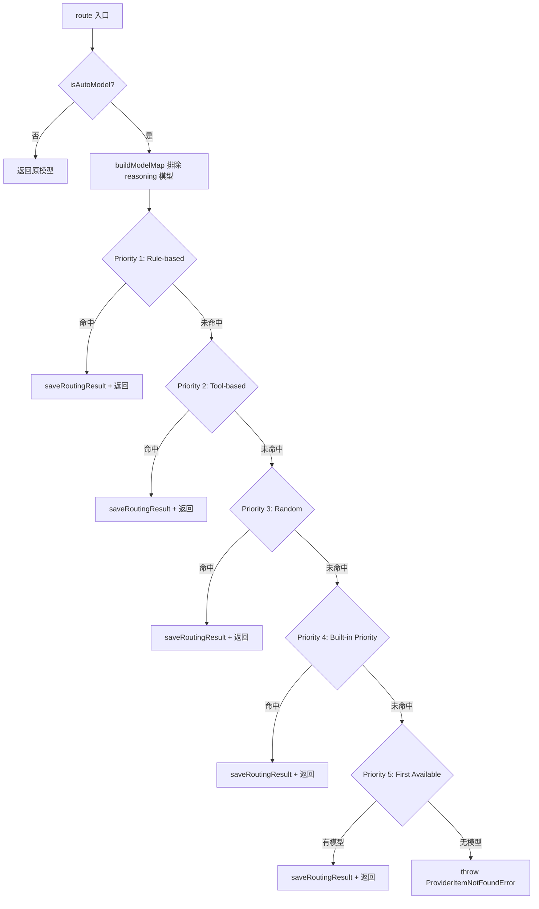
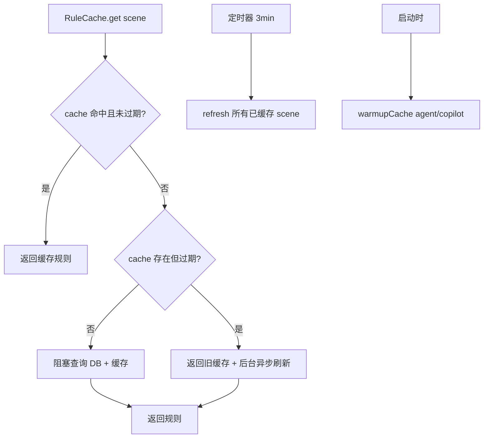
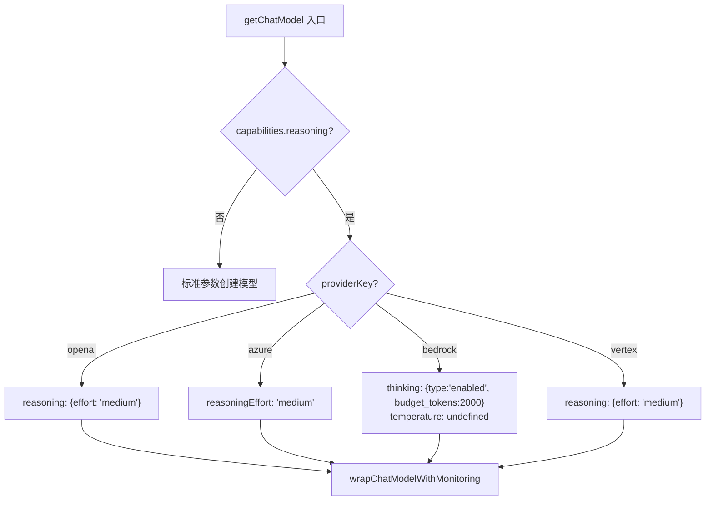

# PD-12.33 Refly — AutoModelRouter 三级路由与多供应商推理适配

> 文档编号：PD-12.33
> 来源：Refly `apps/api/src/modules/provider/auto-model-router.service.ts`
> GitHub：https://github.com/refly-ai/refly.git
> 问题域：PD-12 推理增强 Reasoning Enhancement
> 状态：可复用方案

---

## 第 1 章 问题与动机

### 1.1 核心问题

当一个 AI 产品同时接入 OpenAI、Azure、Bedrock、Vertex AI、Ollama、Fireworks 等多家 LLM 供应商时，面临三个层次的推理增强挑战：

1. **模型选择问题**：用户选择"Auto"模型时，系统需要根据任务场景（agent/copilot/chat）、工具集、用户状态（trial 期）等条件，自动路由到最优模型
2. **推理能力适配问题**：不同供应商对 extended thinking / reasoning 的 API 参数完全不同——OpenAI 用 `reasoning: { effort }`, Azure 用 `reasoningEffort`, Bedrock 用 `additionalModelRequestFields.thinking`, Vertex 用 `reasoning: { effort }`
3. **推理内容捕获问题**：OpenAI 的 reasoning_content 字段不在标准 LangChain 消息结构中，需要自定义扩展才能捕获

### 1.2 Refly 的解法概述

1. **五级优先路由**：`AutoModelRoutingService` 实现 Rule → Tool → Random → Priority → Fallback 五级路由链，每级都有独立的匹配逻辑和持久化审计（`auto-model-router.service.ts:570-658`）
2. **数据库驱动规则引擎**：路由规则存储在 Prisma 数据库中，支持条件匹配（toolset inventory keys、trial 状态）和三种目标选择（固定/随机/加权），通过 `RuleCache` 实现 5 分钟 TTL + 3 分钟后台刷新（`auto-model-router.service.ts:130-535`）
3. **供应商透明推理适配**：`getChatModel()` 工厂函数根据 `config.capabilities.reasoning` 标志，为每个供应商注入不同的推理参数，对上层完全透明（`packages/providers/src/llm/index.ts:47-154`）
4. **推理内容捕获扩展**：`EnhancedChatOpenAI` 继承 LangChain 的 `ChatOpenAI`，覆写 delta/message 转换方法，将 `reasoning_content` 注入 `additional_kwargs`（`packages/providers/src/llm/openai.ts:9-47`）
5. **Agent 循环上下文压缩**：`compressAgentLoopMessages` 在每次 LLM 调用前计算 token 预算，超限时先压缩历史再截断工具消息（`packages/skill-template/src/utils/context-manager.ts:947-1014`）

### 1.3 设计思想

| 设计原则 | 具体实现 | 理由 | 替代方案 |
|----------|----------|------|----------|
| 路由与推理解耦 | AutoModelRoutingService 只负责选模型，getChatModel 负责推理参数 | 路由策略变更不影响推理适配 | 路由时同时注入推理参数（耦合度高） |
| 数据库驱动规则 | 规则存 Prisma，RuleCache 定时刷新 | 运维可热更新规则，无需重启 | 硬编码规则（需发版） |
| 供应商差异内聚 | switch-case 按 providerKey 分发，每个 case 独立处理 reasoning | 新增供应商只需加一个 case | 抽象 ReasoningAdapter 接口（过度设计） |
| 推理模型排除 | buildModelMap 过滤 reasoning=true 的模型 | 推理模型不参与 Auto 路由，避免高成本误选 | 允许路由到推理模型（成本不可控） |
| 审计全覆盖 | 每次路由结果异步写入 autoModelRoutingResult 表 | 可追溯路由决策，支持 A/B 分析 | 仅日志记录（不可查询） |

---

## 第 2 章 源码实现分析

### 2.1 架构概览

Refly 的推理增强体系由三层组成：路由层（选模型）、工厂层（建模型+注入推理参数）、Agent 层（循环执行+上下文管理）。

```
┌─────────────────────────────────────────────────────────────┐
│                     Agent Layer (agent.ts)                   │
│  ┌──────────┐  ┌──────────────┐  ┌────────────────────────┐ │
│  │ Preprocess│→│ LangGraph    │→│ compressAgentLoop       │ │
│  │ (mode →   │  │ StateGraph   │  │ Messages (token budget) │ │
│  │  scene)   │  │ llm ↔ tools │  └────────────────────────┘ │
│  └──────────┘  └──────┬───────┘                              │
│                       │ chatModel(scene)                     │
├───────────────────────┼─────────────────────────────────────┤
│              Factory Layer (getChatModel)                     │
│  ┌────────┐ ┌────────┐ ┌────────┐ ┌────────┐ ┌────────┐    │
│  │ OpenAI │ │ Azure  │ │Bedrock │ │ Vertex │ │ Ollama │    │
│  │reasoning│ │reason- │ │thinking│ │reasoning│ │  (no   │    │
│  │{effort} │ │Effort  │ │{budget}│ │{effort} │ │ reason)│    │
│  └────┬───┘ └───┬────┘ └───┬────┘ └───┬────┘ └───┬────┘    │
│       └─────────┴──────────┴──────────┴──────────┘          │
│                       │ wrapWithMonitoring                   │
├───────────────────────┼─────────────────────────────────────┤
│              Routing Layer (AutoModelRoutingService)          │
│  ┌──────────┐ ┌──────────┐ ┌──────────┐ ┌──────────┐       │
│  │ Rule DB  │→│ Tool Env │→│ Random   │→│ Priority │→ First │
│  │ (cached) │ │ (env var)│ │ (env var)│ │ (hardcode)│       │
│  └──────────┘ └──────────┘ └──────────┘ └──────────┘       │
└─────────────────────────────────────────────────────────────┘
```

### 2.2 核心实现

#### 2.2.1 五级路由链



对应源码 `apps/api/src/modules/provider/auto-model-router.service.ts:570-658`：

```typescript
async route(
  originalProviderItem: ProviderItemModel,
  context: RoutingContext,
): Promise<ProviderItemModel> {
  if (!isAutoModel(originalProviderItem.config)) {
    return originalProviderItem;
  }

  const modelMap = this.buildModelMap(context.llmItems);
  const routingResultId = genRoutingResultID();
  const scene = getModelSceneFromMode(context.mode);

  // Priority 1: Rule-based routing
  const ruleResult = await this.routeByRules(context, modelMap, scene);
  if (ruleResult) {
    this.saveRoutingResult(context, routingResultId, scene,
      RoutingStrategy.RULE_BASED, ruleResult.providerItem,
      originalProviderItem, ruleResult.matchedRule);
    return ruleResult.providerItem;
  }

  // Priority 2: Tool-based routing
  const toolBasedItem = this.routeByTools(context, modelMap, scene);
  if (toolBasedItem) {
    this.saveRoutingResult(context, routingResultId, scene,
      RoutingStrategy.TOOL_BASED, toolBasedItem, originalProviderItem);
    return toolBasedItem;
  }

  // Priority 3-5: Random → Built-in → First available
  // ... (同样模式)
}
```

#### 2.2.2 规则引擎与缓存



对应源码 `apps/api/src/modules/provider/auto-model-router.service.ts:313-535`：

```typescript
class RuleCache implements OnModuleDestroy {
  private readonly cache = new Map<string, RuleCacheEntry>();
  private readonly CACHE_TTL_MS = 5 * 60 * 1000;
  private readonly REFRESH_INTERVAL_MS = 3 * 60 * 1000;

  async get(scene: string): Promise<AutoModelRoutingRuleModel[]> {
    if (this.disableCache) {
      return this.fetchAndCache(scene, Date.now());
    }
    const now = Date.now();
    const cached = this.cache.get(scene);
    // Cache hit and valid
    if (cached && now - cached.cachedAt < this.CACHE_TTL_MS) {
      return cached.rules;
    }
    // Stale cache: return old + background refresh
    if (cached) {
      this.fetchAndCache(scene, now).catch(err =>
        this.logger.warn(`Background refresh failed for scene '${scene}'`, err));
      return cached.rules;
    }
    // First access: blocking fetch
    return this.fetchAndCache(scene, now);
  }
}
```

#### 2.2.3 多供应商推理参数适配



对应源码 `packages/providers/src/llm/index.ts:47-154`：

```typescript
export const getChatModel = (
  provider: BaseProvider, config: LLMModelConfig,
  params?: Partial<OpenAIBaseInput>, context?: { userId?: string },
): BaseChatModel => {
  switch (provider?.providerKey) {
    case 'openai':
      model = new EnhancedChatOpenAI({
        model: config.modelId,
        reasoning: config?.capabilities?.reasoning
          ? { effort: 'medium' } : undefined,
        ...commonParams,
      });
      break;
    case 'bedrock': {
      model = new ChatBedrockConverse({
        model: config.modelId,
        ...(config?.capabilities?.reasoning ? {
          additionalModelRequestFields: {
            thinking: { type: 'enabled', budget_tokens: 2000 },
          },
          temperature: undefined, // Must be unset for reasoning
        } : {}),
      });
      break;
    }
    // azure: reasoningEffort, vertex: reasoning.effort
  }
  return wrapChatModelWithMonitoring(model, { userId, modelId, provider });
};
```

### 2.3 实现细节

**推理内容捕获**：`EnhancedChatOpenAI` 通过覆写 LangChain 内部的 completions 转换方法，将 OpenAI 返回的 `reasoning` / `reasoning_content` 字段注入到 `additional_kwargs.reasoning_content` 中（`packages/providers/src/llm/openai.ts:10-37`）。这使得上层代码可以通过标准的 LangChain 消息接口访问推理过程。

**推理模型排除策略**：`buildModelMap` 在构建可路由模型映射时，显式过滤掉 `capabilities.reasoning === true` 的模型（`auto-model-router.service.ts:664-678`）。这意味着推理模型只能被用户显式选择，不会被 Auto 路由误选，避免了高成本的意外消耗。

**场景-模式映射**：`getModelSceneFromMode` 将 Agent 运行模式映射到模型场景（`packages/utils/src/models.ts:10-14`），使得同一个路由服务可以为 copilot、agent、chat 三种场景维护独立的路由规则集。

**Bedrock 区域负载均衡**：`selectBedrockRegion` 支持单区域固定和多区域随机选择两种模式（`packages/providers/src/llm/index.ts:29-45`），通过 `extraParams.regions` 数组实现跨区域负载均衡。

**Agent 循环无限循环检测**：Agent 的 LangGraph 图中维护 `toolCallHistory` 数组，当连续 3 次出现完全相同的工具调用签名时，强制终止循环（`packages/skill-template/src/skills/agent.ts:459-501`）。


---

## 第 3 章 迁移指南

### 3.1 迁移清单

**阶段 1：多供应商推理适配（最小可用）**

- [ ] 定义 `ModelCapabilities` 类型，包含 `reasoning: boolean` 字段
- [ ] 实现 `getChatModel` 工厂函数，按 providerKey 分发推理参数
- [ ] 为 OpenAI 实现 `EnhancedChatOpenAI` 捕获 reasoning_content
- [ ] 为 Bedrock 处理 thinking.budget_tokens 和 temperature 互斥

**阶段 2：Auto 模型路由**

- [ ] 创建路由规则数据表（ruleId, scene, priority, condition JSON, target JSON）
- [ ] 实现 `RuleRouter` 条件匹配引擎（AND 逻辑）
- [ ] 实现 `RuleCache` 带 TTL + 后台刷新
- [ ] 实现五级降级链：Rule → Tool → Random → Priority → Fallback
- [ ] 路由结果持久化到审计表

**阶段 3：Agent 循环优化**

- [ ] 实现 `compressAgentLoopMessages` token 预算管理
- [ ] 实现工具调用签名去重的无限循环检测
- [ ] 集成 Langfuse 监控包装器

### 3.2 适配代码模板

#### 多供应商推理参数适配器

```typescript
// reasoning-adapter.ts — 可直接复用的推理参数注入器
import { BaseChatModel } from '@langchain/core/language_models/chat_models';

interface ReasoningConfig {
  enabled: boolean;
  effort?: 'low' | 'medium' | 'high';
  budgetTokens?: number;
}

interface ProviderConfig {
  providerKey: string;
  modelId: string;
  apiKey: string;
  baseUrl?: string;
  reasoning?: ReasoningConfig;
}

export function buildReasoningParams(
  providerKey: string,
  reasoning?: ReasoningConfig,
): Record<string, any> {
  if (!reasoning?.enabled) return {};

  const effort = reasoning.effort ?? 'medium';
  const budget = reasoning.budgetTokens ?? 2000;

  switch (providerKey) {
    case 'openai':
      return { reasoning: { effort } };
    case 'azure':
      return { reasoningEffort: effort };
    case 'bedrock':
      return {
        additionalModelRequestFields: {
          thinking: { type: 'enabled', budget_tokens: budget },
        },
        temperature: undefined, // Bedrock 要求 reasoning 时 temperature 必须为 1 或 unset
      };
    case 'vertex':
      return { reasoning: { effort } };
    default:
      return {};
  }
}
```

#### 加权随机选择器

```typescript
// weighted-selector.ts — 通用加权随机选择
export function selectWeighted<T>(
  items: Array<{ item: T; weight: number }>,
): T | null {
  const valid = items.filter(i => i.weight > 0);
  if (valid.length === 0) return null;

  const total = valid.reduce((sum, i) => sum + i.weight, 0);
  let random = Math.random() * total;

  for (const { item, weight } of valid) {
    random -= weight;
    if (random <= 0) return item;
  }

  return valid[valid.length - 1].item;
}
```

### 3.3 适用场景

| 场景 | 适用度 | 说明 |
|------|--------|------|
| 多供应商 SaaS 产品 | ⭐⭐⭐ | 核心场景：用户可选多家 LLM，需要统一推理接口 |
| 成本敏感的 Agent 平台 | ⭐⭐⭐ | Auto 路由 + 推理模型排除，有效控制成本 |
| 企业内部 AI 网关 | ⭐⭐ | 规则引擎适合按部门/项目路由，但数据库依赖较重 |
| 单供应商应用 | ⭐ | 过度设计，直接用供应商 SDK 即可 |
| 需要动态调整推理深度的场景 | ⭐⭐ | 当前 effort 固定为 medium，需扩展为动态 |

---

## 第 4 章 测试用例

```typescript
import { describe, it, expect, vi, beforeEach } from 'vitest';

// === 测试 1: 多供应商推理参数构建 ===
describe('buildReasoningParams', () => {
  it('should return OpenAI reasoning format', () => {
    const params = buildReasoningParams('openai', { enabled: true, effort: 'medium' });
    expect(params).toEqual({ reasoning: { effort: 'medium' } });
  });

  it('should return Azure reasoningEffort format', () => {
    const params = buildReasoningParams('azure', { enabled: true, effort: 'high' });
    expect(params).toEqual({ reasoningEffort: 'high' });
  });

  it('should return Bedrock thinking format with temperature unset', () => {
    const params = buildReasoningParams('bedrock', {
      enabled: true, budgetTokens: 4000,
    });
    expect(params).toEqual({
      additionalModelRequestFields: {
        thinking: { type: 'enabled', budget_tokens: 4000 },
      },
      temperature: undefined,
    });
  });

  it('should return empty object when reasoning disabled', () => {
    const params = buildReasoningParams('openai', { enabled: false });
    expect(params).toEqual({});
  });
});

// === 测试 2: 加权随机选择 ===
describe('selectWeighted', () => {
  it('should select from weighted items', () => {
    const items = [
      { item: 'modelA', weight: 70 },
      { item: 'modelB', weight: 30 },
    ];
    const results = new Set<string>();
    for (let i = 0; i < 100; i++) {
      const result = selectWeighted(items);
      if (result) results.add(result);
    }
    expect(results.has('modelA')).toBe(true);
    expect(results.has('modelB')).toBe(true);
  });

  it('should return null for empty items', () => {
    expect(selectWeighted([])).toBeNull();
  });

  it('should skip zero-weight items', () => {
    const items = [
      { item: 'modelA', weight: 0 },
      { item: 'modelB', weight: 100 },
    ];
    for (let i = 0; i < 50; i++) {
      expect(selectWeighted(items)).toBe('modelB');
    }
  });
});

// === 测试 3: 路由优先级链 ===
describe('AutoModelRoutingService.route', () => {
  it('should skip routing for non-auto models', async () => {
    const originalItem = { config: '{"modelId":"gpt-4o"}' } as any;
    const result = await service.route(originalItem, mockContext);
    expect(result).toBe(originalItem);
  });

  it('should exclude reasoning models from model map', () => {
    const items = [
      { config: '{"modelId":"gpt-4o","capabilities":{"reasoning":false}}' },
      { config: '{"modelId":"o1","capabilities":{"reasoning":true}}' },
    ] as any[];
    const map = service['buildModelMap'](items);
    expect(map.has('gpt-4o')).toBe(true);
    expect(map.has('o1')).toBe(false);
  });

  it('should fallback through priority chain', async () => {
    // Rule miss → Tool miss → Random miss → Priority hit
    const autoItem = { config: '{"modelId":"auto"}' } as any;
    const result = await service.route(autoItem, contextWithPriorityModel);
    expect(result.config).toContain('claude-opus');
  });
});

// === 测试 4: RuleRouter 条件匹配 ===
describe('RuleRouter', () => {
  it('should match toolset inventory keys', () => {
    const rule = {
      condition: '{"toolsetInventoryKeys":["fal_image"]}',
      target: '{"model":"gpt-4o"}',
    } as any;
    const context = {
      toolsets: [{ toolset: { key: 'fal_image' } }],
    } as any;
    const router = new RuleRouter(context);
    const result = router.route([rule], modelMap);
    expect(result).not.toBeNull();
  });

  it('should match trial condition', () => {
    const rule = {
      condition: '{"inAutoModelTrial":true}',
      target: '{"model":"claude-opus-4-5"}',
    } as any;
    const context = { inAutoModelTrial: true } as any;
    const router = new RuleRouter(context);
    const result = router.route([rule], modelMap);
    expect(result?.matchedRule).toBeDefined();
  });
});
```


---

## 第 5 章 跨域关联

| 关联域 | 关系类型 | 说明 |
|--------|----------|------|
| PD-01 上下文管理 | 协同 | `compressAgentLoopMessages` 在 Agent 循环中管理 token 预算，是推理增强的前置条件——推理模型消耗更多 output tokens，需要更精确的上下文预算 |
| PD-03 容错与重试 | 协同 | `EnhancedChatVertexAI` 对 Vertex AI 网络错误实现指数退避重试（3 次，1s→5s），`RuleCache` 在 DB 查询失败时返回过期缓存 |
| PD-04 工具系统 | 依赖 | Tool-based routing 根据 toolset inventory keys 路由到不同模型，工具系统的注册信息直接影响路由决策 |
| PD-11 可观测性 | 协同 | `wrapChatModelWithMonitoring` 为每个模型调用创建 Langfuse trace/span，路由结果持久化到 `autoModelRoutingResult` 表支持审计 |

---

## 第 6 章 来源文件索引

| 文件 | 行范围 | 关键实现 |
|------|--------|----------|
| `apps/api/src/modules/provider/auto-model-router.service.ts` | L1-L835 | AutoModelRoutingService 五级路由、RuleRouter 条件匹配、RuleCache 缓存管理 |
| `packages/providers/src/llm/index.ts` | L47-L154 | getChatModel 工厂函数，多供应商推理参数适配 |
| `packages/providers/src/llm/openai.ts` | L1-L47 | EnhancedChatOpenAI，reasoning_content 捕获 |
| `packages/providers/src/llm/vertex.ts` | L1-L93 | EnhancedChatVertexAI 重试逻辑，isGeminiModel 检测 |
| `packages/utils/src/auto-model.ts` | L1-L121 | isAutoModel、selectAutoModel、AUTO_MODEL_ROUTING_PRIORITY、getToolBasedRoutingConfig |
| `packages/utils/src/models.ts` | L10-L14 | getModelSceneFromMode 场景映射 |
| `packages/skill-template/src/skills/agent.ts` | L37-L620 | Agent LangGraph 图构建、工具并行执行、无限循环检测 |
| `packages/skill-template/src/utils/context-manager.ts` | L947-L1014 | compressAgentLoopMessages token 预算管理 |
| `packages/providers/src/monitoring/langfuse-wrapper.ts` | L141-L290 | wrapChatModelWithMonitoring Langfuse 监控包装 |

---

## 第 7 章 横向对比维度

```json comparison_data
{
  "project": "Refly",
  "dimensions": {
    "推理方式": "Auto 模型路由 + 供应商透明 reasoning 参数注入",
    "模型策略": "五级优先路由：Rule→Tool→Random→Priority→Fallback",
    "成本控制": "推理模型排除 Auto 路由 + trial 期路由到高性能模型",
    "适用场景": "多供应商 SaaS 平台，用户选 Auto 自动路由最优模型",
    "推理模式": "capabilities.reasoning 布尔标志触发供应商特定参数",
    "推理可见性": "EnhancedChatOpenAI 捕获 reasoning_content 到 additional_kwargs",
    "推理级别归一化": "统一 effort='medium'，Bedrock 用 budget_tokens=2000",
    "供应商兼容性": "OpenAI/Azure/Bedrock/Vertex 四供应商独立适配",
    "环境变量运维覆盖": "Random 列表、Tool 路由、Trial 次数均通过环境变量配置",
    "路由审计": "每次路由决策异步写入 autoModelRoutingResult 表",
    "规则热更新": "数据库存储规则 + RuleCache 5min TTL + 3min 后台刷新",
    "加权路由": "RoutingTarget 支持固定/随机/加权三种目标选择策略"
  }
}
```

```json domain_metadata
{
  "solution_summary": "Refly 通过 AutoModelRoutingService 实现五级优先路由链（Rule→Tool→Random→Priority→Fallback），getChatModel 工厂为 OpenAI/Azure/Bedrock/Vertex 四供应商透明注入差异化推理参数",
  "description": "多供应商推理参数归一化与数据库驱动的动态路由规则引擎",
  "sub_problems": [
    "路由审计持久化：将每次模型路由决策记录到数据库支持 A/B 分析",
    "规则缓存热更新：数据库规则变更无需重启即可生效",
    "加权随机路由：按权重比例分配流量到不同模型"
  ],
  "best_practices": [
    "推理模型排除 Auto 路由：避免高成本推理模型被自动选中",
    "Stale-while-revalidate 缓存：过期时返回旧缓存同时后台刷新，避免阻塞",
    "Bedrock reasoning 时必须 unset temperature：供应商特定约束需显式处理"
  ]
}
```

