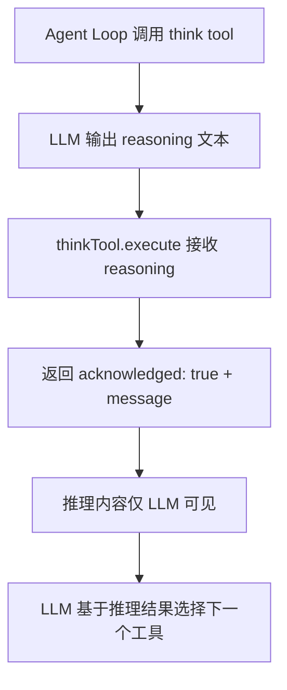
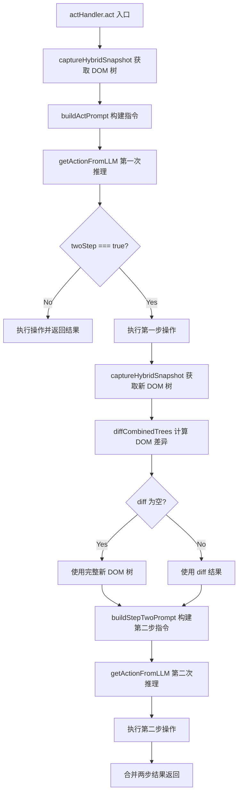
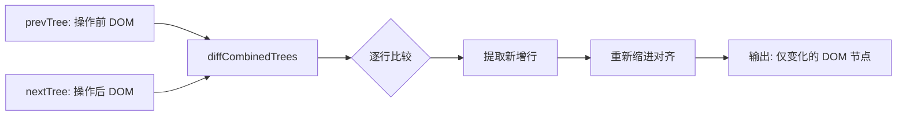

# PD-12.15 Stagehand — ThinkTool 显式推理与 TwoStep 两阶段 DOM 推理

> 文档编号：PD-12.15
> 来源：Stagehand `packages/core/lib/v3/agent/tools/think.ts` `packages/core/lib/v3/handlers/actHandler.ts`
> GitHub：https://github.com/browserbase/stagehand.git
> 问题域：PD-12 推理增强 Reasoning Enhancement
> 状态：可复用方案

---

## 第 1 章 问题与动机（≥ 30 行）

### 1.1 核心问题

浏览器自动化 Agent 面临一个独特的推理挑战：LLM 需要在复杂的 DOM 结构中做出精确的操作决策，但单次推理往往不够——页面状态会因操作而改变（如下拉菜单展开、弹窗出现），LLM 需要基于操作后的新状态进行二次推理。

传统方案要么让 LLM 一次性规划所有步骤（容易因页面动态变化而失败），要么完全依赖外部编排循环（增加延迟和 token 消耗）。Stagehand 的核心洞察是：**将推理分为"思考"和"行动后再思考"两个层次**，前者用 thinkTool 实现显式 scratchpad，后者用 twoStep 机制实现基于 DOM diff 的二次推理。

### 1.2 Stagehand 的解法概述

1. **thinkTool 显式推理**：注册为标准 AI SDK tool，LLM 可在任何操作前调用 `think` 进行内部推理，输出仅对 LLM 自身可见（`packages/core/lib/v3/agent/tools/think.ts:4-27`）
2. **twoStep 两阶段推理**：actInference 返回 `twoStep: boolean` 字段，LLM 自主决定是否需要二次推理；若为 true，actHandler 在执行第一步操作后捕获新的 DOM 快照，计算 diff，再发起第二次推理（`packages/core/lib/v3/handlers/actHandler.ts:201-268`）
3. **DOM diff 聚焦推理**：第二次推理不使用完整 DOM 树，而是通过 `diffCombinedTrees` 只传入变化的节点，大幅减少 token 消耗（`packages/core/lib/v3/understudy/a11y/snapshot/treeFormatUtils.ts:72-103`）
4. **模式感知策略注入**：`agentSystemPrompt` 根据 dom/hybrid 模式构建不同的工具使用策略，引导 LLM 选择最优操作路径（`packages/core/lib/v3/agent/prompts/agentSystemPrompt.ts:140-154`）
5. **selfHeal 推理修复**：操作失败时重新捕获 DOM 快照并发起新的推理，找到替代选择器（`packages/core/lib/v3/handlers/actHandler.ts:337-436`）

### 1.3 设计思想

| 设计原则 | 具体实现 | 理由 | 替代方案 |
|----------|----------|------|----------|
| LLM 自主决策推理深度 | twoStep 由 LLM 输出决定，非硬编码 | 避免对所有操作都做二次推理的浪费 | 外部规则引擎判断是否需要二次推理 |
| 推理与行动解耦 | thinkTool 是纯推理工具，不产生副作用 | 让 LLM 有"草稿纸"而不影响页面状态 | 在 system prompt 中要求 LLM 先思考再行动 |
| 增量推理而非全量 | DOM diff 只传变化节点给第二步 | 减少 token 消耗，聚焦变化 | 每次都传完整 DOM 树 |
| 模式感知策略 | dom/hybrid 两套工具策略 | 不同交互模式需要不同推理引导 | 统一策略不区分模式 |
| 失败驱动的推理修复 | selfHeal 在操作失败后重新推理 | 页面动态变化导致选择器失效是常态 | 直接报错不重试 |

---

## 第 2 章 源码实现分析（≥ 60 行，核心章节）

### 2.1 架构概览

Stagehand 的推理增强体系由三个层次组成：Agent 级别的 thinkTool（显式推理）、Handler 级别的 twoStep（两阶段推理）、以及 Prompt 级别的策略注入（模式感知推理引导）。

```
┌─────────────────────────────────────────────────────────┐
│                    Agent Loop (AI SDK)                    │
│  ┌──────────┐  ┌──────────┐  ┌──────────┐  ┌─────────┐ │
│  │ thinkTool│  │  actTool  │  │screenshot│  │ariaTree │ │
│  │(scratchpad)│ │          │  │          │  │         │ │
│  └──────────┘  └────┬─────┘  └──────────┘  └─────────┘ │
│                     │                                    │
│              ┌──────▼──────┐                             │
│              │  ActHandler  │                             │
│              │              │                             │
│              │ ┌──────────┐ │                             │
│              │ │ Step 1:  │ │                             │
│              │ │ actInfer │ │                             │
│              │ └────┬─────┘ │                             │
│              │      │       │                             │
│              │  twoStep?    │                             │
│              │   ┌──┴──┐   │                             │
│              │   │ Yes │   │                             │
│              │   └──┬──┘   │                             │
│              │ ┌────▼────┐ │                             │
│              │ │DOM diff │ │                             │
│              │ │+ Step 2 │ │                             │
│              │ └─────────┘ │                             │
│              └─────────────┘                             │
│                                                          │
│  ┌──────────────────────────────────────────────────┐   │
│  │ agentSystemPrompt: dom/hybrid 策略注入            │   │
│  │ - 工具优先级引导                                   │   │
│  │ - 页面理解协议                                     │   │
│  └──────────────────────────────────────────────────┘   │
└─────────────────────────────────────────────────────────┘
```

### 2.2 核心实现

#### 2.2.1 ThinkTool — 显式推理 Scratchpad



对应源码 `packages/core/lib/v3/agent/tools/think.ts:4-27`：

```typescript
export const thinkTool = () =>
  tool({
    description: `Use this tool to think through complex problems or plan a sequence of steps. This is for internal reasoning only and doesn't perform any actions. Use this to:

1. Plan a multi-step approach before taking action
2. Break down complex tasks
3. Reason through edge cases
4. Evaluate options when you're unsure what to do next

The output is only visible to you; use it to track your own reasoning process.`,
    inputSchema: z.object({
      reasoning: z
        .string()
        .describe(
          "Your step-by-step reasoning or planning process. Be as detailed as needed.",
        ),
    }),
    execute: async ({ reasoning }) => {
      return {
        acknowledged: true,
        message: reasoning,
      };
    },
  });
```

关键设计点：
- thinkTool 是一个**零副作用工具**，execute 只是回显 reasoning 文本
- 通过 description 中的 4 个使用场景引导 LLM 在正确时机调用
- 使用 Vercel AI SDK 的 `tool()` 函数注册，与其他浏览器操作工具平级

#### 2.2.2 TwoStep 两阶段推理 — 基于 DOM Diff 的二次决策



对应源码 `packages/core/lib/v3/handlers/actHandler.ts:137-268`：

```typescript
async act(params: ActHandlerParams): Promise<ActResult> {
    const { instruction, page, variables, timeout, model } = params;
    const llmClient = this.resolveLlmClient(model);

    // ... timeout guard setup ...

    // 第一步：捕获 DOM 快照 + LLM 推理
    const { combinedTree, combinedXpathMap } = await captureHybridSnapshot(
      page, { experimental: true },
    );
    const actInstruction = buildActPrompt(
      instruction, Object.values(SupportedUnderstudyAction), variables,
    );
    const { action: firstAction, response: actInferenceResponse } =
      await this.getActionFromLLM({
        instruction: actInstruction,
        domElements: combinedTree,
        xpathMap: combinedXpathMap,
        llmClient,
      });

    // 执行第一步操作
    const firstResult = await this.takeDeterministicAction(
      firstAction, page, this.defaultDomSettleTimeoutMs,
      llmClient, ensureTimeRemaining, variables,
    );

    // 关键：LLM 自主决定是否需要第二步
    if (actInferenceResponse?.twoStep !== true) {
      return firstResult;
    }

    // 第二步：基于 DOM diff 的二次推理
    const { combinedTree: combinedTree2, combinedXpathMap: combinedXpathMap2 } =
      await captureHybridSnapshot(page, { experimental: true });

    let diffedTree = diffCombinedTrees(combinedTree, combinedTree2);
    if (!diffedTree.trim()) {
      diffedTree = combinedTree2; // fallback: diff 为空时用完整树
    }

    const stepTwoInstructions = buildStepTwoPrompt(
      instruction, previousAction,
      Object.values(SupportedUnderstudyAction).filter(/*...*/),
      variables,
    );

    const { action: secondAction } = await this.getActionFromLLM({
      instruction: stepTwoInstructions,
      domElements: diffedTree,
      xpathMap: combinedXpathMap2,
      llmClient,
    });

    // 合并两步结果
    return {
      success: firstResult.success && secondResult.success,
      message: `${firstResult.message} → ${secondResult.message}`,
      actions: [...(firstResult.actions || []), ...(secondResult.actions || [])],
    };
}
```

#### 2.2.3 DOM Diff 聚焦推理



对应源码 `packages/core/lib/v3/understudy/a11y/snapshot/treeFormatUtils.ts:72-103`：

```typescript
export function diffCombinedTrees(prevTree: string, nextTree: string): string {
  const prevSet = new Set(
    (prevTree || "")
      .split("\n")
      .map((l) => l.trim())
      .filter((l) => l.length > 0),
  );

  const nextLines = (nextTree || "").split("\n");
  const added: string[] = [];
  for (const line of nextLines) {
    const core = line.trim();
    if (!core) continue;
    if (!prevSet.has(core)) added.push(line);
  }

  if (added.length === 0) return "";

  // 重新缩进：找到最小缩进量，统一左移
  let minIndent = Infinity;
  for (const l of added) {
    if (!l.trim()) continue;
    const m = l.match(/^\s*/);
    const indentLen = m ? m[0]!.length : 0;
    if (indentLen < minIndent) minIndent = indentLen;
  }
  if (!isFinite(minIndent)) minIndent = 0;

  const out = added.map((l) =>
    l.length >= minIndent ? l.slice(minIndent) : l,
  );
  return out.join("\n");
}
```

### 2.3 实现细节

#### twoStep 的触发机制

twoStep 字段定义在 act 推理的 Zod schema 中（`packages/core/lib/inference.ts:432`）：

```typescript
const actSchema = z.object({
  elementId: z.string().regex(/^\d+-\d+$/),
  description: z.string(),
  method: z.enum(Object.values(SupportedUnderstudyAction)),
  arguments: z.array(z.string()),
  twoStep: z.boolean(),  // LLM 自主决定是否需要二次推理
});
```

LLM 通过 `buildActPrompt` 中的指令学习何时设置 twoStep（`packages/core/lib/prompt.ts:195-200`）：
- CASE 1（select 元素）：`twoStep: false`，直接选择
- CASE 2（非 select 下拉）：`twoStep: true`，先点击展开再选择

#### 模式感知策略注入

`agentSystemPrompt` 根据 `dom` 或 `hybrid` 模式生成不同的策略（`packages/core/lib/v3/agent/prompts/agentSystemPrompt.ts:140-154`）：

- **hybrid 模式**：优先使用 click/type（坐标操作），screenshot 为主要感知工具，ariaTree 为辅助
- **dom 模式**：优先使用 act（DOM 操作），ariaTree 为主要感知工具，screenshot 为辅助

这种策略注入确保 LLM 的推理路径与可用工具集一致，避免推理出无法执行的操作。

#### selfHeal 推理修复

当操作失败时（选择器失效等），selfHeal 机制重新捕获 DOM 快照并发起新的推理（`packages/core/lib/v3/handlers/actHandler.ts:337-436`）：

1. 捕获新的 `captureHybridSnapshot`
2. 用原始指令重新调用 `getActionFromLLM`
3. 用新推理结果的 selector 替换失败的 selector
4. 重试操作

#### Reasoning Token 追踪

所有推理调用都追踪 `reasoning_tokens`（`packages/core/lib/v3/llm/LLMClient.ts:105`），通过 `onMetrics` 回调上报，支持成本分析。

---

## 第 3 章 迁移指南（≥ 40 行）

### 3.1 迁移清单

**阶段 1：ThinkTool 显式推理（1 天）**
- [ ] 在 AI SDK 工具集中注册 thinkTool
- [ ] 在 system prompt 中添加 think 工具的使用引导
- [ ] 验证 LLM 在复杂任务前主动调用 think

**阶段 2：TwoStep 两阶段推理（2-3 天）**
- [ ] 在 act 推理的输出 schema 中添加 `twoStep: boolean` 字段
- [ ] 实现 DOM/状态快照的 diff 函数
- [ ] 在 actHandler 中实现 twoStep 分支逻辑
- [ ] 在 prompt 中添加 twoStep 使用指引（如下拉菜单场景）

**阶段 3：SelfHeal 推理修复（1-2 天）**
- [ ] 实现操作失败后的重新快照 + 重新推理逻辑
- [ ] 添加 selfHeal 开关配置
- [ ] 添加重试次数限制防止无限循环

**阶段 4：模式感知策略（可选）**
- [ ] 定义不同操作模式的工具集
- [ ] 为每种模式编写对应的策略 prompt
- [ ] 实现 `buildToolsSection` 动态工具列表生成

### 3.2 适配代码模板

#### ThinkTool 实现（TypeScript + Vercel AI SDK）

```typescript
import { tool } from "ai";
import { z } from "zod";

// 零副作用的显式推理工具
export const createThinkTool = () =>
  tool({
    description: `Use this tool to think through complex problems or plan a sequence of steps.
This is for internal reasoning only and doesn't perform any actions.
Use this to:
1. Plan a multi-step approach before taking action
2. Break down complex tasks
3. Reason through edge cases
4. Evaluate options when you're unsure what to do next`,
    inputSchema: z.object({
      reasoning: z.string().describe("Your step-by-step reasoning process."),
    }),
    execute: async ({ reasoning }) => ({
      acknowledged: true,
      message: reasoning,
    }),
  });
```

#### TwoStep 两阶段推理框架（TypeScript）

```typescript
interface TwoStepConfig {
  captureState: () => Promise<string>;  // 捕获当前状态快照
  diffStates: (prev: string, next: string) => string;  // 计算状态差异
  executeAction: (action: Action) => Promise<ActionResult>;  // 执行操作
  inferAction: (instruction: string, context: string) => Promise<{
    action: Action;
    twoStep: boolean;
  }>;
}

async function twoStepReasoning(
  instruction: string,
  config: TwoStepConfig,
): Promise<ActionResult> {
  // Step 1: 捕获状态 + 第一次推理
  const state1 = await config.captureState();
  const { action: firstAction, twoStep } = await config.inferAction(
    instruction, state1,
  );

  const firstResult = await config.executeAction(firstAction);

  if (!twoStep) return firstResult;

  // Step 2: 捕获新状态 + diff + 第二次推理
  const state2 = await config.captureState();
  let context = config.diffStates(state1, state2);
  if (!context.trim()) context = state2;  // fallback

  const stepTwoInstruction = buildStepTwoPrompt(
    instruction,
    `${firstAction.method}: ${firstAction.description}`,
  );

  const { action: secondAction } = await config.inferAction(
    stepTwoInstruction, context,
  );

  const secondResult = await config.executeAction(secondAction);

  return {
    success: firstResult.success && secondResult.success,
    message: `${firstResult.message} → ${secondResult.message}`,
    actions: [...firstResult.actions, ...secondResult.actions],
  };
}
```

#### 通用状态 Diff 函数

```typescript
/**
 * 行级 diff：返回 nextState 中新增的行（prevState 中不存在的）
 * 适用于树形文本表示（DOM 树、文件树等）
 */
export function diffTextStates(prevState: string, nextState: string): string {
  const prevSet = new Set(
    prevState.split("\n").map((l) => l.trim()).filter(Boolean),
  );

  const added = nextState
    .split("\n")
    .filter((line) => {
      const trimmed = line.trim();
      return trimmed && !prevSet.has(trimmed);
    });

  if (added.length === 0) return "";

  // 重新缩进：统一左移到最小缩进
  const minIndent = Math.min(
    ...added
      .filter((l) => l.trim())
      .map((l) => l.match(/^\s*/)?.[0]?.length ?? 0),
  );

  return added.map((l) => l.slice(minIndent)).join("\n");
}
```

### 3.3 适用场景

| 场景 | 适用度 | 说明 |
|------|--------|------|
| 浏览器自动化 Agent | ⭐⭐⭐ | 核心场景：DOM 操作后状态变化需要二次推理 |
| 多步骤表单填写 | ⭐⭐⭐ | 下拉菜单、级联选择等需要 twoStep |
| 代码编辑 Agent | ⭐⭐ | 编辑后 AST 变化可用类似 diff 机制 |
| 对话式 Agent | ⭐⭐ | thinkTool 可直接复用，twoStep 不适用 |
| 批量数据处理 | ⭐ | 状态变化不频繁，twoStep 收益低 |

---

## 第 4 章 测试用例（≥ 20 行）

```typescript
import { describe, it, expect, vi } from "vitest";

// 测试 ThinkTool
describe("ThinkTool", () => {
  it("should return acknowledged with reasoning message", async () => {
    const { thinkTool } = await import("./think");
    const tool = thinkTool();
    const result = await tool.execute(
      { reasoning: "I need to click the submit button first" },
      { toolCallId: "test-1", messages: [], abortSignal: new AbortController().signal },
    );
    expect(result.acknowledged).toBe(true);
    expect(result.message).toBe("I need to click the submit button first");
  });

  it("should have no side effects", async () => {
    const { thinkTool } = await import("./think");
    const tool = thinkTool();
    // 多次调用不应改变任何外部状态
    const r1 = await tool.execute(
      { reasoning: "step 1" },
      { toolCallId: "t1", messages: [], abortSignal: new AbortController().signal },
    );
    const r2 = await tool.execute(
      { reasoning: "step 2" },
      { toolCallId: "t2", messages: [], abortSignal: new AbortController().signal },
    );
    expect(r1.acknowledged).toBe(true);
    expect(r2.acknowledged).toBe(true);
  });
});

// 测试 DOM Diff
describe("diffCombinedTrees", () => {
  it("should return only new lines", () => {
    const prev = `[1-1] button: Submit\n[1-2] input: Name`;
    const next = `[1-1] button: Submit\n[1-2] input: Name\n[1-3] listbox: Options\n  [1-4] option: A\n  [1-5] option: B`;
    const diff = diffTextStates(prev, next);
    expect(diff).toContain("[1-3] listbox: Options");
    expect(diff).toContain("[1-4] option: A");
    expect(diff).not.toContain("[1-1] button: Submit");
  });

  it("should return empty string when no changes", () => {
    const tree = `[1-1] button: Submit\n[1-2] input: Name`;
    const diff = diffTextStates(tree, tree);
    expect(diff).toBe("");
  });

  it("should fallback to full tree when diff is empty", () => {
    // 模拟 actHandler 的 fallback 逻辑
    const prev = `[1-1] button: Submit`;
    const next = `[1-1] button: Submit`;
    let diffedTree = diffTextStates(prev, next);
    if (!diffedTree.trim()) {
      diffedTree = next; // fallback
    }
    expect(diffedTree).toBe(next);
  });
});

// 测试 TwoStep 流程
describe("TwoStep Reasoning", () => {
  it("should skip step 2 when twoStep is false", async () => {
    const inferAction = vi.fn().mockResolvedValue({
      action: { method: "click", selector: "xpath=//button", description: "Submit" },
      twoStep: false,
    });
    const executeAction = vi.fn().mockResolvedValue({
      success: true, message: "clicked", actions: [],
    });

    // 模拟 twoStep 逻辑
    const { action, twoStep } = await inferAction("click submit");
    const result = await executeAction(action);
    if (!twoStep) {
      expect(result.success).toBe(true);
      expect(inferAction).toHaveBeenCalledTimes(1);
      return;
    }
  });

  it("should execute step 2 with diff context when twoStep is true", async () => {
    const captureState = vi.fn()
      .mockResolvedValueOnce("[1-1] select: Country")
      .mockResolvedValueOnce("[1-1] select: Country\n[1-2] option: US\n[1-3] option: UK");

    const state1 = await captureState();
    const state2 = await captureState();
    const diff = diffTextStates(state1, state2);

    expect(diff).toContain("[1-2] option: US");
    expect(diff).not.toContain("[1-1] select: Country");
  });
});

function diffTextStates(prev: string, next: string): string {
  const prevSet = new Set(prev.split("\n").map((l) => l.trim()).filter(Boolean));
  return next.split("\n")
    .filter((l) => l.trim() && !prevSet.has(l.trim()))
    .join("\n");
}
```

---

## 第 5 章 跨域关联

| 关联域 | 关系类型 | 说明 |
|--------|----------|------|
| PD-01 上下文管理 | 协同 | DOM diff 机制直接减少第二步推理的 token 消耗，是上下文管理的一种形式 |
| PD-04 工具系统 | 依赖 | thinkTool 依赖 AI SDK 的 tool 注册机制；dom/hybrid 模式决定可用工具集 |
| PD-03 容错与重试 | 协同 | selfHeal 推理修复本质上是一种容错机制——操作失败后重新推理找到替代路径 |
| PD-07 质量检查 | 协同 | twoStep 的第二步推理可视为对第一步操作结果的验证和补充 |
| PD-11 可观测性 | 协同 | reasoning_tokens 追踪支持推理成本分析；logInferenceToFile 记录完整推理链 |
| PD-09 Human-in-the-Loop | 互补 | thinkTool 的推理过程对用户不可见（仅 LLM 内部），与 HITL 的透明推理形成对比 |

---

## 第 6 章 来源文件索引

| 文件 | 行范围 | 关键实现 |
|------|--------|----------|
| `packages/core/lib/v3/agent/tools/think.ts` | L1-L27 | thinkTool 定义：零副作用显式推理工具 |
| `packages/core/lib/v3/handlers/actHandler.ts` | L137-L268 | twoStep 两阶段推理主流程 |
| `packages/core/lib/v3/handlers/actHandler.ts` | L337-L436 | selfHeal 推理修复机制 |
| `packages/core/lib/v3/handlers/actHandler.ts` | L86-L95 | recordActMetrics：reasoning_tokens 追踪 |
| `packages/core/lib/v3/agent/prompts/agentSystemPrompt.ts` | L117-L273 | 模式感知 system prompt 构建 |
| `packages/core/lib/v3/agent/prompts/agentSystemPrompt.ts` | L140-L154 | dom/hybrid 策略差异化注入 |
| `packages/core/lib/v3/agent/tools/index.ts` | L87-L119 | createAgentTools：工具集注册与模式过滤 |
| `packages/core/lib/v3/understudy/a11y/snapshot/treeFormatUtils.ts` | L72-L103 | diffCombinedTrees：DOM 树行级 diff |
| `packages/core/lib/inference.ts` | L387-L522 | act 推理函数：twoStep 字段定义与返回 |
| `packages/core/lib/prompt.ts` | L171-L247 | buildActPrompt + buildStepTwoPrompt |
| `packages/core/lib/v3/llm/LLMClient.ts` | L100-L107 | LLMUsage：reasoning_tokens 类型定义 |
| `packages/core/lib/v3/agent/AgentProvider.ts` | L16-L30 | 多供应商模型映射表 |

---

## 第 7 章 横向对比维度

> **重要：** 本章用于自动填充 Butcher Wiki 的横向对比表。

```json comparison_data
{
  "project": "Stagehand",
  "dimensions": {
    "推理方式": "thinkTool 显式 scratchpad + twoStep 两阶段 DOM diff 推理",
    "模型策略": "多供应商适配（OpenAI/Anthropic/Google/Microsoft），单模型执行",
    "成本": "DOM diff 减少第二步 token；reasoning_tokens 独立追踪",
    "适用场景": "浏览器自动化 Agent，DOM 操作后状态变化的二次决策",
    "推理模式": "LLM 自主决定 twoStep 布尔值，非外部规则驱动",
    "输出结构": "Zod schema 强类型：elementId + method + arguments + twoStep",
    "增强策略": "模式感知策略注入（dom/hybrid 两套工具优先级引导）",
    "成本控制": "DOM diff 聚焦推理 + fallback 完整树兜底",
    "推理可见性": "thinkTool 仅 LLM 内部可见，不暴露给用户",
    "推理级别归一化": "多供应商统一 LLMUsage 接口含 reasoning_tokens",
    "供应商兼容性": "AgentProvider 工厂模式适配 4 家供应商 CUA 客户端",
    "DOM感知推理": "基于 A11y 混合树的结构化推理，非原始 HTML",
    "自愈推理": "selfHeal 操作失败后重新快照+重新推理找替代选择器"
  }
}
```

### 域元数据补充

```json domain_metadata
{
  "solution_summary": "Stagehand 用 thinkTool 零副作用 scratchpad + twoStep 基于 DOM diff 的两阶段推理，让 LLM 自主决定是否需要操作后二次推理",
  "description": "浏览器自动化场景下操作后状态变化驱动的增量推理",
  "sub_problems": [
    "操作后状态感知：执行操作后捕获环境变化并基于差异进行二次推理",
    "零副作用推理工具：为 LLM 提供不产生外部效果的内部推理空间",
    "自愈推理修复：操作失败后重新感知环境并推理出替代执行路径",
    "模式感知策略注入：根据交互模式动态调整推理引导和工具优先级"
  ],
  "best_practices": [
    "让 LLM 自主决定推理深度：twoStep 由模型输出控制而非硬编码规则",
    "增量上下文而非全量：二次推理只传状态差异，减少 token 浪费",
    "diff 为空时 fallback 完整状态：防止因无变化检测导致推理缺少上下文"
  ]
}
```
