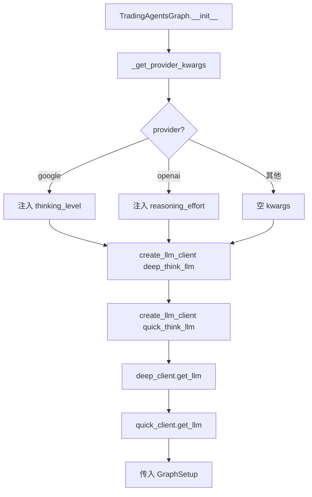
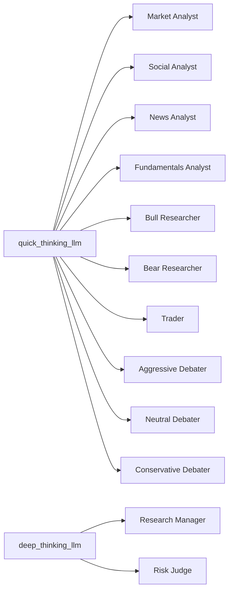
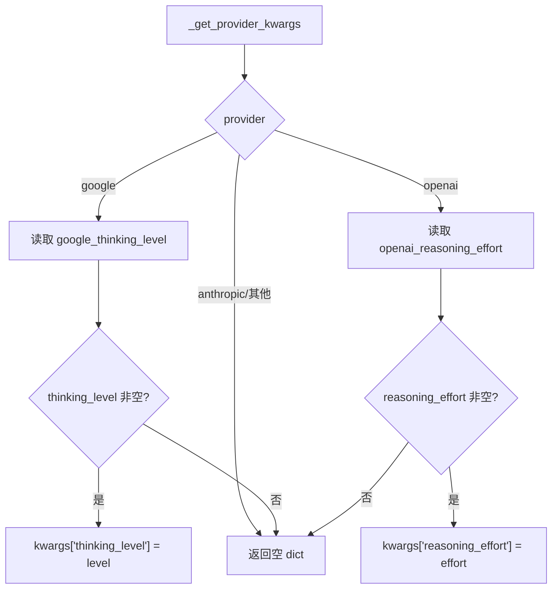

# PD-12.07 TradingAgents — 双层 LLM 策略与供应商推理参数归一化

> 文档编号：PD-12.07
> 来源：TradingAgents `tradingagents/graph/trading_graph.py`, `tradingagents/llm_clients/`
> GitHub：https://github.com/TauricResearch/TradingAgents.git
> 问题域：PD-12 推理增强 Reasoning Enhancement
> 状态：可复用方案

---

## 第 1 章 问题与动机

### 1.1 核心问题

多 Agent 金融交易系统中，不同角色的推理需求差异巨大：
- **分析师**（Market/Social/News/Fundamentals）执行数据采集和初步分析，需要快速响应，不需要深度推理
- **Research Manager** 需要综合多方观点做出投资判断，需要深度推理能力
- **Risk Judge** 需要在激进/保守/中立三方辩论后做最终风险裁决，同样需要深度推理

如果所有角色都用同一个大模型，成本会爆炸；如果都用小模型，关键决策节点的推理质量不够。
此外，不同 LLM 供应商（OpenAI、Google、Anthropic）对"推理增强"的 API 参数完全不同，
需要一个统一的抽象层来屏蔽差异。

### 1.2 TradingAgents 的解法概述

1. **双层 LLM 配置**：`deep_think_llm` + `quick_think_llm` 两个独立模型槽位，在 `default_config.py:12-13` 定义
2. **角色-模型映射**：在 `graph/setup.py:60-106` 中，分析师和研究员用 `quick_thinking_llm`，Research Manager 和 Risk Judge 用 `deep_thinking_llm`
3. **供应商推理参数归一化**：`trading_graph.py:133-148` 的 `_get_provider_kwargs()` 将 `google_thinking_level` 和 `openai_reasoning_effort` 统一注入
4. **推理模型自动适配**：`openai_client.py:21-28` 的 `_is_reasoning_model()` 自动检测 o1/o3/gpt-5 系列，剥离不兼容的 temperature/top_p 参数
5. **Gemini 跨代兼容**：`google_client.py:45-59` 将统一的 `thinking_level` 映射到 Gemini 3 的 `thinking_level` 或 Gemini 2.5 的 `thinking_budget`

### 1.3 设计思想

| 设计原则 | 具体实现 | 理由 | 替代方案 |
|----------|----------|------|----------|
| 角色驱动分层 | 按 Agent 角色而非任务类型分配模型 | 金融决策链中角色职责固定，映射关系稳定 | 按 token 数动态路由（复杂度高） |
| 配置外置 | deep/quick 模型名在 config dict 中指定 | 用户可在 CLI 交互式选择，无需改代码 | 硬编码模型名（不灵活） |
| 供应商透明 | Factory + 策略模式屏蔽供应商差异 | 切换 OpenAI→Google 只需改 config | 每个 Agent 自己处理供应商逻辑 |
| 推理参数归一化 | 统一 config key → 各 client 内部映射 | 用户只需理解 "thinking_level" 概念 | 暴露每个供应商的原始参数名 |
| 防御性参数剥离 | 推理模型自动移除 temperature/top_p | o1/o3 不支持这些参数，传了会报错 | 让用户自己记住哪些模型不支持 |

---

## 第 2 章 源码实现分析

### 2.1 架构概览

TradingAgents 的推理增强架构分为三层：配置层、客户端层、图编排层。

```
┌─────────────────────────────────────────────────────────┐
│                    Config Layer                          │
│  default_config.py                                      │
│  ┌─────────────────┐  ┌──────────────────────────────┐  │
│  │ deep_think_llm  │  │ google_thinking_level        │  │
│  │ quick_think_llm │  │ openai_reasoning_effort      │  │
│  └─────────────────┘  └──────────────────────────────┘  │
├─────────────────────────────────────────────────────────┤
│                   Client Layer                           │
│  factory.py → OpenAIClient / GoogleClient / Anthropic   │
│  ┌──────────────┐ ┌──────────────┐ ┌────────────────┐  │
│  │ reasoning_   │ │ thinking_    │ │ (no reasoning  │  │
│  │ effort       │ │ level/budget │ │  param yet)    │  │
│  └──────────────┘ └──────────────┘ └────────────────┘  │
├─────────────────────────────────────────────────────────┤
│                    Graph Layer                            │
│  trading_graph.py → setup.py                             │
│  ┌────────────────────────────────────────────────────┐ │
│  │ Analysts ──→ quick_thinking_llm                    │ │
│  │ Researchers ──→ quick_thinking_llm                 │ │
│  │ Research Manager ──→ deep_thinking_llm             │ │
│  │ Trader ──→ quick_thinking_llm                      │ │
│  │ Risk Debaters ──→ quick_thinking_llm               │ │
│  │ Risk Judge ──→ deep_thinking_llm                   │ │
│  └────────────────────────────────────────────────────┘ │
└─────────────────────────────────────────────────────────┘
```

### 2.2 核心实现

#### 2.2.1 双层 LLM 初始化



对应源码 `tradingagents/graph/trading_graph.py:74-95`：

```python
# Initialize LLMs with provider-specific thinking configuration
llm_kwargs = self._get_provider_kwargs()

# Add callbacks to kwargs if provided (passed to LLM constructor)
if self.callbacks:
    llm_kwargs["callbacks"] = self.callbacks

deep_client = create_llm_client(
    provider=self.config["llm_provider"],
    model=self.config["deep_think_llm"],
    base_url=self.config.get("backend_url"),
    **llm_kwargs,
)
quick_client = create_llm_client(
    provider=self.config["llm_provider"],
    model=self.config["quick_think_llm"],
    base_url=self.config.get("backend_url"),
    **llm_kwargs,
)

self.deep_thinking_llm = deep_client.get_llm()
self.quick_thinking_llm = quick_client.get_llm()
```

#### 2.2.2 角色-模型映射



对应源码 `tradingagents/graph/setup.py:60-106`：

```python
# 分析师全部使用 quick_thinking_llm
analyst_nodes["market"] = create_market_analyst(self.quick_thinking_llm)
analyst_nodes["social"] = create_social_media_analyst(self.quick_thinking_llm)
analyst_nodes["news"] = create_news_analyst(self.quick_thinking_llm)
analyst_nodes["fundamentals"] = create_fundamentals_analyst(self.quick_thinking_llm)

# 研究员使用 quick_thinking_llm
bull_researcher_node = create_bull_researcher(self.quick_thinking_llm, self.bull_memory)
bear_researcher_node = create_bear_researcher(self.quick_thinking_llm, self.bear_memory)

# 关键决策者使用 deep_thinking_llm
research_manager_node = create_research_manager(
    self.deep_thinking_llm, self.invest_judge_memory  # ← deep
)
risk_manager_node = create_risk_manager(
    self.deep_thinking_llm, self.risk_manager_memory  # ← deep
)

# Trader 和风险辩论者使用 quick_thinking_llm
trader_node = create_trader(self.quick_thinking_llm, self.trader_memory)
aggressive_analyst = create_aggressive_debator(self.quick_thinking_llm)
```

### 2.3 实现细节

#### 供应商推理参数归一化

`_get_provider_kwargs()` 方法（`trading_graph.py:133-148`）是归一化的核心：



对应源码 `tradingagents/graph/trading_graph.py:133-148`：

```python
def _get_provider_kwargs(self) -> Dict[str, Any]:
    """Get provider-specific kwargs for LLM client creation."""
    kwargs = {}
    provider = self.config.get("llm_provider", "").lower()

    if provider == "google":
        thinking_level = self.config.get("google_thinking_level")
        if thinking_level:
            kwargs["thinking_level"] = thinking_level

    elif provider == "openai":
        reasoning_effort = self.config.get("openai_reasoning_effort")
        if reasoning_effort:
            kwargs["reasoning_effort"] = reasoning_effort

    return kwargs
```

#### Google Gemini 跨代映射

GoogleClient 内部处理了 Gemini 3 和 Gemini 2.5 两代模型的 API 差异（`google_client.py:45-59`）：

- **Gemini 3 Pro**: 支持 `thinking_level`（low, high），不支持 "minimal"
- **Gemini 3 Flash**: 支持 `thinking_level`（minimal, low, medium, high）
- **Gemini 2.5**: 使用 `thinking_budget`（-1=动态, 0=禁用）

```python
thinking_level = self.kwargs.get("thinking_level")
if thinking_level:
    model_lower = self.model.lower()
    if "gemini-3" in model_lower:
        if "pro" in model_lower and thinking_level == "minimal":
            thinking_level = "low"  # Pro 不支持 minimal，降级为 low
        llm_kwargs["thinking_level"] = thinking_level
    else:
        # Gemini 2.5: 映射到 thinking_budget
        llm_kwargs["thinking_budget"] = -1 if thinking_level == "high" else 0
```

#### OpenAI 推理模型自动适配

`UnifiedChatOpenAI`（`openai_client.py:10-28`）自动检测推理模型并剥离不兼容参数：

```python
class UnifiedChatOpenAI(ChatOpenAI):
    def __init__(self, **kwargs):
        model = kwargs.get("model", "")
        if self._is_reasoning_model(model):
            kwargs.pop("temperature", None)
            kwargs.pop("top_p", None)
        super().__init__(**kwargs)

    @staticmethod
    def _is_reasoning_model(model: str) -> bool:
        model_lower = model.lower()
        return (
            model_lower.startswith("o1")
            or model_lower.startswith("o3")
            or "gpt-5" in model_lower
        )
```

#### 工厂模式路由

`factory.py:9-43` 的 `create_llm_client()` 根据 provider 字符串路由到对应客户端：

```python
def create_llm_client(provider, model, base_url=None, **kwargs) -> BaseLLMClient:
    provider_lower = provider.lower()
    if provider_lower in ("openai", "ollama", "openrouter"):
        return OpenAIClient(model, base_url, provider=provider_lower, **kwargs)
    if provider_lower == "xai":
        return OpenAIClient(model, base_url, provider="xai", **kwargs)
    if provider_lower == "anthropic":
        return AnthropicClient(model, base_url, **kwargs)
    if provider_lower == "google":
        return GoogleClient(model, base_url, **kwargs)
    raise ValueError(f"Unsupported LLM provider: {provider}")
```

---

## 第 3 章 迁移指南

### 3.1 迁移清单

**阶段 1：双层 LLM 基础设施**
- [ ] 定义配置结构：`deep_think_llm` + `quick_think_llm` 两个模型槽位
- [ ] 实现 `BaseLLMClient` 抽象基类（ABC + get_llm + validate_model）
- [ ] 为每个目标供应商实现具体 Client（OpenAI/Google/Anthropic）
- [ ] 实现 `create_llm_client()` 工厂函数

**阶段 2：供应商推理参数**
- [ ] 在配置中添加 `google_thinking_level` 和 `openai_reasoning_effort`
- [ ] 在 Google Client 中实现 Gemini 3/2.5 跨代映射
- [ ] 在 OpenAI Client 中实现推理模型自动检测和参数剥离
- [ ] 实现 `_get_provider_kwargs()` 归一化方法

**阶段 3：角色映射**
- [ ] 梳理系统中所有 Agent 角色的推理需求
- [ ] 将角色分为 deep/quick 两组
- [ ] 在图构建时注入对应的 LLM 实例

### 3.2 适配代码模板

以下是一个可直接复用的双层 LLM + 供应商归一化模板：

```python
from abc import ABC, abstractmethod
from typing import Any, Optional, Dict


# ── 1. 抽象基类 ──
class BaseLLMClient(ABC):
    def __init__(self, model: str, base_url: Optional[str] = None, **kwargs):
        self.model = model
        self.base_url = base_url
        self.kwargs = kwargs

    @abstractmethod
    def get_llm(self) -> Any:
        pass


# ── 2. OpenAI Client（含推理模型适配）──
class OpenAIClient(BaseLLMClient):
    REASONING_PREFIXES = ("o1", "o3", "o4")

    def get_llm(self) -> Any:
        from langchain_openai import ChatOpenAI

        llm_kwargs = {"model": self.model}
        if self.base_url:
            llm_kwargs["base_url"] = self.base_url

        # 推理模型自动剥离不兼容参数
        if any(self.model.lower().startswith(p) for p in self.REASONING_PREFIXES):
            self.kwargs.pop("temperature", None)
            self.kwargs.pop("top_p", None)

        # 透传 reasoning_effort
        for key in ("reasoning_effort", "api_key", "callbacks"):
            if key in self.kwargs:
                llm_kwargs[key] = self.kwargs[key]

        return ChatOpenAI(**llm_kwargs)


# ── 3. Google Client（含跨代映射）──
class GoogleClient(BaseLLMClient):
    def get_llm(self) -> Any:
        from langchain_google_genai import ChatGoogleGenerativeAI

        llm_kwargs = {"model": self.model}
        thinking_level = self.kwargs.get("thinking_level")
        if thinking_level:
            if "gemini-3" in self.model.lower():
                llm_kwargs["thinking_level"] = thinking_level
            else:
                llm_kwargs["thinking_budget"] = -1 if thinking_level == "high" else 0

        return ChatGoogleGenerativeAI(**llm_kwargs)


# ── 4. 工厂 ──
def create_llm_client(provider: str, model: str, **kwargs) -> BaseLLMClient:
    clients = {"openai": OpenAIClient, "google": GoogleClient}
    cls = clients.get(provider.lower())
    if not cls:
        raise ValueError(f"Unsupported provider: {provider}")
    return cls(model, **kwargs)


# ── 5. 双层初始化 ──
class DualLLMSystem:
    def __init__(self, config: Dict[str, Any]):
        provider_kwargs = self._get_provider_kwargs(config)

        deep_client = create_llm_client(
            provider=config["llm_provider"],
            model=config["deep_think_llm"],
            **provider_kwargs,
        )
        quick_client = create_llm_client(
            provider=config["llm_provider"],
            model=config["quick_think_llm"],
            **provider_kwargs,
        )
        self.deep_llm = deep_client.get_llm()
        self.quick_llm = quick_client.get_llm()

    @staticmethod
    def _get_provider_kwargs(config: Dict) -> Dict:
        kwargs = {}
        provider = config.get("llm_provider", "").lower()
        if provider == "google":
            level = config.get("google_thinking_level")
            if level:
                kwargs["thinking_level"] = level
        elif provider == "openai":
            effort = config.get("openai_reasoning_effort")
            if effort:
                kwargs["reasoning_effort"] = effort
        return kwargs
```

### 3.3 适用场景

| 场景 | 适用度 | 说明 |
|------|--------|------|
| 多 Agent 系统（角色固定） | ⭐⭐⭐ | 角色-模型映射关系稳定，双层策略直接适用 |
| 单 Agent 多步骤流水线 | ⭐⭐ | 可按步骤复杂度分配，但需自定义映射规则 |
| 多供应商切换需求 | ⭐⭐⭐ | 工厂 + 归一化模式直接解决供应商锁定问题 |
| 推理模型（o1/o3）使用 | ⭐⭐⭐ | 自动参数剥离避免 API 报错 |
| 成本敏感场景 | ⭐⭐⭐ | 80% 节点用小模型，仅关键决策用大模型 |
| 动态路由（按 token 数） | ⭐ | 本方案是静态映射，不适合动态路由场景 |

---

## 第 4 章 测试用例

```python
import pytest
from unittest.mock import patch, MagicMock


class TestDualLLMConfig:
    """测试双层 LLM 配置解析。"""

    def test_default_config_has_both_llm_slots(self):
        from tradingagents.default_config import DEFAULT_CONFIG
        assert "deep_think_llm" in DEFAULT_CONFIG
        assert "quick_think_llm" in DEFAULT_CONFIG
        assert DEFAULT_CONFIG["deep_think_llm"] != DEFAULT_CONFIG["quick_think_llm"]

    def test_deep_model_is_larger(self):
        """deep_think_llm 应该是更强的模型。"""
        from tradingagents.default_config import DEFAULT_CONFIG
        deep = DEFAULT_CONFIG["deep_think_llm"]
        quick = DEFAULT_CONFIG["quick_think_llm"]
        # gpt-5.2 > gpt-5-mini
        assert "mini" not in deep
        assert "mini" in quick or "nano" in quick


class TestProviderKwargs:
    """测试供应商推理参数归一化。"""

    def test_google_thinking_level_injected(self):
        config = {
            "llm_provider": "google",
            "google_thinking_level": "high",
            "deep_think_llm": "gemini-2.5-pro",
            "quick_think_llm": "gemini-2.5-flash",
        }
        from tradingagents.graph.trading_graph import TradingAgentsGraph
        # 直接测试 _get_provider_kwargs 静态逻辑
        graph = TradingAgentsGraph.__new__(TradingAgentsGraph)
        graph.config = config
        kwargs = graph._get_provider_kwargs()
        assert kwargs == {"thinking_level": "high"}

    def test_openai_reasoning_effort_injected(self):
        config = {
            "llm_provider": "openai",
            "openai_reasoning_effort": "medium",
            "deep_think_llm": "gpt-5.2",
            "quick_think_llm": "gpt-5-mini",
        }
        graph = TradingAgentsGraph.__new__(TradingAgentsGraph)
        graph.config = config
        kwargs = graph._get_provider_kwargs()
        assert kwargs == {"reasoning_effort": "medium"}

    def test_anthropic_returns_empty_kwargs(self):
        config = {"llm_provider": "anthropic"}
        graph = TradingAgentsGraph.__new__(TradingAgentsGraph)
        graph.config = config
        kwargs = graph._get_provider_kwargs()
        assert kwargs == {}


class TestReasoningModelDetection:
    """测试推理模型自动检测。"""

    def test_o1_is_reasoning_model(self):
        from tradingagents.llm_clients.openai_client import UnifiedChatOpenAI
        assert UnifiedChatOpenAI._is_reasoning_model("o1") is True
        assert UnifiedChatOpenAI._is_reasoning_model("o1-preview") is True

    def test_o3_is_reasoning_model(self):
        from tradingagents.llm_clients.openai_client import UnifiedChatOpenAI
        assert UnifiedChatOpenAI._is_reasoning_model("o3") is True
        assert UnifiedChatOpenAI._is_reasoning_model("o3-mini") is True

    def test_gpt5_is_reasoning_model(self):
        from tradingagents.llm_clients.openai_client import UnifiedChatOpenAI
        assert UnifiedChatOpenAI._is_reasoning_model("gpt-5.2") is True
        assert UnifiedChatOpenAI._is_reasoning_model("gpt-5-mini") is True

    def test_gpt4o_is_not_reasoning_model(self):
        from tradingagents.llm_clients.openai_client import UnifiedChatOpenAI
        assert UnifiedChatOpenAI._is_reasoning_model("gpt-4o") is False
        assert UnifiedChatOpenAI._is_reasoning_model("gpt-4o-mini") is False


class TestGeminiThinkingMapping:
    """测试 Gemini 跨代 thinking 参数映射。"""

    def test_gemini3_pro_minimal_downgrades_to_low(self):
        """Gemini 3 Pro 不支持 minimal，应降级为 low。"""
        from tradingagents.llm_clients.google_client import GoogleClient
        client = GoogleClient(model="gemini-3-pro-preview", thinking_level="minimal")
        # 验证内部映射逻辑
        assert client.kwargs.get("thinking_level") == "minimal"

    def test_gemini25_high_maps_to_budget_minus1(self):
        """Gemini 2.5 的 high 应映射为 thinking_budget=-1。"""
        from tradingagents.llm_clients.google_client import GoogleClient
        client = GoogleClient(model="gemini-2.5-pro", thinking_level="high")
        assert client.kwargs.get("thinking_level") == "high"
```

---

## 第 5 章 跨域关联

| 关联域 | 关系类型 | 说明 |
|--------|----------|------|
| PD-01 上下文管理 | 协同 | deep_think_llm 通常是大模型，context window 更大，但成本更高；quick_think_llm 的 context 限制可能影响分析师的数据摄入量 |
| PD-02 多 Agent 编排 | 依赖 | 双层 LLM 策略的前提是有多 Agent 编排框架（LangGraph StateGraph），角色-模型映射在图构建阶段完成 |
| PD-04 工具系统 | 协同 | 分析师节点同时绑定 quick_thinking_llm 和 ToolNode，工具调用的 token 消耗影响模型选择 |
| PD-06 记忆持久化 | 协同 | Research Manager 和 Risk Judge 使用 deep_thinking_llm + FinancialSituationMemory，记忆注入增加了 context 但也增强了推理质量 |
| PD-11 可观测性 | 协同 | callbacks 参数透传到两层 LLM，可分别追踪 deep/quick 的 token 消耗和延迟 |

---

## 第 6 章 来源文件索引

| 文件 | 行范围 | 关键实现 |
|------|--------|----------|
| `tradingagents/default_config.py` | L1-L34 | 双层 LLM 配置定义（deep_think_llm, quick_think_llm, thinking 参数） |
| `tradingagents/graph/trading_graph.py` | L74-L95 | 双层 LLM 客户端创建和初始化 |
| `tradingagents/graph/trading_graph.py` | L133-L148 | `_get_provider_kwargs()` 供应商推理参数归一化 |
| `tradingagents/graph/setup.py` | L40-L106 | 角色-模型映射：分析师→quick，Manager/Judge→deep |
| `tradingagents/llm_clients/factory.py` | L9-L43 | `create_llm_client()` 工厂函数，按 provider 路由 |
| `tradingagents/llm_clients/openai_client.py` | L10-L28 | `UnifiedChatOpenAI` 推理模型自动检测和参数剥离 |
| `tradingagents/llm_clients/openai_client.py` | L31-L72 | `OpenAIClient` 多供应商支持（OpenAI/Ollama/OpenRouter/xAI） |
| `tradingagents/llm_clients/google_client.py` | L31-L65 | `GoogleClient` Gemini 3/2.5 跨代 thinking 参数映射 |
| `tradingagents/llm_clients/anthropic_client.py` | L9-L27 | `AnthropicClient`（当前无推理参数，预留扩展） |
| `tradingagents/llm_clients/base_client.py` | L1-L21 | `BaseLLMClient` 抽象基类 |
| `tradingagents/llm_clients/validators.py` | L7-L82 | 多供应商模型名验证表 |
| `cli/utils.py` | L293-L328 | CLI 交互式推理参数选择（reasoning_effort, thinking_level） |
| `cli/main.py` | L556-L589 | CLI 配置流程：Step 6 选模型 → Step 7 选推理参数 |

---

## 第 7 章 横向对比维度

> 本章用于自动填充 Butcher Wiki 的横向对比表。

```json comparison_data
{
  "project": "TradingAgents",
  "dimensions": {
    "推理方式": "双层 LLM 静态映射：角色绑定 deep/quick 模型槽位",
    "模型策略": "deep_think_llm + quick_think_llm 配置外置",
    "成本": "仅 2/12 节点用大模型，其余全用小模型",
    "适用场景": "多 Agent 金融交易决策，角色职责固定",
    "推理模式": "供应商原生推理（reasoning_effort/thinking_level）",
    "增强策略": "推理模型自动检测 + 不兼容参数剥离",
    "成本控制": "角色驱动分层，关键决策节点才用大模型",
    "思考预算": "Google thinking_budget 跨代映射（-1/0）",
    "推理可见性": "callbacks 透传，可分别追踪 deep/quick 消耗",
    "推理级别归一化": "统一 config key → 各 Client 内部映射到供应商 API",
    "供应商兼容性": "Factory 模式支持 6 家供应商热切换"
  }
}
```

### 域元数据补充

```json domain_metadata
{
  "solution_summary": "TradingAgents 用 deep_think_llm + quick_think_llm 双槽位配置，将 12 个 Agent 角色静态映射到两层模型，并通过 Factory + 归一化层屏蔽 OpenAI/Google/Anthropic 的推理参数差异",
  "description": "多供应商推理参数的统一抽象与跨代模型兼容处理",
  "sub_problems": [
    "推理模型参数兼容：自动检测推理模型并剥离不支持的采样参数",
    "跨代模型映射：同一供应商不同代模型的推理 API 差异适配",
    "角色-模型静态绑定：在图构建阶段确定每个 Agent 的模型层级"
  ],
  "best_practices": [
    "推理模型白名单检测：用前缀匹配识别推理模型，自动移除 temperature/top_p",
    "双槽位而非多槽位：两层足够覆盖大多数场景，避免配置爆炸",
    "供应商参数在 Client 内部映射：上层只传语义化参数，不暴露供应商细节"
  ]
}
```
