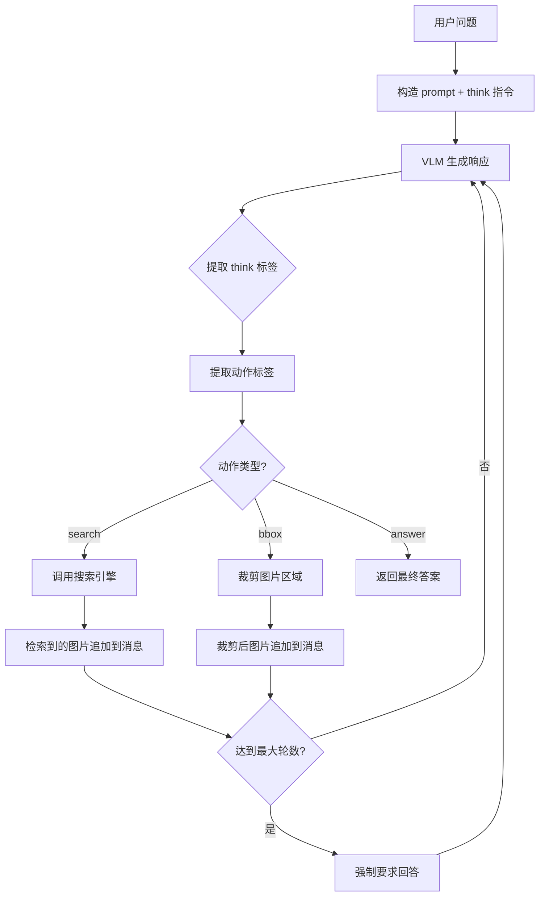
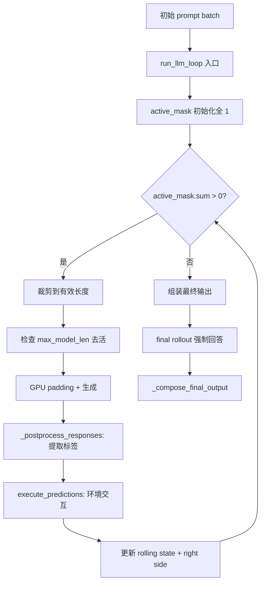
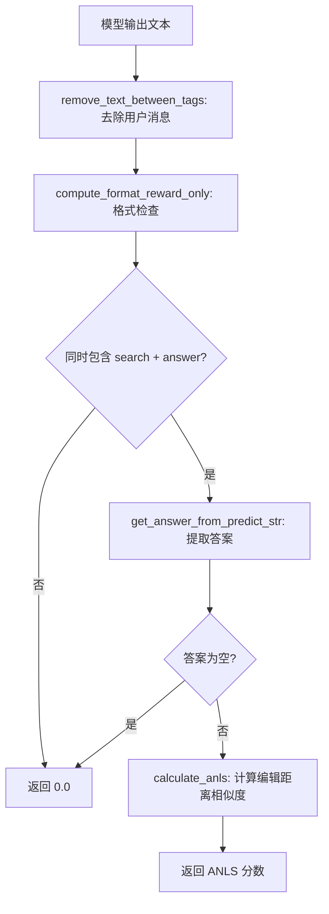

# PD-12.NN VRAG — 视觉 RAG 多轮迭代推理与 RL 强化训练

> 文档编号：PD-12.NN
> 来源：VRAG `demo/vrag_agent.py`, `VRAG-RL/vrag_agent/generation.py`
> GitHub：https://github.com/Alibaba-NLP/VRAG.git
> 问题域：PD-12 推理增强 Reasoning Enhancement
> 状态：可复用方案

---

## 第 1 章 问题与动机

### 1.1 核心问题

传统 RAG 系统面对视觉文档（PDF 页面、图表、信息图）时存在根本性缺陷：文本 RAG 依赖 OCR 提取文字后再检索，丢失了布局、图表、颜色等视觉语义信息。即使使用 VLM（Vision Language Model），单轮检索-生成的管道也无法处理需要多步推理的复杂问题——比如"东南亚信用卡渗透率最高的国家的旅行社使用率是多少"需要先找到渗透率数据，再定位对应国家的旅行社数据。

VRAG 的核心洞察是：**视觉文档理解需要从粗粒度到细粒度的迭代推理**。Agent 应该像人类阅读文档一样——先搜索相关页面，看到全局后推理需要关注哪个区域，然后裁剪放大该区域获取细节，如此反复直到获得足够信息回答问题。

### 1.2 VRAG 的解法概述

1. **显式推理链（`<think>` 标签）**：Agent 每次获取新信息后必须先在 `<think>...</think>` 标签内推理，再决定下一步动作（`demo/vrag_agent.py:11`）
2. **三动作空间**：`<search>` 检索文档页面、`<bbox>` 裁剪感兴趣区域、`<answer>` 给出最终答案（`demo/vrag_agent.py:105`）
3. **多轮迭代循环**：通过 while 循环实现最多 N 轮的推理-动作-观察循环，每轮都可能引入新的视觉信息（`demo/vrag_agent.py:83-179`）
4. **RL 强化训练**：使用 GRPO/PPO 算法对多轮推理行为进行强化学习训练，奖励函数同时考虑格式正确性和答案准确性（`VRAG-RL/verl/utils/reward_score/vrag.py:48-59`）
5. **视觉嵌入检索**：使用 ColQwen2 等多模态嵌入模型直接对 PDF 页面图片做向量检索，跳过 OCR（`search_engine/vl_embedding.py:89-95`）

### 1.3 设计思想

| 设计原则 | 具体实现 | 理由 | 替代方案 |
|----------|----------|------|----------|
| Think-before-Act | 每轮必须先 `<think>` 再执行动作 | 强制模型显式推理，避免盲目搜索 | 隐式 CoT（无标签约束） |
| 粗到细迭代 | search → bbox → answer 三级动作 | 模拟人类阅读：先找页面，再看细节 | 单轮全页面理解 |
| RL 训练推理能力 | GRPO + ANLS 奖励函数 | SFT 只能模仿，RL 能探索更优推理路径 | 纯 SFT 微调 |
| 纯视觉检索 | ColQwen2 图片嵌入 + MaxSim 评分 | 保留完整视觉语义，不依赖 OCR | OCR → 文本检索 |
| 动作空间约束 | 正则提取 `<tag>...</tag>` 格式 | 结构化输出便于环境解析和奖励计算 | 自由文本输出 |

---

## 第 2 章 源码实现分析

### 2.1 架构概览

VRAG 系统分为三个核心组件：推理 Agent、视觉搜索引擎、RL 训练框架。

```
┌─────────────────────────────────────────────────────────┐
│                    VRAG Agent Loop                       │
│                                                         │
│  Question ──→ [VLM: Qwen2.5-VL-7B]                     │
│                    │                                    │
│                    ▼                                    │
│              <think>推理</think>                         │
│                    │                                    │
│          ┌────────┼────────┐                            │
│          ▼        ▼        ▼                            │
│     <search>   <bbox>   <answer>                        │
│       query    [x,y,w,h]  最终答案                      │
│          │        │        │                            │
│          ▼        ▼        ▼                            │
│    ColQwen2    裁剪放大    返回结果                       │
│    视觉检索    图片区域                                   │
│          │        │                                     │
│          └────────┘                                     │
│               │                                         │
│               ▼                                         │
│     新图片/裁剪结果 → 追加到对话历史                      │
│               │                                         │
│               └──→ 下一轮 <think>                        │
└─────────────────────────────────────────────────────────┘
                         │
          ┌──────────────┼──────────────┐
          ▼                             ▼
┌──────────────────┐          ┌──────────────────┐
│  Search Engine   │          │   VRAG-RL Train  │
│  ColQwen2 嵌入   │          │  GRPO/PPO + verl │
│  MaxSim 评分     │          │  ANLS 奖励函数    │
│  Top-K 召回      │          │  多轮环境交互     │
└──────────────────┘          └──────────────────┘
```

### 2.2 核心实现

#### 2.2.1 推理 Agent 主循环



对应源码 `demo/vrag_agent.py:67-179`：

```python
def run(self, question):
    self.image_raw = []
    self.image_input = []
    self.image_path = []
    prompt = prompt_ins.format(question=question)
    messages = [dict(
        role="user",
        content=[{"type": "text", "text": prompt}]
    )]

    max_steps = self.max_steps
    while True:
        ## assistant — VLM 生成包含 <think> 和动作标签的响应
        response = self.client.chat.completions.create(
            model="Qwen/Qwen2.5-VL-7B-Instruct",
            messages=messages, stream=False
        )
        response_content = response.choices[0].message.content
        messages.append(dict(role="assistant",
            content=[{"type": "text", "text": response_content}]))

        ## 提取 think 推理内容
        pattern = r'<think>(.*?)</think>'
        match = re.search(pattern, response_content, re.DOTALL)
        thought = match.group(1)

        ## 提取动作：search / answer / bbox
        pattern = r'<(search|answer|bbox)>(.*?)</\1>'
        match = re.search(pattern, response_content, re.DOTALL)
        if match:
            content = match.group(2).strip()
            action = match.group(1)

        ## 终止条件：answer 或达到最大轮数
        if action == 'answer':
            return 'answer', content, raw_content
        elif max_steps == 0:
            return 'answer', 'Sorry, I can not retrieval something...', ''
```

关键设计点：
- **Prompt 注入推理约束**（`demo/vrag_agent.py:11`）：系统 prompt 明确要求"You must conduct reasoning inside `<think>` and `</think>` first every time you get new information"
- **去重机制**（`demo/vrag_agent.py:128`）：`self.image_path.count(image_path) >= self.repeated_nums` 防止重复检索同一页面
- **强制终止**（`demo/vrag_agent.py:171-175`）：最后一轮追加 "please answer the question now" 强制模型给出答案

#### 2.2.2 RL 训练环境中的多轮生成循环



对应源码 `VRAG-RL/vrag_agent/generation.py:372-511`：

```python
def run_llm_loop(self, gen_batch, initial_input_ids):
    active_mask = torch.ones(gen_batch.batch['input_ids'].shape[0], dtype=torch.bool)
    rollings = gen_batch
    self.retrievaled_images = [[] for _ in range(gen_batch.batch['input_ids'].shape[0])]

    for step in range(self.config.max_turns):
        if not active_mask.sum():
            break
        # 裁剪到有效长度，避免浪费计算
        rollings.batch = self.tensor_fn.cut_to_effective_len(
            rollings.batch, keys=['input_ids', 'attention_mask', 'position_ids'])
        # 检查是否超过 max_model_len，超过则去活
        active_mask = self.deactivate_batch(active_mask, rollings)
        if not active_mask.sum():
            break
        # 只对活跃样本生成
        gen_output = self._generate_with_gpu_padding(rollings_active)
        # 后处理：提取 <think>/<search>/<bbox>/<answer> 标签
        responses_ids, responses_str = self._postprocess_responses(gen_output.batch['responses'])
        # 环境交互：执行搜索/裁剪/回答
        next_obs, dones = self.execute_predictions(responses_str, ...)
        # 更新活跃掩码
        curr_active_mask = torch.tensor([not done for done in dones], dtype=torch.bool)
        active_mask = active_mask * curr_active_mask
        # 处理新观察（图片）并更新状态
        rollings = self._update_rolling_state(rollings, responses_ids, next_obs_ids)
```

关键设计点：
- **active_mask 批量管理**（`generation.py:379`）：不同样本可能在不同轮次完成，用 mask 避免对已完成样本做无效计算
- **max_model_len 去活**（`generation.py:365-370`）：当 prompt 长度超过模型上限时自动去活该样本，防止 OOM
- **GPU padding 对齐**（`generation.py:267-342`）：多 GPU 推理时自动 padding 到 batch_size 整除 num_gpus

#### 2.2.3 奖励函数设计



对应源码 `VRAG-RL/verl/utils/reward_score/vrag.py:48-59`：

```python
def compute_score(predict_str: str, ground_truth: str, extra_info) -> float:
    predict_str = remove_text_between_tags(predict_str)
    format_reward_value = compute_format_reward_only(predict_str)
    if format_reward_value == 1.0:
        answer = get_answer_from_predict_str(predict_str)
        if answer is None:
            return 0.0
        anls_score = calculate_anls([ground_truth], answer, 0.5)
        return anls_score
    else:
        return 0.0
```

奖励函数的双重门控设计：
1. **格式奖励**（`vrag.py:67-73`）：输出必须同时包含 `<search>` 和 `<answer>` 标签才得分，强制模型学会"先搜索再回答"的行为模式
2. **ANLS 准确性奖励**（`vrag.py:31-47`）：使用 Average Normalized Levenshtein Similarity 计算答案与 ground truth 的相似度，阈值 0.5

### 2.3 实现细节

**响应后处理 — 标签提取与清洗**（`generation.py:99-111`）：

```python
def extract_tags(text):
    pattern = r"<(answer|search|think|bbox)>(.*?)</\1>"
    matches = re.findall(pattern, text, re.DOTALL)
    result = "\n".join([f"<{tag}>{content}</{tag}>" for tag, content in matches])
    return result

responses_str = [extract_tags(resp) + self.tokenizer.eos_token for resp in responses_str]
```

这个后处理步骤至关重要：它从模型的自由文本输出中只保留合法的标签对内容，丢弃标签外的噪声文本。这确保了环境交互的输入是干净的结构化动作。

**多模态状态累积**（`generation.py:191-213`）：每轮检索到的新图片会追加到 `rollings.non_tensor_batch['multi_modal_data']` 中，pixel_values 和 image_grid_thw 通过 `torch.cat` 拼接，使得 VLM 在后续轮次能看到所有历史检索的图片。

**无效动作处理**（`generation.py:127-156`）：当模型输出无法解析的动作时，环境返回一段纠正性 prompt："Your previous action is invalid. You must conduct reasoning inside `<think>` and `</think>` first..."，引导模型回到正确的推理格式。


---

## 第 3 章 迁移指南

### 3.1 迁移清单

**阶段 1：推理循环框架（1-2 天）**
- [ ] 定义动作空间枚举（search / bbox / answer 或自定义）
- [ ] 实现 prompt 模板，注入 `<think>` 推理约束
- [ ] 实现主循环：VLM 调用 → 标签提取 → 动作执行 → 观察追加
- [ ] 实现最大轮数限制和强制终止机制

**阶段 2：环境交互层（1-2 天）**
- [ ] 实现搜索引擎接口（可替换为任意 RAG 后端）
- [ ] 实现 bbox 裁剪逻辑（坐标映射 + padding）
- [ ] 实现无效动作处理和纠正性 prompt
- [ ] 实现去重机制防止重复检索

**阶段 3：RL 训练（可选，3-5 天）**
- [ ] 定义奖励函数（格式奖励 + 准确性奖励）
- [ ] 实现多轮生成环境（active_mask 批量管理）
- [ ] 集成 verl/GRPO 训练框架
- [ ] 准备训练数据（问题 + ground truth 答案）

### 3.2 适配代码模板

以下是一个可直接运行的简化版推理 Agent，不依赖 VRAG 的特定搜索引擎：

```python
import re
import json
from typing import Generator, Tuple, Optional
from openai import OpenAI

REASONING_PROMPT = '''Answer the given question. You must conduct reasoning inside <think> and </think> first every time you get new information. After reasoning, you can:
1. Search for information: <search> your query </search>
2. Provide the final answer: <answer> your answer </answer>
You can search as many times as you want. Question: {question}
'''

class IterativeReasoningAgent:
    """可迁移的多轮迭代推理 Agent 框架。"""
    
    def __init__(
        self,
        base_url: str = 'http://localhost:8001/v1',
        model: str = 'Qwen/Qwen2.5-VL-7B-Instruct',
        max_steps: int = 10,
        search_fn=None,  # 可注入任意搜索函数
    ):
        self.client = OpenAI(base_url=base_url, api_key='EMPTY')
        self.model = model
        self.max_steps = max_steps
        self.search_fn = search_fn or self._default_search
    
    def _default_search(self, query: str) -> str:
        return f"[No search engine configured. Query: {query}]"
    
    def _extract_tags(self, text: str) -> Tuple[Optional[str], Optional[str], Optional[str]]:
        """提取 think 内容和动作标签。"""
        think_match = re.search(r'<think>(.*?)</think>', text, re.DOTALL)
        thought = think_match.group(1) if think_match else None
        
        action_match = re.search(r'<(search|answer)>(.*?)</\1>', text, re.DOTALL)
        if action_match:
            return thought, action_match.group(1), action_match.group(2).strip()
        return thought, None, None
    
    def run(self, question: str) -> Generator:
        """多轮迭代推理主循环。"""
        messages = [{"role": "user", "content": REASONING_PROMPT.format(question=question)}]
        
        for step in range(self.max_steps):
            response = self.client.chat.completions.create(
                model=self.model, messages=messages, stream=False
            )
            content = response.choices[0].message.content
            messages.append({"role": "assistant", "content": content})
            
            thought, action, action_content = self._extract_tags(content)
            
            if thought:
                yield 'think', thought
            
            if action == 'answer':
                return action_content
            elif action == 'search':
                yield 'search', action_content
                # 执行搜索并将结果追加到对话
                search_result = self.search_fn(action_content)
                messages.append({"role": "user", "content": search_result})
            else:
                # 无效动作，注入纠正 prompt
                messages.append({"role": "user", 
                    "content": "Invalid action. Please reason in <think>...</think> then use <search> or <answer>."})
            
            # 最后一轮强制回答
            if step == self.max_steps - 2:
                messages[-1]["content"] += "\nPlease provide your answer now in <answer>...</answer>."
        
        return "Unable to find answer within max steps."
```

### 3.3 适用场景

| 场景 | 适用度 | 说明 |
|------|--------|------|
| 视觉文档问答（PDF/图表） | ⭐⭐⭐ | VRAG 的核心场景，粗到细迭代最有效 |
| 多跳文本 RAG | ⭐⭐⭐ | think-search-answer 循环可直接复用，去掉 bbox |
| 单轮简单问答 | ⭐ | 过度设计，单轮 RAG 即可 |
| 实时对话系统 | ⭐⭐ | 多轮迭代有延迟，需限制 max_steps |
| 需要 RL 训练的场景 | ⭐⭐⭐ | 奖励函数设计（格式+准确性双门控）可直接复用 |
| 多模态理解（图片+文本混合） | ⭐⭐⭐ | 多模态状态累积机制可迁移 |

---

## 第 4 章 测试用例

```python
import re
import json
import pytest
from unittest.mock import MagicMock, patch
from typing import List, Tuple, Optional


class TestTagExtraction:
    """测试 VRAG 的标签提取逻辑（对应 generation.py:99-106）"""
    
    def _extract_tags(self, text: str) -> str:
        pattern = r"<(answer|search|think|bbox)>(.*?)</\1>"
        matches = re.findall(pattern, text, re.DOTALL)
        return "\n".join([f"<{tag}>{content}</{tag}>" for tag, content in matches])
    
    def test_normal_think_search(self):
        text = "<think>I need to find info about France</think><search>capital of France</search>"
        result = self._extract_tags(text)
        assert "<think>" in result
        assert "<search>capital of France</search>" in result
    
    def test_think_answer(self):
        text = "<think>Based on the retrieved info, Paris is the capital</think><answer>Paris</answer>"
        result = self._extract_tags(text)
        assert "<answer>Paris</answer>" in result
    
    def test_bbox_extraction(self):
        text = "<think>I see a chart in the top-right</think><bbox>[100, 200, 300, 400]</bbox>"
        result = self._extract_tags(text)
        assert "<bbox>[100, 200, 300, 400]</bbox>" in result
    
    def test_noise_outside_tags_stripped(self):
        text = "Some noise <think>reasoning</think> more noise <search>query</search> trailing"
        result = self._extract_tags(text)
        assert "noise" not in result
        assert "<think>reasoning</think>" in result
    
    def test_empty_input(self):
        result = self._extract_tags("")
        assert result == ""
    
    def test_multiline_think(self):
        text = "<think>Line 1\nLine 2\nLine 3</think><answer>42</answer>"
        result = self._extract_tags(text)
        assert "Line 1\nLine 2\nLine 3" in result


class TestActionParsing:
    """测试动作解析逻辑（对应 generation.py:639-668）"""
    
    def _parse_action(self, prediction: str) -> Tuple[Optional[str], str]:
        pattern = r'<(search|answer|bbox)>(.*?)</\1>'
        match = re.search(pattern, prediction, re.DOTALL)
        if match:
            return match.group(1), match.group(2).strip()
        return None, ''
    
    def test_search_action(self):
        action, content = self._parse_action("<search>what is AI</search>")
        assert action == "search"
        assert content == "what is AI"
    
    def test_answer_action(self):
        action, content = self._parse_action("<answer> Beijing </answer>")
        assert action == "answer"
        assert content == "Beijing"
    
    def test_bbox_action(self):
        action, content = self._parse_action("<bbox>[10, 20, 300, 400]</bbox>")
        assert action == "bbox"
        bbox = json.loads(content)
        assert len(bbox) == 4
        assert all(v >= 0 for v in bbox)
    
    def test_invalid_action(self):
        action, content = self._parse_action("I don't know what to do")
        assert action is None
        assert content == ''
    
    def test_nested_tags_takes_first(self):
        action, content = self._parse_action("<search>q1</search><answer>a1</answer>")
        assert action == "search"  # re.search 取第一个匹配


class TestRewardFunction:
    """测试奖励函数（对应 vrag.py:48-73）"""
    
    def _get_answer(self, text: str) -> Optional[str]:
        end_pos = text.rfind('</answer>')
        if end_pos == -1:
            return None
        start_pos = text.rfind('<answer>', 0, end_pos)
        if start_pos == -1:
            return None
        return text[start_pos + len('<answer>'):end_pos]
    
    def _calculate_anls(self, gold_labels: List[str], prediction: str, threshold=0.5) -> float:
        from Levenshtein import distance as levenshtein_distance
        max_scores = []
        for gold in gold_labels:
            ld = levenshtein_distance(prediction, gold)
            max_len = max(len(prediction), len(gold))
            nld = ld / max_len if max_len > 0 else 0.0
            score = 1 - nld if nld < threshold else 0.0
            max_scores.append(score)
        return max(max_scores)
    
    def test_exact_match_reward(self):
        score = self._calculate_anls(["Paris"], "Paris")
        assert score == 1.0
    
    def test_partial_match_reward(self):
        score = self._calculate_anls(["Paris"], "Pari")
        assert 0.5 < score < 1.0  # 高相似度
    
    def test_no_match_reward(self):
        score = self._calculate_anls(["Paris"], "Tokyo")
        assert score == 0.0  # 超过阈值
    
    def test_answer_extraction(self):
        text = "<think>reasoning</think><search>q</search><answer>Paris</answer>"
        answer = self._get_answer(text)
        assert answer == "Paris"
    
    def test_no_answer_tag(self):
        text = "<think>reasoning</think><search>query</search>"
        answer = self._get_answer(text)
        assert answer is None
    
    def test_format_reward_requires_both_tags(self):
        """格式奖励要求同时包含 search 和 answer"""
        text_good = "<search>q</search><answer>a</answer>"
        text_bad = "<answer>a</answer>"  # 缺少 search
        
        has_search = bool(re.search(r'<search>.*</search>', text_good, re.DOTALL))
        has_answer = bool(re.search(r'<answer>.*</answer>', text_good, re.DOTALL))
        assert has_search and has_answer
        
        has_search_bad = bool(re.search(r'<search>.*</search>', text_bad, re.DOTALL))
        assert not has_search_bad
```


---

## 第 5 章 跨域关联

| 关联域 | 关系类型 | 说明 |
|--------|----------|------|
| PD-01 上下文管理 | 依赖 | 多轮迭代中对话历史持续增长，`_update_rolling_state` 通过 `max_prompt_length` 截断管理上下文窗口（`generation.py:237`）；多模态数据（pixel_values）的累积也需要上下文预算管理 |
| PD-03 容错与重试 | 协同 | 无效动作处理机制（`generation.py:127-156`）本质是一种容错重试——当模型输出格式错误时，注入纠正性 prompt 引导重试；`deactivate_batch` 在超长时优雅降级而非崩溃 |
| PD-04 工具系统 | 依赖 | search/bbox/answer 三个动作本质是三个工具调用，通过正则匹配实现轻量级工具路由；搜索引擎通过 HTTP API 解耦（`demo/vrag_agent.py:62-65`） |
| PD-07 质量检查 | 协同 | 奖励函数中的格式检查（`vrag.py:67-73`）和 ANLS 准确性评估（`vrag.py:31-47`）构成了训练时的质量保障；推理时的 `<think>` 标签提供了可审计的推理过程 |
| PD-08 搜索与检索 | 依赖 | ColQwen2 视觉嵌入检索是 VRAG 的核心依赖，`search_engine.py` 实现了纯视觉的 Top-K 召回；检索结果直接以图片形式注入对话，不经过 OCR |
| PD-11 可观测性 | 协同 | `active_num_list` 追踪每轮活跃样本数（`generation.py:496`），`<think>` 标签内容提供了推理过程的可观测性；Streamlit demo 中的实时展示（`app.py:139-168`）是推理可见性的前端实现 |

---

## 第 6 章 来源文件索引

| 文件 | 行范围 | 关键实现 |
|------|--------|----------|
| `demo/vrag_agent.py` | L1-L186 | 推理 Agent 完整实现：VRAG 类、run() 多轮循环、search/bbox/answer 动作执行 |
| `demo/vrag_agent.py` | L11 | `prompt_ins`：系统 prompt 模板，注入 think-before-act 约束 |
| `demo/vrag_agent.py` | L67-179 | `run()` 方法：多轮迭代推理主循环 |
| `demo/vrag_agent.py` | L105-113 | 动作标签正则提取 |
| `demo/vrag_agent.py` | L124-168 | search 和 bbox 动作的环境交互实现 |
| `demo/app.py` | L1-177 | Streamlit 前端：推理过程实时可视化 |
| `VRAG-RL/vrag_agent/generation.py` | L44-53 | `GenerationConfig`：max_turns、max_prompt_length 等配置 |
| `VRAG-RL/vrag_agent/generation.py` | L55-67 | `LLMGenerationManager.__init__`：处理器、tokenizer、tensor helper 初始化 |
| `VRAG-RL/vrag_agent/generation.py` | L91-111 | `_postprocess_responses`：标签提取与清洗 |
| `VRAG-RL/vrag_agent/generation.py` | L113-189 | `_process_next_obs`：多模态观察处理（图片/裁剪/无效动作） |
| `VRAG-RL/vrag_agent/generation.py` | L267-342 | `_generate_with_gpu_padding`：多 GPU 推理 padding 对齐 |
| `VRAG-RL/vrag_agent/generation.py` | L365-370 | `deactivate_batch`：max_model_len 超限去活 |
| `VRAG-RL/vrag_agent/generation.py` | L372-511 | `run_llm_loop`：RL 训练环境中的多轮生成主循环 |
| `VRAG-RL/vrag_agent/generation.py` | L574-668 | `execute_predictions` + `postprocess_predictions`：环境交互与动作解析 |
| `VRAG-RL/vrag_agent/tensor_helper.py` | L1-72 | `TensorHelper`：padding 管理、attention mask 创建、批量对齐 |
| `VRAG-RL/verl/utils/reward_score/vrag.py` | L16-29 | `get_answer_from_predict_str`：从输出中提取答案 |
| `VRAG-RL/verl/utils/reward_score/vrag.py` | L31-47 | `calculate_anls`：ANLS 编辑距离相似度计算 |
| `VRAG-RL/verl/utils/reward_score/vrag.py` | L48-59 | `compute_score`：双门控奖励函数（格式+准确性） |
| `VRAG-RL/verl/utils/reward_score/vrag.py` | L67-73 | `compute_format_reward_only`：格式奖励（需同时有 search + answer） |
| `VRAG-RL/verl/workers/reward_manager/prime.py` | L84-157 | `PrimeRewardManager`：异步并行奖励计算管理器 |
| `search_engine/search_engine.py` | L23-83 | `SearchEngine`：ColQwen2 视觉嵌入检索引擎 |
| `search_engine/vl_embedding.py` | L23-228 | `VL_Embedding`：多模态嵌入模型封装（ColQwen2/ColPali/OpenBMB） |

---

## 第 7 章 横向对比维度

```json comparison_data
{
  "project": "VRAG",
  "dimensions": {
    "推理方式": "<think> 标签显式推理链 + RL 强化训练",
    "模型策略": "单模型 Qwen2.5-VL-7B，RL 微调后部署",
    "成本": "多轮迭代 × VLM 推理，每轮含图片 token 开销大",
    "适用场景": "视觉文档多跳问答，PDF/图表/信息图理解",
    "推理模式": "think-act-observe 多轮迭代循环",
    "输出结构": "XML 标签对：<think>/<search>/<bbox>/<answer>",
    "增强策略": "GRPO/PPO 强化学习训练推理行为",
    "成本控制": "max_turns 限制 + max_model_len 去活",
    "检索范式": "纯视觉嵌入检索（ColQwen2 MaxSim），无 OCR",
    "推理可见性": "<think> 标签内容 + Streamlit 实时展示",
    "迭代终止策略": "<answer> 标签触发 + max_steps 强制终止",
    "思考预算": "max_turns 固定上限，无动态预算调整",
    "多粒度视觉推理": "search 页面级 → bbox 区域级，粗到细两级",
    "RL 奖励设计": "格式奖励 + ANLS 准确性双门控",
    "多模态状态累积": "历史图片 pixel_values 逐轮 concat 累积"
  }
}
```

### 域元数据补充

```json domain_metadata
{
  "solution_summary": "VRAG 通过 <think> 标签强制显式推理 + search/bbox/answer 三动作空间实现粗到细视觉文档迭代理解，并用 GRPO+ANLS 双门控奖励进行 RL 训练",
  "description": "视觉文档场景下的多粒度迭代推理与 RL 强化训练",
  "sub_problems": [
    "多粒度视觉推理：从页面级检索到区域级裁剪的粗到细迭代",
    "RL 训练推理行为：用强化学习而非 SFT 训练多轮推理策略",
    "格式+准确性双门控奖励：同时约束输出格式和答案质量",
    "多模态状态累积：多轮迭代中历史图片的 tensor 拼接管理",
    "纯视觉嵌入检索：跳过 OCR 直接对文档图片做向量检索"
  ],
  "best_practices": [
    "无效动作注入纠正 prompt：模型输出格式错误时返回引导性提示而非直接失败",
    "active_mask 批量去活：不同样本不同轮次完成时避免无效计算",
    "格式奖励前置门控：RL 训练中先检查输出格式再计算准确性，避免奖励信号噪声",
    "max_model_len 主动去活：上下文超限时优雅跳过而非 OOM 崩溃"
  ]
}
```

