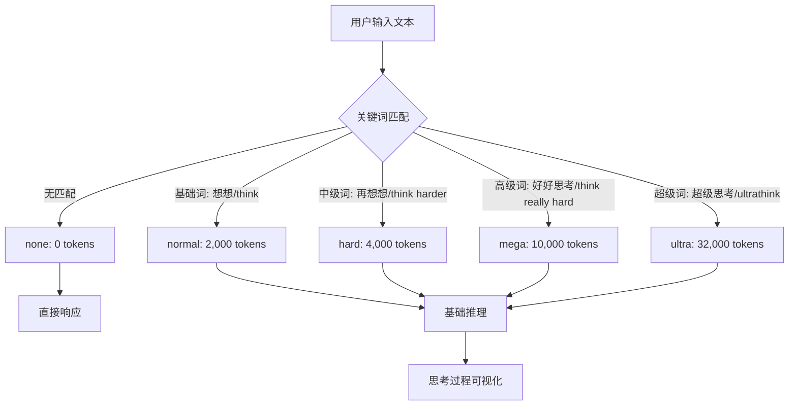
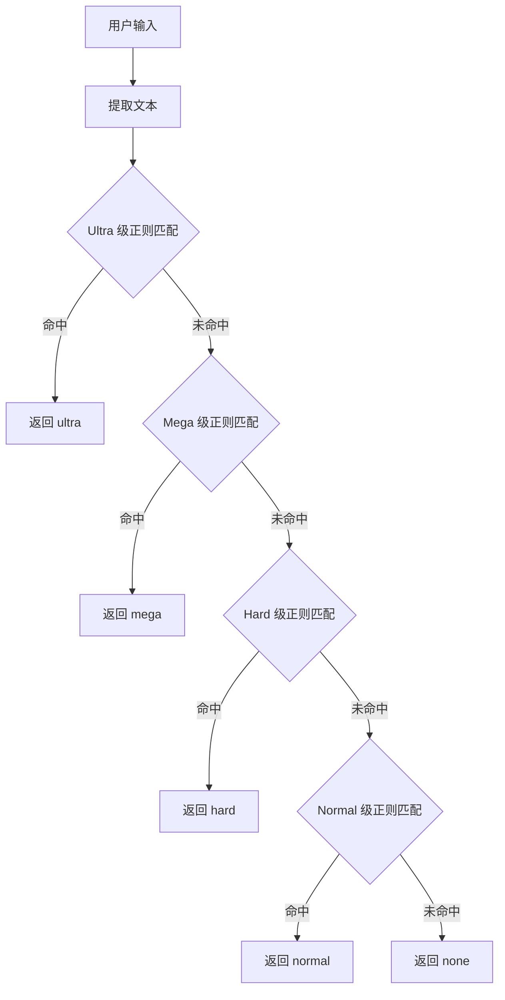

# PD-12.NN iflow-cli — 5 级关键词触发推理系统

> 文档编号：PD-12.NN
> 来源：iflow-cli `docs_en/features/thinking.md`, `docs_cn/features/thinking.md`
> GitHub：https://github.com/iflow-ai/iflow-cli.git
> 问题域：PD-12 推理增强 Reasoning Enhancement
> 状态：可复用方案

---

## 第 1 章 问题与动机

### 1.1 核心问题

CLI 类 AI 助手面临一个关键矛盾：用户的问题复杂度差异巨大，但模型推理深度通常是固定的。简单问题浪费推理 token，复杂问题推理不足。具体表现为：

1. **推理深度一刀切**：所有问题使用相同的推理配置，无法按需调节
2. **用户无法表达推理意图**：用户知道问题的难度，但没有自然的方式告诉模型"这个问题需要深入思考"
3. **多语言触发困难**：中文用户和英文用户的表达习惯不同，需要同时支持双语触发
4. **推理过程不透明**：模型在"思考"什么，用户看不到，降低信任感
5. **混合推理模型适配**：不同模型（OpenAI o1、DeepSeek、GLM-4.5）的推理 API 参数各异，需要统一抽象

### 1.2 iflow-cli 的解法概述

iflow-cli 实现了一套 **5 级关键词触发推理系统**，核心设计：

1. **自然语言触发**：通过正则匹配用户输入中的中英文关键词，自动识别推理意图（`docs_en/features/thinking.md:30-36`）
2. **5 级 token 预算阶梯**：none(0) / normal(2K) / hard(4K) / mega(10K) / ultra(32K)，指数级递增覆盖从零到深度推理的全谱段（`docs_en/features/thinking.md:40-44`）
3. **双语关键词矩阵**：中文 16+ 触发词 × 英文 10+ 触发词，按推理强度分 4 级映射（`docs_cn/features/thinking.md:50-86`）
4. **实时思考可视化**：`✻ Thinking...` 状态指示器 + 展开/折叠控制，支持 full/compact/indicator 三种显示模式（`docs_en/features/thinking.md:88-94`）
5. **混合推理模型适配**：当前支持 glm-4.5 混合推理模型，架构预留 OpenAI o1、DeepSeek 等扩展点（`docs_en/features/thinking.md:96-98`）

### 1.3 设计思想

| 设计原则 | 具体实现 | 理由 | 替代方案 |
|----------|----------|------|----------|
| 自然语言即配置 | 用户说"想想"/"think"即触发推理 | 零学习成本，符合直觉 | 显式命令如 `/think --level hard` |
| 指数级预算阶梯 | 0→2K→4K→10K→32K 非线性递增 | 低级别差异小无需细分，高级别需要大跨度 | 线性递增如 0/8K/16K/24K/32K |
| 关键词优先级匹配 | ultra 词先匹配，避免"超级思考"被"思考"截获 | 长词包含短词，必须从高到低匹配 | 精确匹配（不支持模糊） |
| 推理与回答分离显示 | 思考过程独立展示区，可折叠 | 用户可选择性查看推理过程 | 混合在回答中（不可区分） |
| 模型能力探测 | 运行时检测模型是否支持 thinking | 避免对不支持的模型发送无效参数 | 静态配置模型能力表 |

---

## 第 2 章 源码实现分析

### 2.1 架构概览

iflow-cli 的推理增强系统采用 **管道式处理架构**，从用户输入到推理输出经过 5 个阶段：

```
┌──────────────┐     ┌──────────────┐     ┌──────────────┐     ┌──────────────┐     ┌──────────────┐
│  用户输入     │────→│  关键词分析   │────→│  意图识别     │────→│  配置生成     │────→│  模型调用     │
│  (自然语言)   │     │  (正则匹配)   │     │  (推理等级)   │     │  (token限制)  │     │  (深度推理)   │
└──────────────┘     └──────────────┘     └──────────────┘     └──────────────┘     └──────────────┘
                                                                                          │
                                                                                          ↓
                                                                                   ┌──────────────┐
                                                                                   │  思考展示     │
                                                                                   │  (过程可视化) │
                                                                                   └──────────────┘
```

整体数据流（`docs_en/features/thinking.md:32-36`）：

```
User Input → Keyword Analysis → Intent Recognition → Config Generation → Model Call → Thinking Display
    ↓
[Contains thinking words] → [Regex matching] → [Reasoning level] → [Token limit] → [Deep reasoning] → [Process visualization]
```

### 2.2 核心实现

#### 2.2.1 5 级推理等级与 Token 预算



推理等级定义（`docs_en/features/thinking.md:40-44`，`docs_cn/features/thinking.md:40-44`）：

```typescript
// 基于文档规格推断的实现结构
enum ThinkingLevel {
  NONE = 'none',     // 0 tokens — 直接响应
  NORMAL = 'normal', // 2,000 tokens — 基础思考
  HARD = 'hard',     // 4,000 tokens — 中级思考
  MEGA = 'mega',     // 10,000 tokens — 高级思考
  ULTRA = 'ultra',   // 32,000 tokens — 超级思考
}

const THINKING_TOKEN_BUDGETS: Record<ThinkingLevel, number> = {
  [ThinkingLevel.NONE]: 0,
  [ThinkingLevel.NORMAL]: 2_000,
  [ThinkingLevel.HARD]: 4_000,
  [ThinkingLevel.MEGA]: 10_000,
  [ThinkingLevel.ULTRA]: 32_000,
};
```

#### 2.2.2 双语关键词匹配系统



关键词矩阵（`docs_cn/features/thinking.md:50-86`）：

```typescript
// 基于文档规格推断的关键词配置
// 注意：匹配顺序从 ultra → normal，长词优先避免短词截获
const THINKING_TRIGGERS: Record<ThinkingLevel, { zh: string[]; en: string[] }> = {
  [ThinkingLevel.ULTRA]: {
    zh: ['超级思考', '极限思考', '深度思考', '全力思考', '超强思考', '认真仔细思考'],
    en: ['ultrathink', 'think really super hard', 'think intensely'],
  },
  [ThinkingLevel.MEGA]: {
    zh: ['强力思考', '大力思考', '用力思考', '努力思考', '好好思考', '仔细思考'],
    en: ['megathink', 'think really hard', 'think a lot'],
  },
  [ThinkingLevel.HARD]: {
    zh: ['再想想', '多想想', '想清楚', '想明白', '考虑清楚'],
    en: ['think about it', 'think more', 'think harder'],
  },
  [ThinkingLevel.NORMAL]: {
    zh: ['想想', '思考', '考虑'],
    en: ['think'],
  },
};

function detectThinkingLevel(input: string): ThinkingLevel {
  // 从高到低匹配，确保"超级思考"不被"思考"截获
  for (const level of [ThinkingLevel.ULTRA, ThinkingLevel.MEGA, ThinkingLevel.HARD, ThinkingLevel.NORMAL]) {
    const triggers = THINKING_TRIGGERS[level];
    const allTriggers = [...triggers.zh, ...triggers.en];
    for (const trigger of allTriggers) {
      if (input.toLowerCase().includes(trigger.toLowerCase())) {
        return level;
      }
    }
  }
  return ThinkingLevel.NONE;
}
```

#### 2.2.3 思考过程可视化

思考展示系统（`docs_en/features/thinking.md:88-94`，`docs_cn/features/thinking.md:88-94`）：

```typescript
// 基于文档规格推断的显示实现
interface ThinkingDisplay {
  mode: 'full' | 'compact' | 'indicator';
  i18n: {
    thinking: string;   // "思考中..." | "Thinking..."
    expand: string;     // "展开" | "expand"
    collapse: string;   // "折叠" | "collapse"
  };
}

// 实时状态指示器
// ✻ Thinking...
// ✻ 思考中...

// 国际化自动切换（docs_en/features/thinking.md:138-143）
// 根据 LANGUAGE 环境变量或 /language 命令切换
```

#### 2.2.4 模型适配层

模型适配系统（`docs_en/features/thinking.md:96-98`）当前支持混合推理模型 glm-4.5，架构设计为可扩展：

```typescript
// 基于文档规格推断的模型适配
interface ThinkingModelAdapter {
  supportsThinking: boolean;
  // glm-4.5 是混合推理模型：同时支持普通对话和深度推理
  // 通过 token budget 参数控制推理深度
  applyThinkingConfig(level: ThinkingLevel, budget: number): ModelCallConfig;
}

// 当前支持的模型（docs_en/features/thinking.md:25, 98）
// - glm-4.5（主要支持）
// - OpenAI o1（计划支持）
// - DeepSeek（计划支持）
```

### 2.3 实现细节

#### 配置层级与环境变量覆盖

iflow-cli 的配置系统支持 6 级优先级（`docs_en/configuration/settings.md:112-120`），thinking 相关配置同样遵循此层级：

1. 命令行参数（最高）
2. `IFLOW_` 前缀环境变量
3. 系统配置文件 `/etc/iflow-cli/settings.json`
4. 工作区配置 `.iflow/settings.json`
5. 用户配置 `~/.iflow/settings.json`
6. 代码默认值（最低）

关键配置项：
- `modelName`：必须指定支持 thinking 的模型（如 glm-4.5）
- `tokensLimit`：上下文窗口长度，默认 128000（`docs_en/configuration/settings.md:445-451`）
- `compressionTokenThreshold`：自动压缩阈值 0.8（`docs_en/configuration/settings.md:453-459`）

#### 与 SubAgent 的关系

Thinking 是单模型内部推理，SubAgent 是多模型任务分发（`docs_en/features/thinking.md:133-134`）。两者互补：
- Thinking：推理深度增强，适合分析类问题
- SubAgent：任务专业化，适合需要特定领域工具的场景

---

## 第 3 章 迁移指南

### 3.1 迁移清单

#### 阶段 1：关键词检测引擎（核心）

- [ ] 定义 `ThinkingLevel` 枚举和 token 预算映射表
- [ ] 实现双语关键词配置（中文 + 英文触发词矩阵）
- [ ] 实现从高到低的优先级匹配逻辑（ultra → mega → hard → normal → none）
- [ ] 编写关键词匹配单元测试

#### 阶段 2：模型调用适配

- [ ] 实现 `ThinkingModelAdapter` 接口，封装 thinking token budget 参数
- [ ] 适配目标模型的推理 API（如 OpenAI `reasoning_effort`、Anthropic `thinking.budget_tokens`）
- [ ] 实现模型能力探测：运行时检测模型是否支持 extended thinking
- [ ] 对不支持 thinking 的模型做静默降级（不报错，直接走普通对话）

#### 阶段 3：思考过程展示

- [ ] 实现流式推理内容的实时渲染（区分 thinking content 和 response content）
- [ ] 实现展开/折叠交互控制
- [ ] 添加国际化支持（至少中英文）

#### 阶段 4：配置与运维

- [ ] 将 thinking 配置纳入项目配置层级体系
- [ ] 支持环境变量覆盖（如 `IFLOW_thinkingLevel` 强制指定级别）
- [ ] 添加 `/thinking` 或类似命令手动切换推理级别

### 3.2 适配代码模板

以下是一个可直接复用的 TypeScript 实现，适用于任何 Node.js CLI 项目：

```typescript
// thinking-detector.ts — 关键词触发推理级别检测器

export enum ThinkingLevel {
  NONE = 'none',
  NORMAL = 'normal',
  HARD = 'hard',
  MEGA = 'mega',
  ULTRA = 'ultra',
}

export const THINKING_BUDGETS: Record<ThinkingLevel, number> = {
  [ThinkingLevel.NONE]: 0,
  [ThinkingLevel.NORMAL]: 2_000,
  [ThinkingLevel.HARD]: 4_000,
  [ThinkingLevel.MEGA]: 10_000,
  [ThinkingLevel.ULTRA]: 32_000,
};

// 触发词配置：从高到低排列，匹配时优先命中高级别
const TRIGGERS: Array<{ level: ThinkingLevel; patterns: RegExp[] }> = [
  {
    level: ThinkingLevel.ULTRA,
    patterns: [
      /超级思考|极限思考|深度思考|全力思考|超强思考|认真仔细思考/,
      /ultrathink|think really super hard|think intensely/i,
    ],
  },
  {
    level: ThinkingLevel.MEGA,
    patterns: [
      /强力思考|大力思考|用力思考|努力思考|好好思考|仔细思考/,
      /megathink|think really hard|think a lot/i,
    ],
  },
  {
    level: ThinkingLevel.HARD,
    patterns: [
      /再想想|多想想|想清楚|想明白|考虑清楚/,
      /think about it|think more|think harder/i,
    ],
  },
  {
    level: ThinkingLevel.NORMAL,
    patterns: [
      /想想|思考|考虑/,
      /\bthink\b/i,
    ],
  },
];

/**
 * 检测用户输入中的推理级别
 * 从 ultra 到 normal 逐级匹配，首次命中即返回
 */
export function detectThinkingLevel(input: string): ThinkingLevel {
  for (const { level, patterns } of TRIGGERS) {
    for (const pattern of patterns) {
      if (pattern.test(input)) {
        return level;
      }
    }
  }
  return ThinkingLevel.NONE;
}

/**
 * 获取指定推理级别的 token 预算
 */
export function getThinkingBudget(level: ThinkingLevel): number {
  return THINKING_BUDGETS[level];
}

// 使用示例：
// const level = detectThinkingLevel("帮我深度思考一下这个架构设计");
// // => ThinkingLevel.ULTRA
// const budget = getThinkingBudget(level);
// // => 32000
```

### 3.3 适用场景

| 场景 | 适用度 | 说明 |
|------|--------|------|
| CLI AI 助手 | ⭐⭐⭐ | 最佳场景，用户通过自然语言直接控制推理深度 |
| Chat 应用 | ⭐⭐⭐ | 聊天输入天然包含关键词，无需额外 UI |
| API 网关 | ⭐⭐ | 可在 prompt 预处理层检测关键词，注入 thinking 参数 |
| 批处理管道 | ⭐ | 批处理场景通常预设固定推理级别，关键词检测价值低 |
| IDE 插件 | ⭐⭐⭐ | 用户在编辑器中输入指令时自然使用"想想"等词 |

---

## 第 4 章 测试用例

```python
"""
测试 iflow-cli 风格的 5 级关键词触发推理系统
基于 docs_en/features/thinking.md 和 docs_cn/features/thinking.md 的规格
"""
import pytest
import re
from enum import Enum
from typing import Dict, List, Tuple


class ThinkingLevel(Enum):
    NONE = "none"
    NORMAL = "normal"
    HARD = "hard"
    MEGA = "mega"
    ULTRA = "ultra"


THINKING_BUDGETS: Dict[ThinkingLevel, int] = {
    ThinkingLevel.NONE: 0,
    ThinkingLevel.NORMAL: 2_000,
    ThinkingLevel.HARD: 4_000,
    ThinkingLevel.MEGA: 10_000,
    ThinkingLevel.ULTRA: 32_000,
}

TRIGGERS: List[Tuple[ThinkingLevel, List[re.Pattern]]] = [
    (ThinkingLevel.ULTRA, [
        re.compile(r"超级思考|极限思考|深度思考|全力思考|超强思考|认真仔细思考"),
        re.compile(r"ultrathink|think really super hard|think intensely", re.IGNORECASE),
    ]),
    (ThinkingLevel.MEGA, [
        re.compile(r"强力思考|大力思考|用力思考|努力思考|好好思考|仔细思考"),
        re.compile(r"megathink|think really hard|think a lot", re.IGNORECASE),
    ]),
    (ThinkingLevel.HARD, [
        re.compile(r"再想想|多想想|想清楚|想明白|考虑清楚"),
        re.compile(r"think about it|think more|think harder", re.IGNORECASE),
    ]),
    (ThinkingLevel.NORMAL, [
        re.compile(r"想想|思考|考虑"),
        re.compile(r"\bthink\b", re.IGNORECASE),
    ]),
]


def detect_thinking_level(text: str) -> ThinkingLevel:
    for level, patterns in TRIGGERS:
        for pattern in patterns:
            if pattern.search(text):
                return level
    return ThinkingLevel.NONE


class TestThinkingLevelDetection:
    """测试推理级别检测"""

    def test_none_level(self):
        assert detect_thinking_level("帮我写个函数") == ThinkingLevel.NONE
        assert detect_thinking_level("Hello world") == ThinkingLevel.NONE

    def test_normal_level_chinese(self):
        assert detect_thinking_level("想想这个问题") == ThinkingLevel.NORMAL
        assert detect_thinking_level("帮我思考一下") == ThinkingLevel.NORMAL
        assert detect_thinking_level("考虑这个方案") == ThinkingLevel.NORMAL

    def test_normal_level_english(self):
        assert detect_thinking_level("think about this") == ThinkingLevel.NORMAL

    def test_hard_level_chinese(self):
        assert detect_thinking_level("再想想这个问题") == ThinkingLevel.HARD
        assert detect_thinking_level("想清楚再回答") == ThinkingLevel.HARD

    def test_hard_level_english(self):
        assert detect_thinking_level("think harder about this") == ThinkingLevel.HARD
        assert detect_thinking_level("think more carefully") == ThinkingLevel.HARD

    def test_mega_level_chinese(self):
        assert detect_thinking_level("好好思考这个架构") == ThinkingLevel.MEGA
        assert detect_thinking_level("仔细思考一下") == ThinkingLevel.MEGA

    def test_mega_level_english(self):
        assert detect_thinking_level("megathink this problem") == ThinkingLevel.MEGA
        assert detect_thinking_level("think really hard") == ThinkingLevel.MEGA

    def test_ultra_level_chinese(self):
        assert detect_thinking_level("超级思考这个设计") == ThinkingLevel.ULTRA
        assert detect_thinking_level("深度思考一下") == ThinkingLevel.ULTRA

    def test_ultra_level_english(self):
        assert detect_thinking_level("ultrathink this design") == ThinkingLevel.ULTRA
        assert detect_thinking_level("think intensely") == ThinkingLevel.ULTRA

    def test_priority_ultra_over_normal(self):
        """超级思考 包含 思考，应匹配 ultra 而非 normal"""
        assert detect_thinking_level("超级思考") == ThinkingLevel.ULTRA

    def test_priority_mega_over_normal(self):
        """仔细思考 包含 思考，应匹配 mega 而非 normal"""
        assert detect_thinking_level("仔细思考") == ThinkingLevel.MEGA

    def test_case_insensitive_english(self):
        assert detect_thinking_level("ULTRATHINK this") == ThinkingLevel.ULTRA
        assert detect_thinking_level("Think Harder") == ThinkingLevel.HARD


class TestTokenBudgets:
    """测试 token 预算配置"""

    def test_budget_values(self):
        assert THINKING_BUDGETS[ThinkingLevel.NONE] == 0
        assert THINKING_BUDGETS[ThinkingLevel.NORMAL] == 2_000
        assert THINKING_BUDGETS[ThinkingLevel.HARD] == 4_000
        assert THINKING_BUDGETS[ThinkingLevel.MEGA] == 10_000
        assert THINKING_BUDGETS[ThinkingLevel.ULTRA] == 32_000

    def test_budget_monotonically_increasing(self):
        levels = [ThinkingLevel.NONE, ThinkingLevel.NORMAL,
                  ThinkingLevel.HARD, ThinkingLevel.MEGA, ThinkingLevel.ULTRA]
        budgets = [THINKING_BUDGETS[l] for l in levels]
        for i in range(1, len(budgets)):
            assert budgets[i] > budgets[i - 1]

    def test_end_to_end(self):
        """端到端：输入 → 级别 → 预算"""
        text = "帮我深度思考一下这个系统设计"
        level = detect_thinking_level(text)
        budget = THINKING_BUDGETS[level]
        assert level == ThinkingLevel.ULTRA
        assert budget == 32_000
```

---

## 第 5 章 跨域关联

| 关联域 | 关系类型 | 说明 |
|--------|----------|------|
| PD-01 上下文管理 | 协同 | thinking token 预算直接影响上下文窗口消耗。ultra 级 32K tokens 占用大量上下文空间，需要与 `compressionTokenThreshold`（默认 0.8）配合，避免推理 token 挤占对话上下文 |
| PD-02 多 Agent 编排 | 互补 | Thinking 是单模型内部推理增强，SubAgent 是多模型任务分发。iflow-cli 明确区分两者：Thinking 专注推理深度，SubAgent 专注任务专业性（`docs_en/features/thinking.md:133-134`） |
| PD-04 工具系统 | 协同 | 推理增强后的输出可能触发工具调用。iflow-cli 的 Hook 系统（PreToolUse/PostToolUse）可在推理完成后拦截和增强工具调用行为 |
| PD-09 Human-in-the-Loop | 协同 | 推理过程的展开/折叠控制本身就是一种 HITL 机制——用户可以查看推理过程，决定是否信任结果 |
| PD-10 中间件管道 | 依赖 | 关键词检测本质上是输入预处理中间件，在消息到达模型前完成推理级别注入。可与其他中间件（如上下文压缩）串联 |
| PD-11 可观测性 | 协同 | thinking token 消耗是成本追踪的重要维度。ultra 级 32K tokens 的成本远高于 normal 级 2K，需要在 telemetry 中单独统计 |

---

## 第 6 章 来源文件索引

| 文件 | 行范围 | 关键实现 |
|------|--------|----------|
| `docs_en/features/thinking.md` | L1-L144 | 完整的 Thinking Capability 英文规格文档 |
| `docs_cn/features/thinking.md` | L1-L144 | 完整的思考能力中文规格文档 |
| `docs_en/features/thinking.md` | L30-L36 | 思考触发流程：6 阶段管道架构 |
| `docs_en/features/thinking.md` | L40-L44 | 5 级推理等级定义与 token 预算 |
| `docs_cn/features/thinking.md` | L50-L86 | 完整的中英文触发词矩阵（4 级 × 双语） |
| `docs_en/features/thinking.md` | L88-L94 | 思考过程展示：状态指示器 `✻ Thinking...` |
| `docs_en/features/thinking.md` | L96-L98 | 模型适配系统：glm-4.5 混合推理模型 |
| `docs_en/features/thinking.md` | L117-L124 | 故障排除：思考未触发的排查步骤 |
| `docs_en/features/thinking.md` | L126-L134 | 与普通对话和 SubAgent 的对比 |
| `docs_en/features/thinking.md` | L136-L143 | 国际化支持：中英文界面自动切换 |
| `docs_en/configuration/settings.md` | L112-L120 | 6 级配置优先级体系 |
| `docs_en/configuration/settings.md` | L445-L459 | tokensLimit 和 compressionTokenThreshold 配置 |
| `docs_en/changelog.md` | L69-L74 | v0.2.30 版本引入 Model Thinking 支持 |
| `README.md` | L38 | Feature Comparison 表中 Thinking 行 |
| `docs_en/examples/subagent.md` | L1-L416 | SubAgent 系统（与 Thinking 互补的任务分发机制） |

---

## 第 7 章 横向对比维度

> **重要：** 本章用于自动填充 Butcher Wiki 的横向对比表。
> 必须严格按以下 JSON 格式输出，放在 `comparison_data` 代码块中。

```json comparison_data
{
  "project": "iflow-cli",
  "dimensions": {
    "推理方式": "5 级关键词触发：正则匹配用户输入中的中英文触发词",
    "模型策略": "单模型混合推理（glm-4.5），运行时能力探测",
    "成本控制": "指数级 token 预算阶梯：0/2K/4K/10K/32K",
    "适用场景": "CLI 交互式对话，用户自然语言表达推理意图",
    "思考预算": "5 级固定预算：none(0)/normal(2K)/hard(4K)/mega(10K)/ultra(32K)",
    "推理可见性": "✻ 状态指示器 + full/compact/indicator 三种显示模式",
    "推理模式": "关键词触发式，非 API 参数直传",
    "供应商兼容性": "当前 glm-4.5，架构预留 OpenAI o1/DeepSeek 扩展",
    "推理级别归一化": "5 级枚举 none/normal/hard/mega/ultra 统一抽象",
    "推理开关控制": "自然语言隐式控制，无显式开关命令",
    "流式推理检测": "实时 ✻ Thinking... 指示器，支持展开/折叠",
    "环境变量运维覆盖": "IFLOW_ 前缀环境变量可覆盖所有配置项"
  }
}
```

### 域元数据补充

```json domain_metadata
{
  "solution_summary": "iflow-cli 用正则匹配中英文关键词触发 5 级推理（none/normal/hard/mega/ultra），对应 0~32K token 预算阶梯，支持 glm-4.5 混合推理模型实时显示思考过程",
  "description": "通过自然语言关键词隐式控制推理深度，无需显式命令或 API 参数",
  "sub_problems": [
    "双语关键词优先级匹配：长词包含短词时从高到低匹配避免截获",
    "混合推理模型适配：同一模型同时支持普通对话和深度推理的参数切换",
    "推理预算指数级分层：非线性 token 预算设计覆盖从零到深度推理全谱段"
  ],
  "best_practices": [
    "关键词从高级别到低级别匹配：避免'超级思考'被'思考'截获",
    "指数级而非线性预算分层：低级别差异小无需细分，高级别需要大跨度",
    "推理过程可折叠展示：用户可选择性查看，不强制暴露思考细节"
  ]
}
```
