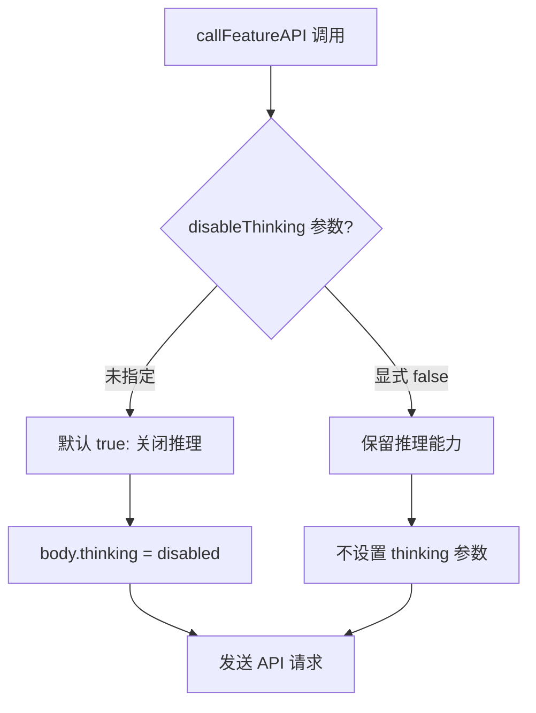
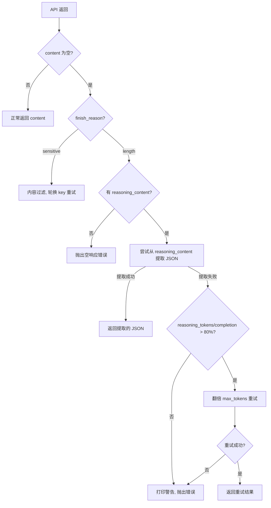

# PD-12.13 moyin-creator — 推理模型自适应重试与 disableThinking 开关

> 文档编号：PD-12.13
> 来源：moyin-creator `src/lib/script/script-parser.ts`, `src/lib/ai/feature-router.ts`
> GitHub：https://github.com/MemeCalculate/moyin-creator.git
> 问题域：PD-12 推理增强 Reasoning Enhancement
> 状态：可复用方案

---

## 第 1 章 问题与动机

### 1.1 核心问题

推理模型（如智谱 GLM-4.7、DeepSeek-R1）在处理结构化 JSON 输出任务时，存在一个隐蔽但致命的问题：**模型将大量 completion tokens 消耗在内部推理（reasoning_content）上，导致实际输出（content）为空或被截断**。

具体表现：
- API 返回 `finish_reason: "length"`，但 `content` 字段为空
- `reasoning_content` 包含大量思考过程文本，但没有最终结果
- `completion_tokens_details.reasoning_tokens` 占 `completion_tokens` 的 80% 以上
- 用户看到的是"AI 返回空内容"的错误，完全不知道模型其实在"思考"

这个问题在生成类任务（剧本解析、分镜生成）中尤为突出——prompt 要求输出大段 JSON，但推理模型先花大量 token 思考"怎么组织 JSON"，结果 token 预算耗尽时还没开始写输出。

### 1.2 moyin-creator 的解法概述

moyin-creator 采用**三层防御策略**应对推理模型的 token 耗尽问题：

1. **预防层 — disableThinking 开关**：在 `callFeatureAPI` 中默认关闭深度思考（`disableThinking: true`），通过 `body.thinking = { type: 'disabled' }` 参数告知智谱 GLM 等模型跳过推理阶段，直接输出结果（`src/lib/ai/feature-router.ts:268`）
2. **检测层 — reasoning token 占比分析**：当 API 返回空 content 时，检查 `completion_tokens_details.reasoning_tokens / completion_tokens` 比值，超过 80% 判定为推理耗尽（`src/lib/script/script-parser.ts:408-416`）
3. **恢复层 — 双倍 max_tokens 自动重试**：检测到推理耗尽后，以 `min(currentMaxTokens * 2, modelLimits.maxOutput)` 自动重试一次，给模型更多输出空间（`src/lib/script/script-parser.ts:413-445`）
4. **回退层 — reasoning_content JSON 提取**：在重试前先尝试从 `reasoning_content` 中用正则提取 JSON 结果，因为少数情况下模型在思考过程中已经生成了完整结果（`src/lib/script/script-parser.ts:400-406`）

### 1.3 设计思想

| 设计原则 | 具体实现 | 理由 | 替代方案 |
|----------|----------|------|----------|
| 生成任务默认关闭推理 | `callFeatureAPI` 的 `disableThinking` 默认 `true` | 结构化 JSON 输出不需要深度推理，推理只会浪费 token | 全局关闭推理（太粗暴，分析任务需要推理） |
| Token 占比驱动重试 | reasoning_tokens/completion_tokens > 0.8 触发 | 精确判断是否因推理耗尽，避免误触发 | 固定 max_tokens 阈值（不同模型差异大） |
| 翻倍而非固定增量 | `currentMaxTokens * 2` | 指数增长快速找到足够空间，且受 `maxOutput` 上限约束 | 线性增加（可能需要多次重试） |
| reasoning_content 回退提取 | 正则匹配 JSON 代码块或结构 | 零成本回退，不需要额外 API 调用 | 忽略 reasoning_content（浪费已有结果） |
| 功能级模型路由 | `getFeatureConfig` 按 AIFeature 查找绑定 | 不同功能可绑定不同模型，推理模型只用于需要的场景 | 全局单模型（无法差异化） |

---

## 第 2 章 源码实现分析

### 2.1 架构概览

moyin-creator 的推理增强体系分布在三个核心模块中，形成从路由到执行到恢复的完整链路：

```
┌─────────────────────────────────────────────────────────────────┐
│                    callFeatureAPI (入口)                         │
│  feature-router.ts:238                                          │
│  ┌──────────────┐  ┌──────────────┐  ┌───────────────────────┐ │
│  │FeatureConfig │→ │Round-Robin   │→ │disableThinking: true  │ │
│  │多模型绑定     │  │轮询调度       │  │默认关闭深度思考        │ │
│  └──────────────┘  └──────────────┘  └───────────────────────┘ │
└────────────────────────────┬────────────────────────────────────┘
                             ↓
┌─────────────────────────────────────────────────────────────────┐
│                    callChatAPI (执行)                            │
│  script-parser.ts:209                                           │
│  ┌──────────────┐  ┌──────────────┐  ┌───────────────────────┐ │
│  │TokenBudget   │→ │API 请求      │→ │响应分析               │ │
│  │预算计算+拦截  │  │thinking 参数  │  │reasoning_content 检测 │ │
│  └──────────────┘  └──────────────┘  └───────────────────────┘ │
│                                              ↓                  │
│  ┌──────────────────────────────────────────────────────────┐  │
│  │ 推理耗尽恢复链                                            │  │
│  │ 1. reasoning_content JSON 提取 → 成功则直接返回            │  │
│  │ 2. reasoning_tokens 占比 > 80% → 翻倍 max_tokens 重试     │  │
│  │ 3. 重试仍失败 → 抛出错误                                   │  │
│  └──────────────────────────────────────────────────────────┘  │
└─────────────────────────────────────────────────────────────────┘
                             ↓
┌─────────────────────────────────────────────────────────────────┐
│                    Model Registry (辅助)                         │
│  model-registry.ts                                              │
│  ┌──────────────┐  ┌──────────────┐  ┌───────────────────────┐ │
│  │三层查找       │→ │Token 估算    │→ │Error-driven Discovery │ │
│  │缓存→静态→默认 │  │字符数/1.5    │  │400 错误自动学习限制    │ │
│  └──────────────┘  └──────────────┘  └───────────────────────┘ │
└─────────────────────────────────────────────────────────────────┘
```

### 2.2 核心实现

#### 2.2.1 disableThinking 开关 — 功能级推理控制



对应源码 `src/lib/ai/feature-router.ts:238-279`：

```typescript
export async function callFeatureAPI(
  feature: AIFeature,
  systemPrompt: string,
  userPrompt: string,
  options?: CallFeatureAPIOptions
): Promise<string> {
  const config = options?.configOverride || getFeatureConfig(feature);
  if (!config) {
    throw new Error(getFeatureNotConfiguredMessage(feature));
  }
  const model = options?.modelOverride || config.model || config.models?.[0];
  // 结构化 JSON 输出任务默认关闭深度思考，避免 reasoning 耗尽 token
  const disableThinking = options?.disableThinking ?? true;
  return await callChatAPI(systemPrompt, userPrompt, {
    apiKey: config.allApiKeys.join(','),
    provider: 'openai',
    baseUrl,
    model,
    temperature: options?.temperature,
    maxTokens: options?.maxTokens,
    keyManager: config.keyManager,
    disableThinking,
  });
}
```

关键设计：`disableThinking` 默认值为 `true`，意味着所有通过 `callFeatureAPI` 发起的调用（剧本解析、分镜生成、角色生成等）都默认关闭推理。只有调用方显式传入 `disableThinking: false` 才会启用推理。

#### 2.2.2 推理耗尽检测与自动重试



对应源码 `src/lib/script/script-parser.ts:377-454`：

```typescript
// 推理模型回退：如果有 reasoning_content 但 content 为空
if (finishReason === 'length' && reasoningContent) {
  // 先尝试从 reasoning_content 提取 JSON
  const jsonMatch = reasoningContent.match(/```json\s*([\s\S]*?)```/) ||
                    reasoningContent.match(/(\{[\s\S]*"characters"[\s\S]*\})/);
  if (jsonMatch) {
    console.log('[callChatAPI] ✅ 从 reasoning_content 中提取到 JSON');
    return jsonMatch[1] || jsonMatch[0];
  }
  
  // 检测推理 token 占比
  const reasoningTokens = usage?.completion_tokens_details?.reasoning_tokens || 0;
  const completionTokens = usage?.completion_tokens || 0;
  const currentMaxTokens = body.max_tokens;
  const newMaxTokens = Math.min(currentMaxTokens * 2, modelLimits.maxOutput);
  
  if (reasoningTokens > 0 && completionTokens > 0 &&
      reasoningTokens / completionTokens > 0.8 &&
      newMaxTokens > currentMaxTokens) {
    console.warn(
      `[callChatAPI] 推理模型 token 耗尽 (reasoning: ${reasoningTokens}/${completionTokens})，` +
      `以 max_tokens=${newMaxTokens} 自动重试...`
    );
    const retryBody = { ...body, max_tokens: newMaxTokens };
    const retryResp = await fetch(url, { method: 'POST', headers, body: JSON.stringify(retryBody) });
    if (retryResp.ok) {
      const retryData = await retryResp.json();
      const retryContent = retryData.choices?.[0]?.message?.content;
      if (retryContent) {
        if (totalKeys > 1) keyManager.rotateKey();
        return retryContent;
      }
    }
  }
}
```

### 2.3 实现细节

#### 模型能力自动分类

`classifyModelByName`（`src/lib/api-key-manager.ts:75-112`）通过模型名称正则推断能力标签，其中推理模型的识别规则：

```typescript
// 推理/思考模型（仍归入 text）
if (/[- ](r1|thinking|reasoner|reason)/.test(name) || /^o[1-9]/.test(name))
  return ['text', 'reasoning'];
```

这使得 UI 层（`FeatureBindingPanel`）可以按能力过滤模型，用户为"剧本分析"功能绑定模型时只看到 text 类模型，为"图片生成"只看到 image_generation 类模型。

#### Token 预算计算器

`callChatAPI` 在发送请求前执行预算检查（`src/lib/script/script-parser.ts:254-283`）：

1. 用 `estimateTokens(systemPrompt + userPrompt)` 估算输入 token（字符数/1.5，保守算法）
2. 输入超过 context window 的 90% → 直接抛错，不发请求（省钱）
3. 输出空间不到请求的 50% → 打印 warning
4. `max_tokens` 自动 clamp 到 `modelLimits.maxOutput`

#### 多模型轮询调度

`getFeatureConfig`（`src/lib/ai/feature-router.ts:133-182`）支持同一功能绑定多个模型，通过 `featureRoundRobinIndex` Map 实现轮询：

```typescript
const currentIndex = featureRoundRobinIndex.get(feature) || 0;
const config = configs[currentIndex % configs.length];
featureRoundRobinIndex.set(feature, currentIndex + 1);
```

这意味着如果用户为"剧本分析"绑定了 GLM-4.7 和 DeepSeek-V3，请求会交替发送到两个模型，实现负载均衡。

---

## 第 3 章 迁移指南

### 3.1 迁移清单

**阶段 1：推理开关基础设施**
- [ ] 在 API 调用层添加 `disableThinking` 参数支持
- [ ] 在请求 body 中注入 `thinking: { type: 'disabled' }` 参数
- [ ] 为不同功能设置合理的默认值（生成类 → true，分析类 → false）

**阶段 2：推理耗尽检测**
- [ ] 解析 API 响应中的 `reasoning_content` 和 `completion_tokens_details`
- [ ] 实现 reasoning_tokens 占比计算和阈值判断（建议 80%）
- [ ] 添加 reasoning_content JSON 提取回退逻辑

**阶段 3：自动重试机制**
- [ ] 实现翻倍 max_tokens 重试（受 maxOutput 上限约束）
- [ ] 添加重试结果的 usage 日志（用于后续调优阈值）
- [ ] 集成到现有的 retryOperation 重试框架中

**阶段 4：模型能力分类**
- [ ] 实现基于模型名称的能力推断（text/vision/reasoning 等）
- [ ] 在 UI 层按能力过滤可选模型
- [ ] 为推理模型自动调整默认 max_tokens

### 3.2 适配代码模板

以下是一个可直接复用的推理模型自适应中间件，适用于任何 OpenAI 兼容 API：

```typescript
interface ReasoningAdaptiveOptions {
  /** 推理 token 占比阈值，超过此值触发重试（默认 0.8） */
  reasoningThreshold?: number;
  /** 重试时 max_tokens 倍数（默认 2） */
  retryMultiplier?: number;
  /** 模型最大输出 token 数上限 */
  maxOutputCap: number;
  /** 是否关闭深度思考（默认 true，适用于结构化输出任务） */
  disableThinking?: boolean;
}

async function callWithReasoningAdaptive(
  url: string,
  body: Record<string, any>,
  headers: Record<string, string>,
  options: ReasoningAdaptiveOptions
): Promise<string> {
  const {
    reasoningThreshold = 0.8,
    retryMultiplier = 2,
    maxOutputCap,
    disableThinking = true,
  } = options;

  // 1. 注入 disableThinking 参数
  if (disableThinking) {
    body.thinking = { type: 'disabled' };
  }

  const response = await fetch(url, {
    method: 'POST',
    headers,
    body: JSON.stringify(body),
  });

  if (!response.ok) throw new Error(`API error: ${response.status}`);

  const data = await response.json();
  const content = data.choices?.[0]?.message?.content;

  // 2. 正常返回
  if (content) return content;

  // 3. 推理耗尽检测
  const finishReason = data.choices?.[0]?.finish_reason;
  const reasoningContent = data.choices?.[0]?.message?.reasoning_content;
  const usage = data.usage;

  if (finishReason !== 'length' || !reasoningContent) {
    throw new Error(`Empty response (finish_reason: ${finishReason})`);
  }

  // 4. 尝试从 reasoning_content 提取 JSON
  const jsonMatch = reasoningContent.match(/```json\s*([\s\S]*?)```/) ||
                    reasoningContent.match(/(\{[\s\S]*\})/s);
  if (jsonMatch) return jsonMatch[1] || jsonMatch[0];

  // 5. Token 占比分析 + 翻倍重试
  const reasoningTokens = usage?.completion_tokens_details?.reasoning_tokens || 0;
  const completionTokens = usage?.completion_tokens || 0;
  const currentMax = body.max_tokens || 4096;
  const newMax = Math.min(currentMax * retryMultiplier, maxOutputCap);

  if (reasoningTokens > 0 && completionTokens > 0 &&
      reasoningTokens / completionTokens > reasoningThreshold &&
      newMax > currentMax) {
    const retryBody = { ...body, max_tokens: newMax };
    const retryResp = await fetch(url, {
      method: 'POST',
      headers,
      body: JSON.stringify(retryBody),
    });
    if (retryResp.ok) {
      const retryData = await retryResp.json();
      const retryContent = retryData.choices?.[0]?.message?.content;
      if (retryContent) return retryContent;
    }
  }

  throw new Error(
    `Reasoning model exhausted tokens: reasoning=${reasoningTokens}/${completionTokens}`
  );
}
```

### 3.3 适用场景

| 场景 | 适用度 | 说明 |
|------|--------|------|
| 结构化 JSON 输出（剧本/数据提取） | ⭐⭐⭐ | 最典型场景，推理模型容易在 JSON 组织上耗尽 token |
| 多供应商混合调用 | ⭐⭐⭐ | 不同供应商的推理 API 差异大，需要统一适配 |
| 批量生成任务（分镜/角色） | ⭐⭐⭐ | 批量场景下推理耗尽概率更高，自动重试避免整批失败 |
| 对话/聊天场景 | ⭐⭐ | 对话通常不需要关闭推理，但 token 占比检测仍有价值 |
| 代码生成 | ⭐⭐ | 代码生成可能受益于推理，但 JSON 输出部分仍需防护 |
| 纯分析/推理任务 | ⭐ | 这类任务需要推理能力，不应关闭 disableThinking |

---

## 第 4 章 测试用例

```typescript
import { describe, it, expect, vi, beforeEach } from 'vitest';

// Mock fetch for testing
const mockFetch = vi.fn();
global.fetch = mockFetch;

describe('推理模型自适应重试', () => {
  beforeEach(() => {
    mockFetch.mockReset();
  });

  it('正常响应直接返回 content', async () => {
    mockFetch.mockResolvedValueOnce({
      ok: true,
      json: async () => ({
        choices: [{ message: { content: '{"title":"测试"}' }, finish_reason: 'stop' }],
        usage: { completion_tokens: 100, completion_tokens_details: { reasoning_tokens: 0 } },
      }),
    });

    const result = await callWithReasoningAdaptive(
      'https://api.example.com/v1/chat/completions',
      { model: 'glm-4.7', messages: [], max_tokens: 4096 },
      { 'Content-Type': 'application/json', Authorization: 'Bearer test' },
      { maxOutputCap: 128000 }
    );
    expect(result).toBe('{"title":"测试"}');
    expect(mockFetch).toHaveBeenCalledTimes(1);
  });

  it('推理耗尽时从 reasoning_content 提取 JSON', async () => {
    mockFetch.mockResolvedValueOnce({
      ok: true,
      json: async () => ({
        choices: [{
          message: {
            content: null,
            reasoning_content: '让我分析一下...\n```json\n{"title":"从推理中提取"}\n```',
          },
          finish_reason: 'length',
        }],
        usage: { completion_tokens: 1000, completion_tokens_details: { reasoning_tokens: 950 } },
      }),
    });

    const result = await callWithReasoningAdaptive(
      'https://api.example.com/v1/chat/completions',
      { model: 'glm-4.7', messages: [], max_tokens: 4096 },
      { 'Content-Type': 'application/json', Authorization: 'Bearer test' },
      { maxOutputCap: 128000 }
    );
    expect(result).toBe('{"title":"从推理中提取"}');
    expect(mockFetch).toHaveBeenCalledTimes(1); // 无需重试
  });

  it('推理 token 占比 > 80% 时翻倍 max_tokens 重试', async () => {
    // 第一次：推理耗尽，无可提取 JSON
    mockFetch.mockResolvedValueOnce({
      ok: true,
      json: async () => ({
        choices: [{
          message: { content: null, reasoning_content: '思考了很多但没有 JSON...' },
          finish_reason: 'length',
        }],
        usage: { completion_tokens: 4000, completion_tokens_details: { reasoning_tokens: 3500 } },
      }),
    });
    // 第二次：重试成功
    mockFetch.mockResolvedValueOnce({
      ok: true,
      json: async () => ({
        choices: [{ message: { content: '{"title":"重试成功"}' }, finish_reason: 'stop' }],
        usage: { completion_tokens: 5000, completion_tokens_details: { reasoning_tokens: 2000 } },
      }),
    });

    const result = await callWithReasoningAdaptive(
      'https://api.example.com/v1/chat/completions',
      { model: 'glm-4.7', messages: [], max_tokens: 4096 },
      { 'Content-Type': 'application/json', Authorization: 'Bearer test' },
      { maxOutputCap: 128000 }
    );
    expect(result).toBe('{"title":"重试成功"}');
    expect(mockFetch).toHaveBeenCalledTimes(2);
    // 验证重试时 max_tokens 翻倍
    const retryBody = JSON.parse(mockFetch.mock.calls[1][1].body);
    expect(retryBody.max_tokens).toBe(8192);
  });

  it('disableThinking 注入 thinking 参数', async () => {
    mockFetch.mockResolvedValueOnce({
      ok: true,
      json: async () => ({
        choices: [{ message: { content: 'ok' }, finish_reason: 'stop' }],
      }),
    });

    await callWithReasoningAdaptive(
      'https://api.example.com/v1/chat/completions',
      { model: 'glm-4.7', messages: [], max_tokens: 4096 },
      { 'Content-Type': 'application/json', Authorization: 'Bearer test' },
      { maxOutputCap: 128000, disableThinking: true }
    );
    const sentBody = JSON.parse(mockFetch.mock.calls[0][1].body);
    expect(sentBody.thinking).toEqual({ type: 'disabled' });
  });

  it('max_tokens 翻倍不超过 maxOutputCap', async () => {
    mockFetch.mockResolvedValueOnce({
      ok: true,
      json: async () => ({
        choices: [{
          message: { content: null, reasoning_content: '无 JSON' },
          finish_reason: 'length',
        }],
        usage: { completion_tokens: 4000, completion_tokens_details: { reasoning_tokens: 3800 } },
      }),
    });
    mockFetch.mockResolvedValueOnce({
      ok: true,
      json: async () => ({
        choices: [{ message: { content: '{"ok":true}' }, finish_reason: 'stop' }],
      }),
    });

    await callWithReasoningAdaptive(
      'https://api.example.com/v1/chat/completions',
      { model: 'test', messages: [], max_tokens: 4096 },
      { 'Content-Type': 'application/json', Authorization: 'Bearer test' },
      { maxOutputCap: 5000 } // cap 小于翻倍值
    );
    const retryBody = JSON.parse(mockFetch.mock.calls[1][1].body);
    expect(retryBody.max_tokens).toBe(5000); // 被 cap 限制
  });
});
```

---

## 第 5 章 跨域关联

| 关联域 | 关系类型 | 说明 |
|--------|----------|------|
| PD-01 上下文管理 | 协同 | Token 预算计算器（estimateTokens + 90% 拦截）直接服务于上下文窗口管理，推理 token 占比分析也是上下文预算的一部分 |
| PD-03 容错与重试 | 依赖 | 推理耗尽的翻倍重试机制嵌套在 retryOperation 框架内，与 API key 轮换、400 错误重试共享重试基础设施 |
| PD-04 工具系统 | 协同 | callFeatureAPI 作为统一工具调用入口，disableThinking 参数通过工具系统传递到底层 API 调用 |
| PD-11 可观测性 | 协同 | reasoning_tokens/completion_tokens 的日志输出为成本追踪提供数据，可用于分析推理模型的实际 token 消耗 |

---

## 第 6 章 来源文件索引

| 文件 | 行范围 | 关键实现 |
|------|--------|----------|
| `src/lib/script/script-parser.ts` | L192-194 | ParseOptions 接口定义 disableThinking 参数 |
| `src/lib/script/script-parser.ts` | L209-464 | callChatAPI 核心函数：Token 预算、API 调用、推理耗尽检测与重试 |
| `src/lib/script/script-parser.ts` | L316-319 | disableThinking → body.thinking = { type: 'disabled' } 注入 |
| `src/lib/script/script-parser.ts` | L377-454 | 推理模型回退链：reasoning_content 提取 → token 占比分析 → 翻倍重试 |
| `src/lib/ai/feature-router.ts` | L215-226 | CallFeatureAPIOptions 接口定义 disableThinking 参数 |
| `src/lib/ai/feature-router.ts` | L238-279 | callFeatureAPI 统一入口：默认 disableThinking=true |
| `src/lib/ai/feature-router.ts` | L133-182 | getFeatureConfig 多模型轮询调度 |
| `src/lib/api-key-manager.ts` | L75-112 | classifyModelByName 模型能力推断（含 reasoning 标签） |
| `src/lib/ai/model-registry.ts` | L50-89 | 静态模型注册表（GLM-4.7 200K ctx / 128K output） |
| `src/lib/ai/model-registry.ts` | L125-162 | getModelLimits 三层查找（缓存→静态→默认） |
| `src/lib/ai/model-registry.ts` | L178-229 | parseModelLimitsFromError 从 400 错误自动发现模型限制 |

---

## 第 7 章 横向对比维度

> **重要：** 本章用于自动填充 Butcher Wiki 的横向对比表。

```json comparison_data
{
  "project": "moyin-creator",
  "dimensions": {
    "推理方式": "disableThinking 开关 + reasoning_content 回退提取",
    "模型策略": "功能级多模型绑定 + Round-Robin 轮询调度",
    "成本": "默认关闭推理省 token + 90% 上下文拦截不发请求",
    "适用场景": "结构化 JSON 输出（剧本解析、分镜生成）",
    "推理开关控制": "body.thinking={type:'disabled'} 智谱 GLM 专用",
    "供应商兼容性": "OpenAI 兼容 API 统一入口，模型名正则分类",
    "结构化输出集成": "reasoning_content 正则提取 JSON 作为回退",
    "增强策略": "Token 占比 >80% 触发翻倍 max_tokens 自动重试",
    "推理模型参数兼容": "classifyModelByName 自动识别推理模型标签",
    "混合推理模型适配": "同一 callChatAPI 同时处理普通和推理模型响应"
  }
}
```

### 域元数据补充

```json domain_metadata
{
  "solution_summary": "moyin-creator 通过 disableThinking 开关默认关闭结构化输出任务的深度推理，配合 reasoning_tokens 占比检测和翻倍 max_tokens 自动重试，解决推理模型 token 耗尽导致空输出的问题",
  "description": "推理模型在结构化输出任务中的 token 预算冲突与自适应恢复",
  "sub_problems": [
    "推理 token 预算挤占：推理模型将 completion tokens 消耗在 reasoning 上导致 content 为空",
    "功能级推理开关：按 AI 功能（生成/分析）决定是否启用深度推理"
  ],
  "best_practices": [
    "结构化 JSON 输出任务默认关闭深度推理，分析任务按需开启",
    "reasoning_content 不要丢弃：先尝试正则提取结果再决定是否重试"
  ]
}
```
