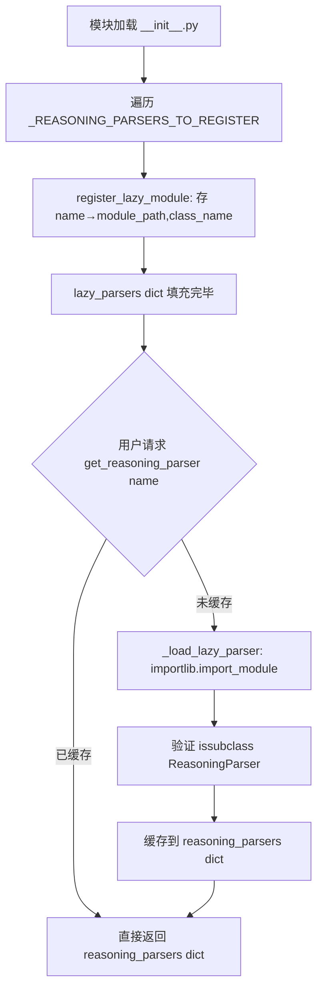
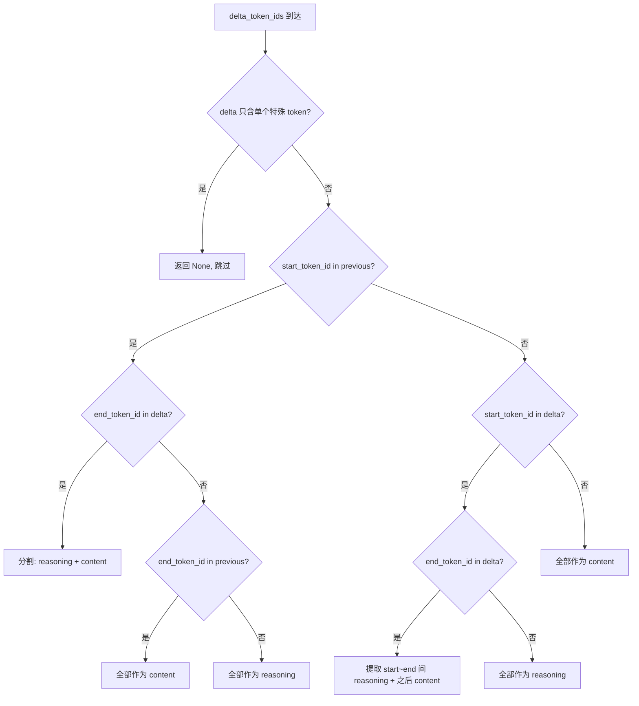

# PD-12.07 vLLM — 多模型 ReasoningParser 框架与流式推理提取

> 文档编号：PD-12.07
> 来源：vLLM `vllm/reasoning/`
> GitHub：https://github.com/vllm-project/vllm.git
> 问题域：PD-12 推理增强 Reasoning Enhancement
> 状态：可复用方案

---

## 第 1 章 问题与动机（≥ 30 行）

### 1.1 核心问题

推理模型（DeepSeek-R1、Qwen3、Granite 等）在生成最终回答前会产生 thinking/reasoning 内容，但不同模型使用完全不同的标记方式：

- **特殊 token 对**：DeepSeek-R1/Qwen3 用 `<think>...</think>`，但 token ID 不同
- **自然语言标记**：Granite 用 `"Here is my thought process:"` / `"Here is my response:"` 纯文本分隔
- **协议级标记**：GptOss 用 `<|channel|>analysis<|message|>...<|end|>` harmony 协议
- **无标记**：部分模型不产生推理内容，需要 Identity 透传

推理引擎（如 vLLM）需要在 OpenAI 兼容 API 层统一处理这些差异，将 reasoning 和 content 分离后通过 `reasoning_content` 字段返回给客户端。核心挑战：

1. **流式场景**：token 逐个到达，推理/内容边界可能跨越多个 delta
2. **结构化输出集成**：xgrammar 等约束引擎需要知道推理何时结束才能开始约束
3. **模型数量持续增长**：每个新推理模型可能有独特的标记方式
4. **prompt 级推理控制**：部分模型（Qwen3）支持在 chat template 中禁用推理

### 1.2 vLLM 的解法概述

vLLM 实现了一个可插拔的 ReasoningParser 框架，核心设计：

1. **抽象基类 + 策略模式**：`ReasoningParser` 定义 6 个抽象方法，每个模型实现自己的解析策略（`abs_reasoning_parsers.py:36-178`）
2. **懒加载注册表**：`ReasoningParserManager` 支持 eager/lazy 双模式注册，17 个 parser 按需导入（`__init__.py:22-100`）
3. **中间层 BaseThinkingReasoningParser**：为使用 `<think>...</think>` 标记的模型提供通用实现，子类只需定义 token 对（`basic_parsers.py:25-199`）
4. **流式状态机**：基于 token ID 的 6 态状态机处理流式推理边界检测（`basic_parsers.py:95-152`）
5. **prompt 级推理检测**：`prompt_is_reasoning_end` 机制在 prompt 中检测推理结束标记，跳过 parser 直接路由为 content

### 1.3 设计思想

| 设计原则 | 具体实现 | 理由 | 替代方案 |
|----------|----------|------|----------|
| 策略模式解耦 | 每个模型一个 Parser 类，通过注册表按名查找 | 新模型只需加一个文件 + 一行注册 | 大 if-else 分支（不可维护） |
| 懒加载避免启动开销 | `lazy_parsers` dict 存 (module_path, class_name)，首次使用才 import | 17 个 parser 不全部加载 | 全部 eager import（启动慢） |
| Token ID 优先于文本匹配 | 流式解析用 `start_token_id in delta_token_ids` | 整数比较比字符串查找快 | 纯文本 find（慢且不精确） |
| 委托模式处理条件分支 | DeepSeekV3 根据 `thinking` 参数委托给 R1 或 Identity | 避免在一个类中混合两种逻辑 | 单类内 if-else |
| 有状态缓冲处理边界 | Olmo3 用 `Olmo3ReasoningBuffer` dataclass 累积文本 | 非特殊 token 模型需要跨 delta 匹配 | 无状态解析（丢失边界信息） |

---

## 第 2 章 源码实现分析（≥ 60 行，核心章节）

### 2.1 架构概览

```
┌─────────────────────────────────────────────────────────────────┐
│                    OpenAI Compatible API Layer                   │
│  serving.py: ChatCompletionHandler                              │
│  ┌─────────────────────────────────────────────────────────┐    │
│  │  prompt_is_reasoning_end? ──→ 跳过 parser, 直接 content │    │
│  │  extract_reasoning_streaming() ──→ DeltaMessage         │    │
│  │  extract_reasoning() ──→ (reasoning, content)           │    │
│  └─────────────────────────────────────────────────────────┘    │
└──────────────────────────┬──────────────────────────────────────┘
                           │ 调用
┌──────────────────────────▼──────────────────────────────────────┐
│              ReasoningParserManager (注册表)                      │
│  reasoning_parsers: dict[str, type]  ← eager 缓存               │
│  lazy_parsers: dict[str, (module, class)]  ← 懒加载映射          │
│  get_reasoning_parser(name) → type[ReasoningParser]              │
└──────────────────────────┬──────────────────────────────────────┘
                           │ 实例化
┌──────────────────────────▼──────────────────────────────────────┐
│                   ReasoningParser (抽象基类)                      │
│  ├── BaseThinkingReasoningParser (token 对通用实现)               │
│  │   ├── DeepSeekR1ReasoningParser  (<think>...</think>)        │
│  │   ├── Qwen3ReasoningParser       (<think>...</think> + 开关) │
│  │   ├── MistralReasoningParser     (<think>...</think>)        │
│  │   ├── Ernie45ReasoningParser     (<think>...</think>)        │
│  │   ├── MiniMaxM2ReasoningParser   (<think>...</think>)        │
│  │   ├── Step3p5ReasoningParser     (<think>...</think>)        │
│  │   └── SeedOSSReasoningParser     (<think>...</think>)        │
│  ├── DeepSeekV3ReasoningParser (委托: R1 | Identity)            │
│  ├── GraniteReasoningParser    (正则: 自然语言标记)              │
│  ├── GptOssReasoningParser     (harmony 协议 + 结构化标签)       │
│  ├── Olmo3ReasoningParser      (有状态缓冲 + 字符串重叠检测)     │
│  ├── Step3ReasoningParser      (仅 </think> 结束标记)           │
│  ├── KimiK2ReasoningParser     (自定义实现)                     │
│  ├── HunyuanA13BReasoningParser(自定义实现)                     │
│  └── IdentityReasoningParser   (透传: 全部作为 content)          │
└─────────────────────────────────────────────────────────────────┘
```

### 2.2 核心实现

#### 2.2.1 懒加载注册表



对应源码 `vllm/reasoning/__init__.py:22-100` + `abs_reasoning_parsers.py:180-284`：

```python
# __init__.py:22-91 — 17 个 parser 的懒加载映射
_REASONING_PARSERS_TO_REGISTER = {
    "deepseek_r1": ("deepseek_r1_reasoning_parser", "DeepSeekR1ReasoningParser"),
    "deepseek_v3": ("deepseek_v3_reasoning_parser", "DeepSeekV3ReasoningParser"),
    "qwen3":       ("qwen3_reasoning_parser", "Qwen3ReasoningParser"),
    "granite":     ("granite_reasoning_parser", "GraniteReasoningParser"),
    "openai_gptoss": ("gptoss_reasoning_parser", "GptOssReasoningParser"),
    "olmo3":       ("olmo3_reasoning_parser", "Olmo3ReasoningParser"),
    # ... 共 17 个
}

# __init__.py:94-100 — 模块加载时自动注册
def register_lazy_reasoning_parsers():
    for name, (file_name, class_name) in _REASONING_PARSERS_TO_REGISTER.items():
        module_path = f"vllm.reasoning.{file_name}"
        ReasoningParserManager.register_lazy_module(name, module_path, class_name)

register_lazy_reasoning_parsers()

# abs_reasoning_parsers.py:222-242 — 懒加载核心
@classmethod
def _load_lazy_parser(cls, name: str) -> type[ReasoningParser]:
    module_path, class_name = cls.lazy_parsers[name]
    mod = importlib.import_module(module_path)
    parser_cls = getattr(mod, class_name)
    if not issubclass(parser_cls, ReasoningParser):
        raise TypeError(f"{class_name} is not a ReasoningParser subclass.")
    cls.reasoning_parsers[name] = parser_cls  # 缓存
    return parser_cls
```

#### 2.2.2 流式推理状态机（BaseThinkingReasoningParser）



对应源码 `vllm/reasoning/basic_parsers.py:95-152`：

```python
def extract_reasoning_streaming(
    self, previous_text, current_text, delta_text,
    previous_token_ids, current_token_ids, delta_token_ids,
) -> DeltaMessage | None:
    # 跳过单个特殊 token
    if len(delta_token_ids) == 1 and (
        delta_token_ids[0] in [self.start_token_id, self.end_token_id]
    ):
        return None

    if self.start_token_id in previous_token_ids:
        if self.end_token_id in delta_token_ids:
            end_index = delta_text.find(self.end_token)
            reasoning = delta_text[:end_index]
            content = delta_text[end_index + len(self.end_token):]
            return DeltaMessage(reasoning=reasoning,
                                content=content if content else None)
        elif self.end_token_id in previous_token_ids:
            return DeltaMessage(content=delta_text)
        else:
            return DeltaMessage(reasoning=delta_text)
    elif self.start_token_id in delta_token_ids:
        if self.end_token_id in delta_token_ids:
            start_index = delta_text.find(self.start_token)
            end_index = delta_text.find(self.end_token)
            reasoning = delta_text[start_index + len(self.start_token):end_index]
            content = delta_text[end_index + len(self.end_token):]
            return DeltaMessage(reasoning=reasoning,
                                content=content if content else None)
        else:
            return DeltaMessage(reasoning=delta_text)
    else:
        return DeltaMessage(content=delta_text)
```

### 2.3 实现细节

#### 委托模式：DeepSeekV3 的条件分发

DeepSeekV3 不直接实现解析逻辑，而是根据 `chat_template_kwargs` 中的 `thinking`/`enable_thinking` 参数，在构造时选择委托给 `DeepSeekR1ReasoningParser`（有推理）或 `IdentityReasoningParser`（无推理）。

`vllm/reasoning/deepseek_v3_reasoning_parser.py:27-38`：
```python
def __init__(self, tokenizer, *args, **kwargs):
    chat_kwargs = kwargs.get("chat_template_kwargs", {}) or {}
    thinking = bool(chat_kwargs.get("thinking", False))
    enable_thinking = bool(chat_kwargs.get("enable_thinking", False))
    thinking = thinking or enable_thinking
    if thinking:
        self._parser = DeepSeekR1ReasoningParser(tokenizer, *args, **kwargs)
    else:
        self._parser = IdentityReasoningParser(tokenizer, *args, **kwargs)
```

#### 有状态缓冲：Olmo3 的字符串重叠检测

Olmo3 模型不使用特殊 token，`<think>` 和 `</think>` 被标准词表 tokenize 为多个普通 token。因此无法用 token ID 匹配，必须在字符串空间累积文本并检测边界。

`vllm/reasoning/olmo3_reasoning_parser.py:84-195` 实现了 `Olmo3ReasoningBuffer` dataclass，核心是 `add_text()` 方法：

1. 将 delta_text 追加到 buffer
2. 计算 delta_text 与 `<think>`/`</think>` 的字符串重叠（`string_overlap()` 函数）
3. 如果是部分重叠（delta 只包含标记的一部分），暂不处理，等待更多 token
4. 如果 buffer 中包含完整标记，调用 `process_buffer()` 切换状态并输出

#### 结构化输出集成：GptOss 的 structural_tag

GptOss parser 是唯一实现 `prepare_structured_tag()` 的 parser（`gptoss_reasoning_parser.py:158-185`），它为 xgrammar 约束引擎生成结构化标签：

- 无工具时：生成 `<|channel|>analysis<|message|>...<|end|>` 标签
- 有工具时：额外生成 `<|channel|>commentary to={tool}` 标签（browser/python/container）

#### 推理 token 计数：深度计数器

`basic_parsers.py:180-198` 实现了 `count_reasoning_tokens()`，使用深度计数器处理嵌套 span：

```python
def count_reasoning_tokens(self, token_ids: Sequence[int]) -> int:
    count, depth = 0, 0
    for token_id in token_ids:
        if token_id == self.start_token_id:
            depth += 1; continue
        if token_id == self.end_token_id:
            if depth > 0: depth -= 1; continue
        if depth > 0: count += 1
    return count
```

---

## 第 3 章 迁移指南（≥ 40 行）

### 3.1 迁移清单

**阶段 1：基础框架搭建**
- [ ] 定义 `ReasoningParser` 抽象基类（6 个抽象方法）
- [ ] 实现 `ReasoningParserManager` 注册表（支持 eager + lazy 注册）
- [ ] 实现 `BaseThinkingReasoningParser` 通用基类（token 对匹配）

**阶段 2：模型适配**
- [ ] 为每个目标模型实现具体 Parser（继承 BaseThinking 或直接继承 ReasoningParser）
- [ ] 在 `__init__.py` 中注册 lazy 映射
- [ ] 实现 `IdentityReasoningParser` 作为无推理模型的兜底

**阶段 3：Serving 层集成**
- [ ] 在 streaming handler 中集成 `extract_reasoning_streaming()`
- [ ] 在 non-streaming handler 中集成 `extract_reasoning()`
- [ ] 实现 `prompt_is_reasoning_end` 检测逻辑
- [ ] 将 reasoning/content 分离后填入 API 响应的对应字段

**阶段 4：结构化输出集成（可选）**
- [ ] 实现 `prepare_structured_tag()` 与约束引擎（xgrammar）对接
- [ ] 实现 `is_reasoning_end()` / `is_reasoning_end_streaming()` 供约束引擎判断推理结束

### 3.2 适配代码模板

以下是一个可直接复用的最小 ReasoningParser 框架：

```python
from abc import abstractmethod
from collections.abc import Sequence
from dataclasses import dataclass
from functools import cached_property
from typing import Any

@dataclass
class DeltaMessage:
    reasoning: str | None = None
    content: str | None = None

class ReasoningParser:
    """推理解析器抽象基类"""
    def __init__(self, tokenizer: Any):
        self.model_tokenizer = tokenizer

    @cached_property
    def vocab(self) -> dict[str, int]:
        return self.model_tokenizer.get_vocab()

    @abstractmethod
    def is_reasoning_end(self, input_ids: Sequence[int]) -> bool: ...

    @abstractmethod
    def extract_reasoning(self, model_output: str) -> tuple[str | None, str | None]: ...

    @abstractmethod
    def extract_reasoning_streaming(
        self, previous_text: str, current_text: str, delta_text: str,
        previous_token_ids: Sequence[int], current_token_ids: Sequence[int],
        delta_token_ids: Sequence[int],
    ) -> DeltaMessage | None: ...


class BaseThinkingParser(ReasoningParser):
    """token 对模型的通用基类，子类只需定义 start_token/end_token"""

    @property
    @abstractmethod
    def start_token(self) -> str: ...

    @property
    @abstractmethod
    def end_token(self) -> str: ...

    def __init__(self, tokenizer: Any):
        super().__init__(tokenizer)
        self.start_token_id = self.vocab.get(self.start_token)
        self.end_token_id = self.vocab.get(self.end_token)
        if self.start_token_id is None or self.end_token_id is None:
            raise RuntimeError(f"Cannot find think tokens in tokenizer vocab")

    def is_reasoning_end(self, input_ids: Sequence[int]) -> bool:
        for i in range(len(input_ids) - 1, -1, -1):
            if input_ids[i] == self.start_token_id: return False
            if input_ids[i] == self.end_token_id: return True
        return False

    def extract_reasoning(self, model_output: str) -> tuple[str | None, str | None]:
        parts = model_output.partition(self.start_token)
        text = parts[2] if parts[1] else parts[0]
        if self.end_token not in text:
            return text, None
        reasoning, _, content = text.partition(self.end_token)
        return reasoning, content or None

    def extract_reasoning_streaming(
        self, previous_text, current_text, delta_text,
        previous_token_ids, current_token_ids, delta_token_ids,
    ) -> DeltaMessage | None:
        if len(delta_token_ids) == 1 and delta_token_ids[0] in (
            self.start_token_id, self.end_token_id
        ):
            return None
        if self.start_token_id in previous_token_ids:
            if self.end_token_id in delta_token_ids:
                idx = delta_text.find(self.end_token)
                return DeltaMessage(reasoning=delta_text[:idx],
                                    content=delta_text[idx+len(self.end_token):] or None)
            elif self.end_token_id in previous_token_ids:
                return DeltaMessage(content=delta_text)
            else:
                return DeltaMessage(reasoning=delta_text)
        elif self.start_token_id in delta_token_ids:
            if self.end_token_id in delta_token_ids:
                si = delta_text.find(self.start_token)
                ei = delta_text.find(self.end_token)
                return DeltaMessage(
                    reasoning=delta_text[si+len(self.start_token):ei],
                    content=delta_text[ei+len(self.end_token):] or None)
            return DeltaMessage(reasoning=delta_text)
        return DeltaMessage(content=delta_text)


class ParserRegistry:
    """懒加载注册表"""
    _parsers: dict[str, type[ReasoningParser]] = {}
    _lazy: dict[str, tuple[str, str]] = {}

    @classmethod
    def register_lazy(cls, name: str, module_path: str, class_name: str):
        cls._lazy[name] = (module_path, class_name)

    @classmethod
    def get(cls, name: str) -> type[ReasoningParser]:
        if name in cls._parsers:
            return cls._parsers[name]
        if name in cls._lazy:
            import importlib
            mod_path, cls_name = cls._lazy[name]
            mod = importlib.import_module(mod_path)
            parser_cls = getattr(mod, cls_name)
            cls._parsers[name] = parser_cls
            return parser_cls
        raise KeyError(f"Parser '{name}' not found")
```

### 3.3 适用场景

| 场景 | 适用度 | 说明 |
|------|--------|------|
| 多模型推理引擎 | ⭐⭐⭐ | 核心场景：需要统一处理多种推理模型的输出格式 |
| OpenAI 兼容 API 网关 | ⭐⭐⭐ | 在 API 层分离 reasoning/content 返回给客户端 |
| 流式推理展示 | ⭐⭐⭐ | 实时将 thinking 过程展示给用户 |
| 结构化输出 + 推理 | ⭐⭐ | 需要约束引擎知道推理何时结束 |
| 单模型部署 | ⭐ | 只部署一个模型时框架过重，直接硬编码即可 |

---

## 第 4 章 测试用例（≥ 20 行）

```python
import pytest
from collections.abc import Sequence
from unittest.mock import MagicMock

# 模拟 DeltaMessage
class DeltaMessage:
    def __init__(self, reasoning=None, content=None):
        self.reasoning = reasoning
        self.content = content

class TestBaseThinkingReasoningParser:
    """测试 BaseThinkingReasoningParser 的核心逻辑"""

    def setup_method(self):
        """构造一个模拟的 parser"""
        self.tokenizer = MagicMock()
        self.tokenizer.get_vocab.return_value = {
            "<think>": 100, "</think>": 101,
            "hello": 1, "world": 2, "reason": 3,
        }

    def test_is_reasoning_end_with_end_token(self):
        """end token 在最后 → 推理已结束"""
        input_ids = [100, 3, 3, 101]  # <think> reason reason </think>
        # 从后往前扫描，先遇到 101(end) → True
        assert self._is_reasoning_end(input_ids) is True

    def test_is_reasoning_end_with_start_after_end(self):
        """start token 在 end 之后 → 推理未结束（新一轮推理开始）"""
        input_ids = [100, 3, 101, 100, 3]
        # 从后往前：先遇到 100(start) → False
        assert self._is_reasoning_end(input_ids) is False

    def test_extract_reasoning_normal(self):
        """正常提取 reasoning 和 content"""
        output = "<think>I need to think</think>The answer is 42"
        reasoning, content = self._extract_reasoning(output)
        assert reasoning == "I need to think"
        assert content == "The answer is 42"

    def test_extract_reasoning_truncated(self):
        """输出被截断，没有 </think> → 全部是 reasoning"""
        output = "<think>I am still thinking..."
        reasoning, content = self._extract_reasoning(output)
        assert reasoning == "I am still thinking..."
        assert content is None

    def test_extract_reasoning_no_start_token(self):
        """模型未生成 <think>（chat template 已放入 prompt）"""
        output = "reasoning here</think>content here"
        reasoning, content = self._extract_reasoning(output)
        assert reasoning == "reasoning here"
        assert content == "content here"

    def test_streaming_end_token_in_delta(self):
        """流式：delta 中包含 end token → 分割 reasoning 和 content"""
        delta_text = "last thought</think>first content"
        delta_token_ids = [3, 101, 1]  # reason, </think>, hello
        previous_token_ids = [100, 3]  # <think>, reason
        result = self._extract_streaming(
            previous_token_ids=previous_token_ids,
            delta_token_ids=delta_token_ids,
            delta_text=delta_text,
        )
        assert result.reasoning == "last thought"
        assert result.content == "first content"

    def test_streaming_single_special_token_skipped(self):
        """流式：delta 只有一个特殊 token → 返回 None"""
        result = self._extract_streaming(
            previous_token_ids=[],
            delta_token_ids=[100],  # 只有 <think>
            delta_text="<think>",
        )
        assert result is None

    def test_count_reasoning_tokens(self):
        """推理 token 计数：嵌套深度处理"""
        token_ids = [100, 3, 3, 3, 101, 1, 2]
        # <think> r r r </think> h w → 3 个推理 token
        count = self._count_reasoning(token_ids)
        assert count == 3

    # --- 辅助方法 ---
    def _is_reasoning_end(self, input_ids):
        start_id, end_id = 100, 101
        for i in range(len(input_ids) - 1, -1, -1):
            if input_ids[i] == start_id: return False
            if input_ids[i] == end_id: return True
        return False

    def _extract_reasoning(self, output):
        start, end = "<think>", "</think>"
        parts = output.partition(start)
        text = parts[2] if parts[1] else parts[0]
        if end not in text: return text, None
        r, _, c = text.partition(end)
        return r, c or None

    def _extract_streaming(self, previous_token_ids, delta_token_ids, delta_text):
        start_id, end_id = 100, 101
        start_tok, end_tok = "<think>", "</think>"
        if len(delta_token_ids) == 1 and delta_token_ids[0] in (start_id, end_id):
            return None
        if start_id in previous_token_ids:
            if end_id in delta_token_ids:
                idx = delta_text.find(end_tok)
                return DeltaMessage(reasoning=delta_text[:idx],
                                    content=delta_text[idx+len(end_tok):] or None)
        return DeltaMessage(content=delta_text)

    def _count_reasoning(self, token_ids):
        count, depth = 0, 0
        for tid in token_ids:
            if tid == 100: depth += 1; continue
            if tid == 101:
                if depth > 0: depth -= 1
                continue
            if depth > 0: count += 1
        return count


class TestDeepSeekV3Delegation:
    """测试 DeepSeekV3 的委托模式"""

    def test_thinking_enabled_delegates_to_r1(self):
        """thinking=True → 委托给 R1 parser"""
        # DeepSeekV3 检查 chat_template_kwargs.thinking
        chat_kwargs = {"thinking": True}
        assert chat_kwargs.get("thinking", False) is True

    def test_thinking_disabled_delegates_to_identity(self):
        """thinking=False → 委托给 Identity parser"""
        chat_kwargs = {"thinking": False}
        assert chat_kwargs.get("thinking", False) is False


class TestQwen3ThinkingSwitch:
    """测试 Qwen3 的 enable_thinking 开关"""

    def test_thinking_disabled_returns_all_as_content(self):
        """enable_thinking=False + 无 </think> → 全部作为 content"""
        output = "This is a direct answer without thinking"
        thinking_enabled = False
        end_token = "</think>"
        if end_token not in output:
            if not thinking_enabled:
                result = (None, output)
            else:
                result = (output, None)
        assert result == (None, "This is a direct answer without thinking")

    def test_thinking_enabled_truncated_is_reasoning(self):
        """enable_thinking=True + 无 </think> → 全部作为 reasoning（截断）"""
        output = "Still thinking about this..."
        thinking_enabled = True
        end_token = "</think>"
        if end_token not in output:
            if not thinking_enabled:
                result = (None, output)
            else:
                result = (output, None)
        assert result == ("Still thinking about this...", None)
```

---

## 第 5 章 跨域关联

| 关联域 | 关系类型 | 说明 |
|--------|----------|------|
| PD-01 上下文管理 | 协同 | `count_reasoning_tokens()` 统计推理 token 数，可用于上下文窗口预算分配——推理 token 不计入有效输出 |
| PD-04 工具系统 | 协同 | GptOss 的 `prepare_structured_tag()` 检测 ToolServer 中的 browser/python/container 工具，生成工具感知的结构化标签 |
| PD-10 中间件管道 | 协同 | ReasoningParser 在 serving 层作为中间件嵌入 streaming handler，`prompt_is_reasoning_end` 是一个前置检查中间件 |
| PD-11 可观测性 | 依赖 | 推理 token 计数（`count_reasoning_tokens`）是可观测性指标的数据源，可用于成本追踪和性能分析 |
| PD-03 容错与重试 | 协同 | Qwen3 的 `extract_reasoning()` 处理截断场景：无 `</think>` 时根据 `thinking_enabled` 决定是全部作为 reasoning 还是 content |

---

## 第 6 章 来源文件索引

| 文件 | 行范围 | 关键实现 |
|------|--------|----------|
| `vllm/reasoning/abs_reasoning_parsers.py` | L36-L178 | ReasoningParser 抽象基类：6 个抽象方法定义 |
| `vllm/reasoning/abs_reasoning_parsers.py` | L180-L342 | ReasoningParserManager 注册表：eager/lazy 双模式 |
| `vllm/reasoning/basic_parsers.py` | L25-L199 | BaseThinkingReasoningParser：token 对通用实现 + 流式状态机 |
| `vllm/reasoning/__init__.py` | L22-L100 | 17 个 parser 的懒加载注册映射 |
| `vllm/reasoning/qwen3_reasoning_parser.py` | L17-L149 | Qwen3 parser：enable_thinking 开关 + 新旧模板兼容 |
| `vllm/reasoning/deepseek_r1_reasoning_parser.py` | L10-L67 | DeepSeek R1 parser：继承 BaseThinking + 无 start_token 兼容 |
| `vllm/reasoning/deepseek_v3_reasoning_parser.py` | L21-L89 | DeepSeek V3 parser：委托模式（R1 或 Identity） |
| `vllm/reasoning/granite_reasoning_parser.py` | L19-L367 | Granite parser：正则匹配自然语言标记 + 复杂流式边界处理 |
| `vllm/reasoning/gptoss_reasoning_parser.py` | L63-L186 | GptOss parser：harmony 协议 + structural_tag 生成 |
| `vllm/reasoning/olmo3_reasoning_parser.py` | L84-L306 | Olmo3 parser：有状态缓冲 + 字符串重叠检测 |
| `vllm/reasoning/identity_reasoning_parser.py` | L18-L67 | Identity parser：透传（全部作为 content） |

---

## 第 7 章 横向对比维度

> **重要：** 本章用于自动填充 Butcher Wiki 的横向对比表。

```json comparison_data
{
  "project": "vLLM",
  "dimensions": {
    "推理方式": "可插拔 ReasoningParser 策略模式，17 个模型各自实现解析逻辑",
    "模型策略": "一模型一 Parser，懒加载注册表按需实例化",
    "推理模式": "token 对匹配 / 正则文本匹配 / harmony 协议三种解析范式",
    "输出结构": "DeltaMessage(reasoning, content) 统一输出",
    "推理可见性": "API 层 include_reasoning 参数 + prompt_is_reasoning_end 跳过",
    "供应商兼容性": "17 个 parser 覆盖 DeepSeek/Qwen/Granite/Mistral/Olmo 等",
    "成本控制": "count_reasoning_tokens 统计推理 token 数，支持预算分配",
    "流式推理检测": "6 态 token ID 状态机 + 有状态缓冲两种流式方案",
    "结构化输出集成": "prepare_structured_tag 为 xgrammar 生成工具感知约束标签",
    "推理开关控制": "chat_template_kwargs 传递 enable_thinking/thinking 参数"
  }
}
```

### 域元数据补充

```json domain_metadata
{
  "solution_summary": "vLLM 用可插拔 ReasoningParser 策略模式 + 懒加载注册表统一处理 17 种推理模型的 thinking 内容提取，支持 token 对/正则/协议三种解析范式和流式状态机",
  "description": "推理引擎层面的多模型推理输出统一解析与流式分离",
  "sub_problems": [
    "流式推理边界检测：token 逐个到达时精确识别推理/内容切换点",
    "非特殊 token 推理标记：模型用普通词表 token 组成标记时的跨 delta 匹配",
    "推理开关透传：chat template 级别的推理启用/禁用参数传递到 parser",
    "结构化输出与推理共存：约束引擎需要知道推理何时结束才能开始语法约束",
    "推理 token 计数：统计嵌套推理 span 中的 token 数量用于成本分析"
  ],
  "best_practices": [
    "Token ID 优先于文本匹配：流式场景用整数比较代替字符串查找提升性能",
    "懒加载注册表：17+ parser 不全部 import，首次使用才加载避免启动开销",
    "委托模式处理条件分支：同一模型不同配置委托给不同 parser 而非 if-else",
    "有状态缓冲处理非特殊 token：普通词表组成的标记需要跨 delta 累积匹配",
    "Identity parser 兜底：无推理模型统一走透传路径而非特殊处理"
  ]
}
```
