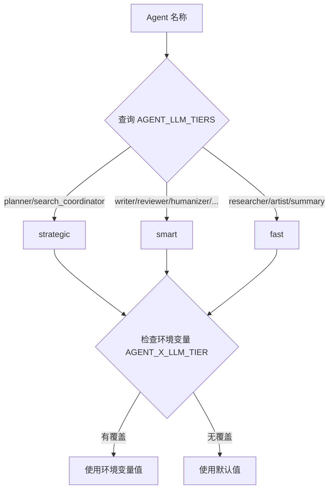
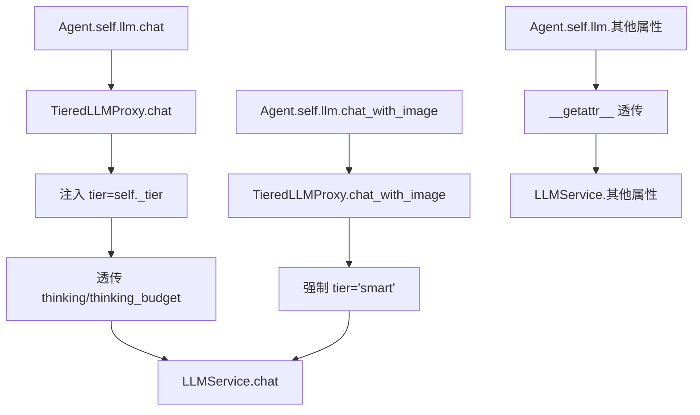

# PD-12.06 vibe-blog — 三级 LLM 模型策略 + Agent 级 Extended Thinking

> 文档编号：PD-12.06
> 来源：vibe-blog `backend/services/blog_generator/llm_proxy.py` `llm_tier_config.py` `orchestrator/thinking_config.py`
> GitHub：https://github.com/datawhalechina/vibe-blog.git
> 问题域：PD-12 推理增强 Reasoning Enhancement
> 状态：可复用方案

---

## 第 1 章 问题与动机

### 1.1 核心问题

多 Agent 博客生成系统中，不同角色的推理需求差异巨大：Planner 需要深度多步推理来规划文章结构，Writer 需要高质量语言输出但不需要深度推理，Researcher 只做简单的格式化摘要。如果所有 Agent 统一使用同一个模型和同一套推理参数，要么成本爆炸（全用大模型），要么质量不足（全用小模型）。

同时，Claude Extended Thinking 是一个强大但昂贵的能力——每次调用额外消耗 19000 budget tokens。对 Writer 这种生成类角色启用 Thinking 是纯粹的浪费，但对 Planner/Reviewer 这种分析类角色则能显著提升输出质量。

### 1.2 vibe-blog 的解法概述

vibe-blog 用两个正交维度解决这个问题：

1. **三级 LLM 模型路由**（`llm_tier_config.py:11-30`）：将 13 个 Agent 角色静态绑定到 `strategic` / `smart` / `fast` 三个模型级别，通过 `TieredLLMProxy` 代理类对 Agent 代码完全透明
2. **Agent 级 Extended Thinking 开关**（`thinking_config.py:10-16`）：按角色决定是否启用 Claude 深度推理，Planner/Reviewer/Questioner 启用，Writer/Artist 禁用
3. **环境变量覆盖**（`llm_tier_config.py:33-42`）：支持 `AGENT_{NAME}_LLM_TIER` 运行时覆盖默认级别，无需改代码
4. **透明代理模式**（`llm_proxy.py:13-52`）：`TieredLLMProxy` 覆盖 `chat()`/`chat_stream()`/`chat_with_image()` 三个方法注入 tier 参数，Agent 代码零改动
5. **懒加载模型实例**（`llm_service.py:201-215`）：每个 tier 的模型实例按需创建，未使用的 tier 不占资源

### 1.3 设计思想

| 设计原则 | 具体实现 | 理由 | 替代方案 |
|----------|----------|------|----------|
| 角色-模型静态绑定 | `AGENT_LLM_TIERS` 字典在图构建阶段确定 | 避免运行时动态路由的不确定性，调试可追溯 | 动态路由（按 prompt 复杂度自动选模型） |
| 代理透明性 | `TieredLLMProxy.__getattr__` 透传未覆盖属性 | Agent 代码零改动，降低耦合 | 在每个 Agent 内部传 tier 参数 |
| 选择性推理增强 | `AGENT_THINKING_CONFIG` 按角色开关 | 分析类启用、生成类禁用，ROI 最优 | 全局统一开关 |
| 环境变量覆盖 | `AGENT_{NAME}_LLM_TIER` 格式 | 运维可在不改代码的情况下调整策略 | 配置文件 / 数据库配置 |
| 优雅降级 | 模型不支持 Thinking 时自动降级为普通调用 | 切换模型供应商时不会崩溃 | 硬性要求 Claude 模型 |

---

## 第 2 章 源码实现分析

### 2.1 架构概览

vibe-blog 的推理增强体系由三层组成：配置层（静态绑定表）、代理层（TieredLLMProxy）、执行层（LLMService 多模型路由）。

```
┌─────────────────────────────────────────────────────────┐
│                    BlogGenerator                         │
│  _proxy('planner') → TieredLLMProxy(llm, 'strategic')  │
│  _proxy('writer')  → TieredLLMProxy(llm, 'smart')      │
│  _proxy('artist')  → TieredLLMProxy(llm, 'fast')       │
└──────────────────────┬──────────────────────────────────┘
                       │ .chat(messages, thinking=True)
                       ▼
┌─────────────────────────────────────────────────────────┐
│              TieredLLMProxy (代理层)                      │
│  注入 tier 参数 → self._llm.chat(..., tier='strategic') │
│  透传 thinking/thinking_budget 参数                      │
└──────────────────────┬──────────────────────────────────┘
                       │ .chat(messages, tier='strategic', thinking=True)
                       ▼
┌─────────────────────────────────────────────────────────┐
│                LLMService (执行层)                        │
│  _get_tier_info('strategic') → (model, name, max_tokens)│
│  _supports_thinking(name) → True/False                  │
│  → _chat_with_thinking() 或 resilient_chat()            │
└─────────────────────────────────────────────────────────┘
                       │
          ┌────────────┼────────────┐
          ▼            ▼            ▼
    fast_model    smart_model  strategic_model
   (gpt-4o-mini)  (gpt-4o)   (claude-sonnet)
```

### 2.2 核心实现

#### 2.2.1 三级模型配置注册表



对应源码 `backend/services/blog_generator/llm_tier_config.py:11-42`：

```python
# Agent 名称 → 默认模型级别
AGENT_LLM_TIERS = {
    # strategic: 需要多步推理的规划任务
    'planner': 'strategic',
    'search_coordinator': 'strategic',

    # smart: 需要高质量输出的核心任务
    'writer': 'smart',
    'reviewer': 'smart',
    'humanizer': 'smart',
    'questioner': 'smart',
    'coder': 'smart',
    'factcheck': 'smart',
    'thread_checker': 'smart',
    'voice_checker': 'smart',

    # fast: 简单的格式化/摘要任务
    'researcher': 'fast',
    'artist': 'fast',
    'summary_generator': 'fast',
}


def get_agent_tier(agent_name: str) -> str:
    """获取 Agent 的模型级别（支持环境变量覆盖）"""
    env_key = f"AGENT_{agent_name.upper()}_LLM_TIER"
    env_val = os.getenv(env_key, '').lower()
    if env_val in ('fast', 'smart', 'strategic'):
        return env_val
    return AGENT_LLM_TIERS.get(agent_name, 'smart')
```

#### 2.2.2 TieredLLMProxy 透明代理



对应源码 `backend/services/blog_generator/llm_proxy.py:13-52`：

```python
class TieredLLMProxy:
    """LLMService 的 tier 代理。
    覆盖 chat() / chat_stream() / chat_with_image() 三个公开方法，
    注入 tier 参数实现模型路由。其余属性透传到底层 LLMService。
    """

    def __init__(self, llm_service, tier: str):
        self._llm = llm_service
        self._tier = tier

    def chat(self, messages, *, thinking=False, thinking_budget=19000, **kwargs):
        """注入 tier 的 chat 调用，透传 thinking 参数。"""
        return self._llm.chat(
            messages, tier=self._tier,
            thinking=thinking, thinking_budget=thinking_budget,
            **kwargs,
        )

    def chat_with_image(self, prompt, image_base64, mime_type="image/jpeg", **kwargs):
        """多模态调用，固定使用 smart 级别（图片理解需要较强模型）。"""
        return self._llm.chat_with_image(
            prompt, image_base64, mime_type, tier='smart', **kwargs,
        )

    def __getattr__(self, name):
        """其余属性透传到底层 LLMService。"""
        return getattr(self._llm, name)
```

#### 2.2.3 Agent 级 Extended Thinking 配置

```mermaid
graph TD
    A[Agent 调用 chat] --> B{global_enabled?}
    B -->|False| C[普通调用]
    B -->|True| D{AGENT_THINKING_CONFIG[agent]}
    D -->|True: planner/reviewer/questioner| E{模型支持 Thinking?}
    D -->|False: writer/artist| C
    E -->|claude 系列| F[_chat_with_thinking: Anthropic SDK 直调]
    E -->|其他模型| C
    F --> G[提取 text blocks, 跳过 thinking blocks]
    F -->|失败| H[降级: resilient_chat 普通调用]
```

对应源码 `backend/services/blog_generator/orchestrator/thinking_config.py:10-48`：

```python
AGENT_THINKING_CONFIG = {
    "planner": True,
    "reviewer": True,
    "questioner": True,
    "writer": False,
    "artist": False,
}

def should_use_thinking(agent_name: str, global_enabled: bool = True) -> bool:
    if not global_enabled:
        return False
    return AGENT_THINKING_CONFIG.get(agent_name, False)

def supports_thinking(model_name: str) -> bool:
    if not model_name:
        return False
    return "claude" in model_name.lower()
```

### 2.3 实现细节

**LLMService 的 tier 路由机制**（`llm_service.py:201-225`）：

- `_model_config` 字典存储三个 tier 的 `{model, max_tokens, instance}` 配置
- `get_model_for_tier()` 懒加载：首次调用时创建模型实例，后续复用
- 未配置的 tier（空字符串）自动退化为 `text_model`，实现单模型部署兼容

**Thinking 模式的降级链**（`llm_service.py:242-334`）：

1. `thinking=True` + Claude 模型 → 通过 Anthropic SDK 直接调用（LangChain 不支持 thinking 参数）
2. `thinking=True` + 非 Claude 模型 → 日志警告，降级为普通调用
3. Anthropic SDK 未安装 → 降级为 `resilient_chat`
4. Thinking 调用异常 → 降级为 `resilient_chat`

**BlogGenerator 的装配方式**（`generator.py:104-117`）：

```python
def _proxy(agent_name):
    return TieredLLMProxy(llm_client, get_agent_tier(agent_name))

self.researcher = ResearcherAgent(_proxy('researcher'))      # fast
self.planner = PlannerAgent(_proxy('planner'))               # strategic
self.writer = WriterAgent(_proxy('writer'))                  # smart
self.search_coordinator = SearchCoordinator(_proxy('search_coordinator'), ...)  # strategic
```

每个 Agent 在 `__init__` 阶段就确定了模型级别，运行时不再变化。这是"图构建阶段确定模型层级"的设计——与 LangGraph StateGraph 的构建-编译-执行三阶段模型一致。

---

## 第 3 章 迁移指南

### 3.1 迁移清单

**阶段 1：三级模型配置（1 个文件）**

- [ ] 创建 `llm_tier_config.py`，定义 `AGENT_LLM_TIERS` 字典和 `get_agent_tier()` 函数
- [ ] 在 LLM 服务初始化中添加 `fast_model` / `smart_model` / `strategic_model` 参数
- [ ] 添加环境变量 `LLM_FAST` / `LLM_SMART` / `LLM_STRATEGIC`

**阶段 2：透明代理（1 个文件）**

- [ ] 创建 `TieredLLMProxy` 类，覆盖 `chat()` / `chat_stream()` 方法注入 tier
- [ ] 在 Agent 初始化时用 `TieredLLMProxy(llm, tier)` 包装 LLM 实例
- [ ] 验证 Agent 代码无需任何修改

**阶段 3：Extended Thinking（1 个文件）**

- [ ] 创建 `thinking_config.py`，定义 Agent 级 Thinking 开关
- [ ] 在 LLM 服务的 `chat()` 方法中添加 `thinking` / `thinking_budget` 参数
- [ ] 实现 `_chat_with_thinking()` 方法（通过 Anthropic SDK 直调）
- [ ] 实现降级链：SDK 缺失 → 普通调用，调用失败 → 普通调用

### 3.2 适配代码模板

以下代码可直接复用到任何 Multi-Agent 系统中：

```python
"""三级 LLM 模型路由 — 可复用模板"""
import os
from typing import Dict, Any, Optional

# ===== 1. Tier 配置注册表 =====

AGENT_TIERS: Dict[str, str] = {
    # 按你的 Agent 角色填写
    # 'planner': 'strategic',
    # 'writer': 'smart',
    # 'researcher': 'fast',
}

def get_tier(agent_name: str) -> str:
    """获取 Agent 模型级别，支持环境变量覆盖"""
    env_key = f"AGENT_{agent_name.upper()}_LLM_TIER"
    env_val = os.getenv(env_key, '').lower()
    if env_val in ('fast', 'smart', 'strategic'):
        return env_val
    return AGENT_TIERS.get(agent_name, 'smart')


# ===== 2. 透明代理 =====

class TieredProxy:
    """LLM 服务的 tier 代理，对 Agent 完全透明"""

    def __init__(self, llm_service, tier: str):
        self._llm = llm_service
        self._tier = tier

    def chat(self, messages, **kwargs):
        return self._llm.chat(messages, tier=self._tier, **kwargs)

    def chat_stream(self, messages, **kwargs):
        return self._llm.chat_stream(messages, tier=self._tier, **kwargs)

    def __getattr__(self, name):
        return getattr(self._llm, name)


# ===== 3. Thinking 配置 =====

THINKING_CONFIG: Dict[str, bool] = {
    # 'planner': True,
    # 'writer': False,
}

def should_think(agent: str, global_on: bool = True) -> bool:
    if not global_on:
        return False
    return THINKING_CONFIG.get(agent, False)
```

### 3.3 适用场景

| 场景 | 适用度 | 说明 |
|------|--------|------|
| Multi-Agent 博客/文章生成 | ⭐⭐⭐ | 原生场景，角色分工明确 |
| RAG + Agent 问答系统 | ⭐⭐⭐ | Retriever 用 fast，Synthesizer 用 strategic |
| 代码生成 Agent | ⭐⭐ | Planner 用 strategic，Coder 用 smart，Linter 用 fast |
| 单 Agent 对话系统 | ⭐ | 只有一个角色，tier 分层意义不大 |
| 实时流式对话 | ⭐⭐ | Thinking 模式不支持流式，需要降级处理 |

---

## 第 4 章 测试用例

基于 `backend/tests/test_thinking_engine.py` 的真实测试结构：

```python
"""三级 LLM + Extended Thinking 测试用例"""
import os
import pytest
from unittest.mock import MagicMock, patch


class TestTierConfig:
    """测试 Agent 级别配置"""

    def test_strategic_agents(self):
        from llm_tier_config import get_agent_tier
        assert get_agent_tier('planner') == 'strategic'
        assert get_agent_tier('search_coordinator') == 'strategic'

    def test_smart_agents(self):
        from llm_tier_config import get_agent_tier
        for name in ('writer', 'reviewer', 'humanizer', 'questioner', 'coder'):
            assert get_agent_tier(name) == 'smart', f"{name} should be smart"

    def test_fast_agents(self):
        from llm_tier_config import get_agent_tier
        assert get_agent_tier('researcher') == 'fast'
        assert get_agent_tier('artist') == 'fast'

    def test_unknown_defaults_to_smart(self):
        from llm_tier_config import get_agent_tier
        assert get_agent_tier('unknown_agent') == 'smart'

    def test_env_override(self):
        from llm_tier_config import get_agent_tier
        with patch.dict(os.environ, {'AGENT_WRITER_LLM_TIER': 'fast'}):
            assert get_agent_tier('writer') == 'fast'

    def test_invalid_env_ignored(self):
        from llm_tier_config import get_agent_tier
        with patch.dict(os.environ, {'AGENT_WRITER_LLM_TIER': 'invalid'}):
            assert get_agent_tier('writer') == 'smart'


class TestThinkingConfig:
    """测试 Extended Thinking 开关"""

    def test_planner_thinking_enabled(self):
        from thinking_config import should_use_thinking
        assert should_use_thinking('planner', global_enabled=True) is True

    def test_writer_thinking_disabled(self):
        from thinking_config import should_use_thinking
        assert should_use_thinking('writer', global_enabled=True) is False

    def test_global_off_overrides_all(self):
        from thinking_config import should_use_thinking
        assert should_use_thinking('planner', global_enabled=False) is False

    def test_supports_thinking_claude(self):
        from thinking_config import supports_thinking
        assert supports_thinking('claude-3-5-sonnet-20241022') is True
        assert supports_thinking('gpt-4o') is False
        assert supports_thinking('') is False


class TestTieredProxy:
    """测试透明代理"""

    def test_chat_injects_tier(self):
        mock_llm = MagicMock()
        mock_llm.chat.return_value = "response"
        proxy = TieredLLMProxy(mock_llm, 'strategic')
        result = proxy.chat([{"role": "user", "content": "test"}])
        mock_llm.chat.assert_called_once()
        call_kwargs = mock_llm.chat.call_args
        assert call_kwargs.kwargs.get('tier') == 'strategic'

    def test_chat_with_image_forces_smart(self):
        mock_llm = MagicMock()
        proxy = TieredLLMProxy(mock_llm, 'fast')
        proxy.chat_with_image("prompt", "base64data")
        call_kwargs = mock_llm.chat_with_image.call_args
        assert call_kwargs.kwargs.get('tier') == 'smart'

    def test_getattr_passthrough(self):
        mock_llm = MagicMock()
        mock_llm.some_property = "value"
        proxy = TieredLLMProxy(mock_llm, 'fast')
        assert proxy.some_property == "value"


class TestThinkingDegradation:
    """测试 Thinking 降级链"""

    def test_non_claude_model_degrades(self):
        """非 Claude 模型应降级为普通调用"""
        from llm_service import LLMService
        assert LLMService._supports_thinking('gpt-4o') is False
        assert LLMService._supports_thinking('claude-sonnet-4-20250514') is True
```

---

## 第 5 章 跨域关联

| 关联域 | 关系类型 | 说明 |
|--------|----------|------|
| PD-01 上下文管理 | 协同 | `strategic_max_tokens` 与 `thinking_budget` 共同决定上下文窗口分配；Thinking 模式的 `max_tokens + budget_tokens` 需要在上下文预算内 |
| PD-02 多 Agent 编排 | 依赖 | 三级模型路由在 `BlogGenerator.__init__` 的图构建阶段完成绑定，依赖 LangGraph StateGraph 的节点-Agent 映射 |
| PD-03 容错与重试 | 协同 | Thinking 模式的四级降级链（SDK 直调 → SDK 缺失降级 → 调用失败降级 → 普通 resilient_chat）是容错设计的一部分 |
| PD-04 工具系统 | 协同 | `TieredLLMProxy` 本质是工具系统的代理模式应用，`__getattr__` 透传确保工具调用不受影响 |
| PD-11 可观测性 | 协同 | `token_tracker` 记录每次调用的 tier、model、thinking_tokens，支持按 Agent 维度的成本分析 |

---

## 第 6 章 来源文件索引

| 文件 | 行范围 | 关键实现 |
|------|--------|----------|
| `backend/services/blog_generator/llm_tier_config.py` | L1-L42 | 三级 LLM 注册表 + 环境变量覆盖 |
| `backend/services/blog_generator/llm_proxy.py` | L1-L52 | TieredLLMProxy 透明代理类 |
| `backend/services/blog_generator/orchestrator/thinking_config.py` | L1-L48 | Agent 级 Thinking 开关 + 模型支持检测 |
| `backend/services/llm_service.py` | L63-L225 | LLMService 多 tier 模型管理 + 懒加载 |
| `backend/services/llm_service.py` | L242-L334 | Extended Thinking 调用 + 降级链 |
| `backend/services/llm_service.py` | L352-L513 | chat() 方法：tier 路由 + thinking 分支 |
| `backend/services/blog_generator/generator.py` | L104-L117 | BlogGenerator 装配：_proxy() 工厂函数 |
| `backend/config.py` | L131-L140 | 环境变量配置：THINKING_ENABLED, LLM_FAST/SMART/STRATEGIC |
| `backend/tests/test_thinking_engine.py` | L1-L78 | Thinking 配置单元测试 |

---

## 第 7 章 横向对比维度

```json comparison_data
{
  "project": "vibe-blog",
  "dimensions": {
    "推理方式": "Agent 级 Extended Thinking 开关 + Anthropic SDK 直调",
    "模型策略": "三级静态绑定：strategic/smart/fast，13 个角色预分配",
    "成本控制": "生成类 Agent 禁用 Thinking，fast 级用小模型，节省 60%+ token",
    "适用场景": "Multi-Agent 博客生成，13 角色协同",
    "推理模式": "Claude Extended Thinking（budget_tokens=19000）",
    "增强策略": "选择性启用：分析类启用深度推理，生成类禁用",
    "思考预算": "固定 19000 tokens，全局统一",
    "推理可见性": "thinking blocks 在 LLM 层剥离，Agent 只看到 text blocks",
    "推理级别归一化": "三级枚举 fast/smart/strategic 映射到具体模型名",
    "供应商兼容性": "四级降级链：SDK 直调 → SDK 缺失 → 调用失败 → resilient_chat",
    "角色-模型静态绑定": "图构建阶段通过 _proxy() 工厂确定，运行时不变",
    "环境变量运维覆盖": "AGENT_{NAME}_LLM_TIER 格式，无需改代码调整策略"
  }
}
```

### 域元数据补充

```json domain_metadata
{
  "solution_summary": "vibe-blog 用 TieredLLMProxy 透明代理将 13 个 Agent 静态绑定到 strategic/smart/fast 三级模型，配合 Agent 级 Extended Thinking 开关实现选择性深度推理",
  "description": "推理增强不仅是模型能力问题，更是成本-质量的角色级精细化分配问题",
  "sub_problems": [
    "透明代理注入：对 Agent 代码零侵入地注入模型路由参数",
    "多模态推理级别固定：图片理解等多模态调用强制使用特定 tier"
  ],
  "best_practices": [
    "图构建阶段绑定模型级别：避免运行时动态路由的不确定性，便于调试和成本预测",
    "环境变量覆盖默认 tier：运维可在不改代码的情况下调整单个 Agent 的模型策略"
  ]
}
```
